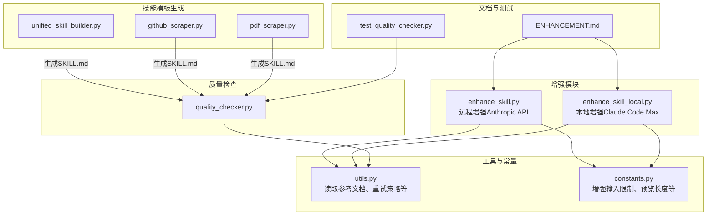
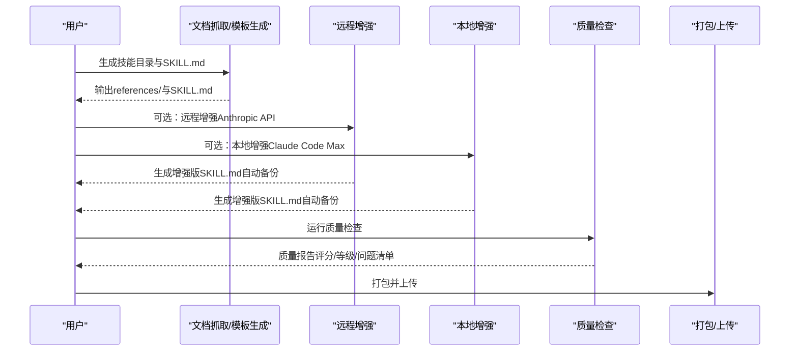
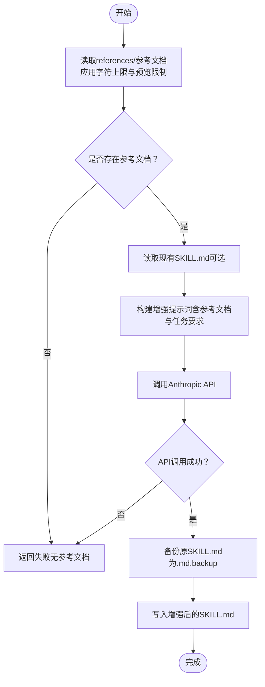
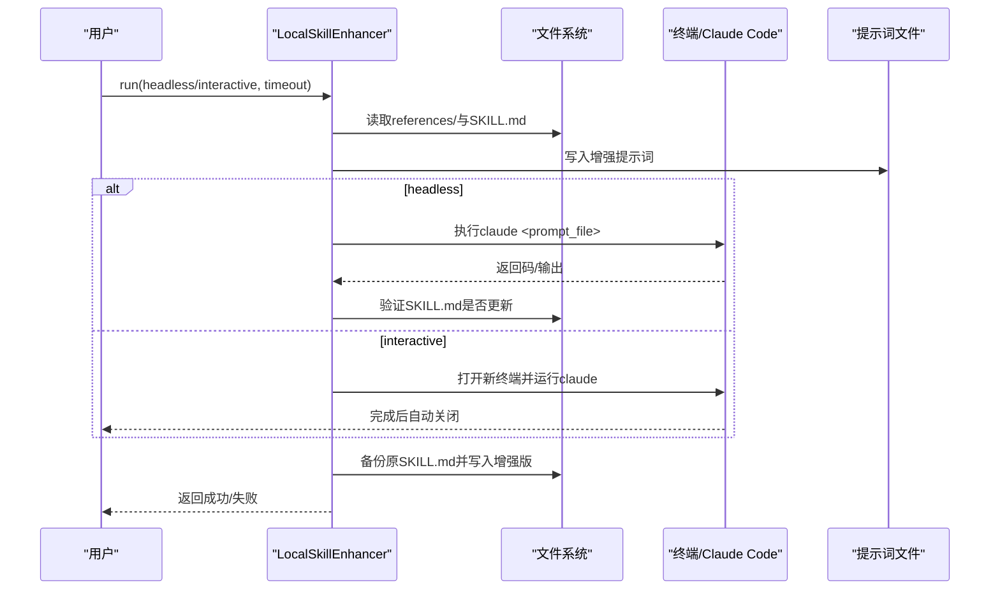
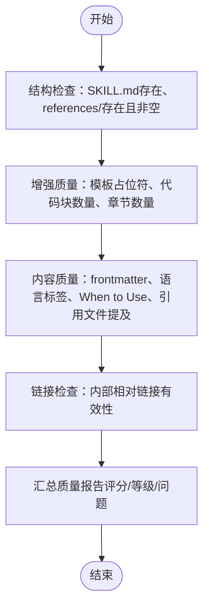
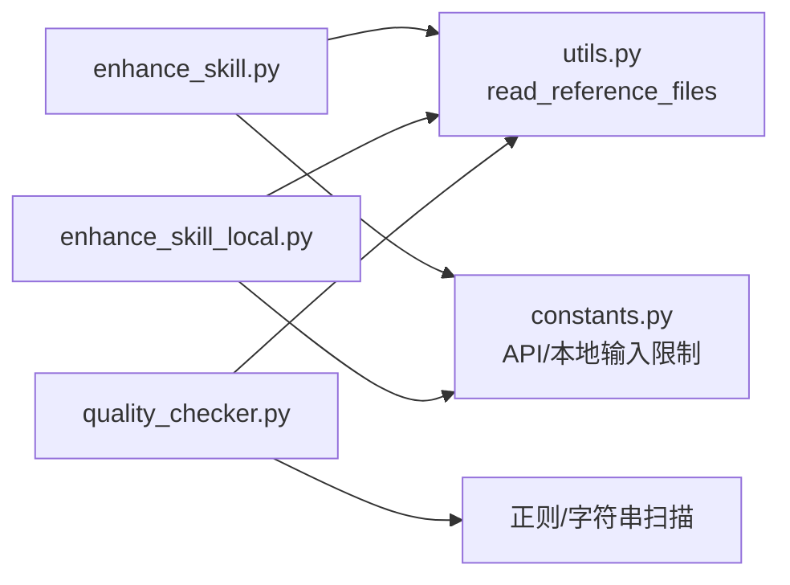

# AI增强与质量保证

<cite>
**本文引用的文件列表**
- [enhance_skill.py](file://src/skill_seekers/cli/enhance_skill.py)
- [enhance_skill_local.py](file://src/skill_seekers/cli/enhance_skill_local.py)
- [quality_checker.py](file://src/skill_seekers/cli/quality_checker.py)
- [constants.py](file://src/skill_seekers/cli/constants.py)
- [utils.py](file://src/skill_seekers/cli/utils.py)
- [ENHANCEMENT.md](file://docs/ENHANCEMENT.md)
- [test_quality_checker.py](file://tests/test_quality_checker.py)
- [unified_skill_builder.py](file://src/skill_seekers/cli/unified_skill_builder.py)
- [github_scraper.py](file://src/skill_seekers/cli/github_scraper.py)
- [pdf_scraper.py](file://src/skill_seekers/cli/pdf_scraper.py)
</cite>

## 目录
1. [简介](#简介)
2. [项目结构](#项目结构)
3. [核心组件](#核心组件)
4. [架构总览](#架构总览)
5. [详细组件分析](#详细组件分析)
6. [依赖关系分析](#依赖关系分析)
7. [性能与成本考量](#性能与成本考量)
8. [故障排查指南](#故障排查指南)
9. [结论](#结论)
10. [附录](#附录)

## 简介
本文件系统性阐述两类AI增强能力：
- 远程增强：基于Anthropic API的云端增强（enhance_skill.py）
- 本地增强：基于Claude Code Max的本地增强（enhance_skill_local.py）

并说明质量检查器（quality_checker.py）如何对技能内容进行多维质量评估，包括结构完整性、内容规范性、链接有效性与增强质量验证。文档还给出增强与质量检查在技能生命周期中的位置、使用场景、性能与成本权衡，以及增强前后的对比示例与最佳实践建议。

## 项目结构
围绕“技能”构建流程，关键目录与文件如下：
- 增强脚本：remote（enhance_skill.py）、local（enhance_skill_local.py）
- 质量检查：quality_checker.py
- 工具与常量：utils.py、constants.py
- 文档与示例：ENHANCEMENT.md
- 测试：tests/test_quality_checker.py
- 技能模板生成：unified_skill_builder.py、github_scraper.py、pdf_scraper.py

图表来源
- [enhance_skill.py](file://src/skill_seekers/cli/enhance_skill.py#L1-L274)
- [enhance_skill_local.py](file://src/skill_seekers/cli/enhance_skill_local.py#L1-L452)
- [quality_checker.py](file://src/skill_seekers/cli/quality_checker.py#L1-L481)
- [utils.py](file://src/skill_seekers/cli/utils.py#L182-L234)
- [constants.py](file://src/skill_seekers/cli/constants.py#L25-L34)
- [ENHANCEMENT.md](file://docs/ENHANCEMENT.md#L1-L251)
- [test_quality_checker.py](file://tests/test_quality_checker.py#L1-L298)
- [unified_skill_builder.py](file://src/skill_seekers/cli/unified_skill_builder.py#L72-L91)
- [github_scraper.py](file://src/skill_seekers/cli/github_scraper.py#L671-L692)
- [pdf_scraper.py](file://src/skill_seekers/cli/pdf_scraper.py#L271-L289)

章节来源
- [enhance_skill.py](file://src/skill_seekers/cli/enhance_skill.py#L1-L274)
- [enhance_skill_local.py](file://src/skill_seekers/cli/enhance_skill_local.py#L1-L452)
- [quality_checker.py](file://src/skill_seekers/cli/quality_checker.py#L1-L481)
- [utils.py](file://src/skill_seekers/cli/utils.py#L182-L234)
- [constants.py](file://src/skill_seekers/cli/constants.py#L25-L34)
- [ENHANCEMENT.md](file://docs/ENHANCEMENT.md#L1-L251)
- [test_quality_checker.py](file://tests/test_quality_checker.py#L1-L298)
- [unified_skill_builder.py](file://src/skill_seekers/cli/unified_skill_builder.py#L72-L91)
- [github_scraper.py](file://src/skill_seekers/cli/github_scraper.py#L671-L692)
- [pdf_scraper.py](file://src/skill_seekers/cli/pdf_scraper.py#L271-L289)

## 核心组件
- 远程增强（enhance_skill.py）
  - 使用Anthropic API，通过构建提示词，将参考文档与现有SKILL.md送入模型，生成更高质量的SKILL.md，并自动备份原文件。
  - 支持干运行（--dry-run）、环境变量或命令行参数传入API密钥。
- 本地增强（enhance_skill_local.py）
  - 使用Claude Code Max，支持无API密钥的本地增强；可headless运行或打开新终端交互式增强。
  - 自动检测终端类型（macOS），支持超时控制与错误处理。
- 质量检查（quality_checker.py）
  - 检查结构完整性（SKILL.md存在性、references目录存在性）、增强质量（模板占位符、代码块数量、章节数量）、内容规范（YAML frontmatter、语言标签、When to Use、引用文件提及）、链接有效性（内部链接校验）。
  - 提供质量评分与等级，支持严格模式退出码。

章节来源
- [enhance_skill.py](file://src/skill_seekers/cli/enhance_skill.py#L196-L274)
- [enhance_skill_local.py](file://src/skill_seekers/cli/enhance_skill_local.py#L35-L120)
- [quality_checker.py](file://src/skill_seekers/cli/quality_checker.py#L94-L160)

## 架构总览
增强与质量检查在技能生命周期中的位置如下：

图表来源
- [github_scraper.py](file://src/skill_seekers/cli/github_scraper.py#L671-L692)
- [pdf_scraper.py](file://src/skill_seekers/cli/pdf_scraper.py#L271-L289)
- [unified_skill_builder.py](file://src/skill_seekers/cli/unified_skill_builder.py#L72-L91)
- [enhance_skill.py](file://src/skill_seekers/cli/enhance_skill.py#L144-L194)
- [enhance_skill_local.py](file://src/skill_seekers/cli/enhance_skill_local.py#L169-L291)
- [quality_checker.py](file://src/skill_seekers/cli/quality_checker.py#L111-L129)

## 详细组件分析

### 远程增强（enhance_skill.py）
- 输入与限制
  - 从技能目录的references/读取参考文档，受API内容上限与预览长度限制。
  - 若未提供API密钥，会提示设置环境变量或命令行参数。
- 处理逻辑
  - 构建提示词：包含当前SKILL.md与所有参考文档片段，明确任务目标（When to Use、Quick Reference、Reference Files描述、Working with This Skill、Key Concepts等）。
  - 调用Anthropic API，返回增强后的内容。
  - 自动备份原SKILL.md为.md.backup，再写入新的增强版本。
- 错误处理
  - 缺少参考文档、API调用失败、未找到目录等情况均有明确提示与返回值。

图表来源
- [enhance_skill.py](file://src/skill_seekers/cli/enhance_skill.py#L144-L194)
- [utils.py](file://src/skill_seekers/cli/utils.py#L182-L234)
- [constants.py](file://src/skill_seekers/cli/constants.py#L25-L34)

章节来源
- [enhance_skill.py](file://src/skill_seekers/cli/enhance_skill.py#L48-L143)
- [utils.py](file://src/skill_seekers/cli/utils.py#L182-L234)
- [constants.py](file://src/skill_seekers/cli/constants.py#L25-L34)

### 本地增强（enhance_skill_local.py）
- 终端选择与启动
  - 自动检测终端类型（优先环境变量、其次当前终端、最后默认Terminal.app），支持macOS自动打开新终端窗口。
  - 支持headless模式直接运行Claude命令并等待完成，或交互模式打开终端窗口。
- 提示词与保存
  - 读取参考文档与现有SKILL.md，构建增强提示词，明确任务要求与保存路径。
  - 增强完成后自动备份原SKILL.md，并将结果写回同一路径。
- 超时与错误处理
  - 支持自定义超时；超时、命令不存在、增强未更新等场景均有清晰提示与返回值。

图表来源
- [enhance_skill_local.py](file://src/skill_seekers/cli/enhance_skill_local.py#L169-L291)
- [enhance_skill_local.py](file://src/skill_seekers/cli/enhance_skill_local.py#L293-L401)

章节来源
- [enhance_skill_local.py](file://src/skill_seekers/cli/enhance_skill_local.py#L35-L120)
- [enhance_skill_local.py](file://src/skill_seekers/cli/enhance_skill_local.py#L169-L291)
- [enhance_skill_local.py](file://src/skill_seekers/cli/enhance_skill_local.py#L293-L401)

### 质量检查（quality_checker.py）
- 结构检查
  - 必须存在SKILL.md；references/目录存在且包含至少一个.md文件。
- 增强质量验证
  - 模板占位符检测（如TODO、[Add description]等）。
  - 代码块数量阈值与章节数量阈值，辅助判断是否需要进一步增强。
- 内容质量检查
  - YAML frontmatter必须以“---”开头，且包含name字段；若包含description则视为良好。
  - 代码块语言标签缺失将被警告；必须包含“When to Use This Skill”段落。
  - references/中存在但未在SKILL.md中提及的文件会被警告。
- 链接有效性
  - 内部相对链接校验，排除http(s)/锚点链接；不存在的文件标记为“破损链接”。

图表来源
- [quality_checker.py](file://src/skill_seekers/cli/quality_checker.py#L111-L129)
- [quality_checker.py](file://src/skill_seekers/cli/quality_checker.py#L156-L221)
- [quality_checker.py](file://src/skill_seekers/cli/quality_checker.py#L223-L321)

章节来源
- [quality_checker.py](file://src/skill_seekers/cli/quality_checker.py#L94-L160)
- [quality_checker.py](file://src/skill_seekers/cli/quality_checker.py#L156-L221)
- [quality_checker.py](file://src/skill_seekers/cli/quality_checker.py#L223-L321)
- [test_quality_checker.py](file://tests/test_quality_checker.py#L41-L120)
- [test_quality_checker.py](file://tests/test_quality_checker.py#L174-L193)

## 依赖关系分析
- 增强脚本依赖
  - utils.read_reference_files：统一读取references/下的Markdown文件，按字符上限与预览长度截断，避免超出模型输入限制。
  - constants：集中管理API与本地增强的字符上限与预览长度，确保不同模式下输入规模可控。
- 质量检查依赖
  - 正则匹配与字符串扫描用于frontmatter解析、代码块语言标签识别、内部链接校验。
  - 测试用例覆盖了缺失frontmatter、缺少name字段、代码块无语言标签、破损链接等常见问题。

图表来源
- [enhance_skill.py](file://src/skill_seekers/cli/enhance_skill.py#L144-L194)
- [enhance_skill_local.py](file://src/skill_seekers/cli/enhance_skill_local.py#L169-L291)
- [quality_checker.py](file://src/skill_seekers/cli/quality_checker.py#L223-L321)
- [utils.py](file://src/skill_seekers/cli/utils.py#L182-L234)
- [constants.py](file://src/skill_seekers/cli/constants.py#L25-L34)

章节来源
- [utils.py](file://src/skill_seekers/cli/utils.py#L182-L234)
- [constants.py](file://src/skill_seekers/cli/constants.py#L25-L34)

## 性能与成本考量
- 输入规模与成本
  - 远程增强：根据文档估算，输入约数万到数十万tokens，输出约数千tokens，模型为claude-sonnet-4-20250514，单次增强成本约$0.15-$0.30。
  - 本地增强：无需API费用，但依赖Claude Code Max计划；耗时约30-60秒。
- 限制与节流
  - constants中分别定义了API与本地增强的最大字符数与预览长度，避免一次性发送过多内容导致超限或超时。
- 并发与稳定性
  - utils.retry_with_backoff/retry_with_backoff_async可用于网络请求的指数退避重试，提高稳定性。
- 性能权衡
  - 远程增强：成本较高但自动化程度高，适合大规模技能批量增强。
  - 本地增强：成本为零，但需安装Claude Code CLI并在macOS上自动打开终端（其他平台需手动）。

章节来源
- [ENHANCEMENT.md](file://docs/ENHANCEMENT.md#L127-L133)
- [constants.py](file://src/skill_seekers/cli/constants.py#L25-L34)
- [utils.py](file://src/skill_seekers/cli/utils.py#L236-L344)

## 故障排查指南
- 远程增强（enhance_skill.py）
  - 缺少API密钥：设置环境变量或使用--api-key参数。
  - 未找到references/或SKILL.md：确认已先运行抓取/模板生成流程。
  - API调用失败：检查网络、密钥权限与模型可用性。
- 本地增强（enhance_skill_local.py）
  - 无法找到claude命令：确认已安装Claude Code CLI。
  - macOS自动打开终端失败：检查终端映射与权限；可在其他平台手动运行提示词文件。
  - 超时：增大--timeout或减少references/内容大小。
- 质量检查（quality_checker.py）
  - 缺失SKILL.md：先运行模板生成或增强流程。
  - frontmatter不合法：确保以“---”开头并包含name字段。
  - 代码块无语言标签：为每个代码块添加语言标识。
  - 破损链接：修正相对路径或创建对应文件。

章节来源
- [enhance_skill.py](file://src/skill_seekers/cli/enhance_skill.py#L233-L270)
- [enhance_skill_local.py](file://src/skill_seekers/cli/enhance_skill_local.py#L388-L401)
- [quality_checker.py](file://src/skill_seekers/cli/quality_checker.py#L230-L321)
- [test_quality_checker.py](file://tests/test_quality_checker.py#L41-L120)

## 结论
- 远程增强与本地增强均通过将参考文档与现有SKILL.md送入大语言模型，生成更实用、结构更完整的技能文档，并自动备份原文件以便回滚。
- 质量检查器提供结构、增强质量、内容规范与链接的有效性四维评估，结合评分与等级帮助团队持续改进技能质量。
- 在技能生命周期中，建议先抓取/生成模板，再进行增强，最后运行质量检查，确保最终输出可靠、一致且易于维护。

## 附录

### 增强前后对比示例（概念性说明）
- 增强前（通用模板）
  - Quick Reference为空或仅有占位符
  - 缺少When to Use、Key Concepts等关键段落
  - 代码示例稀少或无语言标签
- 增强后（AI生成）
  - 包含精选的5-10个真实代码示例，标注语言标签
  - 明确When to Use触发条件与导航指引
  - 详细描述Reference Files与Key Concepts
  - 保持YAML frontmatter完整与结构化

章节来源
- [ENHANCEMENT.md](file://docs/ENHANCEMENT.md#L91-L126)

### 技能模板生成（参考）
- 模板生成器会在技能目录下创建references/、scripts/、assets/等子目录，并生成基础SKILL.md（含YAML frontmatter与基本结构）。
- 增强与质量检查均以该基础SKILL.md为起点进行迭代优化。

章节来源
- [unified_skill_builder.py](file://src/skill_seekers/cli/unified_skill_builder.py#L56-L71)
- [unified_skill_builder.py](file://src/skill_seekers/cli/unified_skill_builder.py#L72-L91)
- [github_scraper.py](file://src/skill_seekers/cli/github_scraper.py#L671-L692)
- [pdf_scraper.py](file://src/skill_seekers/cli/pdf_scraper.py#L271-L289)