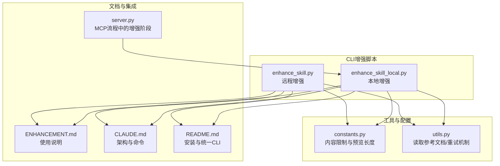
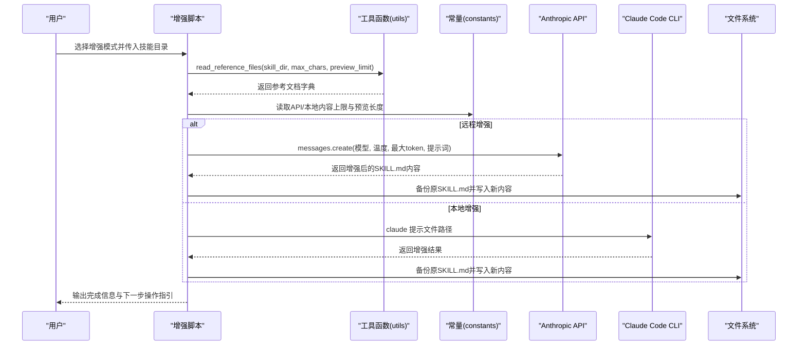
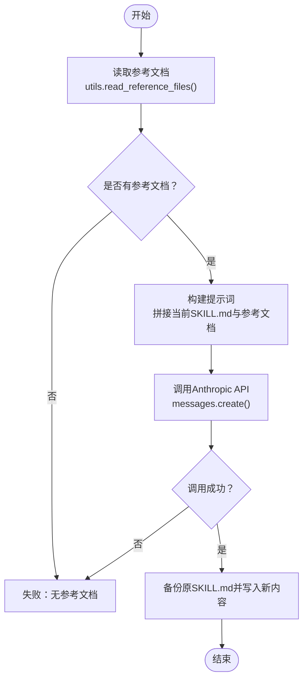
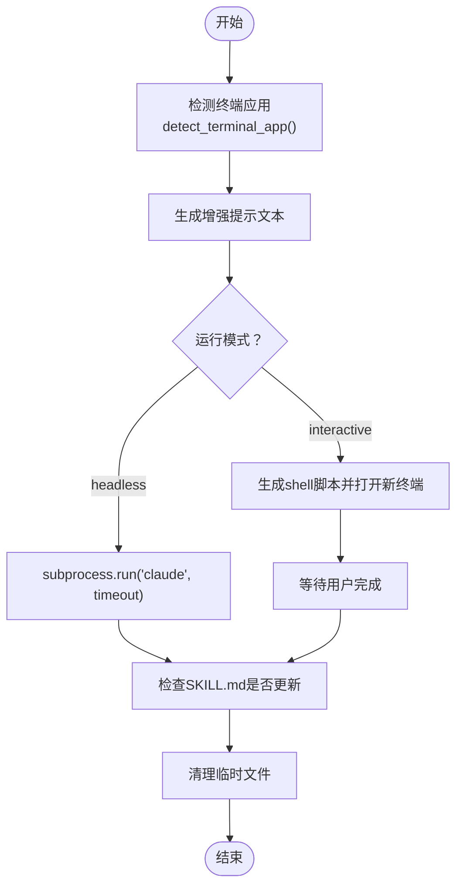
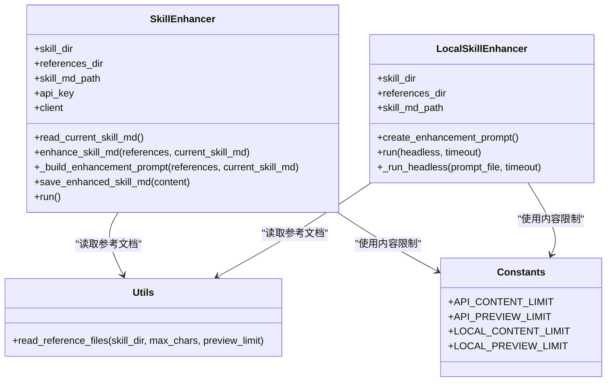
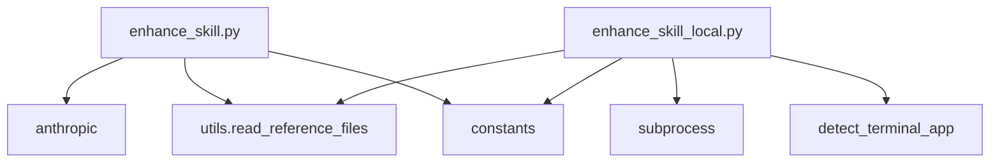

# AI增强机制

<cite>
**本文引用的文件**
- [enhance_skill.py](file://src/skill_seekers/cli/enhance_skill.py)
- [enhance_skill_local.py](file://src/skill_seekers/cli/enhance_skill_local.py)
- [constants.py](file://src/skill_seekers/cli/constants.py)
- [utils.py](file://src/skill_seekers/cli/utils.py)
- [ENHANCEMENT.md](file://docs/ENHANCEMENT.md)
- [CLAUDE.md](file://docs/CLAUDE.md)
- [README.md](file://README.md)
- [test_terminal_detection.py](file://tests/test_terminal_detection.py)
- [server.py](file://src/skill_seekers/mcp/server.py)
</cite>

## 目录
1. [简介](#简介)
2. [项目结构](#项目结构)
3. [核心组件](#核心组件)
4. [架构总览](#架构总览)
5. [详细组件分析](#详细组件分析)
6. [依赖关系分析](#依赖关系分析)
7. [性能与成本考量](#性能与成本考量)
8. [故障排查指南](#故障排查指南)
9. [结论](#结论)
10. [附录](#附录)

## 简介
本文件系统性说明两类AI增强模式：
- 远程增强（enhance_skill.py）：通过Anthropic API调用Claude模型，自动化优化SKILL.md内容。重点在于提示词工程、API请求构造、响应处理与内容保存。
- 本地增强（enhance_skill_local.py）：利用用户本地的Claude Code CLI工具，在无需API密钥的情况下通过终端自动化执行增强任务。重点在于终端检测逻辑（支持Ghostty、iTerm、Terminal、WezTerm等）、临时脚本生成、进程调用与超时处理机制。

同时对比两种模式的使用场景、性能特征、成本考量与安全边界；并给出大规模技能处理的批处理策略与错误恢复建议。

## 项目结构
与AI增强直接相关的文件组织如下：
- CLI增强脚本：src/skill_seekers/cli/enhance_skill.py、src/skill_seekers/cli/enhance_skill_local.py
- 常量配置：src/skill_seekers/cli/constants.py（包含API与本地增强的内容上限、预览长度等）
- 工具函数：src/skill_seekers/cli/utils.py（读取参考文档、重试机制等）
- 文档说明：docs/ENHANCEMENT.md、docs/CLAUDE.md、README.md
- 测试：tests/test_terminal_detection.py（终端检测与自动启动行为）
- MCP集成：src/skill_seekers/mcp/server.py（在MCP流程中强制执行本地增强）

图表来源
- [enhance_skill.py](file://src/skill_seekers/cli/enhance_skill.py#L1-L274)
- [enhance_skill_local.py](file://src/skill_seekers/cli/enhance_skill_local.py#L1-L452)
- [constants.py](file://src/skill_seekers/cli/constants.py#L1-L73)
- [utils.py](file://src/skill_seekers/cli/utils.py#L1-L344)
- [ENHANCEMENT.md](file://docs/ENHANCEMENT.md#L1-L251)
- [CLAUDE.md](file://docs/CLAUDE.md#L1-L401)
- [README.md](file://README.md#L1-L800)
- [server.py](file://src/skill_seekers/mcp/server.py#L1651-L1682)

章节来源
- [enhance_skill.py](file://src/skill_seekers/cli/enhance_skill.py#L1-L274)
- [enhance_skill_local.py](file://src/skill_seekers/cli/enhance_skill_local.py#L1-L452)
- [constants.py](file://src/skill_seekers/cli/constants.py#L1-L73)
- [utils.py](file://src/skill_seekers/cli/utils.py#L180-L234)
- [ENHANCEMENT.md](file://docs/ENHANCEMENT.md#L1-L251)
- [CLAUDE.md](file://docs/CLAUDE.md#L65-L83)
- [README.md](file://README.md#L120-L133)
- [server.py](file://src/skill_seekers/mcp/server.py#L1651-L1682)

## 核心组件
- 远程增强（enhance_skill.py）
  - 负责从环境变量或参数读取API密钥，初始化Anthropic客户端
  - 读取现有SKILL.md与references目录下的参考文档
  - 构建提示词（提示词工程），调用messages.create接口
  - 处理返回结果，备份原文件并写入新内容
- 本地增强（enhance_skill_local.py）
  - 检测当前终端（优先级：环境变量、TERM_PROGRAM、默认Terminal.app）
  - 生成增强提示文本，保存为临时文件
  - 支持headless模式（后台运行）与交互模式（打开新终端窗口）
  - 使用subprocess调用claude命令，带超时控制与错误处理
  - 验证SKILL.md是否被更新，清理临时文件

章节来源
- [enhance_skill.py](file://src/skill_seekers/cli/enhance_skill.py#L32-L194)
- [enhance_skill_local.py](file://src/skill_seekers/cli/enhance_skill_local.py#L35-L118)
- [enhance_skill_local.py](file://src/skill_seekers/cli/enhance_skill_local.py#L169-L291)
- [enhance_skill_local.py](file://src/skill_seekers/cli/enhance_skill_local.py#L293-L401)

## 架构总览
两种增强模式共享“读取参考文档→构建提示→生成SKILL.md”的通用流程，差异主要体现在提示词来源与执行载体上。

图表来源
- [enhance_skill.py](file://src/skill_seekers/cli/enhance_skill.py#L144-L194)
- [enhance_skill_local.py](file://src/skill_seekers/cli/enhance_skill_local.py#L169-L291)
- [utils.py](file://src/skill_seekers/cli/utils.py#L182-L234)
- [constants.py](file://src/skill_seekers/cli/constants.py#L25-L34)

## 详细组件分析

### 远程增强（enhance_skill.py）
- 初始化与输入校验
  - 从环境变量或参数读取API密钥，否则抛出异常
  - 初始化Anthropic客户端
- 参考文档读取
  - 通过工具函数读取references目录下所有Markdown文件，按字符上限与单文件预览长度截断
- 提示词工程
  - 动态拼接当前SKILL.md与各参考文档内容
  - 明确任务清单：When to Use、Quick Reference、Reference Files描述、Working with This Skill、Key Concepts等
  - 强调输出格式要求（frontmatter保留、语言标签、简洁实用）
- API调用与响应处理
  - 指定模型、温度、最大token
  - 捕获异常并返回None，便于上层判断失败
- 内容保存
  - 若存在旧SKILL.md则先备份为.md.backup
  - 写入新的增强内容

图表来源
- [enhance_skill.py](file://src/skill_seekers/cli/enhance_skill.py#L144-L194)
- [utils.py](file://src/skill_seekers/cli/utils.py#L182-L234)

章节来源
- [enhance_skill.py](file://src/skill_seekers/cli/enhance_skill.py#L32-L194)
- [utils.py](file://src/skill_seekers/cli/utils.py#L182-L234)
- [constants.py](file://src/skill_seekers/cli/constants.py#L25-L34)

### 本地增强（enhance_skill_local.py）
- 终端检测与自动启动
  - 优先级：SKILL_SEEKER_TERMINAL（显式偏好）→ TERM_PROGRAM（继承当前终端）→ 默认Terminal.app
  - macOS下通过open -a 启动指定终端，执行包含claude命令的shell脚本
- 提示文本生成
  - 读取参考文档与现有SKILL.md，构建增强提示文本，明确保存目标与备份位置
- 执行模式
  - headless模式：直接调用claude命令等待完成，带超时控制
  - 交互模式：生成shell脚本并在新终端窗口运行，完成后自动清理
- 超时与错误处理
  - subprocess.run设置timeout，捕获超时、未找到claude命令、子进程返回码非0等情况
  - 验证SKILL.md是否被更新，若未更新则提示可能的错误
- 临时文件管理
  - 临时提示文件与shell脚本在完成后清理

图表来源
- [enhance_skill_local.py](file://src/skill_seekers/cli/enhance_skill_local.py#L35-L118)
- [enhance_skill_local.py](file://src/skill_seekers/cli/enhance_skill_local.py#L169-L291)
- [enhance_skill_local.py](file://src/skill_seekers/cli/enhance_skill_local.py#L293-L401)

章节来源
- [enhance_skill_local.py](file://src/skill_seekers/cli/enhance_skill_local.py#L35-L118)
- [enhance_skill_local.py](file://src/skill_seekers/cli/enhance_skill_local.py#L169-L291)
- [enhance_skill_local.py](file://src/skill_seekers/cli/enhance_skill_local.py#L293-L401)
- [test_terminal_detection.py](file://tests/test_terminal_detection.py#L1-L333)

### 类关系图（代码级）

图表来源
- [enhance_skill.py](file://src/skill_seekers/cli/enhance_skill.py#L32-L194)
- [enhance_skill_local.py](file://src/skill_seekers/cli/enhance_skill_local.py#L84-L168)
- [utils.py](file://src/skill_seekers/cli/utils.py#L182-L234)
- [constants.py](file://src/skill_seekers/cli/constants.py#L25-L34)

## 依赖关系分析
- 共享依赖
  - 参考文档读取：两个脚本均依赖utils.read_reference_files，按constants中的上限进行截断与预览
- 远程增强特有
  - anthropic包导入与messages.create调用
  - ANTHROPIC_API_KEY环境变量或参数传入
- 本地增强特有
  - subprocess调用claude命令
  - macOS open -a 自动启动终端
  - 终端检测逻辑（detect_terminal_app）

图表来源
- [enhance_skill.py](file://src/skill_seekers/cli/enhance_skill.py#L24-L30)
- [enhance_skill.py](file://src/skill_seekers/cli/enhance_skill.py#L144-L194)
- [enhance_skill_local.py](file://src/skill_seekers/cli/enhance_skill_local.py#L169-L291)
- [utils.py](file://src/skill_seekers/cli/utils.py#L182-L234)
- [constants.py](file://src/skill_seekers/cli/constants.py#L25-L34)

章节来源
- [enhance_skill.py](file://src/skill_seekers/cli/enhance_skill.py#L24-L30)
- [enhance_skill_local.py](file://src/skill_seekers/cli/enhance_skill_local.py#L169-L291)
- [utils.py](file://src/skill_seekers/cli/utils.py#L182-L234)
- [constants.py](file://src/skill_seekers/cli/constants.py#L25-L34)

## 性能与成本考量
- 输入规模与成本
  - 远程增强：参考文档字符上限由constants.API_CONTENT_LIMIT决定，文档中估算约5万-10万tokens输入、4000tokens输出，模型为claude-sonnet-4-20250514，成本约$0.15-$0.30/技能
  - 本地增强：参考文档字符上限由constants.LOCAL_CONTENT_LIMIT决定，文档中本地增强通常耗时约30-60秒
- 并发与批处理
  - 单脚本逐个技能执行，适合流水线化：先批量生成references，再顺序调用增强脚本
  - 对于大规模技能集，可在外部调度器中并行执行多个增强进程，但需注意：
    - 本地增强对claude命令并发调用的稳定性与资源占用需评估
    - 远程增强受API速率限制与并发配额影响，建议分批限速
- 超时与重试
  - 本地增强提供timeout参数，默认600秒；超时后可提示用户切换到交互模式或减少参考内容
  - 工具函数提供retry_with_backoff与retry_with_backoff_async，适用于网络相关重试场景（如其他网络操作）

章节来源
- [ENHANCEMENT.md](file://docs/ENHANCEMENT.md#L127-L133)
- [constants.py](file://src/skill_seekers/cli/constants.py#L25-L34)
- [utils.py](file://src/skill_seekers/cli/utils.py#L236-L344)
- [enhance_skill_local.py](file://src/skill_seekers/cli/enhance_skill_local.py#L433-L441)

## 故障排查指南
- 远程增强常见问题
  - 未提供API密钥：检查环境变量或参数传入
  - anthropic包未安装：按文档安装依赖
  - 无参考文档：确认已先完成抓取与构建
  - API调用失败：查看异常信息，必要时重试
- 本地增强常见问题
  - 未找到claude命令：确认已安装Claude Code CLI
  - 终端自动启动失败：检查SKILL_SEEKER_TERMINAL或TERM_PROGRAM设置；macOS下open -a失败时可手动运行脚本
  - 超时：增大timeout或减少参考内容；切换到交互模式
  - SKILL.md未更新：检查claude返回码与日志，确认提示文件路径正确
- 测试覆盖
  - 终端检测逻辑与自动启动行为有单元测试覆盖，可作为行为验证依据

章节来源
- [ENHANCEMENT.md](file://docs/ENHANCEMENT.md#L134-L161)
- [enhance_skill.py](file://src/skill_seekers/cli/enhance_skill.py#L252-L270)
- [enhance_skill_local.py](file://src/skill_seekers/cli/enhance_skill_local.py#L365-L401)
- [test_terminal_detection.py](file://tests/test_terminal_detection.py#L1-L333)

## 结论
- 远程增强适合已有API密钥且需要稳定可控的云端处理，提示词工程精细，成本明确
- 本地增强适合Claude Code Max用户，免API密钥、快速迭代，但依赖本地终端与claude命令
- 在MCP流程中，增强阶段被强制执行，确保质量一致性
- 大规模处理建议采用批处理与限速策略，结合超时与重试机制提升稳定性

## 附录
- 使用场景建议
  - 快速生成高质量SKILL.md：优先本地增强（免费、快速）
  - 团队协作或离线环境：优先远程增强（可离线复用参考文档）
- 安全边界
  - 远程增强：仅在本地构建提示词，不上传原始参考文档
  - 本地增强：提示文件位于临时目录，完成后清理
- 集成与自动化
  - MCP服务器在完整流程中强制执行本地增强，保证输出质量

章节来源
- [CLAUDE.md](file://docs/CLAUDE.md#L65-L83)
- [server.py](file://src/skill_seekers/mcp/server.py#L1651-L1682)
- [README.md](file://README.md#L120-L133)