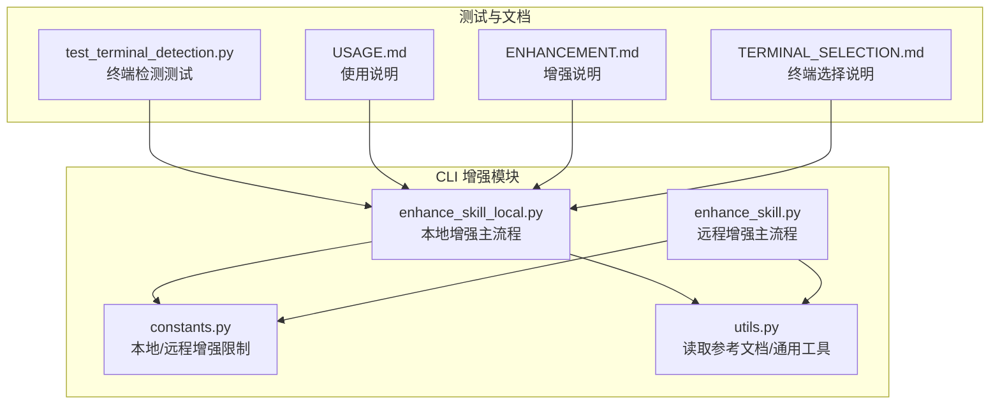
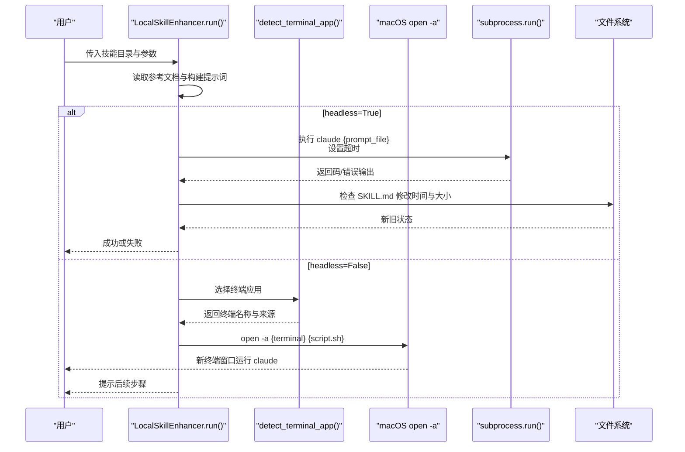
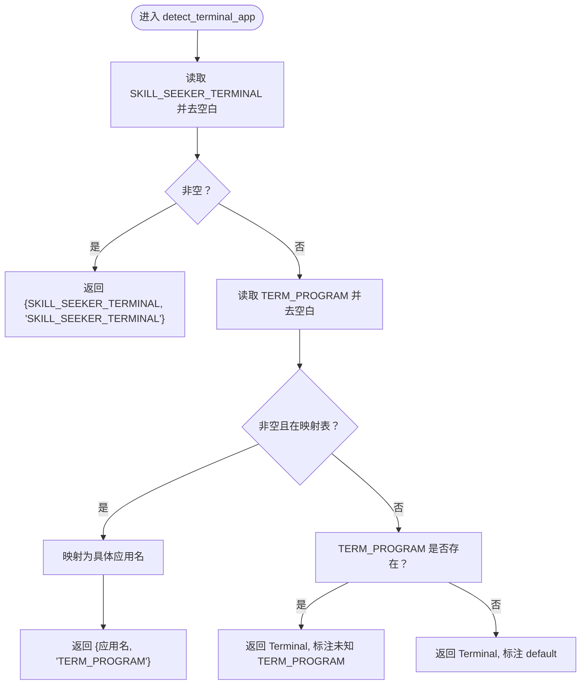
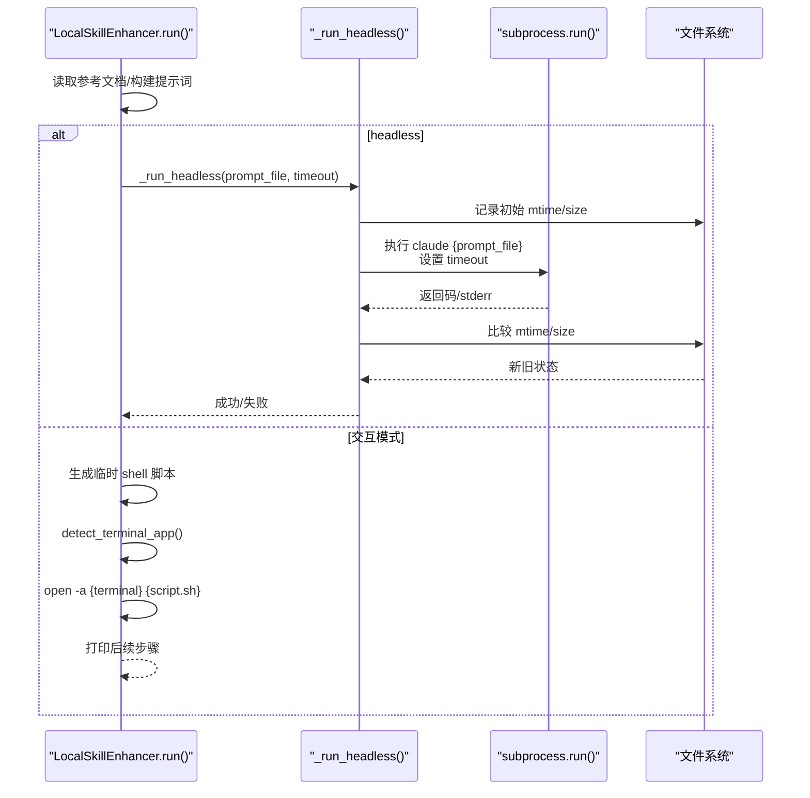
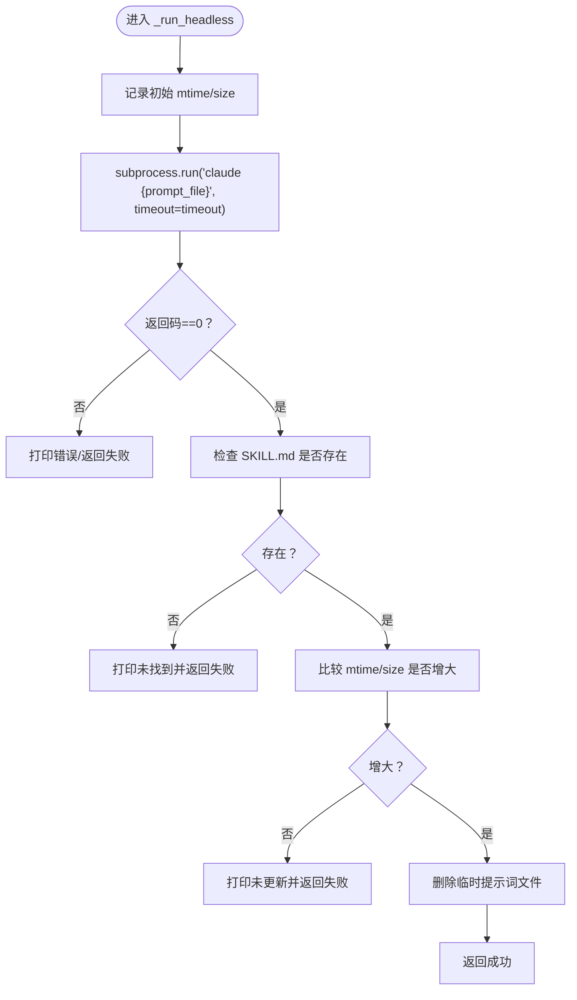
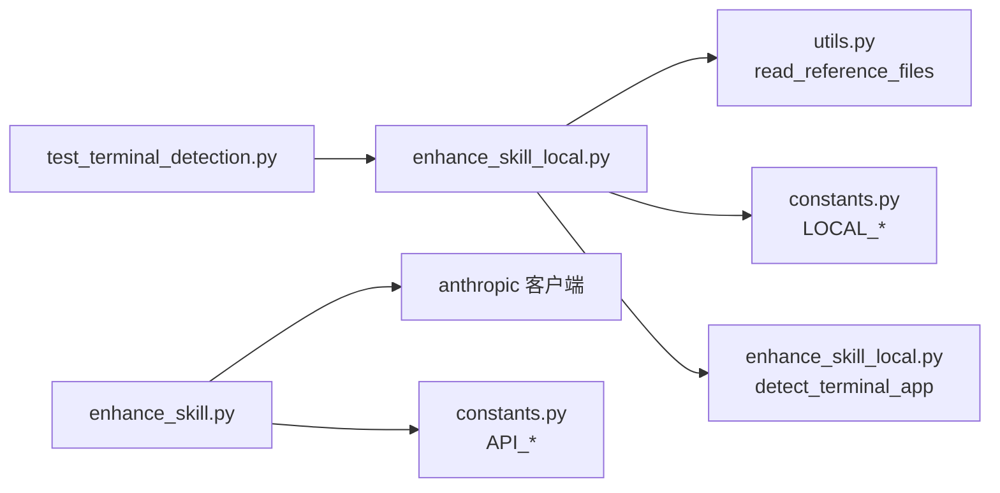

# 本地增强模式

<cite>
**本文引用的文件**
- [enhance_skill_local.py](file://src/skill_seekers/cli/enhance_skill_local.py)
- [enhance_skill.py](file://src/skill_seekers/cli/enhance_skill.py)
- [constants.py](file://src/skill_seekers/cli/constants.py)
- [utils.py](file://src/skill_seekers/cli/utils.py)
- [test_terminal_detection.py](file://tests/test_terminal_detection.py)
- [USAGE.md](file://docs/USAGE.md)
- [ENHANCEMENT.md](file://docs/ENHANCEMENT.md)
- [TERMINAL_SELECTION.md](file://docs/TERMINAL_SELECTION.md)
</cite>

## 目录
1. [简介](#简介)
2. [项目结构](#项目结构)
3. [核心组件](#核心组件)
4. [架构总览](#架构总览)
5. [详细组件分析](#详细组件分析)
6. [依赖关系分析](#依赖关系分析)
7. [性能考量](#性能考量)
8. [故障排查指南](#故障排查指南)
9. [结论](#结论)

## 简介
本文件系统性阐述“本地增强模式”的工作原理，该模式通过用户本地已安装的 Claude Code CLI 工具，在无需 API 密钥的前提下完成 SKILL.md 的增强。重点覆盖以下方面：
- 终端检测逻辑：detect_terminal_app 函数如何基于环境变量 SKILL_SEEKER_TERMINAL、TERM_PROGRAM 以及默认回退策略选择合适的 macOS 终端应用（如 Ghostty、iTerm、Terminal、WezTerm）。
- LocalSkillEnhancer 类的运行流程：在 headless 模式下通过子进程直接调用 claude 命令并设置超时；在交互模式下生成临时 shell 脚本并通过 macOS 的 open -a 启动新终端窗口。
- 提示词构建：_create_enhancement_prompt 方法与远程模式提示词的差异，尤其是明确要求 Claude Code 将结果保存到指定路径的指令。
- 文件状态监控：_headless 方法中如何通过比较 SKILL.md 的修改时间与大小来验证增强是否成功，并对超时、文件未找到等异常进行处理。

## 项目结构
本地增强模式的核心代码位于 CLI 子模块中，配合通用工具函数与常量配置使用：
- 终端检测与增强执行：src/skill_seekers/cli/enhance_skill_local.py
- 远程增强（API 方案）：src/skill_seekers/cli/enhance_skill.py
- 常量与限制：src/skill_seekers/cli/constants.py
- 通用工具（读取参考文档、打开文件夹等）：src/skill_seekers/cli/utils.py
- 终端检测测试：tests/test_terminal_detection.py
- 使用与增强说明文档：docs/USAGE.md、docs/ENHANCEMENT.md、docs/TERMINAL_SELECTION.md

图表来源
- [enhance_skill_local.py](file://src/skill_seekers/cli/enhance_skill_local.py#L1-L120)
- [enhance_skill.py](file://src/skill_seekers/cli/enhance_skill.py#L1-L120)
- [constants.py](file://src/skill_seekers/cli/constants.py#L25-L34)
- [utils.py](file://src/skill_seekers/cli/utils.py#L182-L233)
- [test_terminal_detection.py](file://tests/test_terminal_detection.py#L1-L120)
- [USAGE.md](file://docs/USAGE.md#L254-L301)
- [ENHANCEMENT.md](file://docs/ENHANCEMENT.md#L1-L60)
- [TERMINAL_SELECTION.md](file://docs/TERMINAL_SELECTION.md#L84-L95)

章节来源
- [enhance_skill_local.py](file://src/skill_seekers/cli/enhance_skill_local.py#L1-L120)
- [enhance_skill.py](file://src/skill_seekers/cli/enhance_skill.py#L1-L120)
- [constants.py](file://src/skill_seekers/cli/constants.py#L25-L34)
- [utils.py](file://src/skill_seekers/cli/utils.py#L182-L233)
- [test_terminal_detection.py](file://tests/test_terminal_detection.py#L1-L120)
- [USAGE.md](file://docs/USAGE.md#L254-L301)
- [ENHANCEMENT.md](file://docs/ENHANCEMENT.md#L1-L60)
- [TERMINAL_SELECTION.md](file://docs/TERMINAL_SELECTION.md#L84-L95)

## 核心组件
- detect_terminal_app：按优先级链选择终端应用，支持 Ghostty、iTerm、Terminal、WezTerm。
- LocalSkillEnhancer：封装本地增强全流程，包含提示词构建、headless 与交互模式执行、文件状态监控与清理。
- 抽象对比：与远程增强（SkillEnhancer）相比，本地增强不依赖 API 密钥，而是直接调用本地 claude 命令。

章节来源
- [enhance_skill_local.py](file://src/skill_seekers/cli/enhance_skill_local.py#L35-L82)
- [enhance_skill.py](file://src/skill_seekers/cli/enhance_skill.py#L32-L80)
- [constants.py](file://src/skill_seekers/cli/constants.py#L25-L34)

## 架构总览
本地增强模式的控制流分为两条主线：
- headless 模式：直接调用 claude 命令，等待完成并校验 SKILL.md 是否更新。
- 交互模式：生成临时 shell 脚本，通过 open -a 在新终端中运行 claude，完成后自动关闭。

图表来源
- [enhance_skill_local.py](file://src/skill_seekers/cli/enhance_skill_local.py#L169-L292)
- [enhance_skill_local.py](file://src/skill_seekers/cli/enhance_skill_local.py#L293-L401)

## 详细组件分析

### 终端检测逻辑：detect_terminal_app
- 优先级链
  1) 显式偏好：SKILL_SEEKER_TERMINAL 环境变量（最高优先级）
  2) 当前终端继承：TERM_PROGRAM 环境变量映射到具体应用名
  3) 默认回退：Terminal.app
- 支持映射
  - Apple_Terminal -> Terminal
  - iTerm.app -> iTerm
  - ghostty -> Ghostty
  - WezTerm -> WezTerm
- 行为细节
  - 对环境变量值进行空白裁剪后判断是否为空
  - 当 TERM_PROGRAM 未知时返回 Terminal 并标注来源，便于调试
  - 未设置任何变量时返回 Terminal.default

图表来源
- [enhance_skill_local.py](file://src/skill_seekers/cli/enhance_skill_local.py#L35-L82)
- [test_terminal_detection.py](file://tests/test_terminal_detection.py#L47-L129)

章节来源
- [enhance_skill_local.py](file://src/skill_seekers/cli/enhance_skill_local.py#L35-L82)
- [test_terminal_detection.py](file://tests/test_terminal_detection.py#L47-L129)
- [TERMINAL_SELECTION.md](file://docs/TERMINAL_SELECTION.md#L84-L95)

### LocalSkillEnhancer.run：headless 与交互模式
- headless 模式
  - 记录 SKILL.md 初始修改时间与大小
  - 调用 subprocess.run 执行 claude {prompt_file}，设置超时
  - 成功条件：返回码为 0 且 SKILL.md 更新（新 mtime > 旧 mtime 且新 size > 旧 size）
  - 异常处理：超时、命令不存在、其他异常分别给出提示并返回失败
  - 清理：删除临时提示词文件
- 交互模式（macOS）
  - 生成包含 claude 命令的临时 shell 脚本
  - 通过 open -a {terminal_app} {script.sh} 启动新终端窗口
  - 若失败则打印手动运行建议并返回 False
  - 非 macOS 平台提示仅支持自动启动（否则提供手动命令）

图表来源
- [enhance_skill_local.py](file://src/skill_seekers/cli/enhance_skill_local.py#L169-L292)
- [enhance_skill_local.py](file://src/skill_seekers/cli/enhance_skill_local.py#L293-L401)

章节来源
- [enhance_skill_local.py](file://src/skill_seekers/cli/enhance_skill_local.py#L169-L292)
- [enhance_skill_local.py](file://src/skill_seekers/cli/enhance_skill_local.py#L293-L401)

### _create_enhancement_prompt：提示词构建与远程模式对比
- 输入来源
  - 当前 SKILL.md（若存在）
  - references/ 下的参考文档内容（受 LOCAL_CONTENT_LIMIT 与 LOCAL_PREVIEW_LIMIT 限制）
- 输出目标
  - 生成完整提示词文本，要求 Claude Code 将增强结果保存到 SKILL.md 绝对路径，并备份原文件到 .md.backup
- 与远程模式提示词的差异
  - 本地模式明确要求 Claude Code 将结果写回 SKILL.md，避免外部保存逻辑
  - 远程模式（SkillEnhancer）由程序负责保存增强结果至 SKILL.md，并创建备份
  - 两者均强调提取高质量代码示例、清晰导航指引与关键概念解释

章节来源
- [enhance_skill_local.py](file://src/skill_seekers/cli/enhance_skill_local.py#L90-L168)
- [enhance_skill.py](file://src/skill_seekers/cli/enhance_skill.py#L81-L131)
- [constants.py](file://src/skill_seekers/cli/constants.py#L25-L34)
- [utils.py](file://src/skill_seekers/cli/utils.py#L182-L233)

### _headless 方法：文件状态监控与异常处理
- 监控机制
  - 在执行 claude 前记录 SKILL.md 的 st_mtime 与 st_size
  - 执行完成后再次读取并比较：若新 mtime > 旧 mtime 且新 size > 旧 size，则认为增强成功
- 超时处理
  - 设置超时上限（默认 600 秒），超时后打印原因并建议改用交互模式或减少输入规模
- 其他异常
  - FileNotFoundError：提示 claude 命令未找到，建议安装 Claude Code CLI 或改用交互模式
  - 其他异常：打印错误并返回失败
- 清理策略
  - 成功或失败后均尝试删除临时提示词文件，避免残留

图表来源
- [enhance_skill_local.py](file://src/skill_seekers/cli/enhance_skill_local.py#L293-L401)

章节来源
- [enhance_skill_local.py](file://src/skill_seekers/cli/enhance_skill_local.py#L293-L401)

## 依赖关系分析
- LocalSkillEnhancer 依赖
  - utils.read_reference_files：从 references/ 读取参考文档，受 LOCAL_CONTENT_LIMIT 与 LOCAL_PREVIEW_LIMIT 限制
  - constants.LOCAL_CONTENT_LIMIT / LOCAL_PREVIEW_LIMIT：控制输入规模
  - detect_terminal_app：在交互模式下选择终端
- 远程增强（SkillEnhancer）依赖
  - anthropic 客户端：调用 Claude API
  - constants.API_CONTENT_LIMIT / API_PREVIEW_LIMIT：控制输入规模
- 测试覆盖
  - test_terminal_detection.py：覆盖 SKILL_SEEKER_TERMINAL 优先、TERM_PROGRAM 映射、未知终端回退、默认回退、macOS open -a 参数正确性、错误处理与警告输出等

图表来源
- [enhance_skill_local.py](file://src/skill_seekers/cli/enhance_skill_local.py#L1-L120)
- [enhance_skill.py](file://src/skill_seekers/cli/enhance_skill.py#L1-L120)
- [utils.py](file://src/skill_seekers/cli/utils.py#L182-L233)
- [constants.py](file://src/skill_seekers/cli/constants.py#L25-L34)
- [test_terminal_detection.py](file://tests/test_terminal_detection.py#L1-L120)

章节来源
- [enhance_skill_local.py](file://src/skill_seekers/cli/enhance_skill_local.py#L1-L120)
- [enhance_skill.py](file://src/skill_seekers/cli/enhance_skill.py#L1-L120)
- [utils.py](file://src/skill_seekers/cli/utils.py#L182-L233)
- [constants.py](file://src/skill_seekers/cli/constants.py#L25-L34)
- [test_terminal_detection.py](file://tests/test_terminal_detection.py#L1-L120)

## 性能考量
- 输入规模限制
  - 本地增强：LOCAL_CONTENT_LIMIT 与 LOCAL_PREVIEW_LIMIT 较小，适合快速迭代与离线场景
  - 远程增强：API_CONTENT_LIMIT 与 API_PREVIEW_LIMIT 更大，适合更长参考文档
- 头模式 vs 交互模式
  - headless 模式可后台运行，适合自动化流水线；交互模式便于观察 Claude 的执行过程
- 超时与重试
  - headless 模式设置超时上限，避免长时间阻塞；交互模式可通过手动重试或调整输入规模缓解
- 终端选择
  - 自动检测终端可减少人工干预；未知终端会回退到 Terminal 并给出提示

章节来源
- [constants.py](file://src/skill_seekers/cli/constants.py#L25-L34)
- [enhance_skill_local.py](file://src/skill_seekers/cli/enhance_skill_local.py#L169-L292)
- [ENHANCEMENT.md](file://docs/ENHANCEMENT.md#L1-L60)

## 故障排查指南
- “claude 命令未找到”
  - 现象：抛出 FileNotFoundError
  - 处理：安装 Claude Code CLI，或改用交互模式手动运行
- “增强完成但 SKILL.md 未更新”
  - 现象：返回码为 0，但 mtime/size 未变化
  - 处理：检查提示词是否包含保存指令、确认 Claude Code 正确执行、重新尝试
- “超时”
  - 现象：subprocess.TimeoutExpired
  - 处理：增大超时、减少参考文档规模、改用交互模式
- “终端无法启动”
  - 现象：open -a 抛出异常
  - 处理：在 macOS 上检查终端名称映射，或手动运行脚本
- “未知终端类型”
  - 现象：TERM_PROGRAM 未知，回退到 Terminal 并打印警告
  - 处理：设置 SKILL_SEEKER_TERMINAL 指定目标终端

章节来源
- [enhance_skill_local.py](file://src/skill_seekers/cli/enhance_skill_local.py#L293-L401)
- [test_terminal_detection.py](file://tests/test_terminal_detection.py#L120-L215)
- [test_terminal_detection.py](file://tests/test_terminal_detection.py#L216-L332)

## 结论
本地增强模式通过 detect_terminal_app 的优先级链与 LocalSkillEnhancer 的 headless/交互双通道，实现了无需 API 密钥的高效 SKILL.md 增强。其核心优势在于：
- 与 Claude Code Max 计划无缝集成，成本低、速度快
- 通过文件状态监控确保增强结果可靠落地
- 在交互模式下提供良好的可观测性与可恢复性

建议在大规模参考文档场景下优先采用本地增强，并结合测试用例与文档说明进行定制化配置与问题排查。