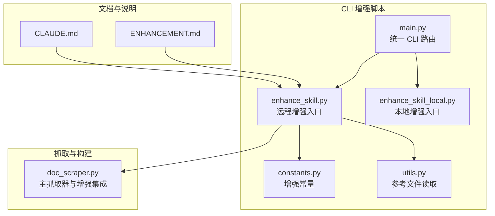
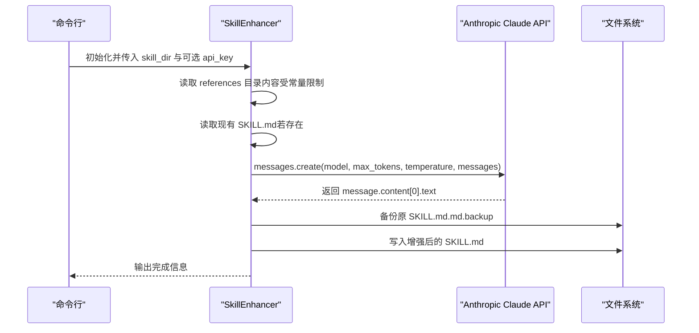
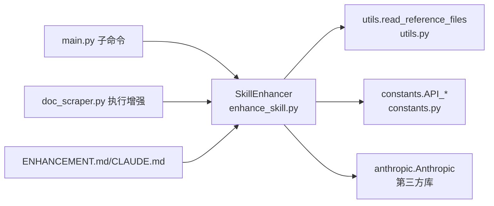

# 远程增强模式

<cite>
**本文引用的文件**
- [enhance_skill.py](file://src/skill_seekers/cli/enhance_skill.py)
- [enhance_skill_local.py](file://src/skill_seekers/cli/enhance_skill_local.py)
- [constants.py](file://src/skill_seekers/cli/constants.py)
- [utils.py](file://src/skill_seekers/cli/utils.py)
- [main.py](file://src/skill_seekers/cli/main.py)
- [ENHANCEMENT.md](file://docs/ENHANCEMENT.md)
- [CLAUDE.md](file://CLAUDE.md)
- [doc_scraper.py](file://src/skill_seekers/cli/doc_scraper.py)
</cite>

## 目录
1. [引言](#引言)
2. [项目结构](#项目结构)
3. [核心组件](#核心组件)
4. [架构总览](#架构总览)
5. [详细组件分析](#详细组件分析)
6. [依赖关系分析](#依赖关系分析)
7. [性能考量](#性能考量)
8. [故障排查指南](#故障排查指南)
9. [结论](#结论)

## 引言
本文件聚焦“远程增强模式”，即通过 Anthropic API 调用 Claude 模型（具体为 claude-sonnet-4-20250514）来自动化优化 SKILL.md 的完整流程。文档将系统性解析：
- SkillEnhancer 类的初始化与 API 密钥优先级处理
- enhance_skill_md 方法如何构造 Claude 请求（模型、token 限制、温度、用户消息）
- _build_enhancement_prompt 的提示词工程设计与结构化指令组织
- API 响应处理（message.content[0].text 提取与错误处理）
- 从命令行调用到保存增强后文件的端到端工作流
- dry-run 模式的实现原理与调试价值

## 项目结构
围绕远程增强模式的关键文件与职责如下：
- 远程增强入口：src/skill_seekers/cli/enhance_skill.py
- 常量与限制：src/skill_seekers/cli/constants.py
- 参考文档读取工具：src/skill_seekers/cli/utils.py
- 统一 CLI 入口与子命令路由：src/skill_seekers/cli/main.py
- 文档与使用说明：docs/ENHANCEMENT.md、CLAUDE.md
- 与增强流程集成的主抓取器：src/skill_seekers/cli/doc_scraper.py

图表来源
- [enhance_skill.py](file://src/skill_seekers/cli/enhance_skill.py#L1-L274)
- [enhance_skill_local.py](file://src/skill_seekers/cli/enhance_skill_local.py#L1-L452)
- [constants.py](file://src/skill_seekers/cli/constants.py#L1-L73)
- [utils.py](file://src/skill_seekers/cli/utils.py#L182-L233)
- [main.py](file://src/skill_seekers/cli/main.py#L303-L306)
- [ENHANCEMENT.md](file://docs/ENHANCEMENT.md#L1-L251)
- [CLAUDE.md](file://CLAUDE.md#L286-L305)
- [doc_scraper.py](file://src/skill_seekers/cli/doc_scraper.py#L1664-L1718)

章节来源
- [enhance_skill.py](file://src/skill_seekers/cli/enhance_skill.py#L1-L274)
- [constants.py](file://src/skill_seekers/cli/constants.py#L25-L34)
- [utils.py](file://src/skill_seekers/cli/utils.py#L182-L233)
- [main.py](file://src/skill_seekers/cli/main.py#L303-L306)
- [ENHANCEMENT.md](file://docs/ENHANCEMENT.md#L1-L251)
- [CLAUDE.md](file://CLAUDE.md#L286-L305)
- [doc_scraper.py](file://src/skill_seekers/cli/doc_scraper.py#L1664-L1718)

## 核心组件
- SkillEnhancer：封装远程增强的全部逻辑，负责 API 密钥获取、Anthropic 客户端创建、提示词构造、调用 Claude、保存结果。
- 常量模块：定义 API 增强的内容上限与预览长度，确保输入大小可控。
- 工具模块：提供读取 references 下 Markdown 文件的功能，支持按字数限制截断与总量限制。
- 统一 CLI：将远程增强作为独立子命令，便于与其他流程组合。

章节来源
- [enhance_skill.py](file://src/skill_seekers/cli/enhance_skill.py#L32-L194)
- [constants.py](file://src/skill_seekers/cli/constants.py#L25-L34)
- [utils.py](file://src/skill_seekers/cli/utils.py#L182-L233)
- [main.py](file://src/skill_seekers/cli/main.py#L303-L306)

## 架构总览
远程增强模式的工作流分为“准备阶段”和“调用阶段”两大部分：
- 准备阶段：读取 references 目录下的 Markdown 内容，应用内容上限与预览长度限制；读取当前 SKILL.md（若存在）。
- 调用阶段：构造 Claude 请求，发送给 claude-sonnet-4-20250514，解析返回文本并保存为新的 SKILL.md，同时备份原文件。

图表来源
- [enhance_skill.py](file://src/skill_seekers/cli/enhance_skill.py#L48-L194)
- [utils.py](file://src/skill_seekers/cli/utils.py#L182-L233)
- [constants.py](file://src/skill_seekers/cli/constants.py#L25-L34)

## 详细组件分析

### SkillEnhancer 类与初始化
- API 密钥优先级
  - 若构造时提供了 api_key，则直接使用该值
  - 否则尝试从环境变量 ANTHROPIC_API_KEY 获取
  - 若两者均未提供，抛出异常并提示设置方式
- Anthropic 客户端创建
  - 使用获取到的 api_key 创建 anthropic.Anthropic 客户端实例
- 目录与路径
  - skill_dir：技能目录
  - references_dir：references 子目录
  - skill_md_path：SKILL.md 路径

章节来源
- [enhance_skill.py](file://src/skill_seekers/cli/enhance_skill.py#L32-L47)

### enhance_skill_md 方法：请求构造与调用
- 提示词构建
  - 调用 _build_enhancement_prompt(references, current_skill_md) 生成 Claude 输入
- 模型与参数
  - model：claude-sonnet-4-20250514
  - max_tokens：4096
  - temperature：0.3
- 用户消息
  - messages 中仅包含一条 role=user 的消息，内容为完整提示词
- 响应处理
  - 从 message.content[0].text 提取增强后文本
  - 捕获异常并返回 None，以便上层进行失败处理
- 错误处理
  - 打印错误信息并返回 None，避免中断流程

章节来源
- [enhance_skill.py](file://src/skill_seekers/cli/enhance_skill.py#L54-L80)

### _build_enhancement_prompt 提示词工程
- 结构化指令目标
  - 明确“何时使用此技能”的触发条件
  - 提供 5-10 个最佳、实用的代码示例（短小清晰，标注语言标签）
  - 详细说明每个参考文件的内容与导航建议
  - 可选的“关键概念”章节
  - 保持 YAML frontmatter 不变
- 输入组织
  - 当前 SKILL.md（若存在）与所有 references/*.md 的内容被拼接进提示词
  - 对单文件内容进行预览长度截断，整体内容受 API_CONTENT_LIMIT 控制
- 输出约束
  - 要求 Claude 直接返回完整的 SKILL.md 内容，起始为 frontmatter

章节来源
- [enhance_skill.py](file://src/skill_seekers/cli/enhance_skill.py#L81-L131)
- [utils.py](file://src/skill_seekers/cli/utils.py#L182-L233)
- [constants.py](file://src/skill_seekers/cli/constants.py#L25-L34)

### run 方法：完整工作流
- 读取 references 目录内容（应用 API_CONTENT_LIMIT 与 API_PREVIEW_LIMIT）
- 读取现有 SKILL.md（若存在）
- 调用 enhance_skill_md 获取增强内容
- 失败时输出错误并返回 False
- 成功时备份原 SKILL.md 并写入新内容，最后打印后续步骤提示

章节来源
- [enhance_skill.py](file://src/skill_seekers/cli/enhance_skill.py#L144-L194)

### 命令行入口与 dry-run 模式
- 命令行参数
  - skill_dir：技能目录路径
  - --api-key：可选的 API 密钥
  - --dry-run：干跑模式
- 干跑逻辑
  - 打印将要执行的操作概要（目录、references、SKILL.md）
  - 列举 references 下的 Markdown 文件数量与大小
  - 提示如何切换到真实运行
- 真实运行
  - 校验目录有效性
  - 创建 SkillEnhancer 实例并执行 run

章节来源
- [enhance_skill.py](file://src/skill_seekers/cli/enhance_skill.py#L196-L274)

### 与统一 CLI 的集成
- 子命令：scrape 子命令支持 --enhance 选项，内部会以子进程方式调用远程增强脚本
- 子命令：enhance 子命令（本地增强）用于本地 Claude Code 流程，此处不涉及远程 API

章节来源
- [main.py](file://src/skill_seekers/cli/main.py#L303-L306)
- [doc_scraper.py](file://src/skill_seekers/cli/doc_scraper.py#L1664-L1718)

## 依赖关系分析
- SkillEnhancer 依赖
  - anthropic 库：用于调用 Claude API
  - constants：API_CONTENT_LIMIT、API_PREVIEW_LIMIT
  - utils.read_reference_files：读取 references 目录内容
- CLI 路由
  - main.py 将 scrape 子命令的 --enhance 选项映射到远程增强脚本
- 文档与说明
  - ENHANCEMENT.md 与 CLAUDE.md 提供使用说明与成本估算

图表来源
- [enhance_skill.py](file://src/skill_seekers/cli/enhance_skill.py#L24-L47)
- [utils.py](file://src/skill_seekers/cli/utils.py#L182-L233)
- [constants.py](file://src/skill_seekers/cli/constants.py#L25-L34)
- [main.py](file://src/skill_seekers/cli/main.py#L303-L306)
- [doc_scraper.py](file://src/skill_seekers/cli/doc_scraper.py#L1664-L1718)
- [ENHANCEMENT.md](file://docs/ENHANCEMENT.md#L1-L251)
- [CLAUDE.md](file://CLAUDE.md#L286-L305)

## 性能考量
- 输入规模控制
  - 单文件预览长度与总字符上限由 constants 中的 API_PREVIEW_LIMIT 与 API_CONTENT_LIMIT 控制，避免超出 Claude 输入限制
- Token 与成本
  - ENHANCEMENT.md 提供了典型输入/输出 token 估算与成本范围，有助于预算管理
- 温度与确定性
  - temperature=0.3 在保证一定创造性的同时，提升输出稳定性，适合技能文档的结构化生成

章节来源
- [constants.py](file://src/skill_seekers/cli/constants.py#L25-L34)
- [ENHANCEMENT.md](file://docs/ENHANCEMENT.md#L127-L133)

## 故障排查指南
- 缺少 API 密钥
  - 现象：初始化时报错并提示设置 ANTHROPIC_API_KEY 或使用 --api-key
  - 处理：设置环境变量或在命令行传入 --api-key
- anthropic 包未安装
  - 现象：导入失败并提示安装
  - 处理：pip3 install anthropic
- references 目录为空或不存在
  - 现象：增强失败或输出空内容
  - 处理：先运行抓取与构建流程，确保生成 references/*.md
- Claude API 调用异常
  - 现象：enhance_skill_md 捕获异常并返回 None
  - 处理：检查网络、密钥、限额与模型可用性
- dry-run 模式
  - 作用：在不实际调用 API 的前提下，预览将要处理的文件与大小，便于调试与确认输入规模

章节来源
- [enhance_skill.py](file://src/skill_seekers/cli/enhance_skill.py#L24-L47)
- [enhance_skill.py](file://src/skill_seekers/cli/enhance_skill.py#L233-L251)
- [ENHANCEMENT.md](file://docs/ENHANCEMENT.md#L135-L161)

## 结论
远程增强模式通过 SkillEnhancer 将“参考文档 + 现有 SKILL.md”转化为结构化提示词，借助 claude-sonnet-4-20250514 的强大能力生成高质量的技能文档。其优势在于：
- 明确的提示词工程，确保输出包含“何时使用”“快速参考”“参考文件说明”等关键要素
- 严格的输入规模控制与错误处理，保障稳定性
- 与统一 CLI 集成，便于在抓取与打包流程中无缝衔接
- dry-run 模式提供强大的调试与验证能力