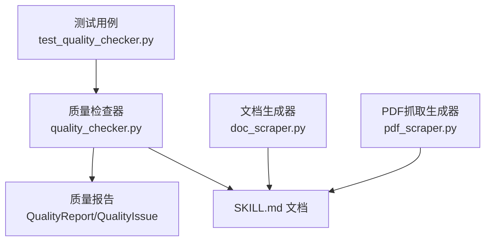
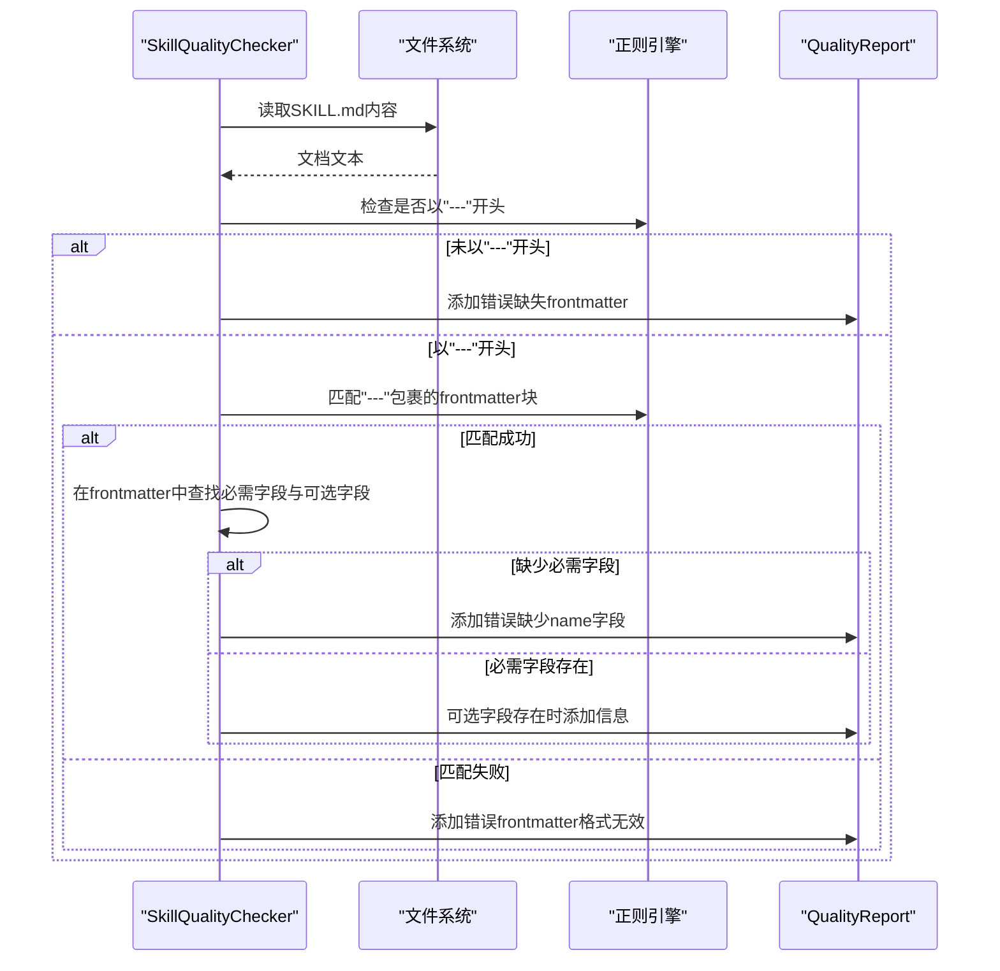
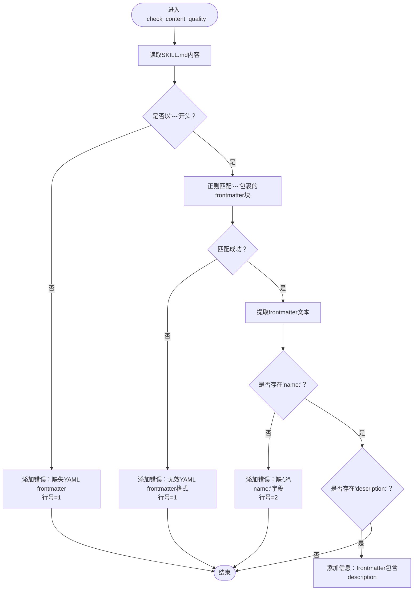
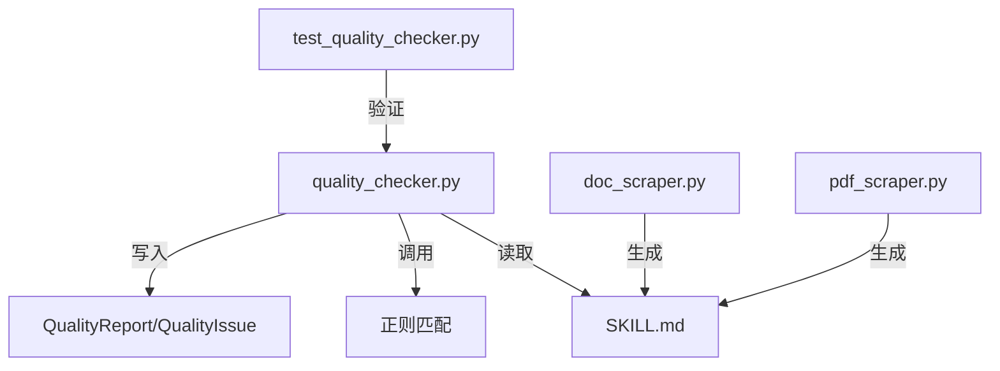

# YAML前置元数据验证

<cite>
**本文引用的文件**
- [quality_checker.py](file://src/skill_seekers/cli/quality_checker.py)
- [test_quality_checker.py](file://tests/test_quality_checker.py)
- [pdf_scraper.py](file://src/skill_seekers/cli/pdf_scraper.py)
- [doc_scraper.py](file://src/skill_seekers/cli/doc_scraper.py)
</cite>

## 目录
1. [引言](#引言)
2. [项目结构](#项目结构)
3. [核心组件](#核心组件)
4. [架构总览](#架构总览)
5. [详细组件分析](#详细组件分析)
6. [依赖关系分析](#依赖关系分析)
7. [性能考量](#性能考量)
8. [故障排查指南](#故障排查指南)
9. [结论](#结论)
10. [附录](#附录)

## 引言
本节聚焦于质量检查器对YAML前置元数据（frontmatter）的验证机制，解释如何通过正则表达式判断文件是否以“---”开头、如何解析frontmatter内容块、如何校验必需字段与可选字段、以及在格式错误或缺失关键字段时如何生成错误报告并定位到具体行号。同时，结合实际代码路径说明_check_content_quality方法中frontmatter匹配的实现细节与异常处理流程，帮助读者理解该机制如何保障技能文档的标准化与可读性。

## 项目结构
本项目的质量检查功能位于命令行工具模块中，核心入口为quality_checker.py，负责读取SKILL.md并执行多项质量检查；相关生成逻辑由doc_scraper.py与pdf_scraper.py负责写入标准的YAML frontmatter。测试用例位于tests/test_quality_checker.py，覆盖了缺失frontmatter、缺少name字段、无效格式等典型场景。

图表来源
- [quality_checker.py](file://src/skill_seekers/cli/quality_checker.py#L223-L275)
- [doc_scraper.py](file://src/skill_seekers/cli/doc_scraper.py#L1020-L1117)
- [pdf_scraper.py](file://src/skill_seekers/cli/pdf_scraper.py#L281-L286)
- [test_quality_checker.py](file://tests/test_quality_checker.py#L68-L101)

章节来源
- [quality_checker.py](file://src/skill_seekers/cli/quality_checker.py#L223-L275)
- [doc_scraper.py](file://src/skill_seekers/cli/doc_scraper.py#L1020-L1117)
- [pdf_scraper.py](file://src/skill_seekers/cli/pdf_scraper.py#L281-L286)
- [test_quality_checker.py](file://tests/test_quality_checker.py#L68-L101)

## 核心组件
- QualityIssue：表示一次质量检查发现的问题，包含级别、类别、消息、文件名与行号。
- QualityReport：汇总所有问题并计算质量得分与等级，支持添加错误、警告、信息类问题。
- SkillQualityChecker：执行完整的质量检查流程，包括结构、增强度、内容质量、链接有效性等。
- _check_content_quality：专门负责YAML frontmatter的验证与解析。

章节来源
- [quality_checker.py](file://src/skill_seekers/cli/quality_checker.py#L19-L92)
- [quality_checker.py](file://src/skill_seekers/cli/quality_checker.py#L111-L129)
- [quality_checker.py](file://src/skill_seekers/cli/quality_checker.py#L223-L321)

## 架构总览
下图展示了从SKILL.md读取到frontmatter解析与问题上报的整体流程。

图表来源
- [quality_checker.py](file://src/skill_seekers/cli/quality_checker.py#L223-L275)

## 详细组件分析

### YAML前置元数据验证流程
- 基础检查：确认SKILL.md存在且以“---”开头。若不满足，直接记录错误并返回。
- 正则解析：使用多行模式匹配“---”起止之间的内容块，作为frontmatter。
- 字段校验：
  - 必需字段：name字段必须存在，否则记录错误。
  - 可选字段：description字段存在时记录信息，便于提示完善元数据。
- 错误定位：当frontmatter缺失或格式无效时，错误消息中包含文件名与行号（例如第1行或第2行），以便快速修复。
- 异常处理：在frontmatter解析过程中捕获异常并记录错误，避免因解析异常导致检查中断。

章节来源
- [quality_checker.py](file://src/skill_seekers/cli/quality_checker.py#L223-L275)
- [test_quality_checker.py](file://tests/test_quality_checker.py#L68-L101)

### 正则表达式匹配逻辑
- 判断开头：通过字符串前缀判断是否以“---”开头，用于快速失败与定位第1行错误。
- 提取块体：使用多行匹配模式，捕获“---”之间的任意字符（含换行），作为frontmatter文本。
- 字段扫描：在frontmatter文本内进行简单字符串包含判断，分别检查必需字段与可选字段是否存在。

章节来源
- [quality_checker.py](file://src/skill_seekers/cli/quality_checker.py#L230-L267)

### 生成端的标准frontmatter
- 自动生成：文档生成器会按固定格式写入YAML frontmatter，包含name与description字段，确保后续质量检查能顺利通过。
- 生成位置：在SKILL.md文件头部写入标准frontmatter块，随后是标题与正文内容。

章节来源
- [doc_scraper.py](file://src/skill_seekers/cli/doc_scraper.py#L1020-L1023)
- [doc_scraper.py](file://src/skill_seekers/cli/doc_scraper.py#L1112-L1116)
- [pdf_scraper.py](file://src/skill_seekers/cli/pdf_scraper.py#L281-L286)

### 错误报告与定位
- 错误类型：缺失frontmatter、frontmatter格式无效、缺少必需字段等。
- 定位方式：在添加问题时指定文件名与行号，如第1行或第2行，便于用户快速定位问题。
- 报告输出：控制台打印时会显示问题类别、消息及位置信息，帮助开发者修复。

章节来源
- [quality_checker.py](file://src/skill_seekers/cli/quality_checker.py#L231-L274)
- [quality_checker.py](file://src/skill_seekers/cli/quality_checker.py#L367-L416)

### 验证流程图（算法实现）

图表来源
- [quality_checker.py](file://src/skill_seekers/cli/quality_checker.py#L223-L275)

### 测试用例映射
- 无效frontmatter：当SKILL.md没有以“---”开头时，应报告frontmatter缺失错误。
- 缺少name字段：frontmatter中缺少name字段时，应报告缺少必需字段错误。
- 通过良好文档：包含标准frontmatter与必要内容时，不应出现错误，质量得分较高。

章节来源
- [test_quality_checker.py](file://tests/test_quality_checker.py#L68-L101)
- [test_quality_checker.py](file://tests/test_quality_checker.py#L126-L173)

## 依赖关系分析
- 质量检查器依赖文件系统读取SKILL.md，依赖正则表达式进行frontmatter匹配，依赖报告对象记录问题。
- 生成器负责创建符合规范的frontmatter，从而降低质量检查失败的概率。
- 测试用例覆盖典型边界情况，确保frontmatter验证逻辑稳定可靠。

图表来源
- [quality_checker.py](file://src/skill_seekers/cli/quality_checker.py#L223-L275)
- [doc_scraper.py](file://src/skill_seekers/cli/doc_scraper.py#L1020-L1117)
- [pdf_scraper.py](file://src/skill_seekers/cli/pdf_scraper.py#L281-L286)
- [test_quality_checker.py](file://tests/test_quality_checker.py#L68-L101)

## 性能考量
- 正则匹配仅在frontmatter存在时执行，且匹配范围限定在文档开头，时间复杂度低。
- 字段检查采用字符串包含判断，开销极小。
- 整体检查流程对大型文档影响有限，适合在CI/CD中作为轻量级预检步骤。

## 故障排查指南
- 缺失frontmatter：确认SKILL.md以“---”开头，且前后各一行“---”。错误消息会提示第1行问题。
- 无效格式：frontmatter块未正确闭合或包含非法字符时，将提示格式无效并定位到第1行。
- 缺少name字段：frontmatter中必须包含name字段，否则提示缺少必需字段并定位到第2行。
- 可选字段建议：description字段有助于提升文档完整性，检查器会在存在时记录信息。
- 异常捕获：解析异常会被捕获并记录错误，避免检查中断。

章节来源
- [quality_checker.py](file://src/skill_seekers/cli/quality_checker.py#L231-L274)
- [test_quality_checker.py](file://tests/test_quality_checker.py#L68-L101)

## 结论
通过对YAML frontmatter的严格验证，质量检查器确保每个技能文档具备统一的元数据结构与必要的关键字段，从而提升文档的标准化程度与可读性。配合生成器自动生成标准frontmatter，能够显著减少人工维护成本并降低质量检查失败率。测试用例进一步保证了验证逻辑在常见边界场景下的稳定性与准确性。

## 附录
- 实际代码示例路径（请参考以下行号以定位实现细节）：
  - frontmatter开头检查与错误定位：[quality_checker.py](file://src/skill_seekers/cli/quality_checker.py#L231-L237)
  - frontmatter块匹配与字段检查：[quality_checker.py](file://src/skill_seekers/cli/quality_checker.py#L240-L267)
  - 生成标准frontmatter（name与description）：[doc_scraper.py](file://src/skill_seekers/cli/doc_scraper.py#L1020-L1023)，[pdf_scraper.py](file://src/skill_seekers/cli/pdf_scraper.py#L281-L286)
  - 测试用例覆盖场景：[test_quality_checker.py](file://tests/test_quality_checker.py#L68-L101)，[test_quality_checker.py](file://tests/test_quality_checker.py#L126-L173)