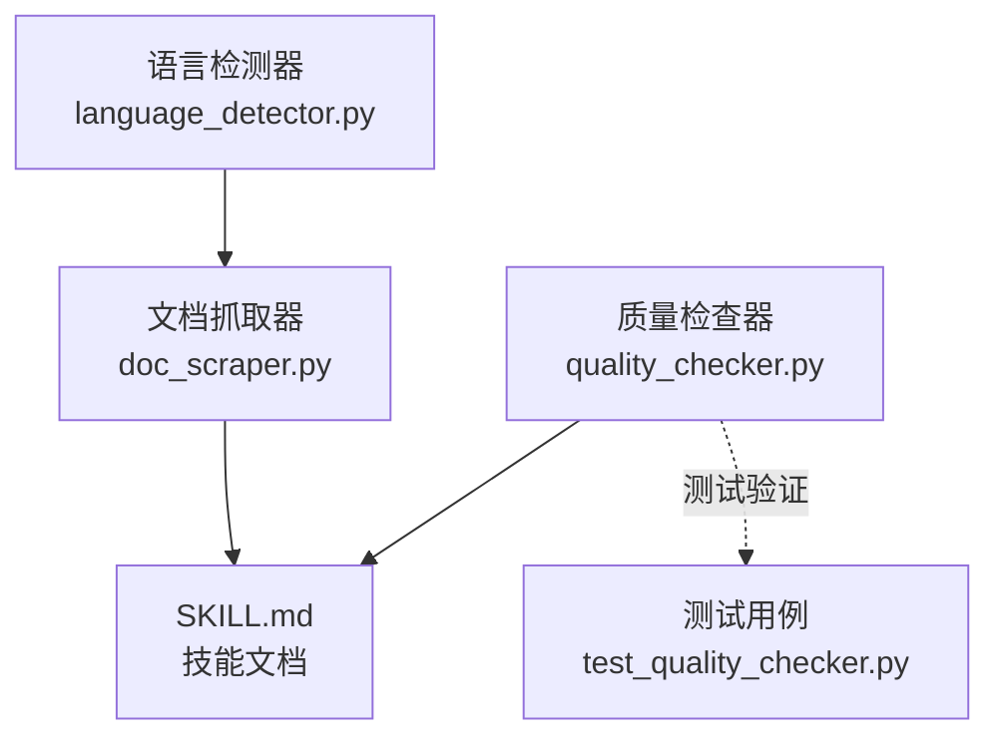
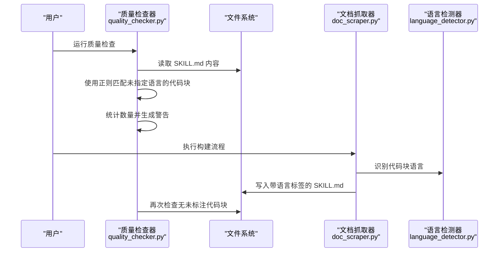
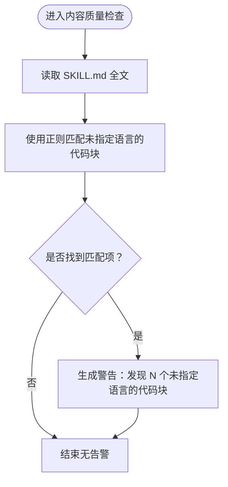
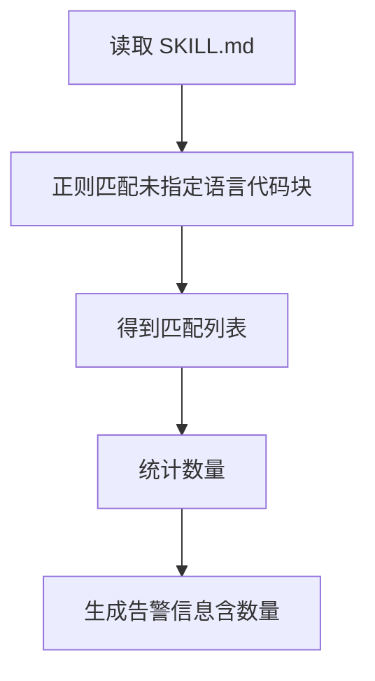
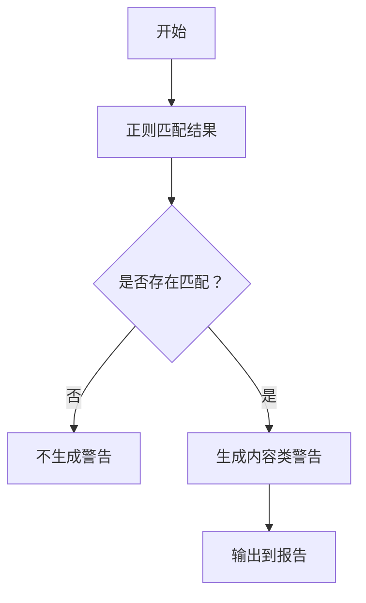
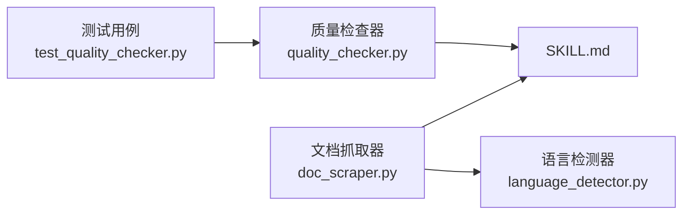

# 代码块规范检查

<cite>
**本文引用的文件列表**
- [quality_checker.py](file://src/skill_seekers/cli/quality_checker.py)
- [test_quality_checker.py](file://tests/test_quality_checker.py)
- [doc_scraper.py](file://src/skill_seekers/cli/doc_scraper.py)
- [language_detector.py](file://src/skill_seekers/cli/language_detector.py)
</cite>

## 目录
1. [引言](#引言)
2. [项目结构](#项目结构)
3. [核心组件](#核心组件)
4. [架构总览](#架构总览)
5. [详细组件分析](#详细组件分析)
6. [依赖关系分析](#依赖关系分析)
7. [性能考量](#性能考量)
8. [故障排查指南](#故障排查指南)
9. [结论](#结论)
10. [附录](#附录)

## 引言
本文件聚焦于质量检查器对 Markdown 代码块的规范性检查，特别是针对“未指定语言标签”的代码块进行识别与告警。我们将从正则表达式匹配、计数与告警生成、警告级别的设定逻辑入手，结合测试用例与工具链中的语言检测能力，解释为何必须为代码块添加语言标签，以及它对语法高亮、可读性与 AI 理解能力的重要意义，并通过对比示例帮助读者掌握正确的用法。

## 项目结构
与本主题相关的核心文件位于 CLI 子模块中：
- 质量检查器：用于扫描 SKILL.md 并生成质量报告
- 文档抓取器：负责构建 SKILL.md，其中会自动为示例代码块添加语言标签
- 语言检测器：为代码块提供语言识别能力，支撑构建阶段的语言标注



图表来源
- [quality_checker.py](file://src/skill_seekers/cli/quality_checker.py#L276-L283)
- [doc_scraper.py](file://src/skill_seekers/cli/doc_scraper.py#L1044-L1060)
- [language_detector.py](file://src/skill_seekers/cli/language_detector.py#L430-L481)
- [test_quality_checker.py](file://tests/test_quality_checker.py#L102-L125)

章节来源
- [quality_checker.py](file://src/skill_seekers/cli/quality_checker.py#L276-L283)
- [doc_scraper.py](file://src/skill_seekers/cli/doc_scraper.py#L1044-L1060)
- [language_detector.py](file://src/skill_seekers/cli/language_detector.py#L430-L481)
- [test_quality_checker.py](file://tests/test_quality_checker.py#L102-L125)

## 核心组件
- 质量检查器：在内容质量检查阶段，使用正则表达式识别未指定语言标签的代码块，并根据数量发出警告。
- 文档抓取器：在构建 SKILL.md 时，将从官方文档抽取的示例代码块自动标注语言标签，确保后续质量检查不会触发该类告警。
- 语言检测器：为代码块提供语言识别能力，支持从 CSS 类名或代码内容模式进行高置信度识别，辅助构建阶段的语言标注。

章节来源
- [quality_checker.py](file://src/skill_seekers/cli/quality_checker.py#L276-L283)
- [doc_scraper.py](file://src/skill_seekers/cli/doc_scraper.py#L1044-L1060)
- [language_detector.py](file://src/skill_seekers/cli/language_detector.py#L430-L481)

## 架构总览
质量检查器在执行内容质量检查时，会对 SKILL.md 进行多项规则校验，其中一项是检测“未指定语言标签”的代码块。该检测基于正则表达式匹配，统计数量并生成相应警告；同时，文档抓取器在构建 SKILL.md 时会自动为示例代码块添加语言标签，从而避免该类问题。



图表来源
- [quality_checker.py](file://src/skill_seekers/cli/quality_checker.py#L276-L283)
- [doc_scraper.py](file://src/skill_seekers/cli/doc_scraper.py#L1044-L1060)
- [language_detector.py](file://src/skill_seekers/cli/language_detector.py#L430-L481)

## 详细组件分析

### 正则表达式 r'``` 与未指定语言代码块的识别
- 匹配目标：以三反引号开始、紧随换行且未指定语言的代码块。
- 实现位置：内容质量检查函数中，使用正则查找所有满足条件的代码块。
- 计数与告警：若存在此类代码块，按数量生成警告信息，提示缺少语言标签。



图表来源
- [quality_checker.py](file://src/skill_seekers/cli/quality_checker.py#L276-L283)

章节来源
- [quality_checker.py](file://src/skill_seekers/cli/quality_checker.py#L276-L283)

### code_blocks_without_lang 变量的提取过程
- 变量含义：用于存储所有匹配到的“未指定语言代码块”片段集合。
- 提取方式：通过正则表达式在全文范围内查找，返回所有匹配对象。
- 数量统计：对匹配结果进行长度计算，作为告警数量依据。
- 告警消息：将匹配数量写入警告信息，便于定位问题。



图表来源
- [quality_checker.py](file://src/skill_seekers/cli/quality_checker.py#L276-L283)

章节来源
- [quality_checker.py](file://src/skill_seekers/cli/quality_checker.py#L276-L283)

### 警告级别（warning）的设定逻辑
- 设定条件：只要检测到至少一个未指定语言的代码块，即触发警告。
- 分类：归类为内容类问题，便于在报告中统一管理。
- 输出：在控制台打印警告数量与类别，供开发者修复。



图表来源
- [quality_checker.py](file://src/skill_seekers/cli/quality_checker.py#L276-L283)

章节来源
- [quality_checker.py](file://src/skill_seekers/cli/quality_checker.py#L276-L283)

### 为代码块添加语言标签的重要性
- 语法高亮：语言标签使编辑器与渲染器能够启用对应语言的语法高亮，显著提升可读性。
- 可读性：明确的语言标识有助于读者快速理解代码上下文与用途。
- AI 理解能力：在增强与打包流程中，语言标签有助于 AI 更准确地理解代码意图，提升问答与示例质量。
- 工具链支持：文档抓取器在构建 SKILL.md 时会自动为示例代码块添加语言标签，减少手动维护成本。

章节来源
- [doc_scraper.py](file://src/skill_seekers/cli/doc_scraper.py#L1044-L1060)
- [language_detector.py](file://src/skill_seekers/cli/language_detector.py#L430-L481)

### 正确与错误用法对比示例
- 错误用法（未指定语言）：
  - 示例路径：[错误示例用法](file://tests/test_quality_checker.py#L102-L125)
  - 特征：三反引号后直接换行，未指定语言。
  - 结果：质量检查器将发出警告，提示缺少语言标签。
- 正确用法（已指定语言）：
  - 示例路径：[正确示例用法](file://src/skill_seekers/cli/doc_scraper.py#L1044-L1060)
  - 特征：三反引号后紧跟语言标识，如 ```python 或 ```javascript。
  - 结果：质量检查器不再对该类代码块发出警告，且具备语法高亮与更好的可读性。

章节来源
- [test_quality_checker.py](file://tests/test_quality_checker.py#L102-L125)
- [doc_scraper.py](file://src/skill_seekers/cli/doc_scraper.py#L1044-L1060)

## 依赖关系分析
- 质量检查器依赖 SKILL.md 的内容进行正则匹配，识别未指定语言的代码块。
- 文档抓取器在构建 SKILL.md 时，调用语言检测器识别代码块语言，并在最终文档中写入带语言标签的代码块。
- 测试用例覆盖了未指定语言代码块的告警场景，确保质量检查器行为符合预期。



图表来源
- [quality_checker.py](file://src/skill_seekers/cli/quality_checker.py#L276-L283)
- [doc_scraper.py](file://src/skill_seekers/cli/doc_scraper.py#L1044-L1060)
- [language_detector.py](file://src/skill_seekers/cli/language_detector.py#L430-L481)
- [test_quality_checker.py](file://tests/test_quality_checker.py#L102-L125)

章节来源
- [quality_checker.py](file://src/skill_seekers/cli/quality_checker.py#L276-L283)
- [doc_scraper.py](file://src/skill_seekers/cli/doc_scraper.py#L1044-L1060)
- [language_detector.py](file://src/skill_seekers/cli/language_detector.py#L430-L481)
- [test_quality_checker.py](file://tests/test_quality_checker.py#L102-L125)

## 性能考量
- 正则匹配开销：对整篇 SKILL.md 进行一次性扫描，复杂度近似 O(n)，n 为文档字符数，通常可忽略不计。
- 语言检测成本：仅在构建阶段使用，且只对抽取到的示例代码块进行检测，整体开销可控。
- 建议：在大型文档中保持代码块语言标签的一致性，可减少质量检查器的告警数量，提高后续阅读体验。

## 故障排查指南
- 若质量检查器频繁报告“未指定语言的代码块”，请检查以下要点：
  - 是否在三反引号后正确添加语言标识（如 ```python）。
  - 是否存在多处代码块但遗漏语言标签。
  - 是否在构建流程中启用了语言检测与自动标注。
- 参考测试用例定位问题：
  - 错误示例用法参考：[测试用例路径](file://tests/test_quality_checker.py#L102-L125)
  - 正确示例用法参考：[构建脚本路径](file://src/skill_seekers/cli/doc_scraper.py#L1044-L1060)

章节来源
- [test_quality_checker.py](file://tests/test_quality_checker.py#L102-L125)
- [doc_scraper.py](file://src/skill_seekers/cli/doc_scraper.py#L1044-L1060)

## 结论
为代码块添加语言标签是提升文档质量的关键实践。质量检查器通过正则表达式快速识别未指定语言的代码块，并以警告形式提醒修复；而文档抓取器在构建阶段会自动为示例代码块标注语言，从而在源头上避免此类问题。遵循这一规范，不仅改善语法高亮与可读性，还能增强 AI 对代码的理解能力，提升整体技能文档的质量与可用性。

## 附录
- 关键实现位置索引：
  - 未指定语言代码块检测：[实现路径](file://src/skill_seekers/cli/quality_checker.py#L276-L283)
  - 示例代码块语言标注（构建阶段）：[实现路径](file://src/skill_seekers/cli/doc_scraper.py#L1044-L1060)
  - 语言检测器（CSS 类与模式匹配）：[实现路径](file://src/skill_seekers/cli/language_detector.py#L430-L481)
  - 测试用例（错误示例）：[实现路径](file://tests/test_quality_checker.py#L102-L125)