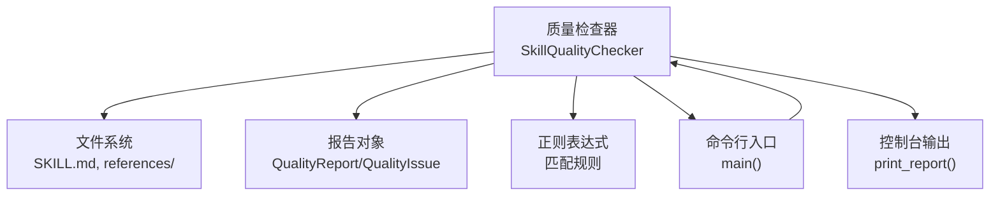
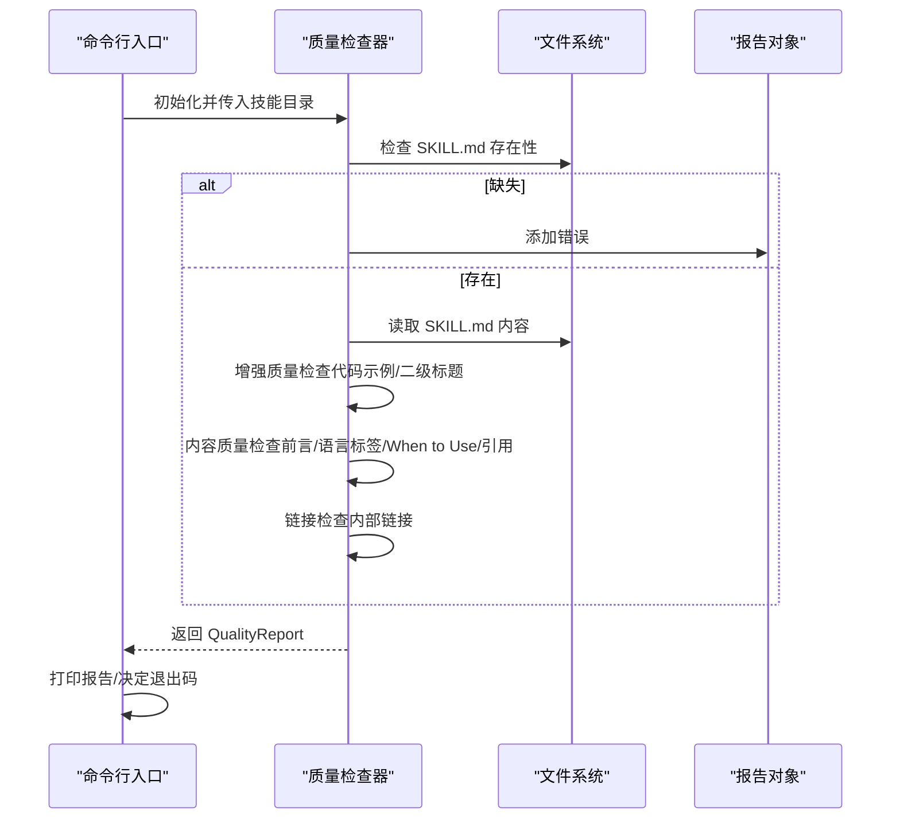
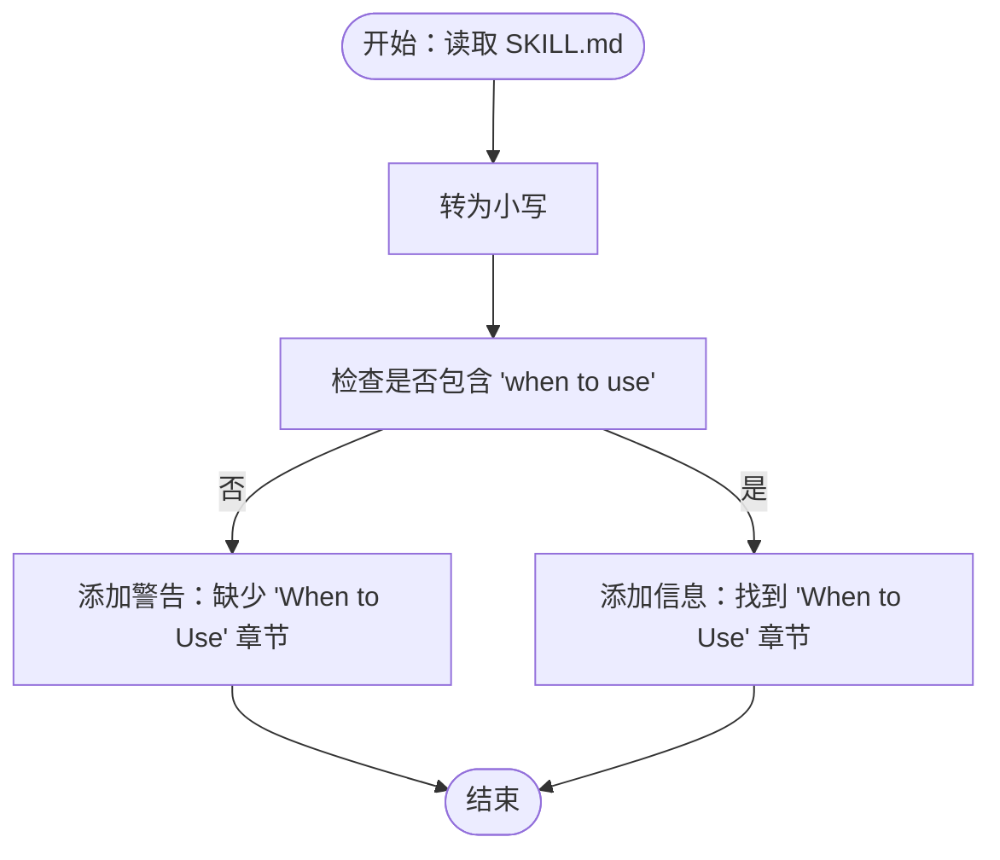
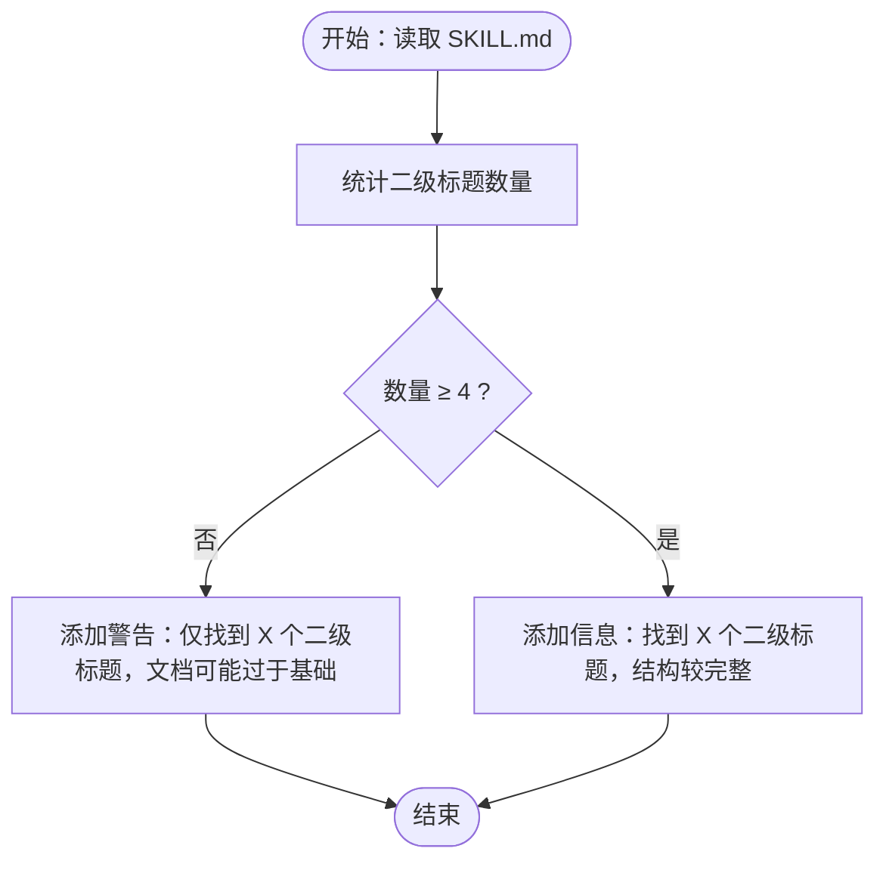
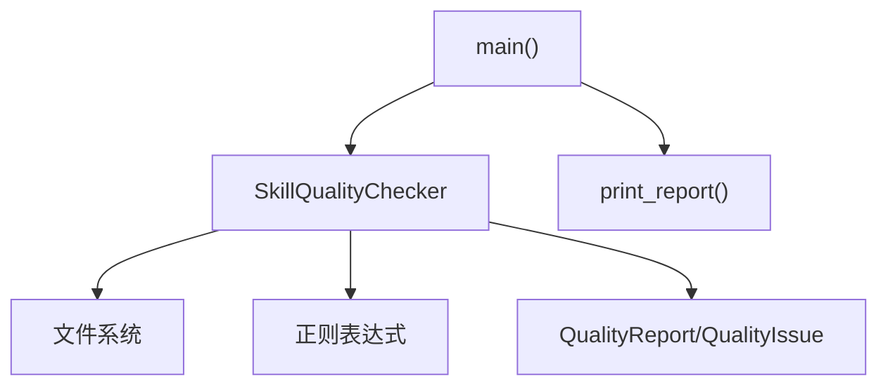

# 关键章节完整性验证

<cite>
**本文引用的文件**
- [quality_checker.py](file://src/skill_seekers/cli/quality_checker.py)
- [test_quality_checker.py](file://tests/test_quality_checker.py)
- [doc_scraper.py](file://src/skill_seekers/cli/doc_scraper.py)
- [ENHANCEMENT.md](file://docs/ENHANCEMENT.md)
</cite>

## 目录
1. [引言](#引言)
2. [项目结构](#项目结构)
3. [核心组件](#核心组件)
4. [架构总览](#架构总览)
5. [详细组件分析](#详细组件分析)
6. [依赖关系分析](#依赖关系分析)
7. [性能考量](#性能考量)
8. [故障排查指南](#故障排查指南)
9. [结论](#结论)

## 引言
本文件聚焦于质量检查器对文档关键章节的完整性检查机制，特别是针对“SKILL.md”中“何时使用（When to Use）”章节的检测与评分策略。我们将解释系统如何通过字符串匹配检测该章节的存在，为什么该章节对技能文档至关重要（帮助用户判断技能的适用场景），以及系统如何将内容转换为小写进行不区分大小写的搜索。同时，文档还涵盖对文档结构丰富性的检查，如二级标题（##）数量的评估：当少于4个时发出警告，认为文档过于基础；达到或超过4个时给予信息提示。这些检查共同提升文档的完整性和专业性，确保技能文档具备实用价值与可维护性。

## 项目结构
质量检查器位于命令行工具模块中，负责对技能输出目录中的“SKILL.md”进行多维度的质量校验。其核心职责包括：
- 基础结构检查（如“SKILL.md”存在性、references目录）
- 内容质量检查（如YAML前言、代码块语言标签、参考文件引用）
- 链接有效性检查（内部链接）
- 关键章节完整性检查（尤其是“何时使用（When to Use）”章节）

图表来源
- [quality_checker.py](file://src/skill_seekers/cli/quality_checker.py#L94-L481)

章节来源
- [quality_checker.py](file://src/skill_seekers/cli/quality_checker.py#L94-L170)

## 核心组件
- 质量检查器类（SkillQualityChecker）：封装所有检查逻辑，按阶段执行并汇总结果。
- 报告对象（QualityReport/QualityIssue）：统一记录错误、警告与信息，并计算质量分数与等级。
- 检查方法：
  - 结构检查：确认“SKILL.md”存在、references目录存在且包含.md文件。
  - 增强质量检查：统计代码示例数量、二级标题数量，给出阈值提示。
  - 内容质量检查：YAML前言格式、语言标签、关键章节“When to Use”、参考文件引用。
  - 链接检查：内部链接有效性。

章节来源
- [quality_checker.py](file://src/skill_seekers/cli/quality_checker.py#L94-L365)

## 架构总览
质量检查器采用分阶段检查流程，每个阶段独立完成特定任务，并将结果统一归档到报告对象中。最终由CLI入口打印报告并根据严格模式决定退出码。

图表来源
- [quality_checker.py](file://src/skill_seekers/cli/quality_checker.py#L111-L170)
- [quality_checker.py](file://src/skill_seekers/cli/quality_checker.py#L179-L365)
- [quality_checker.py](file://src/skill_seekers/cli/quality_checker.py#L367-L481)

## 详细组件分析

### “何时使用（When to Use）”章节完整性检查
- 检测目标：确保“SKILL.md”包含“何时使用（When to Use）”章节，帮助用户判断技能的适用场景。
- 检测方式：对“SKILL.md”的全文进行小写转换后，使用字符串包含判断进行不区分大小写的搜索。
- 触发条件：
  - 若未找到“when to use”，添加一条“内容”类别的警告。
  - 若找到，添加一条“内容”类别的信息提示。
- 重要性说明：
  - 该章节是技能文档的导航中枢，帮助用户在复杂知识库中快速定位合适的触发时机。
  - 在自动增强流程中，该章节被明确要求作为“清晰的触发条件”之一，确保生成的SKILL.md具备实用的触发指引。

图表来源
- [quality_checker.py](file://src/skill_seekers/cli/quality_checker.py#L285-L297)

章节来源
- [quality_checker.py](file://src/skill_seekers/cli/quality_checker.py#L285-L297)
- [doc_scraper.py](file://src/skill_seekers/cli/doc_scraper.py#L1020-L1040)
- [ENHANCEMENT.md](file://docs/ENHANCEMENT.md#L107-L116)

### 文档结构丰富性检查（二级标题数量）
- 检测目标：评估“SKILL.md”的结构丰富度，鼓励更完整的章节组织。
- 检测方式：使用正则表达式匹配二级标题（以“## ”开头的行），统计数量。
- 阈值策略：
  - 少于4个二级标题：添加“增强”类别的警告，提示文档可能过于基础。
  - 达到或超过4个二级标题：添加“增强”类别的信息提示，认可文档结构较为完整。
- 依据来源：
  - 自动增强脚本要求“Excellent Quick Reference section”等高质量章节，这通常对应多个二级标题，从而提升文档的结构性与可读性。

图表来源
- [quality_checker.py](file://src/skill_seekers/cli/quality_checker.py#L180-L221)

章节来源
- [quality_checker.py](file://src/skill_seekers/cli/quality_checker.py#L180-L221)
- [doc_scraper.py](file://src/skill_seekers/cli/doc_scraper.py#L1038-L1090)

### 字符串匹配与大小写处理
- 处理策略：在检测“When to Use”章节时，系统会将全文转换为小写后再进行包含判断，从而实现不区分大小写的搜索。
- 优势：避免因大小写差异导致的误判，提高检测的鲁棒性。
- 实现位置：在内容质量检查阶段，对“SKILL.md”全文进行小写化处理后进行字符串匹配。

章节来源
- [quality_checker.py](file://src/skill_seekers/cli/quality_checker.py#L285-L297)

### 与其他检查的协同作用
- 结构检查：确保“SKILL.md”存在、references目录存在且包含.md文件，为后续章节完整性检查提供前提。
- 内容质量检查：YAML前言、语言标签、参考文件引用等，共同构成文档的专业性与可用性。
- 链接检查：保证内部链接有效，提升文档导航体验。

章节来源
- [quality_checker.py](file://src/skill_seekers/cli/quality_checker.py#L131-L170)
- [quality_checker.py](file://src/skill_seekers/cli/quality_checker.py#L223-L365)

## 依赖关系分析
- 质量检查器依赖文件系统读取“SKILL.md”与references目录。
- 使用正则表达式进行结构与内容识别。
- 通过报告对象统一记录问题类型与严重程度。
- CLI入口负责解析参数、执行检查、打印报告并设置退出码。

图表来源
- [quality_checker.py](file://src/skill_seekers/cli/quality_checker.py#L94-L481)

章节来源
- [quality_checker.py](file://src/skill_seekers/cli/quality_checker.py#L94-L170)
- [quality_checker.py](file://src/skill_seekers/cli/quality_checker.py#L367-L481)

## 性能考量
- 字符串匹配与正则表达式操作的时间复杂度与输入规模线性相关，对一般长度的“SKILL.md”影响可忽略。
- 小写转换与正则匹配在单次检查中开销较小，建议保持当前实现以获得更好的健壮性。
- 对大型技能文档，建议在批量检查时并行处理不同技能目录，但当前质量检查器为单目录检查，无需额外并发优化。

## 故障排查指南
- 缺少“SKILL.md”：检查技能目录是否正确，确认已运行抓取与增强流程。
- references目录为空或不存在：确认抓取流程已完成，参考文件应存在于references目录中。
- “When to Use”章节缺失：在增强流程中确保生成了该章节；若手动编辑，请补充该章节。
- 二级标题过少：增加更多章节（如“快速参考”“工作指南”“资源”等），提升文档结构完整性。
- 内部链接无效：修正链接路径，确保相对路径相对于“SKILL.md”的位置正确。

章节来源
- [quality_checker.py](file://src/skill_seekers/cli/quality_checker.py#L131-L170)
- [quality_checker.py](file://src/skill_seekers/cli/quality_checker.py#L285-L365)
- [test_quality_checker.py](file://tests/test_quality_checker.py#L35-L125)

## 结论
通过对“SKILL.md”的关键章节完整性检查，质量检查器能够有效识别文档在实用性与结构上的不足。特别是对“何时使用（When to Use）”章节的检测与对二级标题数量的评估，为技能文档提供了明确的质量基准。配合增强流程与CLI报告输出，开发者可以持续改进技能文档的专业性与可维护性，确保用户能够在复杂知识体系中快速、准确地选择并应用合适的技能。