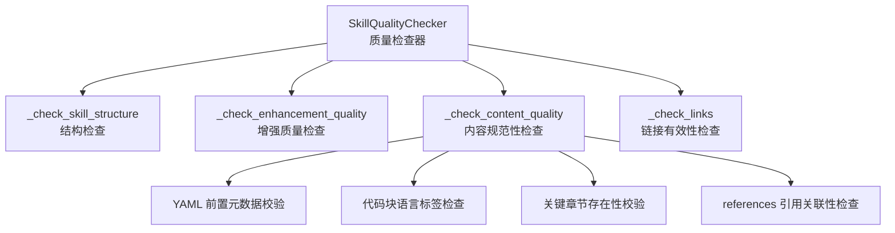
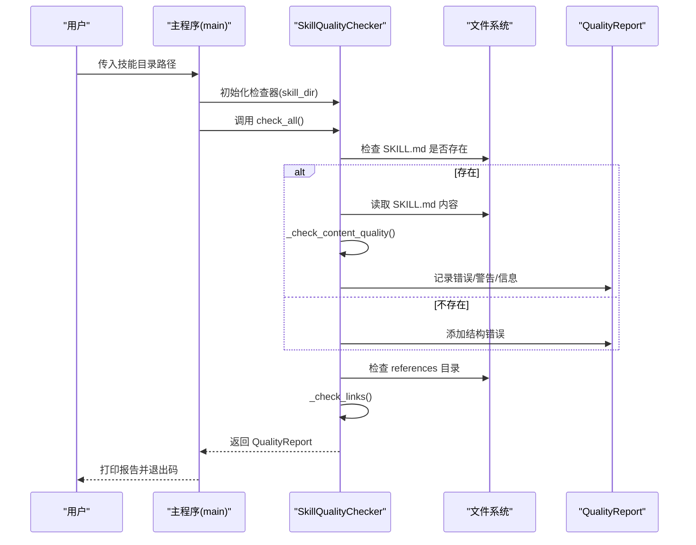
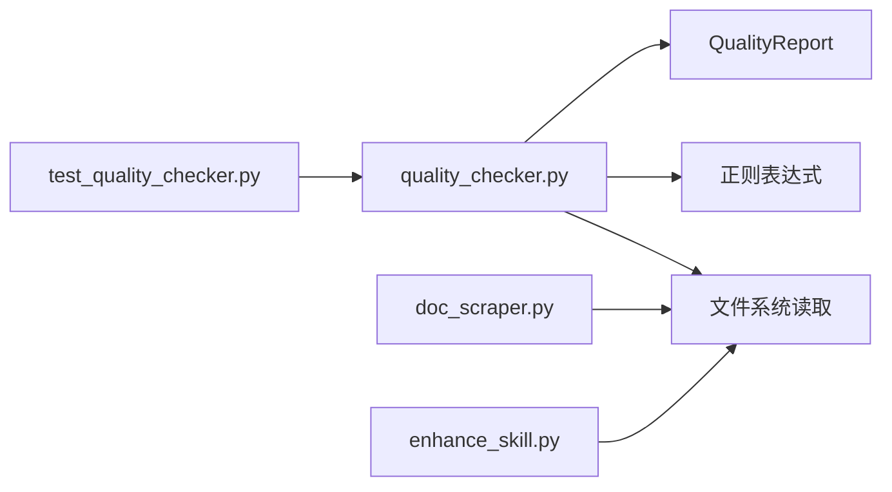

# 内容规范性检查

<cite>
**本文引用的文件列表**
- [quality_checker.py](file://src/skill_seekers/cli/quality_checker.py)
- [test_quality_checker.py](file://tests/test_quality_checker.py)
- [doc_scraper.py](file://src/skill_seekers/cli/doc_scraper.py)
- [enhance_skill.py](file://src/skill_seekers/cli/enhance_skill.py)
</cite>

## 目录
1. [引言](#引言)
2. [项目结构](#项目结构)
3. [核心组件](#核心组件)
4. [架构总览](#架构总览)
5. [详细组件分析](#详细组件分析)
6. [依赖关系分析](#依赖关系分析)
7. [性能考量](#性能考量)
8. [故障排查指南](#故障排查指南)
9. [结论](#结论)

## 引言
本文件围绕质量检查器中的_check_content_quality方法，系统阐述其对技能文档内容规范性的多维度校验机制。重点覆盖：
- YAML 前置元数据的验证：要求文件以“---”开头、解析frontmatter并校验必需字段“name:”，同时记录“description:”存在性；
- 代码块语言标签的检查：通过正则识别未指定语言的代码块（``` 后直接换行）；
- 关键章节“何时使用此技能”的存在性验证；
- references 目录中文件与 SKILL.md 的引用关联性检查，确保技能文档的专业性与完整性。

## 项目结构
质量检查器位于 CLI 子模块中，负责对技能目录进行结构、内容、链接等多方面质量评估。SKILL.md 作为技能的核心文档，references 目录存放参考材料，二者共同构成技能文档体系。



图表来源
- [quality_checker.py](file://src/skill_seekers/cli/quality_checker.py#L111-L129)
- [quality_checker.py](file://src/skill_seekers/cli/quality_checker.py#L223-L321)

章节来源
- [quality_checker.py](file://src/skill_seekers/cli/quality_checker.py#L111-L129)

## 核心组件
- SkillQualityChecker：封装所有质量检查流程，按顺序执行结构、增强质量、内容质量、链接有效性检查，并汇总为报告对象。
- QualityReport：承载质量评分、等级与各类问题（错误、警告、信息），提供评分计算与等级映射。
- _check_content_quality：内容规范性检查的核心方法，涵盖 YAML frontmatter、代码块语言标签、关键章节存在性、references 引用关联性。

章节来源
- [quality_checker.py](file://src/skill_seekers/cli/quality_checker.py#L94-L110)
- [quality_checker.py](file://src/skill_seekers/cli/quality_checker.py#L31-L92)
- [quality_checker.py](file://src/skill_seekers/cli/quality_checker.py#L223-L321)

## 架构总览
质量检查器在入口处接收技能目录路径，初始化检查器并依次运行各项检查，最终输出质量报告。其中，内容规范性检查贯穿 YAML 元数据、代码块语言标签、关键章节与引用文件四个维度，形成闭环的质量保障。



图表来源
- [quality_checker.py](file://src/skill_seekers/cli/quality_checker.py#L111-L129)
- [quality_checker.py](file://src/skill_seekers/cli/quality_checker.py#L322-L365)
- [quality_checker.py](file://src/skill_seekers/cli/quality_checker.py#L418-L481)

## 详细组件分析

### YAML 前置元数据验证机制
- 必备条件：SKILL.md 必须以“---”开头，否则判定为缺少 YAML frontmatter，标记为错误。
- 解析与校验：若存在“---”分隔符，则使用正则提取 frontmatter 内容；若无法匹配到完整 frontmatter 结构，标记为无效格式错误。
- 字段校验：
  - 必需字段“name:”必须存在，缺失则报错；
  - 若存在“description:”，记录一条信息提示已包含描述字段。

上述规则确保技能文档具备标准化的元数据头，便于后续处理与展示。

章节来源
- [quality_checker.py](file://src/skill_seekers/cli/quality_checker.py#L230-L274)

### 代码块语言标签检查逻辑
- 检查策略：通过正则匹配未指定语言的代码块，模式为“``` 后直接换行且下一行非反引号”。若匹配到此类代码块，记录警告，数量等于匹配次数。
- 作用：强制为代码块添加语言标签，提升渲染与语法高亮质量，避免默认无语言导致的可读性问题。

章节来源
- [quality_checker.py](file://src/skill_seekers/cli/quality_checker.py#L276-L283)

### 关键章节“何时使用此技能”的存在性验证
- 检查方式：将 SKILL.md 内容转为小写后搜索“when to use”，若未找到，记录警告；若找到，记录信息提示已存在。
- 设计意图：确保技能文档包含明确的触发条件与使用场景说明，帮助使用者快速判断何时调用该技能。

章节来源
- [quality_checker.py](file://src/skill_seekers/cli/quality_checker.py#L285-L297)

### references 目录中文件与 SKILL.md 的引用关联性检查
- 文件发现：若 references 目录存在且包含至少一个 .md 文件，记录信息提示引用文件数量。
- 引用检测：遍历每个引用文件，检查其文件名是否出现在 SKILL.md 内容中；若没有任何引用文件被提及，记录警告，提示引用文件未被使用。
- 设计意图：保证 references 中的资料与 SKILL.md 内容形成闭环，避免“资料冗余”或“引用缺失”。

章节来源
- [quality_checker.py](file://src/skill_seekers/cli/quality_checker.py#L299-L321)

### 与生成与增强流程的关系
- 自动生成：构建流程会自动生成包含标准 frontmatter、章节与引用文件索引的 SKILL.md，确保基础规范得到满足。
- 增强工具：增强工具在保持 frontmatter 不变的前提下，对 SKILL.md 进行内容优化，补充“何时使用此技能”等关键章节，并强调语言标签的正确使用。

章节来源
- [doc_scraper.py](file://src/skill_seekers/cli/doc_scraper.py#L1020-L1116)
- [enhance_skill.py](file://src/skill_seekers/cli/enhance_skill.py#L87-L128)

## 依赖关系分析
- 内部依赖：
  - SkillQualityChecker 依赖文件系统读取 SKILL.md 与 references 目录；
  - 使用正则表达式进行 frontmatter、代码块与链接解析；
  - 通过 QualityReport 统一记录与汇总问题。
- 外部依赖：
  - 测试用例依赖质量检查器，验证各检查项的行为与边界条件。



图表来源
- [quality_checker.py](file://src/skill_seekers/cli/quality_checker.py#L111-L129)
- [test_quality_checker.py](file://tests/test_quality_checker.py#L1-L298)
- [doc_scraper.py](file://src/skill_seekers/cli/doc_scraper.py#L1020-L1116)
- [enhance_skill.py](file://src/skill_seekers/cli/enhance_skill.py#L87-L128)

## 性能考量
- 正则匹配复杂度：frontmatter 提取与代码块语言标签检查均为线性扫描，时间复杂度 O(n)，n 为 SKILL.md 文本长度；对大型文档影响有限。
- 文件遍历：references 目录遍历仅在目录存在时进行，且仅统计 .md 文件数量，开销较小。
- 报告生成：QualityReport 的评分与等级计算为常数时间操作，整体性能稳定。

## 故障排查指南
- 缺少 YAML frontmatter
  - 现象：报告出现“缺少 YAML frontmatter”错误。
  - 排查：确认 SKILL.md 首行是否为“---”，frontmatter 是否闭合。
  - 参考
    - [quality_checker.py](file://src/skill_seekers/cli/quality_checker.py#L230-L237)
    - [test_quality_checker.py](file://tests/test_quality_checker.py#L68-L83)
- 缺失“name:”字段
  - 现象：报告出现“缺少 name: 字段”错误。
  - 排查：在 frontmatter 中添加“name:”条目，值应为技能名称。
  - 参考
    - [quality_checker.py](file://src/skill_seekers/cli/quality_checker.py#L246-L252)
    - [test_quality_checker.py](file://tests/test_quality_checker.py#L84-L101)
- 代码块未标注语言
  - 现象：报告出现“发现若干未标注语言的代码块”警告。
  - 排查：为每个代码块添加语言标签，例如“```python”。
  - 参考
    - [quality_checker.py](file://src/skill_seekers/cli/quality_checker.py#L276-L283)
    - [test_quality_checker.py](file://tests/test_quality_checker.py#L102-L125)
- 缺少“何时使用此技能”章节
  - 现象：报告出现“缺少‘何时使用此技能’章节”警告。
  - 排查：在 SKILL.md 中添加对应章节，明确触发条件与使用场景。
  - 参考
    - [quality_checker.py](file://src/skill_seekers/cli/quality_checker.py#L285-L297)
    - [test_quality_checker.py](file://tests/test_quality_checker.py#L126-L173)
- references 目录存在但未被引用
  - 现象：报告出现“引用文件存在但未在 SKILL.md 中被提及”的警告。
  - 排查：在 SKILL.md 中添加对引用文件的说明或链接，确保引用闭环。
  - 参考
    - [quality_checker.py](file://src/skill_seekers/cli/quality_checker.py#L299-L321)
    - [test_quality_checker.py](file://tests/test_quality_checker.py#L1-L67)

## 结论
_check_content_quality 方法通过 YAML frontmatter、代码块语言标签、关键章节与引用文件四个维度，系统性地保障了技能文档的专业性与完整性。结合构建与增强流程，能够从源头到成品确保 SKILL.md 符合规范，提升可读性与可用性。建议在编写与维护技能文档时，遵循上述检查点，持续提升质量评分与文档质量等级。