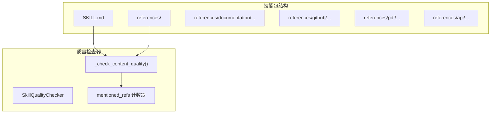
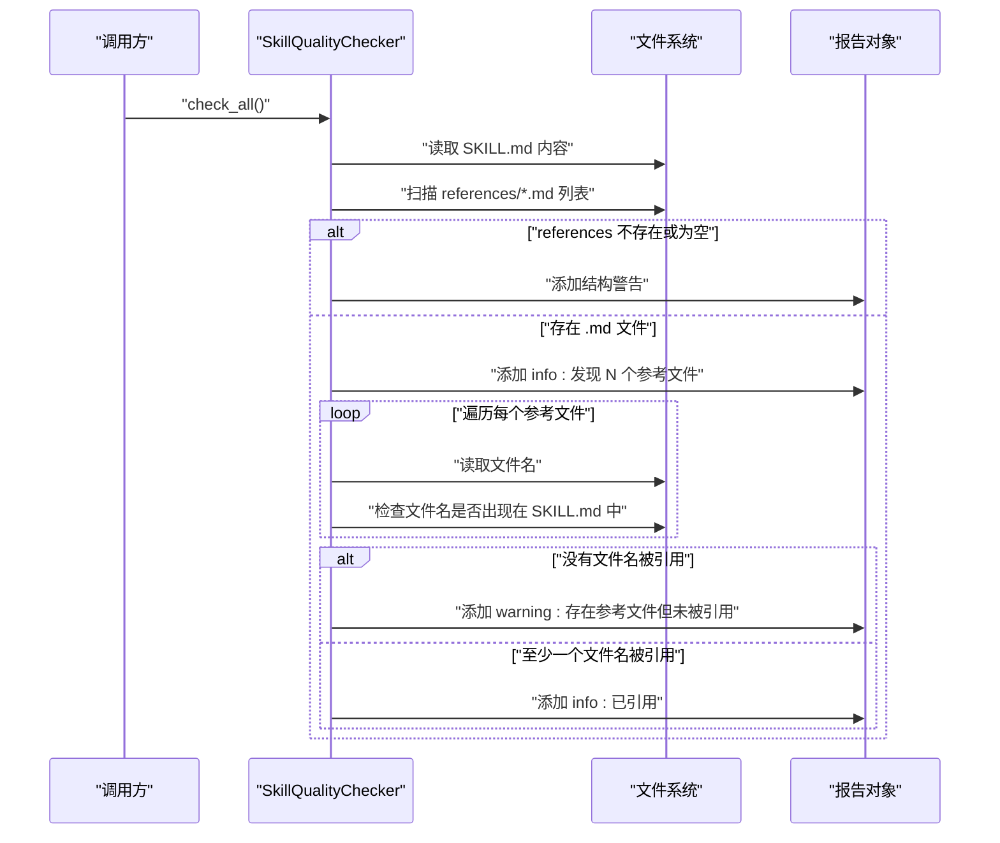
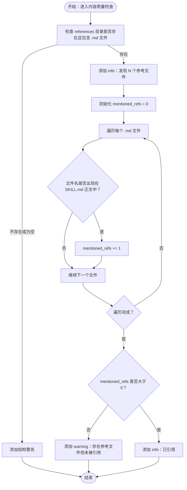
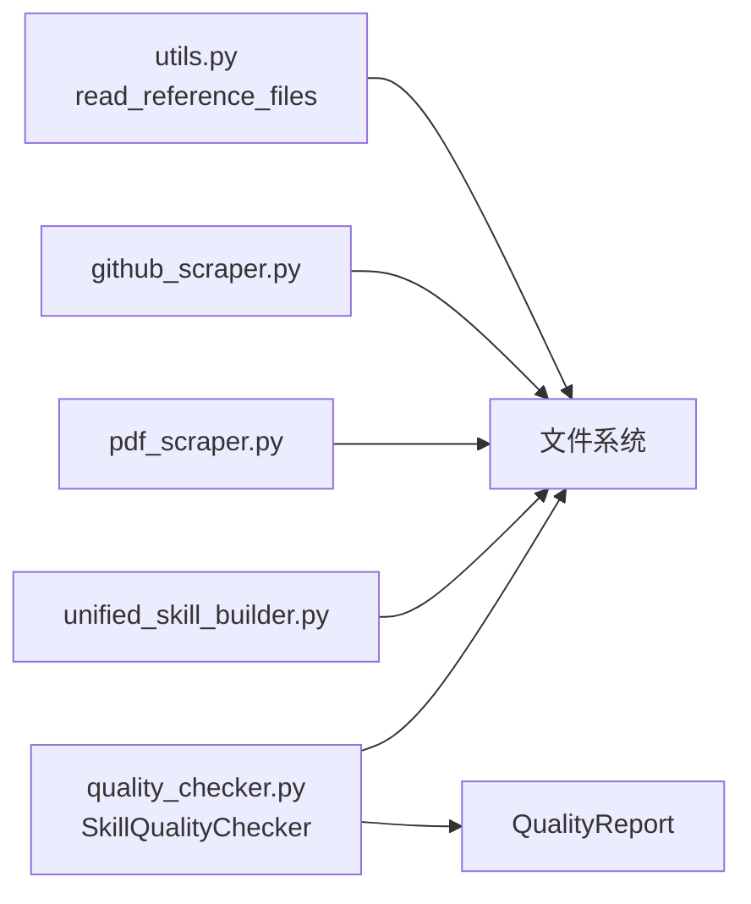

# 引用文件关联性检查

<cite>
**本文引用的文件列表**
- [quality_checker.py](file://src/skill_seekers/cli/quality_checker.py)
- [unified_skill_builder.py](file://src/skill_seekers/cli/unified_skill_builder.py)
- [pdf_scraper.py](file://src/skill_seekers/cli/pdf_scraper.py)
- [github_scraper.py](file://src/skill_seekers/cli/github_scraper.py)
- [utils.py](file://src/skill_seekers/cli/utils.py)
- [test_quality_checker.py](file://tests/test_quality_checker.py)
</cite>

## 目录
1. [引言](#引言)
2. [项目结构与定位](#项目结构与定位)
3. [核心组件与职责](#核心组件与职责)
4. [架构总览](#架构总览)
5. [详细组件分析](#详细组件分析)
6. [依赖关系分析](#依赖关系分析)
7. [性能与复杂度](#性能与复杂度)
8. [故障排查指南](#故障排查指南)
9. [结论与最佳实践](#结论与最佳实践)

## 引言
本文聚焦于质量检查器对“references 目录文件引用完整性的验证逻辑，系统性说明以下要点：
- 如何遍历 references 目录下的所有 .md 文件；
- 如何检查这些文件的文件名是否在 SKILL.md 的正文中被引用；
- mentioned_refs 计数器的工作机制与判定规则；
- 当存在参考文件但无一被引用时，系统发出警告，提示“资源孤立”风险；
- 当检测到至少一个引用文件被引用时，系统给出正面信息反馈（info）；
- 该机制如何确保文档内部链接的完整性，防止“幽灵文件”，提升技能包整体质量。

## 项目结构与定位
- 质量检查器位于 CLI 模块，负责对技能包进行结构、内容、链接与增强质量的综合评估；
- references 目录由多种数据源生成（文档、GitHub、PDF 等），统一组织为多类参考文件；
- 质量检查器仅对已存在的 references 目录与 SKILL.md 内容进行静态校验，不修改任何文件。

图表来源
- [quality_checker.py](file://src/skill_seekers/cli/quality_checker.py#L299-L321)
- [unified_skill_builder.py](file://src/skill_seekers/cli/unified_skill_builder.py#L266-L371)
- [pdf_scraper.py](file://src/skill_seekers/cli/pdf_scraper.py#L174-L205)
- [github_scraper.py](file://src/skill_seekers/cli/github_scraper.py#L653-L669)

章节来源
- [quality_checker.py](file://src/skill_seekers/cli/quality_checker.py#L299-L321)

## 核心组件与职责
- SkillQualityChecker：封装技能包质量检查流程，提供结构、增强质量、内容质量、链接有效性等检查方法；
- references 目录生成：由不同抓取器/构建器创建，包含来自文档、GitHub、PDF 等来源的参考文件；
- mentioned_refs 计数器：用于统计 SKILL.md 正文中出现的参考文件名数量，作为“引用完整性”的关键指标。

章节来源
- [quality_checker.py](file://src/skill_seekers/cli/quality_checker.py#L94-L110)
- [unified_skill_builder.py](file://src/skill_seekers/cli/unified_skill_builder.py#L266-L371)
- [pdf_scraper.py](file://src/skill_seekers/cli/pdf_scraper.py#L174-L205)
- [github_scraper.py](file://src/skill_seekers/cli/github_scraper.py#L653-L669)

## 架构总览
质量检查器在执行内容质量检查阶段，对 references 目录进行如下处理：
- 若 references 目录不存在或为空，分别给出结构警告；
- 若存在 .md 文件，则记录“找到 N 个参考文件”的信息；
- 遍历每个参考文件，检查其文件名是否出现在 SKILL.md 正文中；
- 若没有任何文件名被引用，发出“存在参考文件但未被引用”的警告；
- 若至少有一个文件名被引用，给出“已引用”的信息反馈。

图表来源
- [quality_checker.py](file://src/skill_seekers/cli/quality_checker.py#L299-L321)

## 详细组件分析

### 引用完整性检查流程（mentioned_refs）
- 触发点：在内容质量检查阶段，若发现 references 目录存在且包含 .md 文件；
- 遍历策略：对每个 .md 文件，提取其文件名（不含路径）；
- 匹配方式：将文件名直接与 SKILL.md 的正文内容进行包含匹配；
- 计数器：mentioned_refs 统计命中次数；
- 结果判定：
  - 若 mentioned_refs == 0：发出“存在参考文件但未被引用”的警告；
  - 若 mentioned_refs > 0：发出“已引用”的信息反馈。

图表来源
- [quality_checker.py](file://src/skill_seekers/cli/quality_checker.py#L299-L321)

章节来源
- [quality_checker.py](file://src/skill_seekers/cli/quality_checker.py#L299-L321)

### references 目录的来源与组织
- 文档来源：统一构建器按来源类型创建子目录（如 documentation、github、pdf、api 等），并在其中生成索引与分类文件；
- GitHub 来源：抓取器/构建器生成 README、Issues、Releases 等参考文件；
- PDF 来源：抓取器按类别生成参考文件，并生成索引；
- 参考文件命名与层级：通常采用语义化文件名（如 index.md、getting_started.md、api.md 等），便于在 SKILL.md 中引用。

章节来源
- [unified_skill_builder.py](file://src/skill_seekers/cli/unified_skill_builder.py#L266-L371)
- [pdf_scraper.py](file://src/skill_seekers/cli/pdf_scraper.py#L174-L205)
- [github_scraper.py](file://src/skill_seekers/cli/github_scraper.py#L653-L669)

### 引用文件与导航提示的关系
- 在 SKILL.md 中，通常会提供 references 目录的导航提示与快速入口，例如列出各来源的参考目录链接；
- 质量检查器并不强制要求必须在 SKILL.md 中显式列出每个文件名，而是检查“文件名是否出现”这一事实；
- 这种设计允许作者以更灵活的方式组织引用，例如通过目录链接或段落说明引导用户访问具体文件。

章节来源
- [unified_skill_builder.py](file://src/skill_seekers/cli/unified_skill_builder.py#L131-L155)

### 测试与行为验证
- 单元测试覆盖了引用文件未被引用时的行为，确保在存在参考文件但未被引用时发出警告；
- 测试还验证了其他质量检查项（如 frontmatter、代码语言标签、链接有效性等）。

章节来源
- [test_quality_checker.py](file://tests/test_quality_checker.py#L1-L298)

## 依赖关系分析
- 质量检查器依赖文件系统接口读取 SKILL.md 与 references 下的 .md 文件；
- references 目录的生成由构建器/抓取器负责，质量检查器不参与生成过程；
- 质量检查器通过报告对象记录错误、警告与信息，最终汇总输出。

图表来源
- [quality_checker.py](file://src/skill_seekers/cli/quality_checker.py#L299-L321)
- [unified_skill_builder.py](file://src/skill_seekers/cli/unified_skill_builder.py#L266-L371)
- [pdf_scraper.py](file://src/skill_seekers/cli/pdf_scraper.py#L174-L205)
- [github_scraper.py](file://src/skill_seekers/cli/github_scraper.py#L653-L669)
- [utils.py](file://src/skill_seekers/cli/utils.py#L182-L221)

## 性能与复杂度
- 时间复杂度：O(F + C)，其中 F 为 references 下 .md 文件数量，C 为 SKILL.md 正文字符数；
- 空间复杂度：O(1)（仅使用常量级变量，如计数器与临时标志）；
- 优化建议：
  - 若 references 数量巨大，可考虑对文件名集合建立哈希表以加速查找；
  - 对超大 SKILL.md 文件，可分段匹配或限制扫描范围；
  - 将文件名匹配改为大小写不敏感的预处理（当前实现为直接包含匹配）。

章节来源
- [quality_checker.py](file://src/skill_seekers/cli/quality_checker.py#L299-L321)

## 故障排查指南
- references 目录缺失或为空
  - 现象：出现“references/ 目录未找到/为空”的结构警告；
  - 原因：构建器/抓取器未生成参考文件或路径不正确；
  - 处理：确认数据源抓取成功，检查 references 目录生成逻辑。
- 存在参考文件但未被引用
  - 现象：出现“存在参考文件但未被引用”的警告；
  - 原因：文件名未出现在 SKILL.md 正文中；可能作者仅提供了导航链接而未直接提及文件名；
  - 处理：在 SKILL.md 中显式提及相关文件名，或在导航段落中明确说明对应文件内容。
- 引用文件被引用但链接仍无效
  - 现象：引用文件被计数，但内部链接仍被标记为失效；
  - 原因：引用的是文件名而非相对路径，或路径拼接错误；
  - 处理：在 SKILL.md 中使用正确的相对路径引用，或在 references 目录下保持一致的层级结构。

章节来源
- [quality_checker.py](file://src/skill_seekers/cli/quality_checker.py#L142-L154)
- [quality_checker.py](file://src/skill_seekers/cli/quality_checker.py#L299-L321)
- [quality_checker.py](file://src/skill_seekers/cli/quality_checker.py#L322-L365)

## 结论与最佳实践
- mentioned_refs 计数器通过“文件名是否出现在 SKILL.md 正文中”这一简单而有效的规则，实现了对“引用完整性”的快速验证；
- 当存在参考文件但无一被引用时，系统发出警告，有效避免“幽灵文件”与资源孤立问题；
- 当至少一个引用文件被引用时，系统给出正面信息反馈，鼓励作者完善文档结构；
- 建议在 SKILL.md 中：
  - 明确列出 references 目录下的关键文件名或目录，便于读者快速定位；
  - 使用清晰的导航段落，将 references 与 SKILL.md 的内容有机衔接；
  - 保持 references 目录结构稳定，避免频繁重命名导致引用失效。