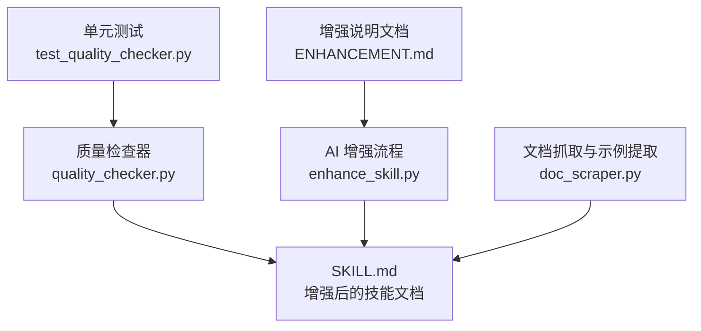
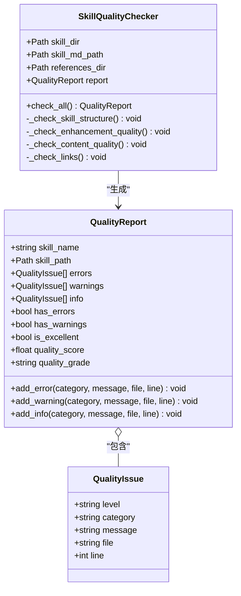
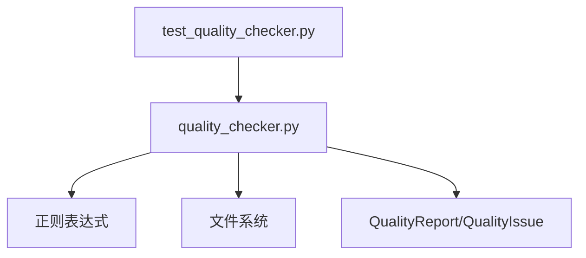

# 代码示例验证

<cite>
**本文引用的文件列表**
- [quality_checker.py](file://src/skill_seekers/cli/quality_checker.py)
- [test_quality_checker.py](file://tests/test_quality_checker.py)
- [enhance_skill.py](file://src/skill_seekers/cli/enhance_skill.py)
- [doc_scraper.py](file://src/skill_seekers/cli/doc_scraper.py)
- [ENHANCEMENT.md](file://docs/ENHANCEMENT.md)
</cite>

## 目录
1. [简介](#简介)
2. [项目结构](#项目结构)
3. [核心组件](#核心组件)
4. [架构总览](#架构总览)
5. [详细组件分析](#详细组件分析)
6. [依赖关系分析](#依赖关系分析)
7. [性能考量](#性能考量)
8. [故障排查指南](#故障排查指南)
9. [结论](#结论)
10. [附录](#附录)

## 简介
本文件聚焦于质量检查器中“基于正则表达式 r'```[\w-]+\n' 的代码示例检测机制”。该机制用于识别 Markdown 中带有语言标识的代码块，统计数量并据此给出质量反馈：0 个为警告，少于 3 个为信息提示，3 个及以上为正面反馈。该检查是“增强质量关键指标”的一部分，旨在确保 SKILL.md 在 AI 增强后具备充足的高质量代码示例，提升技能包的可读性与实用性。

## 项目结构
与“代码示例检测”直接相关的模块与文件：
- 质量检查器：src/skill_seekers/cli/quality_checker.py
- 单元测试：tests/test_quality_checker.py
- AI 增强流程（生成 SKILL.md 的过程）：src/skill_seekers/cli/enhance_skill.py
- 文档抓取与示例提取（生成 SKILL.md 的数据来源之一）：src/skill_seekers/cli/doc_scraper.py
- 增强说明文档：docs/ENHANCEMENT.md



图表来源
- [quality_checker.py](file://src/skill_seekers/cli/quality_checker.py#L156-L221)
- [enhance_skill.py](file://src/skill_seekers/cli/enhance_skill.py#L87-L116)
- [doc_scraper.py](file://src/skill_seekers/cli/doc_scraper.py#L998-L1029)
- [test_quality_checker.py](file://tests/test_quality_checker.py#L1-L298)

章节来源
- [quality_checker.py](file://src/skill_seekers/cli/quality_checker.py#L156-L221)
- [test_quality_checker.py](file://tests/test_quality_checker.py#L1-L298)

## 核心组件
- 正则表达式与统计逻辑
  - 使用正则 r'```[\w-]+\n' 匹配 Markdown 代码块起始行，且要求语言标识存在（\w 或 -），从而排除仅有 ``` 的空块。
  - 通过 findall 统计满足条件的代码块数量。
- 分支判定与反馈
  - 数量为 0：添加“增强”类别的警告，提示缺少示例。
  - 数量在 1-2：添加“增强”类别的信息提示，建议增加示例。
  - 数量 ≥ 3：添加“增强”类别的信息提示，表示示例充足。
- 上下文关联
  - 该检查位于 _check_enhancement_quality 方法内，与“章节数量”“模板占位符”等一起构成增强质量评估的一部分。

章节来源
- [quality_checker.py](file://src/skill_seekers/cli/quality_checker.py#L179-L208)

## 架构总览
从输入到输出的关键流程如下：
- 输入：技能目录下的 SKILL.md（经 AI 增强）
- 处理：质量检查器读取内容，使用正则统计带语言标识的代码块数量
- 输出：根据阈值生成质量报告（错误/警告/信息）

```mermaid
sequenceDiagram
participant U as "用户"
participant QC as "质量检查器"
participant FS as "文件系统"
participant RE as "正则引擎"
participant RP as "报告生成"
U->>QC : 运行质量检查
QC->>FS : 读取 SKILL.md 内容
QC->>RE : 使用 r'
```[\\w-]+\\n' 统计代码块
  RE-->>QC: 返回匹配数量 n
  QC->>RP: 按 n 的阈值添加问题项
  RP-->>U: 打印质量报告（含分数与等级）
```

图表来源
- [quality_checker.py](file://src/skill_seekers/cli/quality_checker.py#L156-L221)

## 详细组件分析

### 正则表达式 r'```[\w-]+\n' 的匹配行为与语义
- 作用目标：Markdown 代码块起始行，要求包含语言标识（如 ```python、```javascript、```cpp 等）。
- 匹配要点：
  - 以三个反引号开头
  - 后跟一个或多个字母/数字/连字符，作为语言标识
  - 以换行符结尾
- 与“无语言标识代码块”的区别：
  - 另一处检查会单独统计仅 ``` 开头而未指定语言的代码块，用于提示完善语言标签。
- 为什么选择该模式：
  - 有效过滤掉纯文本片段或仅包含 ``` 的空块
  - 保证统计的是“有语言标识”的示例，便于后续评分与反馈

章节来源
- [quality_checker.py](file://src/skill_seekers/cli/quality_checker.py#L179-L188)
- [quality_checker.py](file://src/skill_seekers/cli/quality_checker.py#L276-L283)

### findall 统计与阈值判定
- 统计方式：对 SKILL.md 全文执行 findall，返回所有满足模式的匹配对象，再取长度即为数量。
- 阈值策略：
  - 0 个：警告（提示需要补充示例）
  - 1-2 个：信息（建议增加示例以提升质量）
  - ≥3 个：信息（肯定示例数量充足）
- 与其他增强指标的关系：
  - 同时检查“章节数量”“模板占位符”等，综合形成对“增强质量”的全面评估。

章节来源
- [quality_checker.py](file://src/skill_seekers/cli/quality_checker.py#L186-L208)
- [quality_checker.py](file://src/skill_seekers/cli/quality_checker.py#L209-L221)

### 评分逻辑与用户反馈
- 评分与等级：
  - 质量分数从 100 开始，每一条错误扣 15 分，每一条警告扣 5 分，最低不低于 0。
  - 等级划分：≥90 为 A，80-89 为 B，70-79 为 C，60-69 为 D，<60 为 F。
- 代码示例数量对评分的影响：
  - 该检查本身不直接扣分，但会影响整体“增强质量”的感知与报告中的“信息/警告”条目数量，间接影响最终分数与等级。
- 用户反馈示例：
  - 0 个：提示“考虑增强”，建议补充示例
  - 1-2 个：提示“示例较少”，建议增加
  - ≥3 个：提示“示例充足”，鼓励保持

章节来源
- [quality_checker.py](file://src/skill_seekers/cli/quality_checker.py#L65-L92)
- [quality_checker.py](file://src/skill_seekers/cli/quality_checker.py#L191-L208)

### 实际案例说明
- 案例一：无示例
  - 场景：SKILL.md 中没有带语言标识的代码块
  - 行为：添加“增强”类别的警告
  - 结果：报告中出现“考虑增强”的提示
- 案例二：少量示例
  - 场景：仅 1-2 个带语言标识的代码块
  - 行为：添加“增强”类别的信息提示，建议增加示例
- 案例三：充足示例
  - 场景：≥3 个带语言标识的代码块
  - 行为：添加“增强”类别的信息提示，表示示例充足
- 与 AI 增强的关系：
  - AI 增强流程会从参考文档中抽取高质量示例并写入 SKILL.md，从而提升该统计值
  - 增强说明文档强调“提取最佳示例”的重要性，与本检查的目标一致

章节来源
- [quality_checker.py](file://src/skill_seekers/cli/quality_checker.py#L191-L208)
- [enhance_skill.py](file://src/skill_seekers/cli/enhance_skill.py#L87-L116)
- [doc_scraper.py](file://src/skill_seekers/cli/doc_scraper.py#L998-L1029)
- [ENHANCEMENT.md](file://docs/ENHANCEMENT.md#L171-L217)

### 类图：质量检查器与报告模型


图表来源
- [quality_checker.py](file://src/skill_seekers/cli/quality_checker.py#L19-L92)
- [quality_checker.py](file://src/skill_seekers/cli/quality_checker.py#L94-L155)

## 依赖关系分析
- 质量检查器依赖：
  - 文件系统：读取 SKILL.md 与 references 目录
  - 正则库：进行代码块匹配与统计
  - 数据结构：QualityReport/QualityIssue 用于组织反馈
- 测试覆盖：
  - 单元测试验证了“缺失 SKILL.md”“缺失 references”“无效 YAML frontmatter”“无语言标签代码块”“良好技能的高分”等场景
  - 对“代码示例数量”的阈值判定有明确断言



图表来源
- [quality_checker.py](file://src/skill_seekers/cli/quality_checker.py#L156-L221)
- [test_quality_checker.py](file://tests/test_quality_checker.py#L1-L298)

章节来源
- [quality_checker.py](file://src/skill_seekers/cli/quality_checker.py#L156-L221)
- [test_quality_checker.py](file://tests/test_quality_checker.py#L1-L298)

## 性能考量
- 正则匹配复杂度：O(n)，n 为文档长度；findall 会扫描全文，但对一般 SKILL.md 规模足够高效。
- 优化建议：
  - 若文档极大，可先按段落切分再匹配，减少全量扫描成本（当前实现未采用此策略）。
  - 将统计结果缓存至报告对象，避免重复计算。
- 与增强流程的配合：
  - AI 增强阶段已过滤示例长度与语言，有助于提高本检查的准确性与稳定性。

[本节为通用性能讨论，不直接分析具体文件]

## 故障排查指南
- 常见问题与定位：
  - 误报/漏报：确认 Markdown 代码块是否正确使用语言标识（例如 ```python 而非 ```）
  - 低分但无错误：可能因示例数量不足导致“信息”提示较多，建议增加示例
  - 无示例：检查 AI 增强是否成功生成示例，或确认参考文档中是否存在可抽取的示例
- 相关测试用例参考：
  - 缺失 SKILL.md、缺失 references、无效 YAML frontmatter、无语言标签代码块、良好技能的高分等
- 建议操作：
  - 重新运行 AI 增强，确保参考文档中包含高质量示例
  - 手动检查 SKILL.md 的代码块语言标签是否齐全

章节来源
- [test_quality_checker.py](file://tests/test_quality_checker.py#L1-L298)
- [quality_checker.py](file://src/skill_seekers/cli/quality_checker.py#L156-L221)

## 结论
基于正则表达式 r'```[\w-]+\n' 的代码示例检测机制，能够准确识别带有语言标识的 Markdown 代码块，并通过阈值策略给出针对性反馈。该检查作为“增强质量关键指标”的一部分，与章节数量、模板占位符等共同构成 SKILL.md 质量评估体系。结合 AI 增强流程与测试验证，该机制有效提升了技能包的示例密度与可读性，为用户提供清晰的质量改进建议。

[本节为总结性内容，不直接分析具体文件]

## 附录
- 相关实现路径参考：
  - 正则与统计：[quality_checker.py](file://src/skill_seekers/cli/quality_checker.py#L179-L208)
  - 无语言标签代码块检查：[quality_checker.py](file://src/skill_seekers/cli/quality_checker.py#L276-L283)
  - 增强流程与示例抽取：[enhance_skill.py](file://src/skill_seekers/cli/enhance_skill.py#L87-L116), [doc_scraper.py](file://src/skill_seekers/cli/doc_scraper.py#L998-L1029)
  - 测试用例：[test_quality_checker.py](file://tests/test_quality_checker.py#L1-L298)
  - 增强说明文档：[ENHANCEMENT.md](file://docs/ENHANCEMENT.md#L171-L217)