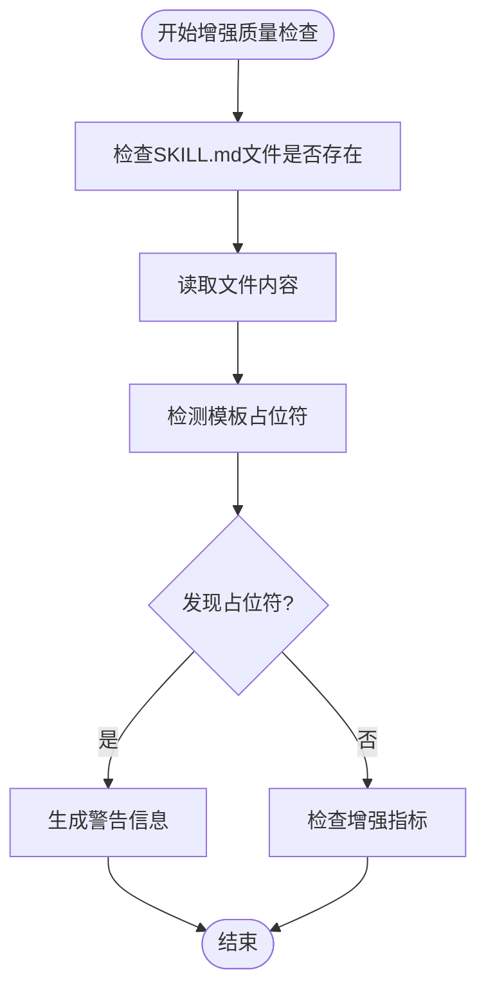
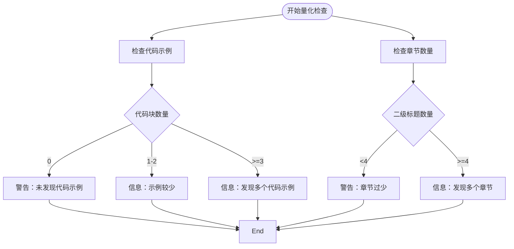

# 增强质量检查

<cite>
**本文档引用的文件**  
- [quality_checker.py](file://src/skill_seekers/cli/quality_checker.py#L156-L222)
- [ENHANCEMENT.md](file://docs/ENHANCEMENT.md)
- [enhance_skill.py](file://src/skill_seekers/cli/enhance_skill.py)
- [enhance_skill_local.py](file://src/skill_seekers/cli/enhance_skill_local.py)
</cite>

## 目录
1. [增强质量评估体系](#增强质量评估体系)
2. [未完成增强的检测机制](#未完成增强的检测机制)
3. [增强指标的量化检查](#增强指标的量化检查)
4. [高质量增强的积极信号识别](#高质量增强的积极信号识别)

## 增强质量评估体系

`_check_enhancement_quality` 方法是 SkillQualityChecker 类中的核心功能，用于评估 SKILL.md 文件的增强质量。该方法通过检测模板占位符、统计代码示例和章节数量等指标，全面评估技能文档的完善程度。质量检查结果分为错误（error）、警告（warning）和信息（info）三个级别，分别对应不同严重程度的问题。

该方法首先检查 SKILL.md 文件是否存在，然后读取其内容进行分析。评估体系主要包含两个方面：一是检测未完成增强的迹象，二是量化检查增强内容的质量。通过这种双重评估机制，系统能够准确识别出需要改进的技能文档，并为用户提供具体的优化建议。

**增强质量评估体系的实现流程如下：**
1. 读取 SKILL.md 文件内容
2. 检测模板占位符等未完成增强的迹象
3. 使用正则表达式统计代码示例、真实案例和章节数量
4. 根据预设阈值生成相应的警告或信息提示
5. 综合评估并生成质量报告

## 未完成增强的检测机制

`_check_enhancement_quality` 方法通过检测特定的模板占位符来识别未完成的增强。这些占位符是技能文档在初始生成阶段留下的标记，表明相应部分尚未被AI增强。当这些占位符仍然存在于最终的 SKILL.md 文件中时，说明增强过程可能未完成或存在问题。

检测机制主要针对以下几类模板占位符：
- "TODO:"：表示有待完成的任务或需要补充的内容
- "[Add description]"：表示需要添加描述性文字
- "[Framework specific tips]"：表示需要添加框架特定的使用技巧
- "coming soon"：表示功能即将推出，但尚未实现

检测过程不区分大小写，确保能够捕捉到各种形式的占位符。一旦发现这些占位符，系统会生成警告信息，提示用户 SKILL.md 文件可能未经过充分增强。这种检测机制简单而有效，能够快速识别出明显未完成的增强工作。



**图示来源**
- [quality_checker.py](file://src/skill_seekers/cli/quality_checker.py#L164-L177)

## 增强指标的量化检查

`_check_enhancement_quality` 方法通过三类增强指标的量化检查来评估技能文档的质量：代码示例、真实案例和章节数量。这些指标使用正则表达式进行统计，并根据预设阈值生成相应的警告或信息提示。

### 代码示例检查

代码示例是评估技能文档实用性的重要指标。系统使用正则表达式 `r'```[\w-]+\n'` 来匹配带有语言标签的代码块。统计逻辑如下：
- 如果没有发现代码示例，生成警告提示"考虑增强"
- 如果代码示例少于3个，生成信息提示"更多示例将提高质量"
- 如果代码示例达到或超过3个，生成积极信息"✓ 发现多个代码示例"

### 真实案例检查

真实案例能够帮助用户更好地理解技能的应用场景。系统使用正则表达式 `r'Example:'`（不区分大小写）来匹配文档中的示例部分。虽然当前实现中没有对真实案例的数量设置阈值，但其存在本身就是高质量增强的一个重要信号。

### 章节数量检查

章节数量反映了技能文档的结构完整性和内容丰富度。系统使用正则表达式 `r'^## .+'` 来匹配二级标题，从而统计章节数量。评估逻辑如下：
- 如果章节数量少于4个，生成警告提示"SKILL.md可能过于基础"
- 如果章节数量达到或超过4个，生成积极信息"✓ 发现多个章节"



**图示来源**
- [quality_checker.py](file://src/skill_seekers/cli/quality_checker.py#L180-L221)

## 高质量增强的积极信号识别

高质量增强的积极信号主要体现在代码示例和章节数量达到或超过预设阈值。当系统检测到足够多的代码示例（3个或以上）和章节（4个或以上）时，会生成以"✓"开头的积极信息，表明该技能文档已经达到了较高的质量标准。

这些积极信号不仅反映了文档的内容丰富度，也体现了AI增强的有效性。例如，"✓ 发现多个代码示例"和"✓ 发现多个章节"这样的信息提示，让用户能够直观地了解文档的增强效果。同时，系统还会检查"当使用此技能时"（When to Use）等关键部分是否存在，如果发现这些重要部分，也会生成相应的积极信息。

高质量增强的另一个重要特征是文档结构的完整性。除了代码示例和章节外，系统还会检查YAML前言、引用文件提及等要素。当所有这些要素都齐全时，质量评分将达到优秀水平（A级），表明该技能文档已经具备了很高的实用价值。

**本节来源**
- [quality_checker.py](file://src/skill_seekers/cli/quality_checker.py#L190-L221)
- [ENHANCEMENT.md](file://docs/ENHANCEMENT.md)