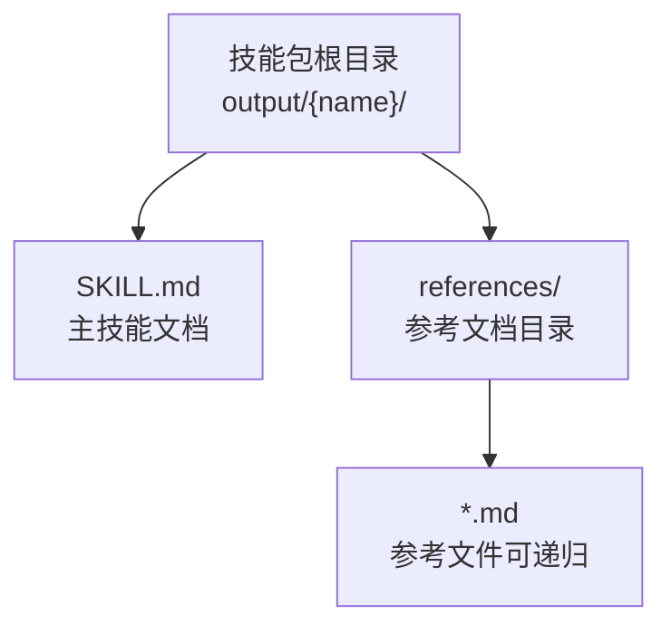
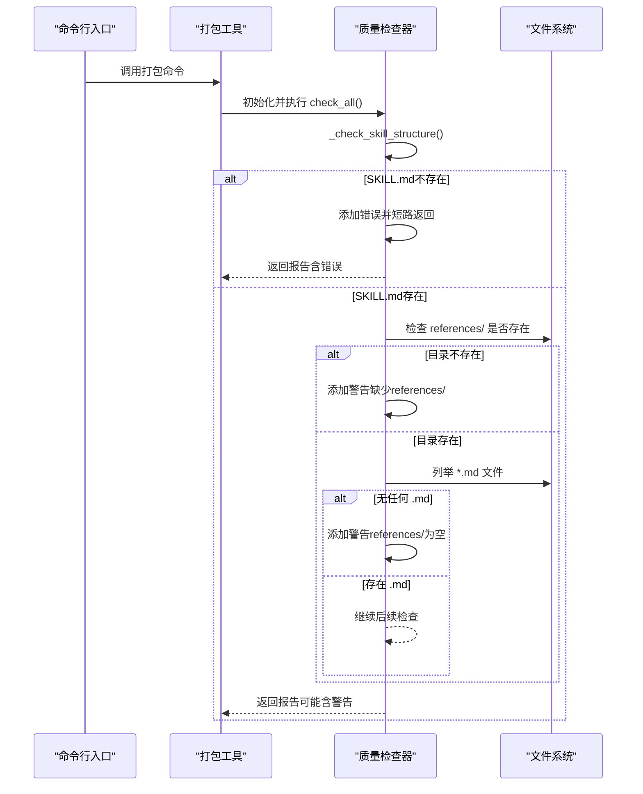
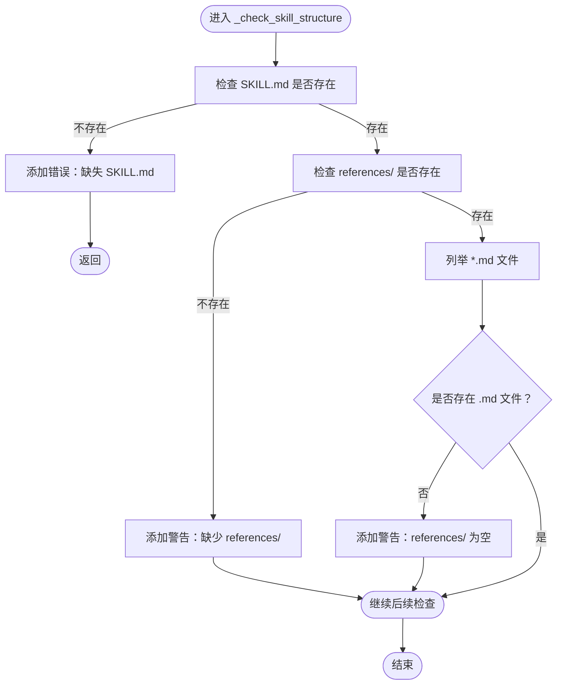
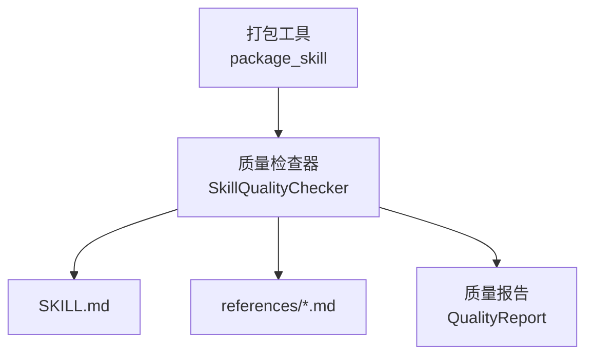

# 结构完整性验证

<cite>
**本文引用的文件**
- [quality_checker.py](file://src/skill_seekers/cli/quality_checker.py)
- [utils.py](file://src/skill_seekers/cli/utils.py)
- [package_skill.py](file://src/skill_seekers/cli/package_skill.py)
- [test_quality_checker.py](file://tests/test_quality_checker.py)
- [STRUCTURE.md](file://STRUCTURE.md)
</cite>

## 目录
1. [简介](#简介)
2. [项目结构](#项目结构)
3. [核心组件](#核心组件)
4. [架构总览](#架构总览)
5. [详细组件分析](#详细组件分析)
6. [依赖关系分析](#依赖关系分析)
7. [性能考量](#性能考量)
8. [故障排查指南](#故障排查指南)
9. [结论](#结论)

## 简介
本节聚焦于质量检查器中_check_skill_structure方法的实现逻辑，系统阐述其如何验证技能包的核心结构要求：SKILL.md文件的存在性、references/目录的存在性与非空性，并解释短路逻辑、分级验证策略、质量报告中的错误与警告生成条件，以及实际输出示例与对技能包完整性的意义。

## 项目结构
技能包的标准目录结构由项目文档明确给出：
- 根目录下的output/{name}/为技能包输出目录
- 必须包含：SKILL.md主文档
- 可选但推荐：references/参考文档目录（可包含多级嵌套）

图表来源
- [STRUCTURE.md](file://STRUCTURE.md#L55-L60)

章节来源
- [STRUCTURE.md](file://STRUCTURE.md#L55-L60)

## 核心组件
- 质量检查器类：负责执行各类质量检查并汇总到质量报告对象
- 质量报告类：承载错误、警告、信息三类问题，并提供评分与等级计算
- 工具函数：用于校验技能包目录结构（存在性、是否为目录、是否存在SKILL.md）
- 打包流程：在打包前运行质量检查，若存在错误或警告会提示用户确认

章节来源
- [quality_checker.py](file://src/skill_seekers/cli/quality_checker.py#L131-L155)
- [utils.py](file://src/skill_seekers/cli/utils.py#L138-L156)
- [package_skill.py](file://src/skill_seekers/cli/package_skill.py#L39-L117)

## 架构总览
_check_skill_structure方法位于质量检查器内部，作为“基础结构检查”的第一步，直接决定后续检查是否继续执行。其调用链如下：

图表来源
- [package_skill.py](file://src/skill_seekers/cli/package_skill.py#L59-L82)
- [quality_checker.py](file://src/skill_seekers/cli/quality_checker.py#L111-L155)

## 详细组件分析

### _check_skill_structure 方法实现逻辑
该方法遵循“先核心后扩展”的验证顺序，采用短路与分级警告策略：
- 首先检查SKILL.md是否存在；若不存在，立即向质量报告添加一条“结构”类别的错误并返回，不再进行后续检查
- 若SKILL.md存在，则检查references/目录：
  - 若目录不存在，添加一条“结构”类别的警告（提示技能可能不完整）
  - 若目录存在但其中没有任何.md文件，添加另一条“结构”类别的警告（提示缺少参考文档）
- 当references/目录存在且包含至少一个.md文件时，继续执行其他检查（如内容质量、链接有效性等）

图表来源
- [quality_checker.py](file://src/skill_seekers/cli/quality_checker.py#L131-L155)

章节来源
- [quality_checker.py](file://src/skill_seekers/cli/quality_checker.py#L131-L155)

### 质量报告中的错误与警告生成条件
- 错误（level=error）
  - 条件：SKILL.md不存在
  - 类别：structure
  - 影响：阻止后续检查继续执行（短路），影响整体质量评分与打包流程
- 警告（level=warning）
  - 条件一：references/目录不存在
  - 条件二：references/目录存在但不含任何.md文件
  - 类别：structure
  - 影响：不影响打包，但会降低质量分数并提示技能可能不完整

章节来源
- [quality_checker.py](file://src/skill_seekers/cli/quality_checker.py#L131-L155)

### 实际输出示例与对技能包完整性的意义
- 示例一：缺失SKILL.md
  - 行为：生成一条“结构”类别的错误，质量报告has_errors为真，质量分数按规则扣分，最终等级可能下降
  - 意义：SKILL.md是技能包的唯一必需文件，缺少它意味着技能包不完整，无法通过质量检查与打包流程
- 示例二：references/目录缺失
  - 行为：生成一条“结构”类别的警告，提示技能可能不完整
  - 意义：虽然不是致命错误，但缺少参考文档会降低技能包的实用性与完整性
- 示例三：references/目录存在但为空
  - 行为：生成一条“结构”类别的警告，提示缺少参考文档
  - 意义：技能包具备了references/目录，但内容为空，仍需完善

章节来源
- [test_quality_checker.py](file://tests/test_quality_checker.py#L35-L67)
- [quality_checker.py](file://src/skill_seekers/cli/quality_checker.py#L131-L155)

### 与其他检查的关系
- _check_skill_structure在check_all()中首先被调用，作为“结构完整性”的前置条件
- 后续检查（增强质量、内容质量、链接有效性）均会在SKILL.md存在的情况下才执行
- 工具函数validate_skill_directory用于打包前的目录合法性校验，其核心要求与_check_skill_structure一致（必须存在SKILL.md）

章节来源
- [quality_checker.py](file://src/skill_seekers/cli/quality_checker.py#L111-L155)
- [utils.py](file://src/skill_seekers/cli/utils.py#L138-L156)
- [package_skill.py](file://src/skill_seekers/cli/package_skill.py#L59-L82)

## 依赖关系分析
- 质量检查器依赖文件系统路径：
  - skill_dir/SKILL.md
  - skill_dir/references/*.md
- 质量检查器依赖质量报告对象记录问题
- 打包流程依赖质量检查结果决定是否继续打包

图表来源
- [quality_checker.py](file://src/skill_seekers/cli/quality_checker.py#L94-L110)
- [package_skill.py](file://src/skill_seekers/cli/package_skill.py#L59-L82)

章节来源
- [quality_checker.py](file://src/skill_seekers/cli/quality_checker.py#L94-L110)
- [package_skill.py](file://src/skill_seekers/cli/package_skill.py#L59-L82)

## 性能考量
- _check_skill_structure仅进行文件存在性检查与简单列表操作，时间复杂度低，开销可忽略
- 对references/的检查采用glob枚举，若目录较大建议控制references/规模以避免不必要的IO
- 质量报告的评分与等级计算在所有检查完成后进行，不会影响此方法的性能

## 故障排查指南
- 症状：打包失败或质量报告出现“缺失 SKILL.md”的错误
  - 排查要点：确认技能包根目录下存在SKILL.md
  - 处置建议：补齐SKILL.md后再运行质量检查与打包
- 症状：出现“缺少 references/”或“references/ 为空”的警告
  - 排查要点：确认references/目录是否存在且包含至少一个.md文件
  - 处置建议：补充参考文档或将references/目录清理为符合预期的状态
- 症状：质量检查被提前终止
  - 排查要点：检查是否因缺少SKILL.md导致短路
  - 处置建议：优先修复SKILL.md，再逐步完善其他部分

章节来源
- [test_quality_checker.py](file://tests/test_quality_checker.py#L35-L67)
- [quality_checker.py](file://src/skill_seekers/cli/quality_checker.py#L131-L155)

## 结论
_check_skill_structure方法通过“先核心后扩展”的分级验证策略，确保技能包具备最基本的完整性：SKILL.md是必需项，references/目录的存在与非空性则体现技能包的完整性与可用性。该方法采用短路逻辑，一旦发现致命缺陷（如缺失SKILL.md），立即返回错误并阻止后续检查，从而保证质量报告的准确性与打包流程的稳定性。对于缺失references/或其为空的情况，方法以警告形式提示，既不阻断流程，也提醒维护者完善参考文档，提升技能包的整体质量与用户体验。