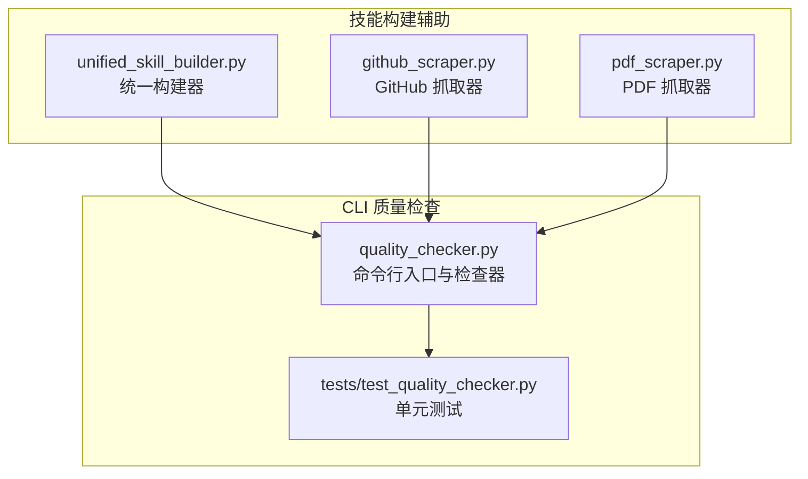
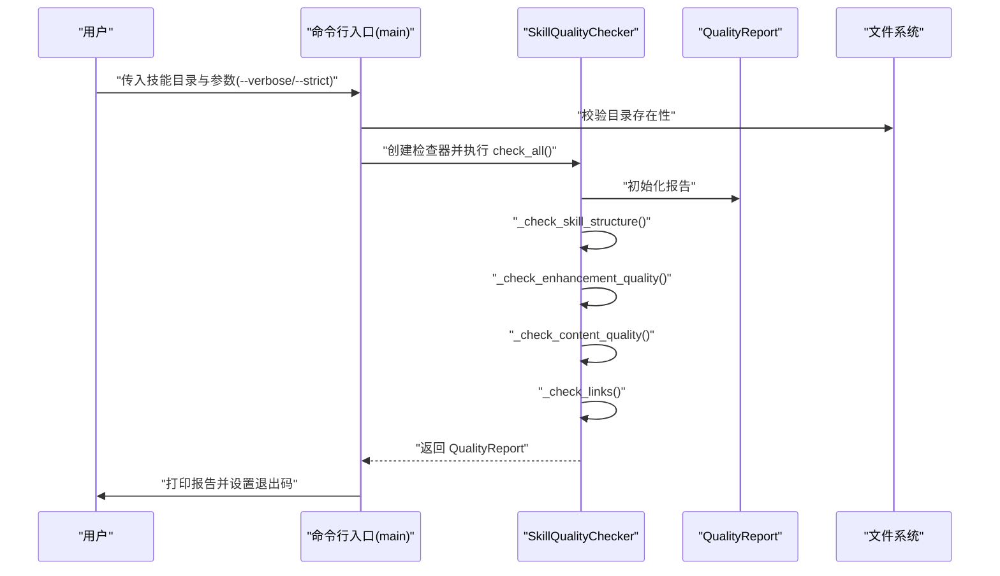
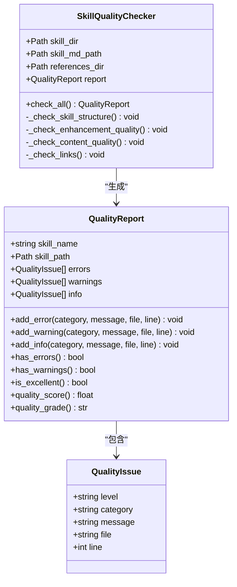
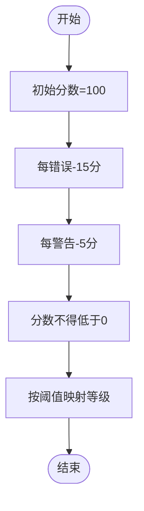
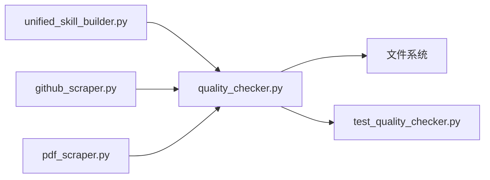

# 质量保证体系

<cite>
**本文引用的文件**
- [quality_checker.py](file://src/skill_seekers/cli/quality_checker.py)
- [test_quality_checker.py](file://tests/test_quality_checker.py)
- [unified_skill_builder.py](file://src/skill_seekers/cli/unified_skill_builder.py)
- [github_scraper.py](file://src/skill_seekers/cli/github_scraper.py)
- [pdf_scraper.py](file://src/skill_seekers/cli/pdf_scraper.py)
</cite>

## 目录
1. [引言](#引言)
2. [项目结构](#项目结构)
3. [核心组件](#核心组件)
4. [架构总览](#架构总览)
5. [详细组件分析](#详细组件分析)
6. [依赖关系分析](#依赖关系分析)
7. [性能考量](#性能考量)
8. [故障排查指南](#故障排查指南)
9. [结论](#结论)
10. [附录](#附录)

## 引言
本文件系统性解析质量检查体系，围绕 quality_checker.py 的实现，说明 QualityReport 与 QualityIssue 数据类如何结构化地表达验证结果；详解四大检查维度：结构完整性、增强质量、内容规范性、链接有效性；阐述质量评分与等级划分算法；给出命令行接口用法、严格模式在 CI/CD 中的集成方式，以及报告输出示例与解读方法。

## 项目结构
质量检查功能位于 CLI 子模块中，作为独立工具运行于技能包目录之上，对 SKILL.md 与 references 目录进行扫描与校验，并输出结构化的质量报告。

图表来源
- [quality_checker.py](file://src/skill_seekers/cli/quality_checker.py#L1-L480)
- [test_quality_checker.py](file://tests/test_quality_checker.py#L1-L297)
- [unified_skill_builder.py](file://src/skill_seekers/cli/unified_skill_builder.py#L46-L91)
- [github_scraper.py](file://src/skill_seekers/cli/github_scraper.py#L650-L692)
- [pdf_scraper.py](file://src/skill_seekers/cli/pdf_scraper.py#L260-L289)

章节来源
- [quality_checker.py](file://src/skill_seekers/cli/quality_checker.py#L1-L480)

## 核心组件
- QualityIssue：封装单条问题记录，包含级别（错误/警告/提示）、类别（增强/内容/链接/结构）、消息文本及可选文件位置信息。
- QualityReport：承载一次检查的完整结果，维护三类问题列表，并提供质量分数与等级计算、是否优秀的判定等属性。
- SkillQualityChecker：执行四大维度检查的核心类，按顺序调用各检查子过程，最终汇总为 QualityReport。

章节来源
- [quality_checker.py](file://src/skill_seekers/cli/quality_checker.py#L19-L92)
- [quality_checker.py](file://src/skill_seekers/cli/quality_checker.py#L94-L130)

## 架构总览
质量检查流程从命令行入口开始，解析参数后实例化检查器，依次执行结构、增强、内容、链接四项检查，最后打印报告并根据严格模式决定退出码。

图表来源
- [quality_checker.py](file://src/skill_seekers/cli/quality_checker.py#L418-L477)

## 详细组件分析

### 数据模型设计：QualityIssue 与 QualityReport
- QualityIssue 字段
  - 级别：error/warning/info
  - 类别：enhancement/content/links/structure
  - 消息：具体问题描述
  - 文件与行号：定位问题所在
- QualityReport 字段
  - skill_name、skill_path：标识被检查的技能
  - errors/warnings/info：三类问题集合
- QualityReport 方法与属性
  - add_error/add_warning/add_info：追加问题
  - has_errors/has_warnings/is_excellent：布尔判定
  - quality_score：从满分扣分，错误-15分/警告-5分，不低于0
  - quality_grade：A-F分级阈值

图表来源
- [quality_checker.py](file://src/skill_seekers/cli/quality_checker.py#L19-L92)
- [quality_checker.py](file://src/skill_seekers/cli/quality_checker.py#L94-L130)

章节来源
- [quality_checker.py](file://src/skill_seekers/cli/quality_checker.py#L19-L92)
- [quality_checker.py](file://src/skill_seekers/cli/quality_checker.py#L94-L130)

### 四大检查维度

#### 结构完整性
- 必备文件与目录
  - SKILL.md 必须存在；缺失则记为错误
  - references 目录建议存在；不存在或为空时记为警告
- 参考文件存在性与引用一致性
  - 若 references 下存在 .md 文件，但 SKILL.md 中未提及任何参考文件名，则记为警告

章节来源
- [quality_checker.py](file://src/skill_seekers/cli/quality_checker.py#L131-L155)
- [quality_checker.py](file://src/skill_seekers/cli/quality_checker.py#L299-L321)

#### 增强质量
- 模板占位符检测
  - 发现 TODO、[Add description]、[Framework specific tips]、coming soon 等字样，视为未充分增强，记为警告
- 代码示例数量
  - 统计代码块数量；0个为警告；少于3个为信息提示；≥3个为信息提示
- 章节丰富度
  - 统计二级标题数量；少于4个为警告；≥4个为信息提示

章节来源
- [quality_checker.py](file://src/skill_seekers/cli/quality_checker.py#L156-L221)

#### 内容规范性
- YAML 前置元数据
  - 必须以 "---" 开头；否则记为错误
  - 解析失败或格式不合法记为错误；若包含 description 字段，记为信息提示
  - 必填字段 name 缺失记为错误
- 代码块语言标签
  - 发现无语言标签的代码块，记为警告
- 关键章节存在性
  - 缺少“When to Use”章节记为警告；存在则记为信息提示
- 参考文件引用
  - references 下存在文件但 SKILL.md 未提及任一文件名，记为警告

章节来源
- [quality_checker.py](file://src/skill_seekers/cli/quality_checker.py#L223-L321)

#### 链接有效性（内部 Markdown 链接）
- 匹配所有 Markdown 链接 [text](path)
- 跳过 http/https 外链与锚点链接
- 对相对路径链接，以 SKILL.md 所在目录为基准计算绝对路径并判断是否存在
- 发现不存在的内部链接，记为警告；全部有效时，仅在有内部链接的情况下记为信息提示

章节来源
- [quality_checker.py](file://src/skill_seekers/cli/quality_checker.py#L322-L365)

### 质量评分与等级划分
- 计算规则
  - 初始分为100分
  - 每个错误扣15分，每个警告扣5分
  - 最低不低于0分
- 等级划分
  - A：≥90
  - B：≥80
  - C：≥70
  - D：≥60
  - F：<60

图表来源
- [quality_checker.py](file://src/skill_seekers/cli/quality_checker.py#L66-L92)

章节来源
- [quality_checker.py](file://src/skill_seekers/cli/quality_checker.py#L66-L92)
- [test_quality_checker.py](file://tests/test_quality_checker.py#L194-L241)

### 命令行接口与严格模式
- 参数
  - 必选：技能目录路径
  - 可选：
    - --verbose/-v：显示所有信息类提示
    - --strict：只要存在错误或警告即以非零退出码
- 退出码策略
  - 使用 --strict 且报告含错误或警告：退出1
  - 否则仅当存在错误时退出1，否则退出0

章节来源
- [quality_checker.py](file://src/skill_seekers/cli/quality_checker.py#L418-L477)

### 报告输出与解读
- 输出内容
  - 报告标题、技能名称
  - 质量分数与等级
  - 错误列表（类别+消息+位置）
  - 警告列表（类别+消息+位置）
  - 信息列表（仅在 --verbose 时显示）
  - 总结语：优秀/良好/需要改进
- 示例解读
  - 分数高、无错误、少量警告：整体质量良好，建议关注警告项
  - 有错误：必须修复后再打包
  - 无错误但多警告：可继续，但建议完善

章节来源
- [quality_checker.py](file://src/skill_seekers/cli/quality_checker.py#L367-L417)

### 在 CI/CD 中集成严格模式
- 推荐做法
  - 在流水线步骤中调用质量检查器，传入待检查的技能目录
  - 使用 --strict 选项，使任何错误或警告导致流水线失败
  - 将报告输出到日志以便追溯
- 典型场景
  - 构建完成后自动执行质量检查
  - PR/MR 合并前强制拦截低质量内容

章节来源
- [quality_checker.py](file://src/skill_seekers/cli/quality_checker.py#L433-L435)
- [test_quality_checker.py](file://tests/test_quality_checker.py#L261-L297)

## 依赖关系分析
- 质量检查器依赖文件系统读取 SKILL.md 与 references 目录
- 测试覆盖了典型正反用例，包括缺失文件、无效元数据、无语言标签代码块、断链等
- 抓取器与构建器会生成符合规范的 SKILL.md（含 YAML 前置元数据），有助于减少后续检查中的错误

图表来源
- [quality_checker.py](file://src/skill_seekers/cli/quality_checker.py#L1-L480)
- [test_quality_checker.py](file://tests/test_quality_checker.py#L1-L297)
- [unified_skill_builder.py](file://src/skill_seekers/cli/unified_skill_builder.py#L46-L91)
- [github_scraper.py](file://src/skill_seekers/cli/github_scraper.py#L650-L692)
- [pdf_scraper.py](file://src/skill_seekers/cli/pdf_scraper.py#L260-L289)

章节来源
- [quality_checker.py](file://src/skill_seekers/cli/quality_checker.py#L1-L480)
- [test_quality_checker.py](file://tests/test_quality_checker.py#L1-L297)

## 性能考量
- 正则匹配与文件扫描均为 O(n) 级别，n 为 SKILL.md 文本长度与 references 下文件数量
- 代码块统计、章节统计、链接解析均采用线性扫描，复杂度可控
- 建议在大型仓库中批量运行时，优先检查关键技能目录，避免重复扫描相同内容

## 故障排查指南
- 目录不存在
  - 现象：直接退出并提示目录不存在
  - 处理：确认传入路径正确
- 缺少 SKILL.md
  - 现象：错误：缺少 SKILL.md
  - 处理：生成或恢复 SKILL.md
- YAML 前置元数据缺失或格式错误
  - 现象：错误：缺少前置元数据或格式非法；缺失 name 字段
  - 处理：确保以 "---" 开头，包含 name 字段，必要时包含 description
- 代码块无语言标签
  - 现象：警告：发现若干无语言标签代码块
  - 处理：为代码块添加语言标签
- 缺少“When to Use”章节
  - 现象：警告：缺少关键章节
  - 处理：补充该章节
- references 目录缺失或为空
  - 现象：警告：目录不存在或为空
  - 处理：创建 references 目录并填充参考文档
- references 文件存在但未被引用
  - 现象：警告：存在参考文件但未在 SKILL.md 中提及
  - 处理：在 SKILL.md 中添加对参考文件的引用
- 断链
  - 现象：警告：发现断链
  - 处理：修正链接路径或补全目标文件

章节来源
- [quality_checker.py](file://src/skill_seekers/cli/quality_checker.py#L131-L155)
- [quality_checker.py](file://src/skill_seekers/cli/quality_checker.py#L223-L321)
- [quality_checker.py](file://src/skill_seekers/cli/quality_checker.py#L322-L365)
- [test_quality_checker.py](file://tests/test_quality_checker.py#L35-L120)
- [test_quality_checker.py](file://tests/test_quality_checker.py#L174-L193)

## 结论
质量检查体系通过结构化数据模型与清晰的检查维度，实现了对技能文档的全面质量评估。评分与等级机制直观反映质量水平，严格模式可无缝接入 CI/CD 实现自动化拦截。结合抓取与构建器生成的规范文档，可显著降低后续检查中的错误率，提升整体交付质量。

## 附录

### 报告输出示例与解读
- 示例结构
  - 标题与技能名称
  - 质量分数与等级
  - 错误列表（类别+消息+位置）
  - 警告列表（类别+消息+位置）
  - 信息列表（仅 --verbose 显示）
  - 总结语
- 解读要点
  - 分数越高越好；A 级为优秀，F 级需重点整改
  - 错误必须修复；警告建议优先处理
  - 信息类提示用于引导进一步优化

章节来源
- [quality_checker.py](file://src/skill_seekers/cli/quality_checker.py#L367-L417)