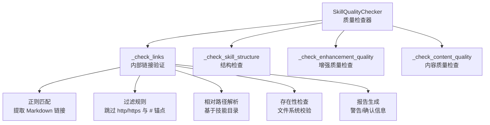
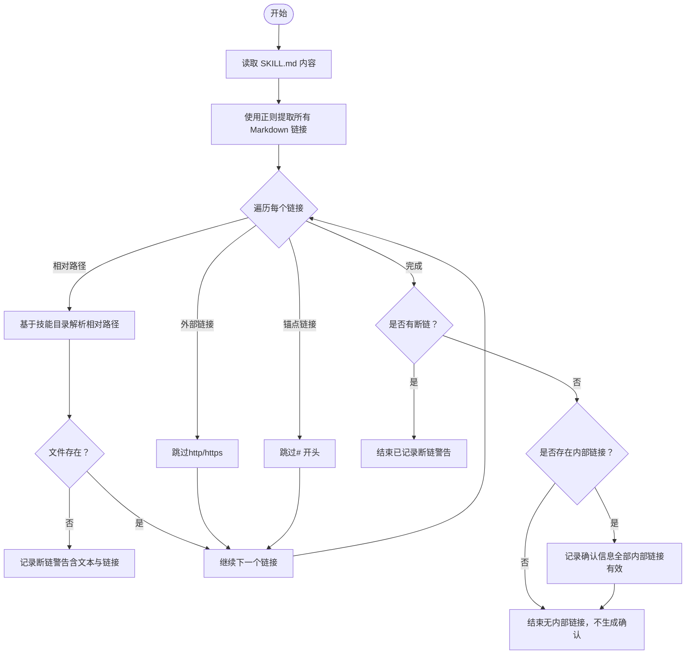
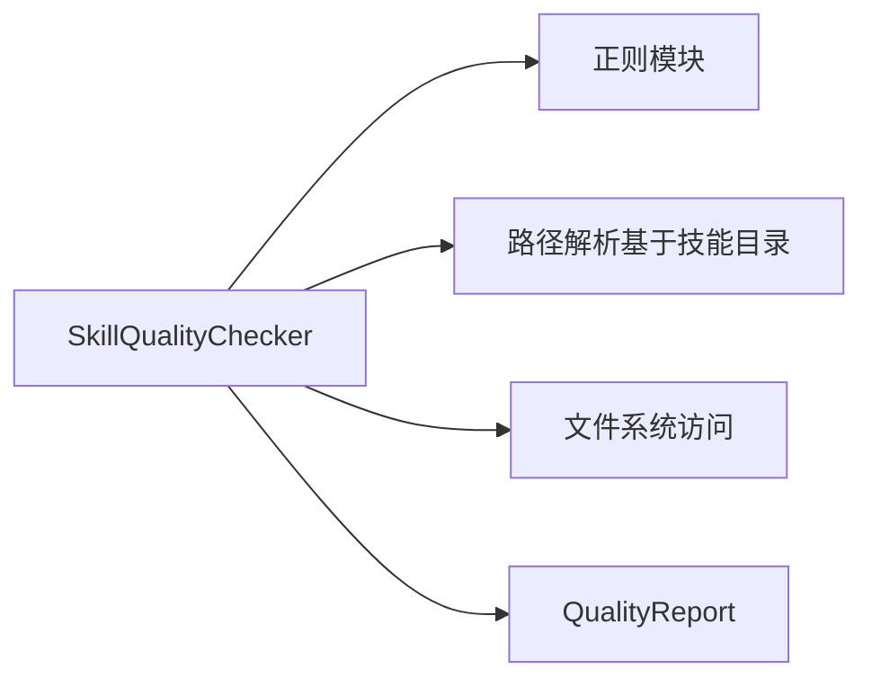

# 链接有效性验证

<cite>
**本文引用的文件**
- [quality_checker.py](file://src/skill_seekers/cli/quality_checker.py)
- [test_quality_checker.py](file://tests/test_quality_checker.py)
</cite>

## 目录
1. [简介](#简介)
2. [项目结构](#项目结构)
3. [核心组件](#核心组件)
4. [架构总览](#架构总览)
5. [详细组件分析](#详细组件分析)
6. [依赖关系分析](#依赖关系分析)
7. [性能考量](#性能考量)
8. [故障排查指南](#故障排查指南)
9. [结论](#结论)

## 简介
本节聚焦于质量检查器中“内部链接验证”流程，即 _check_links 方法的工作机制。该方法通过正则表达式提取 Markdown 中的所有链接，区分并跳过外部链接与锚点链接，对剩余的相对路径链接按技能目录进行解析，检查目标文件是否存在；当发现无效链接时生成警告信息；当全部内部链接有效时生成积极确认信息，从而保障技能文档内部导航的可靠性。

## 项目结构
- 质量检查器位于 CLI 子模块中，负责对技能目录（包含 SKILL.md 与 references 子目录）执行多类质量检查，其中“内部链接验证”是关键环节之一。
- 测试文件覆盖了链接验证场景，包括断链检测与报告生成。



图表来源
- [quality_checker.py](file://src/skill_seekers/cli/quality_checker.py#L322-L366)

章节来源
- [quality_checker.py](file://src/skill_seekers/cli/quality_checker.py#L111-L129)

## 核心组件
- SkillQualityChecker：封装质量检查的主类，提供 check_all 统一入口，内部调用 _check_links 执行链接验证。
- QualityReport：承载质量报告，支持添加错误、警告、信息类问题，并计算分数与等级。
- _check_links：实现内部链接验证的核心逻辑，包含正则提取、过滤、解析与存在性检查、报告生成等步骤。

章节来源
- [quality_checker.py](file://src/skill_seekers/cli/quality_checker.py#L94-L129)
- [quality_checker.py](file://src/skill_seekers/cli/quality_checker.py#L322-L366)

## 架构总览
下图展示从入口到链接验证再到报告输出的整体流程。

```mermaid
sequenceDiagram
participant CLI as "命令行入口"
participant Checker as "SkillQualityChecker"
participant Links as "_check_links"
participant FS as "文件系统"
participant Report as "QualityReport"
CLI->>Checker : 调用 check_all()
Checker->>Links : 执行内部链接验证
Links->>Links : 使用正则提取所有 Markdown 链接
Links->>Links : 过滤 http/https 外部链接与 # 锚点
Links->>FS : 将剩余相对路径链接解析为绝对路径并检查存在性
FS-->>Links : 返回存在性结果
Links->>Report : 若存在断链则添加警告；否则在有内部链接时添加确认信息
Links-->>Checker : 返回报告
Checker-->>CLI : 输出质量报告
```

图表来源
- [quality_checker.py](file://src/skill_seekers/cli/quality_checker.py#L111-L129)
- [quality_checker.py](file://src/skill_seekers/cli/quality_checker.py#L322-L366)

## 详细组件分析

### _check_links 内部链接验证流程
- 输入：技能目录路径（构造函数传入），方法会读取 SKILL.md 内容。
- 步骤：
  1) 使用正则表达式提取所有 Markdown 链接，捕获链接文本与链接地址两部分。
  2) 对每个链接应用过滤规则：
     - 跳过以 http:// 或 https:// 开头的外部链接；
     - 跳过以 # 开头的锚点链接。
  3) 对剩余的相对路径链接，将其视为相对于技能目录的路径，拼接到技能目录后检查文件是否存在。
  4) 若发现断链（不存在的目标文件），将生成一条警告信息，包含链接文本与原始链接地址。
  5) 若没有断链且存在内部链接，则生成一条确认信息，提示所有内部链接均有效。



图表来源
- [quality_checker.py](file://src/skill_seekers/cli/quality_checker.py#L322-L366)

章节来源
- [quality_checker.py](file://src/skill_seekers/cli/quality_checker.py#L322-L366)

### 正则表达式与链接提取
- 使用正则表达式捕获 Markdown 链接的文本与地址两部分，以便后续分别处理与报告。
- 提取范围覆盖整个 SKILL.md 文本，保证不会遗漏任何链接。

章节来源
- [quality_checker.py](file://src/skill_seekers/cli/quality_checker.py#L329-L332)

### 过滤策略
- 外部链接：以 http:// 或 https:// 开头的链接直接跳过，不进行本地存在性检查。
- 锚点链接：以 # 开头的链接也直接跳过，因为这类链接仅在当前页面内定位，无需跨文件校验。
- 其余链接：均为相对路径，按“相对于技能目录”的规则进行解析与校验。

章节来源
- [quality_checker.py](file://src/skill_seekers/cli/quality_checker.py#L336-L343)

### 相对路径解析与存在性检查
- 对于剩余的相对路径链接，将其视为相对于技能目录的路径，拼接后检查文件是否存在。
- 若目标文件不存在，则判定为断链，生成警告信息。

章节来源
- [quality_checker.py](file://src/skill_seekers/cli/quality_checker.py#L344-L348)

### 报告生成与确认信息
- 当存在断链时，逐条添加警告，包含链接文本与原始链接地址，便于快速定位问题。
- 当不存在断链且确实存在内部链接时，添加一条确认信息，统计内部链接数量，提升整体质量评分的积极信号。

章节来源
- [quality_checker.py](file://src/skill_seekers/cli/quality_checker.py#L349-L366)

### 行为验证与测试覆盖
- 单元测试覆盖了断链检测场景，验证当 SKILL.md 中存在不存在的相对路径链接时，质量检查器会生成相应的警告信息。
- 测试通过断言报告包含“broken link”相关消息，确保 _check_links 的行为符合预期。

章节来源
- [test_quality_checker.py](file://tests/test_quality_checker.py#L174-L193)

## 依赖关系分析
- 模块内依赖：
  - _check_links 依赖正则模块进行链接提取；
  - 依赖文件系统路径操作（基于技能目录）进行解析与存在性检查；
  - 依赖 QualityReport 进行问题记录与最终报告输出。
- 与其他检查项的关系：
  - _check_links 在 check_all 中被调用，与结构检查、内容质量检查、增强质量检查共同构成完整的质量评估体系。



图表来源
- [quality_checker.py](file://src/skill_seekers/cli/quality_checker.py#L322-L366)
- [quality_checker.py](file://src/skill_seekers/cli/quality_checker.py#L111-L129)

章节来源
- [quality_checker.py](file://src/skill_seekers/cli/quality_checker.py#L111-L129)
- [quality_checker.py](file://src/skill_seekers/cli/quality_checker.py#L322-L366)

## 性能考量
- 正则提取阶段的时间复杂度近似与文档长度线性相关。
- 过滤阶段对每个链接执行常数时间的字符串前缀判断。
- 文件存在性检查为 O(N)（N 为内部链接数量），通常远小于文档规模，开销可忽略。
- 整体流程在大多数技能文档上运行迅速，适合在 CI/CD 中作为常规质量门禁。

## 故障排查指南
- 断链定位：
  - 查看质量报告中的“链接”类别警告，其中包含断链的链接文本与原始链接地址，便于快速定位问题文件。
- 常见原因：
  - 相对路径书写错误；
  - 目标文件被删除或重命名；
  - 文件未纳入技能目录结构。
- 修复建议：
  - 校正相对路径，确保与技能目录下的实际文件一致；
  - 如需跨目录引用，请使用正确的相对路径或调整目录结构；
  - 确保 references 子目录中的参考文件与 SKILL.md 中的链接一一对应。

章节来源
- [quality_checker.py](file://src/skill_seekers/cli/quality_checker.py#L349-L366)
- [test_quality_checker.py](file://tests/test_quality_checker.py#L174-L193)

## 结论
_check_links 方法通过简洁而稳健的流程实现了对技能文档内部链接的全面验证：以正则提取为基础，结合外部链接与锚点链接的过滤策略，对相对路径进行基于技能目录的解析与存在性检查，并在断链时生成明确的警告，在全部内部链接有效时给出积极确认。配合单元测试，该流程能够有效保障技能文档内部导航的可靠性与一致性。