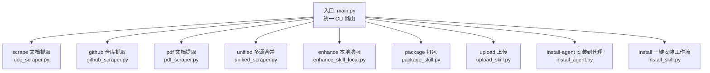
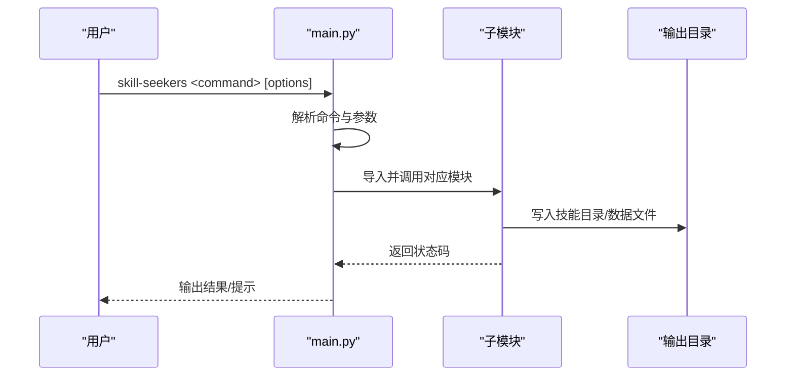
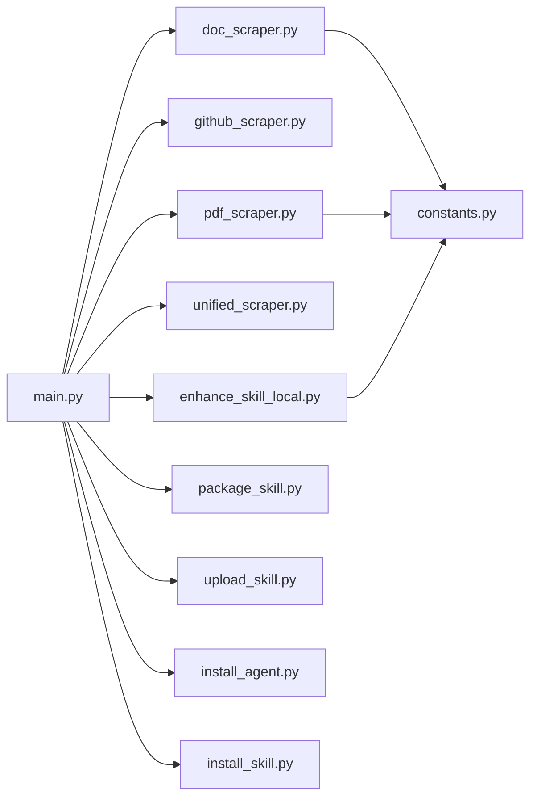

# CLI命令参考

<cite>
**本文引用的文件**
- [main.py](file://src/skill_seekers/cli/main.py)
- [doc_scraper.py](file://src/skill_seekers/cli/doc_scraper.py)
- [github_scraper.py](file://src/skill_seekers/cli/github_scraper.py)
- [pdf_scraper.py](file://src/skill_seekers/cli/pdf_scraper.py)
- [unified_scraper.py](file://src/skill_seekers/cli/unified_scraper.py)
- [enhance_skill_local.py](file://src/skill_seekers/cli/enhance_skill_local.py)
- [package_skill.py](file://src/skill_seekers/cli/package_skill.py)
- [upload_skill.py](file://src/skill_seekers/cli/upload_skill.py)
- [install_skill.py](file://src/skill_seekers/cli/install_skill.py)
- [install_agent.py](file://src/skill_seekers/cli/install_agent.py)
- [constants.py](file://src/skill_seekers/cli/constants.py)
- [react_unified.json](file://configs/react_unified.json)
</cite>

## 目录
1. [简介](#简介)
2. [项目结构](#项目结构)
3. [核心组件](#核心组件)
4. [架构总览](#架构总览)
5. [详细组件分析](#详细组件分析)
6. [依赖关系分析](#依赖关系分析)
7. [性能与并发特性](#性能与并发特性)
8. [故障排查指南](#故障排查指南)
9. [结论](#结论)
10. [附录：命令速查表](#附录命令速查表)

## 简介
本文件为 Skill Seekers 的统一 CLI 命令参考，覆盖 scrape、github、pdf、unified、enhance、package、upload、estimate、install-agent、install 等核心命令。内容基于 main.py 中 Click 风格的子命令定义与各工具模块实现，提供：
- 功能概述与典型用法
- 语法结构与参数说明（含默认行为）
- 返回值与常见退出码
- 核心模块职责与协作关系
- 错误码与典型使用场景

## 项目结构
CLI 入口位于 src/skill_seekers/cli/main.py，负责解析命令与参数，并将控制权委托给对应子模块。各子命令对应的实现文件分别位于同一目录下，形成“按功能分层”的组织方式。

图表来源
- [main.py](file://src/skill_seekers/cli/main.py#L222-L370)
- [doc_scraper.py](file://src/skill_seekers/cli/doc_scraper.py#L1-L120)
- [github_scraper.py](file://src/skill_seekers/cli/github_scraper.py#L1-L120)
- [pdf_scraper.py](file://src/skill_seekers/cli/pdf_scraper.py#L1-L120)
- [unified_scraper.py](file://src/skill_seekers/cli/unified_scraper.py#L1-L120)
- [enhance_skill_local.py](file://src/skill_seekers/cli/enhance_skill_local.py#L1-L120)
- [package_skill.py](file://src/skill_seekers/cli/package_skill.py#L1-L120)
- [upload_skill.py](file://src/skill_seekers/cli/upload_skill.py#L1-L120)
- [install_agent.py](file://src/skill_seekers/cli/install_agent.py#L1-L120)
- [install_skill.py](file://src/skill_seekers/cli/install_skill.py#L1-L120)

章节来源
- [main.py](file://src/skill_seekers/cli/main.py#L222-L370)

## 核心组件
- 统一入口与路由：main.py 解析子命令，按需导入并执行对应模块。
- 抓取与转换：
  - 文档网站抓取：doc_scraper.py
  - GitHub 仓库抓取：github_scraper.py
  - PDF 文档提取：pdf_scraper.py
  - 多源统一抓取与合并：unified_scraper.py
- 增强与打包：
  - 本地增强（无需 API Key）：enhance_skill_local.py
  - 打包为 .zip 并可自动上传：package_skill.py、upload_skill.py
- 安装与部署：
  - 安装到 AI 编程代理：install_agent.py
  - 一键安装工作流（fetch→scrape→enhance→package→upload）：install_skill.py

章节来源
- [main.py](file://src/skill_seekers/cli/main.py#L222-L370)
- [doc_scraper.py](file://src/skill_seekers/cli/doc_scraper.py#L1-L120)
- [github_scraper.py](file://src/skill_seekers/cli/github_scraper.py#L1-L120)
- [pdf_scraper.py](file://src/skill_seekers/cli/pdf_scraper.py#L1-L120)
- [unified_scraper.py](file://src/skill_seekers/cli/unified_scraper.py#L1-L120)
- [enhance_skill_local.py](file://src/skill_seekers/cli/enhance_skill_local.py#L1-L120)
- [package_skill.py](file://src/skill_seekers/cli/package_skill.py#L1-L120)
- [upload_skill.py](file://src/skill_seekers/cli/upload_skill.py#L1-L120)
- [install_agent.py](file://src/skill_seekers/cli/install_agent.py#L1-L120)
- [install_skill.py](file://src/skill_seekers/cli/install_skill.py#L1-L120)

## 架构总览
统一 CLI 将用户输入映射到具体工具模块，形成“命令→参数→模块→数据输出”的流水线。unified 命令通过子进程或直接调用各抓取器，再进行冲突检测与合并，最终生成统一技能目录。

图表来源
- [main.py](file://src/skill_seekers/cli/main.py#L222-L370)

## 详细组件分析

### 命令：scrape（文档网站抓取）
- 功能：从指定文档网站抓取页面，支持 llms.txt 优先策略、异步/多线程抓取、断点续跑、预览模式等。
- 语法要点
  - 子命令：scrape
  - 关键参数
    - --config：配置 JSON 文件路径
    - --name：技能名称
    - --url：文档起始 URL
    - --description：技能描述
    - --skip-scrape：跳过实际抓取，使用缓存数据
    - --enhance / --enhance-local：抓取后进行云端或本地增强
    - --dry-run：预览模式，不实际抓取
    - --async / --workers：启用异步抓取与并发工作线程数
- 默认行为
  - 使用配置中的 base_url、selectors、url_patterns、max_pages、rate_limit 等参数
  - 默认启用 llms.txt 自动检测；若存在则优先使用 llms.txt 内容构建技能
  - 异步模式默认关闭，可通过 --async 开启
- 返回值
  - 成功：0；失败：非零（异常或中断）
- 典型场景
  - 快速预览：--dry-run
  - 大规模抓取：--async + --workers
  - 仅使用 llms.txt：--skip-scrape
- 核心模块与职责
  - doc_scraper.py：实现 DocToSkillConverter，负责页面发现、内容抽取、语言识别、代码块与模式提取、llms.txt 检测与解析、断点检查点、异步/多线程抓取等。
- 错误与退出码
  - 用户中断：130
  - 其他异常：1

章节来源
- [main.py](file://src/skill_seekers/cli/main.py#L240-L264)
- [doc_scraper.py](file://src/skill_seekers/cli/doc_scraper.py#L1-L200)
- [constants.py](file://src/skill_seekers/cli/constants.py#L1-L73)

### 命令：github（GitHub 仓库抓取）
- 功能：抓取 GitHub 仓库信息（README、变更历史、发行版、Issues、代码结构），生成技能目录。
- 语法要点
  - 子命令：github
  - 关键参数
    - --config：配置 JSON 文件路径
    - --repo：仓库标识 owner/repo
    - --name / --description：技能名称与描述
- 默认行为
  - 未提供令牌时使用匿名访问（速率受限）
  - 可选择是否包含 Issues、Changelog、Releases、代码签名与测试示例
- 返回值
  - 成功：0；失败：非零（认证失败、API 错误、找不到仓库等）
- 典型场景
  - 本地仓库深度分析：配合本地路径与排除目录配置
  - 仅表面分析：减少 API 调用
- 核心模块与职责
  - github_scraper.py：GitHubScraper 负责拉取仓库元数据、README、语言分布、文件树、Issues、Changelog、Releases；GitHubToSkillConverter 负责生成 SKILL.md 与 references 文件。
- 错误与退出码
  - 404：仓库不存在
  - 速率限制：需要令牌
  - 其他异常：1

章节来源
- [main.py](file://src/skill_seekers/cli/main.py#L266-L277)
- [github_scraper.py](file://src/skill_seekers/cli/github_scraper.py#L1-L220)

### 命令：pdf（PDF 文档提取）
- 功能：从 PDF 提取文本、代码块、图片与章节，分类生成技能目录。
- 语法要点
  - 子命令：pdf
  - 关键参数
    - --config：PDF 配置 JSON 文件路径
    - --pdf：PDF 文件路径
    - --name / --description：技能名称与描述
    - --from-json：从已提取的 JSON 构建技能
- 默认行为
  - 支持分段大小、最小质量阈值、图片提取与最小尺寸设置
  - 若配置中提供章节或关键词分类规则，则按章节或关键词归类
- 返回值
  - 成功：0；失败：非零（提取失败、JSON 加载失败等）
- 典型场景
  - 已有提取结果：--from-json 直接构建技能
  - 大型 PDF：调整分段大小与质量阈值
- 核心模块与职责
  - pdf_scraper.py：PDFToSkillConverter 负责提取、分类、生成 references 与 SKILL.md。
- 错误与退出码
  - 提取失败：1

章节来源
- [main.py](file://src/skill_seekers/cli/main.py#L279-L292)
- [pdf_scraper.py](file://src/skill_seekers/cli/pdf_scraper.py#L1-L200)

### 命令：unified（多源统一抓取与合并）
- 功能：同时抓取文档、GitHub、PDF，检测冲突并合并，生成统一技能。
- 语法要点
  - 子命令：unified
  - 关键参数
    - --config：统一配置 JSON 文件（必须）
    - --merge-mode：合并模式（rule-based 或 claude-enhanced）
    - --dry-run：预览模式
- 默认行为
  - 读取配置 sources 列表，逐个调用对应抓取器
  - 若存在 API 类冲突，进行冲突检测与合并
  - 合并模式默认来自配置，也可通过 --merge-mode 覆盖
- 返回值
  - 成功：0；失败：非零（抓取失败、合并失败、构建失败等）
- 典型场景
  - 官方文档 + 代码库 + 官方 PDF：统一知识库
  - 大规模多源：先 estimate 再 scrape
- 核心模块与职责
  - unified_scraper.py：UnifiedScraper 负责加载配置、调用各抓取器、冲突检测、合并与最终技能构建。
- 错误与退出码
  - 用户中断：130
  - 其他异常：1

章节来源
- [main.py](file://src/skill_seekers/cli/main.py#L294-L301)
- [unified_scraper.py](file://src/skill_seekers/cli/unified_scraper.py#L1-L120)
- [react_unified.json](file://configs/react_unified.json#L1-L45)

### 命令：enhance（本地增强 SKILL.md）
- 功能：使用 Claude Code（无需 API Key）增强 SKILL.md，支持无头与交互两种模式。
- 语法要点
  - 子命令：enhance
  - 关键参数
    - skill_directory：技能目录路径
    - --interactive-enhancement：交互模式（打开终端窗口）
    - --timeout：超时时间（秒，默认 600）
- 默认行为
  - 读取 references 下的文档，生成增强提示，保存到临时文件
  - 无头模式直接调用 claude 命令等待完成；交互模式在新终端运行
- 返回值
  - 成功：0；失败：非零（claude 命令不可用、超时、未更新等）
- 典型场景
  - 快速增强：无头模式
  - 交互增强：查看 Claude 的对话过程
- 核心模块与职责
  - enhance_skill_local.py：LocalSkillEnhancer 负责检测终端、创建提示、运行增强、备份原 SKILL.md。
- 错误与退出码
  - 未找到 claude 命令：1
  - 超时：1
  - 其他异常：1

章节来源
- [main.py](file://src/skill_seekers/cli/main.py#L303-L306)
- [enhance_skill_local.py](file://src/skill_seekers/cli/enhance_skill_local.py#L1-L120)

### 命令：package（打包为 .zip）
- 功能：将技能目录打包为 .zip，可选自动上传至 Claude。
- 语法要点
  - 子命令：package
  - 关键参数
    - skill_directory：技能目录路径
    - --no-open：不打开输出文件夹
    - --skip-quality-check：跳过质量检查
    - --upload：打包后自动上传（需要 ANTHROPIC_API_KEY）
- 默认行为
  - 质量检查通过后才继续；可选择跳过
  - 自动上传前会检查环境变量 ANTHROPIC_API_KEY
- 返回值
  - 成功：0；失败：非零（目录无效、质量检查失败、上传失败等）
- 典型场景
  - 本地验证后打包：--skip-quality-check
  - 自动上传：--upload
- 核心模块与职责
  - package_skill.py：package_skill 负责校验、质量检查、打包、打开文件夹、打印上传指引；可选调用 upload_skill.py 进行自动上传。
- 错误与退出码
  - 目录无效：1
  - 上传失败但打包成功：0（提示手动上传）

章节来源
- [main.py](file://src/skill_seekers/cli/main.py#L308-L315)
- [package_skill.py](file://src/skill_seekers/cli/package_skill.py#L1-L120)
- [upload_skill.py](file://src/skill_seekers/cli/upload_skill.py#L1-L120)

### 命令：upload（上传 .zip 至 Claude）
- 功能：通过 Anthropic API 上传 .zip 文件。
- 语法要点
  - 子命令：upload
  - 关键参数
    - zip_file：.zip 文件路径
    - --api-key：Anthropic API Key（可从环境变量读取）
- 默认行为
  - 从环境变量 ANTHROPIC_API_KEY 读取密钥
- 返回值
  - 成功：0；失败：非零（认证失败、格式错误、网络错误等）
- 典型场景
  - 已经打包好的 .zip：直接上传
- 核心模块与职责
  - upload_skill.py：upload_skill_api 负责校验 zip、获取 API Key、发起上传请求并处理响应。
- 错误与退出码
  - 401：认证失败
  - 400：格式错误
  - 超时/连接错误：1
  - 其他异常：1

章节来源
- [main.py](file://src/skill_seekers/cli/main.py#L317-L322)
- [upload_skill.py](file://src/skill_seekers/cli/upload_skill.py#L1-L120)

### 命令：estimate（估算页数）
- 功能：在正式抓取前估算文档页数，辅助规划资源。
- 语法要点
  - 子命令：estimate
  - 关键参数
    - config：配置 JSON 文件路径
    - --max-discovery：最大发现页数
- 默认行为
  - 基于配置中的 base_url、url_patterns、max_pages 等参数进行预估
- 返回值
  - 成功：0；失败：非零（配置无效、网络错误等）
- 典型场景
  - 大型站点抓取前评估
- 核心模块与职责
  - 该命令在 main.py 中委托给 estimate_pages 模块（当前文件未包含其实现，此处为概念说明）。

章节来源
- [main.py](file://src/skill_seekers/cli/main.py#L324-L329)

### 命令：install-agent（安装到 AI 编程代理）
- 功能：将技能复制到不同 AI 编程代理的安装目录（Claude Code、Cursor、VS Code、Amp、Goose、OpenCode、Letta、Aide、Windsurf 等）。
- 语法要点
  - 子命令：install-agent
  - 关键参数
    - skill_directory：技能目录路径
    - --agent：代理名称（支持 all）
    - --force：强制覆盖
    - --dry-run：预览安装而不实际更改
- 默认行为
  - 支持全局路径（~/.agent/skills/）与项目相对路径（./.agent/skills/）
  - 对未知代理名提供模糊匹配建议
- 返回值
  - 成功：0；失败：非零（权限不足、目标已存在且未强制、验证失败等）
- 典型场景
  - 一次性安装到所有代理：--agent all
  - 权限问题修复后重试：--force
- 核心模块与职责
  - install_agent.py：install_to_agent/install_to_all_agents 负责路径解析、权限检查、复制与重启提示。
- 错误与退出码
  - 权限不足：1
  - 目标已存在且未强制：1
  - 其他异常：1

章节来源
- [main.py](file://src/skill_seekers/cli/main.py#L331-L338)
- [install_agent.py](file://src/skill_seekers/cli/install_agent.py#L1-L120)

### 命令：install（一键安装工作流）
- 功能：完整工作流（fetch→scrape→enhance→package→upload），增强为必选项。
- 语法要点
  - 子命令：install
  - 关键参数
    - --config：配置名称或配置文件路径
    - --destination：输出目录（默认 output/）
    - --no-upload：跳过自动上传
    - --unlimited：移除页数限制（可能耗时较长）
    - --dry-run：预览工作流
- 默认行为
  - 增强为强制步骤（云端增强）
  - 自动上传取决于 ANTHROPIC_API_KEY 是否存在
- 返回值
  - 成功：0；失败：非零（工作流中断、错误）
- 典型场景
  - 一键安装官方配置：--config react
  - 本地自定义配置：--config configs/custom.json
- 核心模块与职责
  - install_skill.py：调用 MCP server 的 install_skill_tool，按阶段执行并输出结果。
- 错误与退出码
  - 用户中断：130
  - 其他异常：1

章节来源
- [main.py](file://src/skill_seekers/cli/main.py#L340-L353)
- [install_skill.py](file://src/skill_seekers/cli/install_skill.py#L1-L120)

## 依赖关系分析
- 命令到模块的依赖
  - scrape → doc_scraper.py
  - github → github_scraper.py
  - pdf → pdf_scraper.py
  - unified → doc_scraper.py、github_scraper.py、pdf_scraper.py（通过子进程或直接调用）
  - enhance → enhance_skill_local.py
  - package → package_skill.py（可选调用 upload_skill.py）
  - upload → upload_skill.py
  - install-agent → install_agent.py
  - install → install_skill.py（调用 MCP 工具）
- 常量与配置
  - constants.py 提供默认抓取速率、最大页数、增强内容上限、估计阈值等常量，被 doc_scraper、pdf_scraper、enhance 等模块使用。

图表来源
- [main.py](file://src/skill_seekers/cli/main.py#L222-L370)
- [constants.py](file://src/skill_seekers/cli/constants.py#L1-L73)

章节来源
- [main.py](file://src/skill_seekers/cli/main.py#L222-L370)
- [constants.py](file://src/skill_seekers/cli/constants.py#L1-L73)

## 性能与并发特性
- 异步抓取
  - doc_scraper.py 支持异步模式（--async），通过 httpx.AsyncClient 与 asyncio.Semaphore 控制并发，显著提升大规模抓取性能。
- 多线程抓取
  - 当 workers > 1 时，doc_scraper.py 使用 ThreadPoolExecutor 并发抓取，适合 CPU 友好型任务。
- 断点续跑
  - doc_scraper.py 支持 checkpoint 机制，定期保存进度，便于长时间抓取任务恢复。
- 速率限制
  - 通过 rate_limit 控制请求间隔，避免触发目标站点限流。
- PDF 提取优化
  - pdf_scraper.py 支持分段大小、最小质量阈值、图片提取与最小尺寸设置，平衡质量与性能。

章节来源
- [doc_scraper.py](file://src/skill_seekers/cli/doc_scraper.py#L389-L520)
- [pdf_scraper.py](file://src/skill_seekers/cli/pdf_scraper.py#L1-L120)
- [constants.py](file://src/skill_seekers/cli/constants.py#L1-L73)

## 故障排查指南
- 常见错误与处理
  - 401 认证失败（upload）：确认 ANTHROPIC_API_KEY 设置正确
  - 400 格式错误（upload）：检查 .zip 结构与内容
  - 速率限制（github）：设置 GITHUB_TOKEN 或降低请求频率
  - 无法找到 claude 命令（enhance）：安装 Claude Code CLI 或改用交互模式
  - 权限不足（install-agent）：使用 sudo 创建目录或修改权限
  - 目标已存在（install-agent）：使用 --force 覆盖或删除旧版本
- 退出码
  - 130：用户中断（KeyboardInterrupt）
  - 1：一般性错误
  - 0：成功
- 建议流程
  - 先 estimate 评估页数
  - scrape 预览（--dry-run）
  - enhance 增强
  - package 打包并质量检查
  - upload 或 install-agent 分发

章节来源
- [upload_skill.py](file://src/skill_seekers/cli/upload_skill.py#L1-L120)
- [github_scraper.py](file://src/skill_seekers/cli/github_scraper.py#L1-L120)
- [enhance_skill_local.py](file://src/skill_seekers/cli/enhance_skill_local.py#L380-L452)
- [install_agent.py](file://src/skill_seekers/cli/install_agent.py#L250-L320)
- [main.py](file://src/skill_seekers/cli/main.py#L360-L366)

## 结论
本 CLI 提供从抓取、增强、打包到上传/安装的完整技能生命周期管理。通过统一入口与清晰的模块职责划分，用户可以灵活组合命令以满足不同场景需求。建议在大规模抓取前先进行页数估算与预览，合理设置并发与速率限制，并在增强与打包阶段进行质量检查，确保最终产物符合预期。

## 附录：命令速查表
- scrape
  - 用途：抓取文档网站
  - 关键参数：--config, --name, --url, --description, --skip-scrape, --enhance/--enhance-local, --dry-run, --async, --workers
  - 默认行为：llms.txt 优先；异步默认关闭
  - 返回值：0/非零
- github
  - 用途：抓取 GitHub 仓库
  - 关键参数：--config, --repo, --name, --description
  - 默认行为：匿名访问；可选包含 Issues/Changelog/Releases/代码分析
  - 返回值：0/非零
- pdf
  - 用途：从 PDF 提取并构建技能
  - 关键参数：--config, --pdf, --name, --description, --from-json
  - 默认行为：分段与质量阈值可配置；支持章节或关键词分类
  - 返回值：0/非零
- unified
  - 用途：多源抓取与合并
  - 关键参数：--config, --merge-mode, --dry-run
  - 默认行为：按 sources 顺序抓取；冲突检测与合并
  - 返回值：0/非零
- enhance
  - 用途：本地增强 SKILL.md
  - 关键参数：skill_directory, --interactive-enhancement, --timeout
  - 默认行为：无头模式直接调用 claude；交互模式新开终端
  - 返回值：0/非零
- package
  - 用途：打包为 .zip 并可自动上传
  - 关键参数：skill_directory, --no-open, --skip-quality-check, --upload
  - 默认行为：质量检查；自动上传需 ANTHROPIC_API_KEY
  - 返回值：0/非零
- upload
  - 用途：上传 .zip 至 Claude
  - 关键参数：zip_file, --api-key
  - 默认行为：从环境变量读取 API Key
  - 返回值：0/非零
- estimate
  - 用途：估算页数
  - 关键参数：config, --max-discovery
  - 默认行为：基于配置预估
  - 返回值：0/非零
- install-agent
  - 用途：安装到 AI 编程代理
  - 关键参数：skill_directory, --agent, --force, --dry-run
  - 默认行为：支持 all；路径解析与权限检查
  - 返回值：0/非零
- install
  - 用途：一键安装工作流（增强为必选项）
  - 关键参数：--config, --destination, --no-upload, --unlimited, --dry-run
  - 默认行为：云端增强；自动上传取决于 API Key
  - 返回值：0/非零

章节来源
- [main.py](file://src/skill_seekers/cli/main.py#L222-L370)
- [react_unified.json](file://configs/react_unified.json#L1-L45)