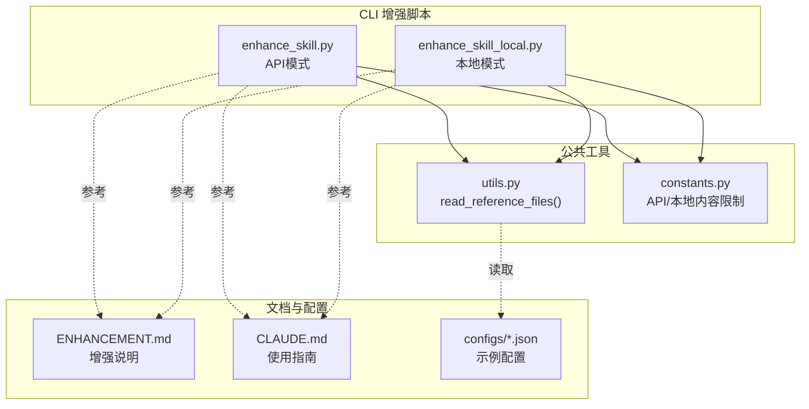
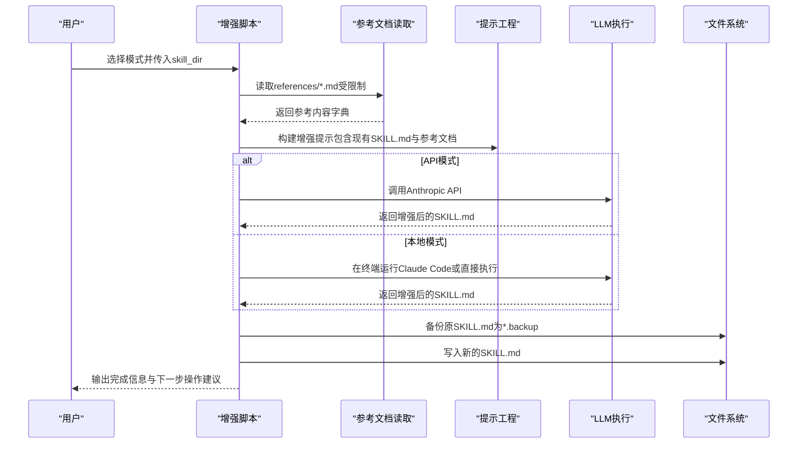
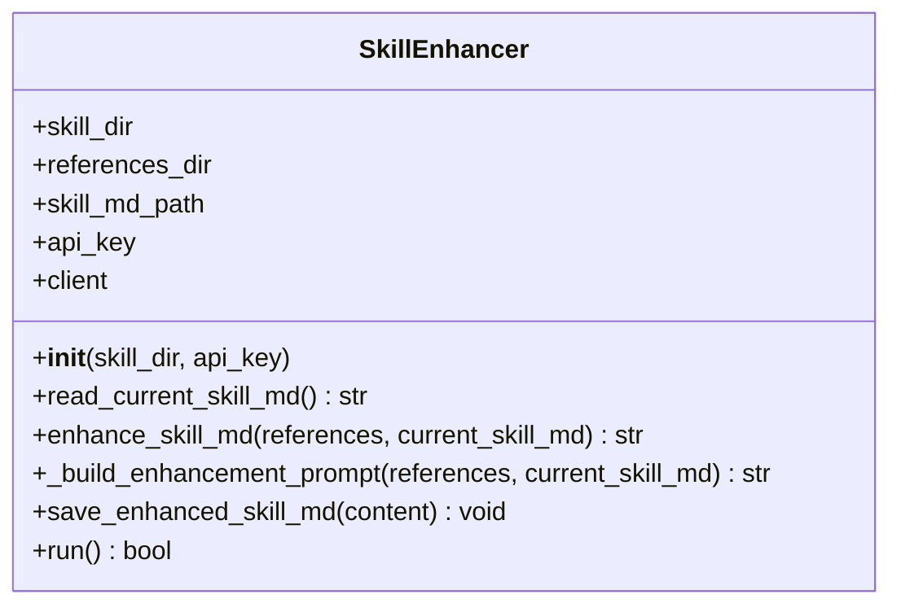
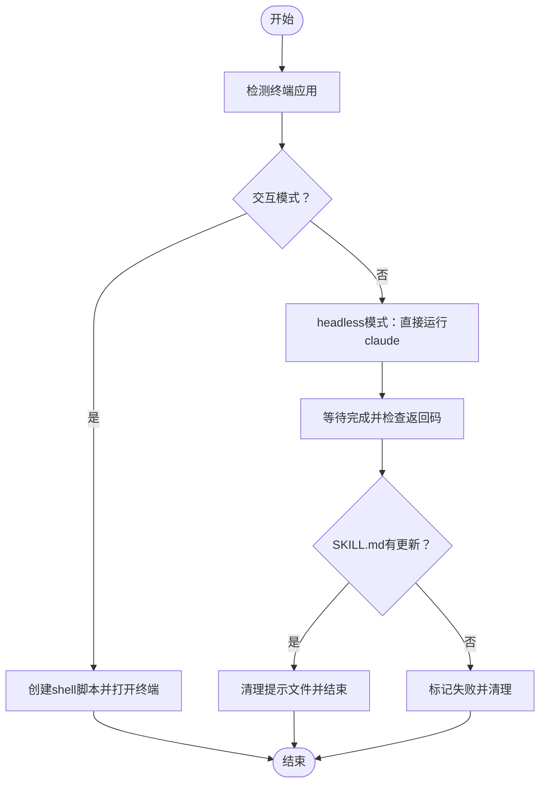
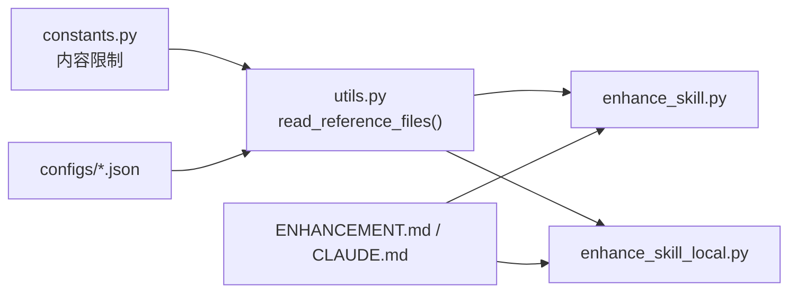

# enhance命令

<cite>
**本文引用的文件**
- [enhance_skill.py](file://src/skill_seekers/cli/enhance_skill.py)
- [enhance_skill_local.py](file://src/skill_seekers/cli/enhance_skill_local.py)
- [constants.py](file://src/skill_seekers/cli/constants.py)
- [utils.py](file://src/skill_seekers/cli/utils.py)
- [ENHANCEMENT.md](file://docs/ENHANCEMENT.md)
- [CLAUDE.md](file://docs/CLAUDE.md)
- [react.json](file://configs/react.json)
- [godot.json](file://configs/godot.json)
</cite>

## 目录
1. [简介](#简介)
2. [项目结构](#项目结构)
3. [核心组件](#核心组件)
4. [架构总览](#架构总览)
5. [详细组件分析](#详细组件分析)
6. [依赖关系分析](#依赖关系分析)
7. [性能考量](#性能考量)
8. [故障排查指南](#故障排查指南)
9. [结论](#结论)
10. [附录](#附录)

## 简介
本文件系统性记录“enhance”命令的AI增强功能，重点区分两种模式：
- API模式：通过Anthropic Claude API对SKILL.md进行优化与知识补充（enhance_skill.py）
- 本地模式：通过本地Claude Code（无需API密钥）对SKILL.md进行增强（enhance_skill_local.py）

文档涵盖参数说明（如--api-key、--dry-run、--interactive-enhancement、--timeout）、环境变量（ANTHROPIC_API_KEY）配置、上下文构建、提示工程、结果整合机制、性能与Token限制策略，以及常见失败场景的排查步骤。

## 项目结构
enhance命令位于CLI子模块中，分别提供API模式与本地模式两个脚本；同时通过公共工具函数读取参考文档、通过常量控制输入规模与预览长度。

图表来源
- [enhance_skill.py](file://src/skill_seekers/cli/enhance_skill.py#L1-L274)
- [enhance_skill_local.py](file://src/skill_seekers/cli/enhance_skill_local.py#L1-L452)
- [utils.py](file://src/skill_seekers/cli/utils.py#L182-L233)
- [constants.py](file://src/skill_seekers/cli/constants.py#L25-L34)
- [ENHANCEMENT.md](file://docs/ENHANCEMENT.md#L1-L251)
- [CLAUDE.md](file://docs/CLAUDE.md#L65-L84)
- [react.json](file://configs/react.json#L1-L32)
- [godot.json](file://configs/godot.json#L1-L48)

章节来源
- [enhance_skill.py](file://src/skill_seekers/cli/enhance_skill.py#L1-L274)
- [enhance_skill_local.py](file://src/skill_seekers/cli/enhance_skill_local.py#L1-L452)
- [utils.py](file://src/skill_seekers/cli/utils.py#L182-L233)
- [constants.py](file://src/skill_seekers/cli/constants.py#L25-L34)
- [ENHANCEMENT.md](file://docs/ENHANCEMENT.md#L1-L251)
- [CLAUDE.md](file://docs/CLAUDE.md#L65-L84)

## 核心组件
- API模式增强器（SkillEnhancer）
  - 负责读取参考文档、构建提示、调用Anthropic API、保存增强后的SKILL.md
  - 关键方法：构造函数、读取当前SKILL.md、调用API生成增强内容、保存备份与新版本
- 本地增强器（LocalSkillEnhancer）
  - 负责读取参考文档、创建增强提示、在终端中运行Claude Code或直接执行（headless），并在完成后清理提示文件
  - 关键方法：检测终端、创建提示、主流程、无头模式执行
- 公共工具
  - read_reference_files：从references目录递归读取Markdown文件，按大小限制截断与总量限制
  - constants：定义API/本地模式的字符上限与预览长度

章节来源
- [enhance_skill.py](file://src/skill_seekers/cli/enhance_skill.py#L32-L194)
- [enhance_skill_local.py](file://src/skill_seekers/cli/enhance_skill_local.py#L84-L291)
- [utils.py](file://src/skill_seekers/cli/utils.py#L182-L233)
- [constants.py](file://src/skill_seekers/cli/constants.py#L25-L34)

## 架构总览
API模式与本地模式共享相同的输入输出约定：均从skill目录的references子目录读取参考文档，生成新的SKILL.md，并保留原版备份。两者的差异在于提示工程与执行路径。

图表来源
- [enhance_skill.py](file://src/skill_seekers/cli/enhance_skill.py#L144-L194)
- [enhance_skill_local.py](file://src/skill_seekers/cli/enhance_skill_local.py#L169-L291)
- [utils.py](file://src/skill_seekers/cli/utils.py#L182-L233)

## 详细组件分析

### API模式：SkillEnhancer（enhance_skill.py）
- 输入与初始化
  - 从命令行接收skill_dir与可选--api-key；若未提供则从环境变量读取ANTHROPIC_API_KEY
  - 初始化Anthropic客户端
- 参考文档读取
  - 使用read_reference_files，按API_CONTENT_LIMIT与API_PREVIEW_LIMIT限制总字符数与单文件字符数
- 提示工程
  - 将当前SKILL.md（若存在）与所有参考文档拼接进提示
  - 明确任务清单：清晰的“何时使用此技能”、精选的快速参考、参考文件说明、实用的“如何使用此技能”、关键概念（视情况）
  - 强调从参考文档中提取真实示例、保持Markdown结构、保留frontmatter
- LLM调用
  - 指定模型与最大输出token，温度较低以提升稳定性
- 结果保存
  - 若原SKILL.md存在，先备份为*.backup，再写入新的增强版本
- 参数支持
  - --api-key：覆盖环境变量
  - --dry-run：仅打印将要执行的操作，不调用API

图表来源
- [enhance_skill.py](file://src/skill_seekers/cli/enhance_skill.py#L32-L194)

章节来源
- [enhance_skill.py](file://src/skill_seekers/cli/enhance_skill.py#L32-L194)
- [constants.py](file://src/skill_seekers/cli/constants.py#L25-L34)
- [utils.py](file://src/skill_seekers/cli/utils.py#L182-L233)

### 本地模式：LocalSkillEnhancer（enhance_skill_local.py）
- 终端检测
  - 优先级：SKILL_SEEKER_TERMINAL > TERM_PROGRAM > 默认Terminal.app
- 提示工程
  - 同样将当前SKILL.md与参考文档拼接进提示，明确任务与保存位置
- 执行方式
  - headless模式：直接调用claude命令等待完成，超时控制
  - 交互模式：在新终端窗口打开shell脚本，自动运行claude并关闭
- 文件管理
  - 将提示保存到临时文件，增强完成后清理
  - 自动备份原SKILL.md为*.backup
- 参数支持
  - --interactive-enhancement：交互模式（默认headless）
  - --timeout：headless模式超时时间（秒，默认600）

图表来源
- [enhance_skill_local.py](file://src/skill_seekers/cli/enhance_skill_local.py#L216-L291)
- [enhance_skill_local.py](file://src/skill_seekers/cli/enhance_skill_local.py#L293-L401)

章节来源
- [enhance_skill_local.py](file://src/skill_seekers/cli/enhance_skill_local.py#L35-L82)
- [enhance_skill_local.py](file://src/skill_seekers/cli/enhance_skill_local.py#L84-L291)
- [enhance_skill_local.py](file://src/skill_seekers/cli/enhance_skill_local.py#L293-L401)

### 上下文构建与提示工程
- 上下文构建
  - 读取references目录下的所有Markdown文件（递归），排除index.md
  - 对每个文件进行预览长度截断，整体字符数不超过设定上限
  - 将当前SKILL.md（若存在）作为对比上下文一并加入提示
- 提示设计
  - 明确任务目标与输出格式
  - 强调从参考文档中提取真实示例，避免编造
  - 保持Markdown结构与frontmatter不变
- 结果整合
  - 保存前先备份原SKILL.md
  - 写入新的增强版本，打印下一步操作建议

章节来源
- [utils.py](file://src/skill_seekers/cli/utils.py#L182-L233)
- [enhance_skill.py](file://src/skill_seekers/cli/enhance_skill.py#L81-L130)
- [enhance_skill_local.py](file://src/skill_seekers/cli/enhance_skill_local.py#L90-L168)

## 依赖关系分析
- 常量与限制
  - API模式：API_CONTENT_LIMIT、API_PREVIEW_LIMIT
  - 本地模式：LOCAL_CONTENT_LIMIT、LOCAL_PREVIEW_LIMIT
- 工具函数
  - read_reference_files负责读取与截断，确保输入规模可控
- 文档与配置
  - ENHANCEMENT.md与CLAUDE.md提供使用说明与最佳实践
  - 示例配置（如react.json、godot.json）展示如何组织参考文档与分类

图表来源
- [constants.py](file://src/skill_seekers/cli/constants.py#L25-L34)
- [utils.py](file://src/skill_seekers/cli/utils.py#L182-L233)
- [enhance_skill.py](file://src/skill_seekers/cli/enhance_skill.py#L144-L194)
- [enhance_skill_local.py](file://src/skill_seekers/cli/enhance_skill_local.py#L169-L291)
- [ENHANCEMENT.md](file://docs/ENHANCEMENT.md#L1-L251)
- [CLAUDE.md](file://docs/CLAUDE.md#L65-L84)
- [react.json](file://configs/react.json#L1-L32)
- [godot.json](file://configs/godot.json#L1-L48)

章节来源
- [constants.py](file://src/skill_seekers/cli/constants.py#L25-L34)
- [utils.py](file://src/skill_seekers/cli/utils.py#L182-L233)
- [ENHANCEMENT.md](file://docs/ENHANCEMENT.md#L1-L251)
- [CLAUDE.md](file://docs/CLAUDE.md#L65-L84)

## 性能考量
- Token与成本估算
  - ENHANCEMENT.md指出API模式每技能约5万至10万输入tokens、约4000输出tokens，模型为claude-sonnet-4-20250514，成本约$0.15-$0.30/技能
- 输入规模控制
  - API模式：API_CONTENT_LIMIT与API_PREVIEW_LIMIT限制总字符数与单文件字符数
  - 本地模式：LOCAL_CONTENT_LIMIT与LOCAL_PREVIEW_LIMIT限制总字符数与单文件字符数
- 大型技能目录策略
  - 当参考文档过多时，优先保证高质量示例与关键概念的提取
  - 可通过减少references数量或拆分技能（例如使用split_config与generate_router）降低单次增强负担
- 超时与重试
  - 本地模式提供--timeout参数，默认600秒，避免长时间挂起
  - API模式在调用异常时会捕获错误并提示

章节来源
- [ENHANCEMENT.md](file://docs/ENHANCEMENT.md#L127-L133)
- [constants.py](file://src/skill_seekers/cli/constants.py#L25-L34)
- [enhance_skill_local.py](file://src/skill_seekers/cli/enhance_skill_local.py#L398-L401)
- [CLAUDE.md](file://docs/CLAUDE.md#L220-L227)

## 故障排查指南
- API模式
  - 缺少API密钥
    - 症状：初始化时报错，提示设置ANTHROPIC_API_KEY或使用--api-key
    - 处理：设置环境变量或在命令行传入--api-key
  - anthropic包未安装
    - 症状：导入失败
    - 处理：安装anthropic
  - 无参考文件
    - 症状：找不到references目录或空
    - 处理：先运行爬虫与构建流程生成references
  - API调用失败
    - 症状：调用异常或返回None
    - 处理：检查网络、重试或改用本地模式
- 本地模式
  - 无法找到claude命令
    - 症状：报错'claude'命令未找到
    - 处理：安装Claude Code CLI，或改用交互模式
  - 终端自动启动失败
    - 症状：macOS上无法自动打开终端
    - 处理：手动运行脚本或设置SKILL_SEEKER_TERMINAL
  - headless超时
    - 症状：超过--timeout仍未完成
    - 处理：增大超时、减少参考内容、改用交互模式
  - 未更新SKILL.md
    - 症状：claude返回成功但SKILL.md未变化
    - 处理：检查提示文件是否正确、确认增强已写入目标路径

章节来源
- [enhance_skill.py](file://src/skill_seekers/cli/enhance_skill.py#L38-L47)
- [ENHANCEMENT.md](file://docs/ENHANCEMENT.md#L136-L161)
- [enhance_skill_local.py](file://src/skill_seekers/cli/enhance_skill_local.py#L388-L401)
- [enhance_skill_local.py](file://src/skill_seekers/cli/enhance_skill_local.py#L246-L273)
- [enhance_skill_local.py](file://src/skill_seekers/cli/enhance_skill_local.py#L365-L387)

## 结论
- API模式适合需要稳定输出且具备API密钥的用户，成本可控，适合批量增强
- 本地模式无需API密钥，适合Claude Code Max用户，自动化程度高，但需关注终端与超时问题
- 两者均通过统一的参考文档读取与提示工程，确保增强质量与一致性
- 面对大型技能目录，应结合内容限制与拆分策略，合理规划增强流程

## 附录

### 参数与环境变量速查
- API模式（enhance_skill.py）
  - --api-key：显式提供Anthropic API密钥
  - --dry-run：仅打印将要执行的操作，不调用API
- 本地模式（enhance_skill_local.py）
  - --interactive-enhancement：交互模式（打开新终端）
  - --timeout：headless模式超时时间（秒，默认600）
- 环境变量
  - ANTHROPIC_API_KEY：API模式的密钥来源
  - SKILL_SEEKER_TERMINAL：本地模式指定终端应用名称
  - TERM_PROGRAM：继承当前终端类型（用于自动推断）

章节来源
- [enhance_skill.py](file://src/skill_seekers/cli/enhance_skill.py#L196-L270)
- [enhance_skill_local.py](file://src/skill_seekers/cli/enhance_skill_local.py#L403-L448)
- [ENHANCEMENT.md](file://docs/ENHANCEMENT.md#L57-L66)

### 使用示例与最佳实践
- API模式
  - 设置密钥后直接增强：python3 cli/enhance_skill.py output/react/
  - 干跑验证：python3 cli/enhance_skill.py output/react/ --dry-run
- 本地模式
  - headless增强：python3 cli/enhance_skill_local.py output/react/
  - 交互增强：python3 cli/enhance_skill_local.py output/react/ --interactive-enhancement
  - 自定义超时：python3 cli/enhance_skill_local.py output/react/ --timeout 1200
- 最佳实践
  - 先完成爬虫与构建，再进行增强
  - 审核生成的SKILL.md，必要时恢复备份
  - 对于大型文档，考虑拆分为多个子技能并使用路由器

章节来源
- [ENHANCEMENT.md](file://docs/ENHANCEMENT.md#L24-L41)
- [ENHANCEMENT.md](file://docs/ENHANCEMENT.md#L67-L80)
- [CLAUDE.md](file://docs/CLAUDE.md#L65-L84)