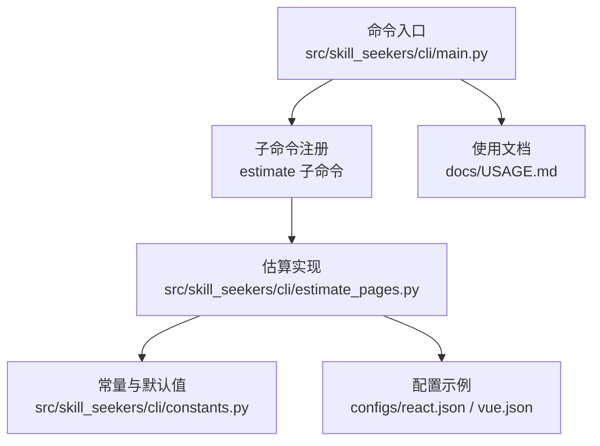
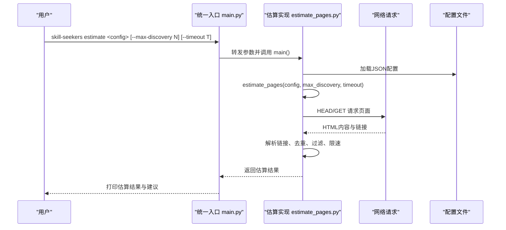
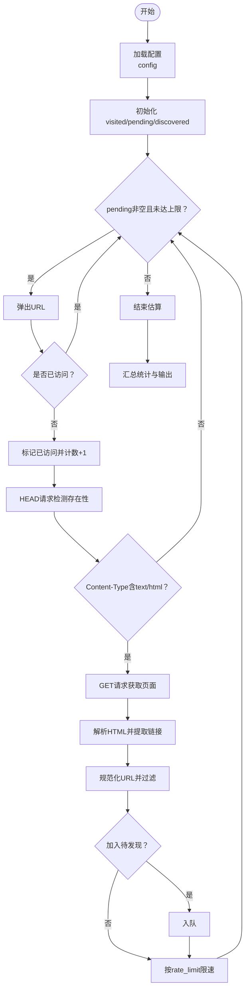
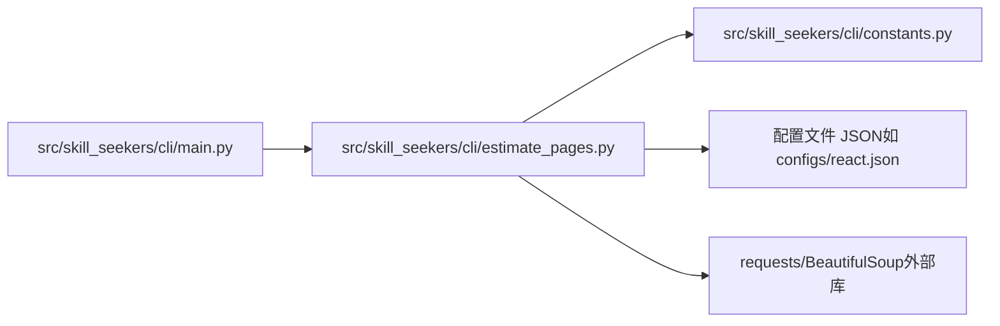

# estimate命令

<cite>
**本文引用的文件**
- [estimate_pages.py](file://src/skill_seekers/cli/estimate_pages.py)
- [main.py](file://src/skill_seekers/cli/main.py)
- [constants.py](file://src/skill_seekers/cli/constants.py)
- [react.json](file://configs/react.json)
- [vue.json](file://configs/vue.json)
- [USAGE.md](file://docs/USAGE.md)
- [test_estimate_pages.py](file://tests/test_estimate_pages.py)
</cite>

## 目录
1. [简介](#简介)
2. [项目结构](#项目结构)
3. [核心组件](#核心组件)
4. [架构概览](#架构概览)
5. [详细组件分析](#详细组件分析)
6. [依赖关系分析](#依赖关系分析)
7. [性能考量](#性能考量)
8. [故障排查指南](#故障排查指南)
9. [结论](#结论)
10. [附录](#附录)

## 简介
本文件面向“estimate命令”，系统性说明其在正式抓取前估算文档网站总页数的能力与使用方法。重点包括：
- config参数如何指向配置文件（JSON），以及配置中关键字段（如base_url、start_urls、url_patterns、rate_limit等）如何影响估算；
- --max-discovery选项对探索深度的限制与行为差异；
- 基于estimate_pages.py的实现，解释其如何模拟抓取流程、遍历链接图谱并预测总页面数；
- 该命令在资源规划与性能预估中的价值，帮助用户避免意外的大规模抓取；
- 典型输出示例与最佳实践，建议将其作为scrape命令的前置检查步骤。

## 项目结构
estimate命令位于CLI子模块中，通过统一入口main.py注册子命令，并委托到具体实现文件进行估算。配置文件通常位于configs目录下，包含站点基础信息、起始URL、URL过滤规则、速率限制等。

图表来源
- [main.py](file://src/skill_seekers/cli/main.py#L152-L160)
- [estimate_pages.py](file://src/skill_seekers/cli/estimate_pages.py#L233-L272)
- [constants.py](file://src/skill_seekers/cli/constants.py#L35-L40)
- [react.json](file://configs/react.json#L1-L32)
- [vue.json](file://configs/vue.json#L1-L32)
- [USAGE.md](file://docs/USAGE.md#L159-L252)

章节来源
- [main.py](file://src/skill_seekers/cli/main.py#L152-L160)
- [estimate_pages.py](file://src/skill_seekers/cli/estimate_pages.py#L233-L272)
- [constants.py](file://src/skill_seekers/cli/constants.py#L35-L40)
- [react.json](file://configs/react.json#L1-L32)
- [vue.json](file://configs/vue.json#L1-L32)
- [USAGE.md](file://docs/USAGE.md#L159-L252)

## 核心组件
- 统一CLI入口：负责解析子命令与参数，将“estimate”子命令转发到具体实现。
- 估算实现：加载配置、按链接图谱遍历、统计发现页数、计算预估总数与速率，并给出推荐与时间预估。
- 常量定义：默认最大发现页数、阈值等，用于控制估算行为与警告提示。
- 配置文件：包含站点基础信息、起始URL、URL过滤规则、速率限制等，直接影响估算结果。

章节来源
- [main.py](file://src/skill_seekers/cli/main.py#L152-L160)
- [estimate_pages.py](file://src/skill_seekers/cli/estimate_pages.py#L25-L139)
- [constants.py](file://src/skill_seekers/cli/constants.py#L35-L40)
- [react.json](file://configs/react.json#L1-L32)
- [vue.json](file://configs/vue.json#L1-L32)

## 架构概览
estimate命令的调用链路如下：

图表来源
- [main.py](file://src/skill_seekers/cli/main.py#L324-L329)
- [estimate_pages.py](file://src/skill_seekers/cli/estimate_pages.py#L233-L272)
- [estimate_pages.py](file://src/skill_seekers/cli/estimate_pages.py#L25-L139)

## 详细组件分析

### 命令行接口与参数
- 参数说明
  - config：必需，指向配置文件路径（JSON）。命令会读取该文件并解析为字典。
  - --max-discovery/-m：最大发现页数，默认值来自常量；设为-1或使用--unlimited表示不限制。
  - --unlimited/-u：移除发现上限，等价于--max-discovery -1。
  - --timeout/-t：HTTP请求超时秒数，默认30秒。
- 行为要点
  - 当未设置--max-discovery且未使用--unlimited时，采用默认上限；若达到上限则返回特定退出码以提示用户。
  - 若启用--unlimited，将尽可能发现所有可达页面，但可能耗时较长。

章节来源
- [estimate_pages.py](file://src/skill_seekers/cli/estimate_pages.py#L233-L272)
- [main.py](file://src/skill_seekers/cli/main.py#L324-L329)

### 配置文件（config）结构与作用
- 关键字段
  - name/base_url：站点名称与基础URL，决定域名范围与起始点。
  - start_urls：起始URL列表，作为初始待访问队列。
  - url_patterns.include/exclude：URL过滤规则，优先排除再选择包含，仅处理同域URL。
  - rate_limit：请求间隔（秒），用于限速与礼貌抓取。
  - max_pages：抓取上限（在scrape阶段生效），估算阶段用于推荐参考。
- 影响
  - 过滤规则显著影响发现数量与图谱规模；
  - 起始URL越多，初始待发现队列越大；
  - 速率限制越慢，整体发现速率越低，但更安全。

章节来源
- [react.json](file://configs/react.json#L1-L32)
- [vue.json](file://configs/vue.json#L1-L32)
- [estimate_pages.py](file://src/skill_seekers/cli/estimate_pages.py#L25-L139)

### 发现算法与链接遍历
- 流程概述
  - 从start_urls开始，逐个URL进行HEAD/GET请求；
  - 仅保留HTML类型页面，解析页面中的所有链接；
  - 将链接规范化（去除查询参数、锚点），仅保留同域URL；
  - 应用include/exclude过滤规则；
  - 使用集合记录已访问，避免重复；
  - 每次请求后按rate_limit限速；
  - 在达到max_discovery或队列为空时停止。
- 关键函数
  - estimate_pages：主循环与统计。
  - is_valid_url：URL合法性与过滤逻辑。
  - print_results：格式化输出估算结果与建议。
  - load_config：加载JSON配置。

图表来源
- [estimate_pages.py](file://src/skill_seekers/cli/estimate_pages.py#L25-L139)
- [estimate_pages.py](file://src/skill_seekers/cli/estimate_pages.py#L142-L163)

章节来源
- [estimate_pages.py](file://src/skill_seekers/cli/estimate_pages.py#L25-L139)
- [estimate_pages.py](file://src/skill_seekers/cli/estimate_pages.py#L142-L163)

### 输出与推荐
- 输出字段
  - discovered：已发现页数
  - pending：仍在队列中的待发现页数
  - estimated_total：预估总页数（discovered + pending）
  - elapsed_seconds：耗时
  - discovery_rate：发现速率（pages/sec）
  - hit_limit：是否达到max_discovery上限
  - unlimited：是否不限制
- 推荐与预估
  - 若当前配置的max_pages不足，给出建议值（估算值+缓冲，不超过阈值）；
  - 基于rate_limit估算完整抓取所需时间（分钟）。

章节来源
- [estimate_pages.py](file://src/skill_seekers/cli/estimate_pages.py#L165-L218)
- [constants.py](file://src/skill_seekers/cli/constants.py#L35-L40)

### 与scrape命令的关系与最佳实践
- 建议流程
  - 先运行estimate命令，确认预估总页数与耗时；
  - 根据输出调整配置中的max_pages与rate_limit；
  - 再执行scrape命令进行正式抓取。
- 价值
  - 避免大规模抓取带来的网络压力与资源消耗；
  - 提前识别潜在的超大站点或复杂链接图谱，合理规划上限与时间窗口。

章节来源
- [USAGE.md](file://docs/USAGE.md#L159-L252)

## 依赖关系分析
- estimate_pages.py依赖
  - constants.py：默认最大发现页数、阈值等常量；
  - 配置文件：JSON结构决定发现范围与策略；
  - 外部库：requests（HTTP）、BeautifulSoup（HTML解析）。
- CLI层依赖
  - main.py：注册estimate子命令，解析参数并转发到实现。

图表来源
- [estimate_pages.py](file://src/skill_seekers/cli/estimate_pages.py#L1-L20)
- [constants.py](file://src/skill_seekers/cli/constants.py#L35-L40)
- [main.py](file://src/skill_seekers/cli/main.py#L152-L160)

章节来源
- [estimate_pages.py](file://src/skill_seekers/cli/estimate_pages.py#L1-L20)
- [constants.py](file://src/skill_seekers/cli/constants.py#L35-L40)
- [main.py](file://src/skill_seekers/cli/main.py#L152-L160)

## 性能考量
- 估算速度
  - 默认上限为1000页，适合大多数文档站点；
  - 对大型站点可提高上限至2000页，但耗时相应增加；
  - 启用--unlimited会尽可能发现全部可达页面，但可能耗时较长。
- 限速与礼貌抓取
  - rate_limit越小，发现速率越高，但对目标站点压力越大；
  - 建议根据站点规模与自身网络状况适当降低rate_limit。
- 过滤规则
  - 正确配置url_patterns.include/exclude可显著减少无效页面发现；
  - 仅保留同域URL，避免跨站请求导致的错误与浪费。

章节来源
- [constants.py](file://src/skill_seekers/cli/constants.py#L35-L40)
- [estimate_pages.py](file://src/skill_seekers/cli/estimate_pages.py#L25-L139)

## 故障排查指南
- 常见问题
  - 未提供config参数：CLI会显示帮助或返回非零退出码。
  - 配置文件不存在或JSON无效：会打印错误并退出。
  - 抓取被中断：用户中断会返回特定退出码。
  - 达到max_discovery上限：返回特定退出码提示用户提高上限。
- 建议
  - 使用--timeout增大超时时间以应对慢响应站点；
  - 使用--max-discovery设置合理上限，避免长时间占用；
  - 结合输出的预估时间与建议，调整rate_limit与max_pages后再执行scrape。

章节来源
- [estimate_pages.py](file://src/skill_seekers/cli/estimate_pages.py#L233-L285)
- [test_estimate_pages.py](file://tests/test_estimate_pages.py#L78-L136)

## 结论
estimate命令通过轻量级的链接图谱遍历与HTTP探测，为后续的正式抓取提供了可靠的预估与规划依据。它能够：
- 快速评估站点规模与抓取成本；
- 帮助用户合理设置max_pages与rate_limit；
- 降低意外大规模抓取的风险；
- 作为scrape命令的标准前置检查步骤，提升整体工作流的稳定性与效率。

## 附录

### 典型输出示例
以下为基于真实配置的典型输出风格（不含具体代码内容）：
- 基础信息：站点名称、基础URL、起始URL数量、速率限制、最大发现页数；
- 发现进度：每若干页打印一次发现计数与速率；
- 估算结果：已发现、待发现、预估总数、耗时、发现速率；
- 建议：当前max_pages是否足够、推荐值、完整抓取预估耗时；
- 限制提示：是否达到上限、是否不限制模式。

章节来源
- [USAGE.md](file://docs/USAGE.md#L210-L244)

### 常用命令示例
- 快速估算（100页）：针对小型站点快速验证；
- 标准估算（默认1000页）：适用于大多数文档站点；
- 深度估算（2000页）：针对大型站点；
- 自定义超时：针对慢响应站点。

章节来源
- [USAGE.md](file://docs/USAGE.md#L181-L209)