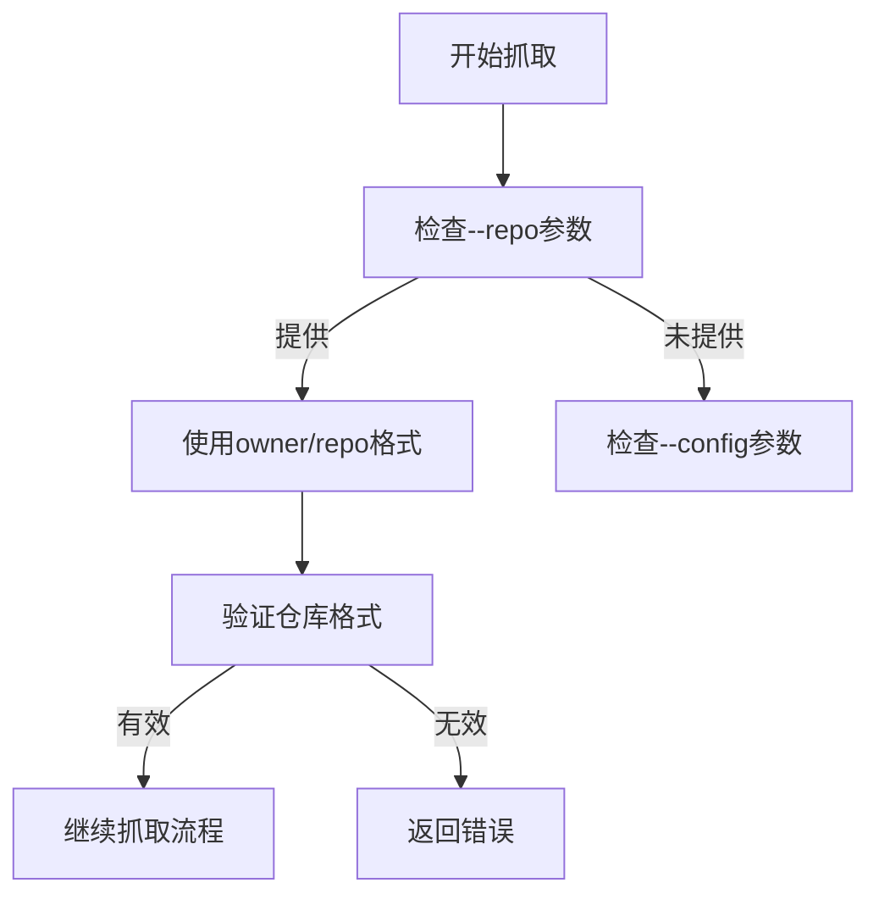
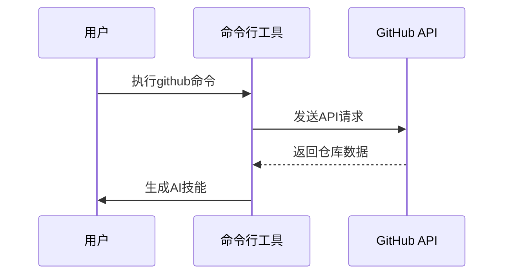
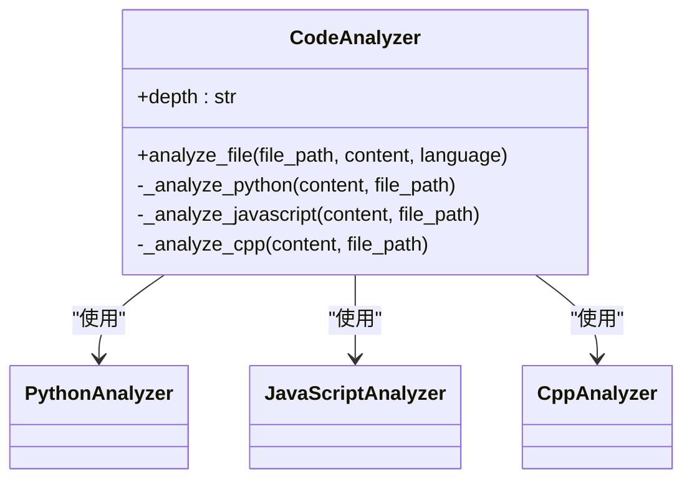

# github命令

<cite>
**本文档中引用的文件**   
- [github_scraper.py](file://src/skill_seekers/cli/github_scraper.py)
- [main.py](file://src/skill_seekers/cli/main.py)
- [code_analyzer.py](file://src/skill_seekers/cli/code_analyzer.py)
- [react_github.json](file://configs/react_github.json)
</cite>

## 目录
1. [介绍](#介绍)
2. [核心参数详解](#核心参数详解)
3. [配置文件机制](#配置文件机制)
4. [实现原理](#实现原理)
5. [使用示例](#使用示例)
6. [高级话题](#高级话题)
7. [调试建议](#调试建议)

## 介绍

github命令是Skill Seekers工具集中的一个核心功能，用于从GitHub仓库抓取内容并生成AI技能。该命令通过PyGithub库与GitHub API交互，提取仓库的元数据、代码结构、问题和PR等信息，并将其转换为Claude AI可以使用的技能格式。此功能支持通过命令行参数或配置文件来指定抓取范围和过滤规则，适用于从microsoft/TypeScript等大型仓库抓取内容的场景。

## 核心参数详解

github命令提供了多个参数来控制抓取行为，其中最重要的参数包括--repo、--config和--name。

**Section sources**
- [main.py](file://src/skill_seekers/cli/main.py#L93-L102)
- [github_scraper.py](file://src/skill_seekers/cli/github_scraper.py#L894-L909)

### --repo参数

--repo参数用于指定目标GitHub仓库，采用owner/repo的格式。例如，要抓取React仓库，可以使用`--repo facebook/react`。这个参数是直接指定仓库的主要方式，允许用户快速开始抓取过程而无需创建配置文件。



**Diagram sources**
- [main.py](file://src/skill_seekers/cli/main.py#L99)
- [github_scraper.py](file://src/skill_seekers/cli/github_scraper.py#L898-L900)

### --config参数

--config参数用于指定配置文件的路径。配置文件是一个JSON文件，包含了抓取所需的全部配置信息，如仓库地址、技能名称、描述等。使用配置文件可以更精细地控制抓取过程，适合复杂的抓取需求。

### --name参数

--name参数用于指定生成的AI技能的名称。如果不指定，系统将默认使用仓库名作为技能名称。这个参数对于组织和管理多个技能非常重要，确保每个技能都有一个清晰且唯一的标识。

## 配置文件机制

配置文件是github命令的核心组成部分，它定义了抓取的范围和过滤规则。通过配置文件，用户可以精确控制哪些内容被包含在最终的AI技能中。

**Section sources**
- [react_github.json](file://configs/react_github.json)
- [github_scraper.py](file://src/skill_seekers/cli/github_scraper.py#L77-L135)

### 配置文件结构

配置文件采用JSON格式，包含以下关键字段：
- name: 技能名称
- repo: 仓库地址 (owner/repo格式)
- description: 技能描述
- include_issues: 是否包含问题
- max_issues: 最大问题数量
- include_changelog: 是否包含变更日志
- include_releases: 是否包含发布信息
- file_patterns: 文件模式过滤器

```json
{
  "name": "react",
  "repo": "facebook/react",
  "description": "React JavaScript library for building user interfaces",
  "include_issues": true,
  "max_issues": 100,
  "include_changelog": true,
  "include_releases": true,
  "file_patterns": [
    "packages/**/*.js",
    "packages/**/*.ts"
  ]
}
```

**Diagram sources**
- [react_github.json](file://configs/react_github.json)

### 过滤规则

配置文件中的file_patterns字段允许用户定义文件模式过滤器，从而只抓取符合特定模式的文件。这在处理大型仓库时特别有用，可以避免抓取不必要的文件，提高效率。

## 实现原理

github命令的实现基于PyGithub库，通过API调用获取仓库信息，并进行代码分析和元数据提取。

**Section sources**
- [github_scraper.py](file://src/skill_seekers/cli/github_scraper.py#L61-L933)
- [code_analyzer.py](file://src/skill_seekers/cli/code_analyzer.py#L58-L200)

### API调用机制

github命令使用PyGithub库与GitHub API进行交互。首先，通过仓库的owner/repo格式构建API请求，然后发送请求获取仓库的基本信息、文件树、问题和PR等数据。



**Diagram sources**
- [github_scraper.py](file://src/skill_seekers/cli/github_scraper.py#L214-L245)

### 代码分析

代码分析功能由code_analyzer.py模块实现，支持不同深度的分析。通过配置code_analysis_depth参数，用户可以选择表面、深度或完整级别的分析。



**Diagram sources**
- [code_analyzer.py](file://src/skill_seekers/cli/code_analyzer.py#L58-L200)

## 使用示例

以下是一些常见的使用示例，展示了如何从不同的GitHub仓库抓取内容。

**Section sources**
- [main.py](file://src/skill_seekers/cli/main.py#L46-L47)
- [react_github.json](file://configs/react_github.json)

### 从React仓库抓取

```bash
skill-seekers github --repo facebook/react
```

### 从TypeScript仓库抓取

```bash
skill-seekers github --repo microsoft/TypeScript --name typescript
```

### 使用配置文件抓取

```bash
skill-seekers github --config configs/react_github.json
```

## 高级话题

### 速率限制处理

github命令内置了对速率限制的处理机制。当API调用达到限制时，系统会自动等待并重试，确保抓取过程的稳定性。

### 认证配置

为了提高API调用的限额，建议使用GitHub令牌进行认证。可以通过环境变量GITHUB_TOKEN或在配置文件中直接指定令牌。

### 私有仓库访问

对于私有仓库，需要提供具有适当权限的GitHub令牌。系统支持通过HTTPS URL注入令牌的方式访问私有仓库。

## 调试建议

在使用github命令时，如果遇到问题，可以参考以下调试建议：
- 检查网络连接是否正常
- 确认GitHub令牌的有效性
- 查看日志输出以获取详细的错误信息
- 使用--scrape-only模式进行测试，避免生成不必要的文件