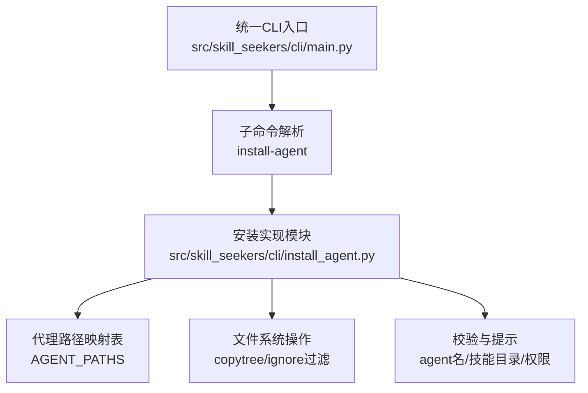
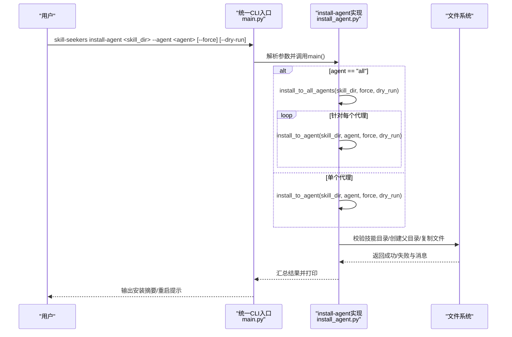
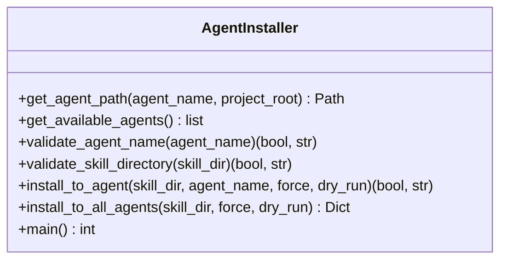

# install-agent命令

<cite>
**本文引用的文件**
- [install_agent.py](file://src/skill_seekers/cli/install_agent.py)
- [main.py（统一CLI入口）](file://src/skill_seekers/cli/main.py)
- [README.md（项目总览与使用说明）](file://README.md)
- [test_install_agent.py（单元测试）](file://tests/test_install_agent.py)
</cite>

## 目录
1. [简介](#简介)
2. [项目结构](#项目结构)
3. [核心组件](#核心组件)
4. [架构总览](#架构总览)
5. [详细组件分析](#详细组件分析)
6. [依赖关系分析](#依赖关系分析)
7. [性能考量](#性能考量)
8. [故障排查指南](#故障排查指南)
9. [结论](#结论)
10. [附录：安装路径清单与使用示例](#附录安装路径清单与使用示例)

## 简介
本文件围绕install-agent命令展开，系统化说明其如何将由Skill Seekers生成的“技能”（skill）安装到不同AI编码代理（如Claude Code、Cursor、VS Code/Copilot、Amp、Goose、OpenCode、Letta、Aide、Windsurf等）的本地目录中。文档重点覆盖：
- --agent参数支持的代理名称及特殊值（如all）
- --force与--dry-run标志的行为与影响
- 代理路径映射逻辑、文件复制机制与冲突处理策略
- 各支持代理的安装路径清单
- 如何通过--dry-run预览安装操作
- 在本地开发与测试工作流中的作用与最佳实践

## 项目结构
install-agent位于统一CLI入口下，作为子命令被skill-seekers调用；其核心实现集中在install_agent.py中，统一CLI入口负责解析参数并转发到具体模块。

图表来源
- [main.py（统一CLI入口）](file://src/skill_seekers/cli/main.py#L161-L186)
- [install_agent.py](file://src/skill_seekers/cli/install_agent.py#L34-L85)
- [install_agent.py](file://src/skill_seekers/cli/install_agent.py#L166-L310)

章节来源
- [main.py（统一CLI入口）](file://src/skill_seekers/cli/main.py#L161-L186)
- [README.md（项目总览与使用说明）](file://README.md#L720-L771)

## 核心组件
- 代理路径映射表（AGENT_PATHS）：定义每个代理的安装根路径模板（全局或项目相对），并在运行时解析为绝对路径。
- 路径解析函数（get_agent_path）：根据agent名称与项目根目录，返回目标安装目录。
- 安装主流程（install_to_agent）：执行技能目录校验、冲突检测、可选的dry-run预览、权限检查、忽略规则过滤后的复制。
- 全量安装（install_to_all_agents）：遍历所有已知代理，批量执行安装。
- CLI入口（main）：解析参数、处理--agent=all、--force、--dry-run，汇总结果并输出人类可读的摘要。

章节来源
- [install_agent.py](file://src/skill_seekers/cli/install_agent.py#L34-L85)
- [install_agent.py](file://src/skill_seekers/cli/install_agent.py#L166-L310)
- [install_agent.py](file://src/skill_seekers/cli/install_agent.py#L312-L338)
- [install_agent.py](file://src/skill_seekers/cli/install_agent.py#L340-L471)

## 架构总览
install-agent的调用链路如下：

图表来源
- [main.py（统一CLI入口）](file://src/skill_seekers/cli/main.py#L331-L338)
- [install_agent.py](file://src/skill_seekers/cli/install_agent.py#L312-L338)
- [install_agent.py](file://src/skill_seekers/cli/install_agent.py#L166-L310)

## 详细组件分析

### 代理路径映射与解析
- 支持的代理名称：claude、cursor、vscode、copilot、amp、goose、opencode、letta、aide、windsurf、all（特殊值，表示全部代理）。
- 路径类型：
  - 全局路径（以~开头）：安装到用户家目录下，如~/.claude/skills/、~/.amp/skills/等。
  - 项目相对路径（以.开头）：安装到当前项目根目录下，如.cursor/skills/、.github/skills/。
- 解析逻辑：
  - 对于以~开头的模板，使用expanduser解析为绝对路径。
  - 对于项目相对模板，结合项目根目录（默认当前工作目录）拼接为绝对路径。
- 大小写不敏感：agent名称统一转为小写后匹配。

章节来源
- [install_agent.py](file://src/skill_seekers/cli/install_agent.py#L34-L85)
- [install_agent.py](file://src/skill_seekers/cli/install_agent.py#L87-L95)
- [test_install_agent.py](file://tests/test_install_agent.py#L35-L85)

### 技能目录校验
- 必须存在且为目录。
- 必须包含SKILL.md文件。
- 若校验失败，立即返回错误信息，避免后续操作。

章节来源
- [install_agent.py](file://src/skill_seekers/cli/install_agent.py#L138-L164)
- [test_install_agent.py](file://tests/test_install_agent.py#L124-L164)

### 安装主流程（install_to_agent）
- 参数：skill_dir、agent_name、force、dry_run。
- 冲突处理：
  - 若目标目录已存在且未启用--force，则返回明确的错误信息与解决建议（覆盖、删除、重命名）。
- dry-run模式：
  - 不进行任何文件系统变更，仅计算将要复制的文件数量与大小，给出预览摘要与后续安装建议。
- 权限处理：
  - 创建父目录或复制过程中遇到权限问题，返回清晰的错误信息与修复建议（例如sudo mkdir/chown）。
- 文件复制与忽略规则：
  - 使用shutil.copytree进行递归复制。
  - 忽略规则包括：.backup结尾的备份文件、__pycache__、.DS_Store、隐藏文件（除某些特殊例外如.github、.cursor）。
- 成功后输出针对不同代理的重启提示，确保新技能生效。

章节来源
- [install_agent.py](file://src/skill_seekers/cli/install_agent.py#L166-L310)
- [test_install_agent.py](file://tests/test_install_agent.py#L166-L306)

### 全量安装（install_to_all_agents）
- 遍历所有可用代理，逐个调用install_to_agent。
- 返回字典，键为代理名，值为(是否成功, 消息)元组，便于上层汇总。

章节来源
- [install_agent.py](file://src/skill_seekers/cli/install_agent.py#L312-L338)
- [test_install_agent.py](file://tests/test_install_agent.py#L308-L382)

### CLI入口与参数处理
- 子命令注册：install-agent子命令在统一CLI入口中注册，接收skill_directory、--agent、--force、--dry-run。
- 特殊值all：
  - 当agent为all时，调用install_to_all_agents并汇总结果，打印安装计数、失败计数与跳过计数。
- 错误分类：
  - 权限错误：单独计数并给出修复建议。
  - 校验错误（目录不存在、缺少SKILL.md）：仅打印一次并退出。
  - 其他跳过情况：按代理分别提示“未安装”。

章节来源
- [main.py（统一CLI入口）](file://src/skill_seekers/cli/main.py#L161-L186)
- [install_agent.py](file://src/skill_seekers/cli/install_agent.py#L340-L471)
- [test_install_agent.py](file://tests/test_install_agent.py#L384-L468)

### 类图（代码级）

图表来源
- [install_agent.py](file://src/skill_seekers/cli/install_agent.py#L51-L338)

## 依赖关系分析
- 统一CLI入口与install-agent实现解耦：统一入口仅负责参数解析与转发，install-agent实现独立完成业务逻辑。
- install-agent实现内部依赖：
  - argparse：解析命令行参数。
  - shutil：递归复制目录。
  - pathlib：路径解析与拼接。
  - difflib：模糊匹配建议。
  - 标准库os/sys：异常与退出码。
- 测试覆盖：
  - 路径解析（含大小写与项目相对路径）、代理名验证与建议、技能目录校验、单代理安装、全量安装、CLI集成与--dry-run行为均通过单元测试验证。

章节来源
- [install_agent.py](file://src/skill_seekers/cli/install_agent.py#L26-L47)
- [test_install_agent.py](file://tests/test_install_agent.py#L1-L468)

## 性能考量
- 复制前的dry-run预览会扫描整个技能目录统计文件数量与大小，适合大目录时先评估磁盘占用与耗时。
- 复制过程采用shutil.copytree，忽略规则减少无关文件传输，降低IO压力。
- 全量安装时，若部分代理因权限失败，不影响其他代理的尝试，提高整体成功率。

[本节为通用指导，无需列出具体文件来源]

## 故障排查指南
- “未知代理”错误：
  - 现象：agent名称不在支持列表或拼写错误。
  - 处理：使用--agent all查看可用代理；利用模糊匹配建议修正拼写。
- “技能已安装”冲突：
  - 现象：目标目录已存在且未使用--force。
  - 处理：使用--force覆盖；或手动删除目标目录；或重命名技能目录后重新安装。
- “权限不足”：
  - 现象：创建父目录或复制文件时权限错误。
  - 处理：参考提示使用sudo创建目录并修改属主；确保当前用户对目标路径有写权限。
- “技能目录无效”：
  - 现象：目录不存在、非目录或缺少SKILL.md。
  - 处理：确认路径正确、目录存在且包含SKILL.md。

章节来源
- [install_agent.py](file://src/skill_seekers/cli/install_agent.py#L97-L136)
- [install_agent.py](file://src/skill_seekers/cli/install_agent.py#L138-L164)
- [install_agent.py](file://src/skill_seekers/cli/install_agent.py#L212-L221)
- [install_agent.py](file://src/skill_seekers/cli/install_agent.py#L256-L310)

## 结论
install-agent命令提供了将Skill Seekers生成的技能快速、安全地安装到多种AI编码代理的统一方式。通过严格的路径映射、健壮的校验与忽略规则、灵活的--force与--dry-run选项，它既适用于日常开发调试，也适用于团队批量部署场景。配合统一CLI入口，用户可以无缝融入从抓取、增强、打包到安装的完整工作流。

[本节为总结性内容，无需列出具体文件来源]

## 附录：安装路径清单与使用示例

### 支持的代理与安装路径
- Claude Code：全局路径 ~/.claude/skills/
- Cursor：项目相对路径 .cursor/skills/
- VS Code / Copilot：项目相对路径 .github/skills/
- Amp：全局路径 ~/.amp/skills/
- Goose：全局路径 ~/.config/goose/skills/
- OpenCode：全局路径 ~/.opencode/skills/
- Letta：全局路径 ~/.letta/skills/
- Aide：全局路径 ~/.aide/skills/
- Windsurf：全局路径 ~/.windsurf/skills/

说明：
- 全局路径安装到用户家目录，适合跨项目共享技能。
- 项目相对路径安装到当前项目根目录，适合团队协作或项目内隔离。

章节来源
- [install_agent.py](file://src/skill_seekers/cli/install_agent.py#L34-L48)
- [README.md（项目总览与使用说明）](file://README.md#L740-L756)

### 命令行参数与标志
- --agent：指定代理名称；支持所有已列代理与特殊值all。
- --force：强制覆盖已存在的安装目录。
- --dry-run：预览安装操作，不进行任何文件系统变更。

章节来源
- [install_agent.py](file://src/skill_seekers/cli/install_agent.py#L340-L391)
- [README.md（项目总览与使用说明）](file://README.md#L720-L771)

### 使用示例（来自README与CLI帮助）
- 安装到特定代理：skill-seekers install-agent output/react/ --agent cursor
- 安装到全部代理：skill-seekers install-agent output/react/ --agent all
- 强制覆盖：skill-seekers install-agent output/react/ --agent claude --force
- 预览安装：skill-seekers install-agent output/react/ --agent cursor --dry-run

章节来源
- [README.md（项目总览与使用说明）](file://README.md#L720-L771)
- [install_agent.py](file://src/skill_seekers/cli/install_agent.py#L347-L391)

### 本地开发与测试工作流中的重要性
- 快速迭代：通过--dry-run预览，避免误操作；通过--force快速替换旧版本。
- 多代理对比：使用--agent all同时验证多个代理的加载效果。
- 团队协作：项目相对路径（如.cursor/skills/、.github/skills/）便于团队成员在同一仓库内共享技能。
- 自动化集成：与统一CLI的其他命令（scrape、enhance、package）组合，形成端到端的技能交付流水线。

章节来源
- [README.md（项目总览与使用说明）](file://README.md#L720-L771)
- [main.py（统一CLI入口）](file://src/skill_seekers/cli/main.py#L161-L186)