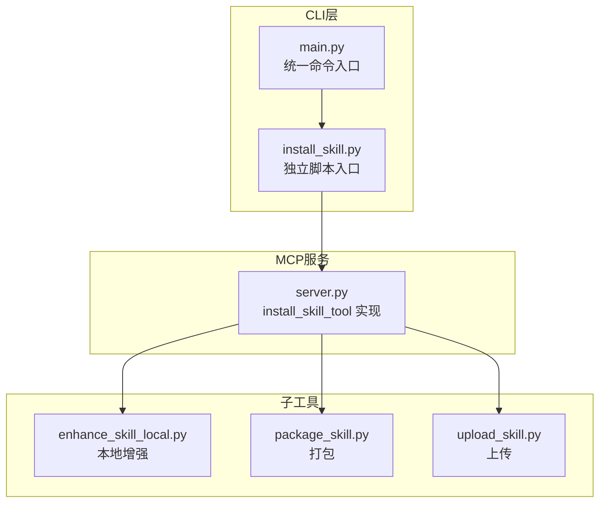
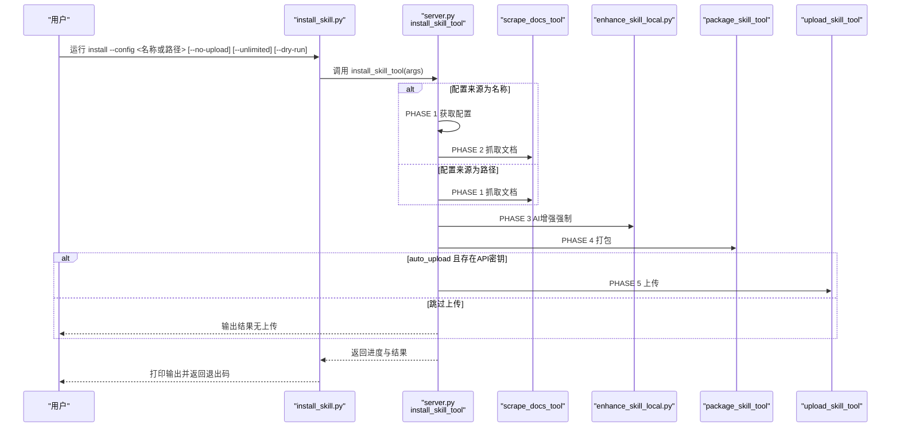
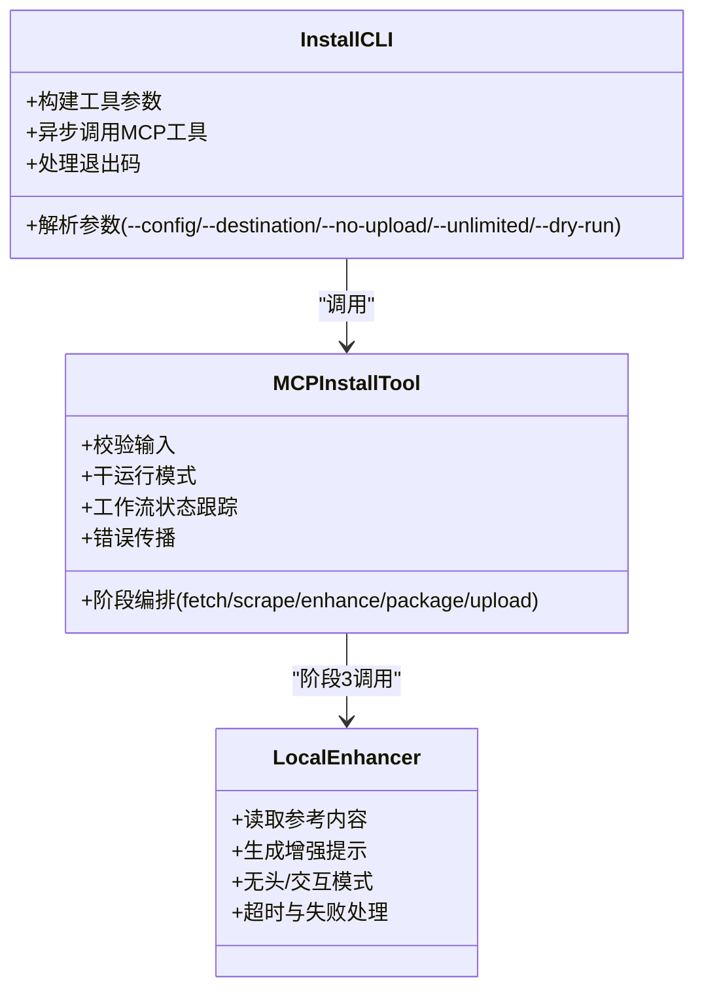
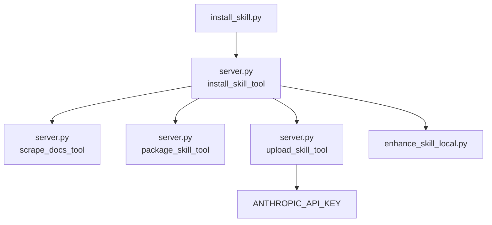

# install命令

<cite>
**本文引用的文件**
- [install_skill.py](file://src/skill_seekers/cli/install_skill.py)
- [main.py](file://src/skill_seekers/cli/main.py)
- [server.py](file://src/skill_seekers/mcp/server.py)
- [enhance_skill_local.py](file://src/skill_seekers/cli/enhance_skill_local.py)
- [package_skill.py](file://src/skill_seekers/cli/package_skill.py)
- [upload_skill.py](file://src/skill_seekers/cli/upload_skill.py)
- [README.md](file://README.md)
- [test_install_skill.py](file://tests/test_install_skill.py)
- [test_install_skill_e2e.py](file://tests/test_install_skill_e2e.py)
</cite>

## 目录
1. [简介](#简介)
2. [项目结构](#项目结构)
3. [核心组件](#核心组件)
4. [架构总览](#架构总览)
5. [详细组件分析](#详细组件分析)
6. [依赖关系分析](#依赖关系分析)
7. [性能与可靠性](#性能与可靠性)
8. [故障排查指南](#故障排查指南)
9. [结论](#结论)
10. [附录](#附录)

## 简介
install命令是一站式工作流入口，自动完成“获取配置 → 抓取文档 → AI增强（强制）→ 打包 → 上传”的全流程。它支持两种配置来源：
- 预设名称：从官方API获取配置（如 --config react）
- 自定义路径：直接使用本地配置文件（如 --config configs/custom.json）

关键控制标志：
- --no-upload：跳过自动上传到Claude
- --unlimited：抓取阶段移除页数限制（可能耗时更长）
- --dry-run：预览工作流但不实际执行

AI增强是强制性的，安装流程会以无头模式调用本地增强工具，确保输出质量从3/10提升至9/10。

## 项目结构
install命令位于CLI层，通过统一入口转发到MCP工具实现具体步骤；同时提供独立脚本入口以便直接调用。

图表来源
- [install_skill.py](file://src/skill_seekers/cli/install_skill.py#L1-L154)
- [main.py](file://src/skill_seekers/cli/main.py#L187-L218)
- [server.py](file://src/skill_seekers/mcp/server.py#L1505-L1796)
- [enhance_skill_local.py](file://src/skill_seekers/cli/enhance_skill_local.py#L1-L452)
- [package_skill.py](file://src/skill_seekers/cli/package_skill.py#L1-L221)
- [upload_skill.py](file://src/skill_seekers/cli/upload_skill.py#L1-L176)

章节来源
- [install_skill.py](file://src/skill_seekers/cli/install_skill.py#L1-L154)
- [main.py](file://src/skill_seekers/cli/main.py#L187-L218)

## 核心组件
- CLI入口（独立脚本）：解析参数、判断配置来源（名称或路径）、构建工具参数并调用MCP工具
- 统一入口（命令组）：注册install子命令，将参数转交给独立脚本入口
- MCP工具（install_skill_tool）：编排五阶段工作流，处理错误传播与状态管理
- 子工具：本地增强、打包、上传

章节来源
- [install_skill.py](file://src/skill_seekers/cli/install_skill.py#L41-L153)
- [main.py](file://src/skill_seekers/cli/main.py#L187-L218)
- [server.py](file://src/skill_seekers/mcp/server.py#L1505-L1796)
- [enhance_skill_local.py](file://src/skill_seekers/cli/enhance_skill_local.py#L1-L452)
- [package_skill.py](file://src/skill_seekers/cli/package_skill.py#L1-L221)
- [upload_skill.py](file://src/skill_seekers/cli/upload_skill.py#L1-L176)

## 架构总览
install命令的调用链路如下：

图表来源
- [install_skill.py](file://src/skill_seekers/cli/install_skill.py#L107-L153)
- [server.py](file://src/skill_seekers/mcp/server.py#L1505-L1796)
- [enhance_skill_local.py](file://src/skill_seekers/cli/enhance_skill_local.py#L1-L452)
- [package_skill.py](file://src/skill_seekers/cli/package_skill.py#L1-L221)
- [upload_skill.py](file://src/skill_seekers/cli/upload_skill.py#L1-L176)

## 详细组件分析

### CLI入口（install_skill.py）
- 参数解析
  - --config：支持预设名称（如 react）或自定义路径（如 configs/custom.json）
  - --destination：输出目录，默认 output/
  - --no-upload：禁用自动上传
  - --unlimited：移除抓取页数限制
  - --dry-run：预览模式
- 配置来源判定
  - 若包含 .json 或包含路径分隔符，则视为路径；否则视为预设名称
- 工具参数构建
  - 将上述参数映射为 install_skill_tool 的输入字典
- 异步执行与退出码
  - 使用异步运行工具函数
  - 解析输出文本，若包含失败标记且非“工作流完成”则返回非零退出码
  - 捕获键盘中断与异常，分别返回标准信号码与通用错误码

章节来源
- [install_skill.py](file://src/skill_seekers/cli/install_skill.py#L41-L153)

### 统一入口（main.py）
- 注册install子命令，定义与CLI入口一致的参数集合
- 将参数转交给独立脚本入口，保持行为一致性

章节来源
- [main.py](file://src/skill_seekers/cli/main.py#L187-L218)

### MCP工具（install_skill_tool）
- 输入校验
  - 必须提供 config_name 或 config_path 其中之一，二者不可同时提供
- 干运行（--dry-run）
  - 输出各阶段说明，不执行实际动作
- 工作流状态
  - 记录配置路径、技能名、技能目录、压缩包路径与已完成阶段列表
- 阶段编排
  - 阶段1（可选）：当提供config_name时，先获取配置
  - 阶段2（必经）：抓取文档，支持unlimited模式
  - 阶段3（强制）：本地AI增强（无头模式），超时上限约15分钟
  - 阶段4：打包为.zip，记录输出路径
  - 阶段5（可选）：自动上传到Claude（需设置ANTHROPIC_API_KEY）
- 错误传播
  - 任一阶段失败均终止流程并返回错误信息
  - 包含明确的阶段标识，便于定位问题
- 输出格式
  - 分阶段标题与进度，最终汇总输出路径与可用性提示

章节来源
- [server.py](file://src/skill_seekers/mcp/server.py#L1505-L1796)

### 本地增强（enhance_skill_local.py）
- 增强模式
  - 无API密钥需求，使用本地Claude Code进行增强
  - 默认无头模式（后台运行），也可交互模式打开终端窗口
- 提示生成
  - 读取references目录下的参考内容，结合现有SKILL.md生成增强提示
- 失败处理
  - 文件缺失、超时、命令未找到等场景均有明确提示
- 与install流程集成
  - install流程以无头模式调用，超时上限约15分钟

章节来源
- [enhance_skill_local.py](file://src/skill_seekers/cli/enhance_skill_local.py#L1-L452)
- [server.py](file://src/skill_seekers/mcp/server.py#L1653-L1688)

### 打包（package_skill.py）
- 功能
  - 将技能目录打包为.zip，支持质量检查与自动上传
- 与install集成
  - install流程调用时关闭自动上传，由install统一处理
- 失败处理
  - 质量检查失败时询问是否继续；缺少API键时不阻断，仅提示手动上传

章节来源
- [package_skill.py](file://src/skill_seekers/cli/package_skill.py#L1-L221)
- [server.py](file://src/skill_seekers/mcp/server.py#L1691-L1723)

### 上传（upload_skill.py）
- 功能
  - 通过Anthropic API上传.zip文件
- 与install集成
  - 当auto_upload为真且存在API密钥时，install流程自动调用
- 失败处理
  - 认证失败、格式错误、网络超时等均有明确错误信息

章节来源
- [upload_skill.py](file://src/skill_seekers/cli/upload_skill.py#L1-L176)
- [server.py](file://src/skill_seekers/mcp/server.py#L1725-L1796)

### 类关系图（install相关）

图表来源
- [install_skill.py](file://src/skill_seekers/cli/install_skill.py#L107-L153)
- [server.py](file://src/skill_seekers/mcp/server.py#L1505-L1796)
- [enhance_skill_local.py](file://src/skill_seekers/cli/enhance_skill_local.py#L1-L452)

## 依赖关系分析
- install_skill.py 依赖 MCP工具函数 install_skill_tool
- install_skill_tool 依赖 scrape_docs_tool、package_skill_tool、upload_skill_tool
- install_skill_tool 通过子进程调用 enhance_skill_local.py
- 上传阶段依赖 Anthropic API 密钥环境变量

图表来源
- [install_skill.py](file://src/skill_seekers/cli/install_skill.py#L107-L153)
- [server.py](file://src/skill_seekers/mcp/server.py#L1505-L1796)
- [upload_skill.py](file://src/skill_seekers/cli/upload_skill.py#L1-L176)

章节来源
- [install_skill.py](file://src/skill_seekers/cli/install_skill.py#L107-L153)
- [server.py](file://src/skill_seekers/mcp/server.py#L1505-L1796)
- [upload_skill.py](file://src/skill_seekers/cli/upload_skill.py#L1-L176)

## 性能与可靠性
- 总体时间
  - 抓取阶段为主，通常20-45分钟；增强阶段约30-60秒
- 不同模式
  - --unlimited：抓取所有页面，可能显著增加耗时
  - --dry-run：仅预览，不产生任何副作用
- 可靠性
  - 各阶段失败即终止，避免中间态产物
  - 增强阶段超时上限约15分钟，防止长时间卡死
  - 上传阶段失败不影响已生成的打包产物

[本节为通用指导，无需特定文件引用]

## 故障排查指南
- 常见问题
  - 缺少配置来源：必须提供config_name或config_path之一
  - 抓取失败：检查网络、目标站点可用性与速率限制
  - 增强失败：确认本地Claude Code可用、提示文件生成成功
  - 上传失败：检查ANTHROPIC_API_KEY是否正确设置
- 调试建议
  - 使用--dry-run查看各阶段计划
  - 在增强阶段使用交互模式（本地脚本支持）以观察过程
  - 查看各阶段输出中的阶段标识，快速定位失败点

章节来源
- [server.py](file://src/skill_seekers/mcp/server.py#L1538-L1796)
- [enhance_skill_local.py](file://src/skill_seekers/cli/enhance_skill_local.py#L293-L401)
- [upload_skill.py](file://src/skill_seekers/cli/upload_skill.py#L1-L176)

## 结论
install命令将复杂的多阶段工作流封装为单一入口，通过严格的阶段编排、强制的AI增强与完善的错误传播机制，显著降低了部署门槛与出错概率。配合--dry-run与--unlimited等控制选项，既能满足快速验证，也能覆盖大规模文档场景。在CI/CD中推荐使用--dry-run进行预检，再以--no-upload在流水线中生成产物，最后在发布阶段单独触发上传。

[本节为总结性内容，无需特定文件引用]

## 附录

### CI/CD最佳实践
- 预检阶段
  - 使用--dry-run验证工作流与配置有效性
- 构建阶段
  - 设置ANTHROPIC_API_KEY（如需自动上传）
  - 使用--no-upload生成.zip产物，便于后续审计与签名
- 发布阶段
  - 单独执行上传步骤，确保凭据安全与幂等性
- 团队协作
  - 使用预设名称或团队私有配置源，保证一致性与可复现性

章节来源
- [README.md](file://README.md#L192-L254)
- [test_install_skill.py](file://tests/test_install_skill.py#L166-L209)
- [test_install_skill_e2e.py](file://tests/test_install_skill_e2e.py#L237-L261)

### 与手动分步操作的对比
- 手动分步
  - 需要依次执行抓取、增强、打包、上传，易遗漏环节
  - 缺乏统一的错误传播与状态管理
- install命令
  - 自动化串联各阶段，强制增强，减少人为失误
  - 明确的阶段标识与错误输出，便于定位问题
  - 支持干运行预览，标准化部署流程

章节来源
- [README.md](file://README.md#L192-L254)
- [server.py](file://src/skill_seekers/mcp/server.py#L1505-L1796)