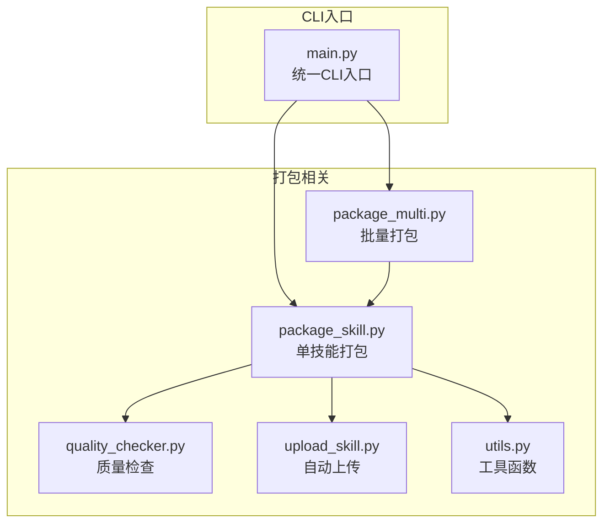
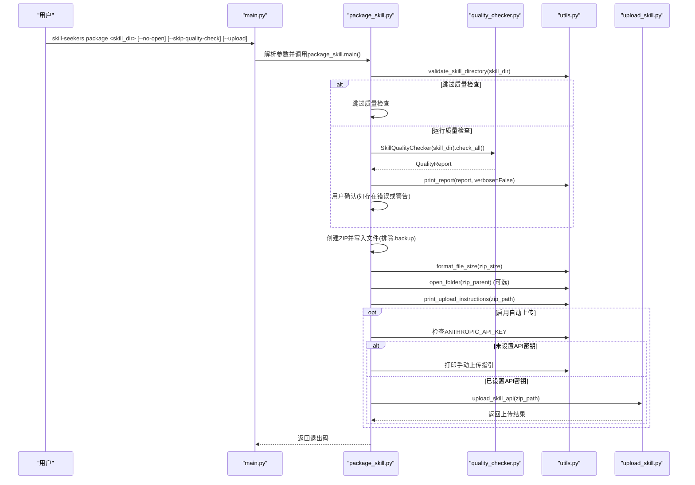
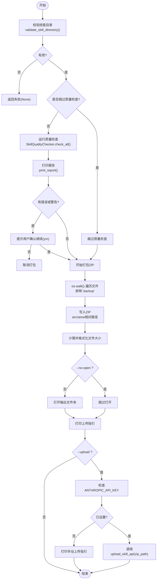
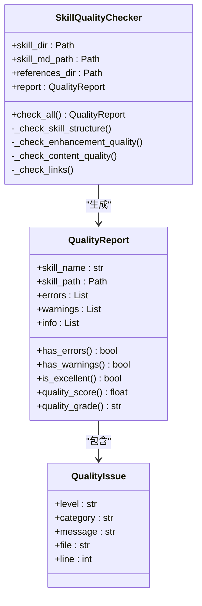
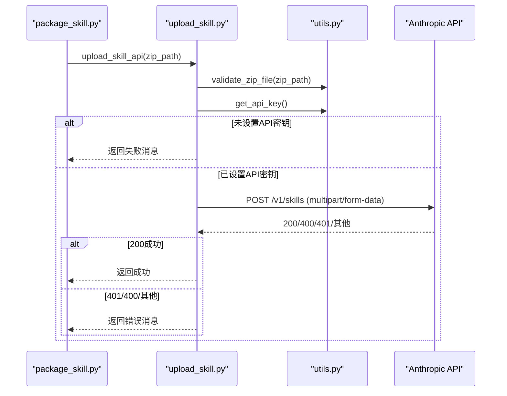
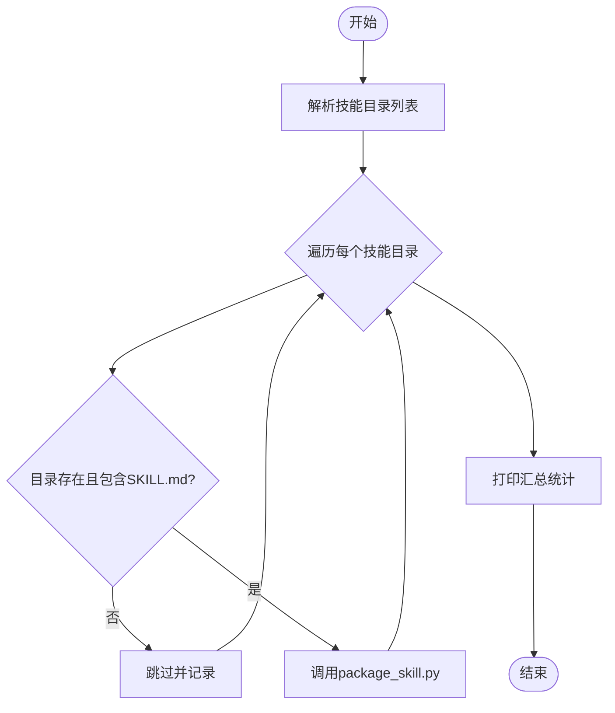
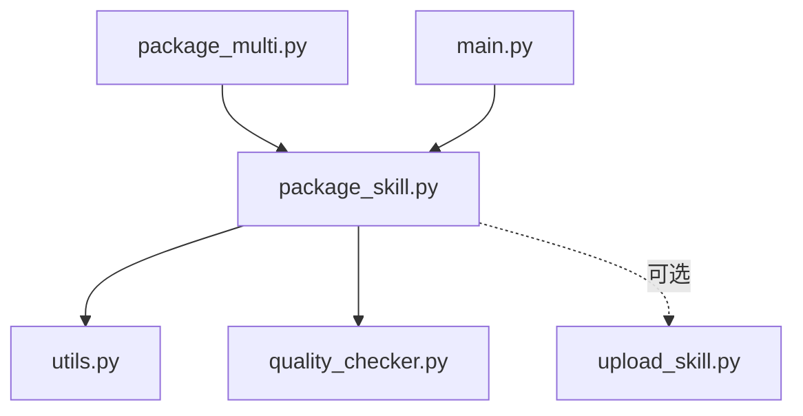

# package命令

<cite>
**本文引用的文件**
- [src/skill_seekers/cli/package_skill.py](file://src/skill_seekers/cli/package_skill.py)
- [src/skill_seekers/cli/package_multi.py](file://src/skill_seekers/cli/package_multi.py)
- [src/skill_seekers/cli/quality_checker.py](file://src/skill_seekers/cli/quality_checker.py)
- [src/skill_seekers/cli/upload_skill.py](file://src/skill_seekers/cli/upload_skill.py)
- [src/skill_seekers/cli/utils.py](file://src/skill_seekers/cli/utils.py)
- [src/skill_seekers/cli/main.py](file://src/skill_seekers/cli/main.py)
- [tests/test_package_skill.py](file://tests/test_package_skill.py)
- [README.md](file://README.md)
</cite>

## 目录
1. [简介](#简介)
2. [项目结构](#项目结构)
3. [核心组件](#核心组件)
4. [架构总览](#架构总览)
5. [详细组件分析](#详细组件分析)
6. [依赖关系分析](#依赖关系分析)
7. [性能考量](#性能考量)
8. [故障排查指南](#故障排查指南)
9. [结论](#结论)
10. [附录](#附录)

## 简介
本文件面向“package命令”，系统性说明其将技能目录打包为Claude可上传.zip文件的能力，并深入解析以下要点：
- 参数行为：--no-open、--skip-quality-check、--upload 的作用与交互
- 自动上传功能与API密钥的集成方式
- 基于package_skill.py的打包流程、质量检查机制（调用quality_checker.py）与输出路径管理
- 引用文件、元数据与资源文件的打包策略
- 与package_multi.py工具的对比，指导单个与批量打包场景的选择

## 项目结构
package命令位于CLI子模块中，采用“统一入口 + 子命令”的设计。核心文件包括：
- package_skill.py：单技能打包与可选自动上传
- package_multi.py：批量打包多个技能
- quality_checker.py：质量检查与报告生成
- upload_skill.py：通过Anthropic API进行自动上传
- utils.py：通用工具（打开文件夹、格式化大小、校验目录/ZIP、打印上传指引等）
- main.py：统一CLI入口，注册并分发到各子命令

图表来源
- [src/skill_seekers/cli/main.py](file://src/skill_seekers/cli/main.py#L133-L151)
- [src/skill_seekers/cli/package_skill.py](file://src/skill_seekers/cli/package_skill.py#L119-L217)
- [src/skill_seekers/cli/package_multi.py](file://src/skill_seekers/cli/package_multi.py#L1-L82)
- [src/skill_seekers/cli/quality_checker.py](file://src/skill_seekers/cli/quality_checker.py#L1-L120)
- [src/skill_seekers/cli/upload_skill.py](file://src/skill_seekers/cli/upload_skill.py#L1-L176)
- [src/skill_seekers/cli/utils.py](file://src/skill_seekers/cli/utils.py#L1-L180)

章节来源
- [src/skill_seekers/cli/main.py](file://src/skill_seekers/cli/main.py#L133-L151)
- [src/skill_seekers/cli/package_skill.py](file://src/skill_seekers/cli/package_skill.py#L119-L217)
- [src/skill_seekers/cli/package_multi.py](file://src/skill_seekers/cli/package_multi.py#L1-L82)
- [src/skill_seekers/cli/quality_checker.py](file://src/skill_seekers/cli/quality_checker.py#L1-L120)
- [src/skill_seekers/cli/upload_skill.py](file://src/skill_seekers/cli/upload_skill.py#L1-L176)
- [src/skill_seekers/cli/utils.py](file://src/skill_seekers/cli/utils.py#L1-L180)

## 核心组件
- 单技能打包器（package_skill.py）
  - 负责：校验技能目录、可选质量检查、创建ZIP、输出路径管理、可选打开文件夹、打印上传指引、可选自动上传
  - 关键流程：validate_skill_directory → 可选质量检查 → 打包ZIP → 输出大小与路径 → 可选打开文件夹 → 可选自动上传
- 质量检查器（quality_checker.py）
  - 负责：结构检查、增强质量检查、内容质量检查、链接有效性检查，生成报告
- 自动上传器（upload_skill.py）
  - 负责：读取ZIP、校验ZIP、获取API密钥、调用Anthropic API上传、处理响应与错误
- 工具集（utils.py）
  - 负责：打开文件夹、格式化文件大小、校验技能目录与ZIP、打印上传指引、获取API密钥等
- 批量打包器（package_multi.py）
  - 负责：遍历多个技能目录，逐一调用package_skill.py进行打包，统计成功/失败数量

章节来源
- [src/skill_seekers/cli/package_skill.py](file://src/skill_seekers/cli/package_skill.py#L39-L117)
- [src/skill_seekers/cli/quality_checker.py](file://src/skill_seekers/cli/quality_checker.py#L94-L130)
- [src/skill_seekers/cli/upload_skill.py](file://src/skill_seekers/cli/upload_skill.py#L39-L129)
- [src/skill_seekers/cli/utils.py](file://src/skill_seekers/cli/utils.py#L20-L180)
- [src/skill_seekers/cli/package_multi.py](file://src/skill_seekers/cli/package_multi.py#L14-L79)

## 架构总览
下面的序列图展示了从CLI入口到打包与可选上传的完整流程，映射到实际源码文件：

图表来源
- [src/skill_seekers/cli/main.py](file://src/skill_seekers/cli/main.py#L133-L151)
- [src/skill_seekers/cli/package_skill.py](file://src/skill_seekers/cli/package_skill.py#L119-L217)
- [src/skill_seekers/cli/quality_checker.py](file://src/skill_seekers/cli/quality_checker.py#L111-L130)
- [src/skill_seekers/cli/utils.py](file://src/skill_seekers/cli/utils.py#L20-L114)
- [src/skill_seekers/cli/upload_skill.py](file://src/skill_seekers/cli/upload_skill.py#L39-L129)

## 详细组件分析

### 单技能打包器（package_skill.py）
- 功能职责
  - 校验技能目录合法性（必须包含SKILL.md）
  - 可选质量检查（调用SkillQualityChecker并打印报告）
  - 打包ZIP：递归遍历技能目录，写入文件，排除以“.backup”结尾的文件
  - 输出路径管理：在父目录生成与技能名同名的.zip文件
  - 可选打开文件夹、打印上传指引
  - 可选自动上传：检测ANTHROPIC_API_KEY后调用upload_skill_api
- 关键参数
  - --no-open：不打开输出文件夹
  - --skip-quality-check：跳过质量检查
  - --upload：自动上传到Claude（需设置ANTHROPIC_API_KEY）

图表来源
- [src/skill_seekers/cli/package_skill.py](file://src/skill_seekers/cli/package_skill.py#L39-L117)
- [src/skill_seekers/cli/utils.py](file://src/skill_seekers/cli/utils.py#L133-L180)

章节来源
- [src/skill_seekers/cli/package_skill.py](file://src/skill_seekers/cli/package_skill.py#L39-L117)
- [src/skill_seekers/cli/utils.py](file://src/skill_seekers/cli/utils.py#L133-L180)

### 质量检查器（quality_checker.py）
- 结构检查：确保SKILL.md存在；references目录存在且非空（警告）
- 增强质量检查：检测模板占位符、统计代码示例与章节数量，给出警告/信息
- 内容质量检查：YAML frontmatter校验、语言标签缺失、缺少“何时使用”章节、引用文件存在但未被提及
- 链接检查：内部Markdown链接有效性（排除http/https与锚点）
- 报告生成：包含错误、警告、信息，计算质量分数与等级

图表来源
- [src/skill_seekers/cli/quality_checker.py](file://src/skill_seekers/cli/quality_checker.py#L19-L130)

章节来源
- [src/skill_seekers/cli/quality_checker.py](file://src/skill_seekers/cli/quality_checker.py#L19-L130)
- [src/skill_seekers/cli/quality_checker.py](file://src/skill_seekers/cli/quality_checker.py#L131-L417)

### 自动上传器（upload_skill.py）
- 依赖：requests库
- 流程：校验ZIP → 获取API密钥 → 组装请求头（含anthropic版本与beta头）→ 上传ZIP → 处理响应（200成功、401认证失败、400格式错误、超时/连接错误等）
- 错误处理：对不同HTTP状态与异常进行明确提示

图表来源
- [src/skill_seekers/cli/upload_skill.py](file://src/skill_seekers/cli/upload_skill.py#L39-L129)
- [src/skill_seekers/cli/utils.py](file://src/skill_seekers/cli/utils.py#L60-L114)

章节来源
- [src/skill_seekers/cli/upload_skill.py](file://src/skill_seekers/cli/upload_skill.py#L39-L129)
- [src/skill_seekers/cli/utils.py](file://src/skill_seekers/cli/utils.py#L60-L114)

### 工具集（utils.py）
- open_folder：跨平台打开文件夹（Linux: xdg-open；macOS: open；Windows: explorer）
- format_file_size：人类可读的文件大小格式化
- validate_skill_directory：校验目录存在、为目录、包含SKILL.md
- validate_zip_file：校验文件存在、为文件、后缀为.zip
- print_upload_instructions：打印手动上传指引（URL、步骤）
- get_api_key/has_api_key：获取/判断API密钥是否存在

章节来源
- [src/skill_seekers/cli/utils.py](file://src/skill_seekers/cli/utils.py#L20-L180)

### 批量打包器（package_multi.py）
- 逐个调用package_skill.py进行打包
- 对每个技能目录执行存在性与SKILL.md存在性检查
- 统计成功/失败数量并汇总

图表来源
- [src/skill_seekers/cli/package_multi.py](file://src/skill_seekers/cli/package_multi.py#L14-L79)

章节来源
- [src/skill_seekers/cli/package_multi.py](file://src/skill_seekers/cli/package_multi.py#L14-L79)

## 依赖关系分析
- package_skill.py依赖：
  - utils.py：目录校验、打开文件夹、格式化大小、打印上传指引、API密钥检查
  - quality_checker.py：质量检查与报告
  - upload_skill.py：自动上传（仅在启用--upload时导入）
- package_multi.py依赖：
  - subprocess调用package_skill.py，实现批量执行
- main.py作为统一入口，将--no-open/--upload参数透传给package_skill.py

图表来源
- [src/skill_seekers/cli/package_skill.py](file://src/skill_seekers/cli/package_skill.py#L119-L217)
- [src/skill_seekers/cli/package_multi.py](file://src/skill_seekers/cli/package_multi.py#L14-L26)
- [src/skill_seekers/cli/main.py](file://src/skill_seekers/cli/main.py#L133-L151)

章节来源
- [src/skill_seekers/cli/package_skill.py](file://src/skill_seekers/cli/package_skill.py#L119-L217)
- [src/skill_seekers/cli/package_multi.py](file://src/skill_seekers/cli/package_multi.py#L14-L26)
- [src/skill_seekers/cli/main.py](file://src/skill_seekers/cli/main.py#L133-L151)

## 性能考量
- ZIP打包：使用递归遍历与相对路径写入，避免重复层级；排除“.backup”文件减少冗余
- 质量检查：正则匹配与文件读取，建议在大型技能上谨慎使用质量检查（可通过--skip-quality-check加速）
- 自动上传：依赖requests库，网络超时/连接错误会显式提示；建议在网络稳定时使用
- 批量打包：package_multi.py通过子进程调用package_skill.py，适合多技能并行打包场景

[本节为通用性能讨论，无需特定文件分析]

## 故障排查指南
- 目录不存在或非目录
  - 现象：直接返回失败
  - 排查：确认路径存在且为目录，目录内包含SKILL.md
  - 参考：validate_skill_directory
- 质量检查触发用户取消
  - 现象：出现错误或警告时提示确认，若用户输入非y则取消
  - 排查：根据报告调整内容或使用--skip-quality-check
  - 参考：package_skill.py中的确认逻辑
- ZIP未生成或为空
  - 现象：打包后无.zip或大小为0
  - 排查：确认技能目录包含有效文件；检查是否有“.backup”文件被排除
  - 参考：ZIP写入与过滤逻辑
- 自动上传失败
  - 现象：401认证失败、400格式错误、超时/连接错误
  - 排查：检查ANTHROPIC_API_KEY是否正确设置；网络连通性；ZIP格式是否有效
  - 参考：upload_skill.py的响应处理
- 手动上传指引
  - 现象：未设置API密钥或上传失败时显示手动上传步骤
  - 参考：utils.py中的print_upload_instructions

章节来源
- [src/skill_seekers/cli/package_skill.py](file://src/skill_seekers/cli/package_skill.py#L39-L117)
- [src/skill_seekers/cli/utils.py](file://src/skill_seekers/cli/utils.py#L133-L180)
- [src/skill_seekers/cli/upload_skill.py](file://src/skill_seekers/cli/upload_skill.py#L90-L129)

## 结论
- package命令提供了从技能目录到Claude可上传.zip的完整链路，支持质量检查、自动上传与手动上传两种模式
- --no-open用于自动化流水线；--skip-quality-check用于加速；--upload用于一键上传（需设置ANTHROPIC_API_KEY）
- 对于多技能场景，推荐使用package_multi.py进行批量打包
- 质量检查与上传均具备完善的错误处理与用户提示，便于在不同环境下稳定使用

[本节为总结性内容，无需特定文件分析]

## 附录

### 参数说明与行为
- --no-open
  - 行为：打包完成后不自动打开输出文件夹
  - 实现位置：package_skill.py中将open_folder_after设为False
- --skip-quality-check
  - 行为：跳过质量检查，直接进入打包流程
  - 实现位置：package_skill.py中根据参数决定是否运行质量检查
- --upload
  - 行为：打包完成后尝试自动上传至Claude
  - 实现位置：package_skill.py中检测ANTHROPIC_API_KEY并调用upload_skill_api
  - API密钥集成：通过环境变量ANTHROPIC_API_KEY传递；upload_skill.py负责校验与请求

章节来源
- [src/skill_seekers/cli/package_skill.py](file://src/skill_seekers/cli/package_skill.py#L147-L164)
- [src/skill_seekers/cli/package_skill.py](file://src/skill_seekers/cli/package_skill.py#L176-L217)
- [src/skill_seekers/cli/upload_skill.py](file://src/skill_seekers/cli/upload_skill.py#L60-L129)
- [src/skill_seekers/cli/utils.py](file://src/skill_seekers/cli/utils.py#L60-L80)

### 打包流程与输出路径
- 打包流程
  - 校验技能目录 → 可选质量检查 → 递归写入ZIP（排除.backup） → 计算大小 → 可选打开文件夹 → 打印上传指引
- 输出路径
  - 在技能目录的父目录生成与技能名同名的.zip文件，便于直接上传

章节来源
- [src/skill_seekers/cli/package_skill.py](file://src/skill_seekers/cli/package_skill.py#L83-L117)
- [src/skill_seekers/cli/utils.py](file://src/skill_seekers/cli/utils.py#L133-L180)

### 引用文件、元数据与资源文件的打包
- 引用文件：references目录下的所有.md文件（包含子目录）都会被打包进ZIP
- 元数据：SKILL.md作为核心元数据文件，质量检查器会对其YAML frontmatter、章节与引用情况进行验证
- 资源文件：除references外，技能目录下其他文件（如scripts、assets等）也会被打包进ZIP

章节来源
- [src/skill_seekers/cli/quality_checker.py](file://src/skill_seekers/cli/quality_checker.py#L131-L155)
- [src/skill_seekers/cli/quality_checker.py](file://src/skill_seekers/cli/quality_checker.py#L299-L321)
- [tests/test_package_skill.py](file://tests/test_package_skill.py#L53-L73)

### 与package_multi.py的对比与选择
- 单个技能：使用skill-seekers package <skill_dir>，适合一次性打包一个技能
- 批量技能：使用python3 package_multi.py <skill_dir...>，适合同时打包多个技能（如router+sub-skills）
- 选择建议：
  - 单次任务：优先使用package命令
  - 多技能并行：使用package_multi.py，或在CI中循环调用package命令

章节来源
- [src/skill_seekers/cli/package_multi.py](file://src/skill_seekers/cli/package_multi.py#L14-L79)
- [README.md](file://README.md#L648-L694)