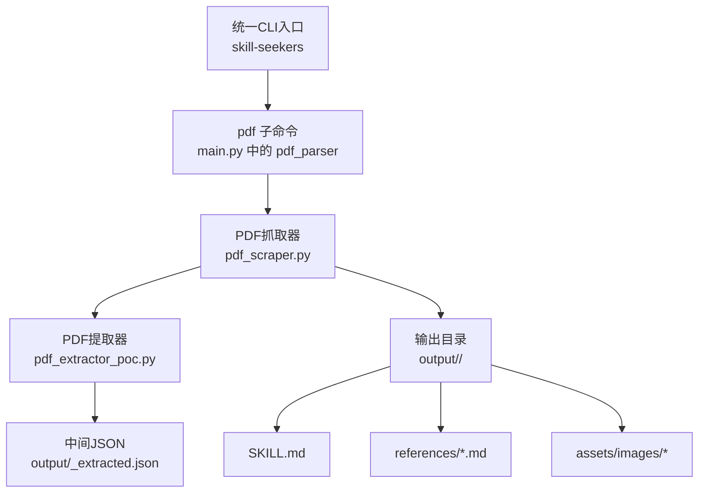
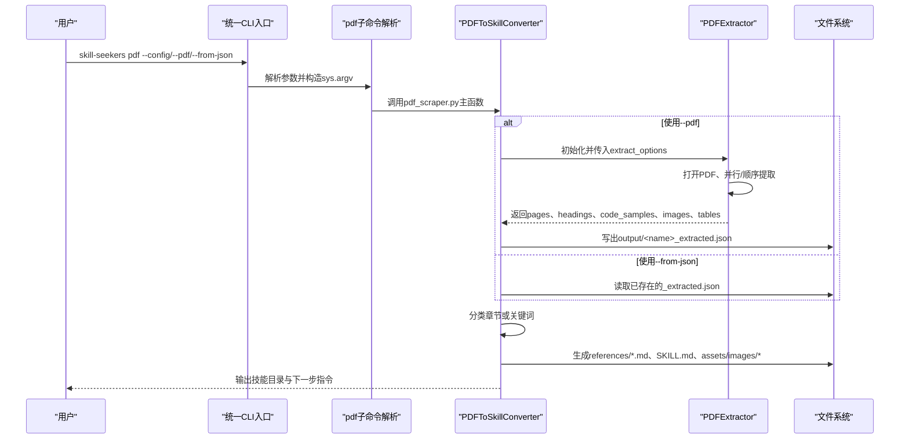
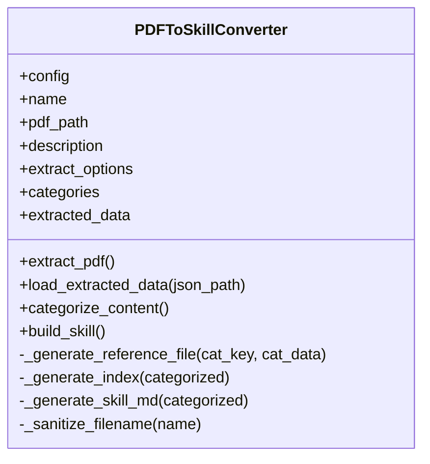
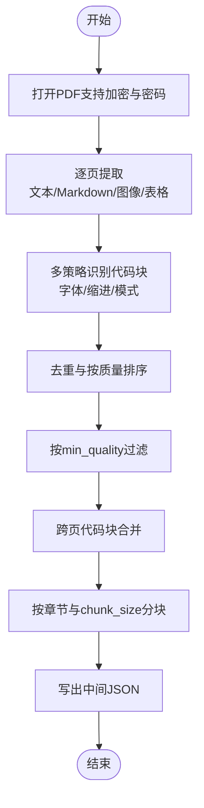
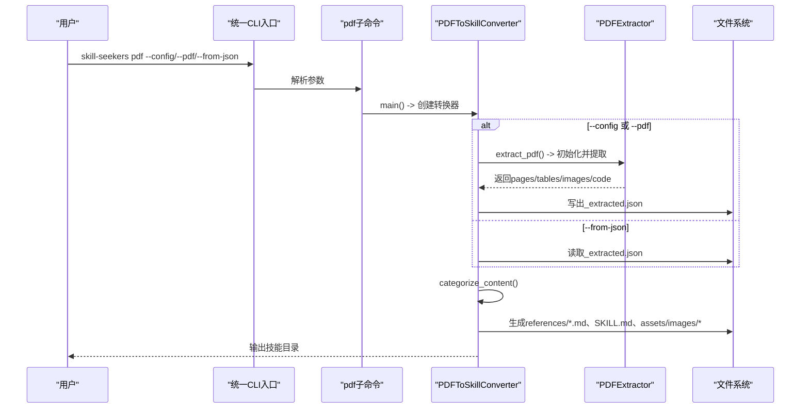
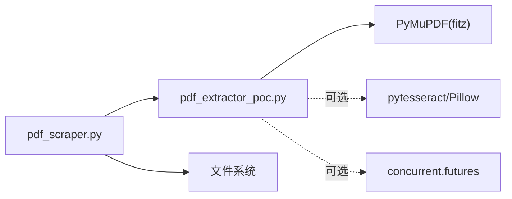

# pdf命令

<cite>
**本文引用的文件**
- [pdf_scraper.py](file://src/skill_seekers/cli/pdf_scraper.py)
- [main.py](file://src/skill_seekers/cli/main.py)
- [pdf_extractor_poc.py](file://src/skill_seekers/cli/pdf_extractor_poc.py)
- [example_pdf.json](file://configs/example_pdf.json)
- [PDF_SCRAPER.md](file://docs/PDF_SCRAPER.md)
- [PDF_CHUNKING.md](file://docs/PDF_CHUNKING.md)
- [PDF_IMAGE_EXTRACTION.md](file://docs/PDF_IMAGE_EXTRACTION.md)
- [test_pdf_scraper.py](file://tests/test_pdf_scraper.py)
</cite>

## 目录
1. [简介](#简介)
2. [项目结构](#项目结构)
3. [核心组件](#核心组件)
4. [架构总览](#架构总览)
5. [详细组件分析](#详细组件分析)
6. [依赖关系分析](#依赖关系分析)
7. [性能考量](#性能考量)
8. [故障排查指南](#故障排查指南)
9. [结论](#结论)
10. [附录](#附录)

## 简介
本文件系统化说明“pdf命令”的完整能力：从PDF文件提取内容并构建为Claude AI技能。重点覆盖以下方面：
- 命令行参数：--pdf、--config、--from-json 的使用场景与差异
- 基于PDFToSkillConverter类的工作流程：从PDF到技能的端到端转换
- 配置文件中的extract_options关键参数（chunk_size、min_quality等）对提取质量与性能的影响
- 使用PyMuPDF进行文本提取、代码块识别、图像提取与表格处理的技术细节
- 大型PDF文档的最佳实践与通过--from-json实现的分阶段处理策略

## 项目结构
pdf命令位于统一CLI入口下，作为子命令运行；其核心逻辑由pdf_scraper.py实现，底层依赖pdf_extractor_poc.py完成PDF内容抽取。

图表来源
- [main.py](file://src/skill_seekers/cli/main.py#L103-L114)
- [pdf_scraper.py](file://src/skill_seekers/cli/pdf_scraper.py#L339-L401)
- [pdf_extractor_poc.py](file://src/skill_seekers/cli/pdf_extractor_poc.py#L828-L900)

章节来源
- [main.py](file://src/skill_seekers/cli/main.py#L103-L114)
- [pdf_scraper.py](file://src/skill_seekers/cli/pdf_scraper.py#L339-L401)

## 核心组件
- 统一CLI入口：在main.py中定义pdf子命令，接收--config、--pdf、--name、--description、--from-json等参数，并转发给pdf_scraper.py执行。
- PDFToSkillConverter：负责从PDF提取数据或从已有的JSON加载数据，进行分类与技能结构生成。
- PDFExtractor：基于PyMuPDF的底层提取器，支持文本、代码块、图像、表格、章节检测、并行处理、缓存等高级特性。

章节来源
- [main.py](file://src/skill_seekers/cli/main.py#L103-L114)
- [pdf_scraper.py](file://src/skill_seekers/cli/pdf_scraper.py#L25-L200)
- [pdf_extractor_poc.py](file://src/skill_seekers/cli/pdf_extractor_poc.py#L84-L200)

## 架构总览
pdf命令的调用链路如下：

图表来源
- [main.py](file://src/skill_seekers/cli/main.py#L279-L292)
- [pdf_scraper.py](file://src/skill_seekers/cli/pdf_scraper.py#L339-L401)
- [pdf_extractor_poc.py](file://src/skill_seekers/cli/pdf_extractor_poc.py#L828-L900)

## 详细组件分析

### 参数与使用模式
- --config
  - 指向一个JSON配置文件，包含name、description、pdf_path、extract_options、categories等字段。推荐用于复杂场景与可重复工作流。
  - 示例配置参考：configs/example_pdf.json。
- --pdf
  - 直接指定PDF路径，配合--name（必填）、--description（可选）快速生成技能。
  - 默认extract_options包含chunk_size、min_quality、extract_images、min_image_size等。
- --from-json
  - 从先前保存的_extracted.json构建技能，跳过PDF提取步骤，适合迭代优化技能结构时使用。
  - 当使用该模式时，程序会自动推断技能名并加载JSON，然后直接进入构建阶段。

章节来源
- [pdf_scraper.py](file://src/skill_seekers/cli/pdf_scraper.py#L339-L401)
- [PDF_SCRAPER.md](file://docs/PDF_SCRAPER.md#L42-L128)
- [example_pdf.json](file://configs/example_pdf.json#L1-L18)

### PDFToSkillConverter类
- 初始化与路径
  - 从配置读取name、pdf_path、description、extract_options、categories等。
  - 输出目录为output/<name>，中间JSON保存为output/<name>_extracted.json。
- 提取PDF
  - 基于PDFExtractor进行提取，传入chunk_size、min_quality、extract_images、image_dir、min_image_size等选项。
  - 成功后写入JSON并记录extracted_data。
- 加载JSON
  - 从--from-json提供的路径读取已提取的数据，便于快速迭代。
- 内容分类
  - 若存在chapters，则按章节分配页面；
  - 否则根据categories中的关键词匹配页面，若无匹配则归入other；
  - 若未提供categories，则默认创建单个content类别。
- 技能构建
  - 创建references、scripts、assets目录；
  - 生成各分类的reference文件（含标题、文本、代码示例、图片引用）；
  - 生成references/index.md统计信息；
  - 生成SKILL.md，包含名称、描述、使用场景、包含内容、快速参考、导航与语言统计等。

图表来源
- [pdf_scraper.py](file://src/skill_seekers/cli/pdf_scraper.py#L25-L200)

章节来源
- [pdf_scraper.py](file://src/skill_seekers/cli/pdf_scraper.py#L25-L200)

### PDFExtractor（PyMuPDF）技术细节
- 文本提取
  - 支持普通文本与markdown格式提取；
  - 对扫描版PDF可启用OCR（需安装pytesseract与Pillow），当页面文本过少时触发。
- 代码块识别
  - 多策略融合：基于字体特征、缩进、正则模式识别；
  - 去重与质量排序：按质量分数降序，过滤低于min_quality的代码块；
  - 跨页合并：对续写式代码块进行合并，提升上下文完整性。
- 图像提取
  - 可选择是否导出图像至磁盘，支持最小尺寸过滤；
  - 记录每张图的元数据（宽高、格式、大小、所在页等）。
- 表格处理
  - 使用PyMuPDF内置表检测接口，返回行列矩阵与边界框等信息。
- 并行与缓存
  - 可开启多线程并行处理页面（CPU密集型任务）；
  - 支持缓存昂贵操作结果以减少重复计算。
- 章节与分块
  - 自动检测章节起始并按chunk_size进行分块，尊重章节边界，便于后续处理与展示。

图表来源
- [pdf_extractor_poc.py](file://src/skill_seekers/cli/pdf_extractor_poc.py#L828-L900)
- [pdf_extractor_poc.py](file://src/skill_seekers/cli/pdf_extractor_poc.py#L594-L665)
- [pdf_extractor_poc.py](file://src/skill_seekers/cli/pdf_extractor_poc.py#L730-L827)
- [PDF_CHUNKING.md](file://docs/PDF_CHUNKING.md#L218-L292)

章节来源
- [pdf_extractor_poc.py](file://src/skill_seekers/cli/pdf_extractor_poc.py#L84-L200)
- [pdf_extractor_poc.py](file://src/skill_seekers/cli/pdf_extractor_poc.py#L594-L665)
- [pdf_extractor_poc.py](file://src/skill_seekers/cli/pdf_extractor_poc.py#L730-L827)
- [PDF_CHUNKING.md](file://docs/PDF_CHUNKING.md#L218-L292)

### 配置文件与extract_options详解
- name（必需）
  - 技能标识符，用于输出目录与文件命名。
- description（可选）
  - SKILL.md中的描述，说明何时使用该技能。
- pdf_path（可选）
  - 当使用--config时必须提供；当使用--pdf时由命令行参数提供。
- extract_options（可选）
  - chunk_size：分块大小（页数），0表示不分块；较大值可提升性能但可能降低章节检测精度。
  - min_quality：最低代码质量阈值（0-10），过滤低质量代码块。
  - extract_images：是否导出图像到assets/images。
  - min_image_size：图像最小尺寸（像素），过滤小图标等噪声。
- categories（可选）
  - 关键词分类映射，用于关键词驱动的内容分类；若未提供则尝试章节分类。

章节来源
- [example_pdf.json](file://configs/example_pdf.json#L1-L18)
- [PDF_SCRAPER.md](file://docs/PDF_SCRAPER.md#L131-L212)
- [pdf_scraper.py](file://src/skill_seekers/cli/pdf_scraper.py#L47-L76)

### 从PDF到技能的完整流程
- 模式A：--config
  - 读取配置，初始化PDFToSkillConverter；
  - 调用extract_pdf，内部使用PDFExtractor提取并写出中间JSON；
  - 进入build_skill，生成references、SKILL.md与assets。
- 模式B：--pdf
  - 以命令行参数构建最小配置（包含pdf_path与默认extract_options）；
  - 其余流程同上。
- 模式C：--from-json
  - 直接加载_extracted.json，跳过PDF提取；
  - 进入build_skill，生成技能结构。

图表来源
- [main.py](file://src/skill_seekers/cli/main.py#L279-L292)
- [pdf_scraper.py](file://src/skill_seekers/cli/pdf_scraper.py#L339-L401)
- [pdf_extractor_poc.py](file://src/skill_seekers/cli/pdf_extractor_poc.py#L828-L900)

章节来源
- [pdf_scraper.py](file://src/skill_seekers/cli/pdf_scraper.py#L339-L401)
- [PDF_SCRAPER.md](file://docs/PDF_SCRAPER.md#L42-L128)

### 大型PDF文档最佳实践
- 使用--from-json实现分阶段处理
  - 第一步：使用pdf_extractor_poc.py提取并保存JSON，得到稳定的中间产物；
  - 第二步：多次使用pdf_scraper.py --from-json迭代技能结构（分类、引用文件、索引、SKILL.md），无需重复耗时的PDF提取。
- 调整chunk_size
  - 较大chunk_size可减少章节检测误差，但会增加内存占用；
  - 较小chunk_size更利于章节检测，但可能产生更多碎片。
- 过滤策略
  - 提升min_quality以减少低质量代码块；
  - 提升min_image_size以减少小图标与噪声图像。
- 并行与缓存
  - 在具备足够CPU资源时启用并行处理；
  - 利用缓存减少重复计算，提高迭代效率。

章节来源
- [PDF_SCRAPER.md](file://docs/PDF_SCRAPER.md#L407-L434)
- [PDF_CHUNKING.md](file://docs/PDF_CHUNKING.md#L294-L312)
- [PDF_IMAGE_EXTRACTION.md](file://docs/PDF_IMAGE_EXTRACTION.md#L102-L132)

### 测试与验证要点
- 单元测试覆盖了：
  - 初始化与配置校验；
  - 关键字与章节两种分类方式；
  - 技能结构生成（目录、references、SKILL.md）；
  - 代码块与图像的引用与优先级；
  - 从JSON加载与构建流程；
  - 错误处理（缺失PDF、无效配置等）。
- 建议在本地运行测试以确保环境满足依赖（PyMuPDF）。

章节来源
- [test_pdf_scraper.py](file://tests/test_pdf_scraper.py#L1-L603)

## 依赖关系分析
- 组件耦合
  - pdf_scraper.py强依赖pdf_extractor_poc.py提供的提取能力；
  - 通过中间JSON解耦：--from-json模式完全绕过PDFExtractor，仅依赖已生成的JSON。
- 外部依赖
  - PyMuPDF（fitz）：PDF读取与文本/图像/表格提取；
  - 可选：pytesseract、Pillow（OCR）、concurrent.futures（并行）。

图表来源
- [pdf_scraper.py](file://src/skill_seekers/cli/pdf_scraper.py#L21-L23)
- [pdf_extractor_poc.py](file://src/skill_seekers/cli/pdf_extractor_poc.py#L58-L82)

章节来源
- [pdf_scraper.py](file://src/skill_seekers/cli/pdf_scraper.py#L21-L23)
- [pdf_extractor_poc.py](file://src/skill_seekers/cli/pdf_extractor_poc.py#L58-L82)

## 性能考量
- 提取阶段（PDF→JSON）CPU密集，建议：
  - 合理设置chunk_size，平衡章节检测与性能；
  - 使用并行处理（多核CPU）；
  - 启用缓存以避免重复计算。
- 构建阶段（JSON→技能）I/O密集，通常较快；
- 图像提取可能显著增大输出体积，建议：
  - 提升min_image_size以减少小图；
  - 控制extract_images开关；
  - 使用--from-json迭代结构，避免重复导出图像。

章节来源
- [PDF_SCRAPER.md](file://docs/PDF_SCRAPER.md#L407-L434)
- [PDF_IMAGE_EXTRACTION.md](file://docs/PDF_IMAGE_EXTRACTION.md#L384-L407)

## 故障排查指南
- 无法找到PDF或权限问题
  - 确认路径正确且有读取权限；加密PDF需提供密码。
- 未指定必要参数
  - --config、--pdf、--from-json三者至少提供其一；
  - 使用--pdf时必须提供--name。
- 无分类或分类异常
  - 若PDF无章节结构，可提供categories进行关键词分类；
  - 检查关键词是否与内容匹配。
- 低质量代码块过多
  - 提高min_quality阈值。
- 图像未导出
  - 确认extract_images为true，并检查min_image_size；
  - 确保输出目录可写。
- 大文件内存不足
  - 使用--from-json分阶段处理；
  - 调整chunk_size与min_image_size。

章节来源
- [pdf_scraper.py](file://src/skill_seekers/cli/pdf_scraper.py#L339-L401)
- [PDF_SCRAPER.md](file://docs/PDF_SCRAPER.md#L501-L548)
- [PDF_IMAGE_EXTRACTION.md](file://docs/PDF_IMAGE_EXTRACTION.md#L384-L407)

## 结论
pdf命令提供了从PDF到Claude技能的完整工作流：统一CLI入口、灵活的参数模式（--config、--pdf、--from-json）、强大的底层提取能力（PyMuPDF）与完善的技能构建逻辑。通过中间JSON与分阶段处理，既能保证高质量输出，又能显著提升迭代效率。合理配置extract_options（尤其是chunk_size、min_quality、extract_images、min_image_size）是获得稳定性能与良好结果的关键。

## 附录
- 快速参考
  - --config：推荐用于正式项目与可重复工作流；
  - --pdf：快速生成技能，适合一次性转换；
  - --from-json：迭代优化技能结构，避免重复提取。
- 输出结构
  - output/<name>/：包含SKILL.md、references/、scripts/、assets/images/等。

章节来源
- [PDF_SCRAPER.md](file://docs/PDF_SCRAPER.md#L214-L234)