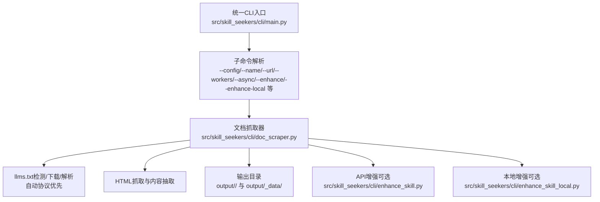
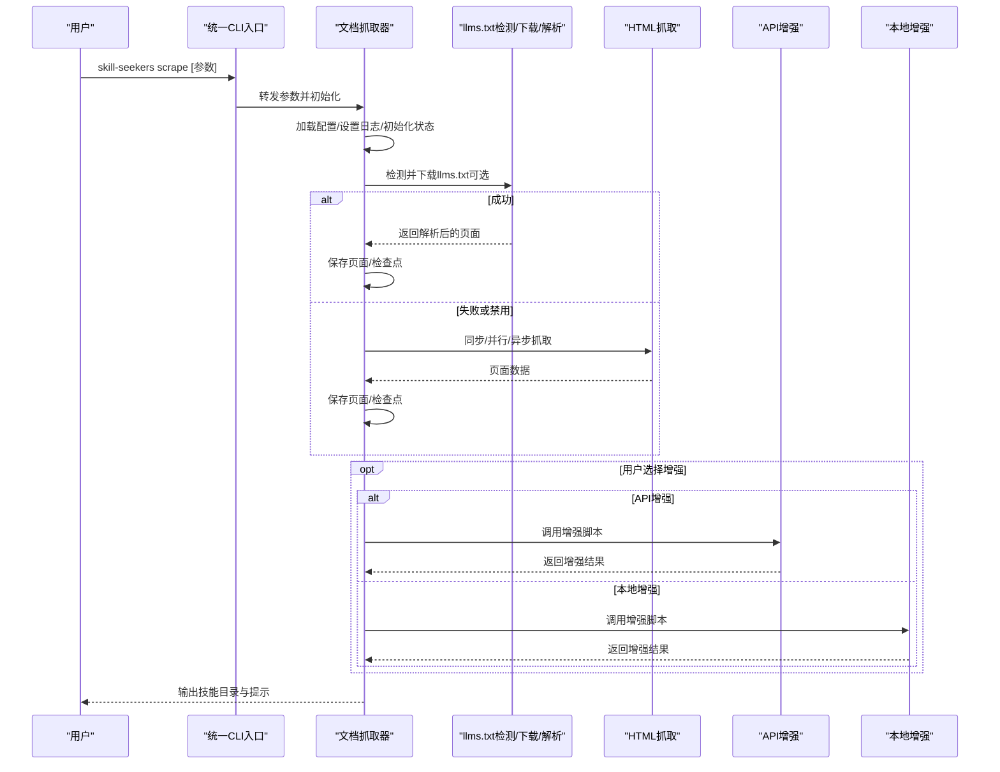
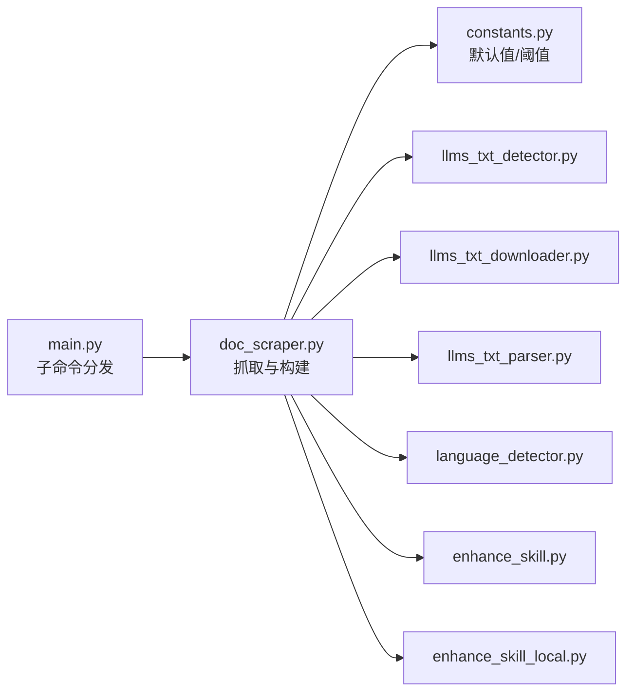

# scrape命令

<cite>
**本文引用的文件**
- [src/skill_seekers/cli/main.py](file://src/skill_seekers/cli/main.py)
- [src/skill_seekers/cli/doc_scraper.py](file://src/skill_seekers/cli/doc_scraper.py)
- [src/skill_seekers/cli/enhance_skill.py](file://src/skill_seekers/cli/enhance_skill.py)
- [src/skill_seekers/cli/enhance_skill_local.py](file://src/skill_seekers/cli/enhance_skill_local.py)
- [src/skill_seekers/cli/constants.py](file://src/skill_seekers/cli/constants.py)
- [configs/react.json](file://configs/react.json)
- [docs/LLMS_TXT_SUPPORT.md](file://docs/LLMS_TXT_SUPPORT.md)
- [docs/ENHANCEMENT.md](file://docs/ENHANCEMENT.md)
- [tests/test_parallel_scraping.py](file://tests/test_parallel_scraping.py)
- [tests/test_llms_txt_detector.py](file://tests/test_llms_txt_detector.py)
</cite>

## 目录
1. [简介](#简介)
2. [项目结构](#项目结构)
3. [核心组件](#核心组件)
4. [架构总览](#架构总览)
5. [详细组件分析](#详细组件分析)
6. [依赖关系分析](#依赖关系分析)
7. [性能考虑](#性能考虑)
8. [故障排查指南](#故障排查指南)
9. [结论](#结论)
10. [附录：常用示例与最佳实践](#附录常用示例与最佳实践)

## 简介
scrape命令用于抓取文档网站并生成Claude AI技能。它支持：
- 加载配置文件（JSON）或通过交互式向导/命令行快速模式构建配置
- 自动检测并优先使用llms.txt协议（若存在），否则回退到HTML抓取
- 并行抓取（线程/异步两种模式），可配置工作线程数与速率限制
- 可选的AI增强（本地或API两种方式），在生成SKILL.md时提取高质量示例与导航指引
- 检查点与恢复、干运行预览、无限模式等高级特性

本节不直接分析具体文件，故无“章节来源”。

## 项目结构
scrape命令由统一CLI入口分发至doc_scraper模块执行；同时提供增强脚本以提升生成的SKILL.md质量。

图表来源
- [src/skill_seekers/cli/main.py](file://src/skill_seekers/cli/main.py#L75-L100)
- [src/skill_seekers/cli/doc_scraper.py](file://src/skill_seekers/cli/doc_scraper.py#L561-L720)
- [src/skill_seekers/cli/enhance_skill.py](file://src/skill_seekers/cli/enhance_skill.py#L1-L120)
- [src/skill_seekers/cli/enhance_skill_local.py](file://src/skill_seekers/cli/enhance_skill_local.py#L1-L120)

章节来源
- [src/skill_seekers/cli/main.py](file://src/skill_seekers/cli/main.py#L75-L100)
- [src/skill_seekers/cli/doc_scraper.py](file://src/skill_seekers/cli/doc_scraper.py#L561-L720)

## 核心组件
- 统一CLI入口负责解析子命令与参数，并将scrape请求转发给doc_scraper主流程
- 文档抓取器DocToSkillConverter负责：
  - 配置加载与校验（JSON/交互/快速模式）
  - llms.txt协议检测与使用（自动/显式URL）
  - HTML抓取与内容抽取（标题、段落、代码块、链接）
  - 并行抓取（线程池/异步HTTPX）
  - 检查点保存与恢复
  - 输出页面数据与技能目录结构
- 增强脚本：
  - API增强：调用Anthropic API生成更优质的SKILL.md
  - 本地增强：通过Claude Code Max在终端中完成增强（无需API密钥）

章节来源
- [src/skill_seekers/cli/main.py](file://src/skill_seekers/cli/main.py#L240-L264)
- [src/skill_seekers/cli/doc_scraper.py](file://src/skill_seekers/cli/doc_scraper.py#L1484-L1559)
- [src/skill_seekers/cli/enhance_skill.py](file://src/skill_seekers/cli/enhance_skill.py#L1-L120)
- [src/skill_seekers/cli/enhance_skill_local.py](file://src/skill_seekers/cli/enhance_skill_local.py#L1-L120)

## 架构总览
scrape命令从CLI入口进入，按以下顺序执行：
1) 参数解析与配置构建
2) 尝试llms.txt协议（若启用且未跳过）
3) 否则执行HTML抓取（同步/并行/异步）
4) 保存页面与检查点
5) 可选：AI增强（API或本地）
6) 输出SKILL.md与参考文档

图表来源
- [src/skill_seekers/cli/main.py](file://src/skill_seekers/cli/main.py#L240-L264)
- [src/skill_seekers/cli/doc_scraper.py](file://src/skill_seekers/cli/doc_scraper.py#L561-L720)
- [src/skill_seekers/cli/enhance_skill.py](file://src/skill_seekers/cli/enhance_skill.py#L196-L274)
- [src/skill_seekers/cli/enhance_skill_local.py](file://src/skill_seekers/cli/enhance_skill_local.py#L403-L452)

## 详细组件分析

### 参数与默认行为
- --config：指定配置文件路径（JSON）。若提供，将从文件加载配置；否则进入交互或快速模式。
- --name：技能名称（与--url配合时可快速构建配置）。
- --url：文档站点URL（与--name配合时可快速构建配置）。
- --description：技能描述（快速模式下可选）。
- --skip-scrape：跳过抓取阶段，直接使用缓存数据（需先有历史抓取产物）。
- --enhance：使用API增强（需要Anthropic API密钥）。
- --enhance-local：使用本地增强（无需API密钥，依赖Claude Code Max）。
- --dry-run：预览模式，不实际抓取，仅展示将要抓取的URL列表。
- --async：启用异步抓取（基于httpx.AsyncClient，性能显著优于线程池）。
- --workers：并发工作线程数（默认1，最大10）。与--async配合效果更佳。

章节来源
- [src/skill_seekers/cli/main.py](file://src/skill_seekers/cli/main.py#L75-L100)
- [src/skill_seekers/cli/doc_scraper.py](file://src/skill_seekers/cli/doc_scraper.py#L1461-L1481)

### 配置加载与构建
- 三种配置来源：
  1) 从JSON文件加载（--config）
  2) 交互式配置（--interactive或缺少必要参数时）
  3) 快速模式（--name与--url同时提供）
- CLI覆盖项：
  - --no-rate-limit 或 --rate-limit 覆盖速率限制
  - --workers 覆盖并发数（1-10）
  - --async 启用异步模式（2-3倍于线程模式的性能）

章节来源
- [src/skill_seekers/cli/doc_scraper.py](file://src/skill_seekers/cli/doc_scraper.py#L1484-L1559)

### 抓取执行逻辑
- llms.txt协议优先：
  - 自动检测多种变体（llms-full.txt、llms.txt、llms-small.txt）
  - 支持显式llms_txt_url配置
  - 下载后解析为页面，保存到references目录
- 回退HTML抓取：
  - 使用BeautifulSoup解析主内容区域、标题、代码块、链接
  - 支持URL过滤（include/exclude patterns）、速率限制、检查点
- 并行抓取：
  - 线程池模式：多线程+锁保护共享状态
  - 异步模式：基于httpx.AsyncClient，连接池与信号量控制并发
- 无限模式：
  - max_pages为None或-1时不限制页数，适合大规模站点

章节来源
- [src/skill_seekers/cli/doc_scraper.py](file://src/skill_seekers/cli/doc_scraper.py#L430-L560)
- [src/skill_seekers/cli/doc_scraper.py](file://src/skill_seekers/cli/doc_scraper.py#L561-L720)
- [src/skill_seekers/cli/doc_scraper.py](file://src/skill_seekers/cli/doc_scraper.py#L722-L800)
- [src/skill_seekers/cli/constants.py](file://src/skill_seekers/cli/constants.py#L9-L14)

### 智能分类与内容抽取
- 语言检测：对代码块进行语言识别，便于后续分类与展示
- 模式抽取：从文档中提取常见“示例/模式”片段，辅助技能构建
- 分类关键词：可在配置中定义分类映射（如hooks、components、api等），用于后续归类

章节来源
- [src/skill_seekers/cli/doc_scraper.py](file://src/skill_seekers/cli/doc_scraper.py#L285-L315)
- [src/skill_seekers/cli/doc_scraper.py](file://src/skill_seekers/cli/doc_scraper.py#L213-L284)
- [configs/react.json](file://configs/react.json#L18-L31)

### AI增强集成
- API增强（--enhance）：
  - 读取references目录内容，构建提示词，调用Anthropic API生成增强版SKILL.md
  - 需要安装anthropic并设置API密钥
- 本地增强（--enhance-local）：
  - 通过Claude Code Max在新终端窗口中完成增强，无需API密钥
  - macOS可自动打开终端，其他系统需手动运行

章节来源
- [src/skill_seekers/cli/enhance_skill.py](file://src/skill_seekers/cli/enhance_skill.py#L1-L120)
- [src/skill_seekers/cli/enhance_skill_local.py](file://src/skill_seekers/cli/enhance_skill_local.py#L1-L120)
- [docs/ENHANCEMENT.md](file://docs/ENHANCEMENT.md#L1-L80)

## 依赖关系分析
- CLI入口与doc_scraper的耦合：
  - 主入口将scrape参数转换为doc_scraper可接受的sys.argv格式
  - doc_scraper内部再解析参数并执行抓取
- 抓取器内部依赖：
  - llms.txt检测/下载/解析模块
  - 语言检测模块
  - 常量与默认值来自constants
- 增强脚本独立运行，但依赖抓取器生成的references目录

图表来源
- [src/skill_seekers/cli/main.py](file://src/skill_seekers/cli/main.py#L240-L264)
- [src/skill_seekers/cli/doc_scraper.py](file://src/skill_seekers/cli/doc_scraper.py#L1-L60)
- [src/skill_seekers/cli/constants.py](file://src/skill_seekers/cli/constants.py#L1-L73)

章节来源
- [src/skill_seekers/cli/main.py](file://src/skill_seekers/cli/main.py#L240-L264)
- [src/skill_seekers/cli/doc_scraper.py](file://src/skill_seekers/cli/doc_scraper.py#L1-L60)

## 性能考虑
- 异步模式（--async）比线程池模式快2-3倍，推荐在高并发场景使用
- 工作线程数（--workers）建议根据CPU与网络状况设置，最大10
- 速率限制（--rate-limit/--no-rate-limit）可避免被目标站点限流
- 无限模式（max_pages=None/-1）适合大型站点，但会增加总时间
- 干运行（--dry-run）可用于预估抓取规模与URL分布

章节来源
- [src/skill_seekers/cli/doc_scraper.py](file://src/skill_seekers/cli/doc_scraper.py#L722-L800)
- [src/skill_seekers/cli/doc_scraper.py](file://src/skill_seekers/cli/doc_scraper.py#L1461-L1481)
- [tests/test_parallel_scraping.py](file://tests/test_parallel_scraping.py#L1-L120)

## 故障排查指南
- 配置文件缺失或无效：
  - 现象：提示找不到配置文件或JSON解析失败
  - 解决：确认--config路径正确，JSON语法有效
- URL无效或无法访问：
  - 现象：抓取失败或返回空内容
  - 解决：检查base_url与start_urls，确保网络可达；必要时降低速率限制
- llms.txt下载/解析失败：
  - 现象：自动回退到HTML抓取但仍可能失败
  - 解决：检查llms.txt URL或禁用llms_txt（配置中skip_llms_txt设为true）
- API增强失败（--enhance）：
  - 现象：提示未提供API密钥或调用失败
  - 解决：设置ANTHROPIC_API_KEY环境变量或使用--api-key；确保网络可用
- 本地增强失败（--enhance-local）：
  - 现象：'claude'命令不存在或超时
  - 解决：安装Claude Code CLI；在非macOS平台使用交互模式或提高超时

章节来源
- [src/skill_seekers/cli/doc_scraper.py](file://src/skill_seekers/cli/doc_scraper.py#L430-L560)
- [src/skill_seekers/cli/enhance_skill.py](file://src/skill_seekers/cli/enhance_skill.py#L21-L40)
- [src/skill_seekers/cli/enhance_skill_local.py](file://src/skill_seekers/cli/enhance_skill_local.py#L388-L401)

## 结论
scrape命令提供了从文档站点到Claude技能的完整自动化流程。通过llms.txt协议优先、灵活的并发策略、完善的检查点与恢复机制，以及可选的AI增强，用户可以高效地构建高质量技能。建议在大规模站点上使用异步模式与合理的工作线程数，并结合速率限制与干运行预估，以获得最佳体验。

本节不直接分析具体文件，故无“章节来源”。

## 附录：常用示例与最佳实践
- 使用配置文件抓取
  - 示例：skill-seekers scrape --config configs/react.json
- 快速模式抓取
  - 示例：skill-seekers scrape --name react --url https://react.dev/
- 干运行预览
  - 示例：skill-seekers scrape --config configs/react.json --dry-run
- 并行抓取（线程池）
  - 示例：skill-seekers scrape --config configs/react.json --workers 4
- 异步抓取（推荐）
  - 示例：skill-seekers scrape --config configs/react.json --async --workers 8
- 跳过抓取（使用缓存）
  - 示例：skill-seekers scrape --config configs/react.json --skip-scrape
- AI增强（API）
  - 示例：skill-seekers scrape --config configs/react.json --enhance --api-key sk-ant-...
- AI增强（本地）
  - 示例：skill-seekers scrape --config configs/react.json --enhance-local

最佳实践
- 大型站点优先使用--async与较高--workers
- 对于严格限流的站点，适当提高--rate-limit或使用--no-rate-limit（谨慎）
- 使用--dry-run评估抓取范围后再正式执行
- llms.txt存在时优先使用，可显著减少请求数与时间

章节来源
- [src/skill_seekers/cli/main.py](file://src/skill_seekers/cli/main.py#L41-L58)
- [docs/LLMS_TXT_SUPPORT.md](file://docs/LLMS_TXT_SUPPORT.md#L1-L61)
- [docs/ENHANCEMENT.md](file://docs/ENHANCEMENT.md#L1-L80)