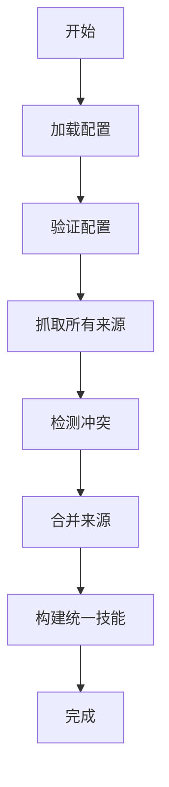
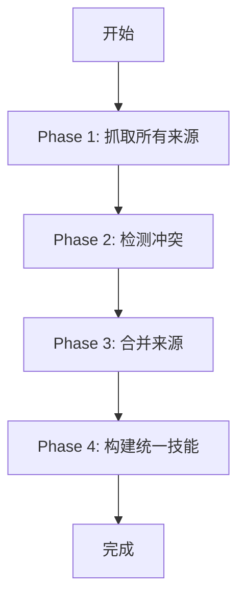
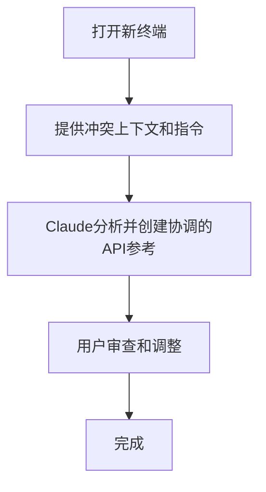

# unified命令

<cite>
**本文档引用的文件**
- [unified_scraper.py](file://src/skill_seekers/cli/unified_scraper.py)
- [config_validator.py](file://src/skill_seekers/cli/config_validator.py)
- [merge_sources.py](file://src/skill_seekers/cli/merge_sources.py)
- [conflict_detector.py](file://src/skill_seekers/cli/conflict_detector.py)
- [unified_skill_builder.py](file://src/skill_seekers/cli/unified_skill_builder.py)
- [main.py](file://src/skill_seekers/cli/main.py)
- [react_unified.json](file://configs/react_unified.json)
- [godot_unified.json](file://configs/godot_unified.json)
- [fastapi_unified.json](file://configs/fastapi_unified.json)
- [UNIFIED_SCRAPING.md](file://docs/UNIFIED_SCRAPING.md)
- [USAGE.md](file://docs/USAGE.md)
- [test_unified.py](file://tests/test_unified.py)
</cite>

## 目录
1. [简介](#简介)
2. [核心功能](#核心功能)
3. [配置文件结构](#配置文件结构)
4. [工作流程](#工作流程)
5. [合并策略](#合并策略)
6. [冲突检测与报告](#冲突检测与报告)
7. [命令行参数](#命令行参数)
8. [使用案例](#使用案例)
9. [最佳实践](#最佳实践)
10. [故障排除](#故障排除)

## 简介

`unified`命令是Skill Seekers工具的核心功能，旨在通过整合文档网站、GitHub仓库和PDF文件等多源内容，创建全面且准确的AI技能。该命令能够协调多个抓取器模块，执行冲突检测，智能合并内容，并生成统一技能。通过`--config`和`--merge-mode`参数，用户可以灵活配置数据源和合并策略，确保生成的技能既全面又可靠。

**Section sources**
- [main.py](file://src/skill_seekers/cli/main.py#L1-L370)
- [unified_scraper.py](file://src/skill_seekers/cli/unified_scraper.py#L1-L453)

## 核心功能

`unified`命令的核心功能包括：

- **多源内容整合**：支持从文档网站、GitHub仓库和PDF文件中抓取内容。
- **冲突检测**：自动检测文档与代码实现之间的不一致。
- **智能合并**：根据配置的合并策略，智能地合并不同来源的内容。
- **透明报告**：生成详细的冲突报告，帮助用户了解数据质量。

这些功能通过`unified_scraper.py`中的`UnifiedScraper`类实现，该类负责协调整个工作流程。



**Diagram sources**
- [unified_scraper.py](file://src/skill_seekers/cli/unified_scraper.py#L42-L409)

**Section sources**
- [unified_scraper.py](file://src/skill_seekers/cli/unified_scraper.py#L1-L453)

## 配置文件结构

`unified`命令的配置文件是一个JSON文件，定义了数据源、合并模式和其他相关设置。配置文件的结构如下：

```json
{
  "name": "skill-name",
  "description": "When to use this skill",
  "merge_mode": "rule-based|claude-enhanced",
  "sources": [
    {
      "type": "documentation|github|pdf",
      ...source-specific fields...
    }
  ]
}
```

### 文档来源

```json
{
  "type": "documentation",
  "base_url": "https://docs.example.com/",
  "extract_api": true,
  "selectors": {
    "main_content": "article",
    "title": "h1",
    "code_blocks": "pre code"
  },
  "url_patterns": {
    "include": [],
    "exclude": ["/blog/"]
  },
  "categories": {
    "getting_started": ["intro", "tutorial"],
    "api": ["api", "reference"]
  },
  "rate_limit": 0.5,
  "max_pages": 200
}
```

### GitHub来源

```json
{
  "type": "github",
  "repo": "owner/repo",
  "github_token": "ghp_...",
  "include_issues": true,
  "max_issues": 100,
  "include_changelog": true,
  "include_releases": true,
  "include_code": true,
  "code_analysis_depth": "surface|deep|full",
  "file_patterns": [
    "src/**/*.js",
    "lib/**/*.ts"
  ]
}
```

### PDF来源

```json
{
  "type": "pdf",
  "path": "/path/to/manual.pdf",
  "extract_tables": false,
  "ocr": false,
  "password": "optional-password"
}
```

**Section sources**
- [config_validator.py](file://src/skill_seekers/cli/config_validator.py#L1-L377)
- [react_unified.json](file://configs/react_unified.json#L1-L45)
- [godot_unified.json](file://configs/godot_unified.json#L1-L51)
- [fastapi_unified.json](file://configs/fastapi_unified.json#L1-L46)

## 工作流程

`unified`命令的工作流程分为四个阶段：

1. **抓取所有来源**：根据配置文件中的`sources`数组，依次抓取文档、GitHub和PDF内容。
2. **检测冲突**：比较文档和代码实现，检测不一致之处。
3. **合并来源**：根据配置的合并模式，智能地合并不同来源的内容。
4. **构建统一技能**：生成最终的技能文件，包括SKILL.md和参考文档。



**Diagram sources**
- [UNIFIED_SCRAPING.md](file://docs/UNIFIED_SCRAPING.md#L504-L543)

**Section sources**
- [unified_scraper.py](file://src/skill_seekers/cli/unified_scraper.py#L380-L409)

## 合并策略

`unified`命令支持两种合并策略：`rule-based`和`claude-enhanced`。

### 基于规则的合并

基于规则的合并使用预定义的规则进行快速、确定性的合并：

1. **仅在文档中**：包含并标记为`[DOCS_ONLY]`。
2. **仅在代码中**：包含并标记为`[UNDOCUMENTED]`。
3. **完全匹配**：正常包含。
4. **存在冲突**：优先使用代码签名，保留文档描述。

```mermaid
graph TD
A[API仅在文档中] --> B[包含并标记为[DOCS_ONLY]]
C[API仅在代码中] --> D[包含并标记为[UNDOCUMENTED]]
E[API完全匹配] --> F[正常包含]
G[API存在冲突] --> H[优先使用代码签名，保留文档描述]
```

**Diagram sources**
- [merge_sources.py](file://src/skill_seekers/cli/merge_sources.py#L25-L159)

### Claude增强合并

Claude增强合并使用本地Claude Code进行智能协调：

1. **打开新终端**：启动Claude Code。
2. **提供上下文**：提供冲突上下文和指令。
3. **Claude分析**：Claude分析并创建协调的API参考。
4. **人工审查**：用户可以审查和调整。



**Diagram sources**
- [merge_sources.py](file://src/skill_seekers/cli/merge_sources.py#L193-L246)

**Section sources**
- [merge_sources.py](file://src/skill_seekers/cli/merge_sources.py#L1-L514)

## 冲突检测与报告

`unified`命令能够自动检测四种类型的冲突：

### 1. 文档中缺失

**严重性**：中等
**描述**：API存在于代码中但未在文档中记录

```python
# 代码中有此方法：
def move_local_x(self, delta: float, snap: bool = False) -> None:
    """Move node along local X axis"""

# 但文档中未提及
```

**建议**：添加此API的文档

### 2. 代码中缺失

**严重性**：高
**描述**：API在文档中记录但未在代码库中找到

```python
# 文档中说：
def rotate(angle: float) -> None

# 但代码中没有此函数
```

**建议**：更新文档以删除此API，或将其添加到代码库中

### 3. 签名不匹配

**严重性**：中高
**描述**：API存在于两者中但签名不同

```python
# 文档中说：
def move_local_x(delta: float)

# 代码中有：
def move_local_x(delta: float, snap: bool = False)
```

**建议**：更新文档以匹配实际签名

### 4. 描述不匹配

**严重性**：低
**描述**：不同的描述/文档字符串

**Section sources**
- [conflict_detector.py](file://src/skill_seekers/cli/conflict_detector.py#L1-L514)
- [UNIFIED_SCRAPING.md](file://docs/UNIFIED_SCRAPING.md#L147-L203)

## 命令行参数

`unified`命令支持以下参数：

- `--config`：指定统一配置JSON文件的路径。
- `--merge-mode`：覆盖配置中的合并模式（`rule-based`或`claude-enhanced`）。
- `--dry-run`：干运行模式。

```bash
# 基本用法
python3 cli/unified_scraper.py --config configs/react_unified.json

# 覆盖合并模式
python3 cli/unified_scraper.py --config configs/react_unified.json --merge-mode claude-enhanced

# 使用缓存数据（跳过重新抓取）
python3 cli/unified_scraper.py --config configs/react_unified.json --skip-scrape
```

**Section sources**
- [main.py](file://src/skill_seekers/cli/main.py#L116-L124)
- [unified_scraper.py](file://src/skill_seekers/cli/unified_scraper.py#L420-L452)

## 使用案例

### 案例1：React（文档 + GitHub）

```json
{
  "name": "react",
  "description": "Complete React knowledge base combining official documentation and React codebase insights. Use when working with React, understanding API changes, or debugging React internals.",
  "merge_mode": "rule-based",
  "sources": [
    {
      "type": "documentation",
      "base_url": "https://react.dev/",
      "extract_api": true,
      "selectors": {
        "main_content": "article",
        "title": "h1",
        "code_blocks": "pre code"
      },
      "url_patterns": {
        "include": [],
        "exclude": ["/blog/", "/community/"]
      },
      "categories": {
        "getting_started": ["learn", "installation", "quick-start"],
        "components": ["components", "props", "state"],
        "hooks": ["hooks", "usestate", "useeffect", "usecontext"],
        "api": ["api", "reference"],
        "advanced": ["context", "refs", "portals", "suspense"]
      },
      "rate_limit": 0.5,
      "max_pages": 200
    },
    {
      "type": "github",
      "repo": "facebook/react",
      "include_issues": true,
      "max_issues": 100,
      "include_changelog": true,
      "include_releases": true,
      "include_code": true,
      "code_analysis_depth": "surface",
      "file_patterns": [
        "packages/react/src/**/*.js",
        "packages/react-dom/src/**/*.js"
      ]
    }
  ]
}
```

### 案例2：Django（文档 + GitHub）

```json
{
  "name": "django",
  "description": "Complete Django framework knowledge",
  "merge_mode": "rule-based",
  "sources": [
    {
      "type": "documentation",
      "base_url": "https://docs.djangoproject.com/en/stable/",
      "extract_api": true,
      "max_pages": 300
    },
    {
      "type": "github",
      "repo": "django/django",
      "include_code": true,
      "code_analysis_depth": "deep",
      "file_patterns": [
        "django/db/**/*.py",
        "django/views/**/*.py"
      ]
    }
  ]
}
```

### 案例3：混合来源（文档 + GitHub + PDF）

```json
{
  "name": "godot",
  "description": "Complete Godot Engine knowledge",
  "merge_mode": "claude-enhanced",
  "sources": [
    {
      "type": "documentation",
      "base_url": "https://docs.godotengine.org/en/stable/",
      "extract_api": true,
      "max_pages": 500
    },
    {
      "type": "github",
      "repo": "godotengine/godot",
      "include_code": true,
      "code_analysis_depth": "deep"
    },
    {
      "type": "pdf",
      "path": "/path/to/godot_manual.pdf",
      "extract_tables": true
    }
  ]
}
```

**Section sources**
- [UNIFIED_SCRAPING.md](file://docs/UNIFIED_SCRAPING.md#L329-L409)

## 最佳实践

### 1. 从基于规则的合并开始

基于规则的合并速度快且适用于大多数情况。只有在需要人工监督时才使用Claude增强合并。

### 2. 使用表面级代码分析

`code_analysis_depth: "surface"`通常已足够。深度分析成本高且很少需要。

### 3. 限制GitHub问题

`max_issues: 100`是一个良好的默认值。超过200个问题很少增加价值。

### 4. 具体指定文件模式

```json
"file_patterns": [
  "src/**/*.js",     // 好：具体路径
  "lib/**/*.ts"
]

// 不推荐：
"file_patterns": ["**/*.js"]  // 太宽泛，慢
```

### 5. 监控冲突报告

始终审查`references/conflicts.md`以了解来源之间的差异。

**Section sources**
- [UNIFIED_SCRAPING.md](file://docs/UNIFIED_SCRAPING.md#L545-L574)

## 故障排除

### 未检测到冲突

**可能原因**：
- `extract_api: false`在文档来源中
- `include_code: false`在GitHub来源中
- 代码分析未找到API（检查`code_analysis_depth`）

**解决方案**：确保两个来源都启用了API提取

### 冲突过多

**可能原因**：
- 模糊匹配阈值太严格
- 文档使用不同的命名约定
- 旧版本的文档

**解决方案**：手动审查冲突并调整合并策略

### 合并耗时过长

**可能原因**：
- 使用`code_analysis_depth: "full"`（非常慢）
- 文件模式过多
- 大型仓库

**解决方案**：
- 使用`"surface"`或`"deep"`分析
- 缩小文件模式
- 增加`rate_limit`

**Section sources**
- [UNIFIED_SCRAPING.md](file://docs/UNIFIED_SCRAPING.md#L575-L606)