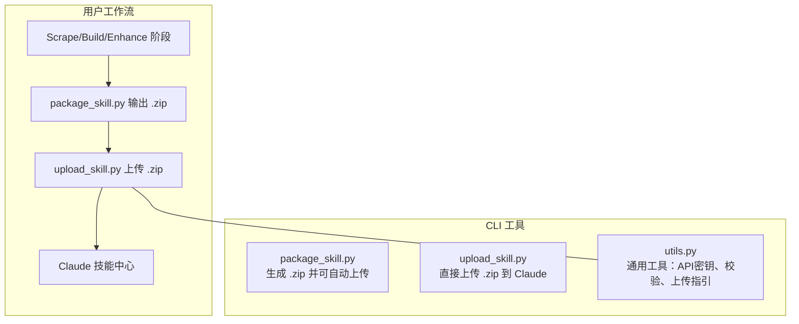
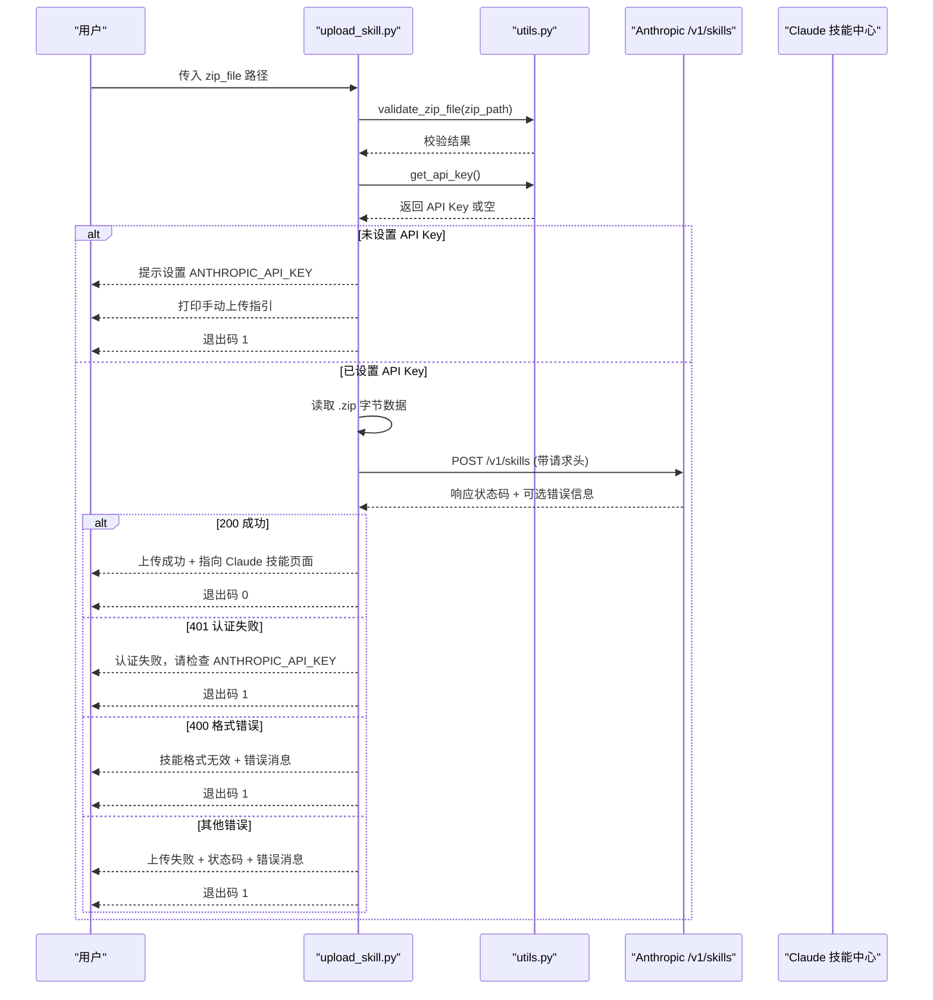
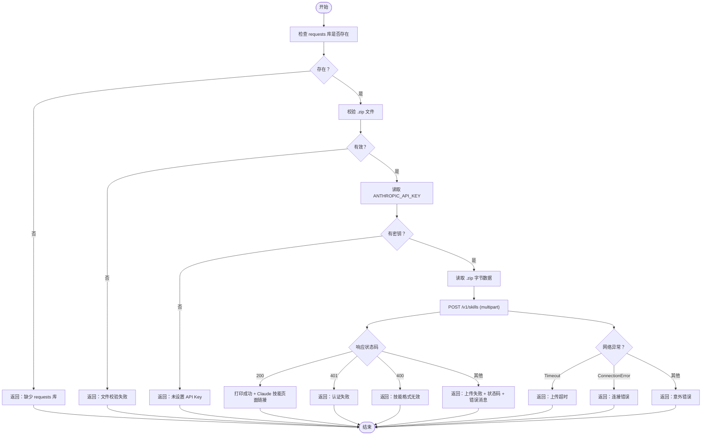
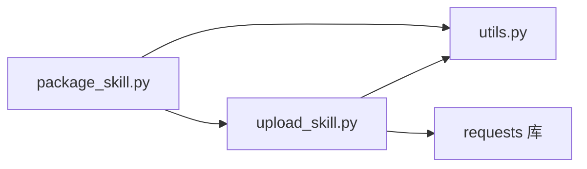

# upload命令

<cite>
**本文引用的文件列表**
- [upload_skill.py](file://src/skill_seekers/cli/upload_skill.py)
- [utils.py](file://src/skill_seekers/cli/utils.py)
- [package_skill.py](file://src/skill_seekers/cli/package_skill.py)
- [UPLOAD_GUIDE.md](file://docs/UPLOAD_GUIDE.md)
- [CLAUDE.md](file://CLAUDE.md)
- [test_upload_skill.py](file://tests/test_upload_skill.py)
</cite>

## 目录
1. [简介](#简介)
2. [项目结构与定位](#项目结构与定位)
3. [核心组件](#核心组件)
4. [架构总览](#架构总览)
5. [详细组件分析](#详细组件分析)
6. [依赖关系分析](#依赖关系分析)
7. [性能与可靠性](#性能与可靠性)
8. [故障排查指南](#故障排查指南)
9. [结论](#结论)
10. [附录：API密钥获取与配置](#附录api密钥获取与配置)

## 简介
本专项文档聚焦于“upload命令”，即通过 Anthropic API 将本地打包好的技能 .zip 文件上传到 Claude 的自动化流程。文档围绕以下目标展开：
- 解释 zip_file 参数的路径要求与来源（通常来自 package 命令生成）
- 强调 ANTHROPIC_API_KEY 环境变量的必要性与作用
- 基于 upload_skill.py 的实现，说明 HTTP 请求构造、错误处理（认证失败、网络超时等）与手动上传回退方案
- 提供 API 密钥获取与配置的完整指南
- 列出常见错误码与对应解决方案
- 明确该命令在自动化工作流中的位置：通常作为 package 命令的后续步骤

## 项目结构与定位
upload 命令位于 CLI 子模块中，负责将已打包的技能 .zip 上传到 Claude。它与 package 命令紧密协作：package 负责生成 .zip；upload 负责上传到 Claude。

图表来源
- [package_skill.py](file://src/skill_seekers/cli/package_skill.py#L170-L221)
- [upload_skill.py](file://src/skill_seekers/cli/upload_skill.py#L131-L175)
- [utils.py](file://src/skill_seekers/cli/utils.py#L60-L114)

章节来源
- [package_skill.py](file://src/skill_seekers/cli/package_skill.py#L170-L221)
- [upload_skill.py](file://src/skill_seekers/cli/upload_skill.py#L131-L175)
- [utils.py](file://src/skill_seekers/cli/utils.py#L60-L114)

## 核心组件
- upload_skill.py：命令行入口与上传逻辑，负责校验 .zip、读取文件、构造请求头、发起 HTTP POST、解析响应并输出结果或回退提示。
- utils.py：提供 API 密钥读取、上传 URL 获取、.zip 校验、手动上传指引打印等通用能力。
- package_skill.py：在 package 阶段可选择自动上传，若检测到 ANTHROPIC_API_KEY 缺失则给出明确提示并引导手动上传。
- 文档与指南：UPLOAD_GUIDE.md 与 CLAUDE.md 提供使用说明、工作流与故障排查。

章节来源
- [upload_skill.py](file://src/skill_seekers/cli/upload_skill.py#L39-L129)
- [utils.py](file://src/skill_seekers/cli/utils.py#L60-L114)
- [package_skill.py](file://src/skill_seekers/cli/package_skill.py#L170-L221)
- [UPLOAD_GUIDE.md](file://docs/UPLOAD_GUIDE.md#L271-L323)
- [CLAUDE.md](file://CLAUDE.md#L306-L323)

## 架构总览
upload 命令的端到端流程如下：

图表来源
- [upload_skill.py](file://src/skill_seekers/cli/upload_skill.py#L39-L129)
- [utils.py](file://src/skill_seekers/cli/utils.py#L60-L114)

章节来源
- [upload_skill.py](file://src/skill_seekers/cli/upload_skill.py#L39-L129)
- [utils.py](file://src/skill_seekers/cli/utils.py#L60-L114)

## 详细组件分析

### upload_skill.py 组件分析
- 参数与入口
  - 接收 zip_file 为必需参数，类型为字符串或 Path 对象。
  - 使用 argparse 提供帮助信息与示例用法。
- 校验与准备
  - 调用 validate_zip_file 校验 .zip 文件存在性、是否为文件、后缀是否为 .zip。
  - 读取 ANTHROPIC_API_KEY，若为空则返回错误并提示设置。
- HTTP 请求构造
  - 目标地址：https://api.anthropic.com/v1/skills
  - 请求头包含：
    - x-api-key：来自环境变量
    - anthropic-version：固定值
    - anthropic-beta：技能相关 beta 版本标识
  - 上传方式：multipart/form-data，字段名为 files[]，内容为 .zip 字节流
  - 超时：60 秒
- 响应处理与错误分支
  - 200：成功，打印可用链接
  - 401：认证失败，提示检查 API Key
  - 400：技能格式无效，解析 JSON 中的错误消息
  - 其他：根据状态码与 JSON 错误消息返回通用失败信息
- 异常捕获
  - Timeout：上传超时，建议重试或手动上传
  - ConnectionError：连接错误，提示检查网络
  - 其他异常：返回“意外错误”并包含异常字符串
- 回退策略
  - 失败时打印手动上传指引，引导用户前往 Claude 技能中心进行手动上传

图表来源
- [upload_skill.py](file://src/skill_seekers/cli/upload_skill.py#L39-L129)

章节来源
- [upload_skill.py](file://src/skill_seekers/cli/upload_skill.py#L39-L129)

### utils.py 组件分析
- API 密钥相关
  - has_api_key：判断 ANTHROPIC_API_KEY 是否非空
  - get_api_key：返回 API Key 或 None
- 上传 URL
  - get_upload_url：返回 Claude 技能上传页面 URL
- 手动上传指引
  - print_upload_instructions：打印清晰的手动上传步骤
- .zip 校验
  - validate_zip_file：检查路径存在性、是否为文件、后缀是否为 .zip
- 其他工具
  - open_folder：跨平台打开文件夹
  - format_file_size：人类可读的文件大小格式化
  - read_reference_files：读取 references 下的 Markdown 内容（用于 package 等场景）

章节来源
- [utils.py](file://src/skill_seekers/cli/utils.py#L60-L114)
- [utils.py](file://src/skill_seekers/cli/utils.py#L158-L179)

### package_skill.py 与 upload 的协作
- 当 package 命令启用 --upload 时：
  - 若未设置 ANTHROPIC_API_KEY，会打印“自动上传”提示与手动上传指引，但不中断打包过程（退出码 0）
  - 若已设置，则导入 upload_skill.py 的 upload_skill_api 并执行上传，失败时同样给出提示并退出码 0（表示打包成功）
- 这种设计确保了即使上传失败，也能保留 .zip 文件以便手动上传

章节来源
- [package_skill.py](file://src/skill_seekers/cli/package_skill.py#L170-L221)

## 依赖关系分析
- upload_skill.py 依赖 utils.py 提供的：
  - get_api_key：读取环境变量
  - validate_zip_file：校验 .zip
  - get_upload_url：获取上传页面 URL
  - print_upload_instructions：打印手动上传指引
- 上传流程依赖 requests 库进行 HTTP 传输
- package_skill.py 在自动上传模式下依赖 upload_skill.py 的 upload_skill_api

图表来源
- [upload_skill.py](file://src/skill_seekers/cli/upload_skill.py#L39-L129)
- [utils.py](file://src/skill_seekers/cli/utils.py#L60-L114)
- [package_skill.py](file://src/skill_seekers/cli/package_skill.py#L170-L221)

章节来源
- [upload_skill.py](file://src/skill_seekers/cli/upload_skill.py#L39-L129)
- [utils.py](file://src/skill_seekers/cli/utils.py#L60-L114)
- [package_skill.py](file://src/skill_seekers/cli/package_skill.py#L170-L221)

## 性能与可靠性
- 超时控制：请求设置了 60 秒超时，避免长时间阻塞
- 重试策略：当前实现未内置重试逻辑。如需增强，可在上层调用处结合 utils.retry_with_backoff（该工具适用于网络操作的指数退避重试）
- 文件大小：.zip 由 package 阶段生成，通常较小；若过大，建议先检查内容构成（参考 UPLOAD_GUIDE.md 的体积分析建议）

章节来源
- [upload_skill.py](file://src/skill_seekers/cli/upload_skill.py#L93-L98)
- [utils.py](file://src/skill_seekers/cli/utils.py#L236-L289)
- [UPLOAD_GUIDE.md](file://docs/UPLOAD_GUIDE.md#L230-L243)

## 故障排查指南
- 未设置 ANTHROPIC_API_KEY
  - 现象：upload 返回“未设置 API Key”的提示
  - 处理：按指南设置环境变量并重试
- 认证失败（401）
  - 现象：返回“认证失败，请检查 ANTHROPIC_API_KEY”
  - 处理：确认密钥正确且来自官方控制台
- 技能格式无效（400）
  - 现象：返回“技能格式无效 + 错误消息”
  - 处理：检查 .zip 内容结构（SKILL.md 必须存在），参考 package 流程与指南
- 上传超时（Timeout）
  - 现象：返回“上传超时”
  - 处理：检查网络稳定性，稍后重试或改为手动上传
- 连接错误（ConnectionError）
  - 现象：返回“连接错误，请检查网络”
  - 处理：检查本地网络与代理设置
- 其他错误
  - 现象：返回“上传失败 + 状态码 + 错误消息”
  - 处理：记录状态码与消息，按指南进行手动上传
- 手动上传回退
  - 无论何种失败，都会打印手动上传指引，引导用户前往 Claude 技能中心完成上传

章节来源
- [upload_skill.py](file://src/skill_seekers/cli/upload_skill.py#L110-L129)
- [UPLOAD_GUIDE.md](file://docs/UPLOAD_GUIDE.md#L301-L323)

## 结论
upload 命令通过 Anthropic API 将 .zip 技能文件直接上传到 Claude，具备完善的输入校验、环境变量检查、HTTP 请求构造与错误处理。当上传失败时，系统会提供清晰的手动上传指引，保证工作流的连续性。在自动化工作流中，upload 通常紧随 package 命令之后，形成“打包 → 自动上传（可选）→ 手动上传回退”的稳健闭环。

## 附录：API密钥获取与配置
- 获取方式
  - 登录 Anthropic 控制台，创建并复制 API Key
- 设置方法
  - 临时设置：export ANTHROPIC_API_KEY=sk-ant-...
  - 持久设置：将上述命令追加到 shell 配置文件（如 ~/.bashrc 或 ~/.zshrc）
- 验证方法
  - echo $ANTHROPIC_API_KEY
- 与 package 命令的配合
  - package --upload：若未设置 API Key，会提示如何开启自动上传并给出手动上传指引
  - upload：直接上传 .zip，若未设置 API Key，会提示设置后再试

章节来源
- [UPLOAD_GUIDE.md](file://docs/UPLOAD_GUIDE.md#L271-L323)
- [CLAUDE.md](file://CLAUDE.md#L306-L323)
- [package_skill.py](file://src/skill_seekers/cli/package_skill.py#L170-L221)