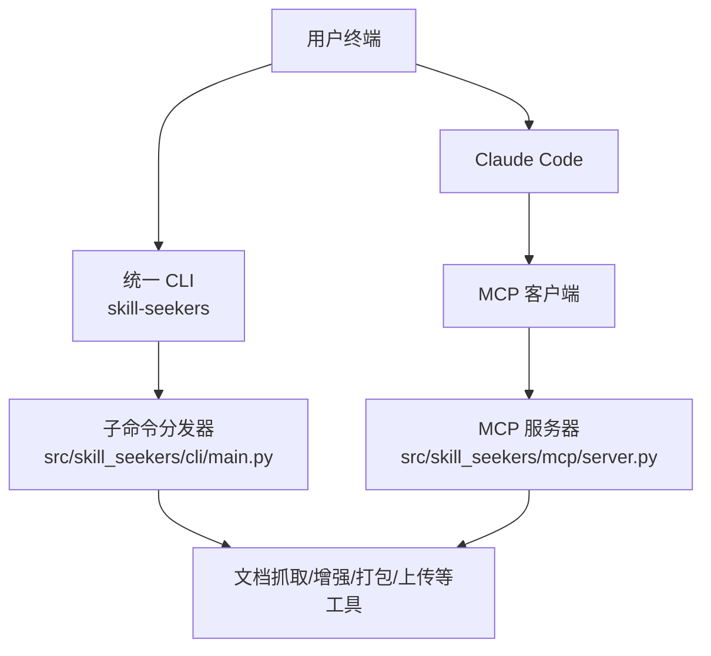
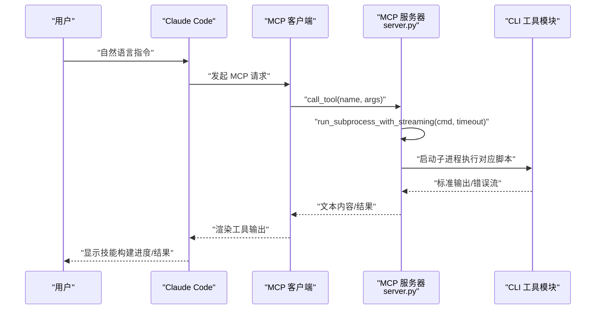
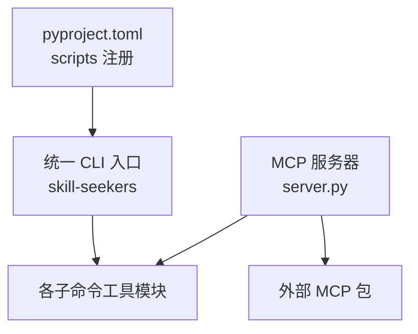

# 安装与配置

<cite>
**本文引用的文件**
- [README.md](file://README.md)
- [pyproject.toml](file://pyproject.toml)
- [setup_mcp.sh](file://setup_mcp.sh)
- [docs/MCP_SETUP.md](file://docs/MCP_SETUP.md)
- [src/skill_seekers/cli/main.py](file://src/skill_seekers/cli/main.py)
- [src/skill_seekers/mcp/server.py](file://src/skill_seekers/mcp/server.py)
- [src/skill_seekers/mcp/requirements.txt](file://src/skill_seekers/mcp/requirements.txt)
- [requirements.txt](file://requirements.txt)
- [TROUBLESHOOTING.md](file://TROUBLESHOOTING.md)
</cite>

## 目录
1. [简介](#简介)
2. [项目结构](#项目结构)
3. [核心组件](#核心组件)
4. [架构总览](#架构总览)
5. [详细组件分析](#详细组件分析)
6. [依赖关系分析](#依赖关系分析)
7. [性能与平台差异](#性能与平台差异)
8. [故障排查指南](#故障排查指南)
9. [结论](#结论)

## 简介
本指南面向首次使用 Skill Seekers 的用户，覆盖从 PyPI 安装到本地开发环境搭建、MCP（Model Context Protocol）集成配置、关键环境变量设置、跨平台安装示例，以及 CLI 命令注册机制与常见问题排查。目标是帮助你在 macOS 与 Linux 上快速完成安装与配置，并顺利在 Claude Code 中使用 MCP 工具链。

## 项目结构
Skill Seekers 提供统一 CLI 与 MCP 服务器两种使用路径：
- 统一 CLI：通过入口命令 skill-seekers 调用多个子命令，适合命令行工作流。
- MCP 集成：通过 MCP 服务器向 Claude Code 暴露 9 个工具，支持自然语言交互。

图表来源
- [src/skill_seekers/cli/main.py](file://src/skill_seekers/cli/main.py#L1-L120)
- [src/skill_seekers/mcp/server.py](file://src/skill_seekers/mcp/server.py#L1-L120)

章节来源
- [README.md](file://README.md#L103-L175)
- [pyproject.toml](file://pyproject.toml#L99-L114)

## 核心组件
- 统一 CLI 入口与命令注册
  - 通过 pyproject.toml 的 [project.scripts] 注册了统一入口 skill-seekers 与多个独立工具入口，便于在系统 PATH 中直接调用。
  - 入口文件负责解析子命令并将参数转发给对应工具模块。
- MCP 服务器
  - 在 src/skill_seekers/mcp/server.py 中实现，暴露 9 个工具（如 generate_config、scrape_docs、package_skill 等），并通过 subprocess 调用 CLI 工具执行具体任务。
- MCP 依赖
  - MCP 服务器依赖外部 mcp 包与 HTTP 工具，需单独安装。

章节来源
- [pyproject.toml](file://pyproject.toml#L99-L114)
- [src/skill_seekers/cli/main.py](file://src/skill_seekers/cli/main.py#L1-L120)
- [src/skill_seekers/mcp/server.py](file://src/skill_seekers/mcp/server.py#L1-L120)
- [src/skill_seekers/mcp/requirements.txt](file://src/skill_seekers/mcp/requirements.txt#L1-L10)

## 架构总览
下图展示 MCP 集成的关键交互：Claude Code 通过 MCP 协议调用本地 MCP 服务器，服务器再以子进程方式调用 CLI 工具，形成“MCP → 服务器 → CLI 工具”的链路。

图表来源
- [src/skill_seekers/mcp/server.py](file://src/skill_seekers/mcp/server.py#L60-L120)
- [src/skill_seekers/mcp/server.py](file://src/skill_seekers/mcp/server.py#L120-L220)

## 详细组件分析

### 1) PyPI 安装与 CLI 命令注册
- 安装方式
  - 推荐使用 pip 从 PyPI 安装，安装后系统会自动注册统一入口 skill-seekers 与多个独立工具入口。
- CLI 命令注册机制
  - 通过 pyproject.toml 的 [project.scripts] 将 skill-seekers 与各子命令映射到对应的模块入口函数，确保在 PATH 中可直接调用。
- 开发安装
  - 若需要从源码开发，可使用可编辑安装，使本地修改即时生效。

章节来源
- [README.md](file://README.md#L103-L175)
- [pyproject.toml](file://pyproject.toml#L99-L114)

### 2) MCP 服务器安装与配置（setup_mcp.sh）
- 脚本功能概览
  - 自动检测 Python 版本与虚拟环境状态，按需创建并激活 venv，使用可选的 --user 方式进行系统级安装，避免破坏系统包。
  - 可选测试 MCP 服务器是否能正常启动，以及运行测试套件验证功能。
  - 输出 Claude Code 的 MCP 配置模板，提示用户手动写入 ~/.config/claude-code/mcp.json 或由脚本自动写入。
  - 最终给出重启 Claude Code、测试工具列表与示例命令的指引。
- 权限与路径注意事项
  - 若使用系统安装，注意可能覆盖系统管理的包；推荐使用 venv 或 --user。
  - 配置文件中使用的路径必须为绝对路径，避免占位符导致加载失败。
- 验证与故障排查
  - 可通过手动启动 server.py 并使用 pytest 测试 MCP 服务。
  - 如路径不正确，脚本会尝试使用 jq 校验配置文件的有效性。

章节来源
- [setup_mcp.sh](file://setup_mcp.sh#L1-L120)
- [setup_mcp.sh](file://setup_mcp.sh#L120-L210)
- [setup_mcp.sh](file://setup_mcp.sh#L210-L267)
- [docs/MCP_SETUP.md](file://docs/MCP_SETUP.md#L1-L120)

### 3) MCP 服务器与工具清单
- MCP 服务器在启动时会列出可用工具，包括：
  - generate_config、estimate_pages、scrape_docs、package_skill、upload_skill、list_configs、validate_config、split_config、generate_router、scrape_pdf、scrape_github、install_skill、fetch_config、submit_config、add_config_source、list_config_sources、remove_config_source 等。
- 服务器通过装饰器包装工具函数，即使 MCP 不可用也能优雅降级。
- 工具调用通过 run_subprocess_with_streaming 实现，避免长时间阻塞导致界面卡顿，并实时输出日志。

章节来源
- [src/skill_seekers/mcp/server.py](file://src/skill_seekers/mcp/server.py#L120-L220)
- [src/skill_seekers/mcp/server.py](file://src/skill_seekers/mcp/server.py#L60-L120)

### 4) 关键环境变量与使用场景
- ANTHROPIC_API_KEY
  - 用于自动上传到 Claude 或启用 API 增强功能（当使用 API 增强路径时）。若未设置，服务器仍可工作，但部分自动上传/增强功能不可用。
- GITHUB_TOKEN、GITLAB_TOKEN、GITEA_TOKEN、BITBUCKET_TOKEN、GIT_TOKEN
  - 用于私有仓库或高并发场景下的认证，优先使用环境变量而非明文 token。
- PYTHONPATH
  - 当需要自定义 Python 路径或调试时，可在 MCP 配置中设置。
- 缓存目录
  - 可通过环境变量指定缓存目录位置，便于团队共享或隔离缓存。

章节来源
- [docs/MCP_SETUP.md](file://docs/MCP_SETUP.md#L393-L477)
- [src/skill_seekers/mcp/server.py](file://src/skill_seekers/mcp/server.py#L460-L560)
- [src/skill_seekers/mcp/server.py](file://src/skill_seekers/mcp/server.py#L560-L660)

### 5) 跨平台安装示例（macOS/Linux）

- macOS
  - 使用 Homebrew 安装 Python 与 pip 后，可直接 pip 安装或使用可编辑模式开发。
  - 若使用 setup_mcp.sh，需先赋予执行权限，然后运行脚本完成 MCP 配置。
- Linux
  - 使用发行版包管理器安装 Python 与 pip 后，按上述步骤操作。
  - 若遇到 pip3 不存在，先安装 python3-pip。
- 通用建议
  - 强烈建议使用虚拟环境（venv）隔离依赖，避免与系统包冲突。
  - 若无管理员权限，可使用 --user 安装，或将依赖安装到用户目录。

章节来源
- [TROUBLESHOOTING.md](file://TROUBLESHOOTING.md#L313-L364)
- [TROUBLESHOOTING.md](file://TROUBLESHOOTING.md#L330-L364)

### 6) 依赖与版本约束
- Python 版本
  - 项目要求 Python 3.10+，请确保本地 Python 版本满足要求。
- 核心依赖
  - requests、beautifulsoup4、PyGithub、GitPython、mcp、httpx、PyMuPDF、Pillow、pytesseract、pydantic、click 等。
- MCP 专用依赖
  - mcp、httpx、httpx-sse、uvicorn、starlette、sse-starlette 等。
- 开发依赖
  - pytest、pytest-asyncio、coverage 等，用于测试与覆盖率统计。

章节来源
- [README.md](file://README.md#L530-L541)
- [pyproject.toml](file://pyproject.toml#L10-L59)
- [pyproject.toml](file://pyproject.toml#L60-L91)
- [requirements.txt](file://requirements.txt#L1-L44)
- [src/skill_seekers/mcp/requirements.txt](file://src/skill_seekers/mcp/requirements.txt#L1-L10)

## 依赖关系分析
- CLI 与 MCP 的耦合
  - MCP 服务器通过 subprocess 调用 CLI 工具，二者解耦良好，便于独立演进。
- 外部依赖
  - MCP 服务器依赖外部 mcp 包；若缺失会在启动时报错并提示安装。
- 包管理与注册
  - 通过 setuptools 的 entry_points（pyproject.toml 的 scripts 字段）注册 CLI 命令，确保用户可直接调用。

图表来源
- [pyproject.toml](file://pyproject.toml#L99-L114)
- [src/skill_seekers/mcp/server.py](file://src/skill_seekers/mcp/server.py#L1-L120)

章节来源
- [pyproject.toml](file://pyproject.toml#L99-L114)
- [src/skill_seekers/mcp/server.py](file://src/skill_seekers/mcp/server.py#L1-L120)

## 性能与平台差异
- 异步模式与并发
  - CLI 支持异步模式与多工作线程，可显著提升大规模文档抓取速度；MCP 服务器通过流式输出避免长时间阻塞。
- 平台差异
  - macOS 与 Linux 的安装路径与包管理器略有不同，但流程一致；Windows 用户可通过 WSL 使用 Linux 流程。
- 网络与速率限制
  - 对于大型站点，建议适当提高 rate_limit 与降低并发，避免触发 429 错误。

章节来源
- [README.md](file://README.md#L260-L315)
- [src/skill_seekers/mcp/server.py](file://src/skill_seekers/mcp/server.py#L60-L120)

## 故障排查指南
- Python 未找到或版本过低
  - 使用 which python3 检查路径，必要时改用 python 或安装更高版本。
- 模块缺失
  - 安装 requests、beautifulsoup4、mcp 等依赖；若权限不足，使用 --user 安装。
- 权限错误
  - 使用 venv 或 --user；避免使用 sudo 安装到系统路径。
- MCP 配置路径问题
  - 确保 ~/.config/claude-code/mcp.json 中的路径为绝对路径；使用脚本自动写入或手动替换占位符。
- MCP 服务器无法启动
  - 手动运行 server.py 进行验证；检查 Claude Code 日志；完全重启 Claude Code。
- 上传/增强失败
  - 确认 ANTHROPIC_API_KEY 是否设置；网络连通性是否正常。

章节来源
- [TROUBLESHOOTING.md](file://TROUBLESHOOTING.md#L1-L120)
- [TROUBLESHOOTING.md](file://TROUBLESHOOTING.md#L136-L230)
- [TROUBLESHOOTING.md](file://TROUBLESHOOTING.md#L313-L364)

## 结论
通过 PyPI 安装与可编辑开发两种方式，你可以快速获得统一 CLI；若希望在 Claude Code 中以自然语言高效使用工具，建议配合 setup_mcp.sh 完成 MCP 服务器配置。遵循本文的环境变量设置、依赖安装与故障排查建议，可在 macOS 与 Linux 上稳定运行 Skill Seekers，并在 MCP 生态中发挥最大价值。