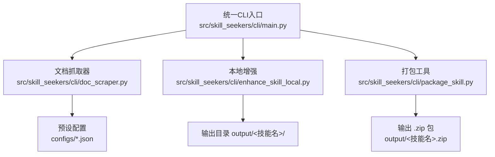
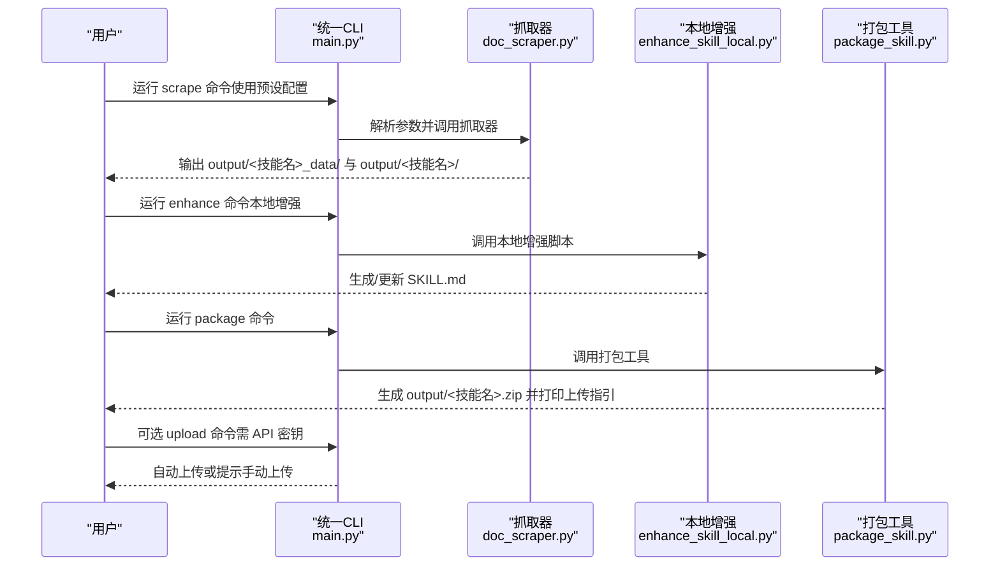
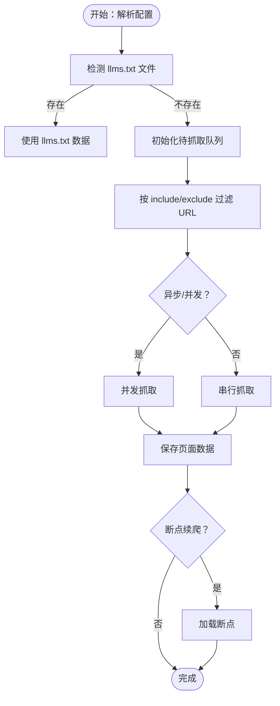
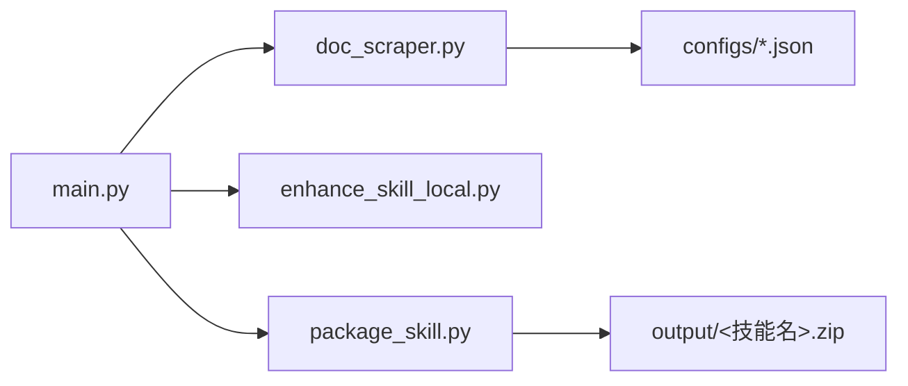

# 快速入门指南

<cite>
**本文引用的文件**
- [README.md](file://README.md)
- [QUICKSTART.md](file://QUICKSTART.md)
- [BULLETPROOF_QUICKSTART.md](file://BULLETPROOF_QUICKSTART.md)
- [TROUBLESHOOTING.md](file://TROUBLESHOOTING.md)
- [src/skill_seekers/cli/main.py](file://src/skill_seekers/cli/main.py)
- [src/skill_seekers/cli/doc_scraper.py](file://src/skill_seekers/cli/doc_scraper.py)
- [src/skill_seekers/cli/enhance_skill_local.py](file://src/skill_seekers/cli/enhance_skill_local.py)
- [src/skill_seekers/cli/package_skill.py](file://src/skill_seekers/cli/package_skill.py)
- [configs/react.json](file://configs/react.json)
- [configs/fastapi.json](file://configs/fastapi.json)
- [configs/react_unified.json](file://configs/react_unified.json)
- [docs/USAGE.md](file://docs/USAGE.md)
</cite>

## 目录
1. [简介](#简介)
2. [项目结构](#项目结构)
3. [核心组件](#核心组件)
4. [架构总览](#架构总览)
5. [详细组件分析](#详细组件分析)
6. [依赖关系分析](#依赖关系分析)
7. [性能与最佳实践](#性能与最佳实践)
8. [故障排查指南](#故障排查指南)
9. [结论](#结论)
10. [附录：命令与预期输出示例](#附录命令与预期输出示例)

## 简介
本指南面向完全新手，带你从零开始完成一次“从配置到上传”的完整技能构建流程。你将学会：
- 使用预设配置文件快速启动抓取任务（如 react.json、fastapi.json）
- 在交互式模式下填写配置参数
- 执行标准工作流：scrape → enhance → package → upload
- 验证安装与命令是否正确
- 识别常见陷阱与规避方法

为确保稳健性，本指南严格遵循健壮性建议（来自 BULLETPROOF_QUICKSTART.md），强调关键配置项与最佳实践。

## 项目结构
Skill Seeker 提供统一 CLI 入口，按子命令组织功能模块；核心目录与文件如下：
- 统一 CLI 入口：src/skill_seekers/cli/main.py
- 文档抓取器：src/skill_seekers/cli/doc_scraper.py
- 本地增强工具：src/skill_seekers/cli/enhance_skill_local.py
- 打包工具：src/skill_seekers/cli/package_skill.py
- 预设配置：configs/*.json（如 react.json、fastapi.json、react_unified.json）
- 使用说明与快速入门：README.md、QUICKSTART.md、BULLETPROOF_QUICKSTART.md、docs/USAGE.md
- 故障排查：TROUBLESHOOTING.md

图表来源
- [src/skill_seekers/cli/main.py](file://src/skill_seekers/cli/main.py#L1-L120)
- [src/skill_seekers/cli/doc_scraper.py](file://src/skill_seekers/cli/doc_scraper.py#L1-L120)
- [src/skill_seekers/cli/enhance_skill_local.py](file://src/skill_seekers/cli/enhance_skill_local.py#L1-L120)
- [src/skill_seekers/cli/package_skill.py](file://src/skill_seekers/cli/package_skill.py#L1-L120)
- [configs/react.json](file://configs/react.json#L1-L32)
- [configs/fastapi.json](file://configs/fastapi.json#L1-L34)
- [configs/react_unified.json](file://configs/react_unified.json#L1-L45)

章节来源
- [README.md](file://README.md#L540-L640)
- [docs/USAGE.md](file://docs/USAGE.md#L19-L36)

## 核心组件
- 统一 CLI 入口：提供 git 风格的子命令，包括 scrape、github、pdf、unified、enhance、package、upload、estimate、install-agent、install 等。
- 文档抓取器：支持 llms.txt 检测、多源抓取、分类、语言检测、异步/并发、断点续爬等。
- 本地增强：通过 Claude Code 在新终端中进行本地增强，无需 API 密钥。
- 打包工具：校验技能目录结构，生成 .zip 并打印上传指引；可选自动上传（需 API 密钥）。

章节来源
- [src/skill_seekers/cli/main.py](file://src/skill_seekers/cli/main.py#L1-L120)
- [src/skill_seekers/cli/doc_scraper.py](file://src/skill_seekers/cli/doc_scraper.py#L1-L120)
- [src/skill_seekers/cli/enhance_skill_local.py](file://src/skill_seekers/cli/enhance_skill_local.py#L1-L120)
- [src/skill_seekers/cli/package_skill.py](file://src/skill_seekers/cli/package_skill.py#L1-L120)

## 架构总览
下面的序列图展示了“scrape → enhance → package → upload”完整工作流在统一 CLI 下的调用关系。

图表来源
- [src/skill_seekers/cli/main.py](file://src/skill_seekers/cli/main.py#L220-L370)
- [src/skill_seekers/cli/doc_scraper.py](file://src/skill_seekers/cli/doc_scraper.py#L1-L120)
- [src/skill_seekers/cli/enhance_skill_local.py](file://src/skill_seekers/cli/enhance_skill_local.py#L1-L120)
- [src/skill_seekers/cli/package_skill.py](file://src/skill_seekers/cli/package_skill.py#L1-L120)

## 详细组件分析

### 统一 CLI 入口与命令分发
- 支持的子命令：scrape、github、pdf、unified、enhance、package、upload、estimate、install-agent、install
- scrape 子命令支持：--config、--name、--url、--description、--skip-scrape、--enhance、--enhance-local、--dry-run、--async、--workers
- package 子命令支持：--no-open、--skip-quality-check、--upload
- install 子命令支持：--config、--destination、--no-upload、--unlimited、--dry-run

章节来源
- [src/skill_seekers/cli/main.py](file://src/skill_seekers/cli/main.py#L68-L220)
- [src/skill_seekers/cli/main.py](file://src/skill_seekers/cli/main.py#L222-L370)

### 文档抓取器（scrape）
- 功能要点：llms.txt 检测优先、多起始 URL、URL 过滤、语言检测、异步/并发、断点续爬、质量检查（可选）
- 关键配置项（来自预设配置）：name、base_url、start_urls、selectors、url_patterns、categories、rate_limit、max_pages
- 交互式模式：交互式向导逐项收集配置，适合首次使用或自定义站点

图表来源
- [src/skill_seekers/cli/doc_scraper.py](file://src/skill_seekers/cli/doc_scraper.py#L1-L120)
- [src/skill_seekers/cli/doc_scraper.py](file://src/skill_seekers/cli/doc_scraper.py#L1298-L1524)

章节来源
- [src/skill_seekers/cli/doc_scraper.py](file://src/skill_seekers/cli/doc_scraper.py#L1-L120)
- [src/skill_seekers/cli/doc_scraper.py](file://src/skill_seekers/cli/doc_scraper.py#L1298-L1524)
- [configs/react.json](file://configs/react.json#L1-L32)
- [configs/fastapi.json](file://configs/fastapi.json#L1-L34)

### 本地增强（enhance）
- 通过 Claude Code 在新终端中执行增强，无需 API 密钥
- 自动读取 references 下的参考文档，生成高质量 SKILL.md
- 支持选择终端类型（环境变量优先）

章节来源
- [src/skill_seekers/cli/enhance_skill_local.py](file://src/skill_seekers/cli/enhance_skill_local.py#L1-L120)
- [src/skill_seekers/cli/enhance_skill_local.py](file://src/skill_seekers/cli/enhance_skill_local.py#L1-L200)

### 打包工具（package）
- 校验技能目录结构与完整性
- 生成 .zip 包并打印上传指引
- 可选自动上传（需设置 ANTHROPIC_API_KEY）

章节来源
- [src/skill_seekers/cli/package_skill.py](file://src/skill_seekers/cli/package_skill.py#L1-L120)
- [src/skill_seekers/cli/package_skill.py](file://src/skill_seekers/cli/package_skill.py#L120-L200)

### 统一多源抓取（unified）
- 将文档与 GitHub 仓库（或 PDF）合并为单一技能，自动对比文档与代码差异
- 示例配置：react_unified.json 展示了文档源与 GitHub 源的组合

章节来源
- [configs/react_unified.json](file://configs/react_unified.json#L1-L45)
- [README.md](file://README.md#L316-L398)

## 依赖关系分析
- 统一 CLI 作为入口，按子命令分发到各功能模块
- 抓取器依赖配置文件（JSON），并可能使用 llms.txt 加速
- 打包工具依赖技能目录结构（SKILL.md、references/ 等）
- 上传工具依赖 ANTHROPIC_API_KEY 环境变量

图表来源
- [src/skill_seekers/cli/main.py](file://src/skill_seekers/cli/main.py#L220-L370)
- [src/skill_seekers/cli/doc_scraper.py](file://src/skill_seekers/cli/doc_scraper.py#L1-L120)
- [src/skill_seekers/cli/enhance_skill_local.py](file://src/skill_seekers/cli/enhance_skill_local.py#L1-L120)
- [src/skill_seekers/cli/package_skill.py](file://src/skill_seekers/cli/package_skill.py#L1-L120)
- [configs/react.json](file://configs/react.json#L1-L32)
- [configs/fastapi.json](file://configs/fastapi.json#L1-L34)

## 性能与最佳实践
- 使用 llms.txt 优先：当存在 llms.txt 文件时，抓取速度显著提升（来自 README 的说明）
- 合理设置 rate_limit 与 max_pages：避免对目标站点造成压力，同时控制资源消耗
- 异步/并发模式：在支持的场景下启用 --async 与 --workers，加速大规模抓取
- 断点续爬：首次抓取后可直接使用缓存数据重建，节省时间
- 本地增强：推荐使用本地增强（无需 API 密钥），质量高且成本低

章节来源
- [README.md](file://README.md#L40-L74)
- [README.md](file://README.md#L90-L100)
- [src/skill_seekers/cli/doc_scraper.py](file://src/skill_seekers/cli/doc_scraper.py#L1-L120)
- [src/skill_seekers/cli/main.py](file://src/skill_seekers/cli/main.py#L68-L120)

## 故障排查指南
- 安装与依赖问题：确认 Python 与 pip 正常、依赖已安装、虚拟环境已激活
- 命令不可用：检查当前目录是否为仓库根目录，确保 CLI 可被找到
- 配置文件缺失：确认 configs/*.json 存在，或使用交互式模式创建
- MCP 设置问题：确保路径为绝对路径，重启 Claude Code 后重试
- 网络与权限：检查网络连通性、代理设置、权限问题

章节来源
- [TROUBLESHOOTING.md](file://TROUBLESHOOTING.md#L1-L120)
- [TROUBLESHOOTING.md](file://TROUBLESHOOTING.md#L120-L200)
- [BULLETPROOF_QUICKSTART.md](file://BULLETPROOF_QUICKSTART.md#L400-L519)

## 结论
通过本指南，你可以：
- 使用预设配置快速完成一次技能构建
- 掌握交互式模式的配置流程
- 理解并执行 scrape → enhance → package → upload 的完整工作流
- 在遇到问题时快速定位并解决

建议在首次使用时：
- 选择小规模预设配置（如 react.json 或 fastapi.json）进行测试
- 使用本地增强（无需 API 密钥）
- 在完成打包后，按指引上传至 Claude

## 附录：命令与预期输出示例

### 选项 A：使用预设配置（最简单）
- 使用 React 预设：
  - 命令：skill-seekers scrape --config configs/react.json
  - 预期输出：生成 output/react/ 与 output/react_data/，包含 SKILL.md 与 references/
- 使用 FastAPI 预设：
  - 命令：skill-seekers scrape --config configs/fastapi.json
  - 预期输出：生成 output/fastapi/ 与 output/fastapi_data/

章节来源
- [QUICKSTART.md](file://QUICKSTART.md#L15-L35)
- [configs/react.json](file://configs/react.json#L1-L32)
- [configs/fastapi.json](file://configs/fastapi.json#L1-L34)

### 选项 B：交互式模式
- 命令：skill-seekers scrape --interactive
- 流程：交互式向导逐步提示输入名称、基础 URL、描述、选择器、URL 规则、限速、最大页数等
- 预期输出：生成对应 output/<技能名>/ 与 output/<技能名>_data/

章节来源
- [docs/USAGE.md](file://docs/USAGE.md#L80-L120)
- [src/skill_seekers/cli/doc_scraper.py](file://src/skill_seekers/cli/doc_scraper.py#L1344-L1524)

### 选项 C：快速命令（无配置文件）
- 命令：skill-seekers scrape --name react --url https://react.dev/ --description "React framework"
- 预期输出：生成 output/react/ 与 output/react_data/

章节来源
- [docs/USAGE.md](file://docs/USAGE.md#L93-L107)

### 选项 D：统一多源抓取（v2.0.0 新特性）
- 命令：skill-seekers unified --config configs/react_unified.json
- 预期输出：生成 output/react/，包含文档与 GitHub 代码的对比与合并结果

章节来源
- [README.md](file://README.md#L316-L398)
- [configs/react_unified.json](file://configs/react_unified.json#L1-L45)

### 增强（本地增强，无需 API 密钥）
- 命令：skill-seekers enhance output/react/
- 预期输出：更新 SKILL.md，打开新终端执行增强（无需 API 密钥）

章节来源
- [src/skill_seekers/cli/enhance_skill_local.py](file://src/skill_seekers/cli/enhance_skill_local.py#L1-L120)

### 打包与上传
- 打包：skill-seekers package output/react/
  - 预期输出：生成 output/react.zip，并打印上传指引
- 自动上传（可选）：skill-seekers package output/react/ --upload
  - 需设置 ANTHROPIC_API_KEY 环境变量
- 手动上传：根据输出指引前往 Claude 上传界面

章节来源
- [src/skill_seekers/cli/package_skill.py](file://src/skill_seekers/cli/package_skill.py#L120-L200)
- [README.md](file://README.md#L648-L718)

### 健壮性建议与关键配置项（来自 BULLETPROOF_QUICKSTART.md）
- 关键配置项
  - name：技能名称
  - base_url：文档站点基础 URL
  - start_urls：起始抓取列表
  - selectors：主内容、标题、代码块选择器
  - url_patterns：include/exclude 规则
  - categories：分类映射
  - rate_limit：请求速率限制
  - max_pages：最大抓取页数
- 建议
  - 初次使用先用小规模 max_pages 测试
  - 使用本地增强（无需 API 密钥）
  - 保持网络稳定，必要时开启异步/并发
  - 使用断点续爬，避免重复抓取

章节来源
- [BULLETPROOF_QUICKSTART.md](file://BULLETPROOF_QUICKSTART.md#L490-L519)
- [configs/react.json](file://configs/react.json#L1-L32)
- [configs/fastapi.json](file://configs/fastapi.json#L1-L34)