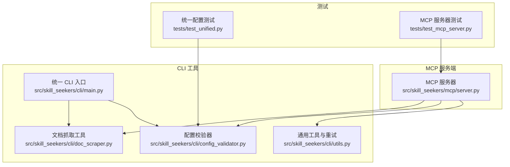
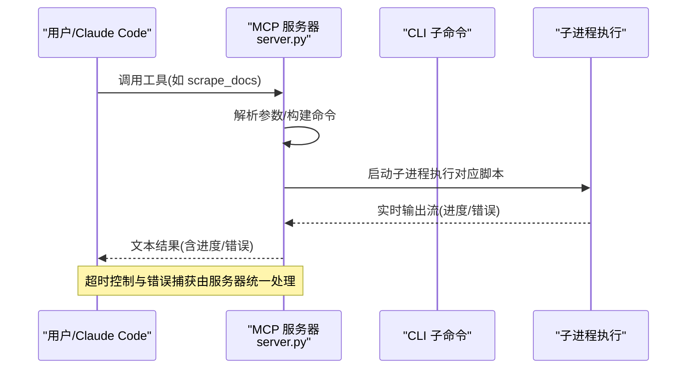

# 故障排除

<cite>
**本文引用的文件**
- [TROUBLESHOOTING.md](file://TROUBLESHOOTING.md)
- [docs/MCP_SETUP.md](file://docs/MCP_SETUP.md)
- [src/skill_seekers/mcp/server.py](file://src/skill_seekers/mcp/server.py)
- [src/skill_seekers/cli/utils.py](file://src/skill_seekers/cli/utils.py)
- [src/skill_seekers/cli/doc_scraper.py](file://src/skill_seekers/cli/doc_scraper.py)
- [src/skill_seekers/cli/config_validator.py](file://src/skill_seekers/cli/config_validator.py)
- [tests/test_unified.py](file://tests/test_unified.py)
- [tests/test_mcp_server.py](file://tests/test_mcp_server.py)
- [setup_mcp.sh](file://setup_mcp.sh)
</cite>

## 目录
1. [简介](#简介)
2. [项目结构与入口](#项目结构与入口)
3. [核心组件与常见问题定位](#核心组件与常见问题定位)
4. [架构总览与交互流程](#架构总览与交互流程)
5. [详细问题排查与解决方案](#详细问题排查与解决方案)
6. [依赖与环境问题排查](#依赖与环境问题排查)
7. [性能与超时处理](#性能与超时处理)
8. [测试验证与回归检查](#测试验证与回归检查)
9. [结论](#结论)

## 简介
本指南面向使用 Skill Seekers 的用户，聚焦安装失败、抓取超时、认证错误、配置解析失败、内容提取不完整、MCP 连接问题等常见问题，结合仓库中的故障排除文档、MCP 设置文档、CLI 工具与 MCP 服务器实现、以及测试用例，提供可操作的诊断步骤、根因分析与修复建议，并说明如何启用调试日志辅助定位问题。

## 项目结构与入口
- MCP 服务端位于 mcp 子模块，通过 Model Context Protocol 为 Claude Code 提供工具能力。
- CLI 统一入口提供多子命令，支持文档、GitHub、PDF 多源抓取与技能打包上传。
- 测试用例覆盖 MCP 工具链、统一配置校验与合并逻辑，便于回归验证。

图表来源
- [src/skill_seekers/mcp/server.py](file://src/skill_seekers/mcp/server.py#L1-L120)
- [src/skill_seekers/cli/main.py](file://src/skill_seekers/cli/main.py#L1-L120)
- [src/skill_seekers/cli/doc_scraper.py](file://src/skill_seekers/cli/doc_scraper.py#L50-L120)
- [src/skill_seekers/cli/config_validator.py](file://src/skill_seekers/cli/config_validator.py#L1-L80)
- [src/skill_seekers/cli/utils.py](file://src/skill_seekers/cli/utils.py#L236-L344)
- [tests/test_unified.py](file://tests/test_unified.py#L1-L120)
- [tests/test_mcp_server.py](file://tests/test_mcp_server.py#L1-L120)

章节来源
- [src/skill_seekers/mcp/server.py](file://src/skill_seekers/mcp/server.py#L1-L120)
- [src/skill_seekers/cli/main.py](file://src/skill_seekers/cli/main.py#L1-L120)

## 核心组件与常见问题定位
- 安装与依赖：模块缺失、权限不足、虚拟环境隔离、系统路径问题。
- 运行期问题：文件/目录不存在、配置文件缺失或路径错误、工作目录不正确。
- MCP 连接问题：服务器未加载、工具列表不可见、绝对路径占位符、工作目录不匹配、Claude Code 未完全重启。
- 抓取问题：网络不稳定、速率限制触发 429、选择器不匹配导致内容为空、超时或挂起。
- 配置解析失败：字段缺失、类型错误、来源类型非法、PDF 路径不存在。
- 内容提取不完整：选择器不当、站点反爬、llms.txt 缺失导致回退到慢速模式。
- 认证错误：API 密钥未设置或无效、GitHub Token 缺失或格式错误。

章节来源
- [TROUBLESHOOTING.md](file://TROUBLESHOOTING.md#L1-L120)
- [docs/MCP_SETUP.md](file://docs/MCP_SETUP.md#L296-L391)
- [src/skill_seekers/mcp/server.py](file://src/skill_seekers/mcp/server.py#L1-L120)

## 架构总览与交互流程
MCP 服务器作为工具宿主，将 CLI 子命令包装为工具，通过子进程调用对应脚本；同时提供配置校验、分页估算、PDF 抓取、路由生成等工具。

图表来源
- [src/skill_seekers/mcp/server.py](file://src/skill_seekers/mcp/server.py#L60-L120)
- [src/skill_seekers/mcp/server.py](file://src/skill_seekers/mcp/server.py#L719-L869)
- [src/skill_seekers/mcp/server.py](file://src/skill_seekers/mcp/server.py#L871-L930)

## 详细问题排查与解决方案

### 安装失败
- 症状
  - 命令找不到：python3 命令不存在
  - 模块缺失：ModuleNotFoundError: No module named 'requests' / 'beautifulsoup4' / 'mcp'
  - 权限不足：Permission denied: '/usr/local/lib/...' 或需要 sudo
- 根因
  - Python 版本过低或未安装
  - 依赖未安装或安装到不同 Python 环境
  - 使用系统级安装但无管理员权限
- 解决方案
  - 确认 Python 3.10+ 并使用 python3 命令
  - 安装依赖：pip3 install requests beautifulsoup4；pip3 install -r mcp/requirements.txt
  - 使用 --user 标志避免权限问题
  - 推荐使用虚拟环境隔离依赖
- 验证
  - 使用验证命令检查依赖是否可用
  - 在 Claude Code 中列出工具确认 MCP 可用

章节来源
- [TROUBLESHOOTING.md](file://TROUBLESHOOTING.md#L9-L83)
- [docs/MCP_SETUP.md](file://docs/MCP_SETUP.md#L52-L91)
- [setup_mcp.sh](file://setup_mcp.sh#L18-L100)

### 运行期文件/路径问题
- 症状
  - 文件未找到：cli/doc_scraper.py 不存在
  - 配置文件未找到：configs/react.json
- 根因
  - 当前工作目录不在仓库根目录
  - 配置文件路径错误或拼写错误
- 解决方案
  - 切换到仓库根目录再运行
  - 使用绝对路径或在当前目录下确认文件存在
  - 通过交互式生成配置文件

章节来源
- [TROUBLESHOOTING.md](file://TROUBLESHOOTING.md#L86-L133)

### MCP 连接与工具不可用
- 症状
  - 工具未出现在 Claude Code 中
  - “List all available configs” 不工作
  - 工具列表出现但执行报错
- 根因
  - 配置文件中使用了占位符而非真实绝对路径
  - 工作目录 cwd 与实际路径不一致
  - 未完全重启 Claude Code（退出后重新打开）
  - MCP 包未安装或权限问题
- 解决方案
  - 替换配置中的占位符为实际绝对路径
  - 确保 cwd 指向仓库根目录
  - 重新启动 Claude Code
  - 安装 MCP 依赖并确保可执行权限
- 验证
  - 手动启动服务器验证
  - 在 Claude Code 中列出工具并逐一测试

章节来源
- [TROUBLESHOOTING.md](file://TROUBLESHOOTING.md#L136-L229)
- [docs/MCP_SETUP.md](file://docs/MCP_SETUP.md#L108-L174)
- [docs/MCP_SETUP.md](file://docs/MCP_SETUP.md#L296-L391)

### 抓取超时与挂起
- 症状
  - 抓取长时间无响应
  - MCP 显示“进程被杀死”或超时
- 根因
  - 网络不稳定或目标站点限速
  - rate_limit 设置过低
  - 未设置 unlimited 导致超时计算不足
- 解决方案
  - 减少 max_pages 或增加 rate_limit
  - 使用 unlimited 模式进行大规模抓取
  - 检查网络连通性
- 验证
  - 使用 estimate_pages 预估页数
  - 在 Claude Code 中执行 dry-run 预览

章节来源
- [TROUBLESHOOTING.md](file://TROUBLESHOOTING.md#L231-L309)
- [src/skill_seekers/mcp/server.py](file://src/skill_seekers/mcp/server.py#L719-L869)

### 内容提取不完整/空内容
- 症状
  - 页面抓取成功但内容为空
- 根因
  - 选择器不匹配目标站点结构
  - 站点反爬机制或动态渲染
  - llms.txt 未检测到导致回退到慢速模式
- 解决方案
  - 在浏览器开发者工具中验证选择器
  - 尝试不同的 main_content、title、code_blocks 选择器
  - 确保站点可访问，必要时调整 selectors
- 验证
  - 使用较小 max_pages 快速验证
  - 查看日志中对选择器的警告

章节来源
- [TROUBLESHOOTING.md](file://TROUBLESHOOTING.md#L255-L281)
- [src/skill_seekers/cli/doc_scraper.py](file://src/skill_seekers/cli/doc_scraper.py#L213-L249)

### 配置解析失败
- 症状
  - 验证失败：缺少必填字段、类型错误、来源类型非法、PDF 路径不存在
- 根因
  - 字段缺失或类型不符
  - 来源类型不在允许集合内
  - GitHub 仓库格式不正确
  - PDF 路径不存在
- 解决方案
  - 使用 validate_config 工具检查配置
  - 修正字段类型与取值范围
  - 修正 repo 格式为 owner/repo
  - 确认 PDF 文件存在
- 验证
  - 运行测试用例中的配置校验场景

章节来源
- [src/skill_seekers/cli/config_validator.py](file://src/skill_seekers/cli/config_validator.py#L86-L200)
- [tests/test_unified.py](file://tests/test_unified.py#L88-L101)
- [tests/test_mcp_server.py](file://tests/test_mcp_server.py#L529-L559)

### 认证错误
- 症状
  - 无法自动上传：未设置 ANTHROPIC_API_KEY
  - GitHub 提交失败：缺少 GITHUB_TOKEN 或格式错误
- 根因
  - 环境变量未设置或拼写错误
  - Token 未授权或权限不足
- 解决方案
  - 设置 ANTHROPIC_API_KEY 并在 MCP 配置 env 中注入
  - 设置 GITHUB_TOKEN 或在调用参数中传入
  - 确认 token 权限足以访问目标仓库
- 验证
  - 在 MCP 中执行 package_skill 并观察是否自动上传
  - 提交配置后查看 GitHub Issue 是否创建成功

章节来源
- [src/skill_seekers/mcp/server.py](file://src/skill_seekers/mcp/server.py#L871-L930)
- [tests/test_mcp_server.py](file://tests/test_mcp_server.py#L618-L723)
- [docs/MCP_SETUP.md](file://docs/MCP_SETUP.md#L456-L476)

## 依赖与环境问题排查
- Python 版本与路径
  - 确认 python3 --version ≥ 3.10
  - 在虚拟环境中安装依赖，避免系统包冲突
- MCP 依赖
  - 安装 mcp、requests、beautifulsoup4
  - 确保 MCP 服务器可执行且路径正确
- Claude Code 配置
  - 使用绝对路径替换占位符
  - cwd 指向仓库根目录
  - 重启 Claude Code 完整关闭后再打开

章节来源
- [TROUBLESHOOTING.md](file://TROUBLESHOOTING.md#L311-L364)
- [docs/MCP_SETUP.md](file://docs/MCP_SETUP.md#L108-L174)
- [setup_mcp.sh](file://setup_mcp.sh#L18-L100)

## 性能与超时处理
- 超时策略
  - MCP 服务器根据操作类型设置超时：估算、抓取、打包、上传均有默认上限
  - unlimited 模式下可取消超时，但需用户明确意图
- 重试与退避
  - CLI 工具提供指数退避重试函数，适用于网络抖动
- 优化建议
  - 合理设置 rate_limit 与 max_pages
  - 使用 dry-run 与 estimate_pages 预估成本
  - 对于大型文档，考虑拆分配置与生成路由

章节来源
- [src/skill_seekers/mcp/server.py](file://src/skill_seekers/mcp/server.py#L719-L869)
- [src/skill_seekers/cli/utils.py](file://src/skill_seekers/cli/utils.py#L236-L344)

## 测试验证与回归检查
- 配置校验测试
  - 覆盖统一格式检测、来源类型校验、非法类型报错、兼容旧版转换
- MCP 工具链测试
  - 覆盖工具注册、参数校验、异常捕获、提交配置的字段校验与 GitHub 交互
- 回归建议
  - 使用 pytest 运行测试套件，确保 MCP 工具链稳定
  - 针对配置变更与工具更新，重复执行关键测试用例

章节来源
- [tests/test_unified.py](file://tests/test_unified.py#L1-L120)
- [tests/test_mcp_server.py](file://tests/test_mcp_server.py#L1-L120)

## 结论
通过结合仓库内的故障排除文档、MCP 设置指南、CLI 与 MCP 服务器实现细节，以及测试用例，可以系统化地定位与解决安装、MCP 连接、抓取超时、配置解析、内容提取不完整、认证错误等问题。建议在每次变更后运行测试套件进行回归验证，并在 Claude Code 中逐步验证工具链的可用性。