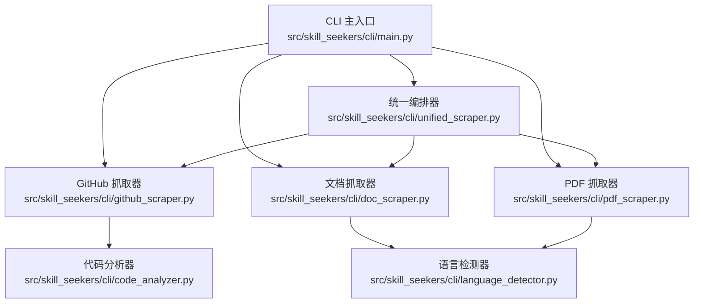
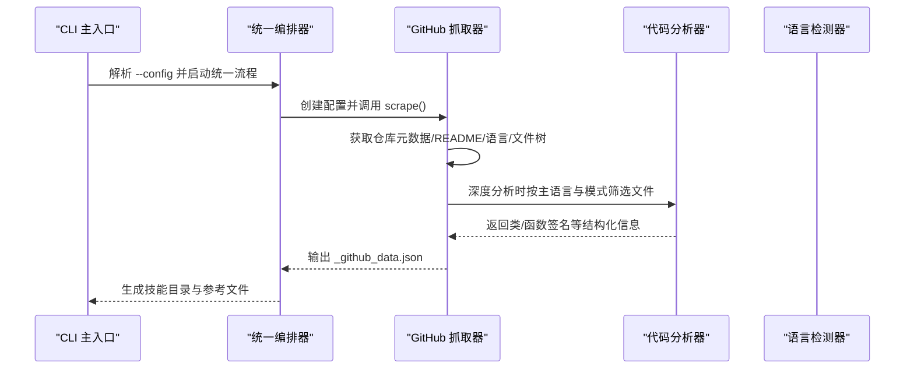
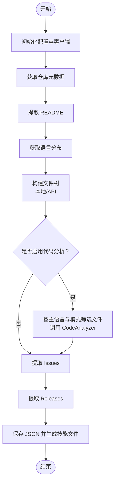
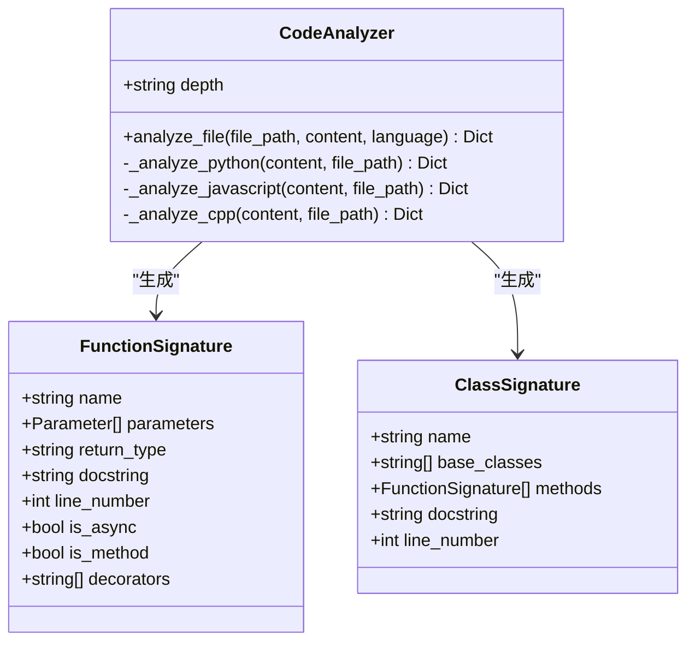
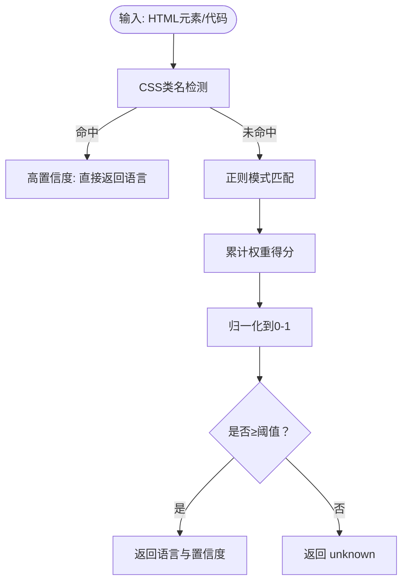
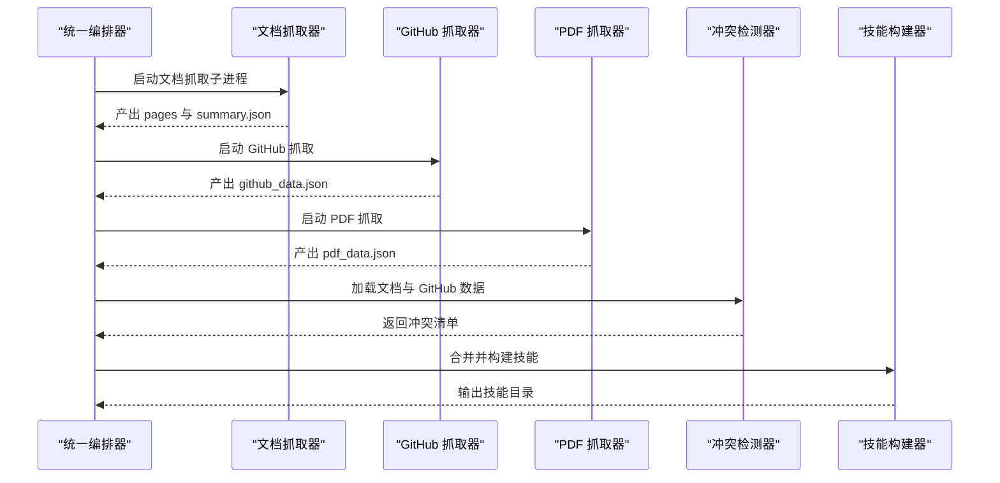
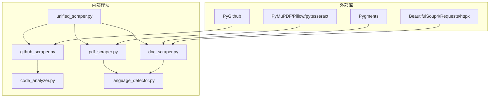

# GitHub代码库分析

<cite>
**本文引用的文件**
- [github_scraper.py](file://src/skill_seekers/cli/github_scraper.py)
- [code_analyzer.py](file://src/skill_seekers/cli/code_analyzer.py)
- [language_detector.py](file://src/skill_seekers/cli/language_detector.py)
- [unified_scraper.py](file://src/skill_seekers/cli/unified_scraper.py)
- [main.py](file://src/skill_seekers/cli/main.py)
- [requirements.txt](file://requirements.txt)
- [react_github.json](file://configs/react_github.json)
- [godot_unified.json](file://configs/godot_unified.json)
- [pdf_scraper.py](file://src/skill_seekers/cli/pdf_scraper.py)
- [doc_scraper.py](file://src/skill_seekers/cli/doc_scraper.py)
</cite>

## 目录
1. [简介](#简介)
2. [项目结构](#项目结构)
3. [核心组件](#核心组件)
4. [架构总览](#架构总览)
5. [详细组件分析](#详细组件分析)
6. [依赖关系分析](#依赖关系分析)
7. [性能考量](#性能考量)
8. [故障排查指南](#故障排查指南)
9. [结论](#结论)
10. [附录](#附录)

## 简介
本文件围绕 Skill Seekers 项目中的 GitHub 代码库分析能力展开，重点说明以下三类脚本如何协同工作：
- github_scraper.py：通过 PyGithub 库与 GitHub API 交互，提取仓库元数据、README、语言分布、文件树、Issues、Releases，并在需要时调用本地或 API 模式抓取代码文件；同时支持将结果转换为 Claude 技能格式。
- code_analyzer.py：对目标语言的源码进行解析，抽取类、函数签名、参数类型、默认值、装饰器、异步标记等信息，支持 Python、JavaScript/TypeScript、C/C++ 的不同解析策略。
- language_detector.py：基于文件扩展名与内容特征，对代码块进行技术栈识别，提供置信度评分，辅助统一多来源内容的语言分类。

此外，文档还结合实际配置文件与命令入口，展示如何在大型仓库中高效提取有价值信息，并讨论速率限制处理、认证机制与私有仓库访问策略。

## 项目结构
该项目采用“CLI 统一入口 + 多子工具”的模块化组织方式：
- CLI 入口负责解析命令与参数，并将控制权委托给具体子工具（scrape、github、pdf、unified 等）。
- 各子工具内部再按功能拆分：GitHub 抓取、文档抓取、PDF 提取、语言检测、统一合并等。
- 配置文件以 JSON 形式定义抓取范围、过滤规则、输出路径等。

图表来源
- [main.py](file://src/skill_seekers/cli/main.py#L222-L370)
- [github_scraper.py](file://src/skill_seekers/cli/github_scraper.py#L1-L220)
- [code_analyzer.py](file://src/skill_seekers/cli/code_analyzer.py#L1-L120)
- [language_detector.py](file://src/skill_seekers/cli/language_detector.py#L1-L120)
- [unified_scraper.py](file://src/skill_seekers/cli/unified_scraper.py#L1-L120)
- [doc_scraper.py](file://src/skill_seekers/cli/doc_scraper.py#L1-L120)
- [pdf_scraper.py](file://src/skill_seekers/cli/pdf_scraper.py#L1-L120)

章节来源
- [main.py](file://src/skill_seekers/cli/main.py#L222-L370)

## 核心组件
- GitHub 抓取器（GitHubScraper）
  - 使用 PyGithub 访问 GitHub API，获取仓库元数据、README、语言分布、文件树、Issues、Releases。
  - 支持本地模式（无速率限制）与 API 模式（受速率限制），并可按文件扩展名与通配符模式筛选分析对象。
  - 可选深度分析：表面层（仅文件树）、深度分析（解析签名与测试示例）、未来可扩展全量 AST 分析。
- 代码分析器（CodeAnalyzer）
  - Python：使用 AST 解析类与函数签名，提取参数类型注解、默认值、返回类型、装饰器、是否异步、是否方法等。
  - JavaScript/TypeScript：使用正则匹配类与函数声明，提取参数列表、箭头函数、异步标记等。
  - C/C++：针对头文件的简化解析，提取类与函数声明。
- 语言检测器（LanguageDetector）
  - 基于 CSS 类名与正则模式权重打分，计算置信度，支持 20+ 种语言。
  - 对短文本与未知语言给出兜底策略，阈值可配置。

章节来源
- [github_scraper.py](file://src/skill_seekers/cli/github_scraper.py#L1-L220)
- [code_analyzer.py](file://src/skill_seekers/cli/code_analyzer.py#L1-L120)
- [language_detector.py](file://src/skill_seekers/cli/language_detector.py#L1-L120)

## 架构总览
下图展示了 CLI 如何调度各子工具，以及 GitHub 抓取器与代码分析器之间的协作关系。

图表来源
- [main.py](file://src/skill_seekers/cli/main.py#L222-L370)
- [unified_scraper.py](file://src/skill_seekers/cli/unified_scraper.py#L169-L214)
- [github_scraper.py](file://src/skill_seekers/cli/github_scraper.py#L169-L220)
- [code_analyzer.py](file://src/skill_seekers/cli/code_analyzer.py#L72-L120)

## 详细组件分析

### GitHub 抓取器（GitHubScraper）
- 初始化与配置
  - 从环境变量或配置读取 GitHub Token，优先级：GITHUB_TOKEN > 配置文件 > 未认证（低限速）。
  - 支持自定义排除目录（默认 + 可替换/追加），并区分本地模式与 API 模式。
- 数据采集流程
  - 仓库元数据：名称、完整名、描述、URL、主页、星标、fork、开放问题数、默认分支、创建/更新时间、语言、许可证、主题。
  - README：在常见位置尝试获取，支持多种扩展名。
  - 语言分布：调用 API 获取字节分布并换算百分比。
  - 文件树：本地模式无限制；API 模式受限，采用递归遍历。
  - Issues：按状态排序，过滤 PR，截取摘要。
  - Releases：版本号、标题、正文、草稿/预发布、发布时间、下载链接。
- 深度分析（可选）
  - 基于主语言映射到扩展名集合，按文件模式匹配后读取内容，调用 CodeAnalyzer 进行签名抽取。
  - API 模式下限制分析文件数量以避免超限。
- 转换为技能
  - 将提取的数据写入 JSON，并生成 SKILL.md 与 references 下的 README、CHANGELOG、issues、releases、file_structure 等参考文件。

图表来源
- [github_scraper.py](file://src/skill_seekers/cli/github_scraper.py#L169-L220)
- [github_scraper.py](file://src/skill_seekers/cli/github_scraper.py#L246-L303)
- [github_scraper.py](file://src/skill_seekers/cli/github_scraper.py#L328-L419)
- [github_scraper.py](file://src/skill_seekers/cli/github_scraper.py#L420-L532)
- [github_scraper.py](file://src/skill_seekers/cli/github_scraper.py#L533-L616)
- [github_scraper.py](file://src/skill_seekers/cli/github_scraper.py#L617-L640)

章节来源
- [github_scraper.py](file://src/skill_seekers/cli/github_scraper.py#L1-L220)
- [github_scraper.py](file://src/skill_seekers/cli/github_scraper.py#L246-L303)
- [github_scraper.py](file://src/skill_seekers/cli/github_scraper.py#L328-L419)
- [github_scraper.py](file://src/skill_seekers/cli/github_scraper.py#L420-L532)
- [github_scraper.py](file://src/skill_seekers/cli/github_scraper.py#L533-L616)
- [github_scraper.py](file://src/skill_seekers/cli/github_scraper.py#L617-L744)

### 代码分析器（CodeAnalyzer）
- Python
  - 使用 AST 遍历节点，识别类与函数（含异步函数），提取基类、参数类型注解、默认值、返回类型、装饰器、文档字符串、行号等。
  - 判断顶层函数与方法的区别，避免误判嵌套函数为顶层函数。
- JavaScript/TypeScript
  - 使用正则匹配类与函数声明，提取箭头函数、async 标记、参数列表（包含默认值与类型注解）。
  - 对类体内的方法进行简化提取。
- C/C++
  - 针对头文件的简化解析，提取类与函数声明，处理指针与引用形式的参数。
- 错误处理
  - 语法错误与异常捕获，保证单文件分析失败不影响整体流程。

图表来源
- [code_analyzer.py](file://src/skill_seekers/cli/code_analyzer.py#L58-L120)
- [code_analyzer.py](file://src/skill_seekers/cli/code_analyzer.py#L103-L226)
- [code_analyzer.py](file://src/skill_seekers/cli/code_analyzer.py#L227-L373)
- [code_analyzer.py](file://src/skill_seekers/cli/code_analyzer.py#L374-L465)

章节来源
- [code_analyzer.py](file://src/skill_seekers/cli/code_analyzer.py#L1-L120)
- [code_analyzer.py](file://src/skill_seekers/cli/code_analyzer.py#L103-L226)
- [code_analyzer.py](file://src/skill_seekers/cli/code_analyzer.py#L227-L373)
- [code_analyzer.py](file://src/skill_seekers/cli/code_analyzer.py#L374-L465)

### 语言检测器（LanguageDetector）
- 两阶段检测
  - CSS 类名阶段：若存在 language-* 或 lang-* 等类名，直接返回高置信度语言。
  - 正则模式阶段：对代码内容进行加权匹配，统计每种语言得分并归一化到 0-1 区间，低于阈值则判定为 unknown。
- 已知语言列表与权重
  - 覆盖前端（JS/TS/JSX/TSX/Vue）、后端（Java/Go/Rust/PHP）、系统/数据（Python/R/Julia/SQL）、系统（C/C++/GDScript）、标记/配置（HTML/CSS/JSON/YAML/XML/Markdown）、脚本（Bash/Shell/PowerShell）等。
- 性能优化
  - 预编译正则表达式并缓存，降低重复匹配开销。

图表来源
- [language_detector.py](file://src/skill_seekers/cli/language_detector.py#L426-L482)
- [language_detector.py](file://src/skill_seekers/cli/language_detector.py#L483-L528)
- [language_detector.py](file://src/skill_seekers/cli/language_detector.py#L529-L555)

章节来源
- [language_detector.py](file://src/skill_seekers/cli/language_detector.py#L1-L120)
- [language_detector.py](file://src/skill_seekers/cli/language_detector.py#L426-L482)
- [language_detector.py](file://src/skill_seekers/cli/language_detector.py#L483-L528)
- [language_detector.py](file://src/skill_seekers/cli/language_detector.py#L529-L555)

### 统一编排器（UnifiedScraper）
- 多源抓取
  - 文档网站：通过 doc_scraper 子进程执行，支持并发与断点续爬。
  - GitHub 仓库：复用 GitHubScraper，支持本地路径与远程仓库两种模式。
  - PDF 文档：通过 pdf_scraper 执行，支持章节与关键词分类。
- 冲突检测与合并
  - 在需要 API 合并时，加载文档与 GitHub 数据，检测冲突并生成汇总。
  - 支持规则合并与 Claude 增强合并两种模式。
- 技能构建
  - 生成最终技能目录与参考文件，输出统一结果。

图表来源
- [unified_scraper.py](file://src/skill_seekers/cli/unified_scraper.py#L84-L118)
- [unified_scraper.py](file://src/skill_seekers/cli/unified_scraper.py#L169-L214)
- [unified_scraper.py](file://src/skill_seekers/cli/unified_scraper.py#L249-L304)
- [unified_scraper.py](file://src/skill_seekers/cli/unified_scraper.py#L305-L348)
- [unified_scraper.py](file://src/skill_seekers/cli/unified_scraper.py#L349-L379)

章节来源
- [unified_scraper.py](file://src/skill_seekers/cli/unified_scraper.py#L1-L120)
- [unified_scraper.py](file://src/skill_seekers/cli/unified_scraper.py#L169-L214)
- [unified_scraper.py](file://src/skill_seekers/cli/unified_scraper.py#L249-L304)
- [unified_scraper.py](file://src/skill_seekers/cli/unified_scraper.py#L305-L348)
- [unified_scraper.py](file://src/skill_seekers/cli/unified_scraper.py#L349-L379)

## 依赖关系分析
- 外部依赖
  - PyGithub：用于 GitHub API 访问与速率限制处理。
  - BeautifulSoup、Requests、httpx：用于文档抓取与网络请求。
  - PyMuPDF、Pillow、pytesseract：用于 PDF 提取与 OCR。
  - Pygments：用于代码高亮与语言识别辅助。
- 内部依赖
  - GitHub 抓取器依赖代码分析器进行深度分析。
  - 文档抓取器与 PDF 抓取器依赖语言检测器进行代码块语言识别。
  - 统一编排器协调多源抓取、冲突检测与技能构建。

图表来源
- [requirements.txt](file://requirements.txt#L1-L44)
- [github_scraper.py](file://src/skill_seekers/cli/github_scraper.py#L1-L60)
- [doc_scraper.py](file://src/skill_seekers/cli/doc_scraper.py#L1-L60)
- [pdf_scraper.py](file://src/skill_seekers/cli/pdf_scraper.py#L1-L60)
- [unified_scraper.py](file://src/skill_seekers/cli/unified_scraper.py#L1-L60)

章节来源
- [requirements.txt](file://requirements.txt#L1-L44)

## 性能考量
- 速率限制与认证
  - 未提供 Token 时使用未认证访问，API 速率较低；建议设置 GITHUB_TOKEN 环境变量以提升限额。
  - GitHub 抓取器在 API 模式下对分析文件数量进行上限控制，避免触发速率限制。
- 本地模式优势
  - 本地模式可无限制遍历文件系统，适合大型仓库的深度分析；但需确保本地仓库完整且安全。
- 并发与断点续爬
  - 文档抓取器支持多线程/异步与断点续爬，减少重复工作量。
- 语言检测性能
  - 预编译正则并缓存，降低重复匹配成本；对短文本与未知语言采用快速判定，避免无效计算。

章节来源
- [github_scraper.py](file://src/skill_seekers/cli/github_scraper.py#L149-L168)
- [github_scraper.py](file://src/skill_seekers/cli/github_scraper.py#L514-L532)
- [doc_scraper.py](file://src/skill_seekers/cli/doc_scraper.py#L1-L120)
- [language_detector.py](file://src/skill_seekers/cli/language_detector.py#L418-L426)

## 故障排查指南
- GitHub API 速率限制
  - 现象：抛出速率限制异常或返回警告。
  - 处理：提供 GITHUB_TOKEN 环境变量；必要时降低并发与分析深度。
  - 参考路径：[速率限制处理](file://src/skill_seekers/cli/github_scraper.py#L204-L213)
- 仓库不存在或权限不足
  - 现象：404 错误或权限错误。
  - 处理：检查仓库名拼写与访问权限；私有仓库需使用 Token。
  - 参考路径：[仓库获取与错误处理](file://src/skill_seekers/cli/github_scraper.py#L241-L245)
- 本地路径不存在
  - 现象：日志提示本地路径不存在。
  - 处理：确认本地仓库路径正确并具备读取权限。
  - 参考路径：[本地文件树构建](file://src/skill_seekers/cli/github_scraper.py#L340-L344)
- 代码分析失败
  - 现象：语法错误导致分析中断。
  - 处理：跳过该文件并记录调试日志；可调整文件模式或语言映射。
  - 参考路径：[代码分析异常捕获](file://src/skill_seekers/cli/code_analyzer.py#L90-L102)
- 语言检测置信度过低
  - 现象：返回 unknown。
  - 处理：提高最小置信度阈值或增加模式权重；确认代码块长度足够。
  - 参考路径：[置信度阈值与兜底](file://src/skill_seekers/cli/language_detector.py#L477-L482)

章节来源
- [github_scraper.py](file://src/skill_seekers/cli/github_scraper.py#L204-L213)
- [github_scraper.py](file://src/skill_seekers/cli/github_scraper.py#L241-L245)
- [github_scraper.py](file://src/skill_seekers/cli/github_scraper.py#L340-L344)
- [code_analyzer.py](file://src/skill_seekers/cli/code_analyzer.py#L90-L102)
- [language_detector.py](file://src/skill_seekers/cli/language_detector.py#L477-L482)

## 结论
本项目通过 CLI 统一入口与模块化设计，实现了对 GitHub 仓库的深度分析与技能生成。GitHub 抓取器借助 PyGithub 完成元数据、README、语言分布、文件树、Issues、Releases 的提取，并在需要时联动代码分析器进行签名抽取；语言检测器为多源内容提供一致的语言识别能力；统一编排器将文档、GitHub 与 PDF 多源数据整合，完成冲突检测与技能构建。配合速率限制处理、认证机制与本地模式，可在大型仓库中高效稳定地提取有价值信息。

## 附录
- 命令与配置示例
  - GitHub 抓取：使用配置文件指定仓库、Token、是否包含 Issues/Changelog/Releases、是否启用代码分析与文件模式。
    - 示例配置：[react_github.json](file://configs/react_github.json#L1-L16)
  - 统一编排：组合文档与 GitHub 源，支持规则合并与 Claude 增强合并。
    - 示例配置：[godot_unified.json](file://configs/godot_unified.json#L1-L51)
  - CLI 入口：统一命令行接口，支持 scrape、github、pdf、unified 等子命令。
    - 参考路径：[CLI 主入口](file://src/skill_seekers/cli/main.py#L222-L370)

章节来源
- [react_github.json](file://configs/react_github.json#L1-L16)
- [godot_unified.json](file://configs/godot_unified.json#L1-L51)
- [main.py](file://src/skill_seekers/cli/main.py#L222-L370)