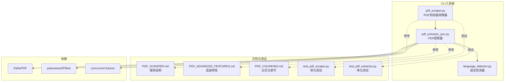
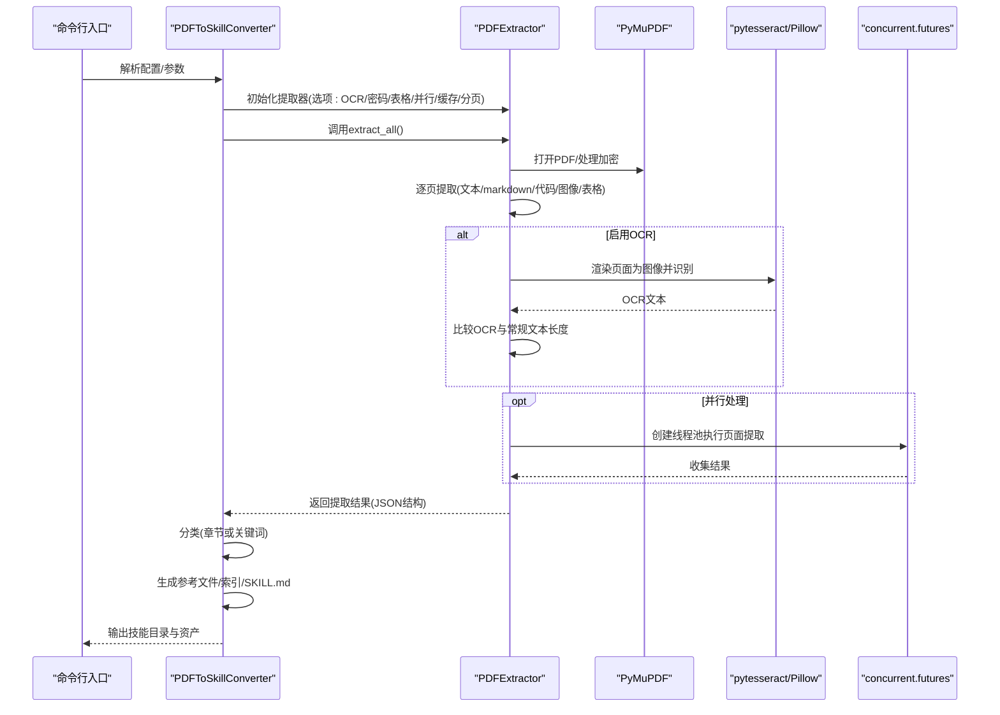
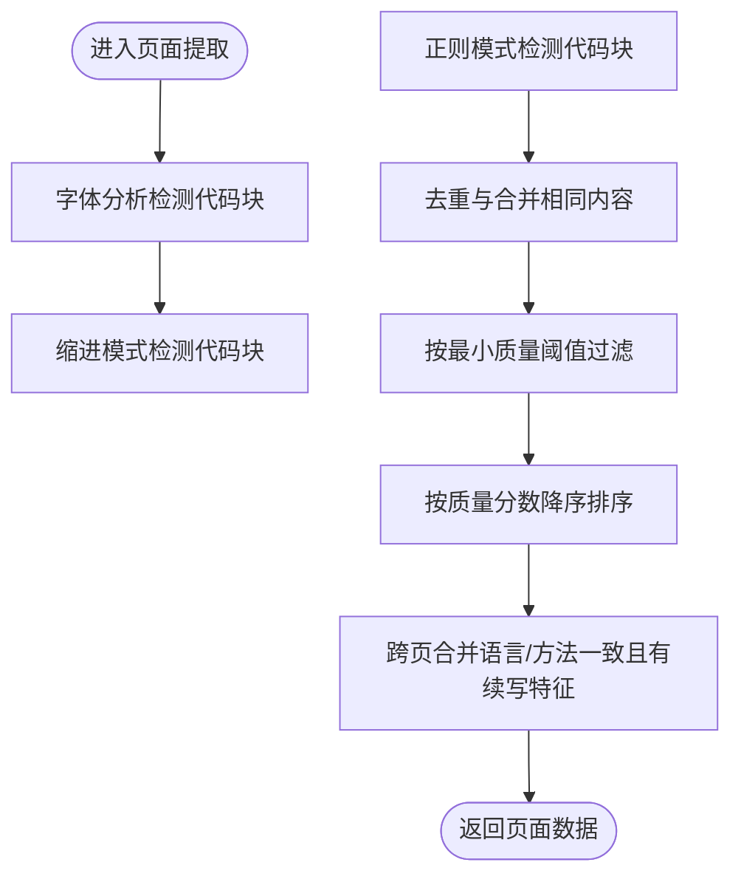
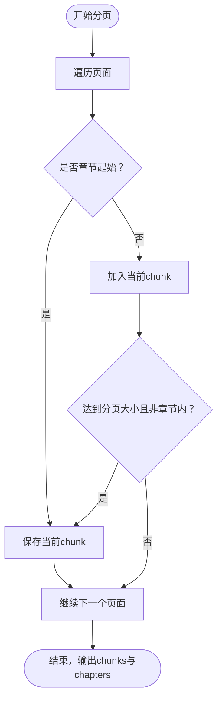
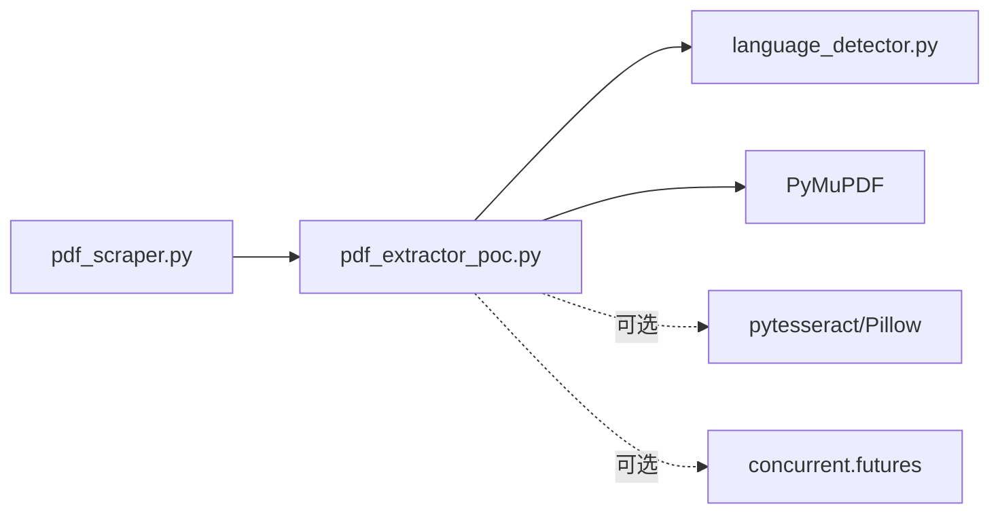

# PDF内容提取

<cite>
**本文引用的文件**
- [pdf_scraper.py](file://src/skill_seekers/cli/pdf_scraper.py)
- [pdf_extractor_poc.py](file://src/skill_seekers/cli/pdf_extractor_poc.py)
- [language_detector.py](file://src/skill_seekers/cli/language_detector.py)
- [PDF_SCRAPER.md](file://docs/PDF_SCRAPER.md)
- [PDF_ADVANCED_FEATURES.md](file://docs/PDF_ADVANCED_FEATURES.md)
- [PDF_CHUNKING.md](file://docs/PDF_CHUNKING.md)
- [test_pdf_scraper.py](file://tests/test_pdf_scraper.py)
- [test_pdf_extractor.py](file://tests/test_pdf_extractor.py)
- [requirements.txt](file://requirements.txt)
</cite>

## 目录
1. [简介](#简介)
2. [项目结构](#项目结构)
3. [核心组件](#核心组件)
4. [架构总览](#架构总览)
5. [详细组件分析](#详细组件分析)
6. [依赖关系分析](#依赖关系分析)
7. [性能考量](#性能考量)
8. [故障排查指南](#故障排查指南)
9. [结论](#结论)
10. [附录](#附录)

## 简介
本文件面向使用PyMuPDF的PDF处理流程进行全面解析，重点覆盖以下方面：
- 如何加载PDF文档、解析页面结构、提取纯文本内容
- 图像与表格的识别与导出
- OCR支持（含外部依赖）及启用方式
- 分页策略与文本块分割算法
- 加密PDF的处理与密码认证
- 大型文档的内存优化策略与并行处理机制
- 结合PDF_ADVANCED_FEATURES.md的高级特性：注释提取、书签解析、字体分析等
- 性能调优建议与常见格式兼容性问题的解决方案

## 项目结构
该仓库围绕“PDF内容提取”构建了两条主线：
- 提取层：基于PyMuPDF的完整提取器，负责文本、代码、图像、表格、章节等信息抽取，并提供质量评分与缓存、并行等高级能力。
- 构建层：将提取结果转换为Claude技能所需的结构化输出（Markdown索引、参考文件、统计信息等）。

图表来源
- [pdf_scraper.py](file://src/skill_seekers/cli/pdf_scraper.py#L1-L120)
- [pdf_extractor_poc.py](file://src/skill_seekers/cli/pdf_extractor_poc.py#L1-L120)
- [language_detector.py](file://src/skill_seekers/cli/language_detector.py#L1-L120)
- [PDF_SCRAPER.md](file://docs/PDF_SCRAPER.md#L1-L120)
- [PDF_ADVANCED_FEATURES.md](file://docs/PDF_ADVANCED_FEATURES.md#L1-L120)
- [PDF_CHUNKING.md](file://docs/PDF_CHUNKING.md#L1-L120)

章节来源
- [pdf_scraper.py](file://src/skill_seekers/cli/pdf_scraper.py#L1-L120)
- [pdf_extractor_poc.py](file://src/skill_seekers/cli/pdf_extractor_poc.py#L1-L120)
- [PDF_SCRAPER.md](file://docs/PDF_SCRAPER.md#L1-L120)

## 核心组件
- PDFToSkillConverter：负责从PDF提取数据、分类内容、生成技能目录与参考文件、打包输出。
- PDFExtractor：基于PyMuPDF的完整提取器，支持OCR、密码保护、表格提取、并行处理、缓存、章节检测、代码块合并、质量评分等。
- LanguageDetector：统一的语言检测器，用于代码块语言识别与置信度评分。

章节来源
- [pdf_scraper.py](file://src/skill_seekers/cli/pdf_scraper.py#L25-L120)
- [pdf_extractor_poc.py](file://src/skill_seekers/cli/pdf_extractor_poc.py#L84-L120)
- [language_detector.py](file://src/skill_seekers/cli/language_detector.py#L385-L480)

## 架构总览
下图展示从命令行到最终技能输出的端到端流程。

图表来源
- [pdf_scraper.py](file://src/skill_seekers/cli/pdf_scraper.py#L47-L120)
- [pdf_extractor_poc.py](file://src/skill_seekers/cli/pdf_extractor_poc.py#L828-L995)
- [PDF_ADVANCED_FEATURES.md](file://docs/PDF_ADVANCED_FEATURES.md#L30-L120)

## 详细组件分析

### PDFToSkillConverter（PDF到技能转换器）
职责与流程：
- 从PDF加载并调用PDFExtractor进行内容提取，保存中间JSON以便迭代。
- 从已有的提取JSON构建技能结构。
- 基于章节或关键词对页面进行分类。
- 生成参考文件、索引与主技能说明文件（SKILL.md）。
- 将图片导出到assets目录并在参考文件中引用。

关键点：
- 提取选项来自配置，如分页大小、最小质量、是否提取图片、图片尺寸阈值等。
- 分类逻辑优先使用章节信息；若无章节则按关键词匹配进行分类。
- 参考文件限制每页文本长度，仅保留前若干字符；代码示例最多保留前几个高质量示例；图片保存到assets并生成相对路径引用。

章节来源
- [pdf_scraper.py](file://src/skill_seekers/cli/pdf_scraper.py#L47-L200)
- [pdf_scraper.py](file://src/skill_seekers/cli/pdf_scraper.py#L200-L337)
- [PDF_SCRAPER.md](file://docs/PDF_SCRAPER.md#L120-L220)

### PDFExtractor（PDF提取器）
职责与流程：
- 打开PDF，支持密码认证（加密PDF）。
- 逐页提取文本（常规与OCR）、Markdown、代码块、图像、表格。
- 多种代码块检测方法：字体分析（等宽字体）、缩进模式、正则模式。
- 代码块去重、按质量排序、按最小质量阈值过滤。
- 章节检测（H1/H2标题、常见章节前缀、编号段落）。
- 跨页代码块合并（语言一致、检测方法一致、续写特征）。
- 分页策略：可配置分页大小，尊重章节边界，形成chunks。
- 高级特性：OCR（扫描版PDF）、表格提取、并行处理、缓存。

OCR支持：
- 当页面常规文本长度低于阈值且启用OCR时，渲染页面为图像并使用Tesseract进行识别；若OCR文本更长则采用OCR结果。
- 依赖：pytesseract、Pillow；未安装时会提示安装。

加密PDF处理：
- 若PDF被加密，需要提供密码；认证失败则返回错误。

表格提取：
- 使用PyMuPDF的表格检测接口，返回表格二维数组、包围盒、行列数等元数据。

并行处理：
- 使用ThreadPoolExecutor并行提取页面；仅当PDF页数较多且并发可用时启用。

缓存：
- 按页号缓存页面结果，避免重复计算；适合调试与多次运行。

章节与分页：
- 章节检测优先检查页面首行标题与常见章节模式。
- 分页策略在章节边界处断开，达到固定页数后形成一个chunk。

质量评分与语法校验：
- 综合语言置信度、代码长度、行数、函数/类定义、变量命名、语法一致性等因素打分。
- 对常见语言进行基础语法校验（括号平衡、缩进一致性、注释比例等）。

章节来源
- [pdf_extractor_poc.py](file://src/skill_seekers/cli/pdf_extractor_poc.py#L84-L120)
- [pdf_extractor_poc.py](file://src/skill_seekers/cli/pdf_extractor_poc.py#L121-L170)
- [pdf_extractor_poc.py](file://src/skill_seekers/cli/pdf_extractor_poc.py#L171-L210)
- [pdf_extractor_poc.py](file://src/skill_seekers/cli/pdf_extractor_poc.py#L217-L336)
- [pdf_extractor_poc.py](file://src/skill_seekers/cli/pdf_extractor_poc.py#L337-L510)
- [pdf_extractor_poc.py](file://src/skill_seekers/cli/pdf_extractor_poc.py#L511-L593)
- [pdf_extractor_poc.py](file://src/skill_seekers/cli/pdf_extractor_poc.py#L594-L665)
- [pdf_extractor_poc.py](file://src/skill_seekers/cli/pdf_extractor_poc.py#L666-L729)
- [pdf_extractor_poc.py](file://src/skill_seekers/cli/pdf_extractor_poc.py#L730-L827)
- [pdf_extractor_poc.py](file://src/skill_seekers/cli/pdf_extractor_poc.py#L828-L995)
- [PDF_ADVANCED_FEATURES.md](file://docs/PDF_ADVANCED_FEATURES.md#L30-L120)
- [PDF_CHUNKING.md](file://docs/PDF_CHUNKING.md#L140-L218)

### LanguageDetector（语言检测器）
职责与流程：
- 基于预设的多语言模式权重进行置信度评分，返回最高分语言与置信度。
- 支持CSS类名直接识别高置信度语言（如language-python）。
- 对短文本或低置信度返回unknown。

章节来源
- [language_detector.py](file://src/skill_seekers/cli/language_detector.py#L1-L120)
- [language_detector.py](file://src/skill_seekers/cli/language_detector.py#L385-L555)

### 流程与算法可视化

#### 代码块检测与合并流程

图表来源
- [pdf_extractor_poc.py](file://src/skill_seekers/cli/pdf_extractor_poc.py#L337-L510)
- [pdf_extractor_poc.py](file://src/skill_seekers/cli/pdf_extractor_poc.py#L511-L593)
- [pdf_extractor_poc.py](file://src/skill_seekers/cli/pdf_extractor_poc.py#L730-L827)

#### 分页与章节检测流程

图表来源
- [pdf_extractor_poc.py](file://src/skill_seekers/cli/pdf_extractor_poc.py#L594-L665)
- [PDF_CHUNKING.md](file://docs/PDF_CHUNKING.md#L218-L255)

## 依赖关系分析
- 内部依赖
  - pdf_scraper.py依赖pdf_extractor_poc.py进行提取。
  - pdf_extractor_poc.py依赖language_detector.py进行语言识别。
- 外部依赖
  - PyMuPDF：PDF文档读取与页面操作。
  - pytesseract + Pillow：OCR识别。
  - concurrent.futures：并行处理。
- 安装与版本
  - requirements.txt中包含PyMuPDF、pytesseract、Pillow、pytest等依赖。

图表来源
- [pdf_scraper.py](file://src/skill_seekers/cli/pdf_scraper.py#L20-L30)
- [pdf_extractor_poc.py](file://src/skill_seekers/cli/pdf_extractor_poc.py#L51-L82)
- [requirements.txt](file://requirements.txt#L1-L44)

章节来源
- [requirements.txt](file://requirements.txt#L1-L44)
- [pdf_scraper.py](file://src/skill_seekers/cli/pdf_scraper.py#L20-L30)
- [pdf_extractor_poc.py](file://src/skill_seekers/cli/pdf_extractor_poc.py#L51-L82)

## 性能考量
- 并行处理
  - 在页数较多且并发可用时启用线程池并行提取，显著缩短大文档处理时间。
  - 建议工作线程数与CPU核心数匹配；注意内存占用随线程数增加而上升。
- 缓存
  - 默认启用内存缓存，避免重复计算；适合调试与快速迭代。
- 分页策略
  - 合理设置chunk_size可在章节边界处断开，便于后续按章节处理与组织。
- OCR成本
  - OCR每页耗时较高，建议与并行结合使用；同时注意扫描质量对OCR效果的影响。
- 图像与表格
  - 图像提取可能产生大量小图，建议提高最小尺寸阈值以减少噪声。
  - 表格提取对复杂合并单元格支持有限，必要时进行人工复核。

章节来源
- [PDF_ADVANCED_FEATURES.md](file://docs/PDF_ADVANCED_FEATURES.md#L226-L386)
- [PDF_ADVANCED_FEATURES.md](file://docs/PDF_ADVANCED_FEATURES.md#L390-L473)
- [PDF_CHUNKING.md](file://docs/PDF_CHUNKING.md#L294-L312)

## 故障排查指南
- OCR不可用
  - 现象：提示OCR请求但未安装pytesseract。
  - 处理：安装pytesseract与Pillow，并确保系统已安装Tesseract引擎。
- 密码错误或缺失
  - 现象：加密PDF提示无效密码或未提供密码。
  - 处理：提供正确密码；敏感场景建议通过环境变量传递。
- 并行导致内存不足
  - 现象：大文档并行时内存溢出。
  - 处理：降低工作线程数或禁用并行；减少图像提取或提高最小尺寸阈值。
- 表格未被识别
  - 现象：表格未被检测或数据异常。
  - 处理：确认表格为实际表格而非图片；使用详细日志观察检测尝试；对复杂表格进行手动后处理。
- 代码块质量过低
  - 现象：提取到大量低质量示例。
  - 处理：提高最小质量阈值；调整分页大小以改善章节检测准确性。

章节来源
- [PDF_ADVANCED_FEATURES.md](file://docs/PDF_ADVANCED_FEATURES.md#L419-L521)
- [PDF_SCRAPER.md](file://docs/PDF_SCRAPER.md#L501-L564)

## 结论
本方案以PyMuPDF为核心，结合OCR、密码支持、表格提取、并行处理与缓存等高级特性，实现了对复杂PDF文档的高效内容提取与结构化输出。通过章节检测与分页策略，能够有效组织大规模文档；通过质量评分与语法校验，提升代码块的可用性。配合CLI工具链，可将PDF内容转换为Claude技能，满足知识沉淀与智能问答需求。

## 附录

### 高级特性与使用要点（结合PDF_ADVANCED_FEATURES.md）
- OCR支持：扫描版PDF自动触发OCR；需安装pytesseract与Pillow；建议与并行结合。
- 加密PDF：提供密码认证；认证失败会终止处理。
- 表格提取：使用PyMuPDF表格检测；复杂合并单元格需人工复核。
- 并行处理：自动检测CPU核心数；仅在页数较多时启用。
- 缓存：默认启用内存缓存，适合调试与快速迭代。

章节来源
- [PDF_ADVANCED_FEATURES.md](file://docs/PDF_ADVANCED_FEATURES.md#L30-L120)
- [PDF_ADVANCED_FEATURES.md](file://docs/PDF_ADVANCED_FEATURES.md#L147-L224)
- [PDF_ADVANCED_FEATURES.md](file://docs/PDF_ADVANCED_FEATURES.md#L226-L386)
- [PDF_ADVANCED_FEATURES.md](file://docs/PDF_ADVANCED_FEATURES.md#L390-L473)

### 分页策略与文本块分割算法（结合PDF_CHUNKING.md）
- 章节检测：优先识别H1/H2标题与常见章节前缀；也可识别编号段落。
- 代码块合并：要求语言与检测方法一致，且存在续写特征（如不以闭合符号结尾、以逗号或反斜杠结尾等）。
- 分页策略：按固定页数切分，但不打断章节；最终输出chunks与chapters列表。

章节来源
- [PDF_CHUNKING.md](file://docs/PDF_CHUNKING.md#L140-L218)
- [PDF_CHUNKING.md](file://docs/PDF_CHUNKING.md#L218-L255)

### 测试与验证
- 单元测试覆盖语言检测、语法校验、质量评分、章节检测、代码块合并、分页策略等关键环节。
- 建议在本地运行测试以验证功能与边界条件。

章节来源
- [test_pdf_scraper.py](file://tests/test_pdf_scraper.py#L1-L200)
- [test_pdf_extractor.py](file://tests/test_pdf_extractor.py#L1-L120)