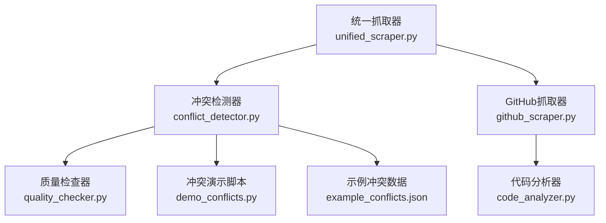
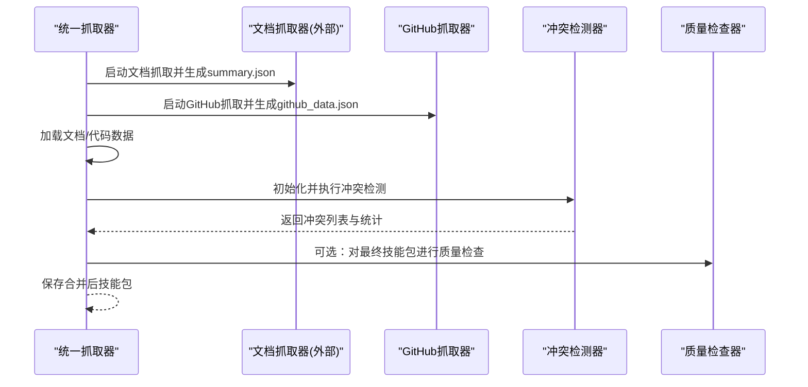
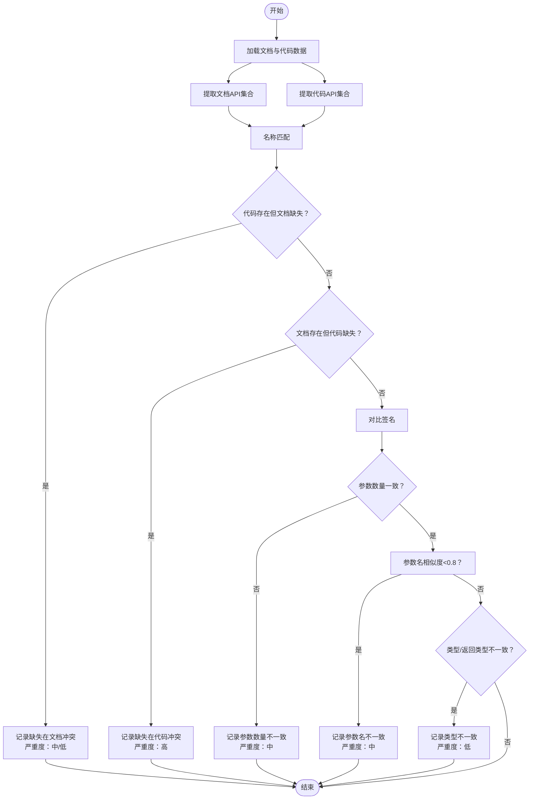
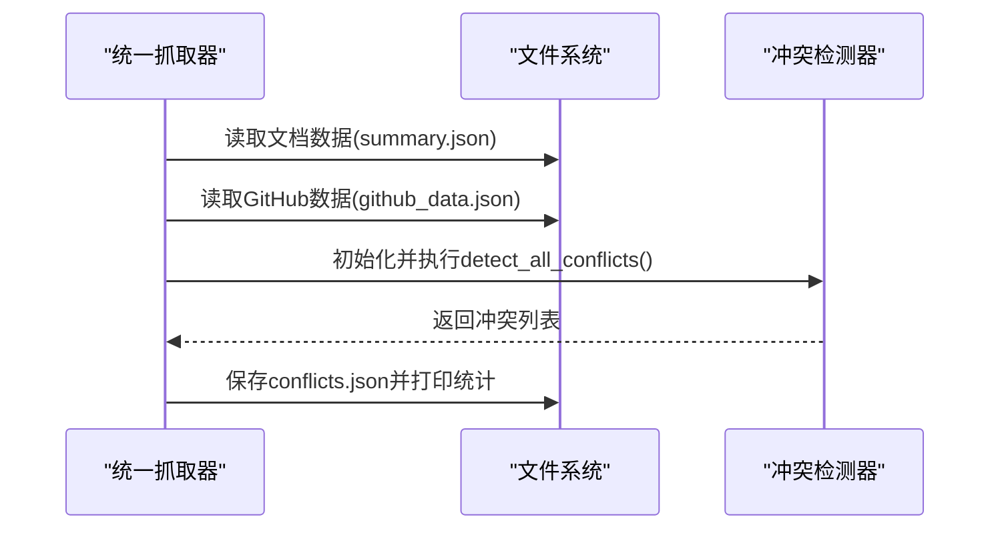
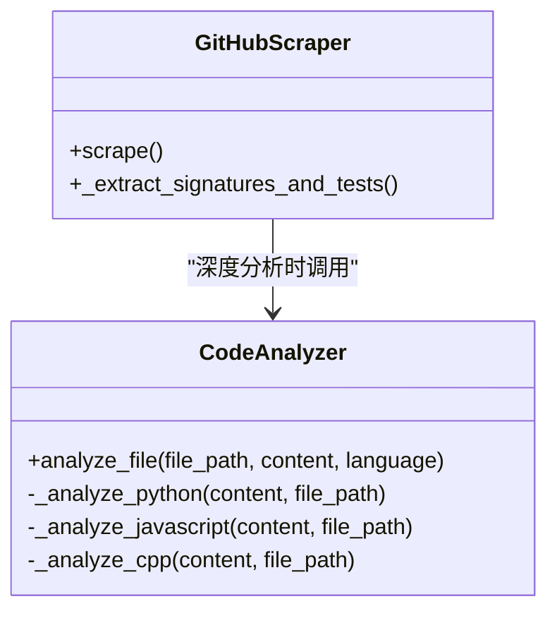
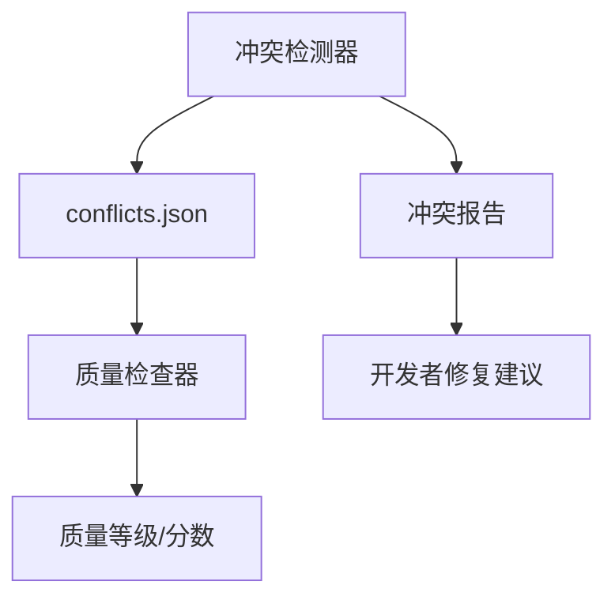
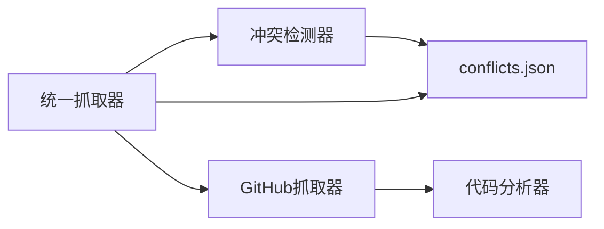

# 冲突检测机制

<cite>
**本文引用的文件列表**
- [conflict_detector.py](file://src/skill_seekers/cli/conflict_detector.py)
- [quality_checker.py](file://src/skill_seekers/cli/quality_checker.py)
- [unified_scraper.py](file://src/skill_seekers/cli/unified_scraper.py)
- [github_scraper.py](file://src/skill_seekers/cli/github_scraper.py)
- [code_analyzer.py](file://src/skill_seekers/cli/code_analyzer.py)
- [demo_conflicts.py](file://demo_conflicts.py)
- [example_conflicts.json](file://tests/fixtures/example_conflicts.json)
</cite>

## 目录
1. [引言](#引言)
2. [项目结构](#项目结构)
3. [核心组件](#核心组件)
4. [架构总览](#架构总览)
5. [详细组件分析](#详细组件分析)
6. [依赖关系分析](#依赖关系分析)
7. [性能考量](#性能考量)
8. [故障排查指南](#故障排查指南)
9. [结论](#结论)
10. [附录](#附录)

## 引言
本文件系统性解析冲突检测机制，聚焦于文档与代码实现之间的差异比对算法，说明其如何通过“名称匹配 + 签名对比 + 文本相似度 + 严重度判定”等策略，识别API缺失、参数不一致、返回类型不一致等问题；并结合质量评估工具的质量分数与等级，输出可操作的冲突报告与修复建议。同时给出典型冲突场景与误报规避策略，帮助开发者在多源知识融合过程中快速定位问题并提升技能包质量。

## 项目结构
冲突检测位于CLI子模块中，与统一抓取器、GitHub抓取器、代码分析器协同工作：
- 统一抓取器负责拉取文档与代码数据，触发冲突检测阶段
- GitHub抓取器产出代码签名与类方法信息
- 代码分析器按深度抽取函数/类签名
- 冲突检测器对两套数据进行比对，生成冲突清单
- 质量检查器用于技能包整体质量评分与等级

图表来源
- [unified_scraper.py](file://src/skill_seekers/cli/unified_scraper.py#L250-L349)
- [conflict_detector.py](file://src/skill_seekers/cli/conflict_detector.py#L275-L473)
- [github_scraper.py](file://src/skill_seekers/cli/github_scraper.py#L420-L545)
- [code_analyzer.py](file://src/skill_seekers/cli/code_analyzer.py#L72-L101)
- [quality_checker.py](file://src/skill_seekers/cli/quality_checker.py#L94-L131)
- [demo_conflicts.py](file://demo_conflicts.py#L1-L196)
- [example_conflicts.json](file://tests/fixtures/example_conflicts.json#L1-L142)

章节来源
- [unified_scraper.py](file://src/skill_seekers/cli/unified_scraper.py#L250-L349)
- [conflict_detector.py](file://src/skill_seekers/cli/conflict_detector.py#L275-L473)
- [github_scraper.py](file://src/skill_seekers/cli/github_scraper.py#L420-L545)
- [code_analyzer.py](file://src/skill_seekers/cli/code_analyzer.py#L72-L101)
- [quality_checker.py](file://src/skill_seekers/cli/quality_checker.py#L94-L131)
- [demo_conflicts.py](file://demo_conflicts.py#L1-L196)
- [example_conflicts.json](file://tests/fixtures/example_conflicts.json#L1-L142)

## 核心组件
- 冲突检测器（ConflictDetector）
  - 提取文档与代码API集合
  - 检测四类冲突：缺失在文档、缺失在代码、签名不一致、描述不一致（当前实现主要覆盖前三类）
  - 基于参数数量、参数名相似度、参数类型、返回类型进行对比
  - 输出冲突对象（包含类型、严重度、差异说明、修复建议）

- 统一抓取器（UnifiedScraper）
  - 在抓取完成后自动执行冲突检测
  - 将冲突结果保存为JSON并打印统计摘要

- GitHub抓取器与代码分析器
  - GitHub抓取器根据配置选择“表面/深度/全量”分析模式
  - 代码分析器按语言解析AST/正则提取函数/类签名，支持Python/JS/TS/C/C++

- 质量检查器（SkillQualityChecker）
  - 对技能包进行结构、增强质量、内容质量、链接有效性检查
  - 计算质量分数与等级，支持严格模式退出码

章节来源
- [conflict_detector.py](file://src/skill_seekers/cli/conflict_detector.py#L24-L51)
- [conflict_detector.py](file://src/skill_seekers/cli/conflict_detector.py#L275-L473)
- [unified_scraper.py](file://src/skill_seekers/cli/unified_scraper.py#L250-L349)
- [github_scraper.py](file://src/skill_seekers/cli/github_scraper.py#L420-L545)
- [code_analyzer.py](file://src/skill_seekers/cli/code_analyzer.py#L72-L101)
- [quality_checker.py](file://src/skill_seekers/cli/quality_checker.py#L94-L131)

## 架构总览
冲突检测在统一抓取流程中的位置如下：

图表来源
- [unified_scraper.py](file://src/skill_seekers/cli/unified_scraper.py#L150-L214)
- [unified_scraper.py](file://src/skill_seekers/cli/unified_scraper.py#L250-L349)
- [conflict_detector.py](file://src/skill_seekers/cli/conflict_detector.py#L275-L473)
- [quality_checker.py](file://src/skill_seekers/cli/quality_checker.py#L94-L131)

## 详细组件分析

### 冲突检测器（ConflictDetector）算法详解
- 数据输入
  - 文档侧：从文档抓取器输出的pages结构中解析API签名，支持两类格式：字典页集合与列表页集合（每页含apis数组）
  - 代码侧：从GitHub抓取器输出的code_analysis结构中解析类与方法签名，包含参数、返回类型、docstring、异步标记等

- API提取策略
  - 文档API提取：基于标题/URL关键词筛选API页面，再用正则匹配常见签名模式（Python/JS/C++/方法式），解析参数名、类型、默认值、返回类型
  - 代码API提取：遍历分析后的文件，提取类名、基类、方法名、参数、返回类型、docstring、行号、是否异步

- 冲突检测流程
  - 缺失在文档：代码存在但文档未收录（私有/内部API按低严重度处理）
  - 缺失在代码：文档存在但代码未实现（高严重度）
  - 签名不一致：参数个数不一致、参数名相似度低、参数类型不一致、返回类型不一致

- 签名对比细节
  - 参数计数：直接比较数量
  - 参数名：使用序列相似度阈值（例如0.8）判断是否显著不同
  - 参数类型：文档类型与代码类型提示不一致即视为不一致
  - 返回类型：文档返回类型与代码返回类型不一致即视为不一致

- 严重度与建议
  - 缺失在文档：非私有API按中等严重度，私有按低严重度
  - 缺失在代码：高严重度
  - 签名不一致：参数名差异按中等严重度，类型差异按低严重度

图表来源
- [conflict_detector.py](file://src/skill_seekers/cli/conflict_detector.py#L275-L473)
- [conflict_detector.py](file://src/skill_seekers/cli/conflict_detector.py#L340-L425)

章节来源
- [conflict_detector.py](file://src/skill_seekers/cli/conflict_detector.py#L59-L173)
- [conflict_detector.py](file://src/skill_seekers/cli/conflict_detector.py#L212-L273)
- [conflict_detector.py](file://src/skill_seekers/cli/conflict_detector.py#L299-L366)
- [conflict_detector.py](file://src/skill_seekers/cli/conflict_detector.py#L368-L425)

### 统一抓取器中的冲突检测集成
- 触发条件：当配置表明需要API合并（即存在两种及以上API来源）时才执行冲突检测
- 数据加载：分别读取文档与GitHub数据文件
- 执行检测：创建冲突检测器并输出冲突清单与统计
- 结果落地：保存conflicts.json并打印摘要

图表来源
- [unified_scraper.py](file://src/skill_seekers/cli/unified_scraper.py#L250-L303)
- [conflict_detector.py](file://src/skill_seekers/cli/conflict_detector.py#L275-L366)

章节来源
- [unified_scraper.py](file://src/skill_seekers/cli/unified_scraper.py#L250-L303)

### GitHub抓取器与代码分析器的协作
- GitHub抓取器根据配置选择分析深度：
  - 表面：仅文件树
  - 深度：解析文件，提取类与函数签名
  - 全量：未来扩展
- 代码分析器按语言解析：
  - Python：使用AST提取类/函数、参数类型提示、默认值、返回类型、装饰器、docstring、行号、异步标记
  - JS/TS：使用正则提取类/函数、参数、默认值、异步标记
  - C/C++：使用正则提取类/函数声明、参数、默认值

图表来源
- [github_scraper.py](file://src/skill_seekers/cli/github_scraper.py#L420-L545)
- [code_analyzer.py](file://src/skill_seekers/cli/code_analyzer.py#L72-L101)

章节来源
- [github_scraper.py](file://src/skill_seekers/cli/github_scraper.py#L420-L545)
- [code_analyzer.py](file://src/skill_seekers/cli/code_analyzer.py#L103-L201)

### 质量评估与冲突报告的结合
- 冲突检测器输出冲突清单与统计，统一抓取器将其保存为conflicts.json
- 质量检查器对最终技能包进行结构、内容、链接、增强质量检查，计算质量分数与等级
- 开发者可依据冲突报告优先修复高/中严重度问题，再用质量检查器确认整体质量

图表来源
- [conflict_detector.py](file://src/skill_seekers/cli/conflict_detector.py#L455-L473)
- [quality_checker.py](file://src/skill_seekers/cli/quality_checker.py#L94-L131)

章节来源
- [conflict_detector.py](file://src/skill_seekers/cli/conflict_detector.py#L426-L473)
- [quality_checker.py](file://src/skill_seekers/cli/quality_checker.py#L94-L131)

## 依赖关系分析
- 组件耦合
  - 统一抓取器与冲突检测器松耦合：通过数据文件输入输出，便于独立演进
  - GitHub抓取器与代码分析器强耦合：深度分析依赖代码分析器
  - 冲突检测器与文档/代码数据格式约定：需遵循统一的数据结构

- 外部依赖
  - 正则表达式用于文档签名提取与参数解析
  - difflib.SequenceMatcher用于参数名相似度判断
  - 文件I/O用于数据持久化

图表来源
- [unified_scraper.py](file://src/skill_seekers/cli/unified_scraper.py#L250-L349)
- [conflict_detector.py](file://src/skill_seekers/cli/conflict_detector.py#L275-L473)
- [github_scraper.py](file://src/skill_seekers/cli/github_scraper.py#L420-L545)
- [code_analyzer.py](file://src/skill_seekers/cli/code_analyzer.py#L72-L101)

章节来源
- [unified_scraper.py](file://src/skill_seekers/cli/unified_scraper.py#L250-L349)
- [conflict_detector.py](file://src/skill_seekers/cli/conflict_detector.py#L275-L473)
- [github_scraper.py](file://src/skill_seekers/cli/github_scraper.py#L420-L545)
- [code_analyzer.py](file://src/skill_seekers/cli/code_analyzer.py#L72-L101)

## 性能考量
- 文档签名提取采用正则匹配，复杂度与页面数量线性相关；可通过限制最大页面数与选择性解析优化
- 代码分析按深度进行，深度越高、文件越多，耗时越长；建议在大规模仓库中使用“深度”而非“全量”
- 参数名相似度使用序列相似度，对大量API对比时可考虑分批或缓存中间结果
- I/O方面，冲突检测器与统一抓取器均采用JSON文件读写，注意磁盘IO开销

[本节为通用性能讨论，无需特定文件引用]

## 故障排查指南
- 冲突检测无输出
  - 检查是否满足API合并条件（至少两种API来源）
  - 确认文档与GitHub数据文件路径正确且已生成
- 文档API未被识别
  - 检查文档页面标题/URL是否包含API/Reference/Class/Function等关键词
  - 确认签名正则是否覆盖目标语言风格
- 代码API未被识别
  - 检查GitHub抓取器是否启用深度分析
  - 确认文件扩展名与语言映射是否正确
- 误报与漏报
  - 私有API（以下划线开头或双下划线）可能被错误标记为缺失在文档，应手动核验
  - 参数名相似度阈值可调整以减少误报
  - 类型标注缺失或不一致可能导致类型不一致冲突，需统一注解风格

章节来源
- [unified_scraper.py](file://src/skill_seekers/cli/unified_scraper.py#L250-L303)
- [conflict_detector.py](file://src/skill_seekers/cli/conflict_detector.py#L299-L366)
- [github_scraper.py](file://src/skill_seekers/cli/github_scraper.py#L420-L545)

## 结论
该冲突检测机制通过“名称匹配 + 签名对比 + 文本相似度 + 严重度判定”的组合策略，有效识别文档与代码实现之间的API缺失、参数不一致与返回类型不一致等问题。配合统一抓取器的自动化流程与质量检查器的整体评分，能够为开发者提供清晰的冲突报告与修复建议，确保技能包的准确性与一致性。

[本节为总结性内容，无需特定文件引用]

## 附录

### 典型冲突场景与修复建议
- 场景1：缺失在文档
  - 现象：代码中存在某API，但文档未收录
  - 建议：补充API文档，完善参数说明与示例
- 场景2：缺失在代码
  - 现象：文档描述某API，但代码未实现
  - 建议：删除过时文档或添加实现
- 场景3：签名不一致
  - 现象：参数数量/名称/类型或返回类型不一致
  - 建议：统一文档与代码签名，保持类型注解一致

章节来源
- [conflict_detector.py](file://src/skill_seekers/cli/conflict_detector.py#L299-L425)
- [example_conflicts.json](file://tests/fixtures/example_conflicts.json#L1-L142)

### 误报规避策略
- 私有/内部API不应强制要求文档化，冲突检测器已按低严重度处理
- 参数名相似度采用阈值控制，避免轻微差异导致误报
- 类型标注缺失时，冲突检测器不会因“无类型”而判定为不一致，需确保双方均有明确标注

章节来源
- [conflict_detector.py](file://src/skill_seekers/cli/conflict_detector.py#L304-L318)
- [conflict_detector.py](file://src/skill_seekers/cli/conflict_detector.py#L392-L412)

### 冲突演示与报告展示
- demo_conflicts.py展示了如何加载冲突JSON并生成可读的报告，包含按严重度分组、API详情与建议
- 示例冲突数据example_conflicts.json提供了缺失在文档/缺失在代码的样例

章节来源
- [demo_conflicts.py](file://demo_conflicts.py#L1-L196)
- [example_conflicts.json](file://tests/fixtures/example_conflicts.json#L1-L142)