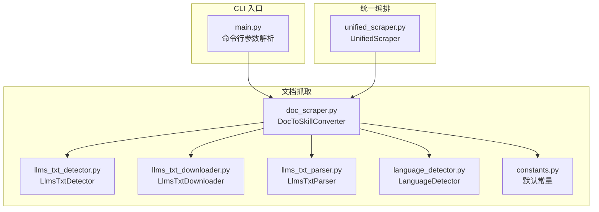
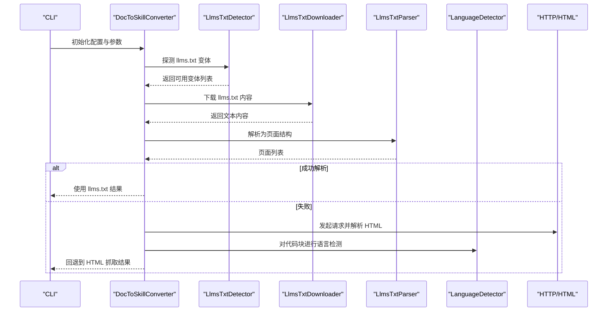
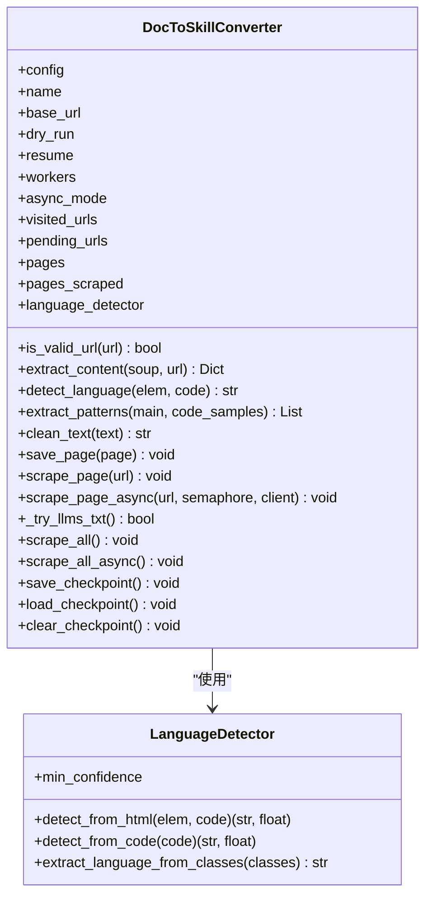
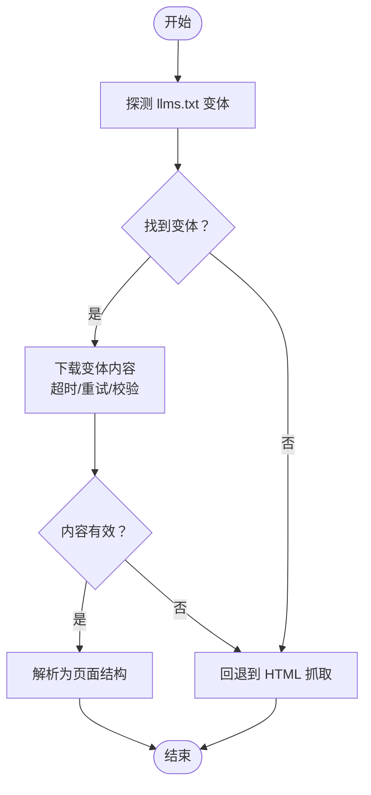
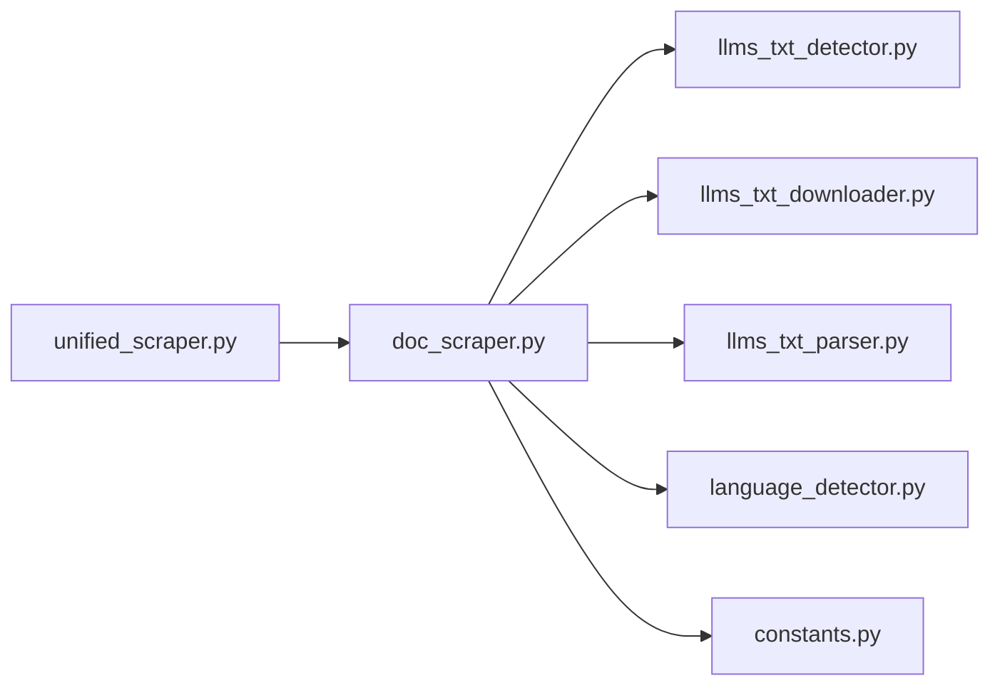

# 文档抓取功能

<cite>
**本文引用的文件**
- [doc_scraper.py](file://src/skill_seekers/cli/doc_scraper.py)
- [llms_txt_detector.py](file://src/skill_seekers/cli/llms_txt_detector.py)
- [llms_txt_downloader.py](file://src/skill_seekers/cli/llms_txt_downloader.py)
- [llms_txt_parser.py](file://src/skill_seekers/cli/llms_txt_parser.py)
- [language_detector.py](file://src/skill_seekers/cli/language_detector.py)
- [constants.py](file://src/skill_seekers/cli/constants.py)
- [unified_scraper.py](file://src/skill_seekers/cli/unified_scraper.py)
- [main.py](file://src/skill_seekers/cli/main.py)
- [react-custom.json](file://configs/example-team/react-custom.json)
- [ASYNC_SUPPORT.md](file://ASYNC_SUPPORT.md)
</cite>

## 目录
1. [简介](#简介)
2. [项目结构](#项目结构)
3. [核心组件](#核心组件)
4. [架构总览](#架构总览)
5. [详细组件分析](#详细组件分析)
6. [依赖关系分析](#依赖关系分析)
7. [性能与并发特性](#性能与并发特性)
8. [故障排查指南](#故障排查指南)
9. [结论](#结论)
10. [附录：参数与最佳实践](#附录参数与最佳实践)

## 简介
本文件系统性解析 Skill_Seekers 中“文档抓取”能力的实现机制，重点覆盖以下方面：
- doc_scraper 如何通过 HTTP 请求与 HTML 解析从文档网站抽取内容
- llms.txt 自动发现与验证、下载与解析流程
- 选择器配置（如 CSS 选择器）在内容提取中的作用
- 智能分类与代码语言检测的实现逻辑
- 抓取过程中的缓存策略、错误重试机制与增量更新支持
- 通过 --dry-run 与 --skip-scrape 等参数对抓取行为的控制
- 实际使用场景下的最佳实践建议

## 项目结构
围绕文档抓取的核心模块包括：
- 文档抓取器：负责 HTTP 请求、HTML 解析、内容抽取、并发与速率限制、检查点与恢复
- llms.txt 支持：探测变体、下载、校验与解析为页面结构
- 语言检测：基于 CSS 类与模式匹配的多语言识别
- 统一编排：在统一配置下协调多来源抓取（文档、GitHub、PDF）

图表来源
- [doc_scraper.py](file://src/skill_seekers/cli/doc_scraper.py#L1-L120)
- [llms_txt_detector.py](file://src/skill_seekers/cli/llms_txt_detector.py#L1-L67)
- [llms_txt_downloader.py](file://src/skill_seekers/cli/llms_txt_downloader.py#L1-L95)
- [llms_txt_parser.py](file://src/skill_seekers/cli/llms_txt_parser.py#L1-L75)
- [language_detector.py](file://src/skill_seekers/cli/language_detector.py#L1-L120)
- [constants.py](file://src/skill_seekers/cli/constants.py#L1-L73)
- [unified_scraper.py](file://src/skill_seekers/cli/unified_scraper.py#L1-L120)
- [main.py](file://src/skill_seekers/cli/main.py#L70-L120)

章节来源
- [doc_scraper.py](file://src/skill_seekers/cli/doc_scraper.py#L1-L120)
- [unified_scraper.py](file://src/skill_seekers/cli/unified_scraper.py#L1-L120)

## 核心组件
- DocToSkillConverter：文档抓取主控制器，负责 URL 验证、内容抽取、链接发现、并发与速率限制、检查点保存与恢复、llms.txt 优先路径
- LlmsTxtDetector/LlmsTxtDownloader/LlmsTxtParser：llms.txt 的探测、下载、校验与解析
- LanguageDetector：基于 CSS 类与模式匹配的语言检测
- constants：默认速率限制、最大页数、检查点间隔等全局常量
- UnifiedScraper：在统一配置下协调多来源抓取，内部调用 doc_scraper 子进程

章节来源
- [doc_scraper.py](file://src/skill_seekers/cli/doc_scraper.py#L71-L180)
- [llms_txt_detector.py](file://src/skill_seekers/cli/llms_txt_detector.py#L1-L67)
- [llms_txt_downloader.py](file://src/skill_seekers/cli/llms_txt_downloader.py#L1-L95)
- [llms_txt_parser.py](file://src/skill_seekers/cli/llms_txt_parser.py#L1-L75)
- [language_detector.py](file://src/skill_seekers/cli/language_detector.py#L385-L555)
- [constants.py](file://src/skill_seekers/cli/constants.py#L1-L73)
- [unified_scraper.py](file://src/skill_seekers/cli/unified_scraper.py#L1-L120)

## 架构总览
文档抓取的整体流程如下：
- CLI 解析参数，进入 doc_scraper 主流程
- 优先尝试 llms.txt：探测变体、下载、校验、解析为页面结构
- 若无 llms.txt 或失败，则回退到 HTML 抓取：按配置选择器抽取标题、正文、代码块、链接
- 并发模式支持线程或异步两种方式；支持速率限制、检查点与恢复
- 统一编排工具可直接调用 doc_scraper 子进程完成多来源整合

图表来源
- [doc_scraper.py](file://src/skill_seekers/cli/doc_scraper.py#L429-L560)
- [llms_txt_detector.py](file://src/skill_seekers/cli/llms_txt_detector.py#L20-L67)
- [llms_txt_downloader.py](file://src/skill_seekers/cli/llms_txt_downloader.py#L49-L95)
- [llms_txt_parser.py](file://src/skill_seekers/cli/llms_txt_parser.py#L13-L75)
- [language_detector.py](file://src/skill_seekers/cli/language_detector.py#L426-L555)

## 详细组件分析

### 文档抓取器：DocToSkillConverter
职责与关键点：
- URL 过滤：根据 base_url 与 url_patterns 的 include/exclude 列表过滤待抓取 URL
- 内容抽取：使用配置中的选择器（如 main_content、title、code_blocks）定位页面主体、标题与代码块
- 代码语言检测：对提取的代码块进行语言识别，支持 CSS 类与模式匹配双通道
- 链接发现：从整个页面（不仅是主内容区）提取链接，避免锚点重复
- 并发与速率限制：支持单线程、多线程与异步三种模式；通过 rate_limit 控制请求节流
- 检查点：周期性保存进度，支持中断后恢复
- llms.txt 优先：若存在有效 llms.txt，优先使用其解析结果

图表来源
- [doc_scraper.py](file://src/skill_seekers/cli/doc_scraper.py#L71-L210)
- [language_detector.py](file://src/skill_seekers/cli/language_detector.py#L385-L555)

章节来源
- [doc_scraper.py](file://src/skill_seekers/cli/doc_scraper.py#L134-L210)
- [doc_scraper.py](file://src/skill_seekers/cli/doc_scraper.py#L213-L315)
- [doc_scraper.py](file://src/skill_seekers/cli/doc_scraper.py#L333-L428)
- [doc_scraper.py](file://src/skill_seekers/cli/doc_scraper.py#L429-L560)
- [doc_scraper.py](file://src/skill_seekers/cli/doc_scraper.py#L561-L721)
- [doc_scraper.py](file://src/skill_seekers/cli/doc_scraper.py#L722-L800)

### llms.txt 自动发现与下载
- 探测：在站点根域尝试三种变体（llms-full.txt、llms.txt、llms-small.txt），HEAD 请求快速判断是否存在
- 下载：带超时与指数退避重试；校验内容长度与 Markdown 特征，确保有效性
- 解析：按 Markdown 的 h1 分段，提取标题、代码块、h2/h3 标题与正文，生成页面结构

图表来源
- [llms_txt_detector.py](file://src/skill_seekers/cli/llms_txt_detector.py#L20-L67)
- [llms_txt_downloader.py](file://src/skill_seekers/cli/llms_txt_downloader.py#L49-L95)
- [llms_txt_parser.py](file://src/skill_seekers/cli/llms_txt_parser.py#L13-L75)
- [doc_scraper.py](file://src/skill_seekers/cli/doc_scraper.py#L429-L560)

章节来源
- [llms_txt_detector.py](file://src/skill_seekers/cli/llms_txt_detector.py#L1-L67)
- [llms_txt_downloader.py](file://src/skill_seekers/cli/llms_txt_downloader.py#L1-L95)
- [llms_txt_parser.py](file://src/skill_seekers/cli/llms_txt_parser.py#L1-L75)
- [doc_scraper.py](file://src/skill_seekers/cli/doc_scraper.py#L429-L560)

### 选择器配置与内容提取
- 选择器来自配置的 selectors 字段，常见键位包括：
  - title：页面标题元素
  - main_content：主内容容器
  - code_blocks：代码块容器
- 抽取流程：
  - 定位主内容区域
  - 提取标题、各级标题、段落
  - 提取代码块并进行语言检测
  - 从整页提取所有有效链接，去重并过滤域名与模式
- 示例配置参考：react-custom.json 中对 main_content、title、code_blocks 的定制

章节来源
- [doc_scraper.py](file://src/skill_seekers/cli/doc_scraper.py#L213-L315)
- [react-custom.json](file://configs/example-team/react-custom.json#L1-L36)

### 智能分类与代码语言检测
- 语言检测两阶段：
  - CSS 类识别：优先从 <pre>/<code> 元素的 class 属性识别语言（如 language-python、lang-javascript、brush: java 等）
  - 模式匹配：对代码内容进行加权规则匹配，计算置信度并应用阈值
- 分类与评分：内容预览长度、关键词匹配权重、最小分类分数等由 constants 提供

章节来源
- [language_detector.py](file://src/skill_seekers/cli/language_detector.py#L385-L555)
- [constants.py](file://src/skill_seekers/cli/constants.py#L1-L73)

### 缓存策略、错误重试与增量更新
- 检查点：周期性保存 visited_urls、pending_urls、pages_scraped 等状态，支持 resume 参数恢复
- 错误重试：llms.txt 下载采用指数退避重试；HTML 抓取捕获异常并记录日志
- 增量更新：通过 resume 加载检查点，继续未完成的抓取任务

章节来源
- [doc_scraper.py](file://src/skill_seekers/cli/doc_scraper.py#L158-L203)
- [doc_scraper.py](file://src/skill_seekers/cli/doc_scraper.py#L180-L203)
- [llms_txt_downloader.py](file://src/skill_seekers/cli/llms_txt_downloader.py#L60-L95)

### 并发与异步模式
- 线程模式：ThreadPoolExecutor 批量提交任务，线程安全地维护共享状态
- 异步模式：httpx.AsyncClient 连接池 + asyncio.Semaphore 控制并发，显著提升吞吐与降低内存占用
- 性能对比与建议参见 ASYNC_SUPPORT.md

章节来源
- [doc_scraper.py](file://src/skill_seekers/cli/doc_scraper.py#L648-L713)
- [doc_scraper.py](file://src/skill_seekers/cli/doc_scraper.py#L722-L800)
- [ASYNC_SUPPORT.md](file://ASYNC_SUPPORT.md#L1-L120)

## 依赖关系分析
- DocToSkillConverter 依赖：
  - llms_txt_detector、llms_txt_downloader、llms_txt_parser：llms.txt 路径
  - language_detector：代码语言检测
  - constants：默认配置与阈值
- UnifiedScraper 通过子进程调用 doc_scraper，实现多来源整合

图表来源
- [doc_scraper.py](file://src/skill_seekers/cli/doc_scraper.py#L32-L45)
- [unified_scraper.py](file://src/skill_seekers/cli/unified_scraper.py#L120-L170)

章节来源
- [doc_scraper.py](file://src/skill_seekers/cli/doc_scraper.py#L32-L45)
- [unified_scraper.py](file://src/skill_seekers/cli/unified_scraper.py#L120-L170)

## 性能与并发特性
- 异步模式优势：更高的吞吐、更低的内存占用、更好的 CPU 利用率
- 推荐设置：
  - 小型文档：同步或少量 workers
  - 中大型文档：启用异步并使用 4-8 workers
  - 高延迟网络：异步更合适
- 速率限制与检查点：合理设置 rate_limit，开启 checkpoint 以支持长时间任务的可靠运行

章节来源
- [ASYNC_SUPPORT.md](file://ASYNC_SUPPORT.md#L1-L120)
- [doc_scraper.py](file://src/skill_seekers/cli/doc_scraper.py#L561-L721)
- [doc_scraper.py](file://src/skill_seekers/cli/doc_scraper.py#L722-L800)

## 故障排查指南
- llms.txt 无法解析
  - 检查变体是否真实存在且返回 200
  - 确认下载内容长度与 Markdown 特征满足要求
  - 查看解析输出的页面数量与字段完整性
- HTML 抓取失败
  - 检查选择器是否正确（main_content、title、code_blocks）
  - 调整 rate_limit 与 workers
  - 开启 --dry-run 预览抓取范围
- 并发问题
  - 异步模式下注意系统资源上限（文件句柄、内存）
  - 减少 workers 或提高 rate_limit 以缓解压力

章节来源
- [llms_txt_detector.py](file://src/skill_seekers/cli/llms_txt_detector.py#L20-L67)
- [llms_txt_downloader.py](file://src/skill_seekers/cli/llms_txt_downloader.py#L49-L95)
- [llms_txt_parser.py](file://src/skill_seekers/cli/llms_txt_parser.py#L13-L75)
- [doc_scraper.py](file://src/skill_seekers/cli/doc_scraper.py#L561-L721)
- [ASYNC_SUPPORT.md](file://ASYNC_SUPPORT.md#L180-L254)

## 结论
本实现以 DocToSkillConverter 为核心，结合 llms.txt 的优先路径与强大的 HTML 抽取能力，提供了高鲁棒性的文档抓取方案。通过 CSS 选择器与语言检测的组合，能够稳定提取高质量内容；借助检查点、重试与并发优化，兼顾了可靠性与性能。统一编排进一步扩展到多来源整合，形成端到端的技能构建流水线。

## 附录：参数与最佳实践

### 关键参数说明
- --dry-run：预览模式，不实际抓取，仅展示将要抓取的 URL 与链接发现情况
- --skip-scrape：跳过抓取，直接使用已存在的缓存数据（需配合缓存目录）
- --async：启用异步抓取模式
- --workers：并发工作线程数（线程模式）或并发任务数（异步模式）
- --rate-limit/--no-rate-limit：控制请求节流
- --resume/--fresh：从检查点恢复或清除检查点重新开始

章节来源
- [main.py](file://src/skill_seekers/cli/main.py#L75-L90)
- [doc_scraper.py](file://src/skill_seekers/cli/doc_scraper.py#L1461-L1559)
- [unified_scraper.py](file://src/skill_seekers/cli/unified_scraper.py#L117-L150)

### 最佳实践建议
- 选择器配置
  - 在配置中明确 main_content、title、code_blocks，避免默认选择器误判
  - 参考 react-custom.json 的 selectors 与 url_patterns 示例
- 速率与并发
  - 小型站点：workers=1，适度 rate_limit
  - 大型站点：启用 --async，workers=4-8，rate_limit=0.3-1.0
- 缓存与恢复
  - 长时间任务开启 checkpoint，合理设置 interval
  - 使用 --resume 恢复中断任务
- llms.txt 优先
  - 优先使用 llms.txt，若解析失败再回退 HTML 抓取
  - 明确 llms_txt_url 时可直接指定，减少探测开销

章节来源
- [react-custom.json](file://configs/example-team/react-custom.json#L1-L36)
- [doc_scraper.py](file://src/skill_seekers/cli/doc_scraper.py#L561-L721)
- [constants.py](file://src/skill_seekers/cli/constants.py#L1-L73)
- [ASYNC_SUPPORT.md](file://ASYNC_SUPPORT.md#L56-L120)