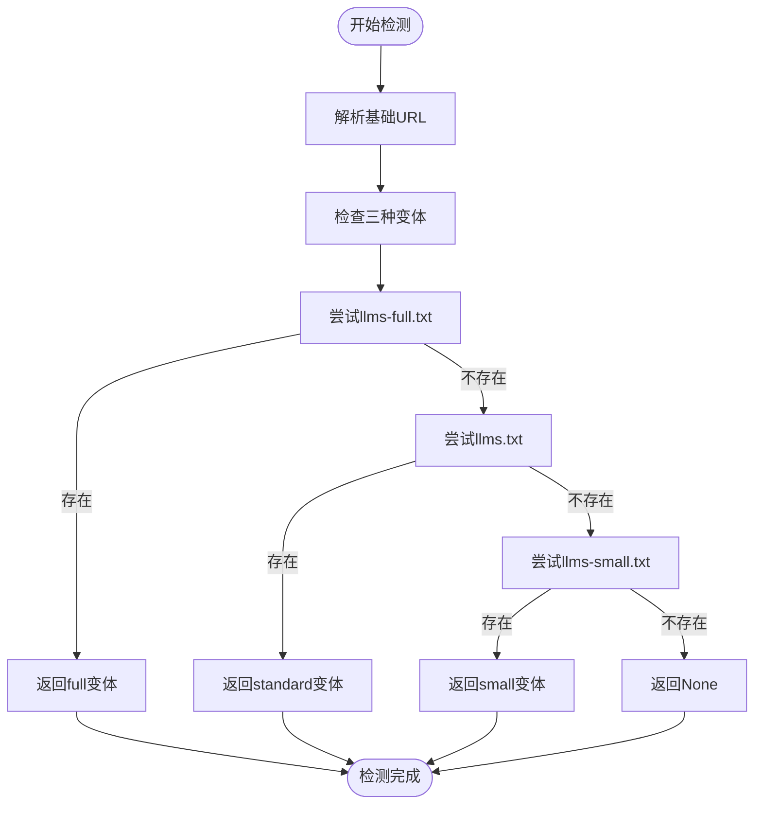
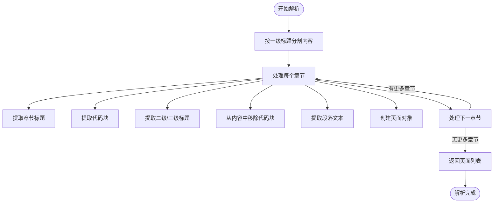
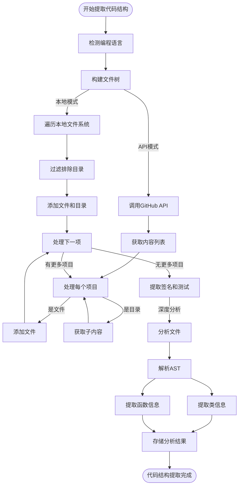
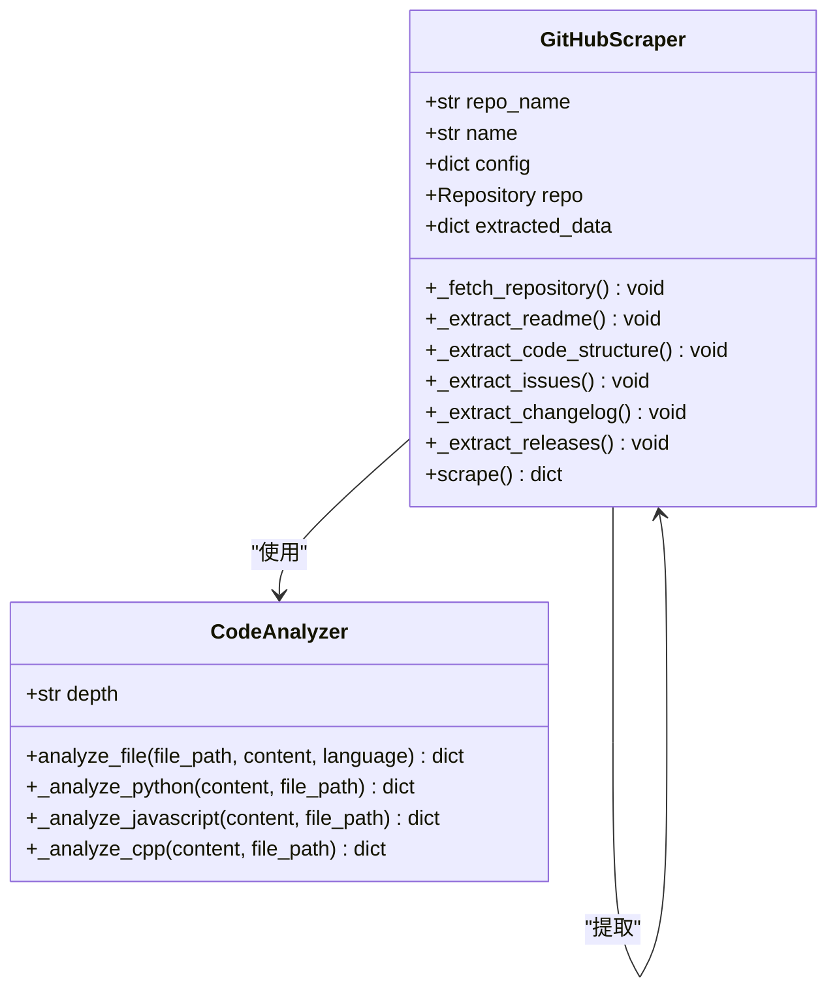
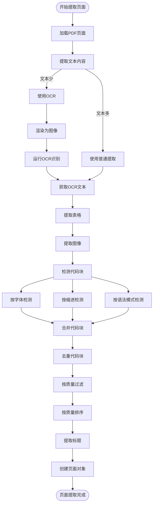
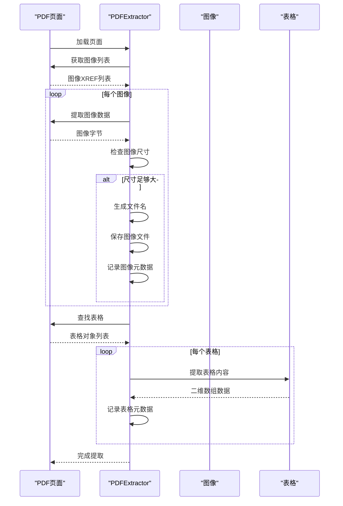
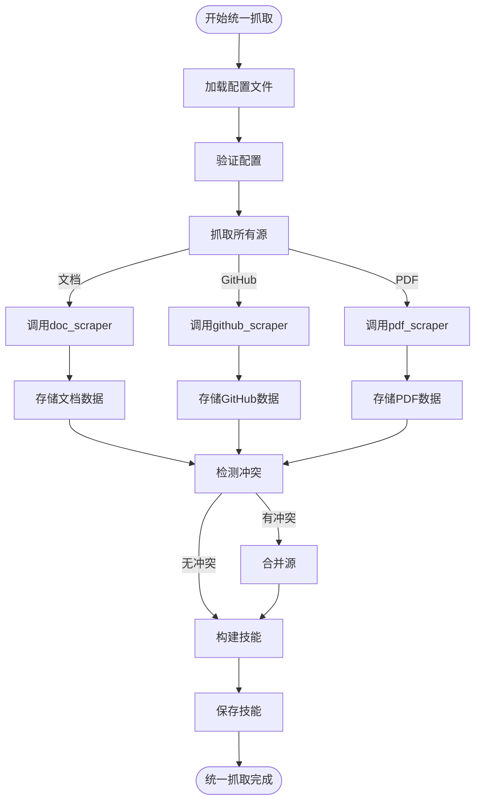
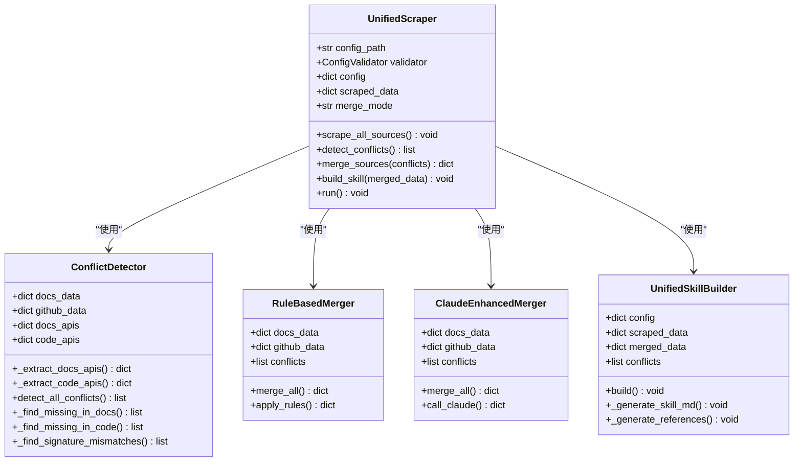
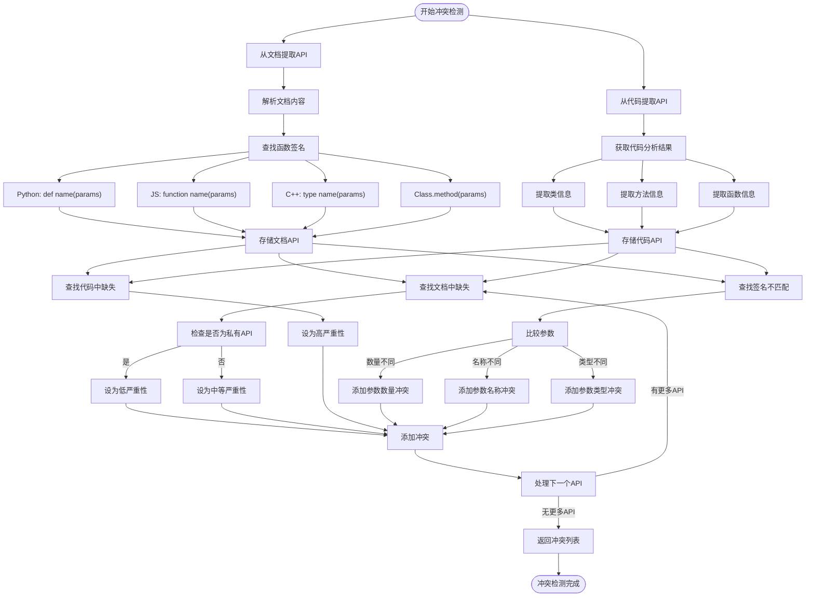

# 核心功能详解

<cite>
**本文档引用的文件**   
- [llms_txt_detector.py](file://src/skill_seekers/cli/llms_txt_detector.py)
- [llms_txt_parser.py](file://src/skill_seekers/cli/llms_txt_parser.py)
- [github_scraper.py](file://src/skill_seekers/cli/github_scraper.py)
- [pdf_scraper.py](file://src/skill_seekers/cli/pdf_scraper.py)
- [pdf_extractor_poc.py](file://src/skill_seekers/cli/pdf_extractor_poc.py)
- [conflict_detector.py](file://src/skill_seekers/cli/conflict_detector.py)
- [doc_scraper.py](file://src/skill_seekers/cli/doc_scraper.py)
- [code_analyzer.py](file://src/skill_seekers/cli/code_analyzer.py)
- [unified_scraper.py](file://src/skill_seekers/cli/unified_scraper.py)
- [merge_sources.py](file://src/skill_seekers/cli/merge_sources.py)
- [unified_skill_builder.py](file://src/skill_seekers/cli/unified_skill_builder.py)
</cite>

## 目录
1. [llms.txt支持机制](#llmstxt支持机制)
2. [GitHub代码库深度分析](#github代码库深度分析)
3. [PDF内容提取技术细节](#pdf内容提取技术细节)
4. [多源数据融合策略](#多源数据融合策略)
5. [冲突检测算法原理](#冲突检测算法原理)

## llms.txt支持机制

本项目通过`llms_txt_detector.py`和`llms_txt_parser.py`两个核心模块实现对llms.txt文件的自动发现与解析。该机制允许系统从文档URL根目录检测并提取结构化内容，为AI技能提供高质量的文档数据。

### llms.txt文件检测

`LlmsTxtDetector`类负责检测文档站点根目录下是否存在llms.txt文件。系统支持三种变体：`llms-full.txt`、`llms.txt`和`llms-small.txt`，按优先级顺序进行检测。检测过程使用HTTP HEAD请求验证URL存在性，避免下载完整内容以提高效率。

检测器首先解析基础URL，提取协议和主机名，然后依次尝试访问三种变体文件。一旦发现任一变体存在，立即返回其URL和对应变体类型。这种设计确保了最大的兼容性，同时保持了检测过程的高效性。



**Diagram sources**
- [llms_txt_detector.py](file://src/skill_seekers/cli/llms_txt_detector.py#L8-L67)

**Section sources**
- [llms_txt_detector.py](file://src/skill_seekers/cli/llms_txt_detector.py#L8-L67)

### llms.txt文件解析

`LlmsTxtParser`类负责将llms.txt文件中的Markdown内容解析为结构化的页面数据。解析器使用正则表达式按一级标题（#）分割内容，将每个标题及其后续内容作为一个独立页面处理。

对于每个页面，解析器提取标题、内容、代码示例和二级/三级标题。代码块通过```包围的语法识别，提取时保留语言标识。标题通过#符号的数量确定层级，转换为h2或h3标签。原始内容中的代码块被移除后，剩余文本作为纯文本内容，按段落分割并过滤短文本。



**Diagram sources**
- [llms_txt_parser.py](file://src/skill_seekers/cli/llms_txt_parser.py#L7-L75)

**Section sources**
- [llms_txt_parser.py](file://src/skill_seekers/cli/llms_txt_parser.py#L7-L75)

## GitHub代码库深度分析

`github_scraper.py`模块实现了对GitHub代码库的深度分析机制，能够提取代码结构、API文档、问题和PR元数据等关键信息。该模块支持通过GitHub API或本地文件系统两种模式进行分析。

### 代码结构提取

GitHub分析器通过`_extract_code_structure`方法提取代码结构，包括编程语言分布、文件树结构、函数/类签名和测试示例。系统首先通过GitHub API获取语言分布，然后构建文件树结构。

在本地模式下，分析器使用`os.walk`遍历本地仓库路径，排除配置的目录（如`venv`、`node_modules`等）。在API模式下，通过递归调用`get_contents`方法获取所有文件和目录。文件树信息包含路径、类型和大小，为后续分析提供基础。



**Diagram sources**
- [github_scraper.py](file://src/skill_seekers/cli/github_scraper.py#L61-L800)

**Section sources**
- [github_scraper.py](file://src/skill_seekers/cli/github_scraper.py#L61-L800)

### API与元数据提取

分析器能够提取多种GitHub元数据，包括问题、变更日志和发布版本。问题提取通过`_extract_issues`方法实现，获取所有问题（不包括PR），包括标题、状态、标签、里程碑和创建/更新时间。

变更日志提取尝试多个常见路径（如`CHANGELOG.md`、`HISTORY.md`等），一旦找到即停止搜索。发布版本提取获取所有发布信息，包括标签名、标题、发布说明和发布时间。这些元数据为AI技能提供了丰富的上下文信息。



**Diagram sources**
- [github_scraper.py](file://src/skill_seekers/cli/github_scraper.py#L61-L800)
- [code_analyzer.py](file://src/skill_seekers/cli/code_analyzer.py#L58-L501)

**Section sources**
- [github_scraper.py](file://src/skill_seekers/cli/github_scraper.py#L61-L800)
- [code_analyzer.py](file://src/skill_seekers/cli/code_analyzer.py#L58-L501)

## PDF内容提取技术细节

PDF内容提取功能由`pdf_scraper.py`和`pdf_extractor_poc.py`两个模块协同实现。`pdf_extractor_poc.py`负责底层的PDF解析，而`pdf_scraper.py`负责将提取的内容构建成AI技能。

### 页面解析与文本提取

`PDFExtractor`类使用PyMuPDF（fitz）库进行页面解析。对于每一页，提取器获取文本内容、Markdown格式、表格和图像。文本提取支持两种模式：普通文本提取和OCR提取。当页面文本内容较少时，自动启用OCR模式。

代码块检测采用多种方法：字体分析（等宽字体）、缩进模式和语法模式。字体分析检查文本是否使用等宽字体（如Courier、Consolas等）。缩进模式检测以4个空格或制表符开头的行。语法模式通过正则表达式匹配函数定义、类定义等代码模式。



**Diagram sources**
- [pdf_extractor_poc.py](file://src/skill_seekers/cli/pdf_extractor_poc.py#L84-L800)

**Section sources**
- [pdf_extractor_poc.py](file://src/skill_seekers/cli/pdf_extractor_poc.py#L84-L800)

### 图像与表格提取

图像提取通过`extract_images_from_page`方法实现。提取器获取页面上的所有图像，检查其尺寸，过滤掉小于指定阈值的小图像（如图标、项目符号等）。对于符合条件的图像，保存到指定目录并记录元数据。

表格提取使用PyMuPDF内置的表格检测功能。`extract_tables_from_page`方法调用`find_tables`获取所有表格，提取其内容、边界框和行列数。表格数据以二维数组形式存储，便于后续处理。



**Diagram sources**
- [pdf_extractor_poc.py](file://src/skill_seekers/cli/pdf_extractor_poc.py#L84-L800)

**Section sources**
- [pdf_extractor_poc.py](file://src/skill_seekers/cli/pdf_extractor_poc.py#L84-L800)

## 多源数据融合策略

`unified_scraper.py`模块实现了多源数据的统一抓取和融合策略。该模块能够协调文档、GitHub和PDF三种数据源，通过冲突检测和智能合并创建统一的AI技能。

### 统一抓取流程

统一抓取器遵循四阶段工作流程：抓取所有源、检测冲突、合并源和构建技能。首先，根据配置文件中的源列表，依次抓取文档、GitHub和PDF数据。每种源类型使用相应的抓取器进行处理。

文档抓取使用`doc_scraper.py`，通过子进程调用。GitHub抓取直接实例化`GitHubScraper`类。PDF抓取使用`PDFToSkillConverter`。所有抓取结果存储在临时目录中，供后续处理使用。



**Diagram sources**
- [unified_scraper.py](file://src/skill_seekers/cli/unified_scraper.py#L42-L453)

**Section sources**
- [unified_scraper.py](file://src/skill_seekers/cli/unified_scraper.py#L42-L453)

### 智能合并机制

系统支持两种合并模式：基于规则的合并和Claude增强合并。基于规则的合并器应用预定义规则解决冲突，如优先使用代码中的API签名。Claude增强合并器利用AI模型理解上下文，生成更智能的合并结果。

合并过程首先加载各源的数据文件，然后根据冲突类型应用相应规则。对于缺失在文档中的API，添加文档说明。对于缺失在代码中的API，标记为已弃用或建议实现。对于签名不匹配，以代码实现为准更新文档。



**Diagram sources**
- [unified_scraper.py](file://src/skill_seekers/cli/unified_scraper.py#L42-L453)
- [conflict_detector.py](file://src/skill_seekers/cli/conflict_detector.py#L36-L514)
- [merge_sources.py](file://src/skill_seekers/cli/merge_sources.py)
- [unified_skill_builder.py](file://src/skill_seekers/cli/unified_skill_builder.py)

**Section sources**
- [unified_scraper.py](file://src/skill_seekers/cli/unified_scraper.py#L42-L453)
- [conflict_detector.py](file://src/skill_seekers/cli/conflict_detector.py#L36-L514)
- [merge_sources.py](file://src/skill_seekers/cli/merge_sources.py)
- [unified_skill_builder.py](file://src/skill_seekers/cli/unified_skill_builder.py)

## 冲突检测算法原理

`conflict_detector.py`模块实现了文档与代码实现差异的比对算法。该算法能够检测四种主要冲突类型：文档中缺失、代码中缺失、签名不匹配和描述不匹配。

### 冲突检测流程

冲突检测器首先从文档和代码数据中提取API信息。文档API提取通过分析页面内容中的代码模式实现，支持多种编程语言的函数定义语法。代码API提取通过解析`github_scraper.py`生成的分析结果，获取类、方法和函数的完整信息。

检测器比较两个API集合，识别三种主要冲突：文档中缺失的API（存在于代码但未文档化）、代码中缺失的API（已文档化但未实现）和签名不匹配的API（参数、返回类型不一致）。每种冲突都分配严重性等级，帮助用户优先处理关键问题。



**Diagram sources**
- [conflict_detector.py](file://src/skill_seekers/cli/conflict_detector.py#L36-L514)

**Section sources**
- [conflict_detector.py](file://src/skill_seekers/cli/conflict_detector.py#L36-L514)