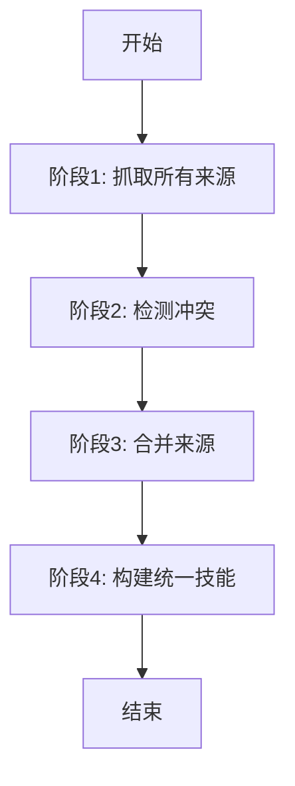
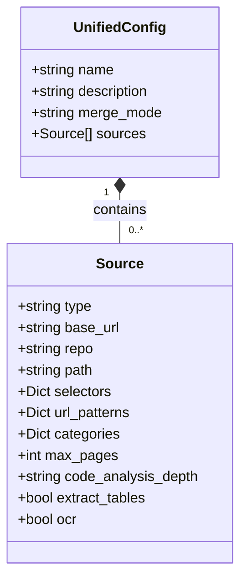
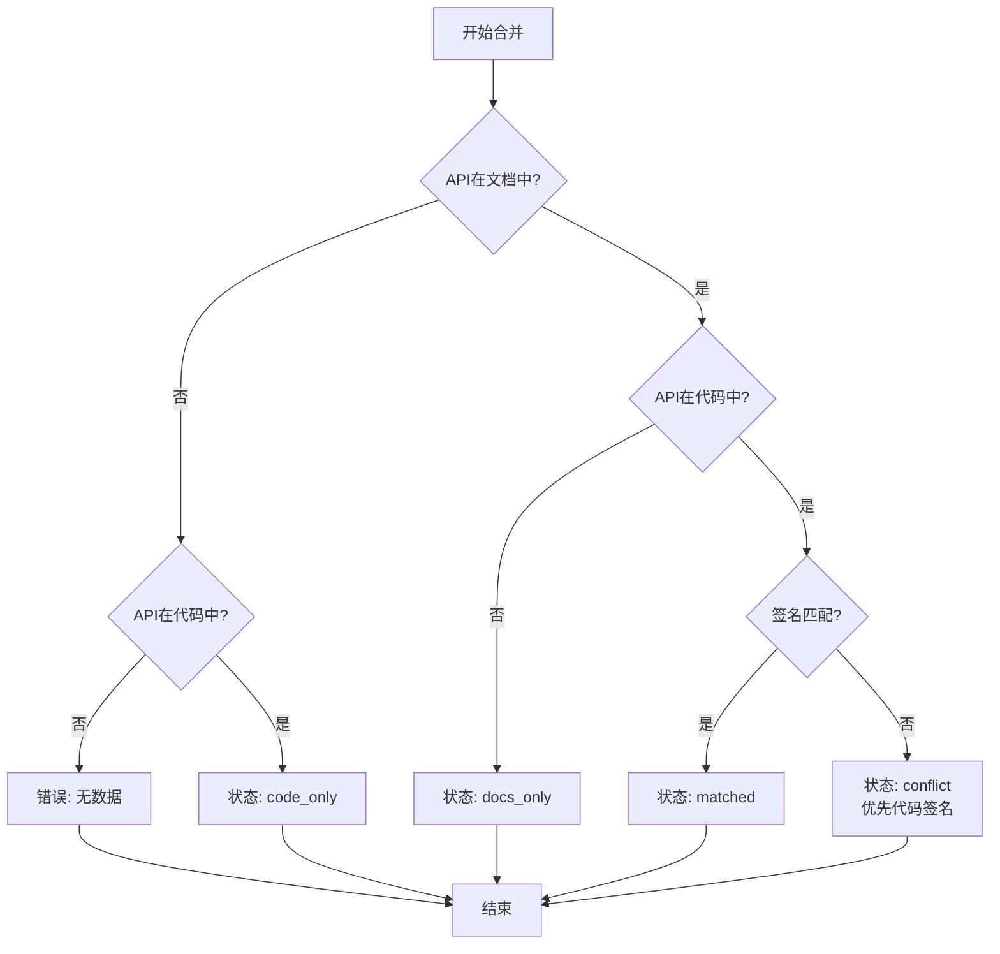

# 统一多源抓取

<cite>
**本文档引用的文件**   
- [unified_scraper.py](file://src/skill_seekers/cli/unified_scraper.py)
- [merge_sources.py](file://src/skill_seekers/cli/merge_sources.py)
- [UNIFIED_SCRAPING.md](file://docs/UNIFIED_SCRAPING.md)
- [config_validator.py](file://src/skill_seekers/cli/config_validator.py)
- [conflict_detector.py](file://src/skill_seekers/cli/conflict_detector.py)
- [github_scraper.py](file://src/skill_seekers/cli/github_scraper.py)
- [doc_scraper.py](file://src/skill_seekers/cli/doc_scraper.py)
- [pdf_scraper.py](file://src/skill_seekers/cli/pdf_scraper.py)
- [unified_skill_builder.py](file://src/skill_seekers/cli/unified_skill_builder.py)
- [react_unified.json](file://configs/react_unified.json)
- [godot_unified.json](file://configs/godot_unified.json)
- [fastapi_unified.json](file://configs/fastapi_unified.json)
</cite>

## 目录
1. [引言](#引言)
2. [统一抓取器架构](#统一抓取器架构)
3. [配置驱动的动态调度](#配置驱动的动态调度)
4. [异构数据源融合机制](#异构数据源融合机制)
5. [冲突检测与优先级排序](#冲突检测与优先级排序)
6. [透明的来源报告与元数据追踪](#透明的来源报告与元数据追踪)
7. [实际案例分析](#实际案例分析)
8. [结论](#结论)

## 引言

统一多源抓取系统旨在解决知识库构建中的核心挑战：信息孤岛与数据不一致。传统的抓取方法通常局限于单一来源，如仅从文档网站、GitHub仓库或PDF手册中提取信息，这导致生成的AI技能知识片面且容易过时。

本系统通过`unified_scraper.py`协调文档、GitHub和PDF等多种来源的数据抓取任务，实现统一的上下文构建。它根据配置文件动态调度不同类型的抓取器，通过`merge_sources.py`将异构数据源进行智能融合。该系统不仅实现了数据的去重和优先级排序，还引入了冲突标记机制，确保了知识的准确性和透明度。结合`UNIFIED_SCRAPING.md`中的设计原则，系统能够生成详细的来源报告和元数据追踪信息，为用户提供一个全面、可靠且可验证的AI技能。

**Section sources**
- [UNIFIED_SCRAPING.md](file://docs/UNIFIED_SCRAPING.md#L1-L634)

## 统一抓取器架构

`unified_scraper.py`是整个多源抓取流程的核心协调器，其设计遵循清晰的四阶段工作流，确保了从数据采集到最终技能构建的有序进行。



**Diagram sources**
- [unified_scraper.py](file://src/skill_seekers/cli/unified_scraper.py#L42-L418)

### 四阶段工作流

1.  **抓取所有来源 (Scrape All Sources)**：这是流程的起点。`UnifiedScraper`类根据配置文件中定义的`sources`数组，动态调用相应的抓取器（如`doc_scraper.py`、`github_scraper.py`、`pdf_scraper.py`）来并行或串行地从各个来源提取原始数据。此阶段的输出是存储在`output/{name}_unified_data/`目录下的多个原始数据文件。

2.  **检测冲突 (Detect Conflicts)**：在获取了来自不同来源的数据后，系统会启动`ConflictDetector`来识别不一致之处。这主要发生在文档和代码来源之间，例如API存在于代码中但未在文档中提及，或文档中的API签名与代码实现不符。检测结果以JSON格式保存，为后续的合并提供依据。

3.  **合并来源 (Merge Sources)**：这是智能融合的关键步骤。系统根据配置文件中的`merge_mode`（`rule-based`或`claude-enhanced`）选择合适的合并策略。`RuleBasedMerger`执行快速、确定性的规则合并，而`ClaudeEnhancedMerger`则启动一个交互式环境，利用Claude AI进行更深层次的智能协调。

4.  **构建统一技能 (Build Unified Skill)**：最后，`UnifiedSkillBuilder`接收所有处理后的数据，包括原始抓取数据、合并后的API参考和冲突报告，生成最终的技能包结构。这个结构包含`SKILL.md`主文件、按来源组织的`references/`目录以及冲突报告，形成一个完整的、可交付的AI技能。

**Section sources**
- [unified_scraper.py](file://src/skill_seekers/cli/unified_scraper.py#L42-L418)
- [UNIFIED_SCRAPING.md](file://docs/UNIFIED_SCRAPING.md#L505-L543)

## 配置驱动的动态调度

系统的灵活性和可扩展性源于其基于JSON配置文件的驱动模型。`unified_scraper.py`通过解析配置文件，动态决定抓取哪些来源、如何抓取以及如何合并。

### 统一配置文件结构

配置文件的核心是一个`sources`数组，其中每个元素代表一个独立的数据源。`unified_scraper.py`通过读取每个源的`type`字段来路由到相应的抓取器。



**Diagram sources**
- [unified_scraper.py](file://src/skill_seekers/cli/unified_scraper.py#L54-L83)
- [UNIFIED_SCRAPING.md](file://docs/UNIFIED_SCRAPING.md#L71-L83)

### 动态调度实现

在`unified_scraper.py`的`scrape_all_sources`方法中，系统遍历`sources`数组，并根据`source['type']`的值使用条件分支调用不同的私有方法：

*   **文档来源 (`documentation`)**：调用`_scrape_documentation`。此方法会创建一个临时的配置文件，并以子进程的方式运行`doc_scraper.py`。
*   **GitHub来源 (`github`)**：调用`_scrape_github`。此方法会直接实例化`GitHubScraper`类并执行其`scrape`方法。
*   **PDF来源 (`pdf`)**：调用`_scrape_pdf`。此方法会实例化`PDFToSkillConverter`并调用其`extract_all`方法。

这种设计模式实现了抓取逻辑的解耦，使得添加新的数据源类型（如数据库、API等）变得非常容易，只需实现新的抓取器并在此处添加一个分支即可。

**Section sources**
- [unified_scraper.py](file://src/skill_seekers/cli/unified_scraper.py#L84-L116)
- [UNIFIED_SCRAPING.md](file://docs/UNIFIED_SCRAPING.md#L24-L47)

## 异构数据源融合机制

`merge_sources.py`模块是实现数据融合的核心，它提供了两种截然不同的合并模式，以适应不同的使用场景和质量要求。

### 规则基础合并 (Rule-Based Merge)

`RuleBasedMerger`是一种快速、确定性的合并策略，适用于自动化流水线。它遵循预定义的规则来处理四种情况：

1.  **仅在文档中 (`docs_only`)**：API存在于文档中但未在代码中找到，标记为`[DOCS_ONLY]`。
2.  **仅在代码中 (`code_only`)**：API存在于代码中但未在文档中提及，标记为`[UNDOCUMENTED]`。
3.  **完全匹配 (`matched`)**：文档和代码中的API信息完全一致，直接合并。
4.  **存在冲突 (`conflict`)**：当信息不一致时，优先采用代码中的签名（作为事实来源），同时保留文档中的描述性文本，并标记冲突。



**Diagram sources**
- [merge_sources.py](file://src/skill_seekers/cli/merge_sources.py#L25-L87)
- [UNIFIED_SCRAPING.md](file://docs/UNIFIED_SCRAPING.md#L205-L217)

### Claude增强合并 (Claude-Enhanced Merge)

`ClaudeEnhancedMerger`提供了一种更高阶的、AI驱动的合并方式。当检测到冲突时，它会创建一个临时工作区，将冲突摘要、文档API和代码API等上下文信息写入文件，并启动一个新的终端会话。

在此会话中，会向Claude AI提供详细的指令，要求其：
*   以代码签名作为事实来源。
*   保留文档中的用户友好描述。
*   为差异添加实现说明。
*   清晰地标记缺失的API。
*   创建一个统一的、高质量的API参考。

用户可以审查和调整Claude的输出，然后将最终的`merged_apis.json`文件保存，从而完成合并。这种方式虽然耗时较长，但能产生质量最高的结果。

**Section sources**
- [merge_sources.py](file://src/skill_seekers/cli/merge_sources.py#L193-L443)
- [UNIFIED_SCRAPING.md](file://docs/UNIFIED_SCRAPING.md#L224-L243)

## 冲突检测与优先级排序

冲突检测是保证知识库质量的关键环节，由`conflict_detector.py`模块负责。它通过比较文档和代码分析提取的API信息，识别出四种主要类型的冲突。

### 冲突类型与严重性

| 冲突类型 (Type) | 严重性 (Severity) | 描述 |
| :--- | :--- | :--- |
| `missing_in_docs` | 中等 | API存在于代码中但未在文档中提及。这可能导致用户无法发现新功能。 |
| `missing_in_code` | 高 | API在文档中被提及但代码中不存在。这是最严重的问题，因为它会误导用户。 |
| `signature_mismatch` | 中高 | API的签名（参数、返回类型）在文档和代码中不一致。这会导致用户调用失败。 |
| `description_mismatch` | 低 | API的描述或文档字符串在文档和代码中不同。这可能造成理解上的困惑。 |

**Section sources**
- [conflict_detector.py](file://src/skill_seekers/cli/conflict_detector.py#L24-L33)
- [UNIFIED_SCRAPING.md](file://docs/UNIFIED_SCRAPING.md#L149-L203)

### 优先级排序与数据去重

在合并过程中，系统通过明确的优先级规则来解决冲突和去重：
*   **事实来源优先**：在`signature_mismatch`的情况下，代码实现被视为“事实来源”，其签名被优先采用。这确保了技能提供的信息与实际运行的代码一致。
*   **描述性文本优先**：在保留签名的同时，文档中的描述性文本通常更易于用户理解，因此被优先保留。
*   **状态标记**：通过`status`字段（`docs_only`, `code_only`, `matched`, `conflict`）对每个API进行分类，实现了逻辑上的去重和状态追踪。

**Section sources**
- [merge_sources.py](file://src/skill_seekers/cli/merge_sources.py#L144-L157)
- [UNIFIED_SCRAPING.md](file://docs/UNIFIED_SCRAPING.md#L210-L213)

## 透明的来源报告与元数据追踪

系统严格遵循`UNIFIED_SCRAPING.md`中提出的设计原则，确保了整个抓取和合并过程的完全透明。

### 来源报告结构

最终生成的技能包包含一个详细的来源报告，其结构清晰地展示了知识的来源：

```
output/skill-name/
├── SKILL.md                     # 主文件，包含来源摘要
├── references/
│   ├── documentation/           # 文档来源的完整内容
│   ├── github/                  # GitHub来源的完整内容
│   ├── pdf/                     # PDF来源的完整内容
│   ├── api/                     # 合并后的API参考
│   └── conflicts.md             # 详细的冲突报告
```

**Section sources**
- [UNIFIED_SCRAPING.md](file://docs/UNIFIED_SCRAPING.md#L247-L264)
- [unified_skill_builder.py](file://src/skill_seekers/cli/unified_skill_builder.py#L50-L54)

### 元数据追踪

系统在多个层面追踪元数据：
*   **配置文件**：`react_unified.json`等文件本身就是元数据，记录了抓取的范围、深度和策略。
*   **日志文件**：`unified_scraper.py`在运行时生成详细的日志，记录了每个阶段的执行情况。
*   **中间数据**：`output/{name}_unified_data/`目录下的`github_data.json`、`pdf_data.json`等文件保存了原始抓取数据，可供审计。
*   **冲突报告**：`conflicts.md`文件不仅列出了冲突，还包含了冲突的类型、严重性和建议，为用户提供了决策依据。

这种端到端的元数据追踪使得整个知识构建过程可追溯、可验证，极大地增强了AI技能的可信度。

**Section sources**
- [unified_skill_builder.py](file://src/skill_seekers/cli/unified_skill_builder.py#L72-L152)
- [UNIFIED_SCRAPING.md](file://docs/UNIFIED_SCRAPING.md#L266-L326)

## 实际案例分析

通过分析`configs/`目录下的几个统一配置文件，我们可以看到该系统在实际应用中的灵活性。

### React技能构建案例

`react_unified.json`配置文件展示了如何为一个流行的前端框架构建技能：
*   **来源**：从`https://react.dev/`抓取文档，并从`facebook/react`仓库抓取代码。
*   **文档抓取**：使用`article`作为主内容选择器，排除`/blog/`和`/community/`路径，以聚焦于技术文档。
*   **代码抓取**：分析`packages/react/src/`和`packages/react-dom/src/`下的JavaScript文件。
*   **合并模式**：使用`rule-based`模式，适合快速迭代。

此配置生成的技能将帮助用户理解React的API，并能通过冲突报告发现文档与代码的差异。

### Godot引擎技能构建案例

`godot_unified.json`配置文件则展示了一个更复杂的场景：
*   **来源**：同样结合了文档和代码。
*   **代码分析深度**：使用`deep`模式，以提取C++类和方法的详细签名。
*   **合并模式**：使用`claude-enhanced`模式，因为Godot引擎的API复杂，需要更智能的协调。
*   **文件模式**：精确指定了`core/**/*.cpp`和`scene/**/*.cpp`等路径，避免了不必要的分析。

这个案例体现了系统处理大型、复杂项目的能力。

**Section sources**
- [react_unified.json](file://configs/react_unified.json#L1-L45)
- [godot_unified.json](file://configs/godot_unified.json#L1-L51)
- [fastapi_unified.json](file://configs/fastapi_unified.json#L1-L46)

## 结论

`unified_scraper.py`和`merge_sources.py`共同构成了一个强大而灵活的多源知识融合系统。该系统通过配置驱动的动态调度，能够协调文档、GitHub和PDF等多种来源的数据抓取任务。其核心的融合机制，特别是规则基础和Claude增强两种合并模式，为解决数据冲突提供了从自动化到智能化的完整解决方案。

通过严格的冲突检测、优先级排序和冲突标记，系统确保了最终生成的AI技能知识的准确性和一致性。更重要的是，它通过详尽的来源报告和元数据追踪，实现了过程的完全透明，使用户能够理解知识的来源和潜在的不确定性。

这种统一的多源抓取方法，为构建高质量、可信赖的AI技能开辟了一条新路径，有效解决了传统单一来源抓取的局限性，是现代知识工程实践中的一个重要范例。