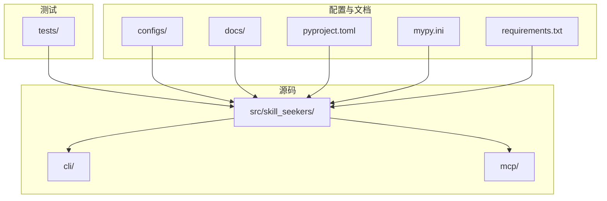
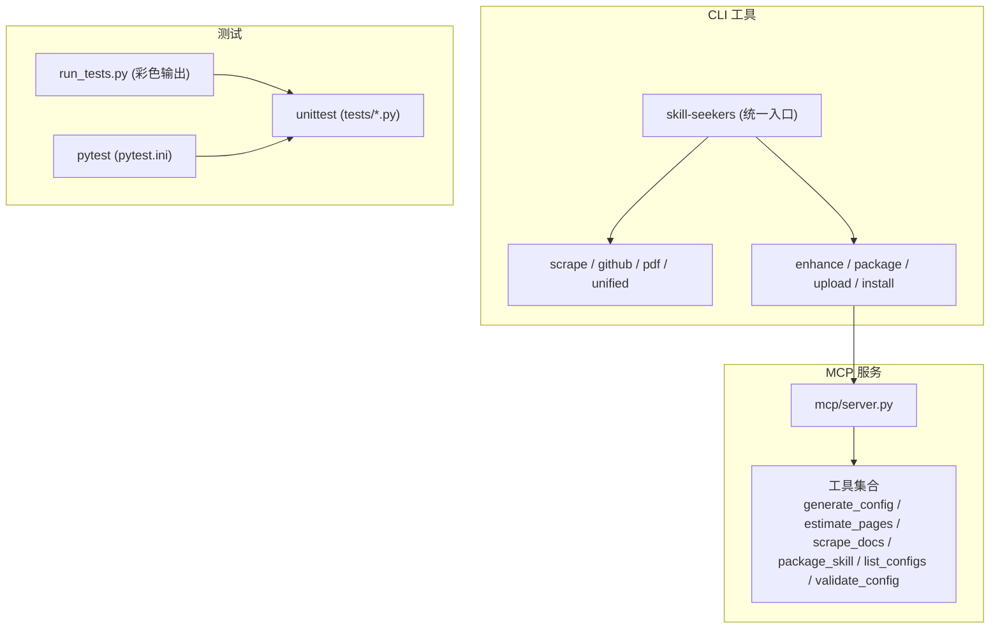
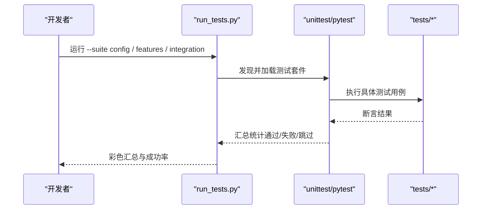
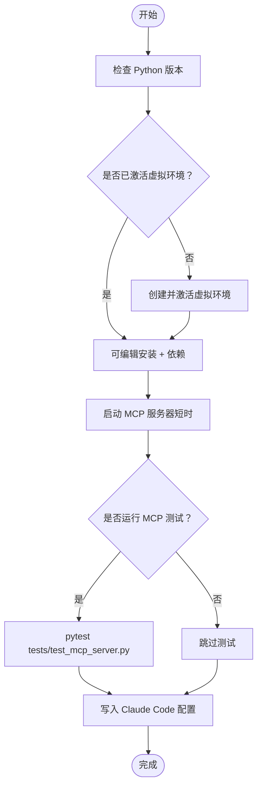
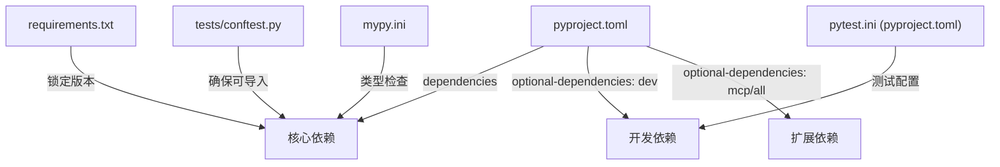

# 贡献指南

<cite>
**本文引用的文件**
- [CONTRIBUTING.md](file://CONTRIBUTING.md)
- [README.md](file://README.md)
- [pyproject.toml](file://pyproject.toml)
- [mypy.ini](file://mypy.ini)
- [requirements.txt](file://requirements.txt)
- [tests/conftest.py](file://tests/conftest.py)
- [tests/test_config_validation.py](file://tests/test_config_validation.py)
- [tests/test_mcp_server.py](file://tests/test_mcp_server.py)
- [docs/TESTING.md](file://docs/TESTING.md)
- [src/skill_seekers/cli/run_tests.py](file://src/skill_seekers/cli/run_tests.py)
- [setup_mcp.sh](file://setup_mcp.sh)
</cite>

## 目录
1. [简介](#简介)
2. [项目结构](#项目结构)
3. [核心组件](#核心组件)
4. [架构总览](#架构总览)
5. [详细组件分析](#详细组件分析)
6. [依赖关系分析](#依赖关系分析)
7. [性能与测试注意事项](#性能与测试注意事项)
8. [故障排查指南](#故障排查指南)
9. [结论](#结论)
10. [附录：开发工作流与最佳实践](#附录开发工作流与最佳实践)

## 简介
本指南面向外部贡献者，帮助你快速理解并参与 Skill Seekers 的开发。内容覆盖：
- 开发环境搭建（依赖安装、虚拟环境、工具链）
- 测试框架与运行方式（单元测试、集成测试、覆盖率）
- 代码风格与静态检查（mypy 配置）
- 提交信息格式与 Pull Request 审查流程
- 关键开发脚本的作用与使用
- 新功能开发与 Bug 修复的标准工作流

## 项目结构
仓库采用“源码在 src/、包名 skill_seekers”的现代布局，CLI 工具、MCP 服务、测试与配置文件分布清晰。核心目录与职责概览：
- src/skill_seekers/cli：命令行工具入口与子命令
- src/skill_seekers/mcp：MCP 服务器与工具实现
- tests：pytest 与 unittest 双重测试体系
- configs：预置配置示例
- docs：开发与使用文档
- 根级脚本：setup_mcp.sh、pyproject.toml、mypy.ini、requirements.txt

图表来源
- [pyproject.toml](file://pyproject.toml#L115-L123)
- [README.md](file://README.md#L774-L796)

章节来源
- [README.md](file://README.md#L774-L796)
- [pyproject.toml](file://pyproject.toml#L115-L123)

## 核心组件
- 包与入口点：通过 pyproject.toml 注册统一 CLI 入口与多个子命令入口点，便于用户直接调用。
- MCP 服务：提供 9 个工具（生成配置、估算页数、抓取文档、打包技能、列出配置、校验配置等），支持在 Claude Code 中自然语言调用。
- 测试框架：同时支持 unittest 与 pytest（pytest.ini 在 pyproject.toml 中配置），并提供自定义彩色输出的测试运行器。
- 类型检查：mypy.ini 提供渐进式类型检查策略，兼顾可维护性与逐步完善。

章节来源
- [pyproject.toml](file://pyproject.toml#L99-L114)
- [pyproject.toml](file://pyproject.toml#L124-L136)
- [mypy.ini](file://mypy.ini#L1-L14)
- [tests/conftest.py](file://tests/conftest.py#L1-L31)

## 架构总览
下图展示 MCP 服务器与测试运行器的关键交互，以及与 CLI 工具的关系。

图表来源
- [pyproject.toml](file://pyproject.toml#L99-L114)
- [src/skill_seekers/cli/run_tests.py](file://src/skill_seekers/cli/run_tests.py#L1-L229)
- [tests/test_mcp_server.py](file://tests/test_mcp_server.py#L1-L200)

## 详细组件分析

### 组件A：测试运行器与测试套件
- 自定义测试运行器 run_tests.py 支持彩色输出、失败即停、按套件运行、列表查看等能力；tests/conftest.py 确保以可编辑模式安装后才执行测试。
- docs/TESTING.md 提供了三类核心测试套件的组织与运行方式：配置验证、特性测试、集成测试；另有 PDF 相关的专项测试。
- 单元测试示例：tests/test_config_validation.py 覆盖配置字段校验、URL 规范、分类与速率限制等；集成测试示例：tests/test_mcp_server.py 覆盖 MCP 工具清单、参数校验与行为。

图表来源
- [src/skill_seekers/cli/run_tests.py](file://src/skill_seekers/cli/run_tests.py#L1-L229)
- [tests/conftest.py](file://tests/conftest.py#L1-L31)
- [docs/TESTING.md](file://docs/TESTING.md#L1-L120)

章节来源
- [src/skill_seekers/cli/run_tests.py](file://src/skill_seekers/cli/run_tests.py#L1-L229)
- [tests/conftest.py](file://tests/conftest.py#L1-L31)
- [docs/TESTING.md](file://docs/TESTING.md#L1-L200)
- [tests/test_config_validation.py](file://tests/test_config_validation.py#L1-L200)
- [tests/test_mcp_server.py](file://tests/test_mcp_server.py#L1-L200)

### 组件B：MCP 服务器与工具
- setup_mcp.sh 提供 MCP 服务器一键安装与配置，自动检测 Python 版本、可选创建虚拟环境、安装依赖、写入 Claude Code 配置文件、可选运行测试验证。
- tests/test_mcp_server.py 使用隔离异步测试用例，验证工具清单、输入模式与行为，确保 MCP 工具可用且符合预期。

图表来源
- [setup_mcp.sh](file://setup_mcp.sh#L1-L267)
- [tests/test_mcp_server.py](file://tests/test_mcp_server.py#L1-L200)

章节来源
- [setup_mcp.sh](file://setup_mcp.sh#L1-L267)
- [tests/test_mcp_server.py](file://tests/test_mcp_server.py#L1-L200)

### 组件C：类型检查与静态分析
- mypy.ini 提供渐进式类型检查策略，允许未完整标注但开启关键检查项（如不允许不完整定义、显式可选等），并显示错误代码，便于逐步完善。
- 建议在本地启用 mypy 并结合 IDE 静态提示，减少运行时错误。

章节来源
- [mypy.ini](file://mypy.ini#L1-L14)

## 依赖关系分析
- 依赖声明：pyproject.toml 定义核心依赖与可选依赖（dev、mcp、all），并通过 setuptools 包含 src/skill_seekers 及其子包。
- 测试依赖：pytest、pytest-asyncio、pytest-cov、coverage 在 dev 与 uv.dev-dependencies 中声明；pytest.ini 在 pyproject.toml 中配置。
- 运行时依赖：requirements.txt 列出当前锁定版本，可用于快速安装或对比差异。

图表来源
- [pyproject.toml](file://pyproject.toml#L40-L91)
- [pyproject.toml](file://pyproject.toml#L124-L136)
- [requirements.txt](file://requirements.txt#L1-L44)
- [tests/conftest.py](file://tests/conftest.py#L1-L31)
- [mypy.ini](file://mypy.ini#L1-L14)

章节来源
- [pyproject.toml](file://pyproject.toml#L40-L91)
- [pyproject.toml](file://pyproject.toml#L124-L136)
- [requirements.txt](file://requirements.txt#L1-L44)
- [tests/conftest.py](file://tests/conftest.py#L1-L31)
- [mypy.ini](file://mypy.ini#L1-L14)

## 性能与测试注意事项
- 测试运行器提供彩色输出与统计摘要，便于快速定位问题；pytest.ini 启用严格标记与异步模式，提升测试稳定性。
- PDF 相关测试需要额外依赖（PyMuPDF 等），若未安装会自动跳过；建议在具备依赖的环境中运行完整测试集。
- 建议在提交前运行全量测试，确保覆盖率与稳定性达标。

章节来源
- [src/skill_seekers/cli/run_tests.py](file://src/skill_seekers/cli/run_tests.py#L1-L229)
- [pyproject.toml](file://pyproject.toml#L124-L136)
- [docs/TESTING.md](file://docs/TESTING.md#L496-L520)

## 故障排查指南
- 测试无法导入包：确认已在可编辑模式安装（pip install -e .），或激活虚拟环境。
- MCP 服务器无法启动：检查 Python 版本、依赖安装、路径配置；使用 setup_mcp.sh 自动化配置。
- 类型检查报错：根据 mypy.ini 的策略逐步完善类型注解；必要时放宽规则以渐进式改进。
- 测试失败定位：使用 run_tests.py 的 --list 查看测试清单，或单测运行定位具体用例。

章节来源
- [tests/conftest.py](file://tests/conftest.py#L1-L31)
- [setup_mcp.sh](file://setup_mcp.sh#L1-L267)
- [mypy.ini](file://mypy.ini#L1-L14)
- [docs/TESTING.md](file://docs/TESTING.md#L473-L520)

## 结论
本指南提供了从环境搭建到测试运行、从代码风格到 PR 流程的完整贡献路径。建议贡献者遵循以下要点：
- 使用可编辑安装与虚拟环境，确保测试与运行一致性
- 优先使用 pytest 与 run_tests.py 的彩色输出进行快速反馈
- 逐步完善类型注解，配合 mypy 渐进式提升质量
- 严格遵守分支与 PR 流程，确保变更可追溯、可审查

## 附录：开发工作流与最佳实践

### 开发环境搭建步骤
- Python 与 Git：满足最低版本要求，确保网络畅通
- 可选：使用 uv 或 pip 安装依赖；推荐使用可编辑安装以便本地修改即时生效
- MCP 集成：使用 setup_mcp.sh 一键安装并配置 Claude Code

章节来源
- [README.md](file://README.md#L530-L580)
- [setup_mcp.sh](file://setup_mcp.sh#L1-L267)
- [pyproject.toml](file://pyproject.toml#L1-L20)

### 测试流程与运行方法
- 全量测试：python -m pytest tests/ -v
- 指定文件：python -m pytest tests/test_mcp_server.py -v
- 使用 run_tests.py：支持按套件运行、彩色输出、失败即停、列表查看
- 配置验证测试：tests/test_config_validation.py
- MCP 集成测试：tests/test_mcp_server.py

章节来源
- [CONTRIBUTING.md](file://CONTRIBUTING.md#L329-L363)
- [docs/TESTING.md](file://docs/TESTING.md#L1-L120)
- [src/skill_seekers/cli/run_tests.py](file://src/skill_seekers/cli/run_tests.py#L160-L229)
- [tests/test_config_validation.py](file://tests/test_config_validation.py#L1-L200)
- [tests/test_mcp_server.py](file://tests/test_mcp_server.py#L1-L200)

### 代码风格规范与静态检查
- Python 风格：遵循 PEP 8，行宽 100，缩进 4 空格，字符串使用双引号，命名风格见 CONTRIBUTING.md
- 文档注释：函数需 docstring，类型提示建议使用
- 类型检查：mypy.ini 提供渐进式策略，建议逐步收紧规则
- 覆盖率：pytest.ini 中配置覆盖率源与忽略路径

章节来源
- [CONTRIBUTING.md](file://CONTRIBUTING.md#L264-L327)
- [mypy.ini](file://mypy.ini#L1-L14)
- [pyproject.toml](file://pyproject.toml#L137-L151)

### 提交信息格式与 PR 审查流程
- 分支策略：两分支模型（main 生产分支、development 集成分支），PR 默认指向 development
- PR 模板：包含变更类型、测试说明、自检清单等
- 审查流程：维护者在 3-5 个工作日内完成审查，按反馈修改后合并

章节来源
- [CONTRIBUTING.md](file://CONTRIBUTING.md#L18-L76)
- [CONTRIBUTING.md](file://CONTRIBUTING.md#L220-L263)

### 关键开发脚本用途
- setup_mcp.sh：MCP 服务器一键安装与 Claude Code 配置
- run_tests.py：彩色输出测试运行器，支持按套件运行与统计汇总
- tests/conftest.py：pytest 配置与包存在性检查

章节来源
- [setup_mcp.sh](file://setup_mcp.sh#L1-L267)
- [src/skill_seekers/cli/run_tests.py](file://src/skill_seekers/cli/run_tests.py#L1-L229)
- [tests/conftest.py](file://tests/conftest.py#L1-L31)

### 新功能开发与 Bug 修复标准工作流
- 新功能：先设计测试用例（TDD），再实现功能，最后补齐文档与变更记录
- Bug 修复：新增回归测试，确保问题不再复现
- 提交流程：基于 development 创建特性分支，提交 PR 至 development，等待审查与合并

章节来源
- [docs/TESTING.md](file://docs/TESTING.md#L666-L717)
- [CONTRIBUTING.md](file://CONTRIBUTING.md#L151-L163)