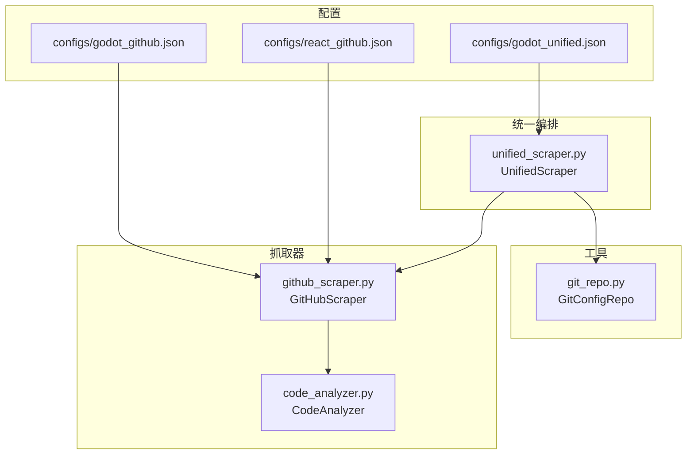
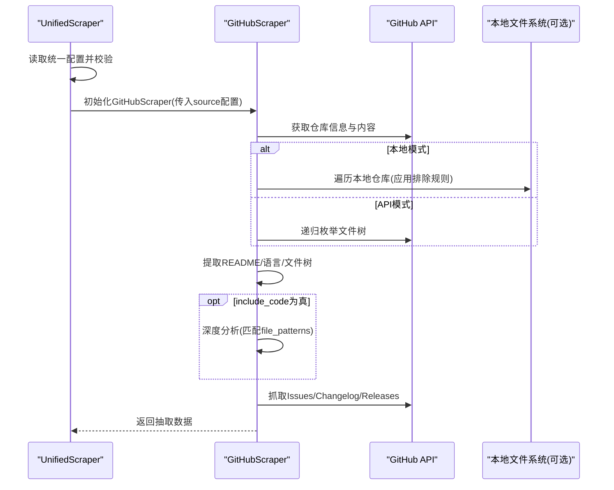
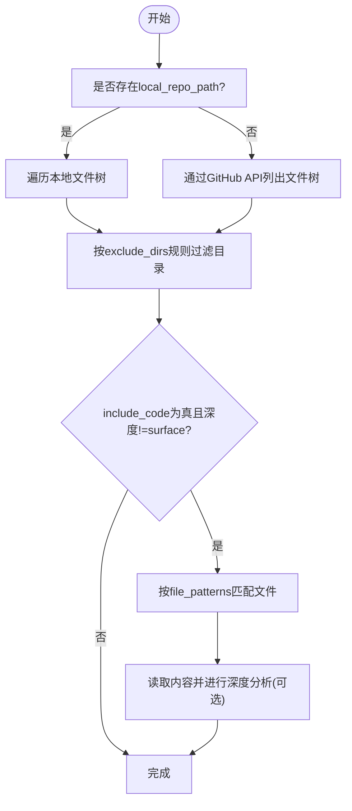
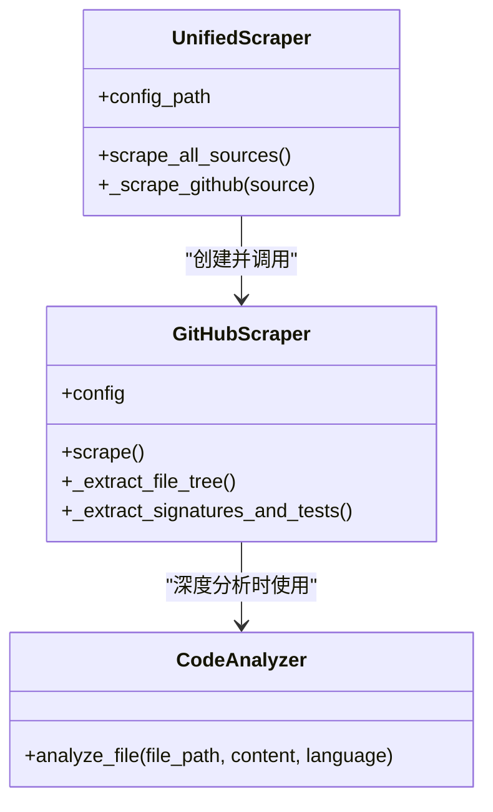
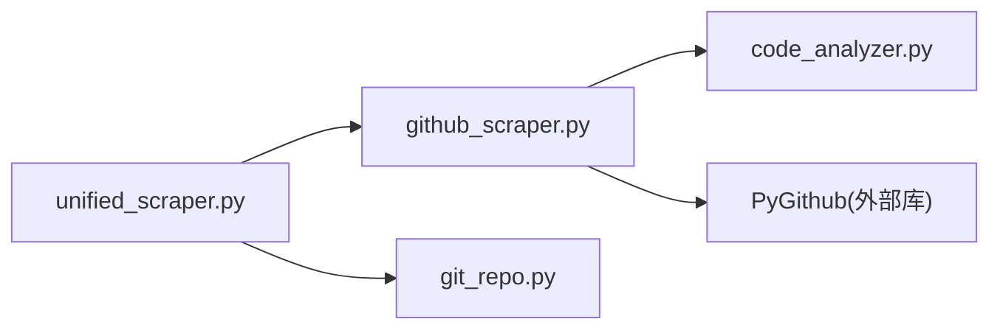

# GitHub源配置

<cite>
**本文引用的文件**
- [configs/godot_github.json](file://configs/godot_github.json)
- [configs/react_github.json](file://configs/react_github.json)
- [configs/godot_unified.json](file://configs/godot_unified.json)
- [src/skill_seekers/cli/github_scraper.py](file://src/skill_seekers/cli/github_scraper.py)
- [src/skill_seekers/cli/unified_scraper.py](file://src/skill_seekers/cli/unified_scraper.py)
- [src/skill_seekers/cli/code_analyzer.py](file://src/skill_seekers/cli/code_analyzer.py)
- [src/skill_seekers/mcp/git_repo.py](file://src/skill_seekers/mcp/git_repo.py)
- [docs/UNIFIED_SCRAPING.md](file://docs/UNIFIED_SCRAPING.md)
- [tests/test_github_scraper.py](file://tests/test_github_scraper.py)
- [tests/test_unified.py](file://tests/test_unified.py)
</cite>

## 目录
1. [简介](#简介)
2. [项目结构](#项目结构)
3. [核心组件](#核心组件)
4. [架构总览](#架构总览)
5. [详细组件分析](#详细组件分析)
6. [依赖关系分析](#依赖关系分析)
7. [性能考量](#性能考量)
8. [故障排查指南](#故障排查指南)
9. [结论](#结论)
10. [附录](#附录)

## 简介
本技术文档聚焦于“GitHub源配置”的使用方法与实现机制，围绕以下目标展开：
- 如何通过配置文件中的repo字段指定GitHub仓库
- 如何用branch、file_patterns、exclude_dirs等参数控制代码分析范围
- 使用godot_github.json等实例讲解文件匹配模式与目录排除规则
- 解释系统如何通过github_scraper.py实现代码文件遍历、元数据提取与问题/发布信息抓取
- 说明该配置与统一抓取流程（unified_scraper）的集成方式

## 项目结构
与GitHub源配置直接相关的文件与模块分布如下：
- 配置样例：configs/godot_github.json、configs/react_github.json、configs/godot_unified.json
- GitHub抓取器：src/skill_seekers/cli/github_scraper.py
- 统一抓取编排器：src/skill_seekers/cli/unified_scraper.py
- 代码分析器：src/skill_seekers/cli/code_analyzer.py
- Git配置仓库管理：src/skill_seekers/mcp/git_repo.py
- 统一抓取文档：docs/UNIFIED_SCRAPING.md
- 测试用例：tests/test_github_scraper.py、tests/test_unified.py

图表来源
- [configs/godot_github.json](file://configs/godot_github.json#L1-L20)
- [configs/react_github.json](file://configs/react_github.json#L1-L16)
- [configs/godot_unified.json](file://configs/godot_unified.json#L1-L51)
- [src/skill_seekers/cli/github_scraper.py](file://src/skill_seekers/cli/github_scraper.py#L1-L220)
- [src/skill_seekers/cli/unified_scraper.py](file://src/skill_seekers/cli/unified_scraper.py#L1-L120)
- [src/skill_seekers/cli/code_analyzer.py](file://src/skill_seekers/cli/code_analyzer.py#L1-L120)
- [src/skill_seekers/mcp/git_repo.py](file://src/skill_seekers/mcp/git_repo.py#L1-L120)

章节来源
- [configs/godot_github.json](file://configs/godot_github.json#L1-L20)
- [configs/react_github.json](file://configs/react_github.json#L1-L16)
- [configs/godot_unified.json](file://configs/godot_unified.json#L1-L51)
- [src/skill_seekers/cli/github_scraper.py](file://src/skill_seekers/cli/github_scraper.py#L1-L220)
- [src/skill_seekers/cli/unified_scraper.py](file://src/skill_seekers/cli/unified_scraper.py#L1-L120)
- [src/skill_seekers/cli/code_analyzer.py](file://src/skill_seekers/cli/code_analyzer.py#L1-L120)
- [src/skill_seekers/mcp/git_repo.py](file://src/skill_seekers/mcp/git_repo.py#L1-L120)
- [docs/UNIFIED_SCRAPING.md](file://docs/UNIFIED_SCRAPING.md#L1-L120)

## 核心组件
- GitHubScraper：负责从GitHub仓库抓取元数据（仓库信息、README、语言分布、文件树）、Issues、Changelog、Releases；支持本地路径模式与文件匹配/排除规则；可选深度代码分析。
- CodeAnalyzer：在深度分析模式下解析文件，抽取函数/类签名、参数类型、返回类型等。
- UnifiedScraper：统一多源抓取编排器，支持从文档、GitHub、PDF等多源抓取，并进行冲突检测与合并。
- GitConfigRepo：用于克隆/拉取配置仓库，支持注入令牌、浅克隆、错误提示等。

章节来源
- [src/skill_seekers/cli/github_scraper.py](file://src/skill_seekers/cli/github_scraper.py#L61-L213)
- [src/skill_seekers/cli/code_analyzer.py](file://src/skill_seekers/cli/code_analyzer.py#L58-L120)
- [src/skill_seekers/cli/unified_scraper.py](file://src/skill_seekers/cli/unified_scraper.py#L42-L120)
- [src/skill_seekers/mcp/git_repo.py](file://src/skill_seekers/mcp/git_repo.py#L17-L120)

## 架构总览
统一抓取流程中，GitHub源配置作为“sources”数组中的一个条目被识别与处理。UnifiedScraper根据source.type路由到GitHubScraper，后者再按配置执行文件树构建、语言统计、README/Changelog/Issues/Releases提取，并可选地进行深度代码分析。

图表来源
- [src/skill_seekers/cli/unified_scraper.py](file://src/skill_seekers/cli/unified_scraper.py#L169-L214)
- [src/skill_seekers/cli/github_scraper.py](file://src/skill_seekers/cli/github_scraper.py#L169-L213)
- [src/skill_seekers/cli/github_scraper.py](file://src/skill_seekers/cli/github_scraper.py#L328-L419)
- [src/skill_seekers/cli/github_scraper.py](file://src/skill_seekers/cli/github_scraper.py#L420-L532)
- [src/skill_seekers/cli/github_scraper.py](file://src/skill_seekers/cli/github_scraper.py#L533-L616)

章节来源
- [src/skill_seekers/cli/unified_scraper.py](file://src/skill_seekers/cli/unified_scraper.py#L169-L214)
- [src/skill_seekers/cli/github_scraper.py](file://src/skill_seekers/cli/github_scraper.py#L169-L213)
- [src/skill_seekers/cli/github_scraper.py](file://src/skill_seekers/cli/github_scraper.py#L328-L419)
- [src/skill_seekers/cli/github_scraper.py](file://src/skill_seekers/cli/github_scraper.py#L420-L532)
- [src/skill_seekers/cli/github_scraper.py](file://src/skill_seekers/cli/github_scraper.py#L533-L616)

## 详细组件分析

### GitHub源配置字段与行为
- repo：必填，格式为“owner/repo”，用于定位GitHub仓库。
- github_token：可选，优先从环境变量GITHUB_TOKEN读取，其次从配置读取；未提供时使用匿名访问（速率限制较低）。
- include_issues/include_changelog/include_releases：布尔开关，控制是否抓取对应内容。
- max_issues：限制抓取Issue数量。
- include_code：是否进行代码分析（影响文件树与签名抽取）。
- code_analysis_depth：分析深度，支持“surface”“deep”“full”。
- file_patterns：文件匹配模式列表，支持通配符，仅对include_code为真且深度不为“surface”时生效。
- exclude_dirs/exclude_dirs_additional：目录排除策略，前者为替换式，后者为扩展式；默认包含常见虚拟环境、缓存、版本控制等目录。
- local_repo_path：本地仓库路径，启用后可无限制遍历本地文件树，不受API限制。

章节来源
- [configs/godot_github.json](file://configs/godot_github.json#L1-L20)
- [configs/react_github.json](file://configs/react_github.json#L1-L16)
- [src/skill_seekers/cli/github_scraper.py](file://src/skill_seekers/cli/github_scraper.py#L77-L135)
- [src/skill_seekers/cli/github_scraper.py](file://src/skill_seekers/cli/github_scraper.py#L149-L168)
- [src/skill_seekers/cli/github_scraper.py](file://src/skill_seekers/cli/github_scraper.py#L304-L327)
- [src/skill_seekers/cli/github_scraper.py](file://src/skill_seekers/cli/github_scraper.py#L328-L419)
- [src/skill_seekers/cli/github_scraper.py](file://src/skill_seekers/cli/github_scraper.py#L420-L532)

### 文件匹配与目录排除逻辑
- 目录排除：
  - 默认排除集合包含常见目录名与路径前缀；
  - 若配置中存在exclude_dirs，则完全覆盖默认集合；
  - 若配置中存在exclude_dirs_additional，则在默认集合基础上追加。
- 文件匹配：
  - 当include_code为真且code_analysis_depth非“surface”时，会基于file_patterns进行匹配；
  - 匹配采用通配符模式，结合文件扩展名映射（如Python/JS/TS/C/C++）筛选目标文件；
  - 在API模式下，为避免超限，默认限制分析文件数量上限。

图表来源
- [src/skill_seekers/cli/github_scraper.py](file://src/skill_seekers/cli/github_scraper.py#L328-L419)
- [src/skill_seekers/cli/github_scraper.py](file://src/skill_seekers/cli/github_scraper.py#L420-L532)
- [src/skill_seekers/cli/github_scraper.py](file://src/skill_seekers/cli/github_scraper.py#L304-L327)

章节来源
- [src/skill_seekers/cli/github_scraper.py](file://src/skill_seekers/cli/github_scraper.py#L304-L327)
- [src/skill_seekers/cli/github_scraper.py](file://src/skill_seekers/cli/github_scraper.py#L328-L419)
- [src/skill_seekers/cli/github_scraper.py](file://src/skill_seekers/cli/github_scraper.py#L420-L532)

### 代码分析器（CodeAnalyzer）
- 支持多种语言的AST解析（Python、JavaScript/TypeScript、C/C++），抽取类与函数签名、参数类型、返回类型、装饰器等；
- 分析深度由GitHubScraper传入，不同深度对应不同的处理策略；
- 对于不支持的语言或解析异常，会记录警告并跳过该文件。

章节来源
- [src/skill_seekers/cli/code_analyzer.py](file://src/skill_seekers/cli/code_analyzer.py#L58-L120)
- [src/skill_seekers/cli/code_analyzer.py](file://src/skill_seekers/cli/code_analyzer.py#L120-L200)
- [src/skill_seekers/cli/github_scraper.py](file://src/skill_seekers/cli/github_scraper.py#L420-L532)

### 统一抓取流程中的GitHub源集成
- UnifiedScraper在加载配置后，按顺序扫描sources数组；
- 当source.type为“github”时，构造GitHubScraper所需配置（包括repo、include_*、code_analysis_depth、file_patterns、exclude_dirs等），调用其scrape()抓取数据；
- 抓取结果保存至统一数据目录，供后续冲突检测与技能构建使用。

图表来源
- [src/skill_seekers/cli/unified_scraper.py](file://src/skill_seekers/cli/unified_scraper.py#L169-L214)
- [src/skill_seekers/cli/github_scraper.py](file://src/skill_seekers/cli/github_scraper.py#L169-L213)
- [src/skill_seekers/cli/code_analyzer.py](file://src/skill_seekers/cli/code_analyzer.py#L58-L120)

章节来源
- [src/skill_seekers/cli/unified_scraper.py](file://src/skill_seekers/cli/unified_scraper.py#L169-L214)
- [src/skill_seekers/cli/github_scraper.py](file://src/skill_seekers/cli/github_scraper.py#L169-L213)
- [src/skill_seekers/cli/code_analyzer.py](file://src/skill_seekers/cli/code_analyzer.py#L58-L120)

### 实例配置解读
- godot_github.json
  - 指定repo为godotengine/godot；
  - include_code为false，因此不会进行深度代码分析；
  - file_patterns限定核心引擎代码目录（core、scene、servers）下的头文件与源文件；
  - include_issues/include_changelog/include_releases开启，抓取问题、变更日志与发布信息。
- react_github.json
  - 指定repo为facebook/react；
  - include_code为false；
  - file_patterns限定packages目录下的JS/TS文件；
  - include_issues/include_changelog/include_releases开启。
- godot_unified.json
  - 作为统一配置示例，其中github源部分与godot_github.json类似，但置于sources数组中，配合文档源共同使用；
  - code_analysis_depth设为“deep”，include_code为true，file_patterns同样限定核心引擎代码目录。

章节来源
- [configs/godot_github.json](file://configs/godot_github.json#L1-L20)
- [configs/react_github.json](file://configs/react_github.json#L1-L16)
- [configs/godot_unified.json](file://configs/godot_unified.json#L1-L51)

## 依赖关系分析
- GitHubScraper依赖PyGithub库进行API交互；在未安装时会给出明确提示。
- CodeAnalyzer依赖AST与正则表达式进行语法分析；对不支持的语言或解析失败会降级处理。
- UnifiedScraper在运行时动态导入GitHubScraper以避免不必要的耦合。
- GitConfigRepo用于管理配置仓库的克隆与更新，支持注入令牌与URL验证。

图表来源
- [src/skill_seekers/cli/unified_scraper.py](file://src/skill_seekers/cli/unified_scraper.py#L1-L60)
- [src/skill_seekers/cli/github_scraper.py](file://src/skill_seekers/cli/github_scraper.py#L1-L48)
- [src/skill_seekers/mcp/git_repo.py](file://src/skill_seekers/mcp/git_repo.py#L1-L40)

章节来源
- [src/skill_seekers/cli/unified_scraper.py](file://src/skill_seekers/cli/unified_scraper.py#L1-L60)
- [src/skill_seekers/cli/github_scraper.py](file://src/skill_seekers/cli/github_scraper.py#L1-L48)
- [src/skill_seekers/mcp/git_repo.py](file://src/skill_seekers/mcp/git_repo.py#L1-L40)

## 性能考量
- API模式下文件树与代码分析受GitHub API速率限制约束；建议：
  - 使用个人令牌提升配额；
  - 合理设置max_issues；
  - 适度缩小file_patterns范围；
  - 将code_analysis_depth设为“surface”或“deep”而非“full”。
- 本地模式（local_repo_path）可绕开API限制，但需确保磁盘空间充足且排除规则合理，避免扫描无关目录。

章节来源
- [src/skill_seekers/cli/github_scraper.py](file://src/skill_seekers/cli/github_scraper.py#L149-L168)
- [src/skill_seekers/cli/github_scraper.py](file://src/skill_seekers/cli/github_scraper.py#L420-L532)
- [docs/UNIFIED_SCRAPING.md](file://docs/UNIFIED_SCRAPING.md#L546-L574)

## 故障排查指南
- 认证失败
  - 确认GITHUB_TOKEN环境变量或配置中的github_token是否正确；
  - 若使用SSH URL，请确认已转换为HTTPS并注入令牌。
- 仓库不存在或权限不足
  - 检查repo字段格式与访问权限；
  - 对私有仓库请提供有效令牌。
- API速率限制
  - 使用令牌或降低max_issues；
  - 在本地模式下使用local_repo_path。
- 文件匹配无效
  - 确认include_code为真且code_analysis_depth非“surface”；
  - 检查file_patterns是否与实际路径一致；
  - 排除规则可能误删目录，必要时使用exclude_dirs_additional补充。
- 统一抓取未检测到冲突
  - 确保文档源启用了API提取，且GitHub源启用了include_code；
  - 参考最佳实践调整file_patterns与分析深度。

章节来源
- [src/skill_seekers/cli/github_scraper.py](file://src/skill_seekers/cli/github_scraper.py#L149-L168)
- [src/skill_seekers/mcp/git_repo.py](file://src/skill_seekers/mcp/git_repo.py#L101-L132)
- [docs/UNIFIED_SCRAPING.md](file://docs/UNIFIED_SCRAPING.md#L575-L634)
- [tests/test_github_scraper.py](file://tests/test_github_scraper.py#L1-L120)
- [tests/test_unified.py](file://tests/test_unified.py#L1-L120)

## 结论
- GitHub源配置通过repo字段精准指向目标仓库，结合include_*、code_analysis_depth、file_patterns与exclude_dirs等参数，可以灵活控制抓取范围与深度。
- 在统一抓取流程中，UnifiedScraper自动识别github类型的source并委派给GitHubScraper执行，最终产出可用于冲突检测与技能构建的数据。
- 建议优先使用“surface”或“deep”分析深度，合理设置file_patterns与max_issues，以平衡质量与性能。

## 附录
- 统一抓取文档提供了完整的配置结构、冲突检测与合并策略说明，可作为进一步实践的参考。

章节来源
- [docs/UNIFIED_SCRAPING.md](file://docs/UNIFIED_SCRAPING.md#L1-L120)