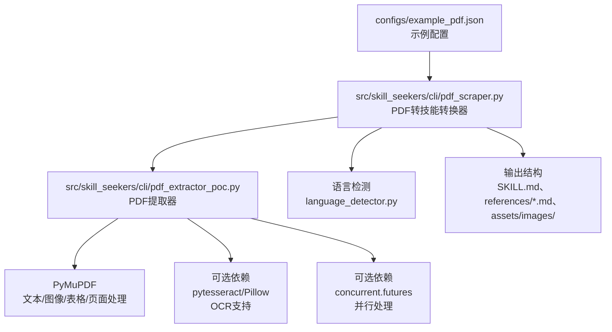
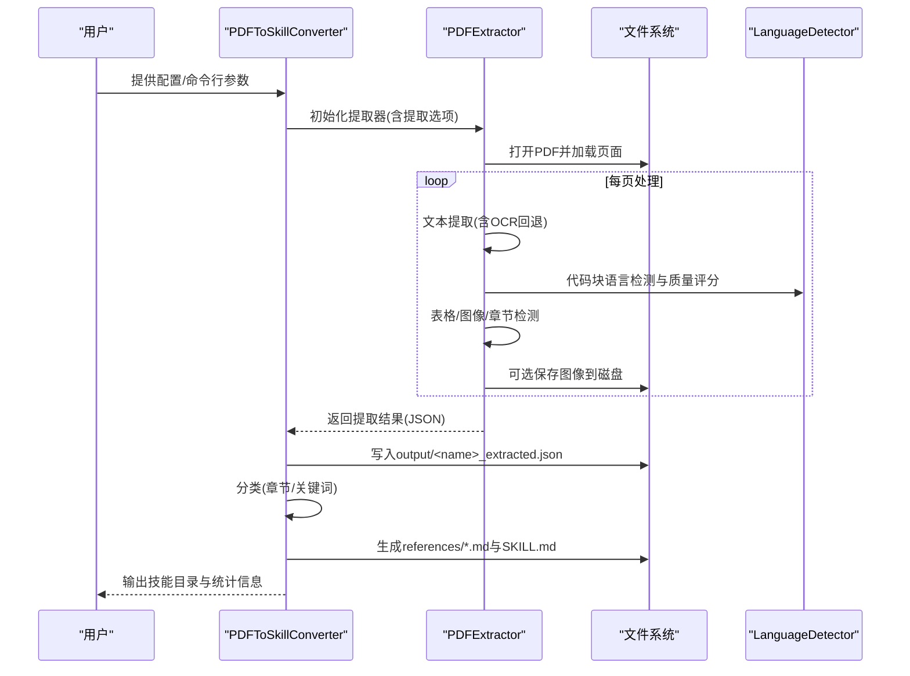
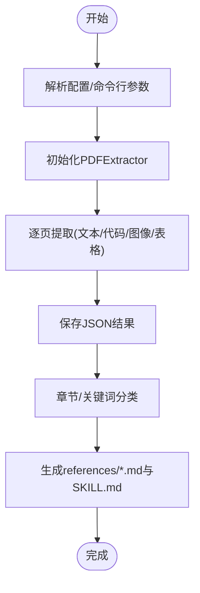
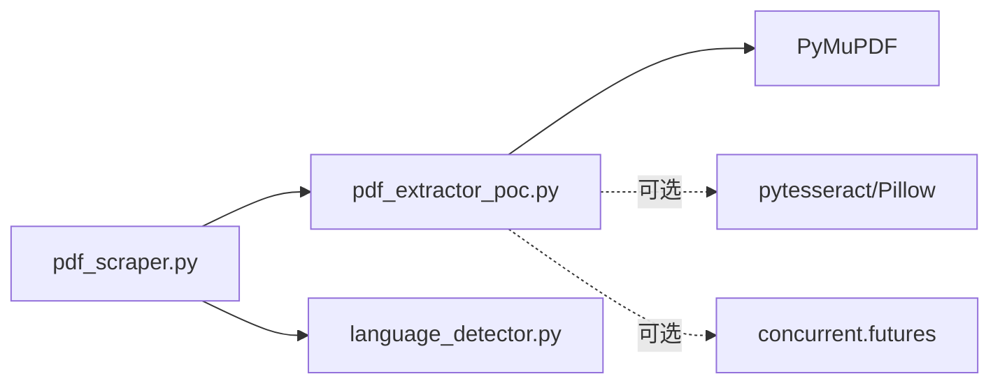

# PDF源配置

<cite>
**本文引用的文件**
- [configs/example_pdf.json](file://configs/example_pdf.json)
- [src/skill_seekers/cli/pdf_scraper.py](file://src/skill_seekers/cli/pdf_scraper.py)
- [src/skill_seekers/cli/pdf_extractor_poc.py](file://src/skill_seekers/cli/pdf_extractor_poc.py)
- [docs/PDF_SCRAPER.md](file://docs/PDF_SCRAPER.md)
- [docs/PDF_IMAGE_EXTRACTION.md](file://docs/PDF_IMAGE_EXTRACTION.md)
- [docs/PDF_ADVANCED_FEATURES.md](file://docs/PDF_ADVANCED_FEATURES.md)
- [tests/test_pdf_scraper.py](file://tests/test_pdf_scraper.py)
- [tests/test_pdf_advanced_features.py](file://tests/test_pdf_advanced_features.py)
- [src/skill_seekers/cli/language_detector.py](file://src/skill_seekers/cli/language_detector.py)
</cite>

## 目录
1. [简介](#简介)
2. [项目结构](#项目结构)
3. [核心组件](#核心组件)
4. [架构总览](#架构总览)
5. [详细组件分析](#详细组件分析)
6. [依赖关系分析](#依赖关系分析)
7. [性能考量](#性能考量)
8. [故障排查指南](#故障排查指南)
9. [结论](#结论)
10. [附录](#附录)

## 简介
本技术文档围绕“PDF源配置”展开，目标是帮助用户通过配置文件与命令行参数，精准控制PDF文档的提取范围与质量，并基于示例配置说明如何进行分页提取与图像抽取；同时深入解析系统如何通过 pdf_scraper.py 与 pdf_extractor_poc.py 实现文本、表格与图像的提取机制，并明确 OCR 的启用条件、使用方式与性能影响。

## 项目结构
与PDF源配置直接相关的文件与职责如下：
- 配置样例：configs/example_pdf.json 提供了基础字段与提取选项的参考
- CLI工具链：pdf_scraper.py 负责从配置到技能构建的完整流程；pdf_extractor_poc.py 提供底层提取能力（文本、代码块、图像、表格、章节、质量评分、OCR、密码保护、并行与缓存）
- 文档说明：PDF_SCRAPER.md、PDF_IMAGE_EXTRACTION.md、PDF_ADVANCED_FEATURES.md 提供使用方法、输出结构与高级特性说明
- 测试用例：tests/test_pdf_scraper.py 与 tests/test_pdf_advanced_features.py 验证功能正确性与边界行为

图表来源
- [configs/example_pdf.json](file://configs/example_pdf.json#L1-L18)
- [src/skill_seekers/cli/pdf_scraper.py](file://src/skill_seekers/cli/pdf_scraper.py#L25-L110)
- [src/skill_seekers/cli/pdf_extractor_poc.py](file://src/skill_seekers/cli/pdf_extractor_poc.py#L84-L115)
- [src/skill_seekers/cli/language_detector.py](file://src/skill_seekers/cli/language_detector.py#L385-L420)

章节来源
- [configs/example_pdf.json](file://configs/example_pdf.json#L1-L18)
- [src/skill_seekers/cli/pdf_scraper.py](file://src/skill_seekers/cli/pdf_scraper.py#L25-L110)
- [src/skill_seekers/cli/pdf_extractor_poc.py](file://src/skill_seekers/cli/pdf_extractor_poc.py#L84-L115)

## 核心组件
- PDF配置文件（JSON）：用于声明技能名称、描述、PDF路径与提取选项（如分页大小、最小质量、是否抽取图像、图像尺寸阈值等），并可选地定义关键词分类规则
- PDFToSkillConverter：读取配置，调用PDFExtractor执行提取，随后按章节或关键词对内容进行分类，生成技能目录结构与参考文档
- PDFExtractor：基于PyMuPDF实现文本、代码块、图像、表格、章节检测与合并、质量评分与过滤、OCR、密码保护、并行与缓存等高级能力

章节来源
- [configs/example_pdf.json](file://configs/example_pdf.json#L1-L18)
- [src/skill_seekers/cli/pdf_scraper.py](file://src/skill_seekers/cli/pdf_scraper.py#L25-L110)
- [src/skill_seekers/cli/pdf_extractor_poc.py](file://src/skill_seekers/cli/pdf_extractor_poc.py#L84-L115)

## 架构总览
下图展示了从配置到最终技能的端到端流程，包括提取器的内部处理步骤与可选的高级特性。

图表来源
- [src/skill_seekers/cli/pdf_scraper.py](file://src/skill_seekers/cli/pdf_scraper.py#L47-L110)
- [src/skill_seekers/cli/pdf_extractor_poc.py](file://src/skill_seekers/cli/pdf_extractor_poc.py#L730-L820)
- [src/skill_seekers/cli/language_detector.py](file://src/skill_seekers/cli/language_detector.py#L453-L482)

## 详细组件分析

### 配置文件字段与参数说明
- 必填字段
  - name：技能标识符，用于目录命名与文件名
  - pdf_path：PDF文件路径（支持绝对或相对路径）
- 可选字段
  - description：技能描述，用于生成SKILL.md
  - extract_options：提取选项对象
    - chunk_size：每块包含的页数（0表示不分块）
    - min_quality：最小代码质量分数（0-10）
    - extract_images：是否抽取图像到文件
    - min_image_size：图像最小尺寸（像素）
  - categories：关键词分类映射（可选），键为分类名，值为关键词数组

章节来源
- [configs/example_pdf.json](file://configs/example_pdf.json#L1-L18)
- [docs/PDF_SCRAPER.md](file://docs/PDF_SCRAPER.md#L131-L212)

### 分页提取与章节检测
- 分页策略：通过 chunk_size 控制每块页数；当检测到章节起始时会强制断开当前块，确保章节完整性
- 章节识别：优先检查页面首部标题级别（如h1/h2），其次匹配常见章节前缀模式
- 块合并：在多页连续代码块场景中，系统尝试跨页合并，提升可读性

章节来源
- [src/skill_seekers/cli/pdf_extractor_poc.py](file://src/skill_seekers/cli/pdf_extractor_poc.py#L594-L664)
- [src/skill_seekers/cli/pdf_extractor_poc.py](file://src/skill_seekers/cli/pdf_extractor_poc.py#L511-L542)
- [src/skill_seekers/cli/pdf_extractor_poc.py](file://src/skill_seekers/cli/pdf_extractor_poc.py#L543-L593)

### 文本、代码块与语言检测
- 文本提取：优先使用结构化markdown，其次普通文本
- 代码块检测：基于字体（等宽）、缩进、正则模式三类方法检测，去重后按质量排序
- 语言检测：统一使用 LanguageDetector，结合CSS类与模式匹配，输出语言与置信度
- 质量评分：综合语言置信度、长度、行数、语法有效性、变量命名等维度打分

章节来源
- [src/skill_seekers/cli/pdf_extractor_poc.py](file://src/skill_seekers/cli/pdf_extractor_poc.py#L730-L820)
- [src/skill_seekers/cli/pdf_extractor_poc.py](file://src/skill_seekers/cli/pdf_extractor_poc.py#L217-L289)
- [src/skill_seekers/cli/pdf_extractor_poc.py](file://src/skill_seekers/cli/pdf_extractor_poc.py#L290-L336)
- [src/skill_seekers/cli/language_detector.py](file://src/skill_seekers/cli/language_detector.py#L385-L555)

### 图像提取与组织
- 图像抽取：遍历页面嵌入图像，按最小尺寸阈值过滤，保存至 assets/images/ 并记录元数据
- 引用生成：在参考文档中插入相对路径图片链接，便于打包与展示
- 性能：图像抽取带来约10%-20%的额外耗时，取决于图像数量与分辨率

章节来源
- [docs/PDF_IMAGE_EXTRACTION.md](file://docs/PDF_IMAGE_EXTRACTION.md#L1-L120)
- [src/skill_seekers/cli/pdf_extractor_poc.py](file://src/skill_seekers/cli/pdf_extractor_poc.py#L666-L729)
- [src/skill_seekers/cli/pdf_scraper.py](file://src/skill_seekers/cli/pdf_scraper.py#L200-L247)

### 表格提取
- 使用PyMuPDF内置表格检测接口，返回行列矩阵与边界框等信息
- 可在提取流程中开启，适合技术文档中的数据表场景

章节来源
- [src/skill_seekers/cli/pdf_extractor_poc.py](file://src/skill_seekers/cli/pdf_extractor_poc.py#L158-L191)

### OCR选项与启用条件
- 启用条件：需安装系统级Tesseract引擎与Python包（pytesseract、Pillow），并在命令行或配置中显式开启
- 触发逻辑：当页面常规文本字符数过少且启用OCR时，自动渲染页面为图像并运行OCR；若OCR结果更长则采用OCR文本
- 性能影响：单页耗时增加约2-5秒，建议配合并行处理与日志观察进度

章节来源
- [docs/PDF_ADVANCED_FEATURES.md](file://docs/PDF_ADVANCED_FEATURES.md#L30-L94)
- [src/skill_seekers/cli/pdf_extractor_poc.py](file://src/skill_seekers/cli/pdf_extractor_poc.py#L121-L157)
- [tests/test_pdf_advanced_features.py](file://tests/test_pdf_advanced_features.py#L38-L130)

### 密码保护PDF支持
- 支持对加密PDF进行认证；若提供密码则尝试解密，否则报错提示
- 安全注意：密码通过命令行传入，存在可见风险，建议谨慎使用

章节来源
- [docs/PDF_ADVANCED_FEATURES.md](file://docs/PDF_ADVANCED_FEATURES.md#L97-L144)
- [tests/test_pdf_advanced_features.py](file://tests/test_pdf_advanced_features.py#L133-L208)

### 并行处理与缓存
- 并行：通过多线程并发处理页面，显著缩短大文档提取时间
- 缓存：对昂贵操作进行缓存，二次运行速度更快

章节来源
- [src/skill_seekers/cli/pdf_extractor_poc.py](file://src/skill_seekers/cli/pdf_extractor_poc.py#L84-L115)
- [docs/PDF_ADVANCED_FEATURES.md](file://docs/PDF_ADVANCED_FEATURES.md#L389-L416)

### 示例：基于example_pdf.json的配置说明
- pdf_path：指向本地PDF文件路径
- extract_options：
  - chunk_size：按页数分块
  - min_quality：过滤低质量代码块
  - extract_images：抽取图像
  - min_image_size：过滤小尺寸图像
- categories：关键词分类（可选）

章节来源
- [configs/example_pdf.json](file://configs/example_pdf.json#L1-L18)
- [docs/PDF_SCRAPER.md](file://docs/PDF_SCRAPER.md#L131-L212)

### 从配置到技能的完整流程
- 解析配置，初始化提取器
- 执行提取，生成output/<name>_extracted.json
- 加载提取结果，按章节或关键词分类
- 生成references/*.md与SKILL.md，组织assets/images/

图表来源
- [src/skill_seekers/cli/pdf_scraper.py](file://src/skill_seekers/cli/pdf_scraper.py#L47-L110)
- [src/skill_seekers/cli/pdf_scraper.py](file://src/skill_seekers/cli/pdf_scraper.py#L174-L247)

## 依赖关系分析
- 组件耦合
  - PDFToSkillConverter 依赖 PDFExtractor 与 LanguageDetector
  - PDFExtractor 依赖 PyMuPDF（必需），可选依赖 pytesseract/Pillow（OCR）、concurrent.futures（并行）
- 外部依赖
  - PyMuPDF：页面文本、图像、表格、章节检测
  - pytesseract/Pillow：OCR
  - concurrent.futures：并行处理
- 潜在循环依赖：未发现循环导入

图表来源
- [src/skill_seekers/cli/pdf_scraper.py](file://src/skill_seekers/cli/pdf_scraper.py#L25-L60)
- [src/skill_seekers/cli/pdf_extractor_poc.py](file://src/skill_seekers/cli/pdf_extractor_poc.py#L61-L82)
- [src/skill_seekers/cli/language_detector.py](file://src/skill_seekers/cli/language_detector.py#L385-L420)

章节来源
- [src/skill_seekers/cli/pdf_scraper.py](file://src/skill_seekers/cli/pdf_scraper.py#L25-L60)
- [src/skill_seekers/cli/pdf_extractor_poc.py](file://src/skill_seekers/cli/pdf_extractor_poc.py#L61-L82)

## 性能考量
- 大文档优化
  - 合理设置 chunk_size：较大块可减少章节切分开销，较小块有助于更精细的章节识别
  - 提高 min_quality：减少低质量代码块，降低后续处理与存储成本
  - 提高 min_image_size：过滤图标与装饰性图像，减少I/O与存储
- 并行与缓存
  - 使用 --parallel 与合适的 --workers 数量，显著缩短处理时间
  - 启用缓存可加速重复运行
- OCR与表格
  - OCR会显著增加单页耗时，建议仅在扫描版PDF启用
  - 表格提取对复杂表格有帮助，但也会带来额外开销

章节来源
- [docs/PDF_SCRAPER.md](file://docs/PDF_SCRAPER.md#L407-L434)
- [docs/PDF_ADVANCED_FEATURES.md](file://docs/PDF_ADVANCED_FEATURES.md#L389-L416)

## 故障排查指南
- 无分类创建
  - 若PDF未检测到章节且未提供关键词分类，系统可能只生成单一“content”类别
  - 建议检查提取结果中的章节信息，或添加关键词分类
- 低质量代码块过多
  - 提升 min_quality 阈值
- 图像未提取
  - 确认已启用 extract_images，并适当降低 min_image_size
- OCR不可用
  - 安装系统级Tesseract与Python依赖，并在命令行启用 --ocr
- 密码错误
  - 确认密码正确，或在命令行提供 --password

章节来源
- [docs/PDF_SCRAPER.md](file://docs/PDF_SCRAPER.md#L501-L548)
- [docs/PDF_IMAGE_EXTRACTION.md](file://docs/PDF_IMAGE_EXTRACTION.md#L363-L408)
- [docs/PDF_ADVANCED_FEATURES.md](file://docs/PDF_ADVANCED_FEATURES.md#L139-L144)

## 结论
通过配置文件与CLI参数，系统能够灵活控制PDF提取范围与质量，覆盖从纯文本到图像、表格与章节的多种场景。OCR、密码保护、并行与缓存等高级特性进一步提升了对复杂PDF的支持能力。建议在实际使用中根据文档类型与资源情况，合理设置分页大小、质量阈值与图像过滤参数，并在需要时启用OCR与并行处理以获得最佳效果。

## 附录

### 命令行与配置要点速查
- 基于配置文件运行
  - python3 cli/pdf_scraper.py --config configs/example_pdf.json
- 直接PDF路径运行（无配置）
  - python3 cli/pdf_scraper.py --pdf docs/manual.pdf --name myskill
- 从已提取JSON构建技能
  - python3 cli/pdf_scraper.py --from-json output/myskill_extracted.json
- 高级特性（可选）
  - --ocr：启用OCR（需安装Tesseract与pytesseract）
  - --password：提供密码（适用于加密PDF）
  - --extract-tables：提取表格
  - --parallel/--workers：并行处理
  - --no-cache：禁用缓存

章节来源
- [docs/PDF_SCRAPER.md](file://docs/PDF_SCRAPER.md#L42-L128)
- [docs/PDF_ADVANCED_FEATURES.md](file://docs/PDF_ADVANCED_FEATURES.md#L101-L144)
- [src/skill_seekers/cli/pdf_extractor_poc.py](file://src/skill_seekers/cli/pdf_extractor_poc.py#L1034-L1056)