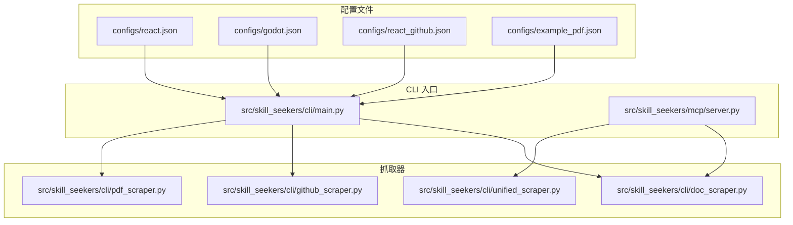
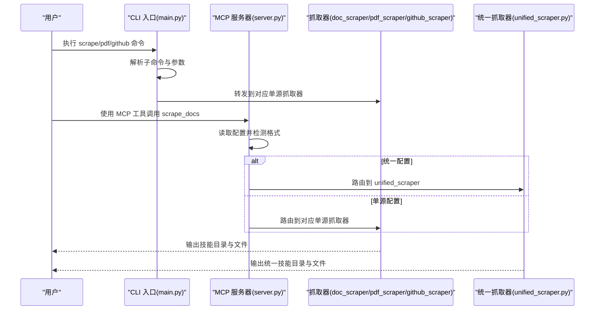
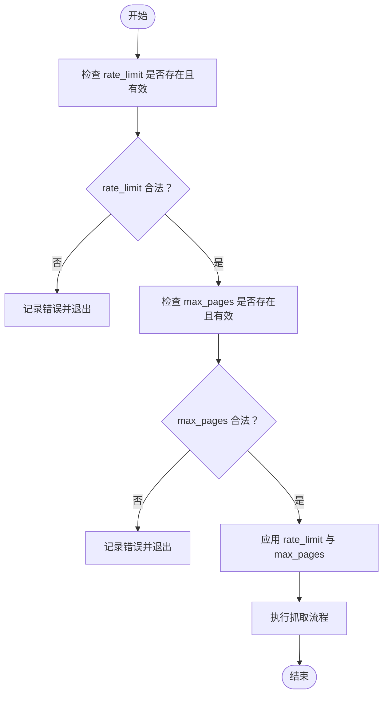
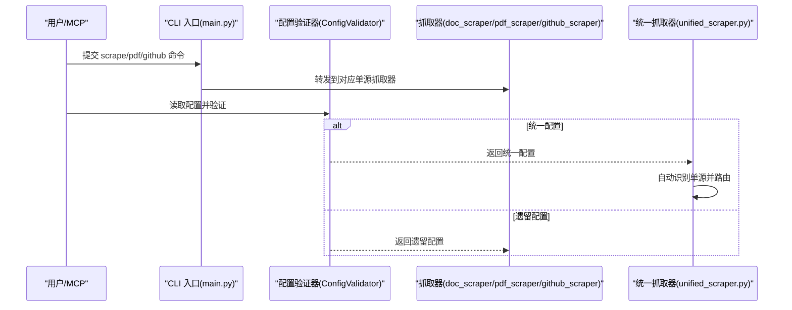
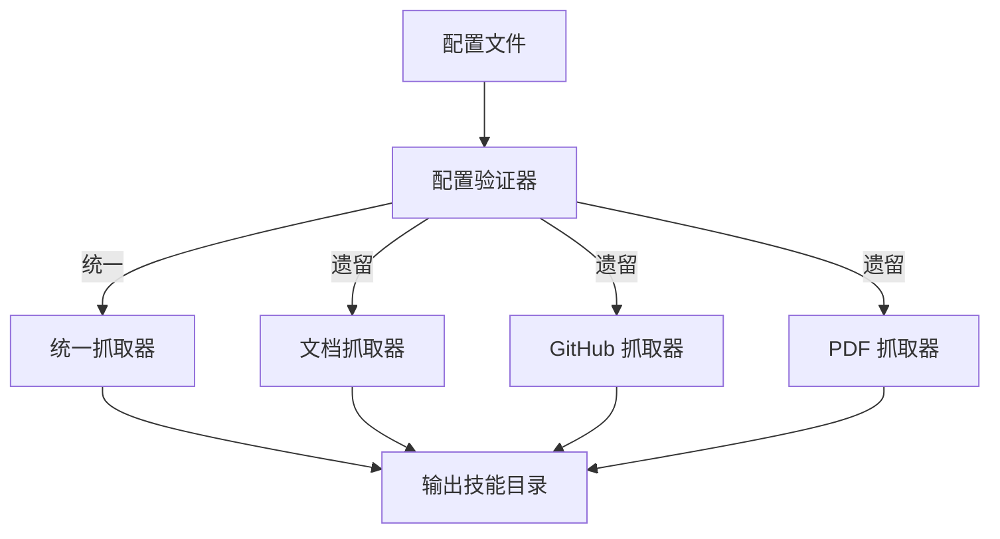

# 单源配置文件

<cite>
**本文引用的文件**
- [configs/react.json](file://configs/react.json)
- [configs/example_pdf.json](file://configs/example_pdf.json)
- [configs/react_github.json](file://configs/react_github.json)
- [configs/godot.json](file://configs/godot.json)
- [src/skill_seekers/cli/doc_scraper.py](file://src/skill_seekers/cli/doc_scraper.py)
- [src/skill_seekers/cli/pdf_scraper.py](file://src/skill_seekers/cli/pdf_scraper.py)
- [src/skill_seekers/cli/github_scraper.py](file://src/skill_seekers/cli/github_scraper.py)
- [src/skill_seekers/cli/main.py](file://src/skill_seekers/cli/main.py)
- [src/skill_seekers/cli/config_validator.py](file://src/skill_seekers/cli/config_validator.py)
- [src/skill_seekers/cli/unified_scraper.py](file://src/skill_seekers/cli/unified_scraper.py)
- [src/skill_seekers/mcp/server.py](file://src/skill_seekers/mcp/server.py)
- [docs/UNIFIED_SCRAPING.md](file://docs/UNIFIED_SCRAPING.md)
</cite>

## 目录
1. [简介](#简介)
2. [项目结构](#项目结构)
3. [核心组件](#核心组件)
4. [架构总览](#架构总览)
5. [详细组件分析](#详细组件分析)
6. [依赖分析](#依赖分析)
7. [性能考虑](#性能考虑)
8. [故障排查指南](#故障排查指南)
9. [结论](#结论)
10. [附录](#附录)

## 简介
本技术文档聚焦“单源配置文件”的使用与实现，目标是帮助用户仅从单一来源（文档网站、GitHub 仓库或 PDF 文件）构建高质量的 Claude 技能。文档将系统讲解以下内容：
- 基础字段：name、base_url（文档源）、repo（GitHub 源）、pdf_path（PDF 源）的含义与用法
- 高级配置：选择器（selectors）、URL 过滤规则（url_patterns）、分类体系（categories）
- 性能控制：rate_limit 和 max_pages 的作用机制与最佳实践
- 自动识别与路由：系统如何识别单源配置并路由到对应的单源抓取器（如 doc_scraper.py），以及与统一配置的向后兼容关系

## 项目结构
围绕单源配置文件，本项目的关键目录与文件如下：
- configs/：包含各类示例配置文件，覆盖文档、GitHub、PDF 三类单源场景
- src/skill_seekers/cli/：CLI 工具与抓取器实现，包括文档抓取器、GitHub 抓取器、PDF 抓取器、统一抓取器与配置验证器
- src/skill_seekers/mcp/server.py：MCP 集成入口，负责自动识别配置格式并路由到相应脚本
- docs/UNIFIED_SCRAPING.md：统一抓取与向后兼容的官方说明文档

图表来源
- [src/skill_seekers/cli/main.py](file://src/skill_seekers/cli/main.py#L240-L301)
- [src/skill_seekers/mcp/server.py](file://src/skill_seekers/mcp/server.py#L782-L821)
- [src/skill_seekers/cli/doc_scraper.py](file://src/skill_seekers/cli/doc_scraper.py#L1-L120)
- [src/skill_seekers/cli/github_scraper.py](file://src/skill_seekers/cli/github_scraper.py#L1-L120)
- [src/skill_seekers/cli/pdf_scraper.py](file://src/skill_seekers/cli/pdf_scraper.py#L1-L60)
- [src/skill_seekers/cli/unified_scraper.py](file://src/skill_seekers/cli/unified_scraper.py#L42-L116)

章节来源
- [src/skill_seekers/cli/main.py](file://src/skill_seekers/cli/main.py#L240-L301)
- [src/skill_seekers/mcp/server.py](file://src/skill_seekers/mcp/server.py#L782-L821)

## 核心组件
- 文档单源配置（react.json、godot.json）：定义文档站点的 base_url、起始链接、选择器、URL 过滤与分类，并支持 rate_limit 与 max_pages 控制
- GitHub 单源配置（react_github.json）：定义 GitHub 仓库信息与抓取选项，用于生成仓库技能
- PDF 单源配置（example_pdf.json）：定义 PDF 路径与抽取选项，用于生成 PDF 技能
- 抓取器实现：
  - 文档抓取器（doc_scraper.py）：解析 HTML、应用选择器、按 URL 规则过滤、分类、限速与分页控制
  - GitHub 抓取器（github_scraper.py）：拉取仓库元数据、README、变更日志、发布信息、Issues 等
  - PDF 抓取器（pdf_scraper.py）：抽取 PDF 内容、按章节或关键词分类、生成参考文件与索引
- 统一抓取器（unified_scraper.py）：在统一配置中自动识别单源配置并路由到对应抓取器；同时支持多源合并
- 配置验证器（config_validator.py）：检测配置格式（统一/遗留），进行字段校验与转换
- CLI 入口（main.py）：统一命令入口，将 scrape/pdf/github 子命令转发到对应脚本
- MCP 集成（mcp/server.py）：自动识别统一/遗留配置并路由到 doc_scraper 或 unified_scraper

章节来源
- [configs/react.json](file://configs/react.json#L1-L32)
- [configs/godot.json](file://configs/godot.json#L1-L48)
- [configs/react_github.json](file://configs/react_github.json#L1-L16)
- [configs/example_pdf.json](file://configs/example_pdf.json#L1-L18)
- [src/skill_seekers/cli/doc_scraper.py](file://src/skill_seekers/cli/doc_scraper.py#L1-L120)
- [src/skill_seekers/cli/pdf_scraper.py](file://src/skill_seekers/cli/pdf_scraper.py#L1-L120)
- [src/skill_seekers/cli/github_scraper.py](file://src/skill_seekers/cli/github_scraper.py#L1-L120)
- [src/skill_seekers/cli/unified_scraper.py](file://src/skill_seekers/cli/unified_scraper.py#L42-L116)
- [src/skill_seekers/cli/config_validator.py](file://src/skill_seekers/cli/config_validator.py#L22-L120)
- [src/skill_seekers/cli/main.py](file://src/skill_seekers/cli/main.py#L240-L301)
- [src/skill_seekers/mcp/server.py](file://src/skill_seekers/mcp/server.py#L782-L821)

## 架构总览
系统通过 CLI 入口接收用户命令，根据配置类型自动路由到相应的抓取器。对于单源配置，系统会识别并调用对应的单源抓取器；对于统一配置，系统会自动转换为统一模式并执行多源抓取与合并。

图表来源
- [src/skill_seekers/cli/main.py](file://src/skill_seekers/cli/main.py#L240-L301)
- [src/skill_seekers/mcp/server.py](file://src/skill_seekers/mcp/server.py#L782-L821)
- [src/skill_seekers/cli/unified_scraper.py](file://src/skill_seekers/cli/unified_scraper.py#L42-L116)

## 详细组件分析

### 文档单源配置（base_url、selectors、url_patterns、categories、rate_limit、max_pages）
- 基础字段
  - name：技能名称
  - base_url：文档站点根地址，作为 URL 过滤与起始链接的基础
  - start_urls：可选的起始页面列表，便于定向抓取
- 选择器（selectors）
  - main_content：主内容区域选择器
  - title：标题选择器
  - code_blocks：代码块选择器
- URL 过滤（url_patterns）
  - include：仅抓取匹配路径片段的页面
  - exclude：排除匹配路径片段的页面
- 分类（categories）
  - 以关键词映射到类别键，用于后续内容分类
- 性能控制
  - rate_limit：请求间隔（秒），用于降低爬取频率
  - max_pages：最大抓取页数，None 或 -1 表示不限制

示例参考
- 文档单源配置：[configs/react.json](file://configs/react.json#L1-L32)
- 文档单源配置（Godot 示例）：[configs/godot.json](file://configs/godot.json#L1-L48)

章节来源
- [configs/react.json](file://configs/react.json#L1-L32)
- [configs/godot.json](file://configs/godot.json#L1-L48)
- [src/skill_seekers/cli/doc_scraper.py](file://src/skill_seekers/cli/doc_scraper.py#L134-L157)
- [src/skill_seekers/cli/doc_scraper.py](file://src/skill_seekers/cli/doc_scraper.py#L213-L283)
- [src/skill_seekers/cli/doc_scraper.py](file://src/skill_seekers/cli/doc_scraper.py#L376-L389)
- [src/skill_seekers/cli/doc_scraper.py](file://src/skill_seekers/cli/doc_scraper.py#L596-L607)
- [src/skill_seekers/cli/doc_scraper.py](file://src/skill_seekers/cli/doc_scraper.py#L722-L800)

### GitHub 单源配置（repo、include_*、file_patterns 等）
- 基础字段
  - name、description：技能名称与描述
  - repo：仓库标识（owner/repo）
- 抓取选项
  - include_issues、max_issues：是否抓取 Issues 及数量上限
  - include_changelog、include_releases：是否抓取变更日志与发布信息
  - include_code：是否抓取代码
  - code_analysis_depth：代码分析深度（surface/deep/full）
  - file_patterns：文件匹配模式，限制分析范围

示例参考
- GitHub 单源配置：[configs/react_github.json](file://configs/react_github.json#L1-L16)

章节来源
- [configs/react_github.json](file://configs/react_github.json#L1-L16)
- [src/skill_seekers/cli/github_scraper.py](file://src/skill_seekers/cli/github_scraper.py#L77-L131)
- [src/skill_seekers/cli/github_scraper.py](file://src/skill_seekers/cli/github_scraper.py#L169-L213)
- [src/skill_seekers/cli/github_scraper.py](file://src/skill_seekers/cli/github_scraper.py#L328-L419)

### PDF 单源配置（pdf_path、extract_options、categories）
- 基础字段
  - name、description：技能名称与描述
  - pdf_path：PDF 文件路径
- 抽取选项（extract_options）
  - chunk_size：分块大小
  - min_quality：最小质量阈值
  - extract_images：是否抽取图片
  - min_image_size：最小图片尺寸
- 分类（categories）
  - 通过关键词映射到类别键，用于抽取后的分类

示例参考
- PDF 单源配置：[configs/example_pdf.json](file://configs/example_pdf.json#L1-L18)

章节来源
- [configs/example_pdf.json](file://configs/example_pdf.json#L1-L18)
- [src/skill_seekers/cli/pdf_scraper.py](file://src/skill_seekers/cli/pdf_scraper.py#L25-L76)
- [src/skill_seekers/cli/pdf_scraper.py](file://src/skill_seekers/cli/pdf_scraper.py#L87-L172)

### 性能控制参数：rate_limit 与 max_pages
- rate_limit
  - 含义：每次请求之间的延迟（秒）。设置为 0 表示禁用限速
  - 默认值：文档抓取器中有默认常量，可在配置中覆盖
  - 影响：降低请求频率，避免对目标站点造成压力
- max_pages
  - 含义：最大抓取页数
  - 支持值：正整数、None（不限制）、-1（不限制）
  - 影响：控制抓取规模，避免长时间运行与资源消耗过大

图表来源
- [src/skill_seekers/cli/doc_scraper.py](file://src/skill_seekers/cli/doc_scraper.py#L1249-L1278)
- [src/skill_seekers/cli/doc_scraper.py](file://src/skill_seekers/cli/doc_scraper.py#L1526-L1559)

章节来源
- [src/skill_seekers/cli/doc_scraper.py](file://src/skill_seekers/cli/doc_scraper.py#L1249-L1278)
- [src/skill_seekers/cli/doc_scraper.py](file://src/skill_seekers/cli/doc_scraper.py#L1526-L1559)

### 自动识别与路由：从单源配置到对应抓取器
- CLI 路由
  - scrape 子命令：转发到文档抓取器（doc_scraper.py）
  - pdf 子命令：转发到 PDF 抓取器（pdf_scraper.py）
  - github 子命令：转发到 GitHub 抓取器（github_scraper.py）
- MCP 路由
  - scrape_docs 工具：读取配置并自动判断统一/遗留格式
  - 统一配置：路由到 unified_scraper.py
  - 遗留配置：路由到 doc_scraper.py
- 配置验证
  - ConfigValidator：检测配置格式、字段校验、必要字段检查、转换为统一格式（如需）

图表来源
- [src/skill_seekers/cli/main.py](file://src/skill_seekers/cli/main.py#L240-L301)
- [src/skill_seekers/cli/config_validator.py](file://src/skill_seekers/cli/config_validator.py#L22-L120)
- [src/skill_seekers/cli/unified_scraper.py](file://src/skill_seekers/cli/unified_scraper.py#L42-L116)
- [src/skill_seekers/mcp/server.py](file://src/skill_seekers/mcp/server.py#L782-L821)

章节来源
- [src/skill_seekers/cli/main.py](file://src/skill_seekers/cli/main.py#L240-L301)
- [src/skill_seekers/cli/config_validator.py](file://src/skill_seekers/cli/config_validator.py#L22-L120)
- [src/skill_seekers/cli/unified_scraper.py](file://src/skill_seekers/cli/unified_scraper.py#L42-L116)
- [src/skill_seekers/mcp/server.py](file://src/skill_seekers/mcp/server.py#L782-L821)

## 依赖分析
- 配置到抓取器的耦合
  - 单源配置直接驱动对应抓取器（文档/仓库/PDF），耦合度低，职责清晰
- 统一配置到抓取器的解耦
  - 通过 ConfigValidator 自动识别与转换，再路由到对应抓取器或统一抓取器
- 外部依赖
  - 文档抓取依赖网络请求与 HTML 解析
  - GitHub 抓取依赖 GitHub API（PyGithub）
  - PDF 抓取依赖 PDF 抽取工具（pdf_extractor_poc）

图表来源
- [src/skill_seekers/cli/config_validator.py](file://src/skill_seekers/cli/config_validator.py#L22-L120)
- [src/skill_seekers/cli/unified_scraper.py](file://src/skill_seekers/cli/unified_scraper.py#L42-L116)
- [src/skill_seekers/cli/doc_scraper.py](file://src/skill_seekers/cli/doc_scraper.py#L1-L120)
- [src/skill_seekers/cli/github_scraper.py](file://src/skill_seekers/cli/github_scraper.py#L1-L120)
- [src/skill_seekers/cli/pdf_scraper.py](file://src/skill_seekers/cli/pdf_scraper.py#L1-L60)

章节来源
- [src/skill_seekers/cli/config_validator.py](file://src/skill_seekers/cli/config_validator.py#L22-L120)
- [src/skill_seekers/cli/unified_scraper.py](file://src/skill_seekers/cli/unified_scraper.py#L42-L116)

## 性能考虑
- 并发与异步
  - 文档抓取器支持线程并发与异步两种模式，异步模式通常更高效
  - 可通过 workers 参数调整并发度，注意上限与系统负载
- 限速与节流
  - rate_limit 用于降低请求频率，避免触发目标站点的反爬策略
  - 对于大规模抓取，建议结合 max_pages 与合理的 rate_limit
- 页面发现与预估
  - 使用估计工具估算页面数量，合理规划 max_pages 与超时时间
- 资源管理
  - PDF 抽取涉及图片与文本处理，注意内存与磁盘占用
  - GitHub 抓取受 API 速率限制影响，建议使用令牌或降低抓取强度

[本节提供通用指导，不直接分析具体文件]

## 故障排查指南
- JSON 加载失败
  - 现象：提示 JSON 无效或文件不存在
  - 排查：检查配置文件路径与语法，确保编码正确
- 字段缺失或类型错误
  - 现象：报错提示缺少必需字段或类型不符
  - 排查：对照示例配置补齐字段，确保类型正确（如 max_pages 必须为整数或 None/-1）
- URL 过滤导致漏抓
  - 现象：实际抓取页数远小于预期
  - 排查：检查 url_patterns 的 include/exclude 是否过于严格
- 限速过低导致耗时过长
  - 现象：抓取进度缓慢
  - 排查：适当提高 rate_limit 或增加 workers（异步模式下更有效）
- GitHub API 限速
  - 现象：抓取中断或返回限速错误
  - 排查：配置 GitHub 令牌，或减少抓取强度与并发

章节来源
- [src/skill_seekers/cli/doc_scraper.py](file://src/skill_seekers/cli/doc_scraper.py#L1298-L1331)
- [src/skill_seekers/cli/doc_scraper.py](file://src/skill_seekers/cli/doc_scraper.py#L1249-L1278)
- [src/skill_seekers/cli/github_scraper.py](file://src/skill_seekers/cli/github_scraper.py#L149-L168)

## 结论
单源配置文件提供了简洁而强大的方式，让用户仅从文档网站、GitHub 仓库或 PDF 文件构建 Claude 技能。通过明确的基础字段、灵活的选择器与 URL 过滤、完善的分类体系，以及可控的性能参数，系统能够稳定地完成高质量的技能构建。同时，系统对统一配置具备向后兼容能力，既可直接使用单源配置，也可在统一配置中混合多源并智能合并。

[本节为总结性内容，不直接分析具体文件]

## 附录

### 字段与配置语法速查
- 文档单源（react.json、godot.json）
  - 基础：name、base_url、start_urls
  - 选择器：selectors.main_content、selectors.title、selectors.code_blocks
  - 过滤：url_patterns.include、url_patterns.exclude
  - 分类：categories（关键词到类别键）
  - 性能：rate_limit、max_pages
- GitHub 单源（react_github.json）
  - 基础：name、repo、description
  - 抓取：include_issues、max_issues、include_changelog、include_releases、include_code、code_analysis_depth、file_patterns
- PDF 单源（example_pdf.json）
  - 基础：name、pdf_path、description
  - 抽取：extract_options.chunk_size、extract_options.min_quality、extract_options.extract_images、extract_options.min_image_size
  - 分类：categories（关键词到类别键）

章节来源
- [configs/react.json](file://configs/react.json#L1-L32)
- [configs/godot.json](file://configs/godot.json#L1-L48)
- [configs/react_github.json](file://configs/react_github.json#L1-L16)
- [configs/example_pdf.json](file://configs/example_pdf.json#L1-L18)

### 向后兼容与统一抓取参考
- 统一抓取文档：[docs/UNIFIED_SCRAPING.md](file://docs/UNIFIED_SCRAPING.md#L354-L440)
- MCP 自动识别与路由：[src/skill_seekers/mcp/server.py](file://src/skill_seekers/mcp/server.py#L782-L821)
- 配置验证与转换：[src/skill_seekers/cli/config_validator.py](file://src/skill_seekers/cli/config_validator.py#L22-L120)

章节来源
- [docs/UNIFIED_SCRAPING.md](file://docs/UNIFIED_SCRAPING.md#L354-L440)
- [src/skill_seekers/mcp/server.py](file://src/skill_seekers/mcp/server.py#L782-L821)
- [src/skill_seekers/cli/config_validator.py](file://src/skill_seekers/cli/config_validator.py#L22-L120)