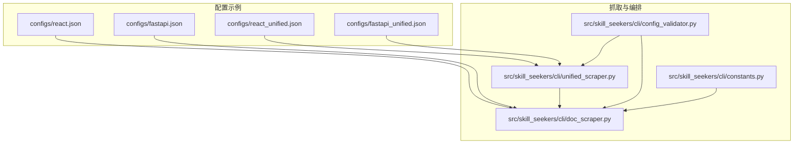
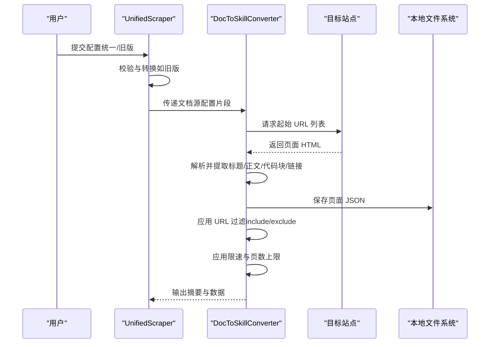
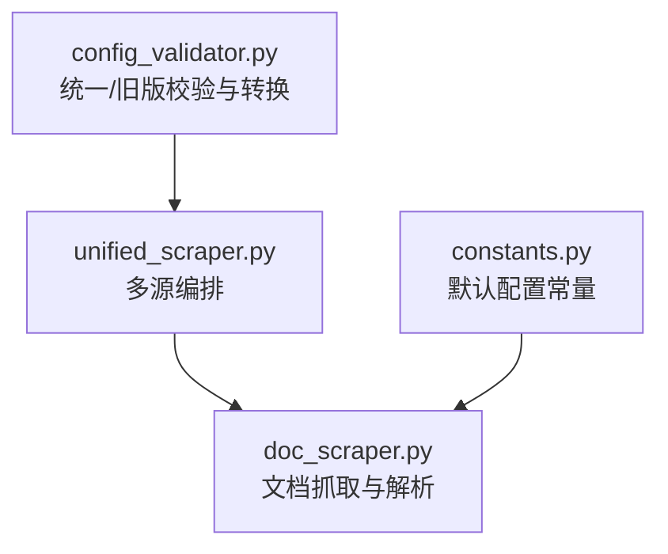

# 文档源配置

<cite>
**本文引用的文件**
- [configs/react.json](file://configs/react.json)
- [configs/fastapi.json](file://configs/fastapi.json)
- [configs/react_unified.json](file://configs/react_unified.json)
- [configs/fastapi_unified.json](file://configs/fastapi_unified.json)
- [src/skill_seekers/cli/doc_scraper.py](file://src/skill_seekers/cli/doc_scraper.py)
- [src/skill_seekers/cli/unified_scraper.py](file://src/skill_seekers/cli/unified_scraper.py)
- [src/skill_seekers/cli/config_validator.py](file://src/skill_seekers/cli/config_validator.py)
- [src/skill_seekers/cli/constants.py](file://src/skill_seekers/cli/constants.py)
- [README.md](file://README.md)
</cite>

## 目录
1. [简介](#简介)
2. [项目结构](#项目结构)
3. [核心组件](#核心组件)
4. [架构总览](#架构总览)
5. [详细组件分析](#详细组件分析)
6. [依赖关系分析](#依赖关系分析)
7. [性能与行为控制](#性能与行为控制)
8. [故障排查指南](#故障排查指南)
9. [结论](#结论)
10. [附录：配置字段参考](#附录配置字段参考)

## 简介
本技术文档聚焦“文档源配置”的使用与实现，围绕如何通过 base_url、start_urls、selectors、url_patterns、categories、rate_limit、max_pages 等字段，从文档网站抓取内容并进行智能分类与组织。文档以 react.json 与 fastapi.json 为例，解释 main_content、title、code_blocks 等选择器的 CSS 选择器语法配置方法；阐述 include/exclude 规则在 URL 过滤中的作用机制；说明 categories 分类体系如何基于关键词匹配实现内容组织；并解释 rate_limit 与 max_pages 对抓取行为的控制逻辑，以及 doc_scraper.py 如何自动识别并处理这些配置。

## 项目结构
与“文档源配置”直接相关的文件与模块如下：
- 配置示例：configs/react.json、configs/fastapi.json、configs/react_unified.json、configs/fastapi_unified.json
- 抓取实现：src/skill_seekers/cli/doc_scraper.py（HTML 抓取与解析）
- 统一编排：src/skill_seekers/cli/unified_scraper.py（多源编排，调用 doc_scraper）
- 配置校验：src/skill_seekers/cli/config_validator.py（统一/旧版配置格式校验）
- 常量定义：src/skill_seekers/cli/constants.py（默认限速、页数上限等）

图表来源
- [configs/react.json](file://configs/react.json#L1-L32)
- [configs/fastapi.json](file://configs/fastapi.json#L1-L34)
- [configs/react_unified.json](file://configs/react_unified.json#L1-L45)
- [configs/fastapi_unified.json](file://configs/fastapi_unified.json#L1-L46)
- [src/skill_seekers/cli/doc_scraper.py](file://src/skill_seekers/cli/doc_scraper.py#L1-L120)
- [src/skill_seekers/cli/unified_scraper.py](file://src/skill_seekers/cli/unified_scraper.py#L1-L120)
- [src/skill_seekers/cli/config_validator.py](file://src/skill_seekers/cli/config_validator.py#L1-L120)
- [src/skill_seekers/cli/constants.py](file://src/skill_seekers/cli/constants.py#L1-L40)

章节来源
- [configs/react.json](file://configs/react.json#L1-L32)
- [configs/fastapi.json](file://configs/fastapi.json#L1-L34)
- [configs/react_unified.json](file://configs/react_unified.json#L1-L45)
- [configs/fastapi_unified.json](file://configs/fastapi_unified.json#L1-L46)
- [src/skill_seekers/cli/doc_scraper.py](file://src/skill_seekers/cli/doc_scraper.py#L1-L120)
- [src/skill_seekers/cli/unified_scraper.py](file://src/skill_seekers/cli/unified_scraper.py#L1-L120)
- [src/skill_seekers/cli/config_validator.py](file://src/skill_seekers/cli/config_validator.py#L1-L120)
- [src/skill_seekers/cli/constants.py](file://src/skill_seekers/cli/constants.py#L1-L40)

## 核心组件
- 文档抓取器 DocToSkillConverter：负责加载配置、按 URL 过滤、提取页面内容（标题、正文、代码块、链接）、分类、限速与并发控制、保存数据与断点续爬。
- 统一编排器 UnifiedScraper：支持多源（文档、GitHub、PDF）编排，当源为文档时，会将配置片段转交给 doc_scraper 执行。
- 配置验证器 ConfigValidator：识别统一/旧版配置格式，提供字段校验与转换。
- 常量模块 constants：集中管理默认限速、最大页数、分类阈值等全局常量。

章节来源
- [src/skill_seekers/cli/doc_scraper.py](file://src/skill_seekers/cli/doc_scraper.py#L71-L133)
- [src/skill_seekers/cli/unified_scraper.py](file://src/skill_seekers/cli/unified_scraper.py#L119-L168)
- [src/skill_seekers/cli/config_validator.py](file://src/skill_seekers/cli/config_validator.py#L22-L120)
- [src/skill_seekers/cli/constants.py](file://src/skill_seekers/cli/constants.py#L1-L40)

## 架构总览
下图展示了“文档源配置”在系统中的位置与交互流程。

图表来源
- [src/skill_seekers/cli/unified_scraper.py](file://src/skill_seekers/cli/unified_scraper.py#L119-L168)
- [src/skill_seekers/cli/doc_scraper.py](file://src/skill_seekers/cli/doc_scraper.py#L333-L428)
- [src/skill_seekers/cli/doc_scraper.py](file://src/skill_seekers/cli/doc_scraper.py#L561-L721)
- [src/skill_seekers/cli/doc_scraper.py](file://src/skill_seekers/cli/doc_scraper.py#L722-L800)

章节来源
- [src/skill_seekers/cli/unified_scraper.py](file://src/skill_seekers/cli/unified_scraper.py#L119-L168)
- [src/skill_seekers/cli/doc_scraper.py](file://src/skill_seekers/cli/doc_scraper.py#L333-L428)
- [src/skill_seekers/cli/doc_scraper.py](file://src/skill_seekers/cli/doc_scraper.py#L561-L800)

## 详细组件分析

### 1) CSS 选择器与页面内容抽取（selectors）
- main_content：用于定位页面主内容区域，doc_scraper 默认使用配置中的 main_content 选择器，若未指定则回退到默认选择器。
- title：用于提取页面标题元素。
- code_blocks：用于提取代码块文本，同时进行语言检测与清洗。

示例配置字段路径
- [configs/react.json](file://configs/react.json#L13-L17)
- [configs/fastapi.json](file://configs/fastapi.json#L14-L18)

实现要点
- 标题与主内容分别通过选择器定位，主内容区域内的段落被拼接为页面正文。
- 代码块提取后进行语言检测，避免过短代码块进入结果。
- 链接提取覆盖整个页面，便于发现导航外链，但会去除锚点并去重。

章节来源
- [src/skill_seekers/cli/doc_scraper.py](file://src/skill_seekers/cli/doc_scraper.py#L213-L283)
- [src/skill_seekers/cli/doc_scraper.py](file://src/skill_seekers/cli/doc_scraper.py#L248-L320)

### 2) URL 过滤规则（url_patterns.include/exclude）
- include：仅允许包含任一关键字的 URL 被抓取。
- exclude：排除包含任一关键字的 URL。
- is_valid_url：先检查是否属于 base_url 域名，再应用 include/exclude 规则。

示例配置字段路径
- [configs/react.json](file://configs/react.json#L18-L21)
- [configs/fastapi.json](file://configs/fastapi.json#L19-L22)

实现要点
- 优先匹配 include（若配置了 include），再检查 exclude。
- 该规则贯穿链接发现与页面入队过程，确保只抓取目标域内相关页面。

章节来源
- [src/skill_seekers/cli/doc_scraper.py](file://src/skill_seekers/cli/doc_scraper.py#L134-L157)

### 3) 分类体系（categories）
- categories 是一个字典，键为分类名称，值为关键词列表。
- 智能分类逻辑会根据 URL、标题、内容的关键词命中情况打分，超过阈值即归类，否则归入 other。
- 分类阈值与评分权重由常量模块定义。

示例配置字段路径
- [configs/react.json](file://configs/react.json#L22-L31)
- [configs/fastapi.json](file://configs/fastapi.json#L23-L31)
- [configs/react_unified.json](file://configs/react_unified.json#L19-L27)
- [configs/fastapi_unified.json](file://configs/fastapi_unified.json#L19-L27)

实现要点
- URL 匹配得分更高，标题次之，内容再次之。
- 当未命中任何分类时，归入 other。
- 分类结果用于后续技能构建与参考文件组织。

章节来源
- [src/skill_seekers/cli/doc_scraper.py](file://src/skill_seekers/cli/doc_scraper.py#L869-L904)
- [src/skill_seekers/cli/constants.py](file://src/skill_seekers/cli/constants.py#L1-L40)

### 4) 限速与页数上限（rate_limit、max_pages）
- rate_limit：每次请求后的休眠秒数，默认来自常量模块，可在配置中覆盖。
- max_pages：最大抓取页数，None 或 -1 表示不限制；dry-run 模式下预览前若干页。
- 并发模式：支持线程池与异步两种模式，异步版本性能更优。

示例配置字段路径
- [configs/react.json](file://configs/react.json#L29-L31)
- [configs/fastapi.json](file://configs/fastapi.json#L31-L33)
- [src/skill_seekers/cli/constants.py](file://src/skill_seekers/cli/constants.py#L1-L20)

实现要点
- 同步模式：单线程顺序抓取，按 rate_limit 休眠。
- 异步模式：使用 httpx.AsyncClient 连接池与信号量限制并发，按 rate_limit 休眠。
- 页数上限与无限模式：dry-run 下预览有限数量 URL，实际模式受 max_pages 控制。

章节来源
- [src/skill_seekers/cli/doc_scraper.py](file://src/skill_seekers/cli/doc_scraper.py#L376-L428)
- [src/skill_seekers/cli/doc_scraper.py](file://src/skill_seekers/cli/doc_scraper.py#L722-L800)
- [src/skill_seekers/cli/doc_scraper.py](file://src/skill_seekers/cli/doc_scraper.py#L596-L647)

### 5) 断点续爬与工作流
- 支持启用断点续爬，周期性保存进度，失败后可恢复。
- dry-run 模式用于预览抓取范围与链接发现效果。

实现要点
- 断点文件包含已访问 URL、待抓取队列、已抓取页数等信息。
- 恢复时读取断点并继续抓取。

章节来源
- [src/skill_seekers/cli/doc_scraper.py](file://src/skill_seekers/cli/doc_scraper.py#L158-L209)
- [src/skill_seekers/cli/doc_scraper.py](file://src/skill_seekers/cli/doc_scraper.py#L608-L721)

### 6) 统一配置与旧版兼容
- 统一配置（unified）支持多源混合，文档源会被转换为临时配置片段并调用 doc_scraper。
- 旧版配置（legacy）通过 ConfigValidator 自动识别并转换为统一格式。

示例配置字段路径
- [configs/react_unified.json](file://configs/react_unified.json#L1-L45)
- [configs/fastapi_unified.json](file://configs/fastapi_unified.json#L1-L46)
- [src/skill_seekers/cli/unified_scraper.py](file://src/skill_seekers/cli/unified_scraper.py#L119-L168)
- [src/skill_seekers/cli/config_validator.py](file://src/skill_seekers/cli/config_validator.py#L191-L233)

章节来源
- [src/skill_seekers/cli/unified_scraper.py](file://src/skill_seekers/cli/unified_scraper.py#L119-L168)
- [src/skill_seekers/cli/config_validator.py](file://src/skill_seekers/cli/config_validator.py#L191-L233)

## 依赖关系分析
- doc_scraper 依赖 BeautifulSoup 解析 HTML，requests/httpx 发起网络请求，依赖 constants 中的默认配置。
- unified_scraper 将文档源配置片段化后调用 doc_scraper 子进程执行，同时负责冲突检测与合并（非本文重点）。
- config_validator 在统一/旧版配置之间进行转换与校验。

图表来源
- [src/skill_seekers/cli/config_validator.py](file://src/skill_seekers/cli/config_validator.py#L191-L233)
- [src/skill_seekers/cli/unified_scraper.py](file://src/skill_seekers/cli/unified_scraper.py#L119-L168)
- [src/skill_seekers/cli/doc_scraper.py](file://src/skill_seekers/cli/doc_scraper.py#L1-L120)
- [src/skill_seekers/cli/constants.py](file://src/skill_seekers/cli/constants.py#L1-L40)

章节来源
- [src/skill_seekers/cli/config_validator.py](file://src/skill_seekers/cli/config_validator.py#L191-L233)
- [src/skill_seekers/cli/unified_scraper.py](file://src/skill_seekers/cli/unified_scraper.py#L119-L168)
- [src/skill_seekers/cli/doc_scraper.py](file://src/skill_seekers/cli/doc_scraper.py#L1-L120)
- [src/skill_seekers/cli/constants.py](file://src/skill_seekers/cli/constants.py#L1-L40)

## 性能与行为控制
- 并发模式：异步版本显著优于同步线程池，适合大规模文档站点。
- 限速策略：rate_limit 控制请求频率，避免对目标站点造成压力。
- 页数上限：max_pages 控制抓取规模，dry-run 可预览抓取范围。
- 断点续爬：长时间抓取任务可安全中断与恢复。

章节来源
- [src/skill_seekers/cli/doc_scraper.py](file://src/skill_seekers/cli/doc_scraper.py#L722-L800)
- [src/skill_seekers/cli/doc_scraper.py](file://src/skill_seekers/cli/doc_scraper.py#L596-L647)
- [src/skill_seekers/cli/constants.py](file://src/skill_seekers/cli/constants.py#L1-L20)

## 故障排查指南
- 页面无内容或标题为空：检查 selectors.main_content 与 selectors.title 是否正确；确认目标站点结构变化。
- 抓取不到链接：检查 url_patterns.include/exclude 是否过于严格；确认链接是否带锚点导致去重。
- 抓取速度过慢：尝试开启异步模式与合理设置 workers；适当提高 rate_limit 以降低限速影响。
- 无限抓取风险：max_pages 设置为 None/-1 时会抓取全部页面，请谨慎使用。
- 断点异常：检查断点文件是否存在与权限；必要时清理断点文件重新开始。

章节来源
- [src/skill_seekers/cli/doc_scraper.py](file://src/skill_seekers/cli/doc_scraper.py#L158-L209)
- [src/skill_seekers/cli/doc_scraper.py](file://src/skill_seekers/cli/doc_scraper.py#L596-L721)

## 结论
通过 base_url、start_urls、selectors、url_patterns、categories、rate_limit、max_pages 等字段，可以精确控制文档网站的抓取范围、内容抽取方式、URL 过滤规则、分类策略与抓取节奏。doc_scraper.py 将这些配置自动转化为可执行的抓取流程，并提供断点续爬、并发优化与智能分类能力，帮助快速构建高质量的 Claude 技能知识库。

## 附录：配置字段参考
- 基础字段
  - name：配置名称
  - description：配置描述
  - base_url：站点根地址
  - start_urls：起始抓取 URL 列表
- 内容抽取
  - selectors.main_content：主内容区域 CSS 选择器
  - selectors.title：标题元素 CSS 选择器
  - selectors.code_blocks：代码块 CSS 选择器
- URL 过滤
  - url_patterns.include：包含关键字列表
  - url_patterns.exclude：排除关键字列表
- 分类体系
  - categories：分类名到关键词列表的映射
- 抓取控制
  - rate_limit：请求间隔（秒）
  - max_pages：最大抓取页数（None 或 -1 表示不限制）
- 其他
  - workers：并发工作线程数（仅 doc_scraper）
  - async_mode：是否启用异步模式（仅 doc_scraper）
  - checkpoint.enabled/interval：断点开关与保存间隔

章节来源
- [configs/react.json](file://configs/react.json#L1-L32)
- [configs/fastapi.json](file://configs/fastapi.json#L1-L34)
- [configs/react_unified.json](file://configs/react_unified.json#L1-L45)
- [configs/fastapi_unified.json](file://configs/fastapi_unified.json#L1-L46)
- [src/skill_seekers/cli/doc_scraper.py](file://src/skill_seekers/cli/doc_scraper.py#L71-L133)
- [src/skill_seekers/cli/constants.py](file://src/skill_seekers/cli/constants.py#L1-L40)