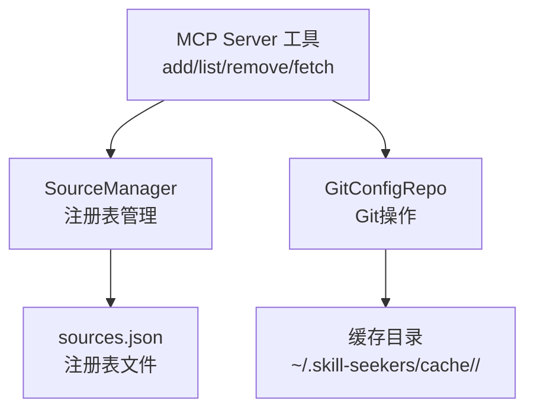
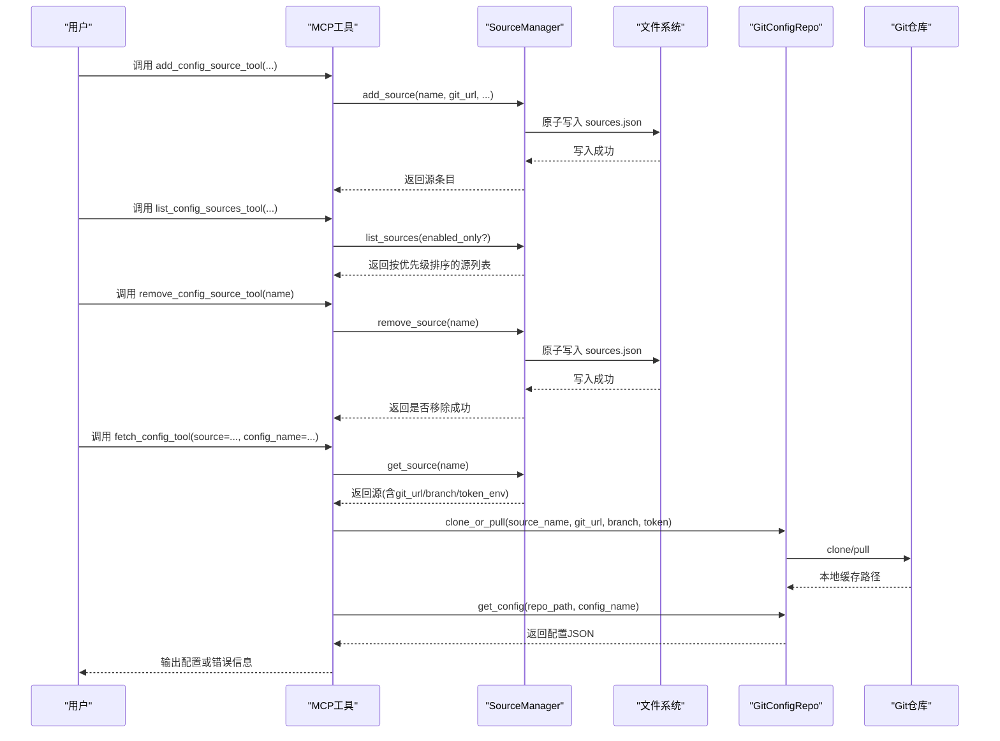
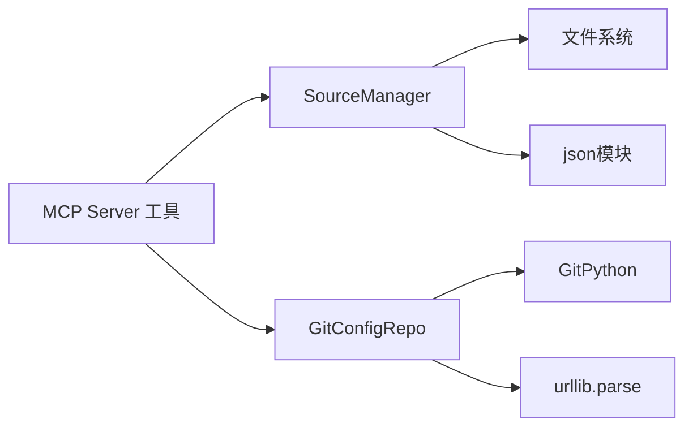

# Git源注册与管理

<cite>
**本文引用的文件列表**
- [source_manager.py](file://src/skill_seekers/mcp/source_manager.py)
- [git_repo.py](file://src/skill_seekers/mcp/git_repo.py)
- [server.py](file://src/skill_seekers/mcp/server.py)
- [test_source_manager.py](file://tests/test_source_manager.py)
- [test_git_sources_e2e.py](file://tests/test_git_sources_e2e.py)
- [GIT_CONFIG_SOURCES.md](file://docs/GIT_CONFIG_SOURCES.md)
</cite>

## 目录
1. [简介](#简介)
2. [项目结构](#项目结构)
3. [核心组件](#核心组件)
4. [架构总览](#架构总览)
5. [详细组件分析](#详细组件分析)
6. [依赖关系分析](#依赖关系分析)
7. [性能考量](#性能考量)
8. [故障排查指南](#故障排查指南)
9. [结论](#结论)
10. [附录](#附录)

## 简介
本文件围绕 SourceManager 类，系统性说明如何注册与管理 Git 配置源，重点解析 add_source 方法的参数语义与配置规则，展示 list_sources 的优先级排序机制，以及 remove_source 的删除流程。同时结合测试用例，总结异常处理最佳实践，并阐明 sources.json 注册表的存储位置与原子写入策略，确保多进程环境下的数据一致性。

## 项目结构
- 源码位于 src/skill_seekers/mcp 下：
  - source_manager.py：注册表管理器，负责注册、查询、更新、删除与持久化
  - git_repo.py：Git 仓库克隆/拉取与配置读取
  - server.py：MCP 工具入口，提供 add/list/remove/fetch 等工具
- 文档 docs/GIT_CONFIG_SOURCES.md 提供完整使用指南与示例
- 测试 tests/test_source_manager.py 覆盖注册表行为与异常场景
- 测试 tests/test_git_sources_e2e.py 展示端到端工作流与持久化验证

图表来源
- [source_manager.py](file://src/skill_seekers/mcp/source_manager.py#L14-L38)
- [git_repo.py](file://src/skill_seekers/mcp/git_repo.py#L17-L40)
- [server.py](file://src/skill_seekers/mcp/server.py#L2013-L2181)

章节来源
- [source_manager.py](file://src/skill_seekers/mcp/source_manager.py#L14-L38)
- [git_repo.py](file://src/skill_seekers/mcp/git_repo.py#L17-L40)
- [server.py](file://src/skill_seekers/mcp/server.py#L2013-L2181)

## 核心组件
- SourceManager：在用户主目录下创建 ~/.skill-seekers/sources.json，提供 add_source、get_source、list_sources、remove_source、update_source 等能力；内部采用原子写入保证并发安全。
- GitConfigRepo：封装 Git 克隆/拉取、URL 校验与令牌注入、配置文件发现与加载。
- MCP Server 工具：对外暴露 add_config_source_tool、list_config_sources_tool、remove_config_source_tool、fetch_config_tool 等工具，统一调用 SourceManager 与 GitConfigRepo。

章节来源
- [source_manager.py](file://src/skill_seekers/mcp/source_manager.py#L14-L294)
- [git_repo.py](file://src/skill_seekers/mcp/git_repo.py#L17-L283)
- [server.py](file://src/skill_seekers/mcp/server.py#L2013-L2181)

## 架构总览
下图展示了从 MCP 工具到注册表与 Git 缓存的整体交互路径。

图表来源
- [server.py](file://src/skill_seekers/mcp/server.py#L2013-L2181)
- [source_manager.py](file://src/skill_seekers/mcp/source_manager.py#L39-L119)
- [source_manager.py](file://src/skill_seekers/mcp/source_manager.py#L149-L189)
- [source_manager.py](file://src/skill_seekers/mcp/source_manager.py#L234-L273)
- [git_repo.py](file://src/skill_seekers/mcp/git_repo.py#L41-L110)
- [git_repo.py](file://src/skill_seekers/mcp/git_repo.py#L157-L196)

## 详细组件分析

### SourceManager 类与 add_source 参数详解
- 初始化与注册表文件
  - 默认配置目录：用户主目录下的 .skill-seekers，若不存在则自动创建
  - 注册表文件：sources.json，初始版本号为 1.0，空数组 sources
- add_source 关键参数与规则
  - name：源标识符，必须非空且仅包含字母数字及连字符/下划线；内部会转为小写
  - git_url：Git 仓库地址，不能为空；支持 HTTPS/SSH/file 协议
  - source_type：源类型，用于推断默认 token 环境变量名，默认 github
  - token_env：认证令牌环境变量名，未提供时根据 source_type 自动推断
  - branch：分支，默认 main
  - priority：优先级，数值越小优先级越高，默认 100
  - enabled：是否启用，默认 True
  - 时间戳：added_at/updated_at 使用 UTC ISO 格式记录
- 行为要点
  - 重复注册：若 name 已存在，则更新该条目，保留原始 added_at，更新 updated_at
  - 排序：每次写入后按 priority 升序重排
  - 原子写入：先写临时文件，再替换原文件，失败时清理临时文件
  - 异常：name 为空或包含非法字符、git_url 为空时抛出 ValueError

章节来源
- [source_manager.py](file://src/skill_seekers/mcp/source_manager.py#L17-L38)
- [source_manager.py](file://src/skill_seekers/mcp/source_manager.py#L39-L119)
- [source_manager.py](file://src/skill_seekers/mcp/source_manager.py#L234-L273)
- [test_source_manager.py](file://tests/test_source_manager.py#L82-L174)
- [test_source_manager.py](file://tests/test_source_manager.py#L175-L223)

### list_sources 与优先级排序机制
- 返回值：按 priority 升序排列的源列表
- enabled_only：可选过滤仅返回 enabled=True 的源
- 测试验证：
  - 多源添加后按 priority 正确排序
  - enabled_only=True 仅返回启用源
  - 列表中包含每个源的关键字段（type、branch、token_env、priority、enabled）

章节来源
- [source_manager.py](file://src/skill_seekers/mcp/source_manager.py#L149-L189)
- [test_source_manager.py](file://tests/test_source_manager.py#L263-L313)
- [test_source_manager.py](file://tests/test_source_manager.py#L282-L303)

### remove_source 删除机制
- 匹配：大小写不敏感查找并删除
- 结果：删除成功返回 True，否则 False
- 持久化：删除后立即写回注册表
- 测试验证：大小写不敏感、不存在返回 False、删除后文件内容正确

章节来源
- [source_manager.py](file://src/skill_seekers/mcp/source_manager.py#L166-L189)
- [test_source_manager.py](file://tests/test_source_manager.py#L314-L366)

### get_source 与 update_source
- get_source：大小写不敏感匹配，未找到时返回可用源列表提示
- update_source：允许更新 git_url、type、token_env、branch、enabled、priority 等字段；更新后重新排序并写回

章节来源
- [source_manager.py](file://src/skill_seekers/mcp/source_manager.py#L121-L148)
- [source_manager.py](file://src/skill_seekers/mcp/source_manager.py#L190-L233)
- [test_source_manager.py](file://tests/test_source_manager.py#L225-L261)
- [test_source_manager.py](file://tests/test_source_manager.py#L368-L445)

### sources.json 注册表文件与原子写入
- 存储位置：默认 ~/.skill-seekers/sources.json
- 结构：version 字段与 sources 数组
- 原子写入策略：
  - 写入前校验 schema（version 与 sources）
  - 先写入临时文件，再进行原子替换
  - 出错时清理临时文件，避免损坏
- 测试验证：
  - 写入后无 .tmp 文件残留
  - JSON 格式缩进与字段完整性
  - 注册表损坏时的错误提示

章节来源
- [source_manager.py](file://src/skill_seekers/mcp/source_manager.py#L33-L38)
- [source_manager.py](file://src/skill_seekers/mcp/source_manager.py#L234-L273)
- [test_source_manager.py](file://tests/test_source_manager.py#L512-L552)

### MCP 工具与端到端流程
- add_config_source_tool：参数映射到 add_source，返回格式化结果
- list_config_sources_tool：返回按优先级排序的源列表
- remove_config_source_tool：删除源并提示缓存清理注意事项
- fetch_config_tool：按 source 名称获取源，注入 token，克隆/拉取并读取配置

章节来源
- [server.py](file://src/skill_seekers/mcp/server.py#L2013-L2181)
- [server.py](file://src/skill_seekers/mcp/server.py#L1270-L1376)

### GitConfigRepo 与缓存策略
- 缓存目录：默认 ~/.skill-seekers/cache/<source_name>/，可通过环境变量或构造函数自定义
- clone_or_pull：若缓存存在且有效则拉取，否则浅克隆；支持强制刷新
- token 注入：支持 SSH 自动转换为 HTTPS 并注入 token
- 配置读取：递归扫描 .json 文件，支持大小写不敏感匹配

章节来源
- [git_repo.py](file://src/skill_seekers/mcp/git_repo.py#L17-L40)
- [git_repo.py](file://src/skill_seekers/mcp/git_repo.py#L41-L110)
- [git_repo.py](file://src/skill_seekers/mcp/git_repo.py#L157-L196)

## 依赖关系分析
- SourceManager 依赖文件系统读写与 JSON 序列化
- GitConfigRepo 依赖 GitPython 与 URL 解析
- MCP Server 工具依赖 SourceManager 与 GitConfigRepo
- 测试覆盖了注册表初始化、增删改查、排序、异常与持久化

图表来源
- [source_manager.py](file://src/skill_seekers/mcp/source_manager.py#L234-L273)
- [git_repo.py](file://src/skill_seekers/mcp/git_repo.py#L17-L40)
- [server.py](file://src/skill_seekers/mcp/server.py#L2013-L2181)

章节来源
- [source_manager.py](file://src/skill_seekers/mcp/source_manager.py#L234-L273)
- [git_repo.py](file://src/skill_seekers/mcp/git_repo.py#L17-L40)
- [server.py](file://src/skill_seekers/mcp/server.py#L2013-L2181)

## 性能考量
- 源优先级排序：每次新增/更新均对 sources 数组进行排序，建议批量变更后一次性提交，减少频繁排序开销
- Git 操作优化：浅克隆与单分支拉取显著降低网络与磁盘占用
- 缓存复用：同一源的后续访问直接使用缓存，避免重复克隆

章节来源
- [source_manager.py](file://src/skill_seekers/mcp/source_manager.py#L113-L119)
- [git_repo.py](file://src/skill_seekers/mcp/git_repo.py#L101-L110)

## 故障排查指南
- 重复注册与更新
  - 同名源重复 add 会更新而非新增，added_at 不变，updated_at 更新
  - 可通过 update_source 修改分支、优先级等字段并触发重排序
- 无效名称与 URL
  - name 必须非空且仅含字母数字与连字符/下划线；git_url 必须非空
  - 违反规则将抛出 ValueError
- 获取源不存在
  - get_source 未命中时会提示可用源列表，便于快速定位
- 注册表损坏
  - _read_registry 对损坏 JSON 抛出明确错误，需检查文件完整性
- 删除源
  - remove_source 大小写不敏感；删除后不会清理缓存目录，如需释放空间请手动删除对应缓存目录

章节来源
- [test_source_manager.py](file://tests/test_source_manager.py#L175-L223)
- [test_source_manager.py](file://tests/test_source_manager.py#L225-L261)
- [test_source_manager.py](file://tests/test_source_manager.py#L314-L366)
- [source_manager.py](file://src/skill_seekers/mcp/source_manager.py#L234-L246)

## 结论
SourceManager 通过清晰的参数约束、严格的异常处理与原子写入机制，提供了可靠的 Git 配置源注册与管理能力。配合 MCP 工具链与 GitConfigRepo 的高效缓存策略，可在多源环境下实现稳定、可扩展的配置分发与优先级解析。

## 附录

### 参数配置速查
- name：源标识符，小写、字母数字、连字符/下划线
- git_url：Git 仓库地址（HTTPS/SSH/file）
- source_type：github/gitlab/gitea/bitbucket/custom
- token_env：令牌环境变量名（未提供时按 source_type 自动推断）
- branch：分支，默认 main
- priority：数值越小优先级越高，默认 100
- enabled：是否启用，默认 True

章节来源
- [source_manager.py](file://src/skill_seekers/mcp/source_manager.py#L39-L119)
- [test_source_manager.py](file://tests/test_source_manager.py#L82-L174)

### 端到端用例参考
- 使用 MCP 工具注册、列出、删除与抓取配置
- 多源优先级与启用状态控制
- 注册表持久化与跨实例一致性验证

章节来源
- [server.py](file://src/skill_seekers/mcp/server.py#L2013-L2181)
- [test_git_sources_e2e.py](file://tests/test_git_sources_e2e.py#L265-L304)
- [test_git_sources_e2e.py](file://tests/test_git_sources_e2e.py#L504-L547)