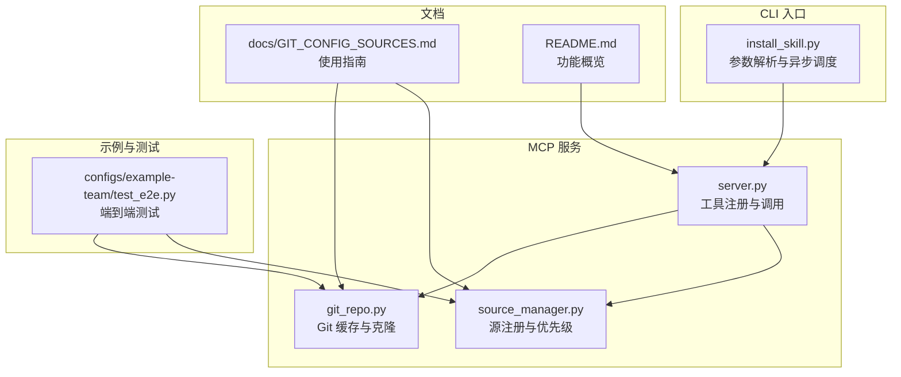
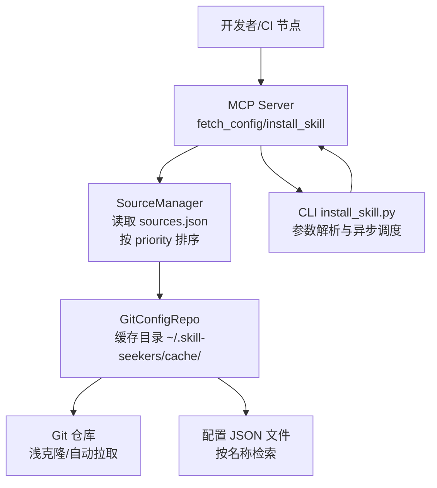
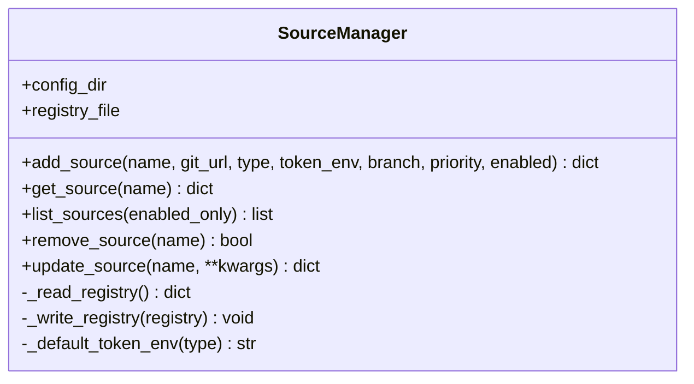
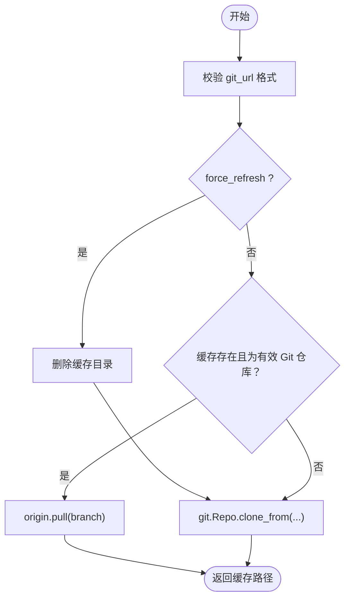
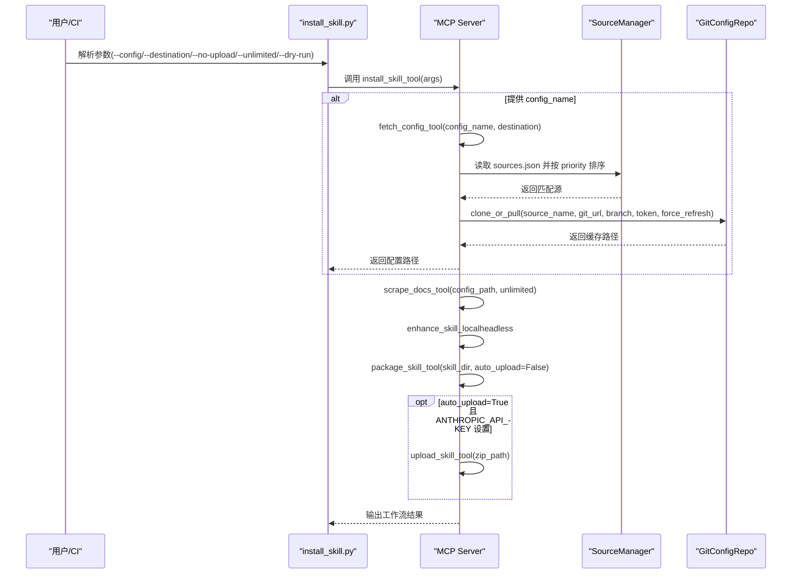
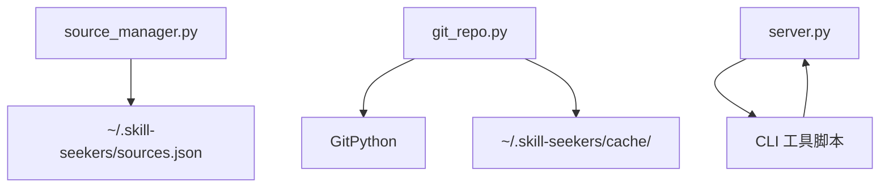

# 企业级部署方案

<cite>
**本文引用的文件**
- [README.md](file://README.md)
- [docs/GIT_CONFIG_SOURCES.md](file://docs/GIT_CONFIG_SOURCES.md)
- [src/skill_seekers/mcp/source_manager.py](file://src/skill_seekers/mcp/source_manager.py)
- [src/skill_seekers/mcp/git_repo.py](file://src/skill_seekers/mcp/git_repo.py)
- [src/skill_seekers/mcp/server.py](file://src/skill_seekers/mcp/server.py)
- [src/skill_seekers/cli/install_skill.py](file://src/skill_seekers/cli/install_skill.py)
- [configs/example-team/test_e2e.py](file://configs/example-team/test_e2e.py)
- [tests/test_install_skill.py](file://tests/test_install_skill.py)
- [tests/test_install_skill_e2e.py](file://tests/test_install_skill_e2e.py)
</cite>

## 目录
1. [简介](#简介)
2. [项目结构](#项目结构)
3. [核心组件](#核心组件)
4. [架构总览](#架构总览)
5. [详细组件分析](#详细组件分析)
6. [依赖关系分析](#依赖关系分析)
7. [性能与可扩展性](#性能与可扩展性)
8. [故障排查指南](#故障排查指南)
9. [结论](#结论)
10. [附录：CI/CD 最佳实践](#附录cicd-最佳实践)

## 简介
本方案围绕“Git 配置仓库”的缓存策略与“SourceManager”的优先级机制，设计面向大型企业的配置管理部署架构。通过平台级、部门级与项目级三层配置源的分层覆盖，结合环境变量驱动的安全认证（GITHUB_TOKEN、GITLAB_COMPANY_TOKEN 等），在 500+ 开发者规模下实现配置的一致性与安全性。同时，结合 install_skill 的安装流程，给出 CI/CD 流水线中自动化配置拉取的最佳实践，涵盖缓存清理、强制刷新与审计日志建议。

## 项目结构
该仓库采用模块化组织，核心围绕 MCP 服务、CLI 工具与配置源管理展开：
- mcp 层：提供 MCP 工具与服务端，包含配置抓取、安装技能等工具
- cli 层：提供命令行入口，封装 install_skill 的参数解析与执行
- configs 示例：提供团队示例仓库与端到端测试脚本
- 文档：包含完整的 Git 配置源使用指南与最佳实践

图表来源
- [src/skill_seekers/mcp/server.py](file://src/skill_seekers/mcp/server.py#L131-L607)
- [src/skill_seekers/mcp/source_manager.py](file://src/skill_seekers/mcp/source_manager.py#L1-L294)
- [src/skill_seekers/mcp/git_repo.py](file://src/skill_seekers/mcp/git_repo.py#L1-L283)
- [src/skill_seekers/cli/install_skill.py](file://src/skill_seekers/cli/install_skill.py#L1-L154)
- [configs/example-team/test_e2e.py](file://configs/example-team/test_e2e.py#L1-L132)
- [docs/GIT_CONFIG_SOURCES.md](file://docs/GIT_CONFIG_SOURCES.md#L1-L200)
- [README.md](file://README.md#L399-L508)

章节来源
- [README.md](file://README.md#L399-L508)
- [docs/GIT_CONFIG_SOURCES.md](file://docs/GIT_CONFIG_SOURCES.md#L1-L200)

## 核心组件
- SourceManager：负责配置源注册、优先级排序、启用/禁用控制与原子写入
- GitConfigRepo：负责 Git 仓库的缓存、浅克隆、自动拉取、强制刷新与 URL 注入令牌
- MCP Server：提供 fetch_config、install_skill 等工具，串联配置拉取、抓取、增强、打包与上传
- CLI install_skill：统一入口，将用户参数映射为 MCP 工具调用

章节来源
- [src/skill_seekers/mcp/source_manager.py](file://src/skill_seekers/mcp/source_manager.py#L1-L294)
- [src/skill_seekers/mcp/git_repo.py](file://src/skill_seekers/mcp/git_repo.py#L1-L283)
- [src/skill_seekers/mcp/server.py](file://src/skill_seekers/mcp/server.py#L131-L607)
- [src/skill_seekers/cli/install_skill.py](file://src/skill_seekers/cli/install_skill.py#L1-L154)

## 架构总览
企业级配置管理采用“三层源 + 缓存 + 安全认证”的整体架构：
- 平台级源（priority=1）：公司统一平台配置，最高优先级
- 部门级源（priority=2）：各业务线/部门内部配置
- 项目级源（priority=3+）：特定项目的私有配置
- 缓存策略：GitConfigRepo 使用浅克隆与本地缓存目录，支持自动拉取与强制刷新
- 认证策略：通过环境变量注入令牌，支持多账户、多权限场景

图表来源
- [src/skill_seekers/mcp/server.py](file://src/skill_seekers/mcp/server.py#L421-L507)
- [src/skill_seekers/mcp/source_manager.py](file://src/skill_seekers/mcp/source_manager.py#L1-L120)
- [src/skill_seekers/mcp/git_repo.py](file://src/skill_seekers/mcp/git_repo.py#L41-L110)
- [src/skill_seekers/cli/install_skill.py](file://src/skill_seekers/cli/install_skill.py#L1-L154)

## 详细组件分析

### 组件一：SourceManager（源注册与优先级）
- 存储位置：~/.skill-seekers/sources.json
- 功能要点：
  - 增删改查源，自动按 priority 升序排序
  - 自动推断 token 环境变量名（如 GITHUB_TOKEN、GITLAB_TOKEN 等）
  - 原子写入，schema 校验，避免损坏
- 企业应用建议：
  - 平台源 priority=1，部门源 priority=2，项目源默认 100 或更高
  - 通过 CI/CD 在节点初始化时预注册平台源，减少开发期手动操作

图表来源
- [src/skill_seekers/mcp/source_manager.py](file://src/skill_seekers/mcp/source_manager.py#L1-L294)

章节来源
- [src/skill_seekers/mcp/source_manager.py](file://src/skill_seekers/mcp/source_manager.py#L1-L294)
- [docs/GIT_CONFIG_SOURCES.md](file://docs/GIT_CONFIG_SOURCES.md#L131-L175)

### 组件二：GitConfigRepo（缓存与拉取）
- 缓存策略：
  - 默认缓存目录：$SKILL_SEEKERS_CACHE_DIR 或 ~/.skill-seekers/cache/
  - 浅克隆（depth=1）与单分支（single_branch=True），显著提升速度
  - 自动拉取：每次使用前检查并更新
  - 强制刷新：删除缓存后重新克隆
- 安全与兼容：
  - 支持 HTTPS/SSH URL，自动转换并注入令牌
  - 对认证失败、仓库不存在等错误提供明确提示
- 企业应用建议：
  - CI 节点设置 SKILL_SEEKERS_CACHE_DIR 指向共享磁盘或持久卷
  - 对私有仓库使用专用 token 环境变量（如 GITLAB_COMPANY_TOKEN）

图表来源
- [src/skill_seekers/mcp/git_repo.py](file://src/skill_seekers/mcp/git_repo.py#L41-L110)

章节来源
- [src/skill_seekers/mcp/git_repo.py](file://src/skill_seekers/mcp/git_repo.py#L1-L283)
- [docs/GIT_CONFIG_SOURCES.md](file://docs/GIT_CONFIG_SOURCES.md#L176-L191)

### 组件三：MCP Server（工具编排）
- 关键工具：
  - fetch_config：支持三种模式（命名源、直接 Git URL、API 模式）
  - install_skill：完整工作流（抓取 → 增强 → 打包 → 可选上传）
- 优先级解析：
  - 当同一配置名在多个源存在时，按 priority 从小到大匹配
  - API 模式作为兜底（优先级视为最高，即最低数值）
- 企业应用建议：
  - 在 CI 中预设 sources.json，避免运行期动态注册
  - 使用 refresh 参数在发布前强制刷新缓存

图表来源
- [src/skill_seekers/cli/install_skill.py](file://src/skill_seekers/cli/install_skill.py#L1-L154)
- [src/skill_seekers/mcp/server.py](file://src/skill_seekers/mcp/server.py#L1505-L1799)
- [src/skill_seekers/mcp/source_manager.py](file://src/skill_seekers/mcp/source_manager.py#L1-L120)
- [src/skill_seekers/mcp/git_repo.py](file://src/skill_seekers/mcp/git_repo.py#L41-L110)

章节来源
- [src/skill_seekers/mcp/server.py](file://src/skill_seekers/mcp/server.py#L421-L507)
- [src/skill_seekers/mcp/server.py](file://src/skill_seekers/mcp/server.py#L1505-L1799)
- [docs/GIT_CONFIG_SOURCES.md](file://docs/GIT_CONFIG_SOURCES.md#L295-L335)

### 组件四：CLI install_skill（统一入口）
- 将命令行参数映射为 MCP 工具调用，支持 dry-run、unlimited、no-upload 等选项
- 与 MCP Server 的 install_skill_tool 对接，保证一致的工作流体验

章节来源
- [src/skill_seekers/cli/install_skill.py](file://src/skill_seekers/cli/install_skill.py#L1-L154)
- [tests/test_install_skill.py](file://tests/test_install_skill.py#L166-L209)
- [tests/test_install_skill_e2e.py](file://tests/test_install_skill_e2e.py#L135-L171)

## 依赖关系分析
- SourceManager 依赖文件系统存储（~/.skill-seekers/sources.json），提供原子写入与 schema 校验
- GitConfigRepo 依赖 GitPython，负责缓存目录与远程仓库交互
- MCP Server 依赖 CLI 目录中的工具脚本，进行子进程调用与输出流式处理
- CLI install_skill 依赖 MCP Server 的 install_skill_tool

图表来源
- [src/skill_seekers/mcp/source_manager.py](file://src/skill_seekers/mcp/source_manager.py#L234-L273)
- [src/skill_seekers/mcp/git_repo.py](file://src/skill_seekers/mcp/git_repo.py#L1-L110)
- [src/skill_seekers/mcp/server.py](file://src/skill_seekers/mcp/server.py#L62-L129)
- [src/skill_seekers/cli/install_skill.py](file://src/skill_seekers/cli/install_skill.py#L1-L154)

章节来源
- [src/skill_seekers/mcp/source_manager.py](file://src/skill_seekers/mcp/source_manager.py#L234-L273)
- [src/skill_seekers/mcp/git_repo.py](file://src/skill_seekers/mcp/git_repo.py#L1-L110)
- [src/skill_seekers/mcp/server.py](file://src/skill_seekers/mcp/server.py#L62-L129)
- [src/skill_seekers/cli/install_skill.py](file://src/skill_seekers/cli/install_skill.py#L1-L154)

## 性能与可扩展性
- 缓存与网络优化
  - 浅克隆与单分支显著降低带宽与时间成本
  - 自动拉取减少重复下载，强制刷新用于发布前一致性校验
- 并发与稳定性
  - MCP Server 对长耗时任务采用子进程流式输出，避免阻塞
  - CLI install_skill 使用异步调度，适合流水线并行执行
- 可扩展性
  - 多源优先级机制天然支持多团队、多项目并存
  - 支持自定义 token 环境变量，满足多账户、多权限场景

[本节为通用指导，不直接分析具体文件]

## 故障排查指南
- 认证失败
  - 症状：提示认证失败或 403/404
  - 处理：确认环境变量已设置、token 权限正确、URL 可访问
- 配置未找到
  - 症状：找不到指定配置名
  - 处理：列出可用配置、检查大小写、确认仓库中存在对应 JSON
- 缓存问题
  - 症状：更新仓库后仍使用旧配置
  - 处理：使用 refresh=true 强制刷新；或手动删除缓存目录
- CI 环境差异
  - 症状：本地正常、CI 失败
  - 处理：确保 CI 节点预置 sources.json 与 token 环境变量；必要时设置 SKILL_SEEKERS_CACHE_DIR

章节来源
- [src/skill_seekers/mcp/git_repo.py](file://src/skill_seekers/mcp/git_repo.py#L111-L132)
- [docs/GIT_CONFIG_SOURCES.md](file://docs/GIT_CONFIG_SOURCES.md#L622-L706)

## 结论
通过 SourceManager 的优先级机制与 GitConfigRepo 的缓存策略，本方案实现了企业级配置的分层覆盖与高效分发。配合环境变量驱动的安全认证与 MCP/CLI 的统一编排，可在 500+ 开发者规模下保持配置一致性与安全性，并为 CI/CD 流水线提供稳定可靠的自动化能力。

[本节为总结性内容，不直接分析具体文件]

## 附录：CI/CD 最佳实践

### 分层覆盖与优先级设定
- 平台级源（platform）：priority=1，公司统一配置，所有开发者默认可见
- 部门级源（mobile/devops）：priority=2，业务线内部配置
- 项目级源（project-a）：priority=3+，仅项目成员可见
- API 模式：作为兜底来源，优先级最低

章节来源
- [docs/GIT_CONFIG_SOURCES.md](file://docs/GIT_CONFIG_SOURCES.md#L440-L486)

### 安全认证与多账户
- 使用环境变量注入令牌，避免明文存储
- 多账户场景：为不同源设置独立 token 环境变量（如 GITHUB_TOKEN、GITLAB_COMPANY_TOKEN）
- 建议：在 CI 凭据管理器中维护 token，作业启动时注入环境变量

章节来源
- [docs/GIT_CONFIG_SOURCES.md](file://docs/GIT_CONFIG_SOURCES.md#L338-L397)
- [README.md](file://README.md#L437-L443)

### 缓存清理与强制刷新
- 日常构建：使用自动拉取，无需额外清理
- 发布前：使用 refresh=true 强制刷新，确保配置最新
- CI 清理：定期清理过期缓存目录，释放磁盘空间

章节来源
- [src/skill_seekers/mcp/git_repo.py](file://src/skill_seekers/mcp/git_repo.py#L73-L110)
- [docs/GIT_CONFIG_SOURCES.md](file://docs/GIT_CONFIG_SOURCES.md#L605-L619)

### 审计日志与可观测性
- 建议：在 CI 中记录以下关键事件
  - 源注册/更新（priority、token_env、branch）
  - 配置拉取（来源、配置名、命中优先级）
  - 缓存状态（是否强制刷新、拉取结果）
  - 安装流程（抓取、增强、打包、上传）
- 输出格式：以 JSON 或结构化文本记录，便于后续检索与告警

[本节为通用指导，不直接分析具体文件]

### 端到端验证与回归
- 使用示例团队仓库与 E2E 测试脚本验证完整流程
- 在 CI 中加入回归测试，确保新增源与变更不会影响现有流程

章节来源
- [configs/example-team/test_e2e.py](file://configs/example-team/test_e2e.py#L1-L132)
- [tests/test_install_skill.py](file://tests/test_install_skill.py#L166-L209)
- [tests/test_install_skill_e2e.py](file://tests/test_install_skill_e2e.py#L135-L171)