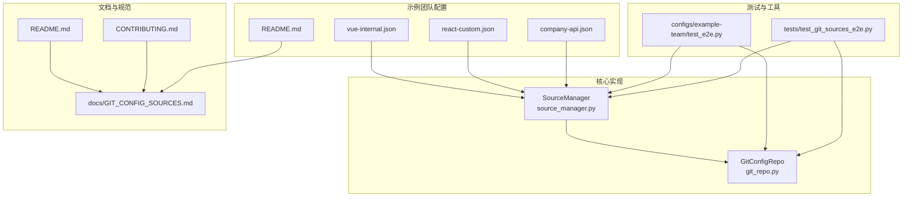
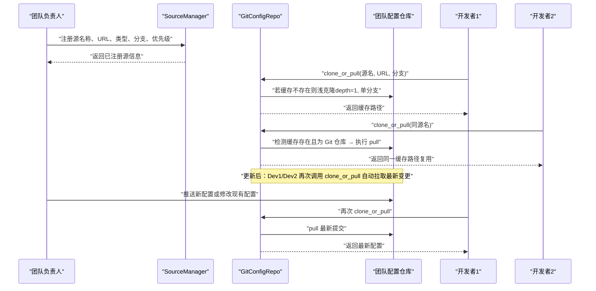
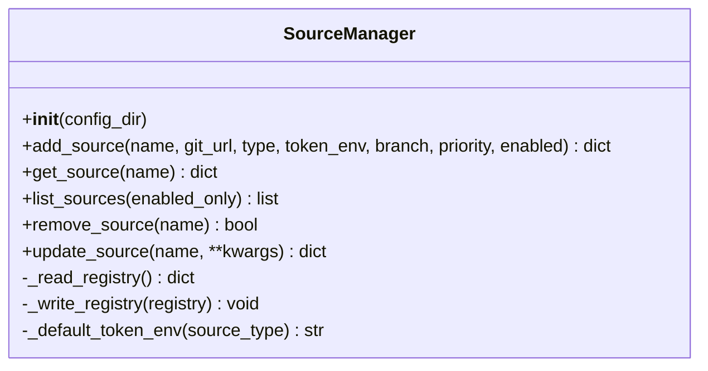
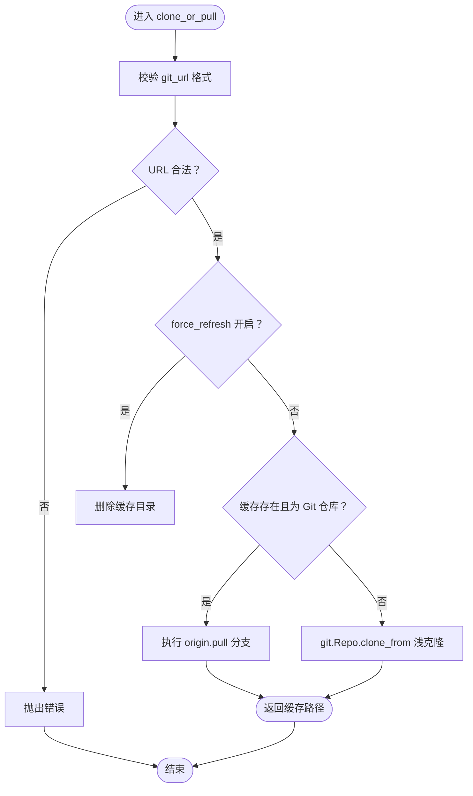
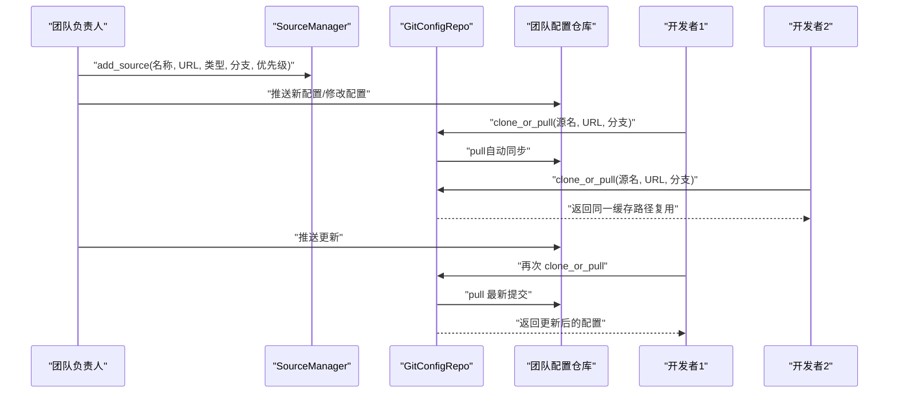
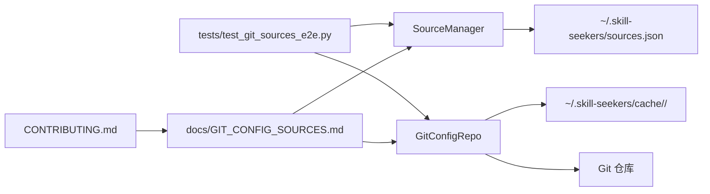

# 团队协作工作流

<cite>
**本文引用的文件**
- [configs/example-team/company-api.json](file://configs/example-team/company-api.json)
- [configs/example-team/react-custom.json](file://configs/example-team/react-custom.json)
- [configs/example-team/vue-internal.json](file://configs/example-team/vue-internal.json)
- [configs/example-team/README.md](file://configs/example-team/README.md)
- [configs/example-team/test_e2e.py](file://configs/example-team/test_e2e.py)
- [tests/test_git_sources_e2e.py](file://tests/test_git_sources_e2e.py)
- [src/skill_seekers/mcp/git_repo.py](file://src/skill_seekers/mcp/git_repo.py)
- [src/skill_seekers/mcp/source_manager.py](file://src/skill_seekers/mcp/source_manager.py)
- [docs/GIT_CONFIG_SOURCES.md](file://docs/GIT_CONFIG_SOURCES.md)
- [README.md](file://README.md)
- [CONTRIBUTING.md](file://CONTRIBUTING.md)
</cite>

## 目录
1. [简介](#简介)
2. [项目结构](#项目结构)
3. [核心组件](#核心组件)
4. [架构总览](#架构总览)
5. [详细组件分析](#详细组件分析)
6. [依赖关系分析](#依赖关系分析)
7. [性能与并发特性](#性能与并发特性)
8. [故障排查指南](#故障排查指南)
9. [结论](#结论)
10. [附录](#附录)

## 简介
本指南围绕团队协作配置管理流程，以 example-team 目录中的 company-api.json、react-custom.json 和 vue-internal.json 为例，演示团队配置仓库的典型结构与使用方式；并通过 test_git_sources_e2e.py 的端到端测试流程，说明团队负责人如何创建并注册配置仓库，团队成员如何克隆使用并自动缓存；重点阐述多开发者并发访问时的缓存复用机制（clone_or_pull）以及配置更新后的自动同步策略，并给出企业级团队的分支管理建议（如 develop 分支用于开发、main 分支用于稳定配置）。

## 项目结构
该仓库包含团队示例配置、端到端测试、以及配置源管理与 Git 操作的核心实现模块。关键路径如下：
- 示例团队配置：configs/example-team 下包含三类团队配置 JSON 文件，分别面向公司 API 文档、自定义 React 配置与内部 Vue 文档。
- 端到端测试：tests/test_git_sources_e2e.py 覆盖从注册源、克隆/拉取、发现配置、更新与清理等全流程。
- 核心实现：src/skill_seekers/mcp/source_manager.py 管理配置源注册表，src/skill_seekers/mcp/git_repo.py 提供 Git 克隆/拉取与配置加载能力。
- 使用指南：docs/GIT_CONFIG_SOURCES.md 提供完整的使用场景、最佳实践与故障排查；CONTRIBUTING.md 给出分支管理建议。

图表来源
- [configs/example-team/README.md](file://configs/example-team/README.md#L1-L137)
- [tests/test_git_sources_e2e.py](file://tests/test_git_sources_e2e.py#L1-L200)
- [src/skill_seekers/mcp/source_manager.py](file://src/skill_seekers/mcp/source_manager.py#L1-L120)
- [src/skill_seekers/mcp/git_repo.py](file://src/skill_seekers/mcp/git_repo.py#L1-L120)
- [docs/GIT_CONFIG_SOURCES.md](file://docs/GIT_CONFIG_SOURCES.md#L1-L120)
- [CONTRIBUTING.md](file://CONTRIBUTING.md#L18-L52)

章节来源
- [configs/example-team/README.md](file://configs/example-team/README.md#L1-L137)
- [tests/test_git_sources_e2e.py](file://tests/test_git_sources_e2e.py#L1-L200)
- [src/skill_seekers/mcp/source_manager.py](file://src/skill_seekers/mcp/source_manager.py#L1-L120)
- [src/skill_seekers/mcp/git_repo.py](file://src/skill_seekers/mcp/git_repo.py#L1-L120)
- [docs/GIT_CONFIG_SOURCES.md](file://docs/GIT_CONFIG_SOURCES.md#L1-L120)
- [CONTRIBUTING.md](file://CONTRIBUTING.md#L18-L52)

## 核心组件
- SourceManager：负责在用户主目录下的配置目录中维护 sources.json 注册表，支持添加、查询、列出、移除与更新源，具备优先级排序与启用状态控制。
- GitConfigRepo：负责基于 Git 的配置仓库管理，提供 clone_or_pull（存在则拉取，不存在则浅克隆）、find_configs（递归发现 JSON 配置）、get_config（按名称加载配置）与 URL 校验、令牌注入等能力。

章节来源
- [src/skill_seekers/mcp/source_manager.py](file://src/skill_seekers/mcp/source_manager.py#L1-L294)
- [src/skill_seekers/mcp/git_repo.py](file://src/skill_seekers/mcp/git_repo.py#L1-L283)

## 架构总览
下图展示了从“团队负责人注册源”到“团队成员使用并自动缓存”的整体流程，以及更新后自动同步的关键节点。

图表来源
- [tests/test_git_sources_e2e.py](file://tests/test_git_sources_e2e.py#L650-L742)
- [src/skill_seekers/mcp/git_repo.py](file://src/skill_seekers/mcp/git_repo.py#L41-L132)
- [src/skill_seekers/mcp/source_manager.py](file://src/skill_seekers/mcp/source_manager.py#L39-L119)

章节来源
- [tests/test_git_sources_e2e.py](file://tests/test_git_sources_e2e.py#L650-L742)
- [src/skill_seekers/mcp/git_repo.py](file://src/skill_seekers/mcp/git_repo.py#L41-L132)
- [src/skill_seekers/mcp/source_manager.py](file://src/skill_seekers/mcp/source_manager.py#L39-L119)

## 详细组件分析

### 示例团队配置仓库结构与命名
- 结构：example-team 目录包含三份团队配置 JSON 文件，分别面向不同技术栈与用途，便于团队共享与版本化管理。
- 命名建议：README 中强调了避免与官方配置冲突、包含版本信息、按类别分组等最佳实践，有助于大规模团队协作与检索。

章节来源
- [configs/example-team/company-api.json](file://configs/example-team/company-api.json#L1-L43)
- [configs/example-team/react-custom.json](file://configs/example-team/react-custom.json#L1-L36)
- [configs/example-team/vue-internal.json](file://configs/example-team/vue-internal.json#L1-L37)
- [configs/example-team/README.md](file://configs/example-team/README.md#L65-L100)

### SourceManager：源注册与优先级解析
- 注册与更新：支持添加/更新源，自动推断 token 环境变量（根据源类型），并按优先级排序保存。
- 列表与筛选：支持仅列出启用的源，便于在多源环境下进行优先级解析。
- 清理与持久化：通过原子写入确保注册表一致性，提供移除源的能力。

图表来源
- [src/skill_seekers/mcp/source_manager.py](file://src/skill_seekers/mcp/source_manager.py#L1-L294)

章节来源
- [src/skill_seekers/mcp/source_manager.py](file://src/skill_seekers/mcp/source_manager.py#L39-L119)
- [src/skill_seekers/mcp/source_manager.py](file://src/skill_seekers/mcp/source_manager.py#L121-L233)
- [src/skill_seekers/mcp/source_manager.py](file://src/skill_seekers/mcp/source_manager.py#L234-L294)

### GitConfigRepo：缓存复用与自动同步
- 缓存路径：以源名为目录名，缓存于 SKILL_SEEKERS_CACHE_DIR 或默认路径 ~/.skill-seekers/cache/。
- 复用机制：若缓存目录存在且包含 .git 子目录，则执行 pull；否则执行浅克隆（depth=1，单分支）。
- 安全与可用性：支持注入令牌（HTTPS URL + token），对无效 URL 进行校验；对认证失败、仓库不存在等错误提供友好提示；对损坏仓库进行删除并触发重新克隆。
- 配置发现与加载：递归扫描仓库中的 JSON 文件，忽略 .git 目录；支持大小写不敏感匹配；找不到配置时返回可用列表以便定位。

图表来源
- [src/skill_seekers/mcp/git_repo.py](file://src/skill_seekers/mcp/git_repo.py#L41-L132)

章节来源
- [src/skill_seekers/mcp/git_repo.py](file://src/skill_seekers/mcp/git_repo.py#L41-L132)
- [src/skill_seekers/mcp/git_repo.py](file://src/skill_seekers/mcp/git_repo.py#L133-L206)
- [src/skill_seekers/mcp/git_repo.py](file://src/skill_seekers/mcp/git_repo.py#L207-L283)

### 端到端测试流程：团队负责人与团队成员协作
- 直接 Git URL 工作流：无需注册，直接通过 Git URL 克隆并获取指定配置。
- 注册源工作流：团队负责人注册源，团队成员通过源名克隆，后续可更新源优先级、移除源。
- 多源优先级解析：多个源时按优先级排序，启用/禁用源影响最终可用性。
- 拉取更新与强制刷新：新增配置后再次拉取可见；手动强制刷新可删除缓存并重新克隆。
- 错误处理：URL 校验、配置未找到、无效源名等均有明确提示与建议。
- 缓存隔离：不同缓存目录相互独立，修改一个不会影响另一个。

图表来源
- [tests/test_git_sources_e2e.py](file://tests/test_git_sources_e2e.py#L128-L248)
- [tests/test_git_sources_e2e.py](file://tests/test_git_sources_e2e.py#L252-L366)
- [tests/test_git_sources_e2e.py](file://tests/test_git_sources_e2e.py#L367-L410)
- [tests/test_git_sources_e2e.py](file://tests/test_git_sources_e2e.py#L410-L470)
- [tests/test_git_sources_e2e.py](file://tests/test_git_sources_e2e.py#L471-L549)
- [tests/test_git_sources_e2e.py](file://tests/test_git_sources_e2e.py#L550-L606)
- [tests/test_git_sources_e2e.py](file://tests/test_git_sources_e2e.py#L607-L650)
- [tests/test_git_sources_e2e.py](file://tests/test_git_sources_e2e.py#L650-L742)

章节来源
- [tests/test_git_sources_e2e.py](file://tests/test_git_sources_e2e.py#L128-L248)
- [tests/test_git_sources_e2e.py](file://tests/test_git_sources_e2e.py#L252-L366)
- [tests/test_git_sources_e2e.py](file://tests/test_git_sources_e2e.py#L367-L410)
- [tests/test_git_sources_e2e.py](file://tests/test_git_sources_e2e.py#L410-L470)
- [tests/test_git_sources_e2e.py](file://tests/test_git_sources_e2e.py#L471-L549)
- [tests/test_git_sources_e2e.py](file://tests/test_git_sources_e2e.py#L550-L606)
- [tests/test_git_sources_e2e.py](file://tests/test_git_sources_e2e.py#L607-L650)
- [tests/test_git_sources_e2e.py](file://tests/test_git_sources_e2e.py#L650-L742)

### 示例团队仓库的使用与测试
- README 提供两种使用方式：直接使用示例仓库（file:// URL，无需鉴权）或创建自己的团队仓库并注册。
- 提供了完整的 E2E 测试脚本，覆盖注册源、克隆仓库、发现配置、获取配置、验证内容、列出源与清理等步骤。

章节来源
- [configs/example-team/README.md](file://configs/example-team/README.md#L22-L124)
- [configs/example-team/test_e2e.py](file://configs/example-team/test_e2e.py#L23-L132)

## 依赖关系分析
- SourceManager 与 GitConfigRepo：两者通过文件系统交互（注册表与缓存目录），SourceManager 负责元数据管理，GitConfigRepo 负责 Git 操作与配置加载。
- 端到端测试：tests/test_git_sources_e2e.py 同时依赖 SourceManager 与 GitConfigRepo，验证从注册到使用再到更新的完整闭环。
- 文档与规范：docs/GIT_CONFIG_SOURCES.md 与 CONTRIBUTING.md 为使用与分支管理提供指导。

图表来源
- [src/skill_seekers/mcp/source_manager.py](file://src/skill_seekers/mcp/source_manager.py#L1-L120)
- [src/skill_seekers/mcp/git_repo.py](file://src/skill_seekers/mcp/git_repo.py#L1-L120)
- [tests/test_git_sources_e2e.py](file://tests/test_git_sources_e2e.py#L1-L120)
- [docs/GIT_CONFIG_SOURCES.md](file://docs/GIT_CONFIG_SOURCES.md#L128-L191)
- [CONTRIBUTING.md](file://CONTRIBUTING.md#L18-L52)

章节来源
- [src/skill_seekers/mcp/source_manager.py](file://src/skill_seekers/mcp/source_manager.py#L1-L120)
- [src/skill_seekers/mcp/git_repo.py](file://src/skill_seekers/mcp/git_repo.py#L1-L120)
- [tests/test_git_sources_e2e.py](file://tests/test_git_sources_e2e.py#L1-L120)
- [docs/GIT_CONFIG_SOURCES.md](file://docs/GIT_CONFIG_SOURCES.md#L128-L191)
- [CONTRIBUTING.md](file://CONTRIBUTING.md#L18-L52)

## 性能与并发特性
- 缓存复用：同一源名多次调用 clone_or_pull 将复用已有缓存，避免重复克隆，显著降低网络与磁盘开销。
- 自动同步：每次使用前均会检查并拉取最新变更，确保团队成员获取到最新配置。
- 浅克隆与单分支：默认 depth=1 与 single_branch，极大减少克隆时间与空间占用。
- 并发安全：测试覆盖多开发者并发场景，验证缓存隔离与拉取一致性；同时注册表采用原子写入，避免竞态导致的数据损坏。

章节来源
- [src/skill_seekers/mcp/git_repo.py](file://src/skill_seekers/mcp/git_repo.py#L82-L109)
- [tests/test_git_sources_e2e.py](file://tests/test_git_sources_e2e.py#L549-L606)

## 故障排查指南
- 认证失败：检查 token 环境变量是否正确设置，确认权限范围满足仓库访问需求。
- 仓库不存在或 URL 错误：核对 URL 格式与可访问性，必要时使用 file:// URL 进行本地验证。
- 配置未找到：查看可用配置列表，注意大小写不敏感匹配；确认文件扩展名与仓库结构。
- 缓存问题：使用 force_refresh 删除缓存并重新克隆；或手动清理对应源的缓存目录。
- 多源优先级：通过调整 priority 实现优先级解析，确保团队特定配置优先于公共配置。

章节来源
- [docs/GIT_CONFIG_SOURCES.md](file://docs/GIT_CONFIG_SOURCES.md#L622-L715)
- [src/skill_seekers/mcp/git_repo.py](file://src/skill_seekers/mcp/git_repo.py#L111-L132)
- [src/skill_seekers/mcp/source_manager.py](file://src/skill_seekers/mcp/source_manager.py#L121-L165)

## 结论
通过示例团队配置仓库与端到端测试，本指南系统性地展示了团队协作配置管理的完整流程：团队负责人注册源、团队成员使用并自动缓存、并发访问时的缓存复用与自动同步、配置更新后的即时生效，以及企业级团队的分支管理建议。结合 SourceManager 与 GitConfigRepo 的设计，可在小团队到大型组织范围内实现高效、可靠、可扩展的配置共享与版本化管理。

## 附录
- 使用示例与快速开始：参考 README 与 docs/GIT_CONFIG_SOURCES.md 的“快速开始”与“使用示例”部分。
- 分支管理建议：遵循两分支工作流（development 作为集成分支，main 作为生产分支），团队配置仓库同样建议采用 develop/main 分支策略，以保证稳定发布与持续集成。

章节来源
- [README.md](file://README.md#L410-L434)
- [docs/GIT_CONFIG_SOURCES.md](file://docs/GIT_CONFIG_SOURCES.md#L1-L120)
- [CONTRIBUTING.md](file://CONTRIBUTING.md#L18-L52)