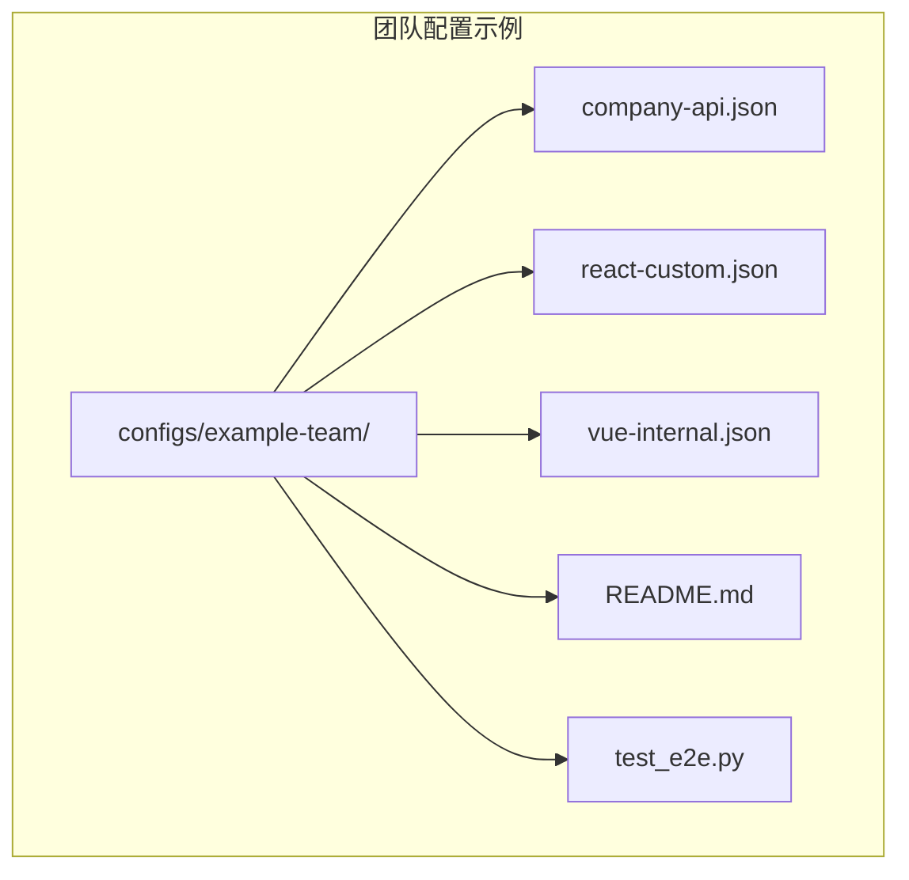
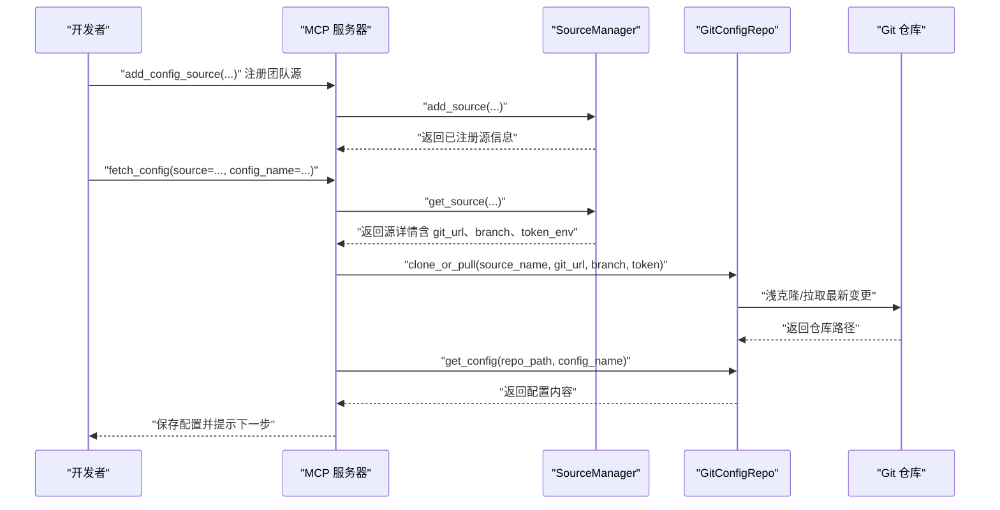
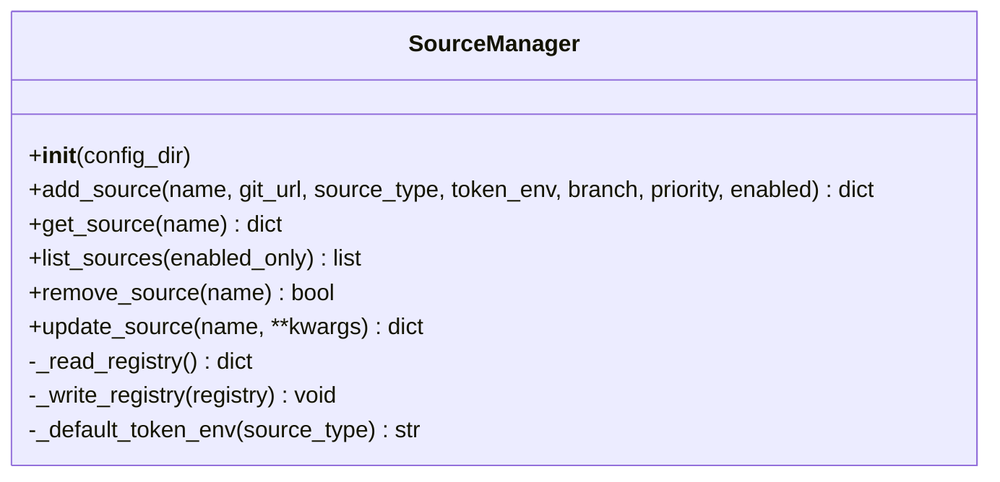
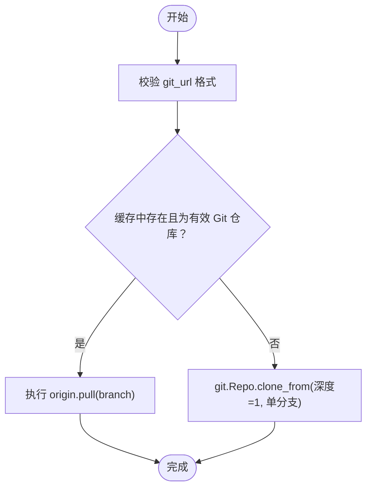
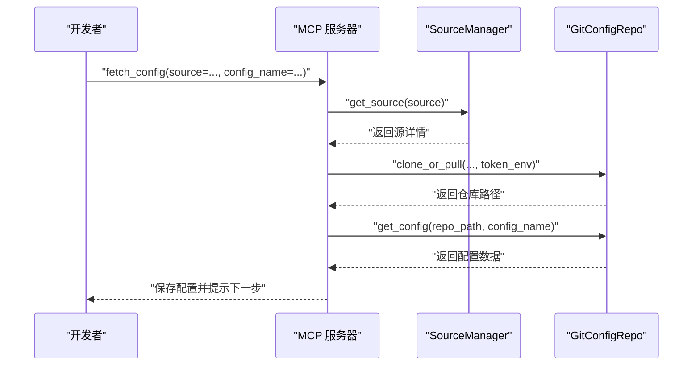
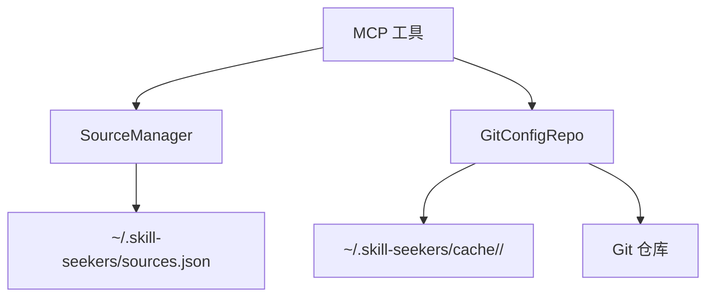

# 团队配置管理

<cite>
**本文引用的文件**
- [configs/example-team/company-api.json](file://configs/example-team/company-api.json)
- [configs/example-team/react-custom.json](file://configs/example-team/react-custom.json)
- [configs/example-team/vue-internal.json](file://configs/example-team/vue-internal.json)
- [configs/example-team/README.md](file://configs/example-team/README.md)
- [src/skill_seekers/mcp/source_manager.py](file://src/skill_seekers/mcp/source_manager.py)
- [src/skill_seekers/mcp/git_repo.py](file://src/skill_seekers/mcp/git_repo.py)
- [src/skill_seekers/mcp/server.py](file://src/skill_seekers/mcp/server.py)
- [docs/GIT_CONFIG_SOURCES.md](file://docs/GIT_CONFIG_SOURCES.md)
- [README.md](file://README.md)
- [tests/test_git_sources_e2e.py](file://tests/test_git_sources_e2e.py)
- [configs/example-team/test_e2e.py](file://configs/example-team/test_e2e.py)
</cite>

## 目录
1. [引言](#引言)
2. [项目结构](#项目结构)
3. [核心组件](#核心组件)
4. [架构总览](#架构总览)
5. [详细组件分析](#详细组件分析)
6. [依赖关系分析](#依赖关系分析)
7. [性能考量](#性能考量)
8. [故障排查指南](#故障排查指南)
9. [结论](#结论)
10. [附录](#附录)

## 引言
本指南面向团队协作场景，围绕“通过 Git 仓库集中管理技能配置”的目标，结合仓库中的 example-team 示例，系统讲解团队配置的目录结构与命名规范、基于 Git 的版本控制与分支管理协作流程、以及如何通过源管理器从远程 Git 拉取配置并进行本地安装。同时提供企业级部署最佳实践，包括权限控制、配置审计与 CI/CD 集成方案，确保在多用户环境下实现配置的一致性与安全性。

## 项目结构
- team 配置示例位于 configs/example-team，包含三类典型配置：
  - 公司内部 API 文档配置：company-api.json
  - 自定义前端框架配置（React）：react-custom.json
  - 内部前端框架配置（Vue）：vue-internal.json
- 配置示例仓库还提供了使用说明与测试脚本，便于团队快速上手与验证工作流。

图表来源
- [configs/example-team/README.md](file://configs/example-team/README.md#L1-L137)
- [configs/example-team/company-api.json](file://configs/example-team/company-api.json#L1-L43)
- [configs/example-team/react-custom.json](file://configs/example-team/react-custom.json#L1-L36)
- [configs/example-team/vue-internal.json](file://configs/example-team/vue-internal.json#L1-L37)

章节来源
- [configs/example-team/README.md](file://configs/example-team/README.md#L1-L137)
- [configs/example-team/company-api.json](file://configs/example-team/company-api.json#L1-L43)
- [configs/example-team/react-custom.json](file://configs/example-team/react-custom.json#L1-L36)
- [configs/example-team/vue-internal.json](file://configs/example-team/vue-internal.json#L1-L37)

## 核心组件
- 源管理器（SourceManager）
  - 负责在用户主目录下维护配置源注册表（~/.skill-seekers/sources.json），支持添加、查询、更新、删除与列出配置源；具备优先级排序与原子写入能力。
- Git 配置仓库管理器（GitConfigRepo）
  - 负责克隆或拉取指定 Git 仓库到本地缓存目录（默认 ~/.skill-seekers/cache/<source>/），支持浅克隆、自动拉取、令牌注入与配置发现。
- MCP 服务端工具
  - 提供 add_config_source、list_config_sources、fetch_config 等工具，统一对外暴露配置源管理与配置获取能力，并与 CLI/IDE 集成。

章节来源
- [src/skill_seekers/mcp/source_manager.py](file://src/skill_seekers/mcp/source_manager.py#L1-L294)
- [src/skill_seekers/mcp/git_repo.py](file://src/skill_seekers/mcp/git_repo.py#L1-L283)
- [src/skill_seekers/mcp/server.py](file://src/skill_seekers/mcp/server.py#L1252-L1501)
- [src/skill_seekers/mcp/server.py](file://src/skill_seekers/mcp/server.py#L2012-L2075)
- [src/skill_seekers/mcp/server.py](file://src/skill_seekers/mcp/server.py#L2078-L2130)

## 架构总览
团队配置管理的整体流程如下：
- 用户通过 MCP 工具注册团队 Git 仓库为配置源；
- 获取配置时，系统根据源优先级查找，若命中团队源则从其仓库拉取配置；
- 配置被保存到本地目标路径，随后进入后续的抓取、增强、打包与上传流程。

图表来源
- [src/skill_seekers/mcp/server.py](file://src/skill_seekers/mcp/server.py#L1252-L1501)
- [src/skill_seekers/mcp/server.py](file://src/skill_seekers/mcp/server.py#L2012-L2075)
- [src/skill_seekers/mcp/server.py](file://src/skill_seekers/mcp/server.py#L2078-L2130)
- [src/skill_seekers/mcp/git_repo.py](file://src/skill_seekers/mcp/git_repo.py#L41-L132)
- [src/skill_seekers/mcp/source_manager.py](file://src/skill_seekers/mcp/source_manager.py#L39-L119)

## 详细组件分析

### 组件一：源管理器（SourceManager）
- 功能要点
  - 注册与更新配置源（名称、URL、类型、分支、优先级、启用状态、时间戳等）；
  - 原子化写入注册表，避免损坏；
  - 支持按优先级排序与条件筛选（仅启用）；
  - 默认令牌环境变量映射（GitHub/GitLab/Bitbucket/Gitea/custom）。
- 关键行为
  - 名称校验（字母数字与连字符/下划线组合）；
  - URL 校验与令牌注入；
  - 时间戳保留与更新策略。

图表来源
- [src/skill_seekers/mcp/source_manager.py](file://src/skill_seekers/mcp/source_manager.py#L14-L294)

章节来源
- [src/skill_seekers/mcp/source_manager.py](file://src/skill_seekers/mcp/source_manager.py#L39-L119)
- [src/skill_seekers/mcp/source_manager.py](file://src/skill_seekers/mcp/source_manager.py#L121-L165)
- [src/skill_seekers/mcp/source_manager.py](file://src/skill_seekers/mcp/source_manager.py#L166-L233)
- [src/skill_seekers/mcp/source_manager.py](file://src/skill_seekers/mcp/source_manager.py#L234-L294)

### 组件二：Git 配置仓库管理器（GitConfigRepo）
- 功能要点
  - 浅克隆与单分支拉取，提升速度与节省空间；
  - 自动拉取最新变更，异常时清理并重试；
  - 令牌注入（支持 SSH 自动转 HTTPS 并注入令牌）；
  - 递归扫描仓库中的所有 JSON 配置文件，支持大小写不敏感匹配；
  - 本地缓存目录可自定义（默认 ~/.skill-seekers/cache/<source>/）。
- 错误处理
  - 认证失败、仓库不存在、JSON 解析错误等均提供明确提示。

图表来源
- [src/skill_seekers/mcp/git_repo.py](file://src/skill_seekers/mcp/git_repo.py#L41-L132)

章节来源
- [src/skill_seekers/mcp/git_repo.py](file://src/skill_seekers/mcp/git_repo.py#L41-L132)
- [src/skill_seekers/mcp/git_repo.py](file://src/skill_seekers/mcp/git_repo.py#L133-L215)
- [src/skill_seekers/mcp/git_repo.py](file://src/skill_seekers/mcp/git_repo.py#L216-L283)

### 组件三：MCP 工具（注册/列举/获取配置）
- add_config_source_tool
  - 参数：name、git_url、source_type、token_env、branch、priority、enabled；
  - 返回：注册成功信息与使用指引。
- list_config_sources_tool
  - 参数：enabled_only；
  - 返回：已注册源列表与使用说明。
- fetch_config_tool
  - 三种模式：
    - 命名源模式：从已注册源拉取配置；
    - 直接 Git URL 模式：一次性直接拉取；
    - API 模式：向官方 API 下载配置（兼容旧流程）。
  - 支持强制刷新缓存、保存到目标路径、输出下一步操作建议。

图表来源
- [src/skill_seekers/mcp/server.py](file://src/skill_seekers/mcp/server.py#L1252-L1501)
- [src/skill_seekers/mcp/server.py](file://src/skill_seekers/mcp/server.py#L2012-L2075)
- [src/skill_seekers/mcp/server.py](file://src/skill_seekers/mcp/server.py#L2078-L2130)

章节来源
- [src/skill_seekers/mcp/server.py](file://src/skill_seekers/mcp/server.py#L1252-L1501)
- [src/skill_seekers/mcp/server.py](file://src/skill_seekers/mcp/server.py#L2012-L2075)
- [src/skill_seekers/mcp/server.py](file://src/skill_seekers/mcp/server.py#L2078-L2130)

## 依赖关系分析
- 组件耦合
  - fetch_config_tool 依赖 SourceManager 与 GitConfigRepo；
  - SourceManager 与 GitConfigRepo 分别独立负责“注册表”与“仓库拉取”，职责清晰；
  - 通过环境变量传递令牌，避免将凭据写入文件，降低安全风险。
- 外部依赖
  - GitPython 用于仓库克隆/拉取；
  - httpx 用于访问官方 API（兼容模式）。

图表来源
- [src/skill_seekers/mcp/source_manager.py](file://src/skill_seekers/mcp/source_manager.py#L14-L119)
- [src/skill_seekers/mcp/git_repo.py](file://src/skill_seekers/mcp/git_repo.py#L17-L40)
- [src/skill_seekers/mcp/server.py](file://src/skill_seekers/mcp/server.py#L1252-L1501)

章节来源
- [src/skill_seekers/mcp/source_manager.py](file://src/skill_seekers/mcp/source_manager.py#L14-L119)
- [src/skill_seekers/mcp/git_repo.py](file://src/skill_seekers/mcp/git_repo.py#L17-L40)
- [src/skill_seekers/mcp/server.py](file://src/skill_seekers/mcp/server.py#L1252-L1501)

## 性能考量
- 浅克隆与单分支
  - 使用深度 1 与单分支克隆，显著减少网络与磁盘占用，适合大规模团队共享配置。
- 缓存复用
  - 本地缓存目录持久化，避免重复下载；支持强制刷新以覆盖缓存。
- 令牌注入与 URL 规范化
  - SSH 自动转换为 HTTPS 并注入令牌，减少认证失败导致的重试成本。
- 优先级解析
  - 通过优先级排序，减少冲突与不必要的拉取尝试。

章节来源
- [src/skill_seekers/mcp/git_repo.py](file://src/skill_seekers/mcp/git_repo.py#L41-L132)
- [src/skill_seekers/mcp/source_manager.py](file://src/skill_seekers/mcp/source_manager.py#L119-L165)
- [docs/GIT_CONFIG_SOURCES.md](file://docs/GIT_CONFIG_SOURCES.md#L176-L191)

## 故障排查指南
- 认证失败
  - 确认已设置正确的环境变量（如 GITHUB_TOKEN、GITLAB_TOKEN 等）；
  - 检查令牌权限范围是否满足私有仓库读取需求；
  - 尝试手动克隆验证令牌有效性。
- 配置未找到
  - 使用列出工具查看实际可用配置；
  - 检查仓库中是否存在对应 JSON 文件；
  - 注意大小写不敏感匹配规则。
- 缓存问题
  - 使用强制刷新参数触发重新克隆；
  - 手动清理缓存目录后重试；
  - 查看最近一次提交确认拉取是否成功。
- 网络缓慢
  - 仓库体积过大时考虑拆分或优化；
  - 使用浅克隆与单分支策略已内置。

章节来源
- [docs/GIT_CONFIG_SOURCES.md](file://docs/GIT_CONFIG_SOURCES.md#L622-L706)
- [src/skill_seekers/mcp/git_repo.py](file://src/skill_seekers/mcp/git_repo.py#L111-L132)

## 结论
通过将团队配置集中托管于 Git 仓库，并借助 SourceManager 与 GitConfigRepo 实现注册、拉取与缓存管理，可以高效支撑小团队到大型企业的协作场景。配合 MCP 工具链，团队成员可在本地或 CI/CD 中无缝获取配置，实现一致、安全、可审计的配置分发与更新。

## 附录

### A. 目录结构与命名规范（示例）
- 推荐结构
  - 平铺式（小仓库）：根目录放置多个配置 JSON；
  - 分层式（大仓库）：按前端/后端/移动端等分类组织。
- 命名建议
  - 描述性强、避免与官方配置冲突；
  - 可包含版本号（如 api-v2.json）；
  - 按类别分组（如 frontend/、backend/）。

章节来源
- [configs/example-team/README.md](file://configs/example-team/README.md#L520-L561)
- [configs/example-team/README.md](file://configs/example-team/README.md#L562-L576)

### B. 版本控制与分支管理协作工作流
- 分支策略
  - 主分支用于发布稳定配置；
  - 开发分支用于迭代与评审；
  - 通过 Pull Request 审核变更，合并后自动触发 CI/CD。
- 合规要求
  - 禁止提交令牌到仓库；
  - 使用细粒度令牌与最小权限原则；
  - 对敏感配置采用私有仓库或访问控制列表。

章节来源
- [docs/GIT_CONFIG_SOURCES.md](file://docs/GIT_CONFIG_SOURCES.md#L338-L397)
- [README.md](file://README.md#L400-L435)

### C. 本地安装与使用流程（以 example-team 为例）
- 注册团队源
  - 使用 MCP 工具 add_config_source 注册示例仓库；
  - 或直接使用 file:// URL 进行一次性测试。
- 拉取配置
  - 使用 fetch_config 从团队源获取指定配置；
  - 配置保存至目标路径，随后进入抓取/增强/打包流程。
- 验证与测试
  - 运行示例仓库提供的 E2E 测试脚本；
  - 使用列出工具检查可用配置。

章节来源
- [configs/example-team/README.md](file://configs/example-team/README.md#L1-L137)
- [configs/example-team/test_e2e.py](file://configs/example-team/test_e2e.py#L48-L86)
- [tests/test_git_sources_e2e.py](file://tests/test_git_sources_e2e.py#L188-L229)

### D. 企业级部署最佳实践
- 权限控制
  - 使用环境变量存储令牌，避免明文写入配置；
  - 不同平台使用不同令牌，避免交叉影响；
  - 为不同团队/项目设置独立令牌与访问范围。
- 配置审计
  - 在 CI/CD 中记录每次配置拉取与保存结果；
  - 对配置变更进行变更日志与审批记录。
- CI/CD 集成
  - 在流水线中预置团队源注册步骤；
  - 使用强制刷新参数确保每次构建使用最新配置；
  - 将配置保存到制品库或工件中，便于后续打包与上传。

章节来源
- [docs/GIT_CONFIG_SOURCES.md](file://docs/GIT_CONFIG_SOURCES.md#L786-L854)
- [README.md](file://README.md#L464-L474)