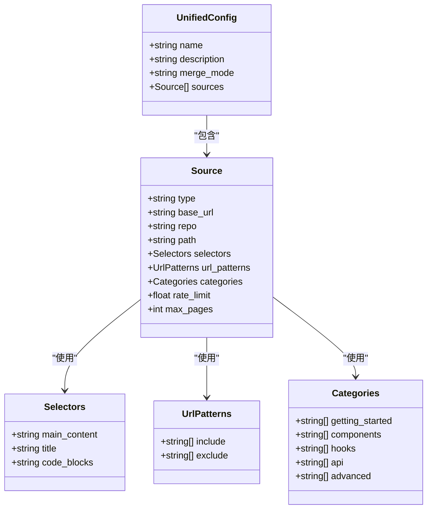
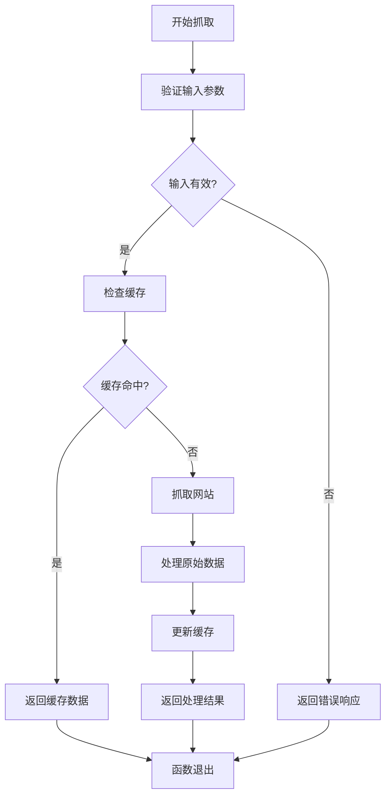
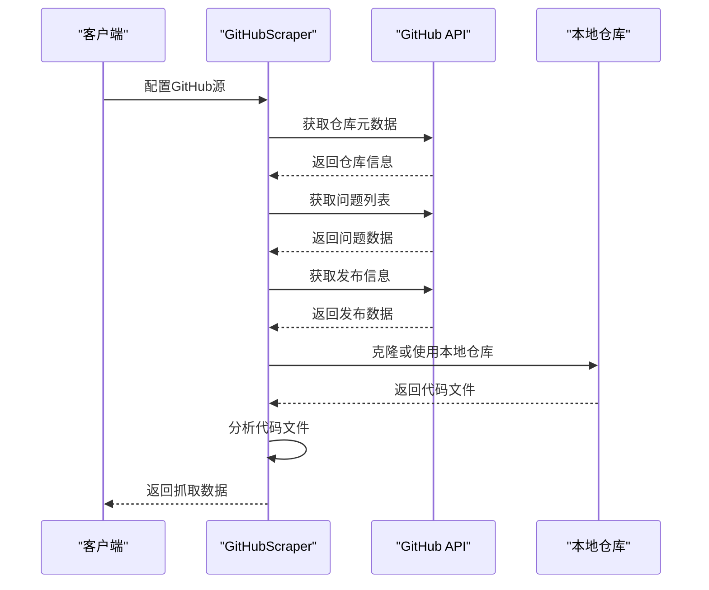
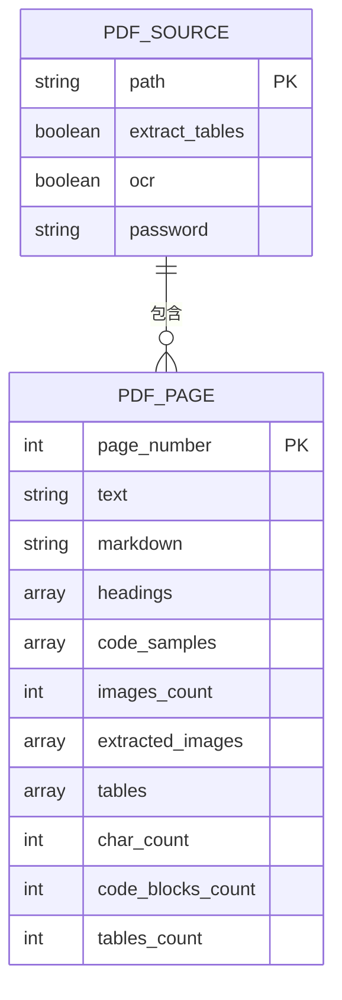
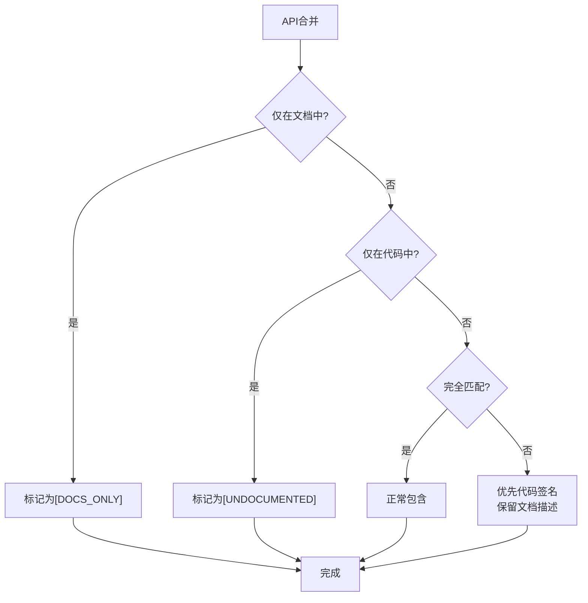
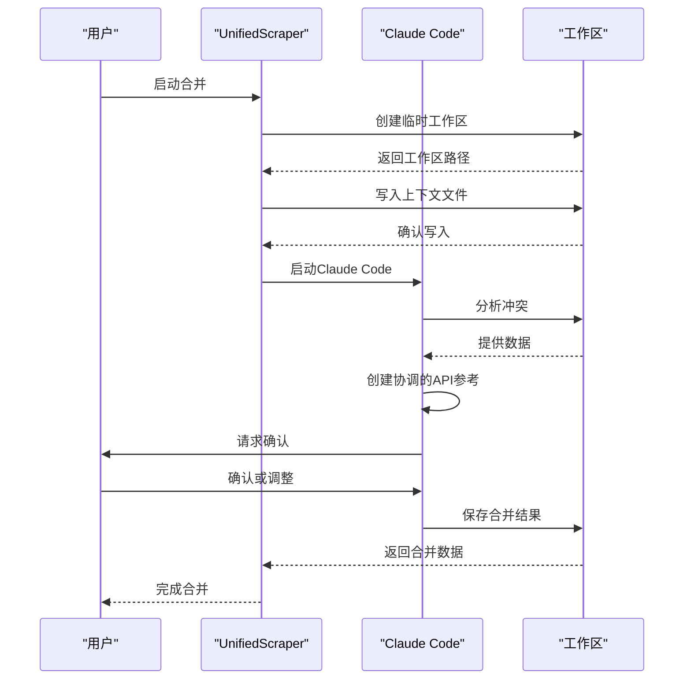
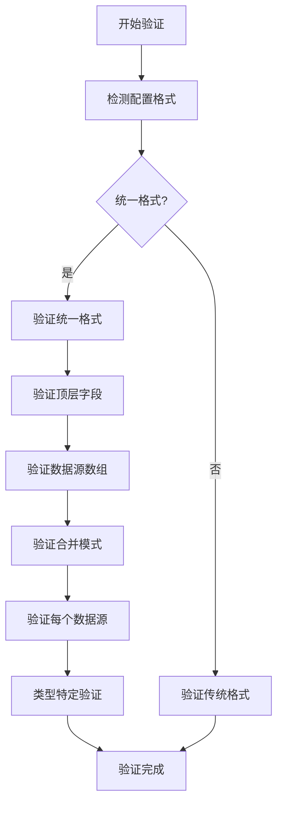
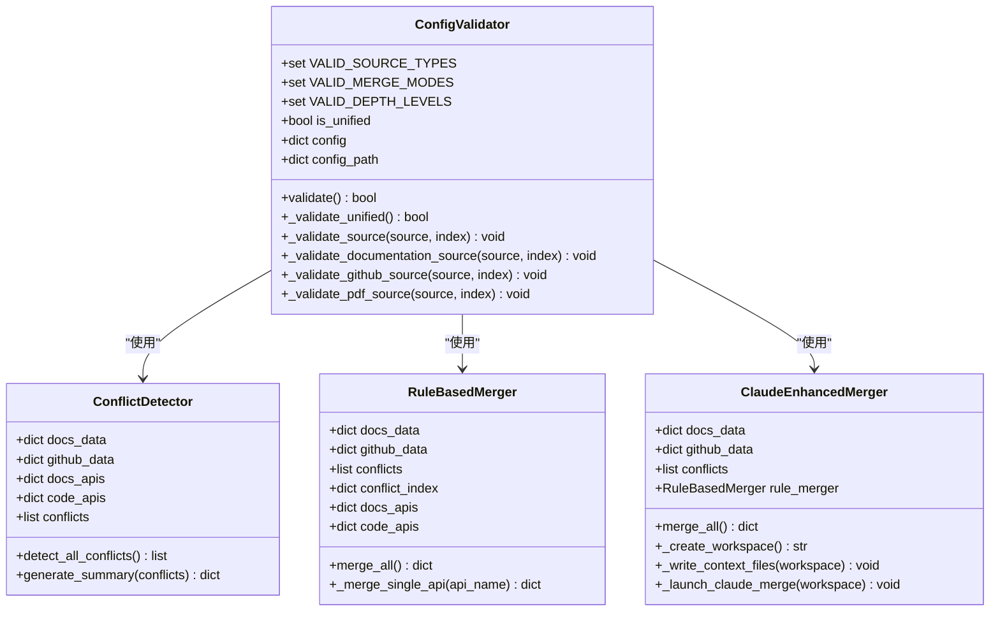
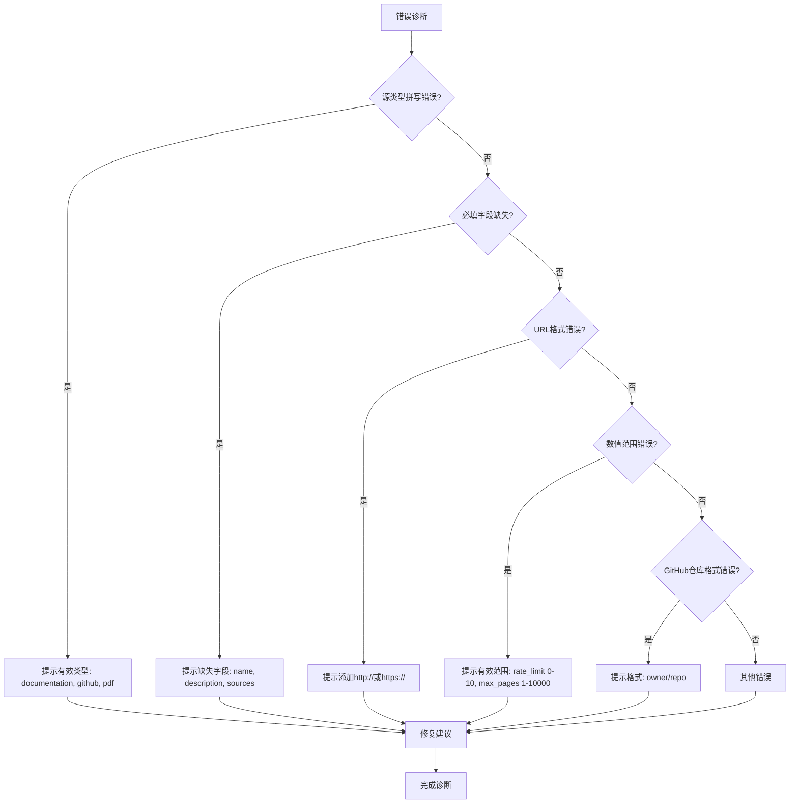
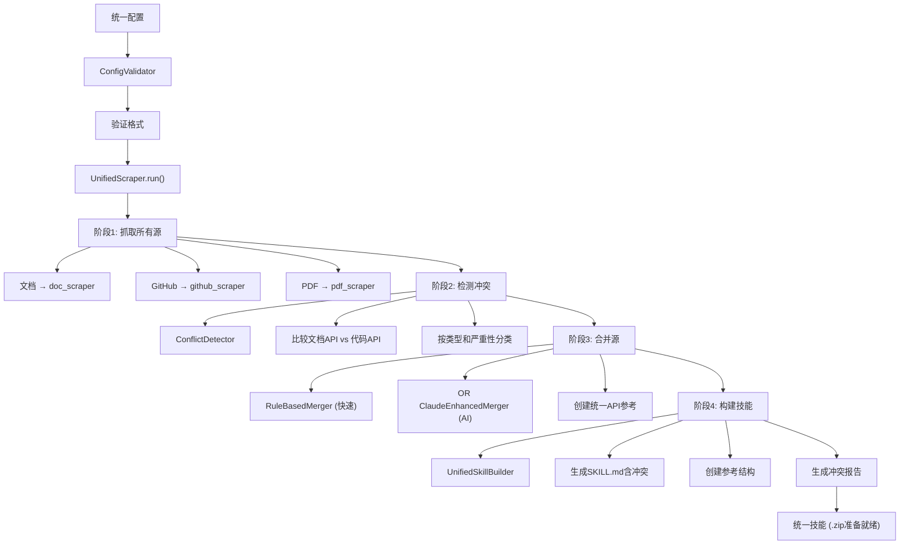

# 统一配置文件

<cite>
**本文档中引用的文件**   
- [react_unified.json](file://configs/react_unified.json)
- [fastapi_unified.json](file://configs/fastapi_unified.json)
- [config_validator.py](file://src/skill_seekers/cli/config_validator.py)
- [unified_scraper.py](file://src/skill_seekers/cli/unified_scraper.py)
- [merge_sources.py](file://src/skill_seekers/cli/merge_sources.py)
- [UNIFIED_SCRAPING.md](file://docs/UNIFIED_SCRAPING.md)
</cite>

## 目录
1. [简介](#简介)
2. [核心配置结构](#核心配置结构)
3. [数据源配置详解](#数据源配置详解)
4. [合并模式详解](#合并模式详解)
5. [配置验证机制](#配置验证机制)
6. [常见错误诊断与修复](#常见错误诊断与修复)
7. [实际应用示例](#实际应用示例)
8. [工作流程与架构](#工作流程与架构)

## 简介
统一配置文件系统允许将多个数据源（文档、GitHub、PDF）的知识整合到一个综合的Claude AI技能中。该系统通过`sources`数组支持多源配置，能够检测文档与代码实现之间的差异，并通过智能合并策略创建单一事实来源。本指南详细解释了JSON配置结构、字段语义、合并模式以及验证机制。

## 核心配置结构
统一配置文件的核心结构包含三个主要字段：`name`、`description`和`merge_mode`，以及一个`sources`数组用于定义多个数据源。

### 字段语义
- **name**: 技能的唯一标识符，用于生成输出目录和文件名
- **description**: 技能的描述，说明何时使用此技能
- **merge_mode**: 指定合并策略，可选`rule-based`或`claude-enhanced`
- **sources**: 包含多个数据源配置的数组，每个源有特定的配置选项



**Diagram sources**
- [react_unified.json](file://configs/react_unified.json#L1-L45)
- [fastapi_unified.json](file://configs/fastapi_unified.json#L1-L46)

**Section sources**
- [react_unified.json](file://configs/react_unified.json#L1-L45)
- [fastapi_unified.json](file://configs/fastapi_unified.json#L1-L46)

## 数据源配置详解
`sources`数组支持三种类型的数据源：文档、GitHub和PDF，每种类型有特定的配置选项。

### 文档源配置
文档源用于从网站抓取内容，主要配置包括：

- **base_url**: 文档网站的根URL
- **selectors**: CSS选择器，用于定位主要内容、标题和代码块
- **url_patterns**: 包含和排除的URL模式
- **categories**: 内容分类，用于组织抓取的数据
- **rate_limit**: 请求速率限制（秒/请求）
- **max_pages**: 最大抓取页数



**Diagram sources**
- [UNIFIED_SCRAPING.md](file://docs/UNIFIED_SCRAPING.md#L85-L107)
- [config_validator.py](file://src/skill_seekers/cli/config_validator.py#L143-L154)

### GitHub源配置
GitHub源用于从代码仓库抓取内容，主要配置包括：

- **repo**: 仓库名称（格式：owner/repo）
- **include_issues**: 是否包含问题
- **max_issues**: 最大问题数量
- **include_changelog**: 是否包含变更日志
- **include_releases**: 是否包含发布信息
- **include_code**: 是否包含代码分析
- **code_analysis_depth**: 代码分析深度（surface、deep、full）
- **file_patterns**: 文件模式，用于过滤要分析的文件



**Diagram sources**
- [UNIFIED_SCRAPING.md](file://docs/UNIFIED_SCRAPING.md#L110-L127)
- [unified_scraper.py](file://src/skill_seekers/cli/unified_scraper.py#L177-L206)

### PDF源配置
PDF源用于从PDF文件提取内容，主要配置包括：

- **path**: PDF文件路径
- **extract_tables**: 是否提取表格
- **ocr**: 是否使用OCR识别扫描版PDF
- **password**: PDF密码（如果受保护）



**Diagram sources**
- [UNIFIED_SCRAPING.md](file://docs/UNIFIED_SCRAPING.md#L135-L144)
- [pdf_extractor_poc.py](file://src/skill_seekers/cli/pdf_extractor_poc.py#L807-L818)

**Section sources**
- [UNIFIED_SCRAPING.md](file://docs/UNIFIED_SCRAPING.md#L85-L144)
- [config_validator.py](file://src/skill_seekers/cli/config_validator.py#L182-L190)

## 合并模式详解
系统支持两种合并模式：`rule-based`和`claude-enhanced`，用于处理多源数据的冲突。

### 基于规则的合并模式
基于规则的合并使用预定义的确定性规则进行快速合并：

1. **仅在文档中**: 包含并标记为`[DOCS_ONLY]`
2. **仅在代码中**: 包含并标记为`[UNDOCUMENTED]`
3. **完全匹配**: 正常包含
4. **存在冲突**: 优先使用代码签名，保留文档描述



**Diagram sources**
- [UNIFIED_SCRAPING.md](file://docs/UNIFIED_SCRAPING.md#L204-L213)
- [merge_sources.py](file://src/skill_seekers/cli/merge_sources.py#L25-L34)

### Claude增强合并模式
Claude增强合并使用AI进行智能协调：

1. 在新终端中打开Claude Code
2. 提供冲突上下文和指令
3. Claude分析并创建协调的API参考
4. 人工可以审查和调整后最终确定



**Diagram sources**
- [UNIFIED_SCRAPING.md](file://docs/UNIFIED_SCRAPING.md#L224-L231)
- [merge_sources.py](file://src/skill_seekers/cli/merge_sources.py#L193-L209)

**Section sources**
- [UNIFIED_SCRAPING.md](file://docs/UNIFIED_SCRAPING.md#L204-L241)
- [merge_sources.py](file://src/skill_seekers/cli/merge_sources.py#L25-L209)

## 配置验证机制
`config_validator.py`模块负责验证配置文件的格式正确性，确保所有必需字段都存在且值有效。

### 验证流程
1. 检测配置格式（统一或传统）
2. 验证顶层字段（name、description、sources）
3. 验证合并模式
4. 验证每个数据源的配置
5. 类型特定的验证



**Diagram sources**
- [config_validator.py](file://src/skill_seekers/cli/config_validator.py#L86-L119)
- [UNIFIED_SCRAPING.md](file://docs/UNIFIED_SCRAPING.md#L493-L502)

### 验证规则
- **必需字段**: name、description、sources
- **有效合并模式**: rule-based、claude-enhanced
- **有效源类型**: documentation、github、pdf
- **GitHub仓库格式**: owner/repo
- **代码分析深度**: surface、deep、full



**Diagram sources**
- [config_validator.py](file://src/skill_seekers/cli/config_validator.py#L22-L319)
- [merge_sources.py](file://src/skill_seekers/cli/merge_sources.py#L25-L209)

**Section sources**
- [config_validator.py](file://src/skill_seekers/cli/config_validator.py#L22-L319)

## 常见错误诊断与修复
配置验证器会检测并报告各种错误，帮助用户快速诊断和修复问题。

### 常见错误类型
- **源类型拼写错误**: 无效的源类型（如"documenation"）
- **必填字段缺失**: 缺少name、description或sources字段
- **URL格式错误**: base_url缺少协议（http://或https://）
- **数值范围错误**: rate_limit或max_pages超出有效范围
- **GitHub仓库格式错误**: repo字段格式不正确



**Diagram sources**
- [config_validator.py](file://src/skill_seekers/cli/config_validator.py#L129-L133)
- [test_config_validation.py](file://tests/test_config_validation.py#L55-L251)

### 修复方法
1. **检查源类型**: 确保使用有效的源类型（documentation、github、pdf）
2. **添加必填字段**: 确保配置包含name、description和sources
3. **修正URL**: 为base_url添加正确的协议
4. **调整数值**: 确保rate_limit和max_pages在有效范围内
5. **修正仓库格式**: 确保repo字段为"owner/repo"格式

**Section sources**
- [config_validator.py](file://src/skill_seekers/cli/config_validator.py#L90-L112)
- [test_config_validation.py](file://tests/test_config_validation.py#L55-L251)

## 实际应用示例
以下两个实际示例展示了如何配置React和FastAPI的统一配置文件。

### React统一配置
```json
{
  "name": "react",
  "description": "Complete React knowledge base combining official documentation and React codebase insights. Use when working with React, understanding API changes, or debugging React internals.",
  "merge_mode": "rule-based",
  "sources": [
    {
      "type": "documentation",
      "base_url": "https://react.dev/",
      "extract_api": true,
      "selectors": {
        "main_content": "article",
        "title": "h1",
        "code_blocks": "pre code"
      },
      "url_patterns": {
        "include": [],
        "exclude": ["/blog/", "/community/"]
      },
      "categories": {
        "getting_started": ["learn", "installation", "quick-start"],
        "components": ["components", "props", "state"],
        "hooks": ["hooks", "usestate", "useeffect", "usecontext"],
        "api": ["api", "reference"],
        "advanced": ["context", "refs", "portals", "suspense"]
      },
      "rate_limit": 0.5,
      "max_pages": 200
    },
    {
      "type": "github",
      "repo": "facebook/react",
      "include_issues": true,
      "max_issues": 100,
      "include_changelog": true,
      "include_releases": true,
      "include_code": true,
      "code_analysis_depth": "surface",
      "file_patterns": [
        "packages/react/src/**/*.js",
        "packages/react-dom/src/**/*.js"
      ]
    }
  ]
}
```

**Section sources**
- [react_unified.json](file://configs/react_unified.json#L1-L45)

### FastAPI统一配置
```json
{
  "name": "fastapi",
  "description": "Complete FastAPI knowledge combining official documentation and FastAPI codebase. Use when building FastAPI applications, understanding async patterns, or working with Pydantic models.",
  "merge_mode": "rule-based",
  "sources": [
    {
      "type": "documentation",
      "base_url": "https://fastapi.tiangolo.com/",
      "extract_api": true,
      "selectors": {
        "main_content": "article",
        "title": "h1",
        "code_blocks": "pre code"
      },
      "url_patterns": {
        "include": [],
        "exclude": ["/img/", "/js/"]
      },
      "categories": {
        "getting_started": ["tutorial", "first-steps"],
        "path_operations": ["path-params", "query-params", "body"],
        "dependencies": ["dependencies"],
        "security": ["security", "oauth2"],
        "database": ["sql-databases"],
        "advanced": ["advanced", "async", "middleware"],
        "deployment": ["deployment"]
      },
      "rate_limit": 0.5,
      "max_pages": 150
    },
    {
      "type": "github",
      "repo": "tiangolo/fastapi",
      "include_issues": true,
      "max_issues": 100,
      "include_changelog": true,
      "include_releases": true,
      "include_code": true,
      "code_analysis_depth": "surface",
      "file_patterns": [
        "fastapi/**/*.py"
      ]
    }
  ]
}
```

**Section sources**
- [fastapi_unified.json](file://configs/fastapi_unified.json#L1-L46)

## 工作流程与架构
统一抓取系统的工作流程分为四个阶段：抓取、冲突检测、合并和技能构建。



**Diagram sources**
- [UNIFIED_SCRAPING.md](file://docs/UNIFIED_SCRAPING.md#L504-L542)
- [unified_scraper.py](file://src/skill_seekers/cli/unified_scraper.py#L380-L408)

**Section sources**
- [UNIFIED_SCRAPING.md](file://docs/UNIFIED_SCRAPING.md#L492-L542)
- [unified_scraper.py](file://src/skill_seekers/cli/unified_scraper.py#L380-L408)