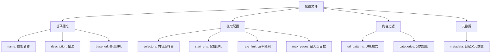
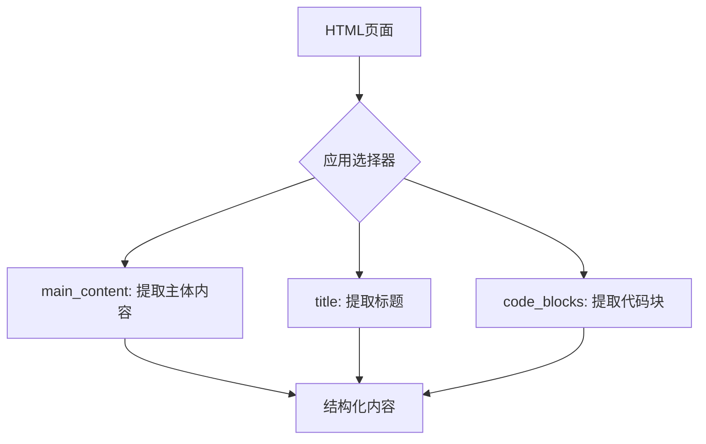
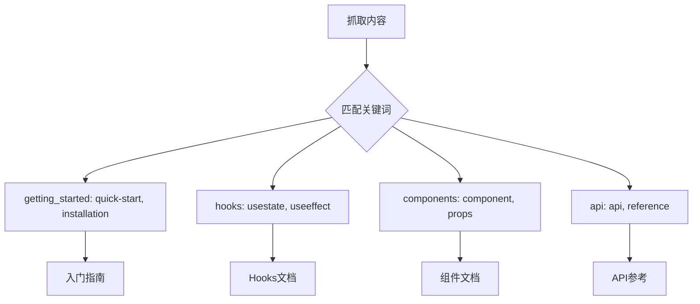
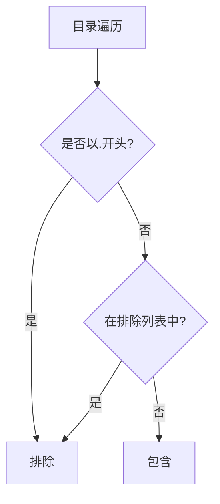
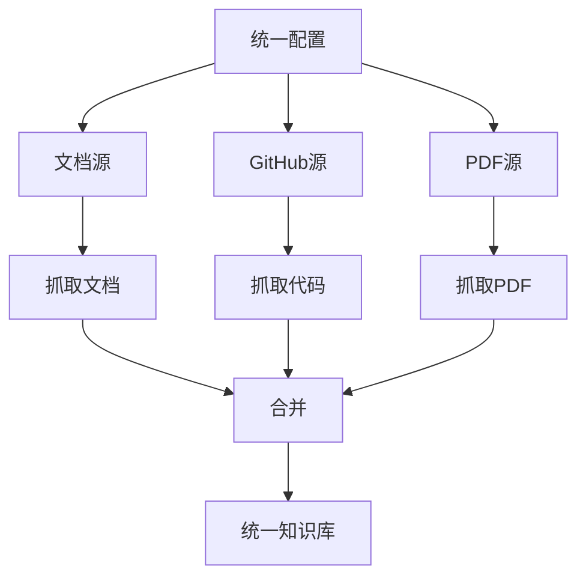
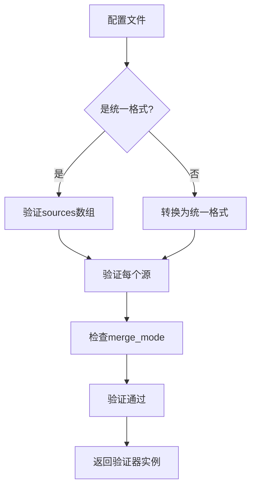
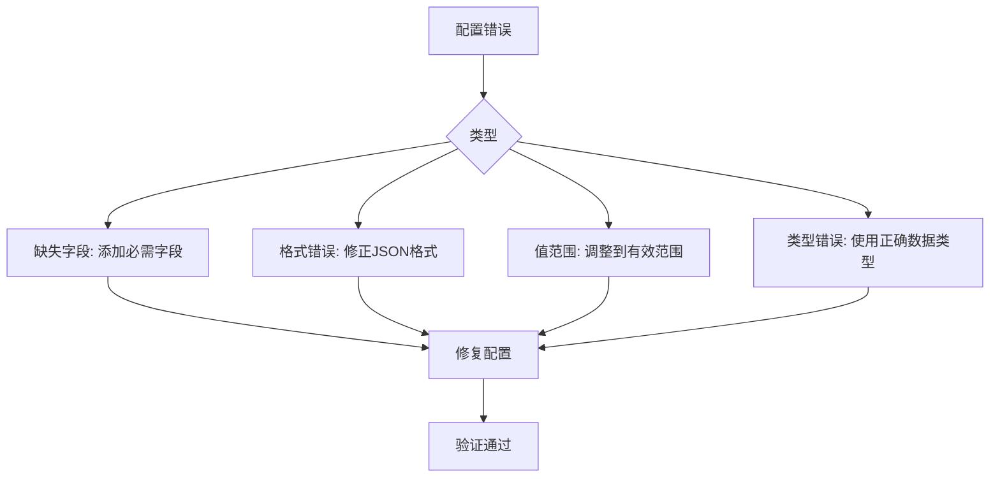
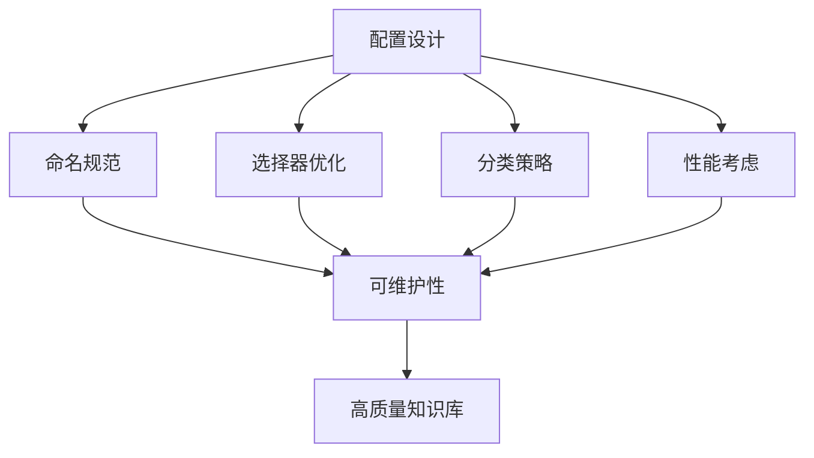

# 配置文件指南

<cite>
**本文档中引用的文件**  
- [react_unified.json](file://configs/react_unified.json)
- [react.json](file://configs/react.json)
- [config_validator.py](file://src/skill_seekers/cli/config_validator.py)
- [unified_scraper.py](file://src/skill_seekers/cli/unified_scraper.py)
- [split_config.py](file://src/skill_seekers/cli/split_config.py)
- [django_unified.json](file://configs/django_unified.json)
- [fastapi_unified.json](file://configs/fastapi_unified.json)
- [company-api.json](file://configs/example-team/company-api.json)
- [react-custom.json](file://configs/example-team/react-custom.json)
- [github_scraper.py](file://src/skill_seekers/cli/github_scraper.py)
- [test_excluded_dirs_config.py](file://tests/test_excluded_dirs_config.py)
</cite>

## 目录
1. [简介](#简介)
2. [配置文件结构](#配置文件结构)
3. [选择器配置](#选择器配置)
4. [分类规则](#分类规则)
5. [排除路径](#排除路径)
6. [统一抓取配置](#统一抓取配置)
7. [配置验证机制](#配置验证机制)
8. [常见配置错误与修复](#常见配置错误与修复)
9. [最佳实践](#最佳实践)

## 简介
配置文件是Skill Seekers系统的核心组成部分，用于定义如何抓取、组织和提取特定技术栈的知识。本指南详细说明了JSON配置文件的结构设计、关键配置项的语法和语义，以及如何通过实际示例创建有效的配置。

**Section sources**
- [react_unified.json](file://configs/react_unified.json)
- [react.json](file://configs/react.json)

## 配置文件结构
配置文件采用JSON格式，定义了抓取目标的基本信息、抓取范围、内容过滤和元数据提取规则。核心结构包括名称、描述、基础URL、选择器、URL模式、分类、速率限制和最大页面数等字段。



**Diagram sources**
- [react.json](file://configs/react.json#L1-L32)
- [company-api.json](file://configs/example-team/company-api.json#L1-L43)

**Section sources**
- [react.json](file://configs/react.json#L1-L32)
- [company-api.json](file://configs/example-team/company-api.json#L1-L43)

## 选择器配置
选择器（selectors）用于指定如何从网页中提取关键内容，包括主内容、标题和代码块。这些CSS选择器决定了抓取器从HTML文档中提取哪些部分。

### 主内容选择器
`main_content`选择器定义了页面主要内容的容器。例如，在React文档中，主内容位于`article`标签内：

```json
"selectors": {
  "main_content": "article",
  "title": "h1",
  "code_blocks": "pre code"
}
```

### 标题选择器
`title`选择器用于提取页面标题，通常对应HTML中的`h1`标签或`title`标签。

### 代码块选择器
`code_blocks`选择器识别页面中的代码示例，通常使用`pre code`来匹配包含代码的预格式化区域。



**Diagram sources**
- [react.json](file://configs/react.json#L13-L17)
- [vue.json](file://configs/vue.json#L13-L17)

**Section sources**
- [react.json](file://configs/react.json#L13-L17)
- [vue.json](file://configs/vue.json#L13-L17)

## 分类规则
分类规则（categories）用于将抓取的内容组织成逻辑分组，便于后续检索和使用。每个分类包含一组关键词，用于匹配URL或内容中的相关术语。

### 分类结构
```json
"categories": {
  "getting_started": ["quick-start", "installation", "tutorial"],
  "hooks": ["usestate", "useeffect", "usememo"],
  "components": ["component", "props", "jsx"],
  "state": ["state", "context", "reducer"],
  "api": ["api", "reference"]
}
```

### 分类应用示例
在React配置中，分类规则将文档内容分为入门、Hooks、组件等类别，使得用户可以快速定位到特定主题。



**Diagram sources**
- [react.json](file://configs/react.json#L22-L27)
- [godot.json](file://configs/godot.json#L32-L44)

**Section sources**
- [react.json](file://configs/react.json#L22-L27)
- [godot.json](file://configs/godot.json#L32-L44)

## 排除路径
排除路径配置允许用户指定哪些目录或文件应该在抓取过程中被忽略，这对于优化抓取效率和减少无关内容非常重要。

### 排除模式
系统支持两种排除模式：扩展模式和替换模式。

#### 扩展模式（exclude_dirs_additional）
在默认排除列表的基础上添加自定义排除目录：
```json
{
  "sources": [{
    "type": "github",
    "local_repo_path": "/path/to/repo",
    "exclude_dirs_additional": ["proprietary", "legacy", "third_party"]
  }]
}
```

#### 替换模式（exclude_dirs）
完全替换默认排除列表，仅使用指定的排除目录：
```json
{
  "sources": [{
    "type": "github",
    "local_repo_path": "/path/to/repo",
    "exclude_dirs": ["node_modules", ".git", "custom_vendor"]
  }]
}
```

### 默认排除列表
系统默认排除以下常见目录：
- `venv`, `node_modules`, `__pycache__`
- `.git`, `build`, `dist`
- `.pytest_cache`, `htmlcov`, `.tox`, `.mypy_cache`



**Diagram sources**
- [github_scraper.py](file://src/skill_seekers/cli/github_scraper.py#L90-L110)
- [test_excluded_dirs_config.py](file://tests/test_excluded_dirs_config.py#L1-L376)

**Section sources**
- [github_scraper.py](file://src/skill_seekers/cli/github_scraper.py#L90-L110)
- [test_excluded_dirs_config.py](file://tests/test_excluded_dirs_config.py#L1-L376)

## 统一抓取配置
统一抓取配置（unified config）是一种特殊结构，支持从多个源（文档、GitHub、PDF）抓取内容，并智能合并结果。

### 统一配置结构
```json
{
  "name": "react",
  "description": "Complete React knowledge base...",
  "merge_mode": "rule-based",
  "sources": [
    {
      "type": "documentation",
      "base_url": "https://react.dev/",
      "extract_api": true,
      "selectors": { ... },
      "url_patterns": { ... },
      "categories": { ... }
    },
    {
      "type": "github",
      "repo": "facebook/react",
      "include_issues": true,
      "include_code": true,
      "file_patterns": [
        "packages/react/src/**/*.js",
        "packages/react-dom/src/**/*.js"
      ]
    }
  ]
}
```

### 源类型
统一配置支持三种源类型：
- **documentation**: 从网站文档抓取
- **github**: 从GitHub仓库抓取
- **pdf**: 从PDF文档抓取

### 合并模式
`merge_mode`字段指定如何合并来自不同源的内容：
- `rule-based`: 基于规则的合并
- `claude-enhanced`: 使用Claude增强的智能合并



**Diagram sources**
- [react_unified.json](file://configs/react_unified.json#L1-L45)
- [django_unified.json](file://configs/django_unified.json#L1-L50)

**Section sources**
- [react_unified.json](file://configs/react_unified.json#L1-L45)
- [django_unified.json](file://configs/django_unified.json#L1-L50)

## 配置验证机制
配置验证器（config_validator.py）确保配置文件的正确性和完整性，提供详细的错误信息和修复建议。

### 验证流程
1. 检测配置格式（统一格式或传统格式）
2. 验证必需字段
3. 检查字段类型和值范围
4. 提供向后兼容性支持

### 验证规则
```python
class ConfigValidator:
    VALID_SOURCE_TYPES = {'documentation', 'github', 'pdf'}
    VALID_MERGE_MODES = {'rule-based', 'claude-enhanced'}
    VALID_DEPTH_LEVELS = {'surface', 'deep', 'full'}
```

### 验证示例


**Diagram sources**
- [config_validator.py](file://src/skill_seekers/cli/config_validator.py#L22-L377)
- [unified_scraper.py](file://src/skill_seekers/cli/unified_scraper.py#L26-L28)

**Section sources**
- [config_validator.py](file://src/skill_seekers/cli/config_validator.py#L22-L377)
- [unified_scraper.py](file://src/skill_seekers/cli/unified_scraper.py#L26-L28)

## 常见配置错误与修复
本节列出常见配置错误及其修复方法。

### 缺失必需字段
**错误**: 缺少`name`或`base_url`字段
```json
{
  "description": "Invalid config"
}
```
**修复**: 添加必需字段
```json
{
  "name": "valid-skill",
  "base_url": "https://example.com/"
}
```

### 无效URL格式
**错误**: URL缺少协议
```json
{
  "base_url": "example.com"
}
```
**修复**: 添加完整协议
```json
{
  "base_url": "https://example.com/"
}
```

### 选择器类型错误
**错误**: 选择器不是字典
```json
{
  "selectors": "invalid"
}
```
**修复**: 使用正确字典格式
```json
{
  "selectors": {
    "main_content": "article",
    "title": "h1"
  }
}
```

### 速率限制超出范围
**错误**: 速率限制过高
```json
{
  "rate_limit": 20
}
```
**修复**: 使用合理值
```json
{
  "rate_limit": 0.5
}
```



**Diagram sources**
- [test_config_validation.py](file://tests/test_config_validation.py#L1-L337)
- [config_validator.py](file://src/skill_seekers/cli/config_validator.py#L91-L112)

**Section sources**
- [test_config_validation.py](file://tests/test_config_validation.py#L1-L337)
- [config_validator.py](file://src/skill_seekers/cli/config_validator.py#L91-L112)

## 最佳实践
遵循以下最佳实践可创建高效且可靠的配置文件。

### 命名规范
- 使用小写字母和连字符
- 避免特殊字符
- 保持名称简洁明了

### 选择器优化
- 使用具体但不过于脆弱的选择器
- 测试选择器在不同页面的适用性
- 优先使用语义化标签

### 分类策略
- 创建有意义的分类
- 使用相关关键词
- 避免分类重叠

### 性能考虑
- 设置合理的`max_pages`
- 使用适当的`rate_limit`
- 利用`url_patterns`过滤无关内容



**Diagram sources**
- [react.json](file://configs/react.json)
- [split_config.py](file://src/skill_seekers/cli/split_config.py)

**Section sources**
- [react.json](file://configs/react.json)
- [split_config.py](file://src/skill_seekers/cli/split_config.py)