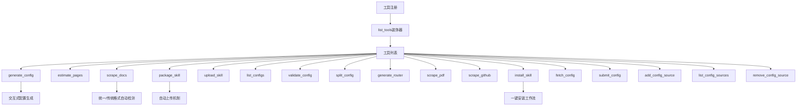
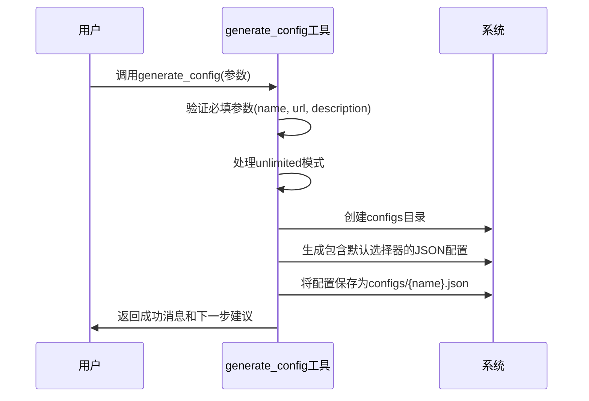
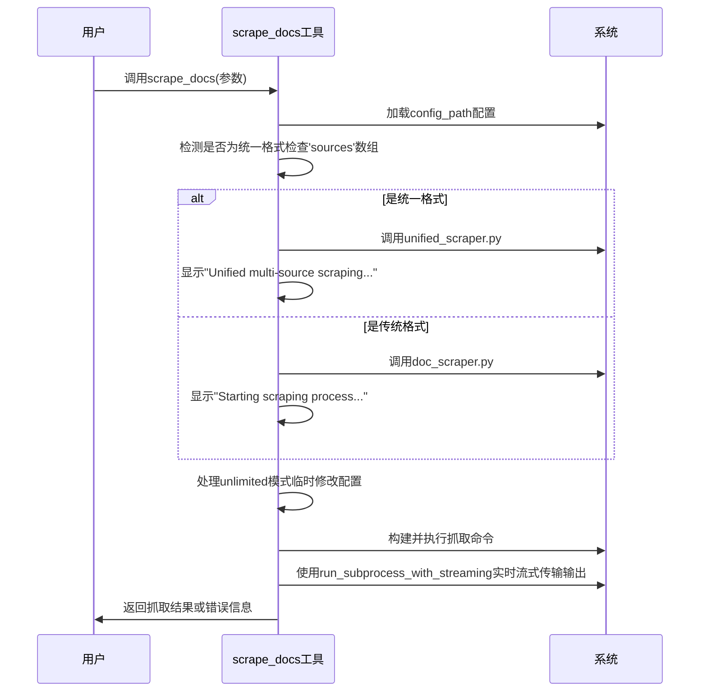
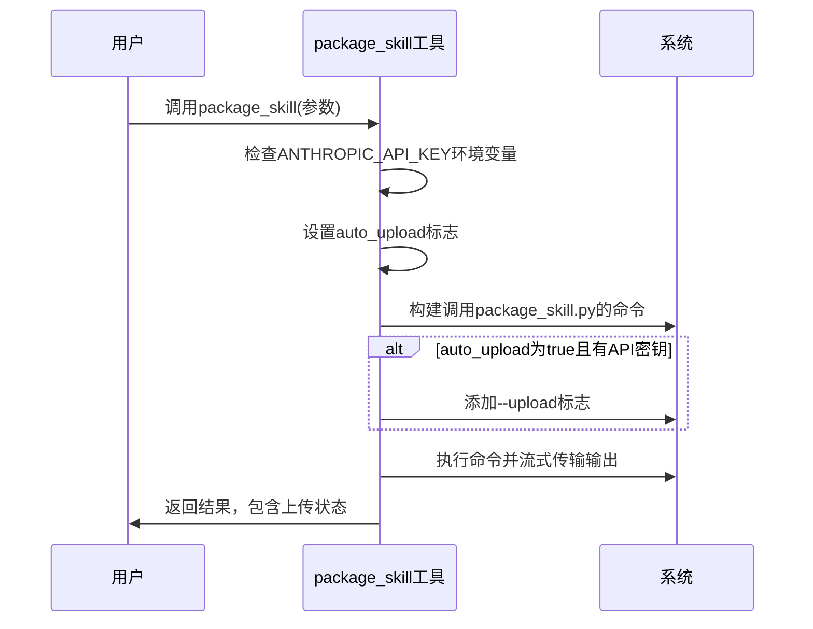
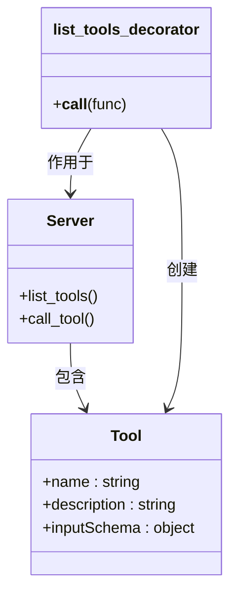
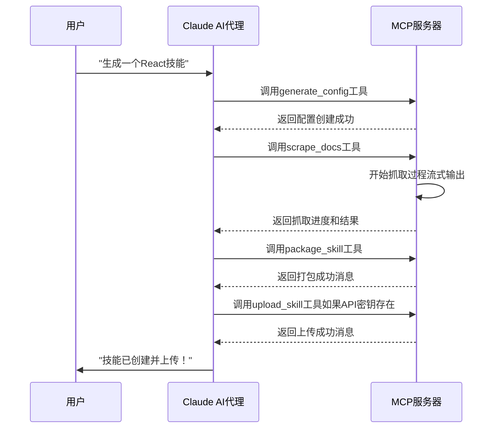

# MCP工具接口

<cite>
**本文档引用的文件**
- [mcp/server.py](file://src/skill_seekers/mcp/server.py)
- [mcp/__init__.py](file://src/skill_seekers/mcp/__init__.py)
- [example-mcp-config.json](file://example-mcp-config.json)
- [README.md](file://README.md)
- [MCP_SETUP.md](file://docs/MCP_SETUP.md)
- [TEST_MCP_IN_CLAUDE_CODE.md](file://docs/TEST_MCP_IN_CLAUDE_CODE.md)
- [UNIFIED_SCRAPING.md](file://docs/UNIFIED_SCRAPING.md)
- [cli/package_skill.py](file://src/skill_seekers/cli/package_skill.py)
- [cli/doc_scraper.py](file://src/skill_seekers/cli/doc_scraper.py)
- [cli/unified_scraper.py](file://src/skill_seekers/cli/unified_scraper.py)
- [cli/estimate_pages.py](file://src/skill_seekers/cli/estimate_pages.py)
- [cli/github_scraper.py](file://src/skill_seekers/cli/github_scraper.py)
</cite>

## 目录
1. [简介](#简介)
2. [MCP工具概览](#mcp工具概览)
3. [核心工具详解](#核心工具详解)
4. [工具注册与调用机制](#工具注册与调用机制)
5. [配置文件结构](#配置文件结构)
6. [与Claude AI代理的交互](#与claude-ai代理的交互)
7. [最佳实践与故障排除](#最佳实践与故障排除)

## 简介

MCP（Model Context Protocol）工具接口是Skill Seeker项目的核心组件，它为Claude AI代理提供了一套完整的工具集，用于自动化地将文档网站、GitHub仓库和PDF文件转换为高质量的Claude AI技能。该接口通过`list_tools`装饰器暴露18个功能工具，每个工具都通过`call_tool`函数进行路由和执行。用户可以通过自然语言与Claude Code交互，完成从配置生成、文档抓取到技能打包上传的完整工作流。

**Section sources**
- [mcp/__init__.py](file://src/skill_seekers/mcp/__init__.py#L1-L28)
- [README.md](file://README.md#L1-L15)

## MCP工具概览

MCP服务器提供了18个注册工具，涵盖了从配置管理、文档抓取、技能打包到高级功能的完整工作流。这些工具通过`list_tools`装饰器在MCP服务器中注册，并通过`call_tool`函数进行路由。



**Diagram sources**
- [mcp/server.py](file://src/skill_seekers/mcp/server.py#L131-L606)
- [mcp/__init__.py](file://src/skill_seekers/mcp/__init__.py#L9-L18)

**Section sources**
- [mcp/server.py](file://src/skill_seekers/mcp/server.py#L131-L606)
- [mcp/__init__.py](file://src/skill_seekers/mcp/__init__.py#L9-L18)

## 核心工具详解

### generate_config：交互式配置生成

`generate_config`工具用于为任何文档网站交互式地创建JSON配置文件。它通过参数化输入生成一个结构化的配置，为后续的抓取流程奠定基础。

**输入参数：**
- `name`：技能名称（小写，字母数字，连字符，下划线）
- `url`：基础文档URL（必须包含http://或https://）
- `description`：使用此技能的场景描述
- `max_pages`：要抓取的最大页面数（默认：100，-1表示无限制）
- `unlimited`：移除所有限制，抓取所有页面（默认：false）
- `rate_limit`：请求之间的延迟（秒，默认：0.5）

**输出格式：**
工具成功执行后，会返回一个包含配置文件路径和详细信息的文本响应，包括：
- 配置文件创建路径
- 技能名称、URL、页面限制和速率限制
- 下一步操作建议（审查配置、估算页面、抓取文档）

**调用逻辑：**


**Diagram sources**
- [mcp/server.py](file://src/skill_seekers/mcp/server.py#L136-L170)
- [mcp/server.py](file://src/skill_seekers/mcp/server.py#L655-L716)

### scrape_docs：统一/传统格式自动检测

`scrape_docs`工具是文档抓取的核心，它能够自动检测配置文件是统一格式还是传统格式，并相应地调用不同的抓取器。它还支持通过`llms.txt`文件进行10倍速处理。

**输入参数：**
- `config_path`：配置JSON文件的路径
- `unlimited`：移除页面限制（默认：false）
- `enhance_local`：为本地增强打开终端（默认：false）
- `skip_scrape`：跳过抓取，使用缓存数据（默认：false）
- `dry_run`：预览将要抓取的内容而不保存（默认：false）
- `merge_mode`：为统一配置覆盖合并模式

**输出格式：**
工具返回一个包含抓取进度和结果的文本内容。成功时，会显示：
- 抓取的页面数量
- 创建的类别数量
- 最终技能目录路径

**调用逻辑：**


**Diagram sources**
- [mcp/server.py](file://src/skill_seekers/mcp/server.py#L197-L232)
- [mcp/server.py](file://src/skill_seekers/mcp/server.py#L754-L868)
- [docs/UNIFIED_SCRAPING.md](file://docs/UNIFIED_SCRAPING.md#L442-L461)

### package_skill：自动上传机制

`package_skill`工具负责将技能目录打包成一个准备上传到Claude的.zip文件。其核心特性是当`ANTHROPIC_API_KEY`环境变量存在时，会自动尝试上传。

**输入参数：**
- `skill_dir`：技能目录的路径
- `auto_upload`：如果API密钥可用，尝试自动上传（默认：true）

**输出格式：**
工具返回一个包含打包和上传状态的文本响应。根据情况，可能包含：
- 成功打包的消息和.zip文件路径
- 自动上传成功的确认
- 由于缺少API密钥而无法自动上传的提示，以及手动上传说明
- 错误信息

**调用逻辑：**


**Diagram sources**
- [mcp/server.py](file://src/skill_seekers/mcp/server.py#L235-L251)
- [mcp/server.py](file://src/skill_seekers/mcp/server.py#L871-L927)
- [cli/package_skill.py](file://src/skill_seekers/cli/package_skill.py#L119-L216)

### 其他关键工具

#### estimate_pages
估算从配置中将抓取多少页面。这是一个快速预览，不会下载内容。

#### validate_config
验证配置文件是否存在错误。

#### list_configs
列出所有可用的预设配置。

#### split_config
将大型文档配置拆分为多个专注的技能。

#### generate_router
为拆分的文档生成路由器/中心技能。

#### install_skill
一个完整的自动化工作流：获取配置 → 抓取文档 → AI增强 → 打包 → 上传。

#### fetch_config
从API、git URL或注册源获取配置。

#### submit_config
提交自定义配置以供社区审查。

**Section sources**
- [mcp/server.py](file://src/skill_seekers/mcp/server.py#L131-L606)

## 工具注册与调用机制

MCP工具接口的核心是`list_tools`装饰器和`call_tool`函数，它们共同实现了工具的注册和路由。

### 工具注册机制

工具通过`list_tools`装饰器在MCP服务器中注册。该装饰器定义了一个`Tool`对象列表，每个对象都包含工具的名称、描述和输入模式（inputSchema）。



**Diagram sources**
- [mcp/server.py](file://src/skill_seekers/mcp/server.py#L131-L606)

### 调用路由机制

`call_tool`函数是所有工具调用的入口点。它接收工具名称和参数，并根据名称将调用路由到相应的具体实现函数。

```mermaid
flowchart TD
Start([call_tool(name, arguments)]) --> Switch{根据name判断}
Switch --> |generate_config| CallGenerate[调用generate_config_tool]
Switch --> |estimate_pages| CallEstimate[调用estimate_pages_tool]
Switch --> |scrape_docs| CallScrape[调用scrape_docs_tool]
Switch --> |package_skill| CallPackage[调用package_skill_tool]
Switch --> |upload_skill| CallUpload[调用upload_skill_tool]
Switch --> |其他工具| CallOther[调用相应工具函数]
CallGenerate --> Return[返回TextContent列表]
CallEstimate --> Return
CallScrape --> Return
CallPackage --> Return
CallUpload --> Return
CallOther --> Return
Return --> End([函数结束])
```

**Diagram sources**
- [mcp/server.py](file://src/skill_seekers/mcp/server.py#L609-L649)

## 配置文件结构

`example-mcp-config.json`文件定义了MCP服务器的启动配置，特别是为Claude Code设置。

### 结构解析

```json
{
  "mcpServers": {
    "skill-seeker": {
      "command": "python3",
      "args": [
        "/path/to/Skill_Seekers/mcp/server.py"
      ],
      "cwd": "/path/to/Skill_Seekers"
    }
  }
}
```

- `mcpServers`：定义可用的MCP服务器。
- `skill-seeker`：服务器的名称，用于在Claude Code中引用。
- `command`：启动服务器的命令（通常是`python3`）。
- `args`：传递给命令的参数列表，即MCP服务器脚本的路径。
- `cwd`：服务器的工作目录，确保脚本在正确的上下文中运行。

### 配置项说明

| 配置项 | 说明 |
| :--- | :--- |
| `command` | 启动MCP服务器的可执行命令 |
| `args` | 命令行参数，指向`server.py`脚本 |
| `cwd` | 工作目录，必须是项目根目录，以确保相对路径正确 |

**Section sources**
- [example-mcp-config.json](file://example-mcp-config.json#L1-L12)
- [MCP_SETUP.md](file://docs/MCP_SETUP.md#L127-L144)

## 与Claude AI代理的交互

MCP工具接口允许用户通过自然语言与Claude AI代理进行交互，完成复杂的技能创建任务。

### 自然语言交互示例

用户可以在Claude Code中使用自然语言命令，例如：

```
生成一个React技能，从https://react.dev/开始
抓取PDF文档docs/manual.pdf并创建技能
列出所有可用的配置
```

### 工具调用完整生命周期



### 错误处理

系统内置了全面的错误处理机制。如果在`call_tool`函数中发生异常，它会捕获该异常并返回一个包含错误信息的`TextContent`对象，确保MCP会话不会因单个工具的失败而中断。

**Section sources**
- [mcp/server.py](file://src/skill_seekers/mcp/server.py#L650-L653)
- [TEST_MCP_IN_CLAUDE_CODE.md](file://docs/TEST_MCP_IN_CLAUDE_CODE.md#L204-L228)

## 最佳实践与故障排除

### 最佳实践

1. **使用`install_skill`工具**：对于新用户，推荐使用`install_skill`工具，它提供了一键式自动化工作流。
2. **先估算再抓取**：在抓取大型文档前，使用`estimate_pages`工具预估页面数量，以避免意外的长时间运行。
3. **验证配置**：在抓取前使用`validate_config`工具检查配置文件的有效性。

### 故障排除

- **MCP服务器未加载**：检查`~/.config/claude-code/mcp.json`文件中的路径是否正确，并确保已完全重启Claude Code。
- **模块未找到**：确保已安装`mcp`包（`pip install mcp`）。
- **权限被拒绝**：确保`server.py`脚本具有可执行权限（`chmod +x mcp/server.py`）。

**Section sources**
- [MCP_SETUP.md](file://docs/MCP_SETUP.md#L297-L391)
- [TEST_MCP_IN_CLAUDE_CODE.md](file://docs/TEST_MCP_IN_CLAUDE_CODE.md#L231-L276)