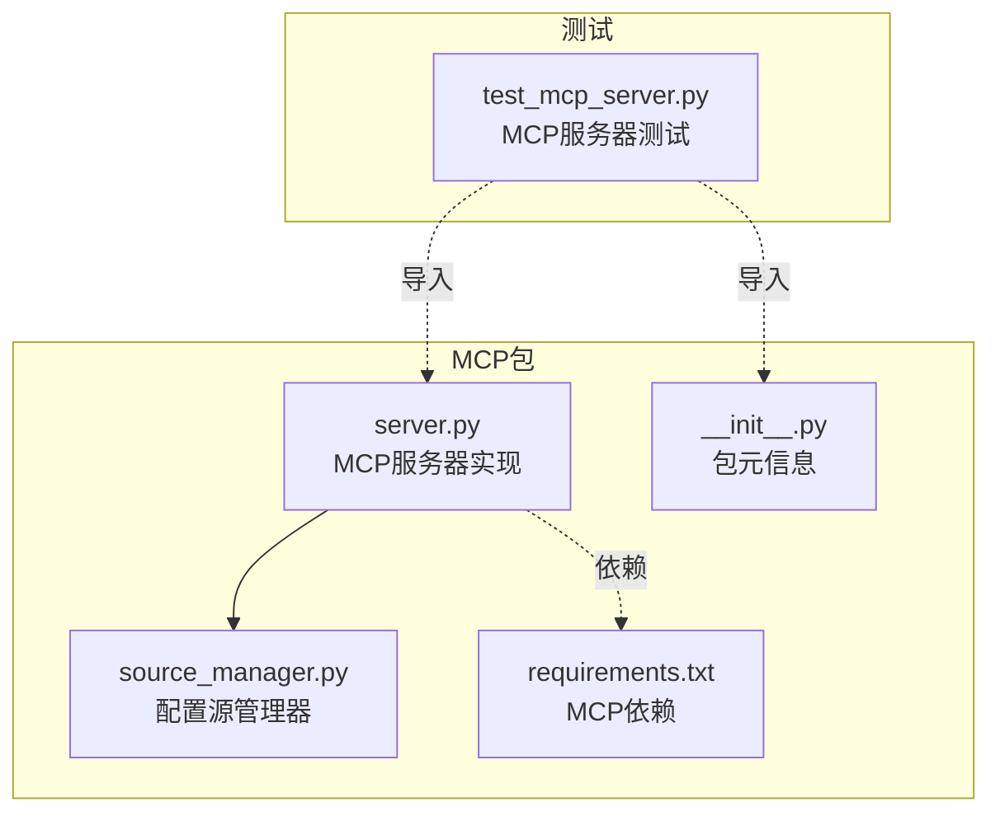
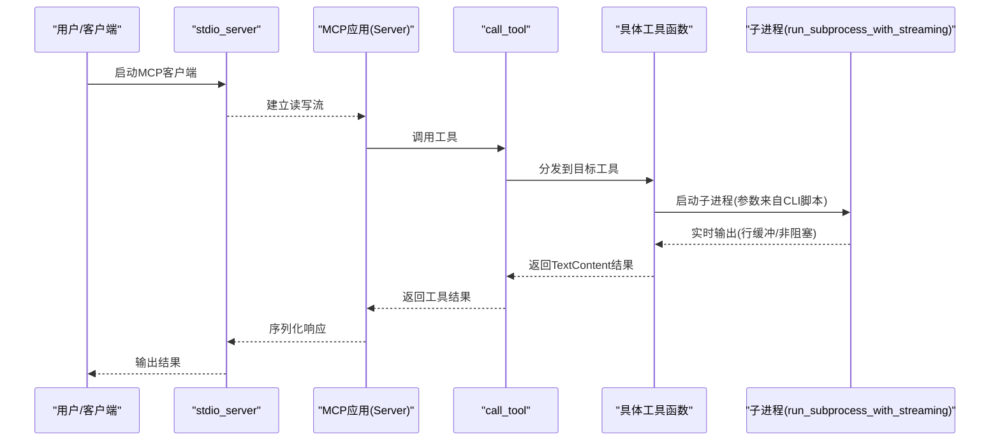
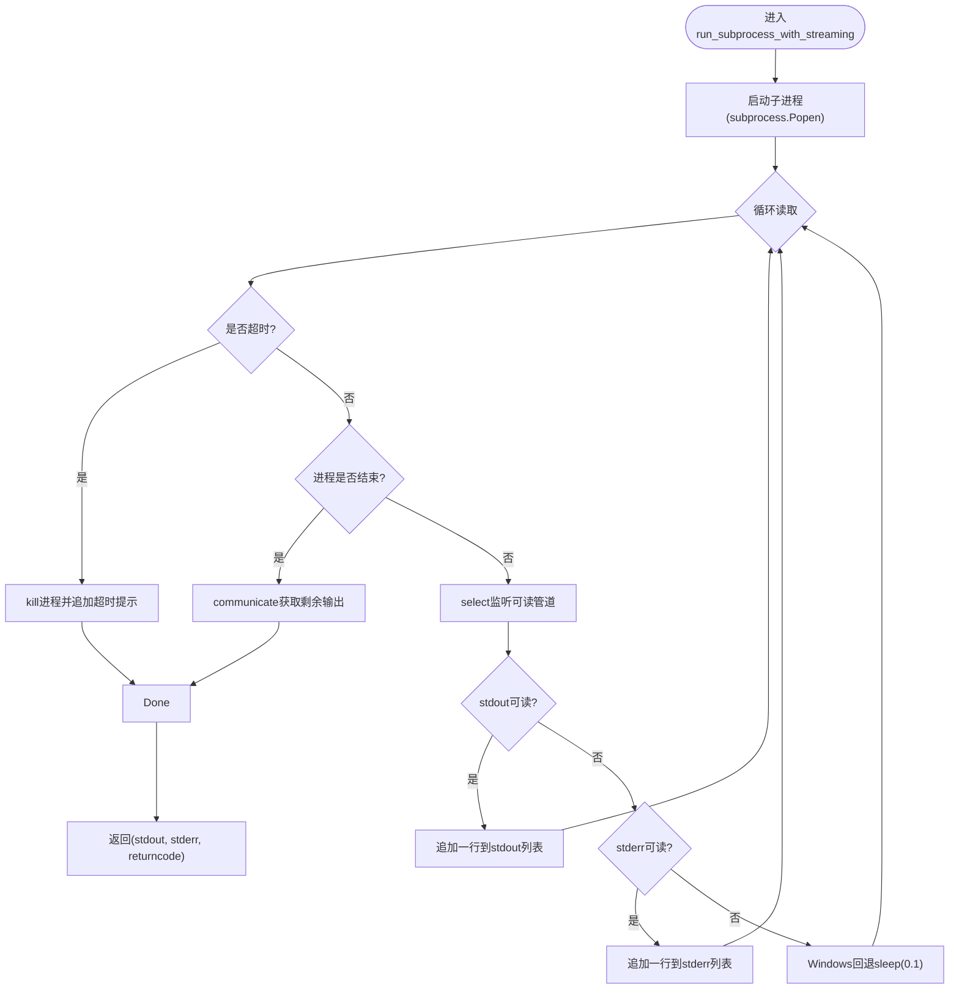
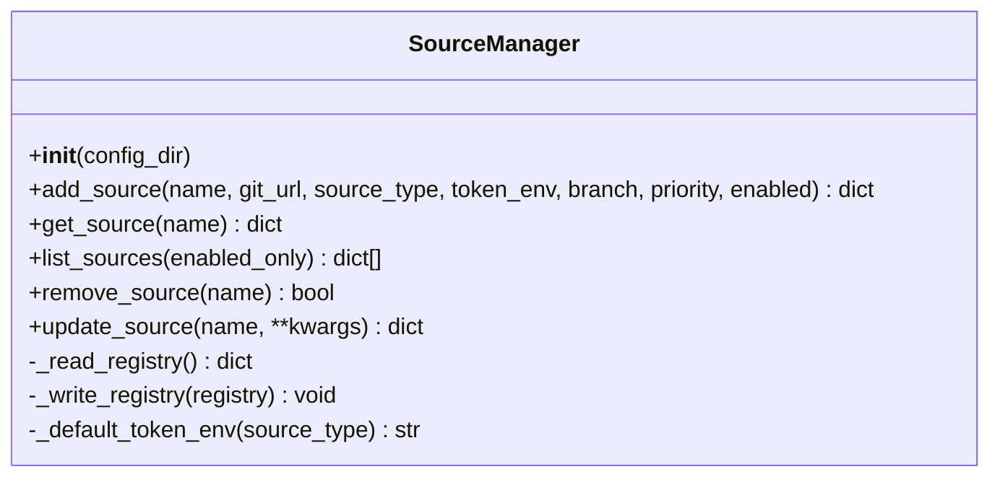
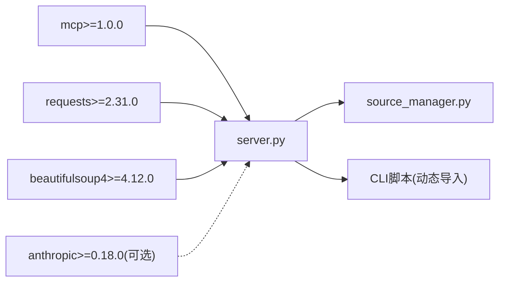

# MCP服务器实现

<cite>
**本文引用的文件**
- [server.py](file://src/skill_seekers/mcp/server.py)
- [__init__.py](file://src/skill_seekers/mcp/__init__.py)
- [source_manager.py](file://src/skill_seekers/mcp/source_manager.py)
- [requirements.txt](file://src/skill_seekers/mcp/requirements.txt)
- [test_mcp_server.py](file://tests/test_mcp_server.py)
</cite>

## 目录
1. [简介](#简介)
2. [项目结构](#项目结构)
3. [核心组件](#核心组件)
4. [架构总览](#架构总览)
5. [详细组件分析](#详细组件分析)
6. [依赖关系分析](#依赖关系分析)
7. [性能考虑](#性能考虑)
8. [故障排查指南](#故障排查指南)
9. [结论](#结论)

## 简介
本文件面向MCP（Model Context Protocol）服务器实现，聚焦于src/skill_seekers/mcp/server.py中的核心类与函数，系统性阐述以下主题：
- Server类的初始化与事件循环集成方式
- safe_decorator如何在MCP依赖缺失时进行优雅降级
- run_subprocess_with_streaming如何使用select实现非阻塞子进程输出流式传输
- 服务器启动流程：依赖检查、CLI目录导入路径设置、应用实例化
- 错误处理策略（尤其是ImportError时的用户友好提示）
- 性能优化建议（超时配置、资源管理）

## 项目结构
MCP服务器位于src/skill_seekers/mcp目录，核心入口为server.py，提供多个工具函数供MCP客户端调用；同时包含SourceManager用于管理自定义配置源注册表；requirements.txt声明了mcp等依赖。

图表来源
- [server.py](file://src/skill_seekers/mcp/server.py#L1-L120)
- [source_manager.py](file://src/skill_seekers/mcp/source_manager.py#L1-L120)
- [__init__.py](file://src/skill_seekers/mcp/__init__.py#L1-L28)
- [requirements.txt](file://src/skill_seekers/mcp/requirements.txt#L1-L10)
- [test_mcp_server.py](file://tests/test_mcp_server.py#L1-L60)

章节来源
- [server.py](file://src/skill_seekers/mcp/server.py#L1-L120)
- [__init__.py](file://src/skill_seekers/mcp/__init__.py#L1-L28)
- [requirements.txt](file://src/skill_seekers/mcp/requirements.txt#L1-L10)

## 核心组件
- MCP可用性检测与应用实例化
  - 在模块顶部尝试导入外部mcp包，并在失败时给出明确安装提示；仅当可用时才实例化Server对象。
  - 关键路径参考：[MCP可用性检测与应用实例化](file://src/skill_seekers/mcp/server.py#L18-L40)

- 安全装饰器safe_decorator
  - 当MCP不可用或app为None时，返回“无操作”装饰器，确保工具函数仍可被调用但不绑定到MCP生命周期。
  - 关键路径参考：[safe_decorator定义](file://src/skill_seekers/mcp/server.py#L50-L60)

- 子进程流式执行run_subprocess_with_streaming
  - 使用subprocess.Popen以行缓冲模式启动子进程，结合select实现非阻塞读取；支持超时终止与Windows回退逻辑。
  - 关键路径参考：[run_subprocess_with_streaming实现](file://src/skill_seekers/mcp/server.py#L62-L129)

- 工具函数与路由
  - list_tools：列举所有可用工具；call_tool：根据名称路由到具体工具实现。
  - 关键路径参考：[list_tools](file://src/skill_seekers/mcp/server.py#L131-L607)、[call_tool](file://src/skill_seekers/mcp/server.py#L609-L653)

- 启动入口main与STDIO集成
  - 通过mcp.server.stdio.stdio_server建立STDIO通道，将app.run接入异步事件循环。
  - 关键路径参考：[main入口](file://src/skill_seekers/mcp/server.py#L2183-L2200)

章节来源
- [server.py](file://src/skill_seekers/mcp/server.py#L18-L129)
- [server.py](file://src/skill_seekers/mcp/server.py#L131-L653)
- [server.py](file://src/skill_seekers/mcp/server.py#L2183-L2200)

## 架构总览
下图展示MCP服务器从启动到工具执行的关键交互：依赖检查、STDIO通道、工具路由与子进程流式执行。

图表来源
- [server.py](file://src/skill_seekers/mcp/server.py#L2183-L2200)
- [server.py](file://src/skill_seekers/mcp/server.py#L609-L653)
- [server.py](file://src/skill_seekers/mcp/server.py#L62-L129)

## 详细组件分析

### Server初始化与事件循环集成
- 初始化阶段
  - 检测mcp包是否可用；若不可用则打印清晰的安装提示并退出。
  - 只有在MCP可用时才实例化Server(app)，否则app为None。
  - 关键路径参考：[MCP可用性检测与应用实例化](file://src/skill_seekers/mcp/server.py#L18-L40)

- 事件循环集成
  - 通过mcp.server.stdio.stdio_server建立STDIO通道，将app.run与初始化选项绑定到异步事件循环。
  - 关键路径参考：[main入口与STDIO集成](file://src/skill_seekers/mcp/server.py#L2183-L2200)

- CLI目录导入路径设置
  - 将CLI目录加入sys.path，以便动态导入CLI侧工具（如config_validator、各脚本）。
  - 关键路径参考：[CLI目录导入路径设置](file://src/skill_seekers/mcp/server.py#L40-L50)

章节来源
- [server.py](file://src/skill_seekers/mcp/server.py#L18-L40)
- [server.py](file://src/skill_seekers/mcp/server.py#L40-L50)
- [server.py](file://src/skill_seekers/mcp/server.py#L2183-L2200)

### safe_decorator：MCP依赖缺失时的优雅降级
- 设计目的
  - 当MCP不可用或app为None时，safe_decorator返回“无操作”装饰器，使工具函数仍可被调用，避免因装饰器缺失导致的异常。
- 行为特征
  - 若MCP可用且app存在，则返回原装饰器；否则返回直接返回原函数的装饰器。
- 使用场景
  - list_tools与call_tool均通过safe_decorator包装，确保在无MCP环境下仍可运行。
- 关键路径参考：[safe_decorator定义与使用](file://src/skill_seekers/mcp/server.py#L50-L60)、[list_tools装饰器](file://src/skill_seekers/mcp/server.py#L131-L132)、[call_tool装饰器](file://src/skill_seekers/mcp/server.py#L609-L610)

章节来源
- [server.py](file://src/skill_seekers/mcp/server.py#L50-L60)
- [server.py](file://src/skill_seekers/mcp/server.py#L131-L132)
- [server.py](file://src/skill_seekers/mcp/server.py#L609-L610)

### run_subprocess_with_streaming：非阻塞子进程输出流式传输
- 功能概述
  - 以行缓冲模式启动子进程，实时读取stdout/stderr，避免长时间运行任务导致MCP“假死”。
- 非阻塞机制
  - 使用select.select监听管道可读事件，按0.1秒间隔轮询；Windows平台无select时回退sleep(0.1)。
- 超时控制
  - 支持可选timeout参数；超时后主动kill进程并追加提示信息。
- 错误处理
  - 异常捕获并返回空stdout与错误消息，保证上层调用稳定。
- 关键路径参考：[run_subprocess_with_streaming实现](file://src/skill_seekers/mcp/server.py#L62-L129)

图表来源
- [server.py](file://src/skill_seekers/mcp/server.py#L62-L129)

章节来源
- [server.py](file://src/skill_seekers/mcp/server.py#L62-L129)

### 工具函数与路由
- list_tools
  - 列举全部可用工具，返回Tool对象列表；每个工具包含名称、描述与输入schema。
  - 关键路径参考：[list_tools实现](file://src/skill_seekers/mcp/server.py#L131-L607)

- call_tool
  - 根据工具名分发到对应工具函数；异常统一捕获并返回错误文本。
  - 关键路径参考：[call_tool实现](file://src/skill_seekers/mcp/server.py#L609-L653)

- 典型工具示例（节选）
  - estimate_pages_tool：估算页数，调用CLI脚本并通过run_subprocess_with_streaming流式输出。
  - scrape_docs_tool：根据配置格式选择不同脚本，支持unlimited模式与临时配置生成。
  - package_skill_tool/upload_skill_tool：打包与上传技能，自动判断API密钥并提示手动上传路径。
  - fetch_config_tool：支持命名源、Git URL与API三种模式，统一下载配置并保存。
  - install_skill_tool：完整工作流编排，包含获取配置、抓取文档、AI增强、打包与上传。
  - 关键路径参考：
    - [estimate_pages_tool](file://src/skill_seekers/mcp/server.py#L719-L752)
    - [scrape_docs_tool](file://src/skill_seekers/mcp/server.py#L754-L869)
    - [package_skill_tool](file://src/skill_seekers/mcp/server.py#L871-L930)
    - [upload_skill_tool](file://src/skill_seekers/mcp/server.py#L932-L957)
    - [fetch_config_tool](file://src/skill_seekers/mcp/server.py#L1253-L1503)
    - [install_skill_tool](file://src/skill_seekers/mcp/server.py#L1505-L1808)

章节来源
- [server.py](file://src/skill_seekers/mcp/server.py#L131-L653)
- [server.py](file://src/skill_seekers/mcp/server.py#L719-L957)
- [server.py](file://src/skill_seekers/mcp/server.py#L1253-L1808)

### 配置源管理器SourceManager
- 职责
  - 维护用户注册的配置源（Git仓库），提供增删改查、优先级排序与原子写入。
- 关键能力
  - 添加/更新源(add_source/update_source)
  - 获取源(get_source)
  - 列出源(list_sources)
  - 删除源(remove_source)
  - 原子写入_registry_file，避免损坏
- 关键路径参考：[SourceManager类](file://src/skill_seekers/mcp/source_manager.py#L1-L294)

图表来源
- [source_manager.py](file://src/skill_seekers/mcp/source_manager.py#L1-L294)

章节来源
- [source_manager.py](file://src/skill_seekers/mcp/source_manager.py#L1-L294)

## 依赖关系分析
- 外部依赖
  - mcp>=1.0.0：MCP协议实现与STDIO通道
  - requests/beautifulsoup4>=4.12.0：通用网络与解析库
  - anthropic>=0.18.0（可选）：API增强功能
- 内部依赖
  - CLI目录sys.path插入，动态导入各工具脚本
  - SourceManager用于fetch_config_tool的源管理
- 关键路径参考：
  - [requirements.txt](file://src/skill_seekers/mcp/requirements.txt#L1-L10)
  - [CLI目录导入路径设置](file://src/skill_seekers/mcp/server.py#L40-L50)
  - [fetch_config_tool中SourceManager使用](file://src/skill_seekers/mcp/server.py#L1253-L1337)

图表来源
- [requirements.txt](file://src/skill_seekers/mcp/requirements.txt#L1-L10)
- [server.py](file://src/skill_seekers/mcp/server.py#L40-L50)
- [server.py](file://src/skill_seekers/mcp/server.py#L1253-L1337)

章节来源
- [requirements.txt](file://src/skill_seekers/mcp/requirements.txt#L1-L10)
- [server.py](file://src/skill_seekers/mcp/server.py#L40-L50)
- [server.py](file://src/skill_seekers/mcp/server.py#L1253-L1337)

## 性能考虑
- 超时配置
  - estimate_pages_tool：基于最大发现页数计算超时，最小5分钟；unlimited模式默认30分钟。
  - scrape_docs_tool：根据配置页数估算超时，最小1小时；unlimited模式禁用超时。
  - package_skill_tool/upload_skill_tool：固定5分钟超时。
  - split_config_tool/generate_router_tool：固定5分钟超时。
  - scrape_pdf_tool/scrape_github_tool：固定10分钟超时。
  - 关键路径参考：
    - [estimate_pages_tool超时计算](file://src/skill_seekers/mcp/server.py#L719-L752)
    - [scrape_docs_tool超时计算](file://src/skill_seekers/mcp/server.py#L823-L847)
    - [package_skill_tool超时](file://src/skill_seekers/mcp/server.py#L893-L900)
    - [upload_skill_tool超时](file://src/skill_seekers/mcp/server.py#L943-L948)
    - [split_config_tool/generate_router_tool超时](file://src/skill_seekers/mcp/server.py#L1096-L1101)
    - [scrape_pdf_tool/scrape_github_tool超时](file://src/skill_seekers/mcp/server.py#L1178-L1183)

- 资源管理
  - unlimited模式会生成临时配置并在完成后清理，避免磁盘残留。
  - SourceManager采用原子写入，避免registry损坏。
  - 关键路径参考：
    - [临时配置清理](file://src/skill_seekers/mcp/server.py#L858-L861)
    - [SourceManager原子写入](file://src/skill_seekers/mcp/source_manager.py#L254-L273)

- I/O与并发
  - run_subprocess_with_streaming使用select实现非阻塞I/O，Windows回退sleep(0.1)；建议在Linux/macOS平台使用以获得更好的实时输出体验。
  - 关键路径参考：[run_subprocess_with_streaming](file://src/skill_seekers/mcp/server.py#L62-L129)

章节来源
- [server.py](file://src/skill_seekers/mcp/server.py#L719-L869)
- [server.py](file://src/skill_seekers/mcp/server.py#L871-L957)
- [server.py](file://src/skill_seekers/mcp/server.py#L1077-L1191)
- [server.py](file://src/skill_seekers/mcp/server.py#L1194-L1251)
- [source_manager.py](file://src/skill_seekers/mcp/source_manager.py#L254-L273)

## 故障排查指南
- ImportError：mcp包未安装
  - 现象：模块导入阶段直接打印错误并退出。
  - 处理：安装mcp依赖后重试。
  - 关键路径参考：[MCP导入异常处理](file://src/skill_seekers/mcp/server.py#L25-L35)

- ImportError：ConfigValidator未找到
  - 现象：在某些工具中动态导入CLI验证器失败。
  - 处理：确认CLI目录存在且包含config_validator.py。
  - 关键路径参考：[ConfigValidator导入与降级](file://src/skill_seekers/mcp/server.py#L44-L49)

- 子进程超时
  - 现象：长时间运行任务被强制终止并提示超时。
  - 处理：调整配置（如unlimited）或增加等待时间；关注工具超时设置。
  - 关键路径参考：[run_subprocess_with_streaming超时逻辑](file://src/skill_seekers/mcp/server.py#L86-L91)

- API错误（fetch_config_tool）
  - 现象：HTTP错误、JSON解析错误或未知异常。
  - 处理：检查网络连接、API可达性与参数合法性。
  - 关键路径参考：[fetch_config_tool异常处理](file://src/skill_seekers/mcp/server.py#L1497-L1503)

- 测试环境差异
  - 现象：测试中为避免本地mcp目录遮蔽已安装包，采用临时切换工作目录导入mcp。
  - 处理：生产环境无需此绕过；测试需正确设置sys.path。
  - 关键路径参考：[测试导入绕过](file://tests/test_mcp_server.py#L17-L33)

章节来源
- [server.py](file://src/skill_seekers/mcp/server.py#L25-L35)
- [server.py](file://src/skill_seekers/mcp/server.py#L44-L49)
- [server.py](file://src/skill_seekers/mcp/server.py#L86-L91)
- [server.py](file://src/skill_seekers/mcp/server.py#L1497-L1503)
- [test_mcp_server.py](file://tests/test_mcp_server.py#L17-L33)

## 结论
本实现以安全装饰器与子进程流式执行为核心，兼顾MCP依赖缺失时的优雅降级与长时间任务的非阻塞输出。通过合理的超时配置与资源清理策略，服务器在复杂抓取与打包场景中保持稳定与可观的用户体验。建议在生产环境中：
- 明确设置超时阈值，避免无限等待
- 使用unlimited模式时谨慎评估资源消耗
- 在Linux/macOS平台部署以获得最佳流式输出体验
- 通过SourceManager维护团队私有配置源，提升复用与协作效率