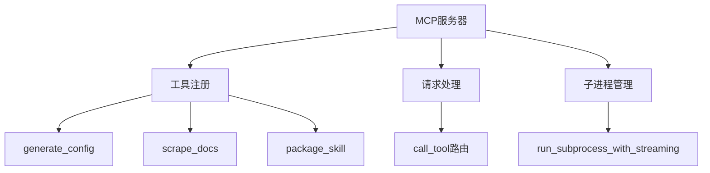
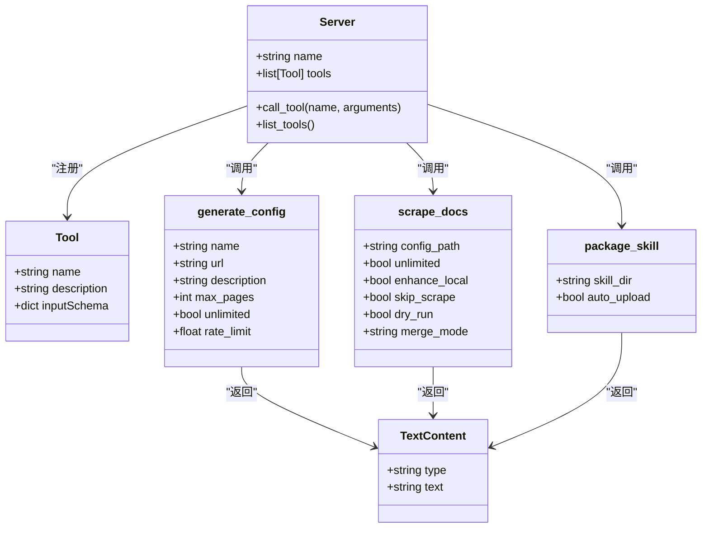
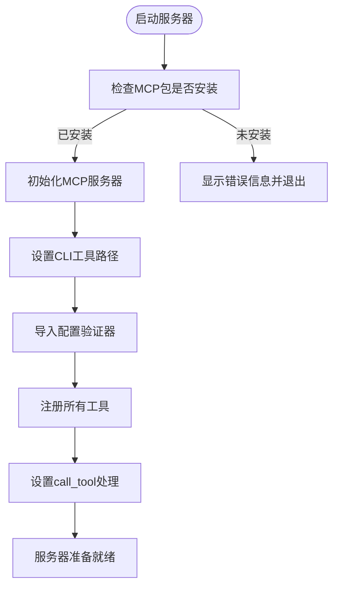
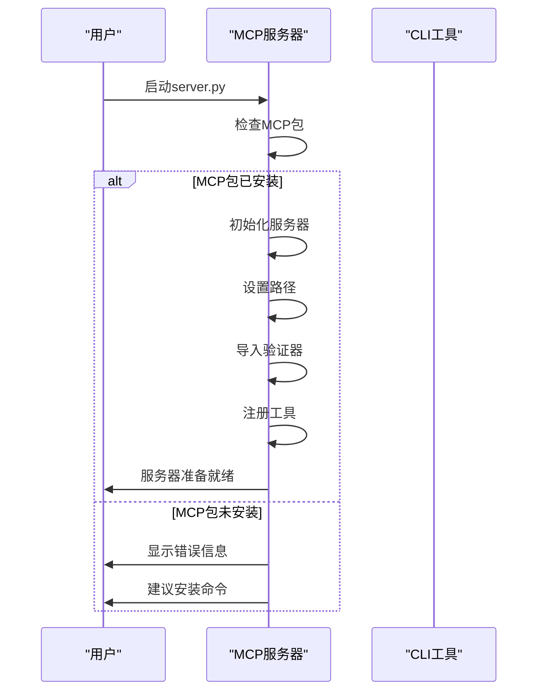
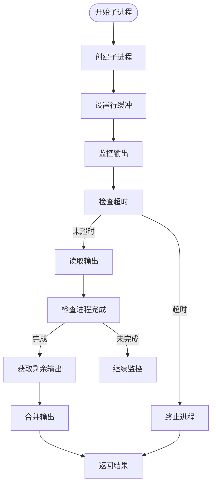
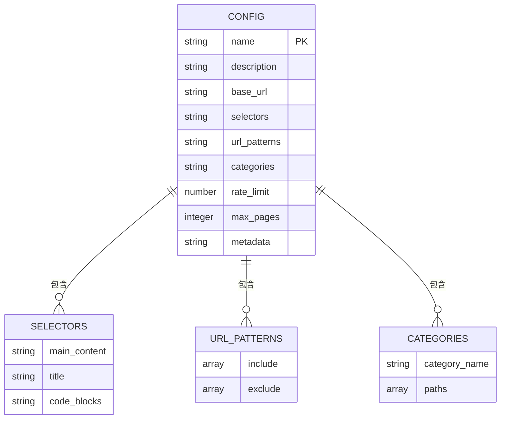
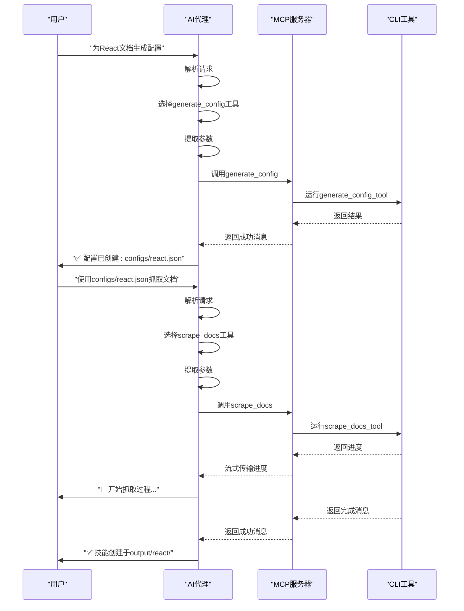
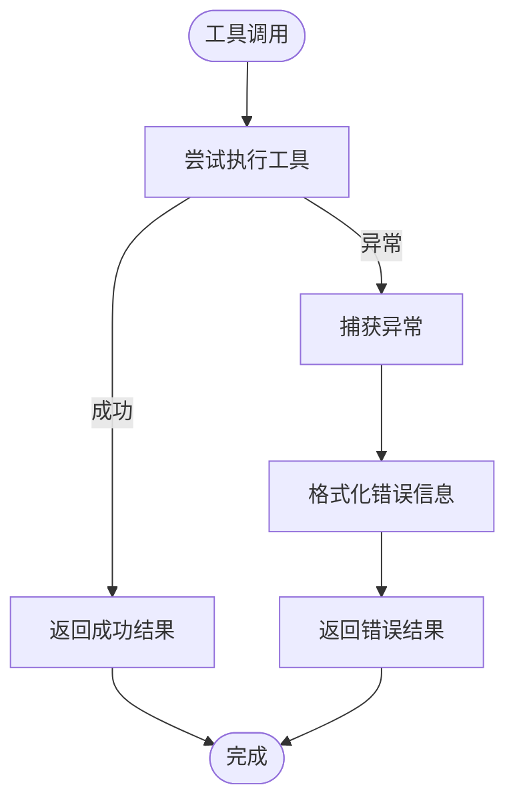

# MCP集成

<cite>
**本文档引用的文件**   
- [server.py](file://src/skill_seekers/mcp/server.py)
- [example-mcp-config.json](file://example-mcp-config.json)
- [package_skill.py](file://src/skill_seekers/cli/package_skill.py)
- [doc_scraper.py](file://src/skill_seekers/cli/doc_scraper.py)
- [unified_scraper.py](file://src/skill_seekers/cli/unified_scraper.py)
- [git_repo.py](file://src/skill_seekers/mcp/git_repo.py)
- [source_manager.py](file://src/skill_seekers/mcp/source_manager.py)
- [setup_mcp.sh](file://setup_mcp.sh)
- [MCP_SETUP.md](file://docs/MCP_SETUP.md)
- [react-custom.json](file://configs/example-team/react-custom.json)
- [vue-internal.json](file://configs/example-team/vue-internal.json)
</cite>

## 目录
1. [MCP服务器实现](#mcp服务器实现)
2. [MCP工具注册机制](#mcp工具注册机制)
3. [MCP服务器启动流程](#mcp服务器启动流程)
4. [异步处理机制](#异步处理机制)
5. [MCP工具配置文件](#mcp工具配置文件)
6. [与AI代理的自然语言交互](#与ai代理的自然语言交互)
7. [错误处理策略](#错误处理策略)
8. [性能优化建议](#性能优化建议)

## MCP服务器实现

MCP（Model Context Protocol）服务器是Skill Seekers项目的核心组件，它通过`server.py`文件实现了一个本地服务器功能，允许Claude等AI代理通过自然语言命令与系统进行交互。该服务器基于MCP协议构建，提供了一套完整的工具集来生成、验证、抓取和打包AI技能。

服务器的实现遵循了模块化设计原则，通过`safe_decorator`装饰器确保在MCP包不可用时能够优雅降级，而不是直接崩溃。服务器初始化时会检查`mcp`包的可用性，并根据检查结果决定是否创建服务器实例。这种设计使得系统在不同环境下都能稳定运行。

服务器的主要功能是通过`list_tools`函数注册一系列工具，这些工具涵盖了从配置生成到技能打包的完整工作流。每个工具都定义了详细的输入参数和输出格式，使得AI代理能够准确理解和使用这些功能。



**Diagram sources**
- [server.py](file://src/skill_seekers/mcp/server.py#L1-L2201)

**Section sources**
- [server.py](file://src/skill_seekers/mcp/server.py#L1-L2201)

## MCP工具注册机制

MCP服务器提供了18个工具的注册机制，这些工具覆盖了从配置生成到技能部署的完整生命周期。每个工具都通过`Tool`对象进行定义，包含名称、描述和输入参数模式。

### 工具列表和功能

| 工具名称 | 描述 | 输入参数 |
|---------|------|---------|
| generate_config | 生成文档抓取的配置文件 | name, url, description, max_pages, unlimited, rate_limit |
| estimate_pages | 估计将抓取的页面数量 | config_path, max_discovery, unlimited |
| scrape_docs | 抓取文档并构建Claude技能 | config_path, unlimited, enhance_local, skip_scrape, dry_run, merge_mode |
| package_skill | 将技能目录打包成准备上传的.zip文件 | skill_dir, auto_upload |
| upload_skill | 自动将技能.zip文件上传到Claude | skill_zip |
| list_configs | 列出所有可用的预设配置 | 无 |
| validate_config | 验证配置文件是否有错误 | config_path |
| split_config | 将大型文档配置拆分为多个专注的技能 | config_path, strategy, target_pages, dry_run |
| generate_router | 为拆分的文档生成路由器/中心技能 | config_pattern, router_name |
| scrape_pdf | 抓取PDF文档并构建Claude技能 | config_path, pdf_path, name, description, from_json |
| scrape_github | 抓取GitHub仓库并构建Claude技能 | repo, config_path, name, description, token, no_issues, no_changelog, no_releases, max_issues, scrape_only |
| install_skill | 完整的一键式工作流 | config_name, config_path, destination, auto_upload, unlimited, dry_run |
| fetch_config | 从API、git URL或注册源获取配置 | config_name, destination, list_available, category, git_url, source, branch, token, refresh |
| submit_config | 提交自定义配置到社区 | config_path, config_json, testing_notes, github_token |
| add_config_source | 注册git仓库作为配置源 | name, git_url, source_type, token_env, branch, priority, enabled |
| list_config_sources | 列出所有注册的配置源 | enabled_only |
| remove_config_source | 移除注册的配置源 | name |

### 工具输入参数详解

#### generate_config工具
- **name**: 技能名称（小写，字母数字，连字符，下划线）
- **url**: 基础文档URL（必须包含http://或https://）
- **description**: 使用此技能的场景描述
- **max_pages**: 要抓取的最大页面数（默认：100，使用-1表示无限制）
- **unlimited**: 移除所有限制-抓取所有页面（默认：false）。覆盖max_pages。
- **rate_limit**: 请求之间的延迟（秒）（默认：0.5）

#### scrape_docs工具
- **config_path**: 配置JSON文件路径（例如，configs/react.json）
- **unlimited**: 移除页面限制-抓取所有页面（默认：false）。覆盖配置中的max_pages。
- **enhance_local**: 为本地增强打开终端（默认：false）
- **skip_scrape**: 跳过抓取，使用缓存数据（默认：false）
- **dry_run**: 预览将要抓取的内容而不保存（默认：false）
- **merge_mode**: 覆盖统一配置的合并模式：'rule-based'或'claude-enhanced'（默认：来自配置）

#### package_skill工具
- **skill_dir**: 技能目录路径（例如，output/react/）
- **auto_upload**: 如果API密钥可用，尝试自动上传（默认：true）。如果为false，则仅打包而不尝试上传。

这些工具通过`list_tools`函数注册到MCP服务器，每个工具都有详细的输入模式定义，确保参数的类型和格式正确。工具的实现通过`call_tool`函数进行路由，根据工具名称调用相应的处理函数。



**Diagram sources**
- [server.py](file://src/skill_seekers/mcp/server.py#L131-L606)

**Section sources**
- [server.py](file://src/skill_seekers/mcp/server.py#L131-L606)

## MCP服务器启动流程

MCP服务器的启动流程是一个精心设计的过程，确保服务器能够正确初始化并准备好处理来自AI代理的请求。启动流程从`server.py`文件的执行开始，遵循以下步骤：

### 启动流程步骤

1. **环境检查和依赖导入**
   - 服务器首先检查`mcp`包是否已安装
   - 如果未安装，会显示错误信息并建议安装命令
   - 导入必要的外部依赖和内部模块

2. **服务器初始化**
   - 创建MCP服务器实例
   - 设置CLI工具路径
   - 导入配置验证器用于`submit_config`验证

3. **工具注册**
   - 通过`list_tools`装饰器注册所有可用工具
   - 每个工具都定义了详细的输入参数模式
   - 工具列表包括18个不同的功能

4. **请求处理设置**
   - 设置`call_tool`函数用于处理工具调用
   - 实现错误处理机制
   - 确保所有工具调用都被正确路由

### 启动流程图



服务器启动时会进行严格的环境检查，如果`mcp`包未安装，会显示详细的错误信息和安装建议。这种设计确保了用户能够快速识别和解决问题。

服务器的入口点是`server.py`文件，当被调用时，它会创建一个MCP服务器实例并注册所有工具。服务器使用`safe_decorator`装饰器来确保在MCP不可用时能够优雅降级，而不是直接崩溃。



**Diagram sources**
- [server.py](file://src/skill_seekers/mcp/server.py#L1-L2201)

**Section sources**
- [server.py](file://src/skill_seekers/mcp/server.py#L1-L2201)

## 异步处理机制

MCP服务器的异步处理机制是其核心优势之一，特别是`run_subprocess_with_streaming`函数解决了长时间运行进程的阻塞问题。这一机制确保了服务器在处理耗时操作时仍能保持响应性。

### run_subprocess_with_streaming函数

`run_subprocess_with_streaming`函数是异步处理的核心，它通过实时输出流解决了长时间运行进程的阻塞问题。这个函数的主要特点包括：

- **实时输出流**: 逐行读取子进程的输出，而不是等待进程完成
- **超时控制**: 可以设置超时，防止进程无限期运行
- **跨平台兼容**: 在Windows上使用`time.sleep`作为`select`的回退
- **错误处理**: 捕获异常并返回适当的错误信息

### 函数实现细节

```python
def run_subprocess_with_streaming(cmd, timeout=None):
    """
    使用实时输出流运行子进程。
    返回 (stdout, stderr, returncode)。
    
    这解决了长时间运行的进程（如抓取）
    会导致MCP看起来冻结的问题。现在我们随着输出的产生而流式传输输出。
    """
    try:
        process = subprocess.Popen(
            cmd,
            stdout=subprocess.PIPE,
            stderr=subprocess.PIPE,
            text=True,
            bufsize=1,  # 行缓冲
            universal_newlines=True
        )
        
        stdout_lines = []
        stderr_lines = []
        start_time = time.time()
        
        # 逐行读取输出
        while True:
            # 检查超时
            if timeout and (time.time() - start_time) > timeout:
                process.kill()
                stderr_lines.append(f"\n⚠️ 进程在 {timeout}s 超时后被终止")
                break
                
            # 检查进程是否完成
            if process.poll() is not None:
                break
                
            # 读取可用输出（非阻塞）
            try:
                import select
                readable, _, _ = select.select([process.stdout, process.stderr], [], [], 0.1)
                
                if process.stdout in readable:
                    line = process.stdout.readline()
                    if line:
                        stdout_lines.append(line)
                        
                if process.stderr in readable:
                    line = process.stderr.readline()
                    if line:
                        stderr_lines.append(line)
            except:
                # Windows的回退（无select）
                time.sleep(0.1)
                
        # 获取剩余输出
        remaining_stdout, remaining_stderr = process.communicate()
        if remaining_stdout:
            stdout_lines.append(remaining_stdout)
        if remaining_stderr:
            stderr_lines.append(remaining_stderr)
            
        stdout = ''.join(stdout_lines)
        stderr = ''.join(stderr_lines)
        returncode = process.returncode
        
        return stdout, stderr, returncode
        
    except Exception as e:
        return "", f"运行子进程时出错: {str(e)}", 1
```

### 异步处理流程



这个机制在`scrape_docs_tool`等长时间运行的工具中特别有用。当抓取大型文档网站时，进程可能需要几分钟甚至几小时才能完成。如果没有流式输出，MCP服务器会看起来像是冻结了，直到进程完成。通过实时流式传输输出，用户可以实时看到进度，提高了用户体验。

### 实际应用示例

在`scrape_docs_tool`中，`run_subprocess_with_streaming`被用来运行文档抓取器：

```python
# 在scrape_docs_tool中
stdout, stderr, returncode = run_subprocess_with_streaming(cmd, timeout=timeout)
```

这里，`cmd`是运行`doc_scraper.py`的命令，`timeout`根据操作类型和配置中的`max_pages`动态计算。这种设计确保了长时间运行的抓取操作不会阻塞服务器，同时用户可以实时看到进度。

**Diagram sources**
- [server.py](file://src/skill_seekers/mcp/server.py#L62-L129)

**Section sources**
- [server.py](file://src/skill_seekers/mcp/server.py#L62-L129)

## MCP工具配置文件

MCP工具配置文件是Skill Seekers系统的核心，它们定义了如何抓取特定文档网站的内容。配置文件采用JSON格式，包含了一系列参数来指导抓取过程。

### 配置文件结构

一个典型的MCP配置文件包含以下主要部分：

- **基本元数据**: 名称、描述、基础URL
- **选择器**: CSS选择器，用于定位内容、标题和代码块
- **URL模式**: 包含和排除的URL模式
- **分类**: 内容的逻辑分组
- **抓取参数**: 速率限制和最大页面数

### 配置文件示例

```json
{
  "name": "react-custom",
  "description": "Custom React config for team with modified selectors",
  "base_url": "https://react.dev/",
  "selectors": {
    "main_content": "article",
    "title": "h1",
    "code_blocks": "pre code"
  },
  "url_patterns": {
    "include": [
      "/learn",
      "/reference"
    ],
    "exclude": [
      "/blog",
      "/community",
      "/_next/"
    ]
  },
  "categories": {
    "getting_started": ["learn/start", "learn/installation"],
    "hooks": ["reference/react/hooks", "learn/state"],
    "components": ["reference/react/components"],
    "api": ["reference/react-dom"]
  },
  "rate_limit": 0.5,
  "max_pages": 300,
  "metadata": {
    "team": "frontend",
    "last_updated": "2025-12-21",
    "maintainer": "team-lead@example.com",
    "notes": "Excludes blog and community pages to focus on technical docs"
  }
}
```

### 配置文件参数详解

#### 基本元数据
- **name**: 技能的唯一标识符，用于文件名和目录名
- **description**: 技能的描述，说明其用途和范围
- **base_url**: 文档网站的基础URL，所有相对链接都基于此

#### 选择器
- **main_content**: 主要内容的CSS选择器
- **title**: 标题的CSS选择器
- **code_blocks**: 代码块的CSS选择器

#### URL模式
- **include**: 必须包含的URL模式列表
- **exclude**: 必须排除的URL模式列表

#### 分类
- 定义了内容的逻辑分组，每个分组包含相关的URL路径

#### 抓取参数
- **rate_limit**: 请求之间的延迟（秒），防止对目标服务器造成过大压力
- **max_pages**: 要抓取的最大页面数，防止无限抓取

### 最佳实践

1. **命名规范**: 使用小写、字母数字字符、连字符和下划线
2. **URL验证**: 确保URL以http://或https://开头
3. **选择器测试**: 在浏览器开发者工具中测试选择器
4. **速率限制**: 设置合理的速率限制，通常0.5-1.0秒
5. **页面限制**: 为大型网站设置合理的页面限制
6. **模式优化**: 精确的包含和排除模式，避免抓取无关内容

### 统一配置格式

对于多源配置，系统支持统一格式，可以同时从文档、GitHub和PDF等多种来源抓取内容：

```json
{
  "name": "godot_unified",
  "description": "Unified Godot Engine documentation",
  "merge_mode": "rule-based",
  "sources": [
    {
      "type": "documentation",
      "base_url": "https://docs.godotengine.org/en/stable/",
      "max_pages": 500
    },
    {
      "type": "github",
      "repo": "godotengine/godot"
    },
    {
      "type": "pdf",
      "path": "docs/manual.pdf"
    }
  ]
}
```

这种统一格式允许创建更全面的技能，整合来自不同来源的信息。



**Diagram sources**
- [react-custom.json](file://configs/example-team/react-custom.json)
- [vue-internal.json](file://configs/example-team/vue-internal.json)

**Section sources**
- [react-custom.json](file://configs/example-team/react-custom.json)
- [vue-internal.json](file://configs/example-team/vue-internal.json)

## 与AI代理的自然语言交互

MCP服务器与Claude等AI代理的自然语言交互是其核心价值所在。通过MCP协议，AI代理能够理解并执行复杂的任务，而无需用户了解底层技术细节。

### 工具调用生命周期

工具调用的完整生命周期包括以下步骤：

1. **请求解析**: AI代理解析用户的自然语言请求
2. **工具选择**: 确定最适合完成任务的工具
3. **参数提取**: 从请求中提取必要的参数
4. **工具执行**: 调用相应的MCP工具
5. **结果处理**: 处理工具返回的结果
6. **响应生成**: 生成自然语言响应

### 交互示例

#### 生成配置
```
用户: 为Tailwind CSS文档在https://tailwindcss.com/docs生成配置
AI代理: ✅ 配置已创建: configs/tailwind.json
```

#### 估计页面
```
用户: 估计configs/react.json的页面数
AI代理: 📊 估计页面数: 150
```

#### 抓取文档
```
用户: 使用configs/react.json抓取文档
AI代理: ✅ 技能创建于output/react/
```

#### 打包技能
```
用户: 在output/react/打包技能
AI代理: ✅ 创建: output/react.zip
```

### 交互流程图



### 复杂工作流

AI代理能够协调多个工具完成复杂的工作流：

```
用户: 安装React技能
AI代理: 
1. 获取React配置
2. 验证配置
3. 估计页面数
4. 抓取文档
5. 增强技能
6. 打包技能
7. 上传到Claude
```

这种能力使得用户可以通过简单的自然语言命令完成复杂的任务，极大地提高了生产力。

### 错误处理和反馈

当出现问题时，AI代理会提供详细的错误信息和解决方案建议：

```
用户: 使用不存在的配置抓取文档
AI代理: ❌ 错误: 配置文件未找到: configs/nonexistent.json
```

对于配置验证错误，AI代理会提供具体的修复建议：

```
用户: 提交无效配置
AI代理: ❌ 配置验证失败:
- 无效的名称格式: 'React@2024!' 
- 名称只能包含字母数字字符、连字符和下划线
- 请使用类似'react-2024'的名称
```

这种详细的反馈机制帮助用户快速识别和解决问题，提高了用户体验。

**Diagram sources**
- [server.py](file://src/skill_seekers/mcp/server.py#L609-L649)

**Section sources**
- [server.py](file://src/skill_seekers/mcp/server.py#L609-L649)

## 错误处理策略

MCP服务器实现了全面的错误处理策略，确保系统在各种异常情况下都能稳定运行并提供有用的反馈。

### 错误处理层次

系统采用多层次的错误处理策略：

1. **工具级错误处理**: 每个工具都有自己的错误处理机制
2. **服务器级错误处理**: `call_tool`函数捕获所有工具调用的异常
3. **进程级错误处理**: `run_subprocess_with_streaming`处理子进程异常
4. **配置级错误处理**: 配置验证器提供详细的验证反馈

### 具体错误处理机制

#### 工具调用错误处理

在`call_tool`函数中，系统捕获所有工具调用的异常：

```python
async def call_tool(name: str, arguments: Any) -> list[TextContent]:
    """处理工具调用"""
    try:
        if name == "generate_config":
            return await generate_config_tool(arguments)
        elif name == "estimate_pages":
            return await estimate_pages_tool(arguments)
        # ... 其他工具
        else:
            return [TextContent(type="text", text=f"未知工具: {name}")]
            
    except Exception as e:
        return [TextContent(type="text", text=f"错误: {str(e)}")]
```

这种设计确保了即使单个工具失败，也不会导致整个服务器崩溃。

#### 子进程错误处理

`run_subprocess_with_streaming`函数处理子进程相关的异常：

```python
def run_subprocess_with_streaming(cmd, timeout=None):
    try:
        # ... 子进程逻辑
    except Exception as e:
        return "", f"运行子进程时出错: {str(e)}", 1
```

#### 配置验证错误处理

`validate_config_tool`提供详细的验证反馈：

```python
async def validate_config_tool(args: dict) -> list[TextContent]:
    try:
        # ... 验证逻辑
        if errors:
            result = f"❌ 配置验证失败:\n\n"
            for error in errors:
                result += f"  • {error}\n"
        else:
            result = f"✅ 配置有效!\n\n"
    except Exception as e:
        return [TextContent(type="text", text=f"❌ 错误: {str(e)}")]
```

### 错误类型和处理

| 错误类型 | 处理策略 | 用户反馈 |
|---------|---------|---------|
| 工具未找到 | 返回"未知工具"消息 | "未知工具: [工具名]" |
| 参数缺失 | 验证输入参数 | "缺少必需参数: [参数名]" |
| 配置文件未找到 | 检查文件存在性 | "配置文件未找到: [路径]" |
| 子进程失败 | 捕获异常并返回stderr | "子进程错误: [错误信息]" |
| 网络错误 | 重试机制和超时 | "网络错误: [错误信息]" |
| 权限错误 | 检查权限并建议解决方案 | "权限错误: [建议]" |

### 错误处理流程



这种全面的错误处理策略确保了系统的健壮性，即使在出现问题时也能提供有用的反馈，帮助用户诊断和解决问题。

**Section sources**
- [server.py](file://src/skill_seekers/mcp/server.py#L609-L653)

## 性能优化建议

为了确保MCP服务器和相关工具的高效运行，以下是一些关键的性能优化建议：

### 服务器配置优化

1. **合理设置超时**: 根据操作类型设置适当的超时值
   - 估计页面: 5分钟
   - 抓取文档: 根据页面数动态计算
   - 打包技能: 5分钟

2. **优化子进程管理**: 使用`run_subprocess_with_streaming`确保长时间运行的进程不会阻塞服务器

3. **资源监控**: 监控CPU和内存使用情况，避免资源耗尽

### 抓取过程优化

1. **合理的速率限制**: 设置适当的`rate_limit`防止对目标服务器造成过大压力
   - 一般网站: 0.5-1.0秒
   - 大型网站: 1.0-2.0秒

2. **精确的URL模式**: 使用精确的包含和排除模式，避免抓取无关内容

3. **分批处理**: 对于大型网站，考虑使用`split_config`工具将其拆分为多个专注的技能

### 配置文件优化

1. **选择器优化**: 使用最具体的CSS选择器来准确定位内容
   - 避免过于宽泛的选择器如`div`
   - 使用类名和ID进行精确定位

2. **页面限制**: 为大型网站设置合理的`max_pages`值，避免无限抓取

3. **分类优化**: 合理组织分类，使内容结构清晰

### 系统级优化

1. **使用虚拟环境**: 避免依赖冲突
   ```bash
   python3 -m venv venv
   source venv/bin/activate
   pip install -r requirements.txt
   ```

2. **定期清理缓存**: 清理临时文件和缓存数据

3. **并行处理**: 对于独立任务，考虑并行执行以提高效率

### 监控和调试

1. **启用日志**: 在调试时启用详细日志
   ```json
   {
     "env": {
       "DEBUG": "1"
     }
   }
   ```

2. **性能分析**: 使用性能分析工具识别瓶颈

3. **定期测试**: 定期运行测试确保系统稳定性

通过实施这些优化建议，可以显著提高MCP系统的性能和可靠性，确保其在各种使用场景下都能高效运行。

**Section sources**
- [server.py](file://src/skill_seekers/mcp/server.py#L62-L129)
- [MCP_SETUP.md](file://docs/MCP_SETUP.md)