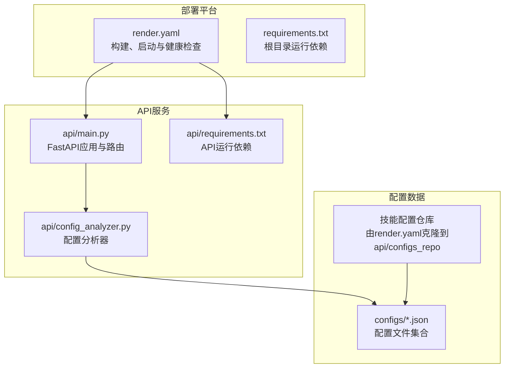
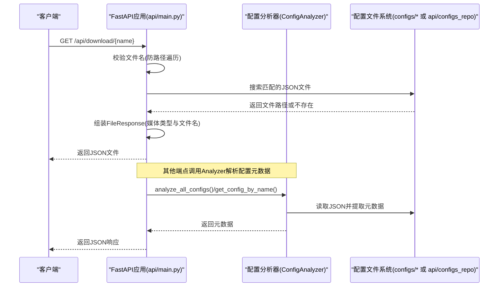
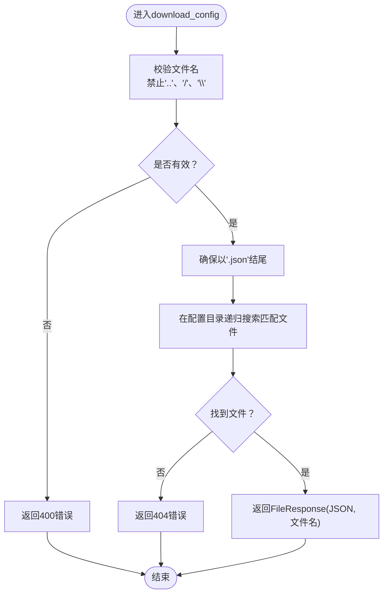
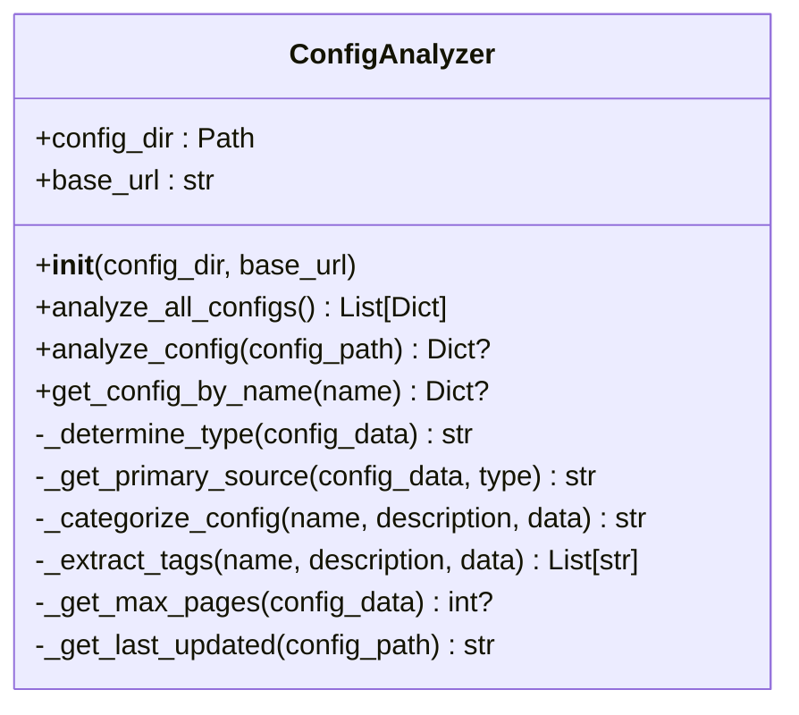
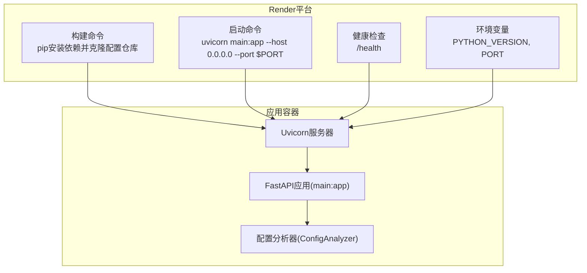
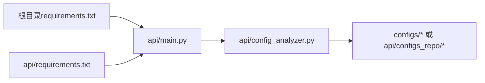

# API安全与部署

<cite>
**本文引用的文件**
- [api/main.py](file://api/main.py)
- [api/config_analyzer.py](file://api/config_analyzer.py)
- [render.yaml](file://render.yaml)
- [requirements.txt](file://requirements.txt)
- [api/requirements.txt](file://api/requirements.txt)
- [test_api.py](file://test_api.py)
- [configs/fastapi.json](file://configs/fastapi.json)
</cite>

## 目录
1. [简介](#简介)
2. [项目结构](#项目结构)
3. [核心组件](#核心组件)
4. [架构总览](#架构总览)
5. [详细组件分析](#详细组件分析)
6. [依赖关系分析](#依赖关系分析)
7. [性能考量](#性能考量)
8. [故障排查指南](#故障排查指南)
9. [结论](#结论)
10. [附录](#附录)

## 简介
本文件聚焦于API的安全机制与部署架构，围绕以下主题展开：
- CORS配置（allow_origins=['*']）及其安全影响
- 路径遍历防护机制（在download_config中对文件名进行校验）
- 错误处理策略（HTTP异常与统一错误响应）
- 部署架构（FastAPI应用、Uvicorn服务器与Render平台的健康检查）
- 生产环境部署配置（render.yaml中的构建、启动、环境变量与健康检查）
- 安全最佳实践（限制CORS来源、添加身份验证）

## 项目结构
该仓库包含一个独立的API子目录，其中定义了FastAPI应用、配置分析器以及渲染平台的部署配置文件。根目录提供了运行时依赖清单，便于理解整体技术栈。

图表来源
- [api/main.py](file://api/main.py#L1-L220)
- [api/config_analyzer.py](file://api/config_analyzer.py#L1-L349)
- [render.yaml](file://render.yaml#L1-L18)
- [requirements.txt](file://requirements.txt#L1-L44)
- [api/requirements.txt](file://api/requirements.txt#L1-L4)

章节来源
- [api/main.py](file://api/main.py#L1-L220)
- [api/config_analyzer.py](file://api/config_analyzer.py#L1-L349)
- [render.yaml](file://render.yaml#L1-L18)
- [requirements.txt](file://requirements.txt#L1-L44)
- [api/requirements.txt](file://api/requirements.txt#L1-L4)

## 核心组件
- FastAPI应用与路由：提供根信息、配置列表、分类统计、单个配置详情与下载接口，并内置健康检查端点。
- 配置分析器：递归扫描配置目录，解析JSON元数据，生成类型、类别、标签、下载链接等信息。
- CORS中间件：默认允许所有来源访问，便于前端跨域调用。
- 下载接口：对文件名进行严格校验，防止路径遍历攻击；仅允许JSON文件下载。
- 错误处理：统一抛出HTTP异常，返回标准错误信息。
- 部署配置：通过Render平台自动构建、拉取配置仓库并启动Uvicorn服务，同时配置健康检查。

章节来源
- [api/main.py](file://api/main.py#L1-L220)
- [api/config_analyzer.py](file://api/config_analyzer.py#L1-L349)
- [render.yaml](file://render.yaml#L1-L18)

## 架构总览
下图展示了从客户端请求到后端处理与配置文件读取的整体流程，以及部署层面对健康检查的支持。

图表来源
- [api/main.py](file://api/main.py#L167-L209)
- [api/config_analyzer.py](file://api/config_analyzer.py#L70-L171)

## 详细组件分析

### CORS配置与安全影响
- 当前实现：在应用初始化时添加CORS中间件，允许所有来源、凭据、方法与头。
- 安全影响：允许任意来源访问API，存在跨站请求伪造（CSRF）与跨域脚本风险。若API未来承载敏感数据或需要鉴权，应限制来源为可信域名。
- 建议改进：在生产环境将allow_origins从通配符改为白名单，例如仅允许特定前端域名；同时根据需要收紧allow_methods与allow_headers。

章节来源
- [api/main.py](file://api/main.py#L23-L31)

### 路径遍历防护机制
- 实现位置：download_config端点对config_name进行严格校验，拒绝包含“..”、路径分隔符等危险字符。
- 行为逻辑：若未以“.json”结尾则自动补全；随后在配置目录内递归查找匹配文件，找到第一个即返回；否则返回404。
- 风险控制：有效阻止通过相对路径穿越目录的行为，避免读取非预期文件。

图表来源
- [api/main.py](file://api/main.py#L167-L209)

章节来源
- [api/main.py](file://api/main.py#L167-L209)

### 错误处理策略
- 统一异常：各端点捕获内部异常并抛出HTTP异常，保证对外一致的错误格式与状态码。
- 典型场景：
  - 列表/分类/详情：解析失败返回500；未找到配置返回404。
  - 下载：非法文件名返回400；文件不存在返回404；其他异常返回500。
- 建议：在生产环境可引入更细粒度的异常映射与日志记录，便于监控与排障。

章节来源
- [api/main.py](file://api/main.py#L80-L110)
- [api/main.py](file://api/main.py#L112-L138)
- [api/main.py](file://api/main.py#L140-L165)
- [api/main.py](file://api/main.py#L167-L209)

### 配置分析器与数据流
- 功能职责：递归扫描配置目录，解析每个JSON文件，提取名称、类型、类别、标签、主源、最大页数、文件大小、最后更新时间与下载URL。
- 关键算法：
  - 类型判定：依据是否存在“sources”或“merge_mode”字段判断“单源/多源”。
  - 主源识别：根据类型选择文档、GitHub或PDF源。
  - 自动分类：基于名称关键词与描述关键词映射到预设类别。
  - 标签抽取：结合关键词与类型/来源特征生成标签集合。
  - 最后更新：优先使用Git提交时间，回退到文件修改时间。
- 性能特性：递归扫描所有JSON文件，复杂度近似O(N)（N为JSON文件数量）。建议在大规模配置集上启用缓存或增量更新策略。

图表来源
- [api/config_analyzer.py](file://api/config_analyzer.py#L1-L349)

章节来源
- [api/config_analyzer.py](file://api/config_analyzer.py#L70-L171)
- [api/config_analyzer.py](file://api/config_analyzer.py#L172-L349)

### 健康检查与部署架构
- 健康检查端点：/health，返回服务健康状态。
- 启动命令：Uvicorn直接运行api/main.py中的app对象，绑定0.0.0.0与Render注入的PORT。
- 构建流程：安装api/requirements.txt中的依赖，并克隆官方配置仓库到api/configs_repo，以便生产环境优先使用该仓库。
- 环境变量：PYTHON_VERSION固定版本，PORT由平台自动生成。
- 自动部署：开启autoDeploy，变更触发自动部署。

图表来源
- [render.yaml](file://render.yaml#L1-L18)
- [api/main.py](file://api/main.py#L217-L220)
- [api/requirements.txt](file://api/requirements.txt#L1-L4)

章节来源
- [render.yaml](file://render.yaml#L1-L18)
- [api/main.py](file://api/main.py#L211-L215)
- [api/main.py](file://api/main.py#L217-L220)

## 依赖关系分析
- 运行时依赖：根目录requirements.txt包含大量通用工具与测试依赖；API子目录requirements.txt明确声明FastAPI、Uvicorn与multipart支持。
- 应用依赖：api/main.py导入FastAPI、CORS中间件、FileResponse与HTTP异常；依赖api/config_analyzer.py提供的分析能力。
- 配置依赖：ConfigAnalyzer依赖配置目录（本地或远程仓库），用于解析JSON元数据。

图表来源
- [requirements.txt](file://requirements.txt#L1-L44)
- [api/requirements.txt](file://api/requirements.txt#L1-L4)
- [api/main.py](file://api/main.py#L1-L220)
- [api/config_analyzer.py](file://api/config_analyzer.py#L1-L349)

章节来源
- [requirements.txt](file://requirements.txt#L1-L44)
- [api/requirements.txt](file://api/requirements.txt#L1-L4)
- [api/main.py](file://api/main.py#L1-L220)
- [api/config_analyzer.py](file://api/config_analyzer.py#L1-L349)

## 性能考量
- 配置扫描：ConfigAnalyzer对所有JSON文件进行递归扫描与解析，复杂度近似O(N)。建议：
  - 在大规模配置集上增加缓存层（如内存缓存或Redis），减少重复解析。
  - 引入增量更新策略，仅在文件变更时重新解析。
- 并发与并发模型：FastAPI/Uvicorn默认异步处理请求，适合I/O密集型任务（如文件读取）。对于CPU密集型任务，建议拆分或使用进程池。
- 媒体传输：FileResponse按文件大小传输，建议在网关层启用压缩与缓存，降低带宽占用。

## 故障排查指南
- CORS相关问题
  - 症状：浏览器跨域请求被拒绝。
  - 排查：确认CORS中间件已正确加载；若为生产环境，检查allow_origins是否为通配符或白名单。
  - 参考路径：[api/main.py](file://api/main.py#L23-L31)
- 下载接口异常
  - 非法文件名：返回400，检查传入的config_name是否包含路径遍历字符。
  - 文件不存在：返回404，确认配置文件存在于配置目录且以.json结尾。
  - 参考路径：[api/main.py](file://api/main.py#L167-L209)
- 健康检查失败
  - 症状：平台健康检查失败。
  - 排查：确认/health端点可用；检查Uvicorn启动参数与PORT环境变量；确认构建命令成功克隆配置仓库。
  - 参考路径：[api/main.py](file://api/main.py#L211-L215)，[render.yaml](file://render.yaml#L1-L18)
- 配置解析错误
  - 症状：某些配置未出现在列表中。
  - 排查：检查JSON格式是否合法；确认包含必需字段；查看分析器日志输出。
  - 参考路径：[api/config_analyzer.py](file://api/config_analyzer.py#L91-L171)

章节来源
- [api/main.py](file://api/main.py#L23-L31)
- [api/main.py](file://api/main.py#L167-L209)
- [api/main.py](file://api/main.py#L211-L215)
- [render.yaml](file://render.yaml#L1-L18)
- [api/config_analyzer.py](file://api/config_analyzer.py#L91-L171)

## 结论
本项目在开发阶段提供了开放的CORS配置与便捷的配置下载能力，具备清晰的错误处理与健康检查机制。生产部署通过Render平台自动化完成，但当前CORS仍为通配符模式，建议尽快在生产环境限制来源并引入身份验证与更严格的访问控制策略，以提升整体安全性。

## 附录

### 安全最佳实践清单
- CORS限制
  - 将allow_origins从通配符改为可信域名白名单。
  - 仅暴露必要方法与头，避免使用通配符。
- 身份验证与授权
  - 为受保护端点添加认证中间件（如API密钥、OAuth或JWT）。
  - 对下载接口增加访问控制，限制IP或用户组。
- 输入校验与输出净化
  - 对所有外部输入进行严格校验与最小权限原则。
  - 对响应内容进行必要的脱敏与过滤。
- 日志与监控
  - 记录异常与可疑行为，接入告警系统。
  - 使用健康检查与指标监控保障服务稳定性。
- 部署加固
  - 使用HTTPS与TLS终止。
  - 在反向代理层启用WAF与速率限制。
  - 分离配置仓库与应用代码，最小化容器权限。

### 示例参考文件
- 配置样例：[configs/fastapi.json](file://configs/fastapi.json#L1-L34)
- 测试入口：[test_api.py](file://test_api.py#L1-L41)