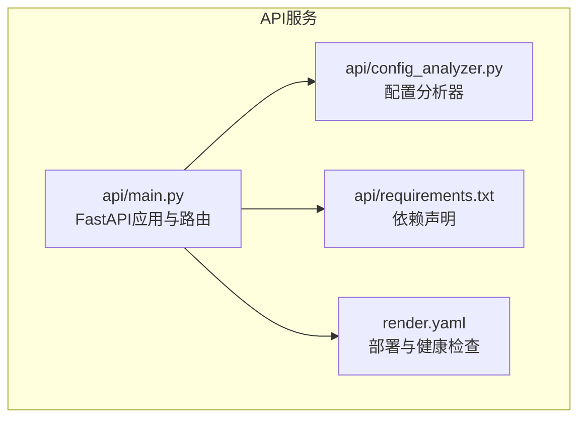
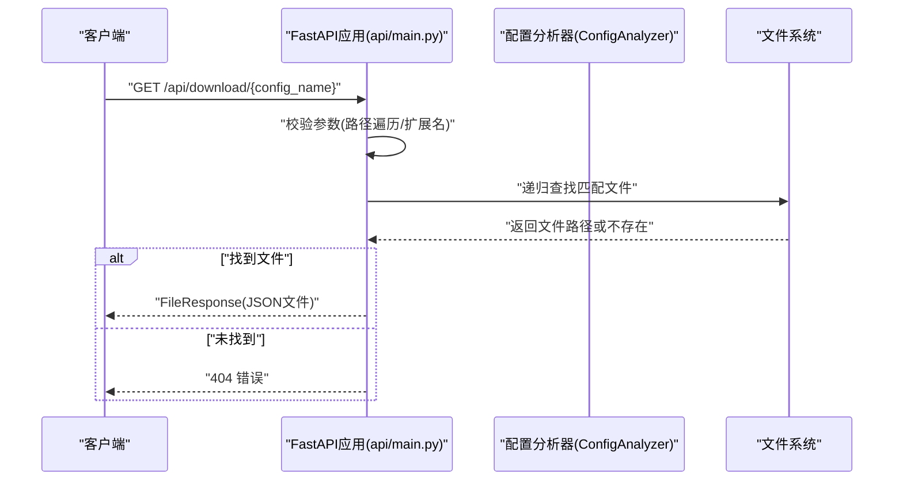
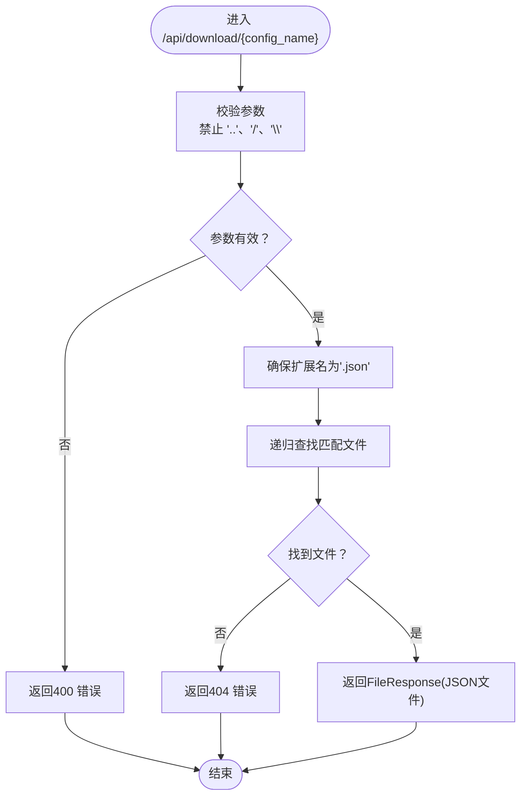
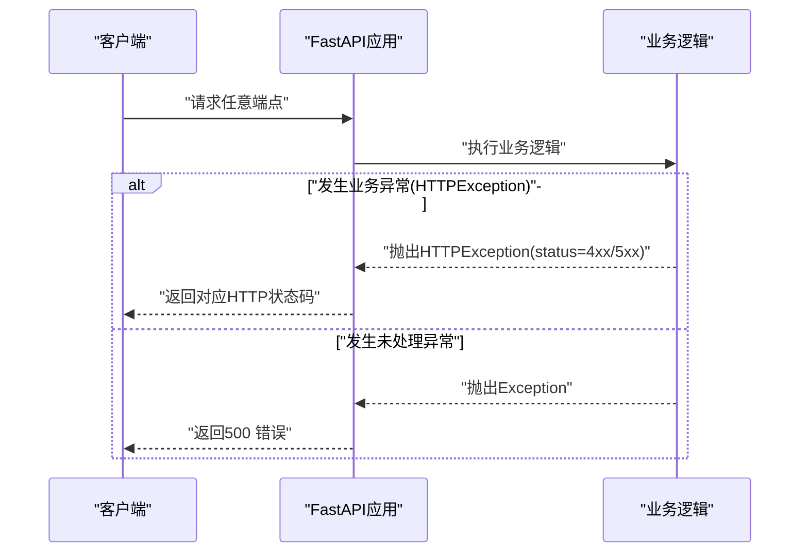
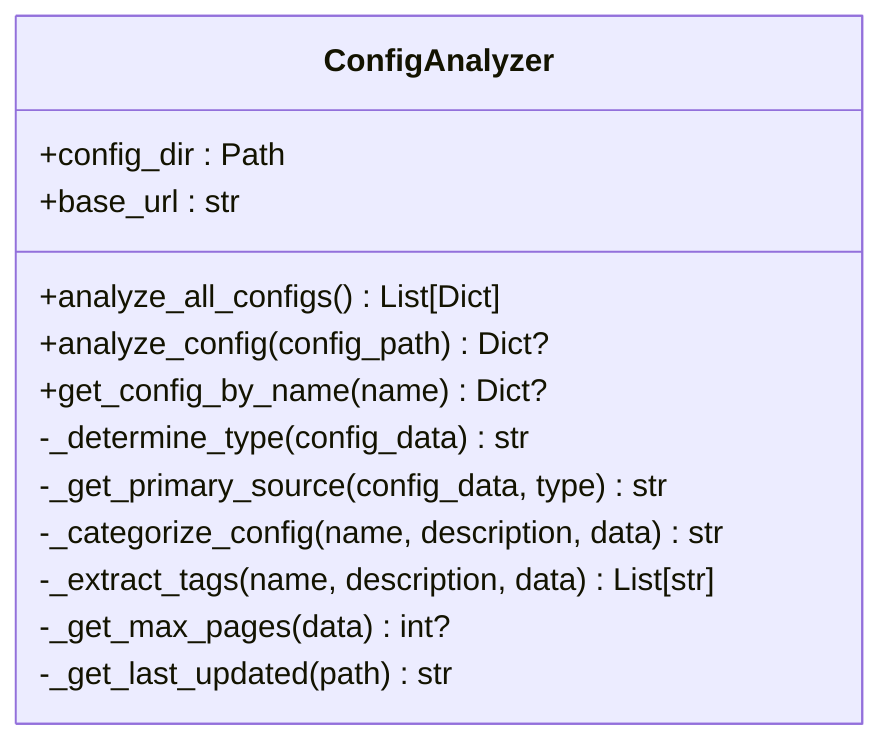
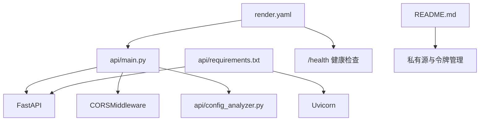

# API安全机制

<cite>
**本文引用的文件**
- [api/main.py](file://api/main.py)
- [api/config_analyzer.py](file://api/config_analyzer.py)
- [api/requirements.txt](file://api/requirements.txt)
- [render.yaml](file://render.yaml)
- [README.md](file://README.md)
</cite>

## 目录
1. [引言](#引言)
2. [项目结构](#项目结构)
3. [核心组件](#核心组件)
4. [架构总览](#架构总览)
5. [详细组件分析](#详细组件分析)
6. [依赖关系分析](#依赖关系分析)
7. [性能考量](#性能考量)
8. [故障排查指南](#故障排查指南)
9. [结论](#结论)
10. [附录](#附录)

## 引言
本文件聚焦于API的安全机制，围绕以下主题展开：
- 在 api/main.py 中实现的CORS配置（allow_origins=['*']）及其对公共API的开放性设计，并解释该配置在开发与生产环境中的安全权衡。
- download_config 端点中的路径遍历防护机制，包括对 '..'、'/' 和 '\' 的显式检查，以及如何防止恶意文件访问。
- 所有API端点的错误处理策略，包括 HTTPException 的使用与500错误的异常捕获机制。
- 安全最佳实践建议：在生产环境中限制CORS来源、添加身份验证中间件、使用HTTPS以及配置速率限制。
- 结合 config_analyzer.py 的配置分析功能，说明配置文件加载过程中的安全性考虑。

## 项目结构
API服务位于 api/ 目录，核心入口为 FastAPI 应用，CORS 中间件在应用启动时注册；配置分析器负责扫描并解析配置文件元数据；部署通过 render.yaml 进行健康检查与启动命令配置。

图表来源
- [api/main.py](file://api/main.py#L1-L40)
- [api/config_analyzer.py](file://api/config_analyzer.py#L1-L40)
- [api/requirements.txt](file://api/requirements.txt#L1-L4)
- [render.yaml](file://render.yaml#L1-L18)

章节来源
- [api/main.py](file://api/main.py#L1-L40)
- [api/requirements.txt](file://api/requirements.txt#L1-L4)
- [render.yaml](file://render.yaml#L1-L18)

## 核心组件
- CORS 中间件：在应用启动时注册，允许任意来源、凭证、方法与头，用于公开API的跨域访问。
- 配置分析器：递归扫描配置目录，解析JSON配置，提取元数据并生成下载链接。
- 下载端点：对请求参数进行路径遍历防护，限定扩展名并按名称递归查找目标文件。
- 错误处理：统一使用 HTTPException 抛出语义化错误码，捕获未处理异常并返回500。

章节来源
- [api/main.py](file://api/main.py#L24-L31)
- [api/main.py](file://api/main.py#L167-L209)
- [api/config_analyzer.py](file://api/config_analyzer.py#L70-L105)

## 架构总览
下图展示API服务的运行时交互：客户端请求进入FastAPI应用，经由CORS中间件放行后，路由分发到各端点；下载端点调用配置分析器以确定配置目录，再执行路径校验与文件查找，最终返回FileResponse。

图表来源
- [api/main.py](file://api/main.py#L167-L209)
- [api/config_analyzer.py](file://api/config_analyzer.py#L70-L105)

## 详细组件分析

### CORS配置与跨域策略
- 允许来源：['*']
- 凭据：允许
- 方法：['*']
- 头：['*']

该配置使API对浏览器端的跨域请求完全放开，便于前端直接访问公开的配置列表、详情与下载接口。在开发环境（本地或内网）中，这种宽松策略能简化联调；但在生产环境中，建议限制 allow_origins 到可信域名，避免被恶意站点滥用。

章节来源
- [api/main.py](file://api/main.py#L24-L31)

### 路径遍历防护与下载流程
download_config 端点包含多层防护与校验：
- 参数校验：拒绝包含 '..'、'/' 或 '\' 的配置名，防止目录穿越。
- 扩展名校验：若未以 '.json' 结尾，则自动追加扩展名。
- 文件查找：在配置目录下递归查找匹配文件，命中首个即停止。
- 存在性校验：若找不到文件则返回404。
- 响应类型：返回JSON文件，设置媒体类型与文件名。

图表来源
- [api/main.py](file://api/main.py#L167-L209)

章节来源
- [api/main.py](file://api/main.py#L167-L209)

### 错误处理策略
- 统一使用 HTTPException 抛出业务错误（如404、400），并在异常链路中保持语义化状态码。
- 捕获未处理异常并转换为500错误，向客户端返回通用错误信息，避免泄露内部细节。
- 各端点均采用 try/except 包裹核心逻辑，保证错误处理的一致性。

图表来源
- [api/main.py](file://api/main.py#L81-L109)
- [api/main.py](file://api/main.py#L134-L138)
- [api/main.py](file://api/main.py#L163-L165)
- [api/main.py](file://api/main.py#L205-L209)

章节来源
- [api/main.py](file://api/main.py#L81-L109)
- [api/main.py](file://api/main.py#L134-L138)
- [api/main.py](file://api/main.py#L163-L165)
- [api/main.py](file://api/main.py#L205-L209)

### 配置分析与加载安全性
- 目录选择：优先使用 api/configs_repo/official（生产），回退到 configs（本地开发）。
- 递归扫描：对所有子目录下的 .json 文件进行解析，跳过无效文件并记录警告。
- JSON解析：对非法JSON进行捕获并返回空元数据，避免中断整体分析。
- 下载链接：基于 base_url 生成下载地址，确保对外暴露的链接格式一致。

图表来源
- [api/config_analyzer.py](file://api/config_analyzer.py#L56-L171)
- [api/config_analyzer.py](file://api/config_analyzer.py#L172-L349)

章节来源
- [api/config_analyzer.py](file://api/config_analyzer.py#L56-L171)
- [api/config_analyzer.py](file://api/config_analyzer.py#L172-L349)

## 依赖关系分析
- 应用依赖 FastAPI 与 Uvicorn，CORS 中间件来自 fastapi.middleware.cors。
- 部署通过 render.yaml 指定构建与启动命令，健康检查路径为 /health。
- README 提供了私有配置仓库与认证令牌的使用场景，强调 HTTPS 与令牌管理的重要性。

图表来源
- [api/main.py](file://api/main.py#L1-L40)
- [api/requirements.txt](file://api/requirements.txt#L1-L4)
- [render.yaml](file://render.yaml#L1-L18)
- [README.md](file://README.md#L399-L486)

章节来源
- [api/requirements.txt](file://api/requirements.txt#L1-L4)
- [render.yaml](file://render.yaml#L1-L18)
- [README.md](file://README.md#L399-L486)

## 性能考量
- 路由与中间件开销：CORS 中间件对每个请求进行预检与放行判断，宽松配置会减少跨域失败重试，但也会增加潜在的跨域攻击面。
- 文件扫描：递归扫描配置目录可能带来IO开销，建议在生产环境将配置目录固定且规模可控，必要时引入缓存或索引。
- 响应类型：下载端点返回JSON文件，注意客户端缓存与断点续传支持（当前实现未包含Range请求处理）。

## 故障排查指南
- CORS相关问题
  - 症状：浏览器报跨域错误或预检失败。
  - 排查：确认 allow_origins 是否为 ['*'] 或包含具体域名；生产环境建议缩小范围。
  - 参考：[api/main.py](file://api/main.py#L24-L31)
- 下载端点404
  - 症状：请求 /api/download/{name} 返回404。
  - 排查：确认配置名是否包含 '..'、'/' 或 '\'；确认文件扩展名为 .json；确认文件存在于配置目录中。
  - 参考：[api/main.py](file://api/main.py#L167-L209)
- 500错误
  - 症状：服务器内部错误。
  - 排查：查看日志定位异常堆栈；确认配置文件是否为合法JSON；确认配置目录存在且可读。
  - 参考：[api/main.py](file://api/main.py#L81-L109), [api/main.py](file://api/main.py#L134-L138), [api/main.py](file://api/main.py#L163-L165), [api/main.py](file://api/main.py#L205-L209), [api/config_analyzer.py](file://api/config_analyzer.py#L149-L155)
- 健康检查
  - 症状：部署平台无法探测服务存活。
  - 排查：确认 /health 端点可达且返回健康状态。
  - 参考：[render.yaml](file://render.yaml#L16-L18), [api/main.py](file://api/main.py#L211-L215)

章节来源
- [api/main.py](file://api/main.py#L24-L31)
- [api/main.py](file://api/main.py#L167-L209)
- [api/main.py](file://api/main.py#L81-L109)
- [api/main.py](file://api/main.py#L134-L138)
- [api/main.py](file://api/main.py#L163-L165)
- [api/main.py](file://api/main.py#L205-L209)
- [api/config_analyzer.py](file://api/config_analyzer.py#L149-L155)
- [render.yaml](file://render.yaml#L16-L18)

## 结论
- CORS配置在开发阶段提供了便利，但在生产环境中应收紧来源白名单，降低跨域滥用风险。
- download_config 端点已具备基础的路径遍历防护与扩展名校验，建议进一步限制允许的来源与IP段，并在必要时添加速率限制。
- 错误处理策略统一且清晰，建议在生产环境记录更详细的错误上下文，同时避免向客户端泄露敏感信息。
- 配置分析器对JSON解析与目录扫描进行了健壮性处理，建议在生产环境固定配置目录并启用只读权限，防止意外修改。

## 附录

### 生产环境安全最佳实践清单
- CORS来源限制：仅允许受信域名，避免使用 ['*']。
- 身份验证与授权：为需要保护的端点添加认证中间件（如API密钥、OAuth或JWT）。
- HTTPS强制：启用TLS，确保传输层安全与证书校验。
- 速率限制：为公共端点配置限流策略，防止单用户或IP过度占用资源。
- 输入验证：对所有外部输入进行严格校验与白名单过滤。
- 最小权限原则：配置目录使用只读权限，避免写入操作。
- 日志与监控：记录访问日志与错误事件，配合告警系统及时发现异常。

### 与配置分析相关的安全注意事项
- 配置目录来源：生产环境优先使用 api/configs_repo/official，避免直接暴露本地开发目录。
- JSON解析容错：对非法JSON进行捕获并跳过，防止影响整体服务稳定性。
- 下载链接生成：基于 base_url 生成下载地址，确保对外暴露的链接格式一致且可控。

章节来源
- [api/config_analyzer.py](file://api/config_analyzer.py#L56-L171)
- [README.md](file://README.md#L399-L486)